## Estrutura

A funcionalidade de busca em portais web será exibida através de um campo de entrada de texto no cabeçalho da página web. Este campo de busca deverá vir com texto explicativo, ou Placeholder, e ícone de lupa da biblioteca de ícones do Font Awesome.

---

## Estados

### Estado Normal

No estado normal a busca é apresentada no canto direto do cabeçalho, contendo texto explicativo, ou Placeholder, e ícone de lupa da família de ícones do Font Awesome.

### Estado Focus

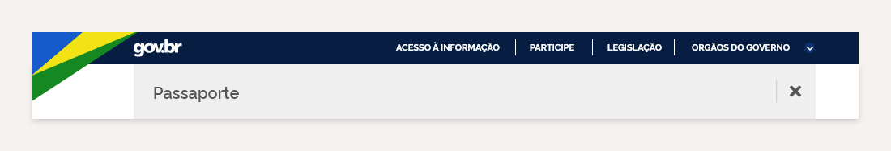

Ao receber o foco, este campo de busca assumirá toda a largura do cabeçalho, provendo espaço suficiente para digitação do texto a ser pesquisado. Com o foco ativo, o ícone de lupa será substituído pelo ícone Times da biblioteca de ícones do Font Awesome, que terá a função de cancelar a ação de busca.

---

## Estados Resultado de Busca

### Quantidade de resultados da busca com categorias

O resultado de busca com categorias será exibido em formato de abas, com o indicador quantitativo do número de resultados por categoria.

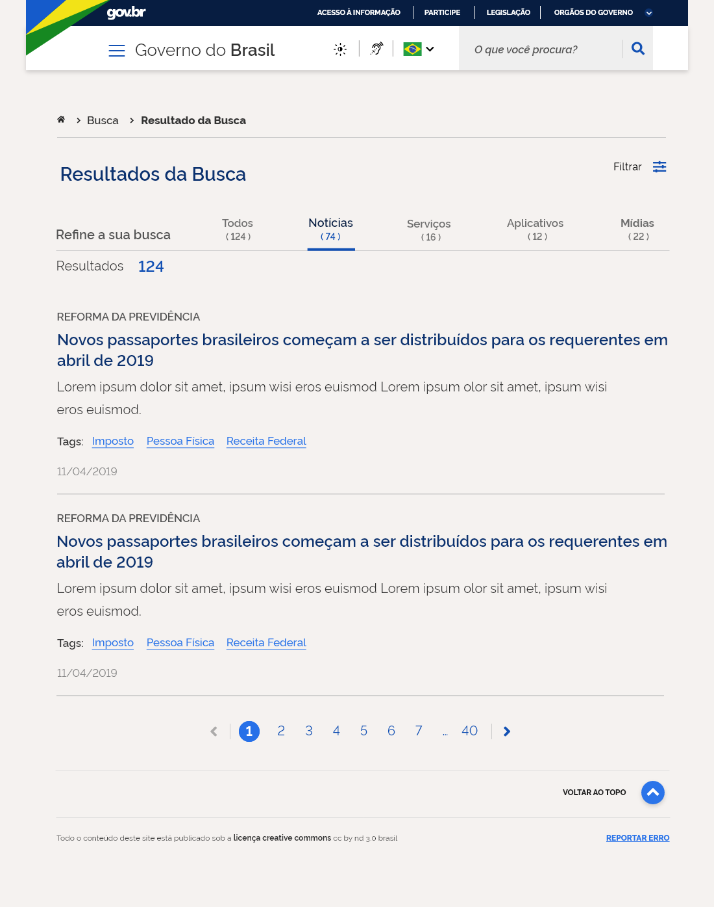

---

## Estados | Filtros no Resultado de Busca

### Filtros na versão Desktop

Na versão Desktop, os filtros do resultado de busca serão apresentados numa coluna à esquerda. Os botões para aplicar e limpar os filtros serão posicionados ao final dos parâmetros.

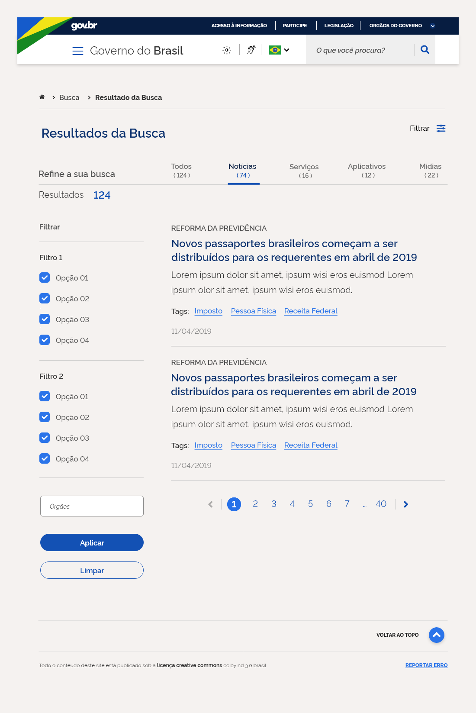

### Filtros na versão Tablet

Na versão para Tablets, os filtros serão exibidos a partir do acionamento pelo ícone Filtrar, que apresenta-se posicionado no canto à direita. Ao ser acionado, os parâmetros serão exibidos numa janela flutuante e poderão ser ocultados através do clique no ícone fechar, como mostrado no exemplo abaixo.

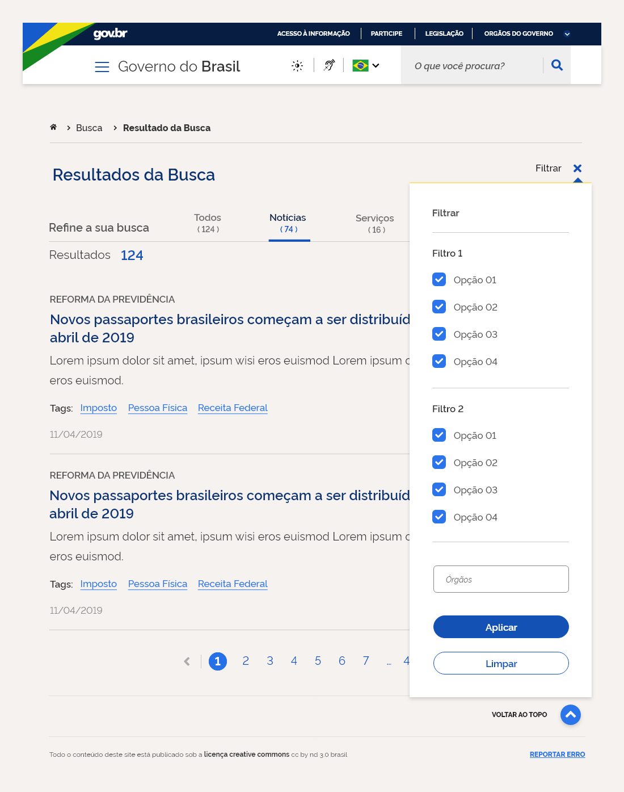

OBS: Para os filtros nas versões de smartphones, ver a documentação de busca em dispositívos móveis.

---

## Estados | Autocomplete

### Autocomplete | Lista Sugestiva em Dropdown

A busca deverá vir com a funcionalidade de autocomplete. Durante a ação de digitar o sistema deverá trazer as opções de buscas mais próximas ao texto digitado. A lista sugestiva poderá ser apresentada num elemento Dropdown, como mostra o exemplo abaixo.

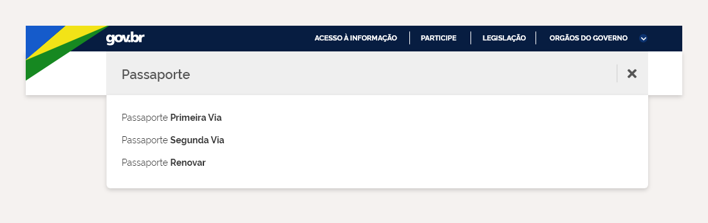

### Autocomplete | Lista Sugestiva na Página

A lista sugestiva também poderá ser exibida diretamente na página, sendo modificada dinamicamente a medida que o ususário for digitando a palavra-chave, como mostrado no exemplo abaixo.

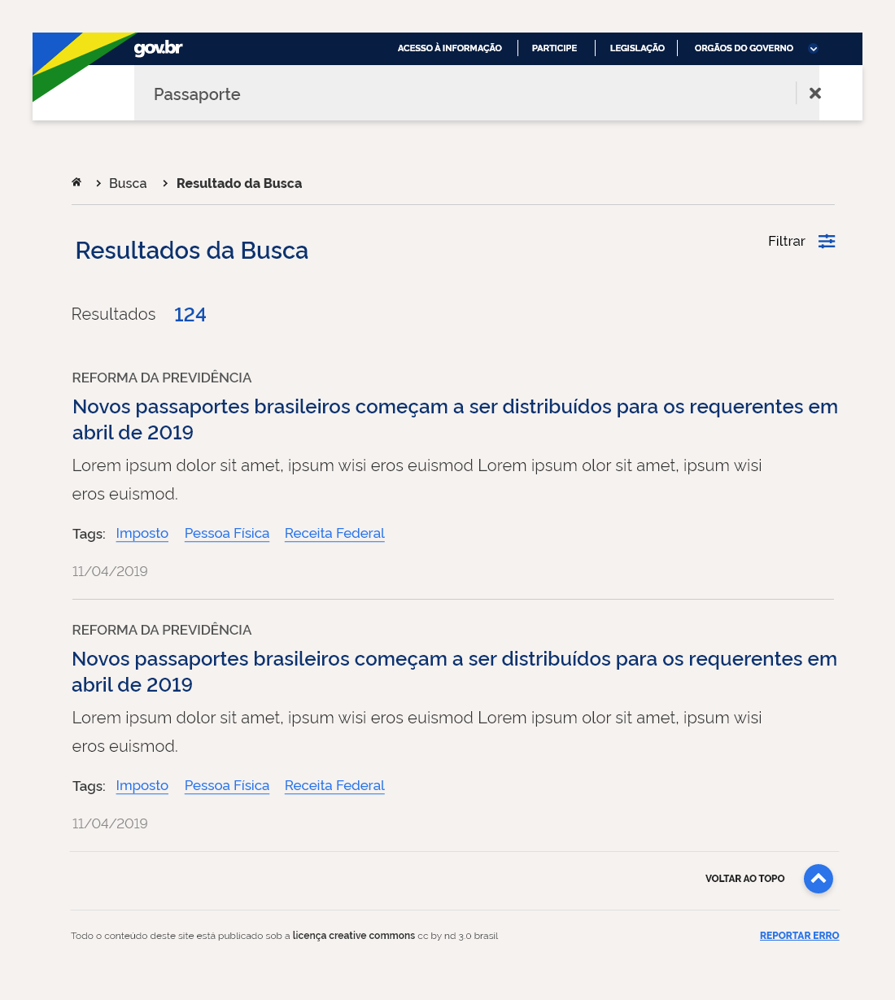

---

## Anatomia

### Tom de Voz

O tom de voz do Campo de Busca é o mesmo utilizado no componente Input Text.

### Espaçamento

Os espaçamentos utilizados serão os mesmos definidos no componente de Input Text.

### Alinhamento

Os textos de Label e Placeholder deverão ser alinhados à esquerda.

### Tipografia e Cores

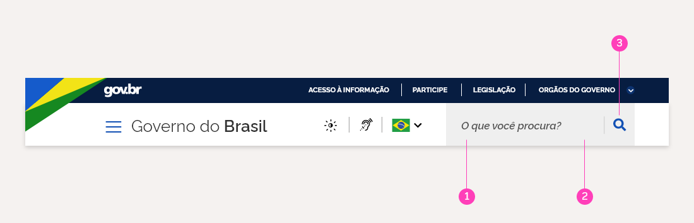

#### 1 | Placeholder

Rawline 16,8pt SemiBold Italic | Alinhado à esquerda | #555555

#### 2 | Campo de Busca

Background #EFEFEF

#### 3 | Ícone de Busca

Font Awesome | Search | #1351B4

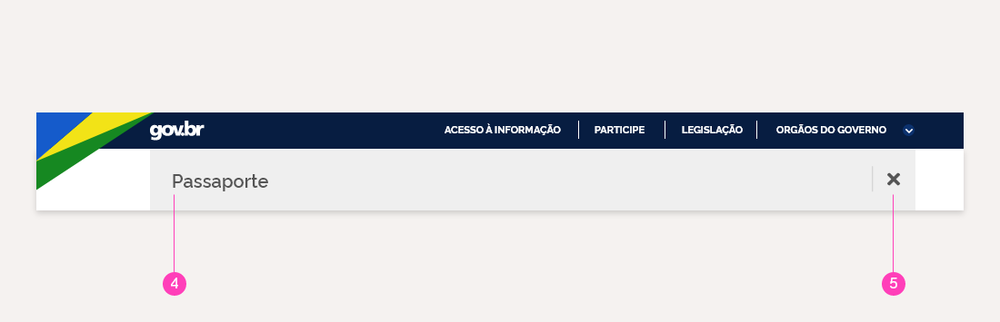

#### 4 | Texto do Campo de Busca

Rawline 20,16pt SemiBold | Alinhado à esquerda | #555555

#### 5 | Ícone Fechar

Font Awesome | Times | #555555

#### 6 | Lista Sugestiva

Rawline 14pt Regular | Alinhado à esquerda | #333333

#### 7 | Palavra em Destaque

Rawline 14pt Bold | Alinhado à esquerda | #333333

---

# Template de Busca em Sistemas

## Estrutura

A funcionalidade de busca num sistema deve conter um campo de entrada de texto, label indicativo da funcionalidade, texto de explicativo (PlaceHolder) no campo de entrada de dados, ícone de lupa para acionamento da funcionalidade e botão com a opção de Busca Avançada.

Haverá situações em que a busca será acionada dinamicamente, já exibindo o resultado em tela durante o momento da digitação. Nesses casos não haverá necessidade de se utilizar o botão "Buscar" ou o ícone de lupa clicável. Sendo assim, o ícone de lupa aparecerá alinhado à esquerda na tonalidade cinza, apenas com a função figurativa, diferenciando o campo de busca dos demais.

---

## Estados

### Estado Normal

O campo de busca deve ter uma entrada de texto de pelo menos 27 caracteres para acomodar a maioria das consultas e não ocupar muito espaço na tela. Porém a caixa de busca é crescente - expande para direita o campo de entrada de texto ao clicar.

### Estado Focus

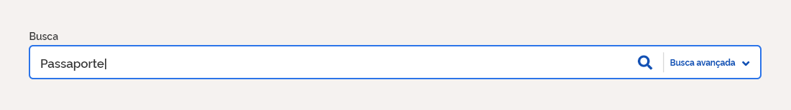

Com o foco o campo de busca passa apresentar um contorno de 2px com a cor #2B74E9. O mesmo expande até atingir a largura completa da página proporcionando maior espaço para o texto que será digitado.

### Autocomplete

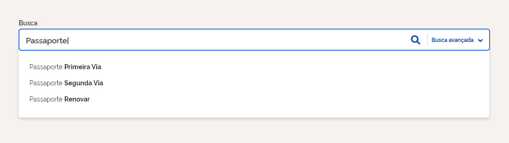

A busca deverá vir com a funcionalidade de auto complete. Durante a ação de digitar o sistema deverá trazer as opções de buscas mais próximas ao texto digitado. A lista sugestiva poderá ser apresentada num elemento Dropdown, como mostra o exemplo acima.

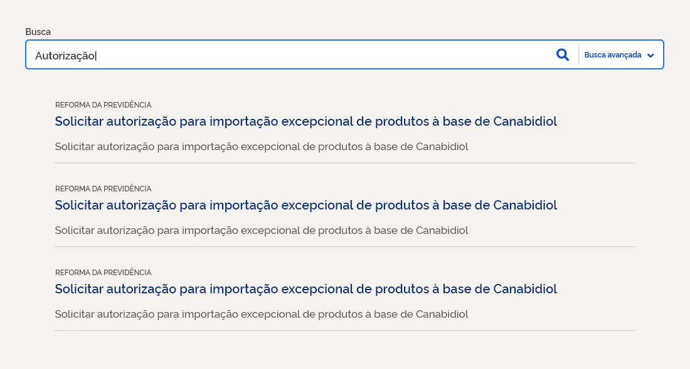

A lista sugestiva também poderá ser exibida diretamente na página, sendo modificada dinamicamente a medida que o ususário for digitando a palavra-chave, como mostrado no exemplo acima.

---

## Estados | Resultado de Busca

### Quantidade de resultados da busca sem categorias

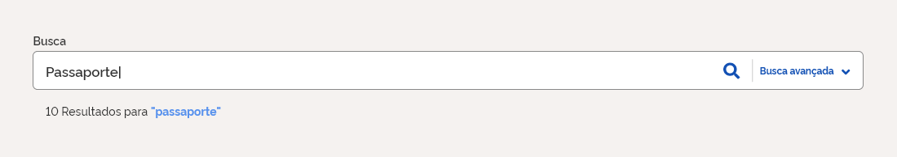

Para os resultados de busca sem categoria, será apresentado o quantitativo dos resultados encontrados para a palavra-chave pesquisada e a mesma deverá aparecer em destaque com 14px de tamanho, bold e cor #5992ED. O resultado aparecerá em uma lista única.

### Quantidade de resultados da busca com categorias

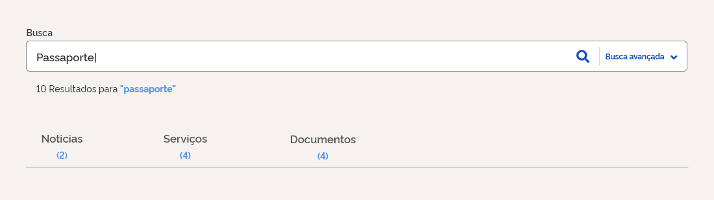

Para o reasultado de busca com categorias, o resultado será apresentado em abas e o indicador quantitativo em cada uma delas como mostra o exemplo acima.

### Quantidade de resultados da busca com subcategorias

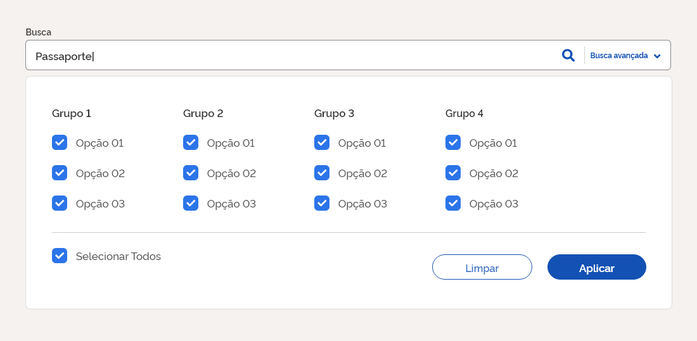

Para o resultado de busca com subcategorias, serão exibidos campos de checkbox para seleção das mesmas. Também um botão para aplicar o filtro destas subcategorias, um botão para limpar as seleções e outro para seleção de todos os itens.

### Busca com filtro (Select) para resultados de tabela

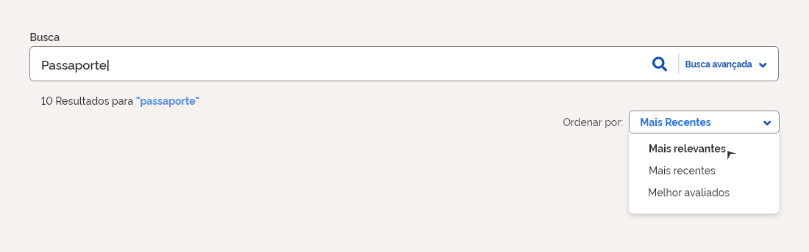

Para o resultado de busca com subcategorias, serão exibidos campos de checkbox para seleção das mesmas. Também um botão para aplicar o filtro destas subcategorias, um botão para limpar as seleções e outro para seleção de todos os itens.

### Busca avançada

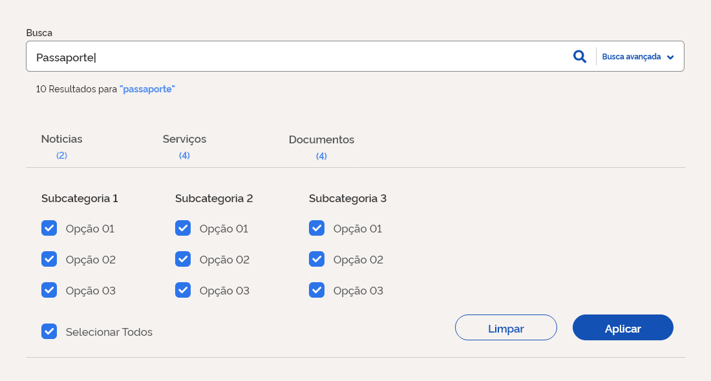

Os parâmetros da busca avançada poderão ser acessados a partir do botão à direita do campo de entrada de texto. Esses parâmentros serão exibidos/ocultados em um box logo abaixo do campo de texto. Haverá opção para selecionar todos, limpar e o botão para o acionamento da busca como mostrado no exemplo acima.

---

## Anatomia

### Tom de Voz

O tom de voz do Campo de Busca é o mesmo utilizado no componente Input Text.

### Espaçamento

Os espaçamentos utilizados serão os mesmos definidos no componente de Input Text.

### Alinhamento

Os textos de Label e Placeholder deverão ser alinhados à esquerda.

### Tipografia e Cores

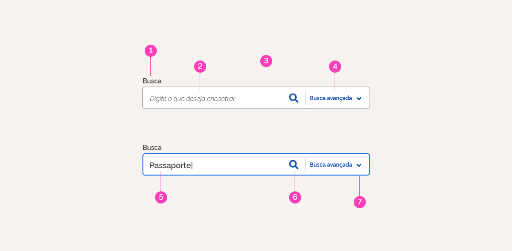

#### 1 | Label

Rawline 14px Semibold | Alinhado à esquerda | #555555

#### 2 | Placeholder

Rawline 14px Italic | Alinhado à esquerda | #555555

#### 3 | Borda Campo de Busca

1px solid #888888

#### 4 | Busca Avançada

Rawline 11,67px Bold | Alinhado à esquerda | #1351B4

#### 5 | Texto Input

Rawline 16,8px Semibold | Alinhado à esquerda | #333333

#### 6 | Ícone Busca

Ícone do tipo Search do Font Awesome | #1351B4

#### 7 | Borda do Campo com Foco

2px solid #2B74E9

---

# Template de Busca em Dispositivos Móveis

## Estrutura

Nos dispositivos móveis, a funcionalidade de busca estará sempre presente na barra de cabeçalho. Seja um aplicativo nativo ou website no formato responsivo, o ícone para acionar a funcionalidade de busca aparecerá sempre no canto à direita. Ao ser acionado, será exibido o campo de entrada de texto, como demonstrado no exemplo abaixo.

---

## Estados

### Estado Normal

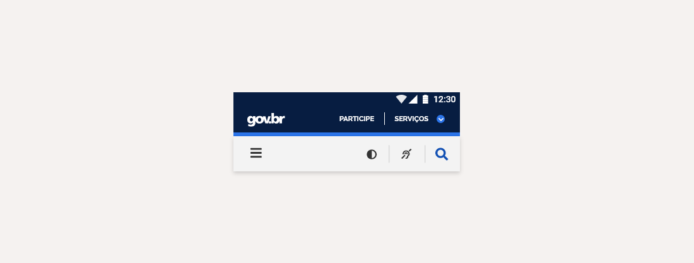

No estado normal, a busca será acinada a partir do ícone no canto direito da barra de cabeçalho.

### Estado Focus

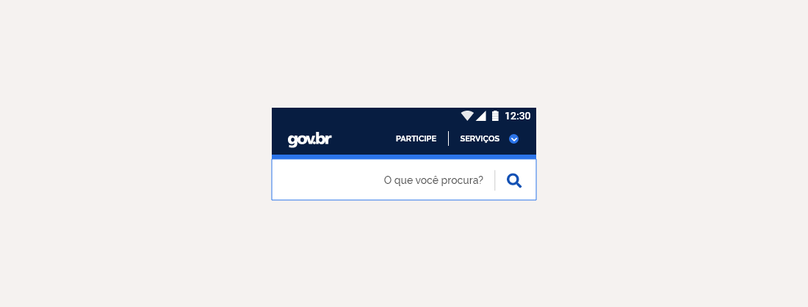

No estado focus, o campo de entrada de texto aparecerá após o touch no ícone do cabeçalho. Este deverá ocupar toda largura e altura proporcional a 56px. Também deverá receber o foco e a cor da borda passará a ser **#2B74E9**.

### Autocomplete

A função de autocomplete deverá ser acionada no momento da digitação do texto e exibirá as sugestões mais próximas à palavra-chave digitada. A lista sugestiva poderá ser apresentada num elemento Dropdown. A lista sugestiva também poderá ser exibida diretamente na página, sendo modificada dinamicamente a medida que o ususário for digitando a palavra-chave. Segue o exemplo abaixo:

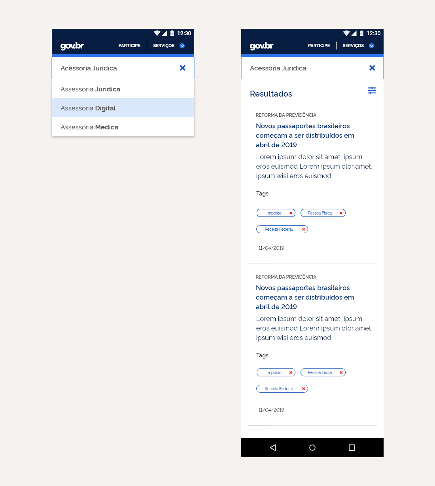

### Resultado com Categorias

O resultado de pesquisa em dispositivos móveis poderá vir categorizado. Desta forma, as categorias deverão vir separadas em abas e com o indicativo da quantidade de resultados em cada uma delas, como mostra o exemplo abaixo.

### Filtros

Após a exibição do conteúdo de pesquisa, poderá haver a necessidade de filtrar esta informação. Para isto, nos dispositivos móveis, o usuário poderá acionar este filtro através do ícone correspondente no canto superior direito e selecionar os parâmetros como mostrado nos exemplos abaixo.

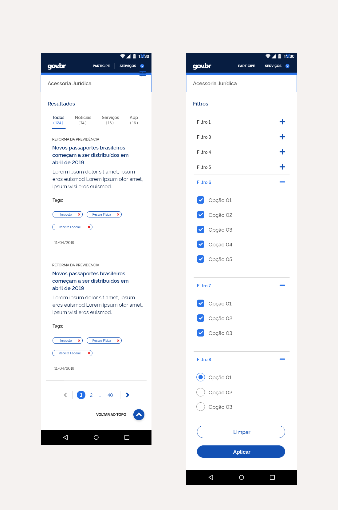

**OBS:** As especificações de construção referentes ao conteúdo do resultado de pesquisa e filtros poderão ser visualizadas nas seções: Abas, Acordeon, Checkbox, Radio Button e Button.

---

## Anatomia

### Tom de Voz

O tom de voz do Campo de Busca é o mesmo utilizado no componente Input Text.

### Espaçamento

Os espaçamentos utilizados serão os mesmos definidos no componente de Input Text.

### Alinhamento

Os textos sugestivos do autocomplete e o texto digitado no Input Text deverão estar alinhados à esquerda. Já o Placeholder deverá estar alinhado à direita.

### Tipografia e Cores

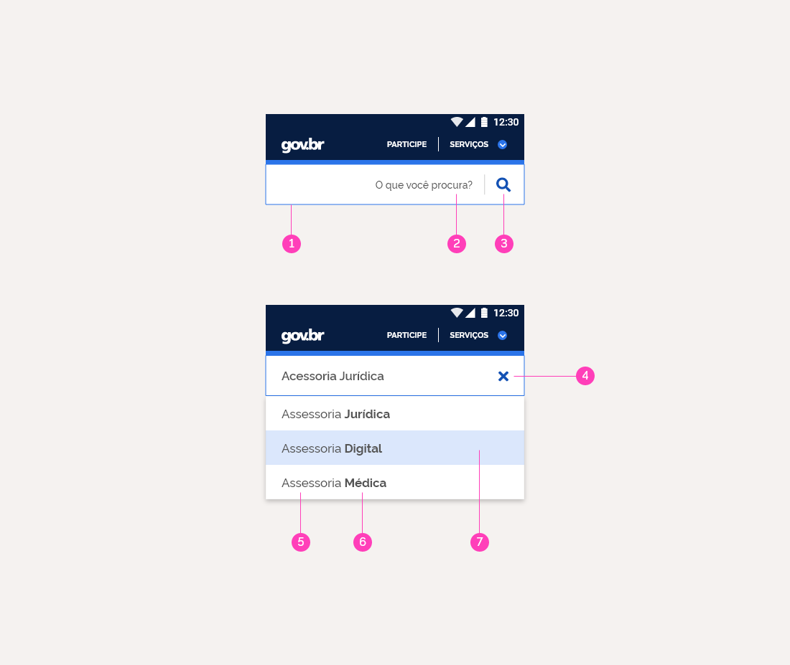

#### 1 | Borda do Campo de Busca

Borda Sólida 1px #2B74E9

#### 2 | Placeholder

Rawline Italic 14px Medium | Alinhado à direita | #555555

#### 3 | Ícone de Busca Search

Font Awesome| Alinhado à direita | #1351B4

#### 4 | Ícone Fechar Times

Font Awesome | Alinhado à direita | #1351B4

#### 5 | Texto Sugestivo

Rawline 16,8px Medium | Alinhado à esquerda | #555555

#### 6 | Texto Sugestivo - Palavra em Destaque

Rawline 16,8px Bold | Alinhado à esquerda | #555555

#### 7 | Cor de Fundo do Item - Mouse Over

Cor #DBE7FC
