[version]: # (6.0.9)

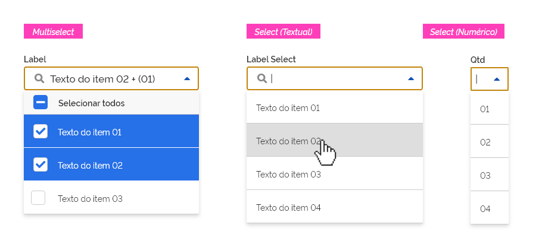
*Exemplo do componente _select_.*

A função do componente _select_ é coletar informações fornecidas pelo usuário em uma lista de opções. Utilize o componente _select_ quando um usuário precisar escolher uma ou mais opções em uma lista.

---

### Tom e voz

- Ordene os itens de forma lógica para facilitar a visualização das opções pelo usuário (Ex: ordem alfabética, cronológica, etc.).
- Se possível torne padrão a opção mais escolhida pelos usuários.

---

## Anatomia

1. Componente _input_;
2. Componente _button_;
3. Componente _list_;
4. Modos de seleção;
5. Ícone _search_ (opcional).

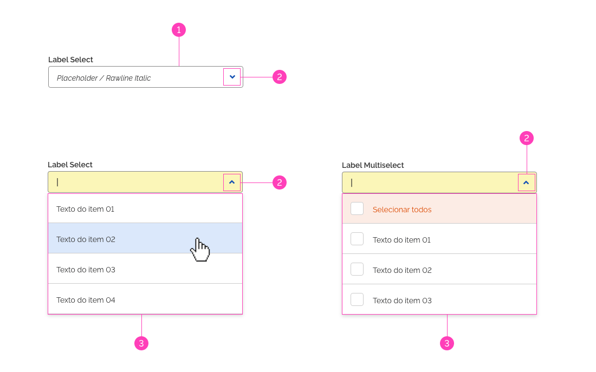
*Anatomia do componente _select_.*

### 1. Componente _input_

É o campo de entrada de texto onde o usuário poderá digitar o texto do item escolhido ou selecionar através do _mouse_. Ao clicar no componente _input_, este assumirá seu estado foco e o cursor ficará ativo em seu interior habilitando a funcionalidade de filtro de pesquisa por _autocomplete_.

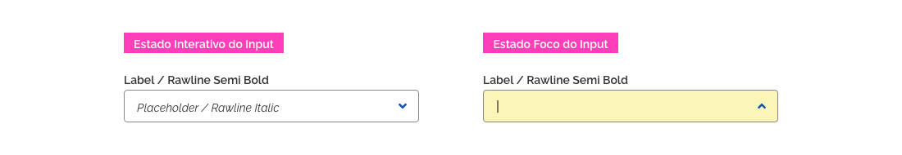
*Detalhamento da seleção pelo _input_ do filtro de pesquisa por autocomplete.*

### 2. Componente _button_

É um botão terciário que tem a função de acionar a exibição ou ocultação da lista _dropdown_, apresentando um _feedback_ visual através da alternância em seu ícone interno, através de um comportamento de _toggle_. Este botão deve estar posicionado na extremidade direita ao componente _input_. Para maiores informações consultar o documento Padrão _Dropdown_.

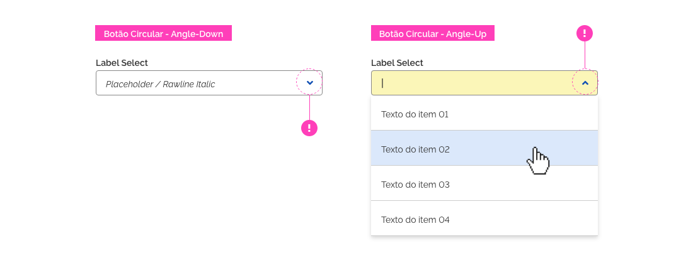
*Detalhe do uso do botão terciário para abrir/fechar a lista _dropdown_.*

### 3. Componente _list_

O componente _list_ deve apresentar os itens a serem escolhidos pelo usuário. No tipo _multiselect_, o usuário poderá incluir ou remover mais de um item por meio do _checkbox_. Cada item selecionado assumirá o estado selecionado.

*Exemplos de componente _select_ padrão e _multiselect_.*

#### Sombra no componente _list_

O componente _list_ será apresentado flutuando sobre a tela e uma sombra deve ser utilizada para proporcionar contraste entre o componente e o conteúdo de tela ao fundo. Para maiores informações consultar o fundamento visual Elevação.

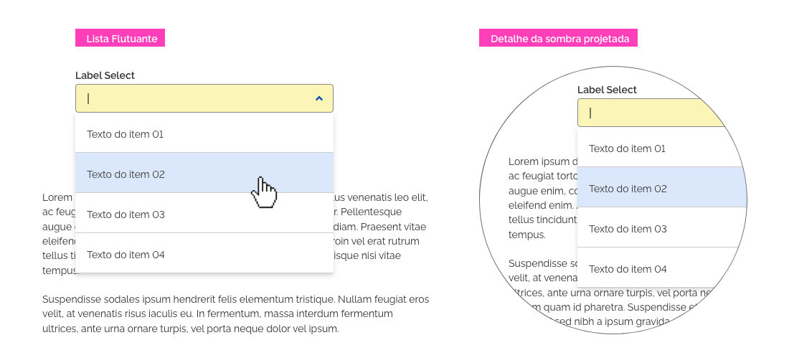
*Detalhe do uso de sombra no componente _list_.*

### 4. Modos de seleção

Existem três formas de realizar a seleção no componente _Multiselect_. São elas:

#### Seleção total

Permite ao usuário fazer, com um único acionamento, a seleção de todos os itens da lista do _multiselect_.

#### Seleção intermediária

Funciona como um _feedback_ visual, sendo exibido quando existir, tanto item(ns) selecionado(s), quanto não selecionados.

#### Sem seleção

Permite ao usuário fazer a desseleção de todos os itens da lista previamente selecionados.

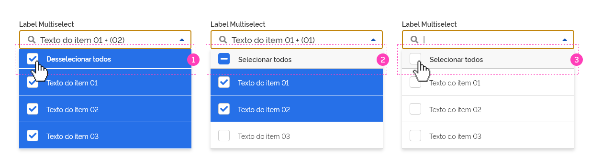
*À esquerda, exemplo do componente _multiselect_ com todos os itens selecionados, ao centro com alguns itens selecionados e à direita com todos os itens desselecionados.*

### 5. Ícone _search_ (opcional)

O uso do ícone _search_ é por padrão exibido nos componentes _select_ e _multiselect_, no entanto o seu uso **não é obrigatório**. Em determinadas situações, onde as informações textuais são muito reduzidas, por exemplo, o ícone _search_ poderá ser retirado.

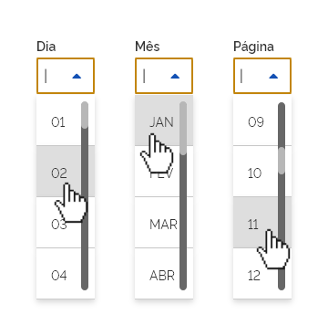
*Exemplo da retirada do ícone _search_ em um componente _select_ para uma melhor adequação de espaço.*

---

## Tipos

O componente pode ser do tipo:

- _Select_;
- _Multiselect_.

### Tipo _select_

O tipo _select_ é utilizado para as opções de seleção única. O item selecionado será apresentado no "Campo de Entrada de Texto" seguindo as diretrizes do componente _input_.

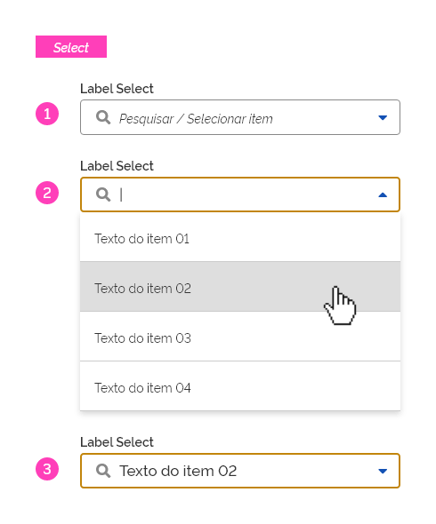
*Exemplo de uso do componente _select_.*

### Tipo _multiselect_

Caso seja necessário oferecer múltiplas seleções, deve-se utilizar o tipo _multiselect_. As opções selecionadas serão apresentadas no "Campo de Entrada de Texto", seguindo as diretrizes de exibição do componente _input_.

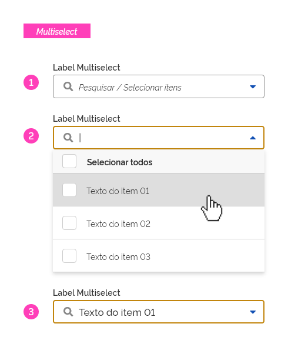

---

## Comportamento

### 1. Seleção dos itens

Ao selecionar os itens no componente _select_ e _multiselect_, o usuário terá essa informação visível no campo campo de entrada, conforme a sequência de cada tipo abaixo:

#### Seleção de itens no _select_

1. O _placeholder_ exibe a informação inicial;
2. O usuário seleciona o item;
3. O campo de entrada exibe a opção selecionada.

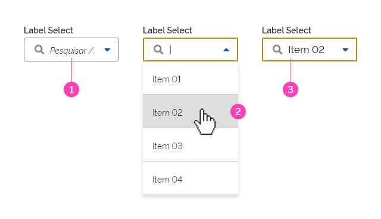
*Exemplo do comportamento de seleção de um item do _select_.*

#### Seleção de itens no _multiselect_

1. O _placeholder_ exibe a informação inicial;
2. O usuário seleciona os itens;
3. O campo de entrada exibe as opções selecionadas em tempo real;
4. O campo de entrada exibe as opções escolhidas.

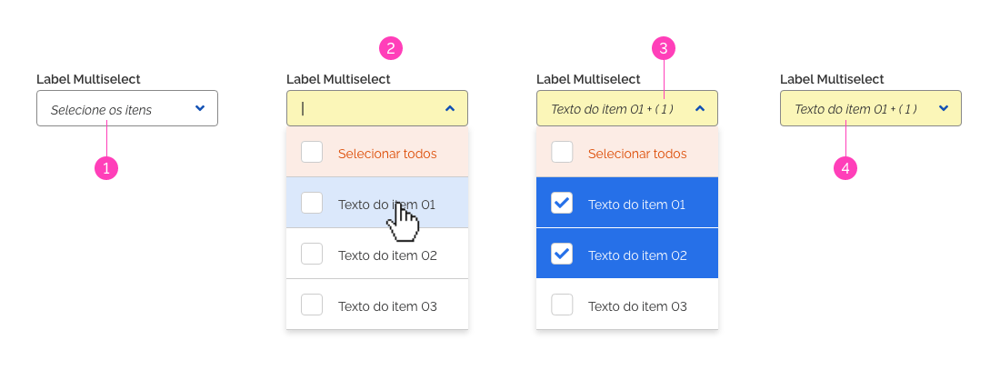
*Exemplo do comportamento de seleção de vários itens do _multiselect_.*

**Importante:** observe que no passo 3 e 4 o campo de entrada só exibe quantos itens couberem dentro do campo _input_ e o restante será acrescentado em forma de quantidade ao final do texto.

#### Seleção de todos os itens no _multiselect_

O usuário poderá selecionar ou desselecionar todos os itens da lista ao mesmo tempo. Esta opção é disponível no primeiro item da lista de forma destacada.

Ao clicar no _checkbox_ deste primeiro item, todos os itens da lista serão selecionados. Caso o usuário desmarque o _checkbox_ do primeiro item, todos os itens da lista serão desselecionados.

O rótulo deste item alternará entre "Selecionar Todos" e "Desselecionar Todos" conforme o usuário marque ou desmarque o primeiro item da lista. Observe o exemplo abaixo:

1. Os itens estão todos desselecionados;
2. A lista foi totalmente selecionada através do primeiro item da lista.

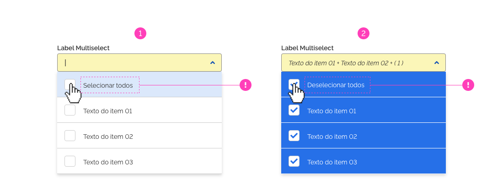
*Exemplo do comportamento de seleção de todos os itens no tipo _multiselect_.*

### 2. Abertura do _select_ e _multiselect_

Para abrir o componente _select_ ou _multiselect_ o usuário poderá clicar em toda a extensão no campo _input_. Observe abaixo:

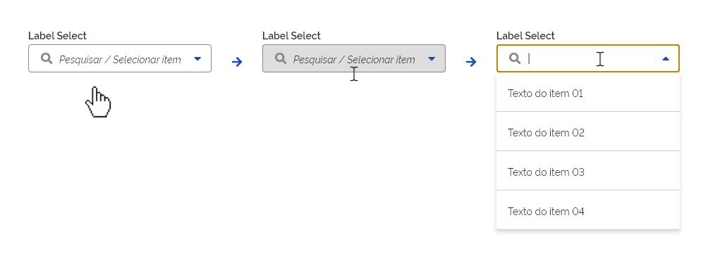
*Exemplo do comportamento de abertura dos itens do _select_ nos estados interativo à esquerda, estado hover no centro e estado pressionado à direita.*

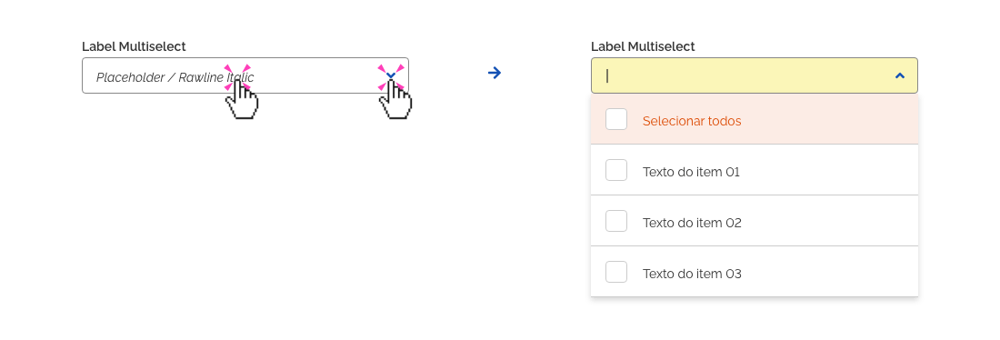
*Exemplo do comportamento de abertura dos itens do _multiselect_ nos estados interativo à esquerda, estado hover no centro e estado pressionado à direita.*

**Importante:** Não havendo espaço disponível para visualizar a abertura devido aos limites da tela, os itens do "Componente _list_" deverão ser reposicionado em uma outra direção, garantindo uma melhor adequação ao layout apresentado. Para maiores informações consultar o tópico **"Posicionamento"** no documento Padrão [_Dropdown_](https://cdngovbr-ds.estaleiro.serpro.gov.br/padroes/dropdown).

### 3. Responsividade

Nas _grids_ de 12 e 8 colunas o tamanho do _select_ e _multiselect_ será ajustado conforme o seu conteúdo interno, respeitando os tamanhos mínimos e máximos.

#### _Grid_ de 12 colunas

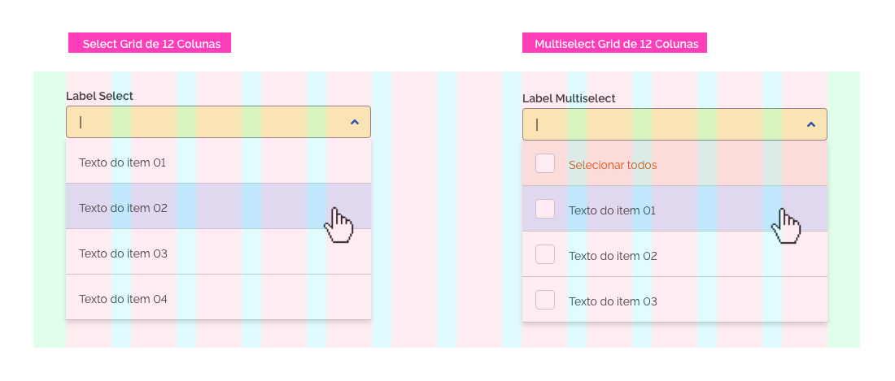
*Responsividade do componente _select_ em _grid_ de 12 colunas*

#### _Grid_ de 8 Colunas

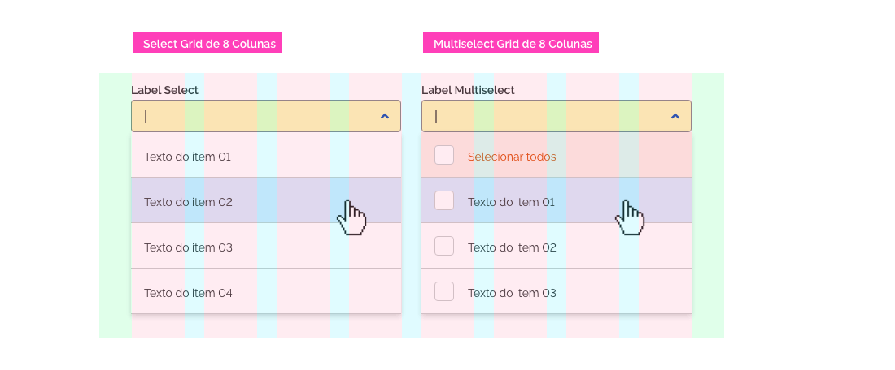
*Responsividade do componente _select_ em _grid_ de 8 colunas*

#### _Grid_ de 4 Colunas

Na _grid_ de 4 colunas, os componentes _select_ e _Multiselect_ ocuparão toda largura da tela, respeitando as margens laterais da _grid_.

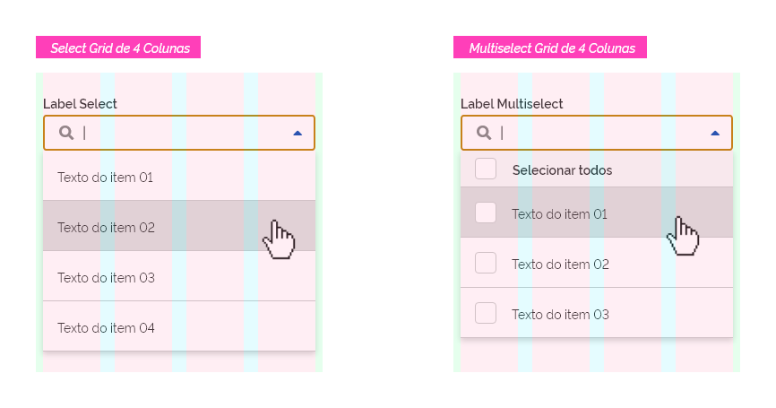
*Responsividade do componente _select_ em _grid_ de 4 colunas*

### 4. Estados

Os componentes _select_ e _multiselect_ seguirão o padrão de diretrizes para estados, conforme observado abaixo:

#### Estado Padrão

No estado padrão o campo _input_ e os itens da _list_ apresentam-se em suas formas naturais.

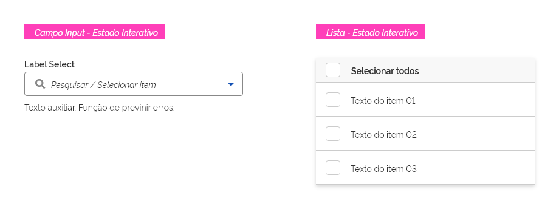
*Exemplo de estado interativo no _select_.*

#### Estado Foco

O estado foco ocorre sobre o campo _input_ quando o usuário clicar sobre ele ou sobre o botão terciário.

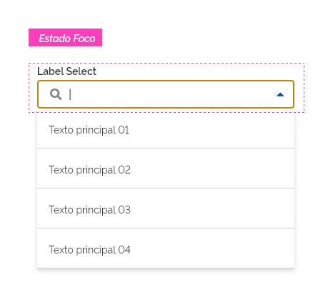
*Exemplo de estado foco no _select_.*

#### Estado _Hover_

O estado _hover_ ocorre sobre o item da _list_ quando o usuário direcionar o _mouse_ sobre ele.

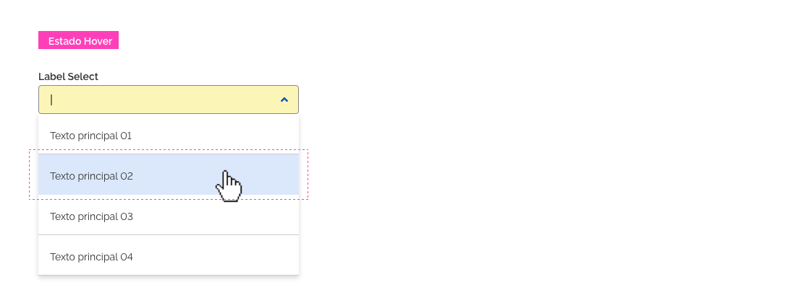
*Exemplo de estado _hover_ no _select_.*

#### Estado Selecionado

O estado selecionado ocorre quando algum(ns) item(ns) da _list_ estiver(em) selecionado(s).

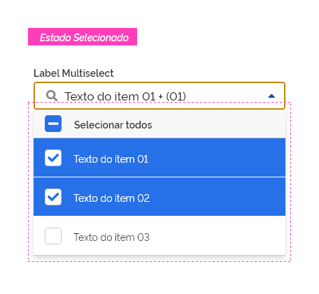
*Exemplo de estado selecionado no _select_.*

**Obs.:** Se todos os itens não estiverem selecionados, o componente _select_ também poderá se enquadrar no estado intermediário.

### 5. Dimensões mínimas e máximas

#### Larguras do _select_ e _multiselect_

Os componentes _select_ e _multiselect_ têm as larguras ajustadas conforme o conteúdo interno dos seus itens. Porém, devem ser respeitadas as larguras mínimas e máximas para estes elementos. Observe a seguir:

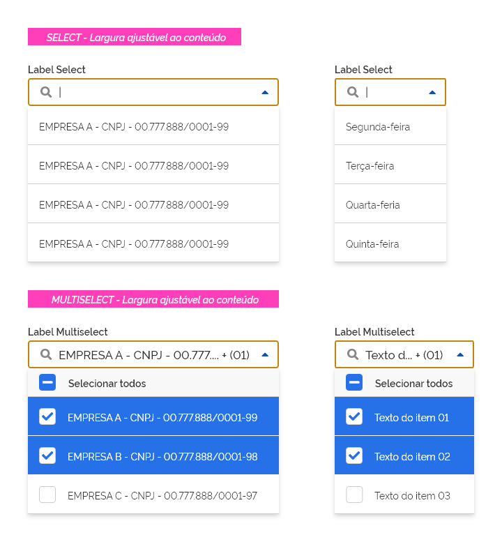
*Exemplo de largura do componente _select_.*

#### Largura Mínima

Sempre que possível, deve-se evitar que a largura do _select_ seja muito reduzida, dificultando a leitura e entendimento das informações. Recomendamos que a largura mínima não seja inferior a 64px.

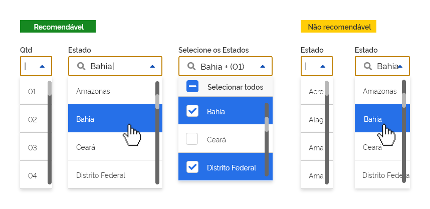
*Exemplos de larguras mínimas recomendáveis à esquerda, onde os textos estão bem ajustados e à direita exemplos _selects_ com parte dos seus textos ocultados.*

**Obs.:** Em situações onde os textos do input ou dos itens do select forem muito extensos, estes deverão ser diagramados como informado no tópico **"Comportamento"**, seção **"Ajustes textuais no _select_"**.

#### Largura Máxima

Não há obrigatoriedade para definição de uma largura máxima. Recomendamos que a largura escolhida, respeite as especificações da _grid_ do dispositivo, onde o layout de tela esteja sendo apresentado. Para maiores informações consultar a documentação do sistema de _grid_.

#### Altura Máxima

A altura máxima para o _select_ e _multiselect_ é correspondente à quantidade de itens em cada um:

- _Select_: dez itens;
- _Multiselect_: nove itens.

Quando a quantidade de itens for superior, deverá ser utilizada uma barra de rolagem para visualização dos demais itens. Por exemplo, se o _select_ possuir cem itens, ficarão visíveis apenas dez, e o restante será visível apenas por meio de rolagem.

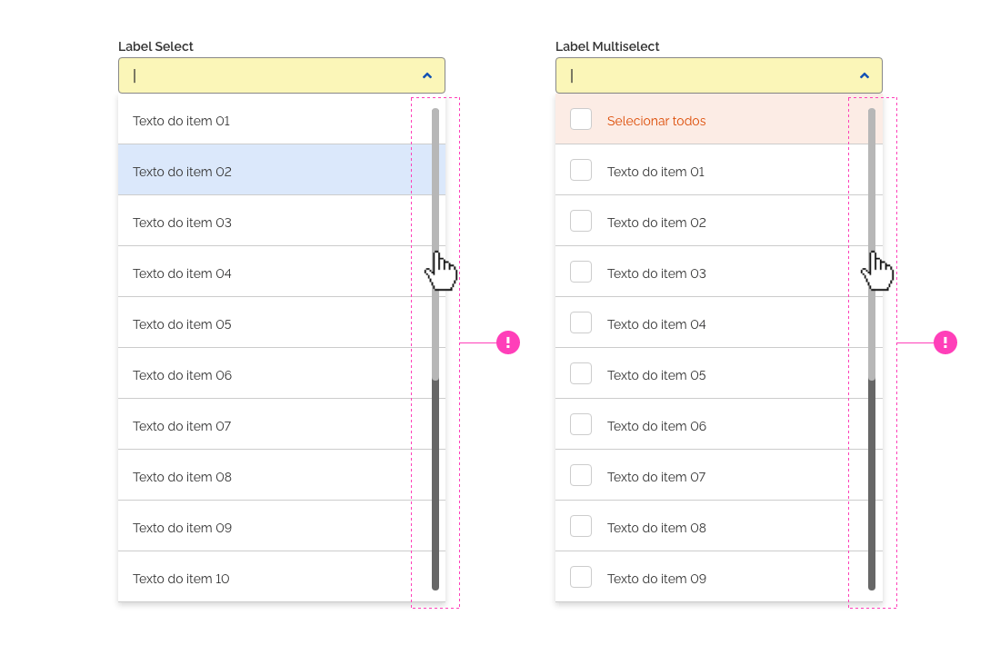
*Exemplo de altura máxima do componente _select_.*

### 6. Ajustes textuais no _select_

#### Ajustes textuais na área do input

Sempre que a largura da área do campo de entrada for menor que o texto principal do item selecionado, deve-se seguir as seguintes recomendações:

1. Quando o item selecionado tiver um texto extenso e maior que a largura da área do campo de entrada do input, as últimas letras ou palavras poderão ser ocultadas, exibindo no final do campo o símbolo de **"reticências" (...)**, indicando que existe mais palavras excedentes.
**Obs.:** O texto completo poderá ser exibido através do uso de _tooltip_.
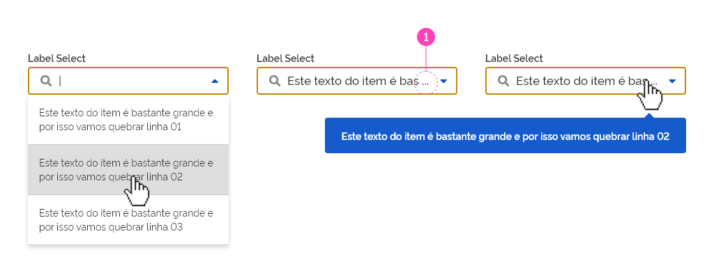
*Exemplos de ajustes textuais no campo de entrada do input.*

2. Quando houver mais de um item selecionado, as informações apresentadas no campo de entrada deverá conter o texto do primeiro item selecionado,  o sinal de **"mais" (+)** acrescido do **"somatório dos itens restantes entre parênteses ( )"**. Ex.: texto do primeiro item + (nº de itens restantes).
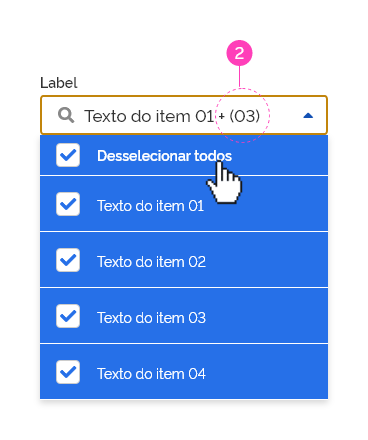
*Exemplos de ajustes textuais no campo de entrada do input.*

3. Em situações em que, além da extensão dos textos, houver mais de um item selecionado, as informações exibidas na área do campo do input agrupará as boas práticas descritas no tópico 1 e 2. Ver exemplo abaixo:

*Exemplos de ajustes textuais no campo de entrada do input.*

#### Ajustes nos itens do _select_

Quando o texto dos itens for maior que a largura do componente, poderá ocorrer a quebra de linha . Porém recomenda-se evitar sempre que possível esta situação. Observe o modelo abaixo:

1. Texto excedendo a largura do item.

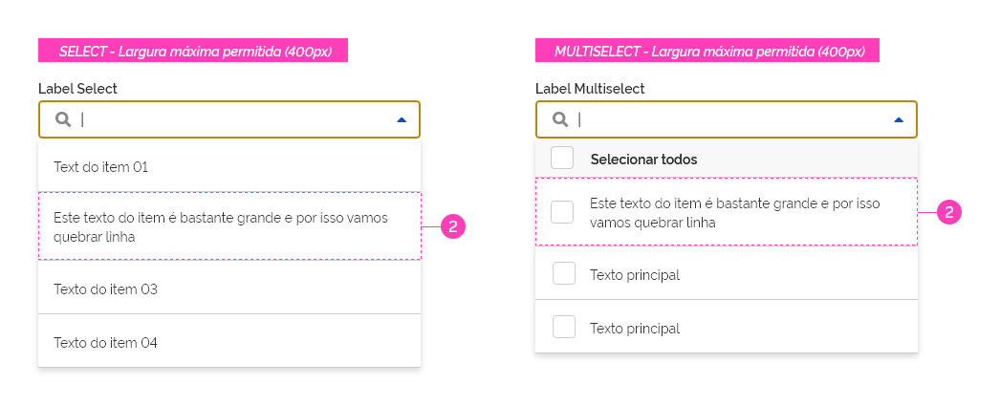
*Exemplos de largura máxima do _select_ e do _multiselect_.*

**Atenção:** de modo geral, deve-se prezar pelo uso de textos curtos e objetivos no _select_ e no _multiselect_. Quando for de extrema necessidade, utiliza-se a quebra de linha dentro o item.

### 7. _Feedback_ após pesquisa

Quando o usuário optar por utilizar a função de pesquisa e não for localizado o item procurado, o componente _input_ deverá exibir, logo abaixo, uma mensagem de _feedback_ do tipo "Empty State", onde será apresentando uma sugestão ou resposta visual para a informação pesquisada. Ver exemplo abaixo:
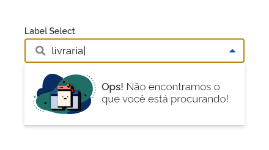
*Exemplo de mensagem de feedback do tipo empty state.*

### 8. Filtro no _select_ e _multiselect_

Para facilitar o processo de encontrar os itens na lista, tanto o _select_ quanto o _multiselect_ possuem a função de filtro, permitindo  que o usuário digite o texto no campo _input_ e, de forma dinâmica, atualizando  a lista _dropdown_ apenas com os itens que possuem os mesmo caracteres que estão sendo digitados naquele momento. Observe o exemplo abaixo:

1. A lista contém diversas palavras;
2. O usuário digita o início de uma palavra à sua escolha e a lista será atualizada conforme o texto digitado.

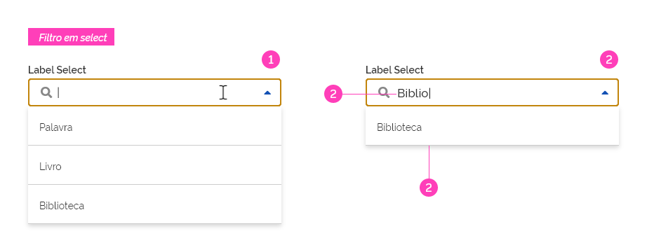
*Exemplo de comportamento de filtragem de itens em um _select_.*

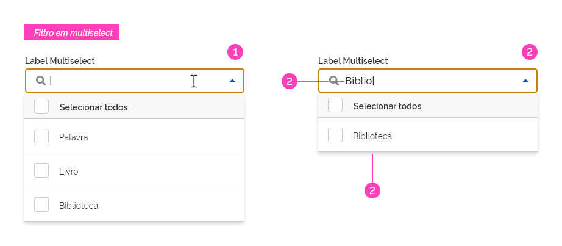
*Exemplo de comportamento de filtragem de itens em um _multiselect_.*

---

## Especificação

### Iconografia

| Name                        | Estado  | Ícone                             | Class (Font Awesome) |
| --------------------------- | ------- | --------------------------------- | :------------------: |
| Ícone - componente _button_ | Fechado | <i class="fas fa-caret-down"></i> |   `fa-caret-down`    |
| Ícone - componente _button_ | Aberto  | <i class="fas fa-caret-up"></i>   |    `fa-caret-up`     |
| Ícone - _Search_            | -       | <i class="fas fa-search"></i>     |     `fa-search`      |

### Opacidade

| Name             | Cor                   |     Opacity Value      |
| ---------------- | --------------------- | :--------------------: |
| Selecionar Todos | `--red-warm-vivid-50` | `--surface-opacity-xs` |

### Espaçamento

| Name               | Property      |           Token           |
| ------------------ | ------------- | :-----------------------: |
| Componente _Input_ | margin-bottom |  `--spacing-scale-base`   |
| Selecionar Todos   | margin-top    |  `--spacing-scale-base`   |
| Componente _List_  | margin-top    | `--spacing-scale-default` |

### Tipografia

| Name              |        Font-Weight        |
| ----------------- | :-----------------------: |
| Componente _List_ |  `--font-weight-regular`  |
| Selecionar Todos  | `--font-weight-semi-bold` |

### Dimensões

| Name                               | Width      | Max-Width | Min-Width | Height |
| ---------------------------------- | ---------- | --------- | --------- | :----: |
| Componente _Input_ - _Select_      | `variável` | `400px`   | `100px`   | `40px` |
| Componente _Input_ - _Multiselect_ | `variável` | `400px`   | `200px`   | `40px` |
| Item _List_ - _Select_             | `variável` | `400px`   | `100px`   | `56px` |
| Item _List_ - _Multiselect_        | `variável` | `400px`   | `200px`   | `56px` |

### Sombra

| Name       |        Shadow         |
| ---------- | :-------------------: |
| Superfície | `--surface-shadow-md` |
