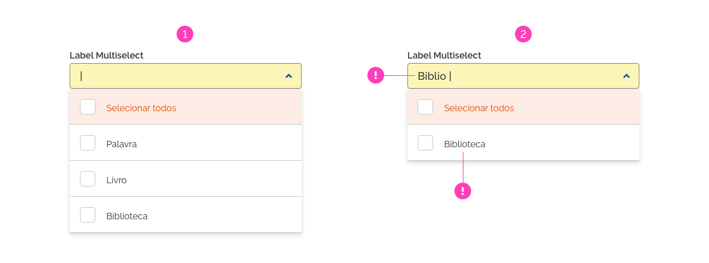
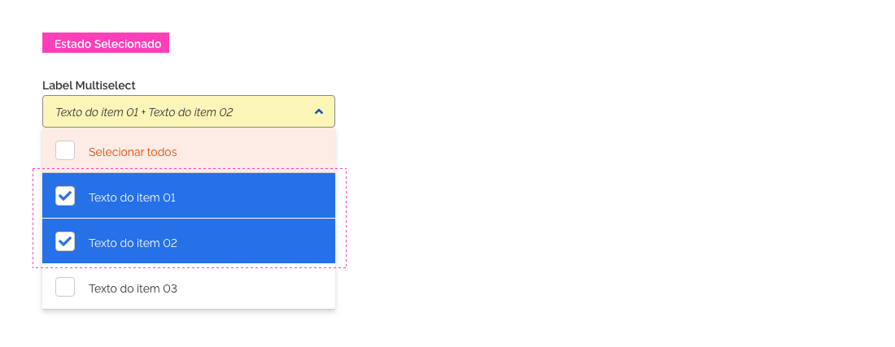
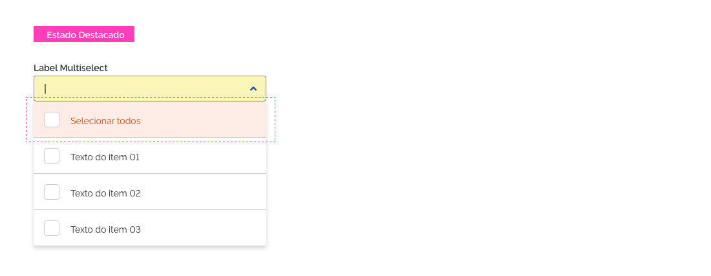

[version]: # '6.0.0'

---

## Uso

A função do componente _Select_ é coletar informações fornecidas pelo usuário em uma lista de opções. Utilize o componente _Select_ quando um usuário precisar escolher uma ou mais opções em uma lista.

### Tom de voz

-   Ordene os itens de forma sensata para facilitar a visualização das opções pelo usuário.
-   Se possível torne padrão a opção mais escolhida pelos usuários.

---

## Anatomia

1. Componente _Input_
2. Componente _Botão Circular_ _( Ênfase Terciária )_
3. Componente _Lista_

### 1. Componente _Input_

O componente _Input_ é o campo de entrada de texto onde o usuário irá digitar o texto do item escolhido ou selecionar através do _Mouse_. Ao clicar no _Componente Input_, este assumirá seu estado _Foco_ e o cursor ficará ativo em seu interior.

### 2. Componente _Botão Circular ( Ênfase Terciária )_

O _Botão Circular ( Ênfase Terciária )_ posiciona-se dentro do _Componente Input_ em sua extrema direita e possui o comportamento _Toggle_. Quando o usuário clicar sobre o _Componente Input_ ou sobre o _Botão Circular_, este alternará entre os ícones _Angle-Up_ e _Angle-Down_, conforme a abertura ou fechamento da _Lista Dropdown_.

### 3. Componente Lista

O componente deve apresentar os itens a serem escolhidos pelo usuário. No tipo _Multiselect_, o usuário poderá incluir ou remover mais de um item através do _Checkbox_. Cada item selecionado assumirá o _Estado Selecionado_.

#### Sombra no Componente Lista

O _Componente Lista_ será apresentado flutuando sobre a tela e uma sombra deverá ser utilizada para proporcionar contraste entre o _Componente Lista_ e o conteúdo de tela ao fundo.

---

## Tipos

O componente pode ser do tipo:

-   _Select_
-   _Multiselect_

### Tipo _Select_

O tipo _Select_ é utilizado para as opções de seleção única. O item selecionado será apresentado no _Placeholder_ seguindo as diretrizes do _Componente_ _Input_.

### Tipo Multiselect

Caso seja necessário oferecer multiplas seleções, deve-se utilizar o tipo _Multiselect_. As opções selecionadas serão apresentadas no _Placeholder_, seguindo as diretrizes de exibição do _Componente_ _Input_.

---

### Comportamento

#### 1. Seleção dos Itens

Ao selecionar os itens no _Componente Select_ e _Multiselect_, o usuário terá essa informação visível no _Placeholder_ do _Campo Input_, conforme a sequência de cada tipo abaixo:

#### Seleção de itens no _Select_

1 - O _Placeholder_ exibe a informação inicial;
2 - O usuário escolhe o item;
3 - O _Placeholder_ exibe a opção selecionada.

#### Seleção de itens no _Multiselect_

1 - O _Placeholder_ exibe a informação inicial;
2 - O usuário escolhe os itens;
3 - O _Placeholder_ exibe as opções selecionadas em tempo real;
4 - O _Placeholder_ exibe as opções escolhidas.

IMPORTANTE: Observe que no passo 3 e 4 o _Placeholder_ só exibe quantos itens couberem dentro do _Campo_ _Input_ e o restante será acrescentado em forma de quantidade ao final do texto.

##### Seleção de todos os itens no _Multiselect_

O usuário poderá selecionar ou deselecionar todos os itens da lista ao mesmo tempo. Esta opção estará disponível no primeiro item da lista de forma destacada ( _Estado Destacado_ ).

Ao clicar no _Checkbox_ deste primeiro item, todos os itens da lista serão marcados. Caso o usuário desmarque o _Checkbox_ do primeiro item, todos os itens da lista serão desmarcados.

O rótulo deste item alternará de "Selecionar Todos" para "Deselecionar Todos" conforme o usuário marque ou desmarque o primeiro item da lista. Observe o exemplo abaixo:

1 - Os itens estão todos deselecionados;
2 - A lista foi totalmente selecionada através do primeiro item da lista.

#### Filtro no _Select_ e _Multiselect_

Para facilitar o processo de encontrar os itens na lista, tanto o _Select_ como o _Multiselect_ possuem a função de filtro. O filtro funciona no momento em que o usuário digita o texto no _Campo Input_ e, de forma dinâmica, a lista será atualizada apenas com os itens que possuem os mesmo caracteres que estão sendo digitados naquele momento. Observe o exemplo abaixo:

1 - A lista possue diversas palavras;
2 - O usuário digita o início de uma palavra a sua escolha e a lista é atualizada conforme o texto digitado.

#### 2. Abertura do Select e Multiselect

Para abrir o _Componente Select_ ou _Multiselect_ o usuário poderá clicar tanto no _Campo Input_ como também no _Botão_ do mesmo. Observe abaixo:

#### 3. Responsividade

Nas _Grids_ de 12 e 8 colunas o tamanho do _Select_ e _Multiselect_ será ajustado conforme o seu conteúdo interno, respeitando os tamanhos mínimos e máximos.

##### Grid de 12 Colunas

##### Grid de 8 Colunas

##### Grid de 4 Colunas

Na _Grid_ de 4 colunas, o _Componente Select_ e _Multiselect_ ocuparão toda largura da tela, respeitando as margens laterais da _Grid_.

#### 4. Estados

O _Componente Select_ e _Multiselect_ seguirão o padrão de diretrizes para _Estados_, conforme observado abaixo:

##### Estado Interativo

No _Estado Interativo_ o _Campo Input_ e os _Itens da Lista_ apresentam-se em suas formas naturais.

##### Estado Foco

O _Estado Foco_ ocorrerá sobre o _Campo Input_ quando o usuário clicar sobre ele ou sobre o _Botão Circular_.

##### Estado Hover

O _Estado Hover_ ocorrerá sobre o _Item da Lista_ quando o usuário passar o _mouse_ sobre ele.

##### Estado Selecionado

O _Estado Selecionado_ ocorrerá sobre o _Item da Lista_ quando o usuário selecionar o mesmo.

##### Estado Destacado

O _Estado Destacado_ será permanente apenas no primeiro item da lista no _Multiselect_, para dar ênfase à funcionalidade "Selecionar Todos".

#### 5. Dimensões mínimas e máximas

##### Larguras do Select e Multiselect

Os _Componentes Select_ e _Multiselect_ terão suas larguras ajustadas conforme o conteúdo interno dos seus itens. Porém, deverão ser respeitadas as larguras mínimas e máximas para estes elementos. Observe a seguir:

##### Largura Mínima

A largura mínima deverá ser de 100px para o _Select_ e 200px para o _Multiselect_.

##### Largura Máxima

A largura máxima deverá ser de 400px para o _Select_ e o _Multiselect_. Quando o texto do item for maior que este tamanho, poderá ocorrer a quebra de linha dentro do item. Porém recomenda-se evitar sempre que possível esta situação. De modo geral, deve-se prezar pelo uso de um texto curto e objetivo no _Select_ e _Multiselect_. Quando for de extrema necessidade, utiliza-se a quebra de linha dentro o item. Observe o modelo abaixo:

##### Altura Máxima

A altura máxima para o _Select_ e _Multiselect_ será correspondente à quantidade de itens em cada um:

-   10 itens para o _Select_;
-   9 itens para o _Multiselect_.

Quando a quantidade de itens for superior, deverá ser utilizada uma barra de rolagem para visualização dos demais itens. Por exemplo, se o _Select_ possuir 100 itens, ficarão visíveis apenas 10, e o restante será visível apenas pela rolagem do _Select_.

---

## Design Tokens

### Iconografia

| Name                     | Estado  | Ícone                             | Class (Font Awesome) |
| ------------------------ | ------- | --------------------------------- | -------------------- |
| Ícone - _Botão Circular_ | Fechado | <i class="fas fa-angle-down"></i> | `fa-angle-down`      |
| Ícone - _Botão Circular_ | Aberto  | <i class="fas fa-angle-up"></i>   | `fa-angle-up`        |

### Espaçamento

| Name               | Property      | Token |
| ------------------ | ------------- | ----- |
| _Componente Input_ | margin-bottom | `0px` |
| _Componente List_  | margin-top    | `0px` |

### Dimensões

| Name                             |   Width    | Max-Width | Min-Width | Height |
| -------------------------------- | :--------: | :-------: | :-------: | :----: |
| _Componente Input_ - Select      | `variável` |  `400px`  |  `100px`  | `40px` |
| _Componente Input_ - Multiselect | `variável` |  `400px`  |  `200px`  | `40px` |
| Item _List_ - Select             | `variável` |  `400px`  |  `100px`  | `56px` |
| Item _List_ - Multiselect        | `variável` |  `400px`  |  `200px`  | `56px` |

### Sombreamento

| Name              | Property   | Token                          |
| ----------------- | ---------- | ------------------------------ |
| _Componente List_ | box-shadow | `0px 3px 6px rgba(0,0,0,0.16)` |
