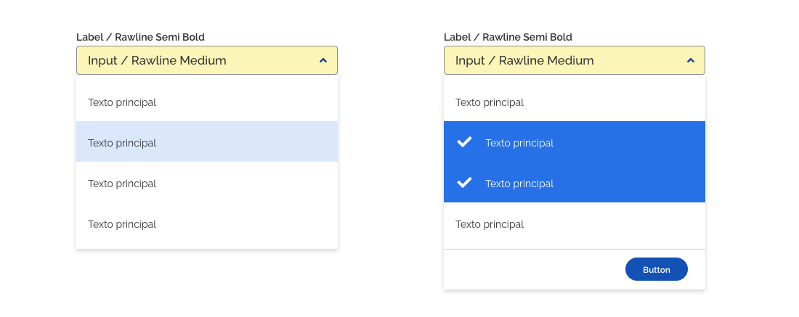
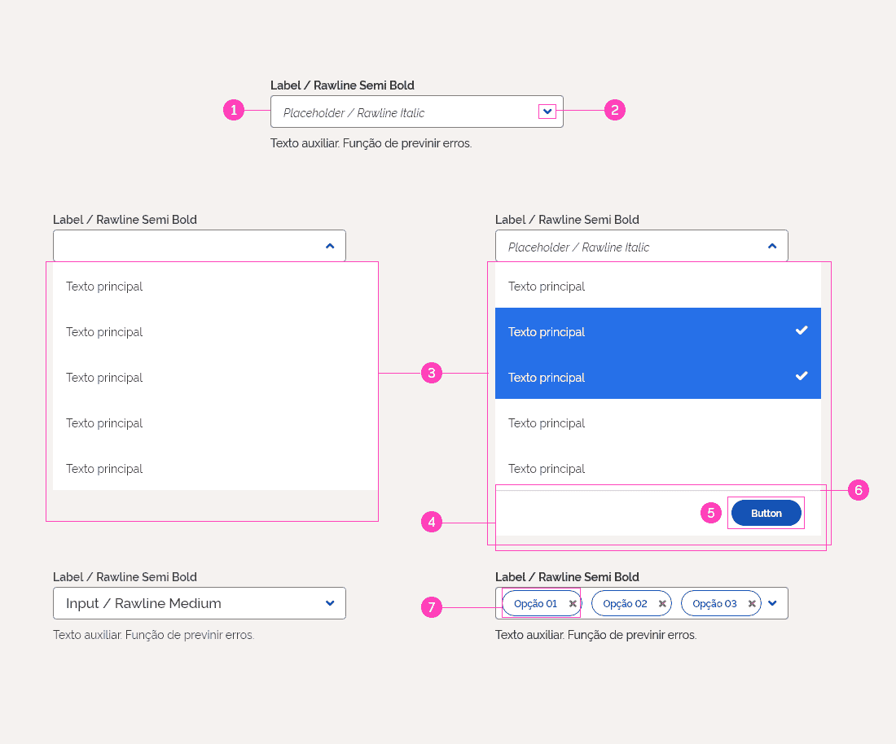
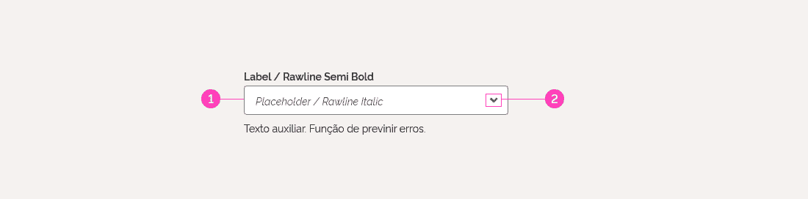
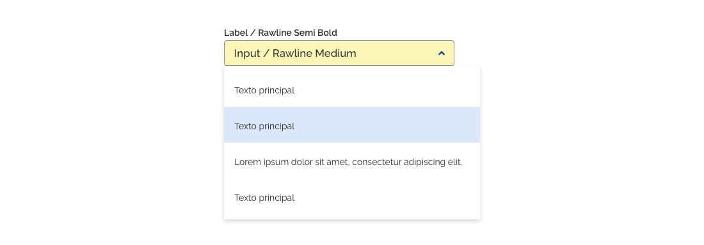
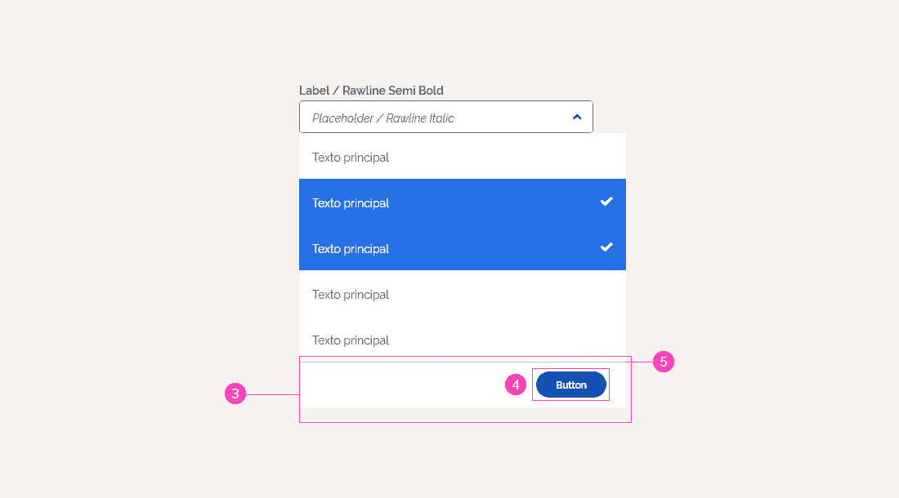
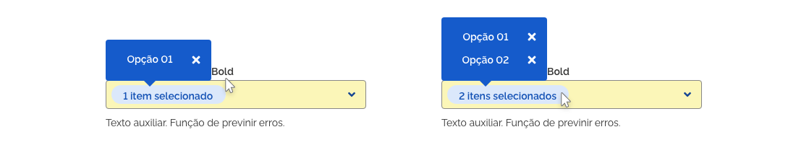
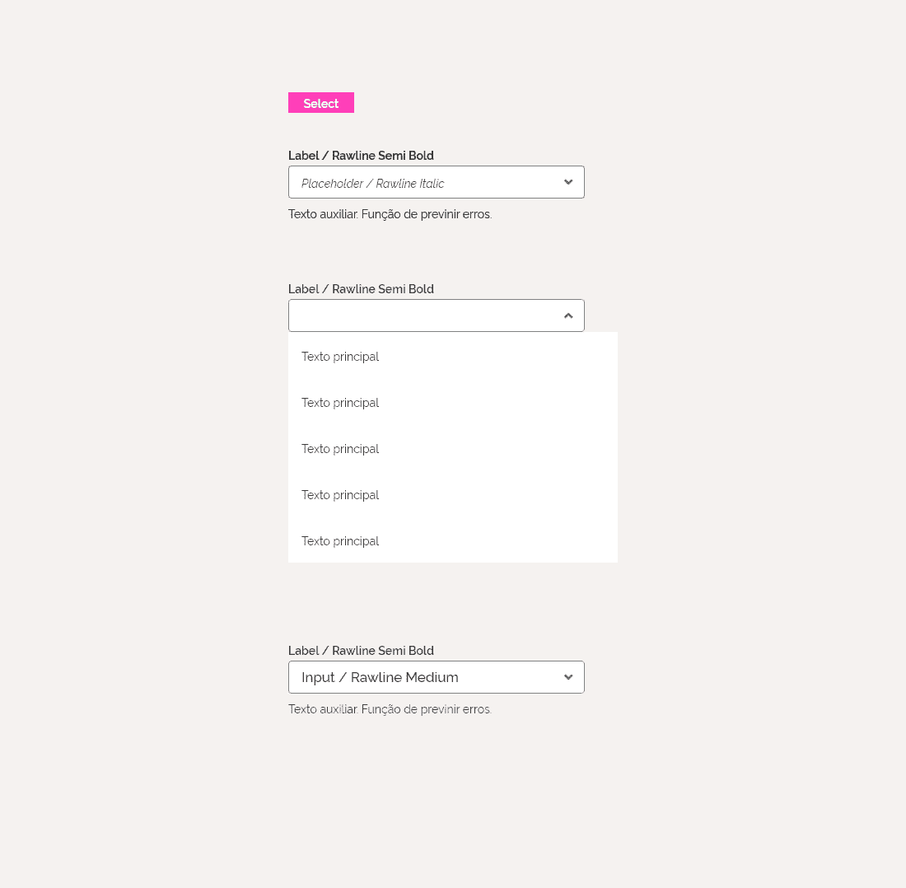
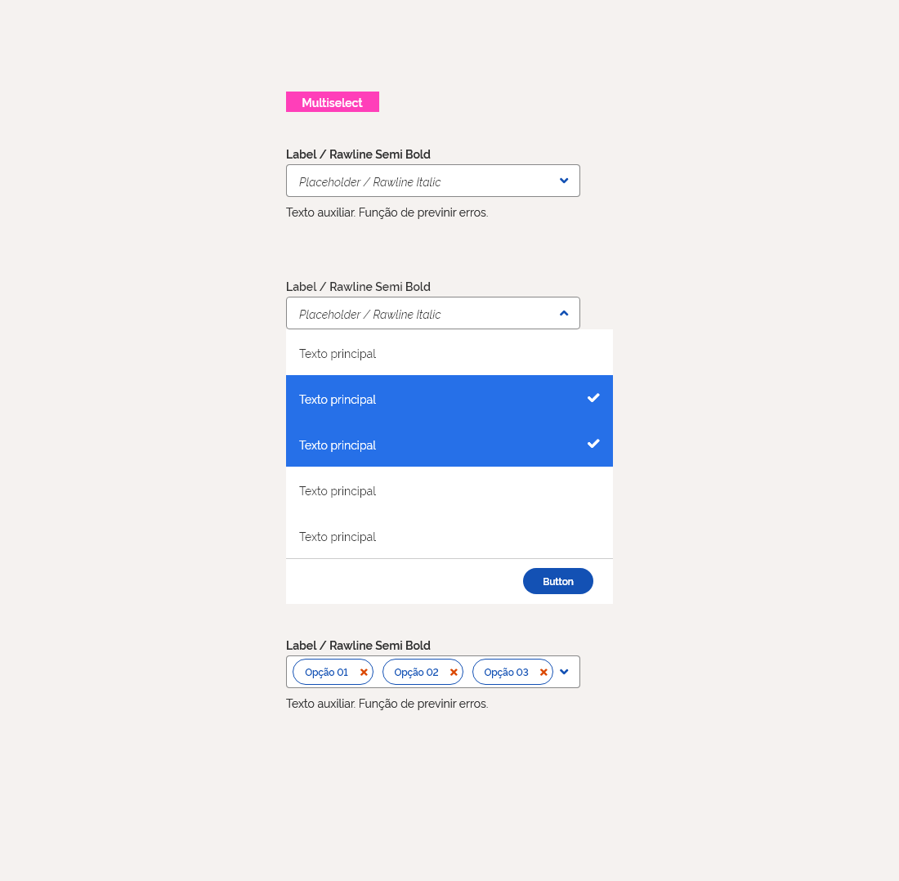
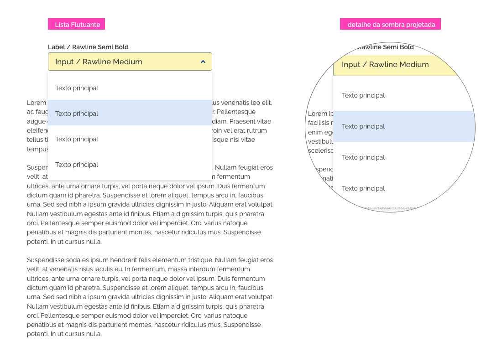
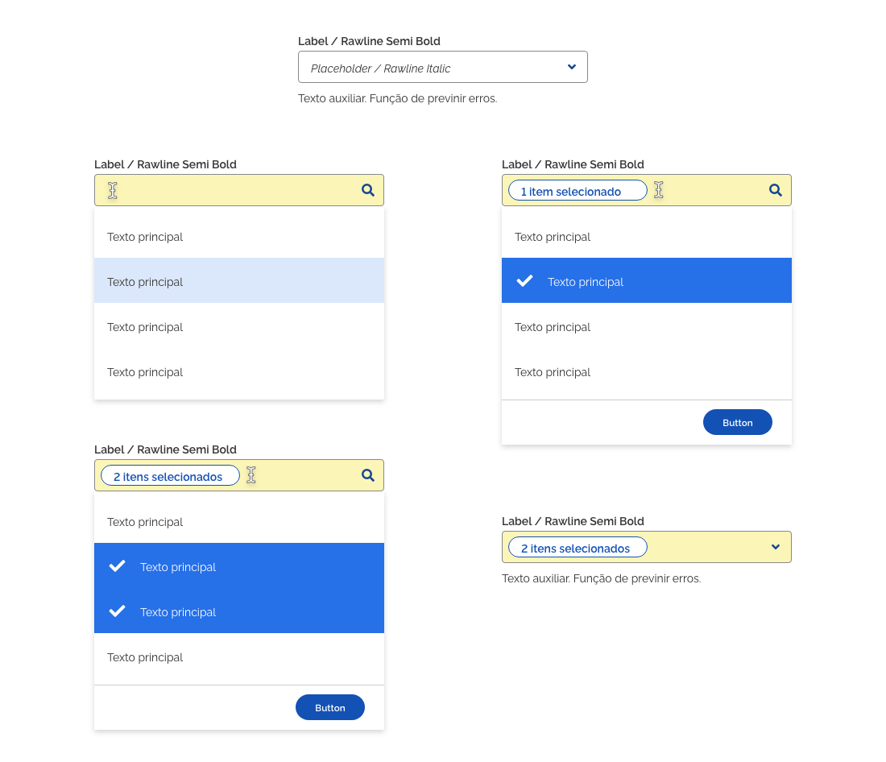

[version]: # '5.0.0'

---

## Uso

A função do componente Select é coletar informações fornecidas pelo usuário em uma lista de opções. Utilize o componente select quando um usuário precisar escolher entre mais de 5 opções ou tiver espaço limitado para exibir as opções como dentro de células de tabelas, por exemplo. Em listas de opções com muitos extensa, permita que os usuários façam buscas entre as opções. Se a lista de opções for curta use os componentes radiobutton, checkbox ou switch.

### Tom de voz

-   Ordene os itens de forma sensata para facilitar a visualização das opções pelo usuário.
<!-- - Evite alterar as opções em um menu suspenso com base na entrada em outro. -->
-   Se possível torne padrão a opção mais escolhida pelos usuários.
-   Deve apresentar uma lista com até seis itens, utilizando barra de rolagem caso existam mais opções.

---

## Anatomia

1. Input
2. Ícone interativo
3. Lista
4. Rodapé
5. Botao Mini Primário
6. Separador
7. Tag de entrada
8. Tooltip info

### Input

O componente input (1) é apresentado com o ícone interativo indicando o sentido em que a lista será aberta. Quando aberto este ícone deverá indicar a direção oposta. Não deve haver espaçamento entre o input e a lista apresentada.

### Lista

O componente deve apresentar uma lista com ao menos dois e até cinco itens, apresentando barra de rolagem caso existam mais opções a serem apresentadas. Deve ocupar a largura do maior item a ser selecionado, respeitando a largura máxima (consulte _Design Tokens_). Não deve haver espaçamento entre o input e a lista apresentada.

### Rodapé

O elemento rodapé (4) aparecerá como último item da lista de opções dentro do mesmo container e deverá ter a altura, largura e cor de um item do componente lista. Deverá conter um botão do tipo button mini primário (5) ao lado direito e um separador (6) em seu topo ocupando a largura da lista.

### Botao Mini Primário

Dentro do rodapé deverá conter um botão do tipo button mini primário (5) ao lado direito.

### Separador

O componente separador deve se posicionar ao topo do rodapé e ocupar toda a sua largura.

### Tag

O componente deve conter a quantidade de itens selecionados acompanhado da expressão "itens selecionados" caso seja selecionados apenas um item colocar a expressão no singular "item selecionado".

### Tooltip info

O componente tooltip deve aparecer ao posicionar o mouse sobre um input após o usuário fazer seleções múltiplas. Deverá conter os textos dos itens selecionados. A instância utilizada será a info, uma vez que se trata de um texto informativo.

---

## Tipos

O componente pode ser do tipo:

-   Select
-   Multiselect

### Tipo Select

O tipo Select é utilizado para as opções de seleção única. Se você precisar permitir que os usuários selecionem mais de uma opção ao mesmo tempo use o tipo Multiselect. A seleção será apresentada dentro do input seguindo suas diretrizes.

### Tipo Multiselect

Caso seja necessário oferecer multiplas seleções além do componente lista é apresentado abaixo deste um rodapé com um separador em seu topo e um botão de confirmação. As opções selecionadas serão apresentadas dentro do input, seguindo suas diretrizes de exibição.

---

### Comportamento

Ao clicar em qualquer parte da extensão do componente, será aberta uma lista abaixo do input, ocupando a largura maior item da lista, apresentando as opções de seleção e o seu ícone interativo é alterado indicando a direção oposta à lista aberta.

Todos os ítens da lista deverão ter o mesmo número de linhas e a mesma altura seguindo as diretrizes do componente lista.

A lista deverá aparecer por cima dos elementos da página com uma sombra progetada, dando um aspecto de flutuar sobre a página.

No tipo select, com a lista aberta, ao selecionar um dos itens a lista deverá ser recolhida apresentando o item selecionado dentro do input seguindo suas diretrizes.

No tipo multiselect, a lista será recolhida apenas quando o botão no rodapé for acionado ou quando o usuário tirar o foco do componente. Será apresentado em uma tag o número de itens selecionados acompanhado da expressão "item selecionado" quando um item for selecionado e "itens selecionados" quando mais de um item for selecionado.

Deverá aparecer apenas um tag dentro do input que deverá manter a sua largura original.

O usuário poderá visualizar as opções selecionadas através de um tooltip ao passar o mouse ou clicar na área do tag que exibe o número de itens selecionaos. Neste tooltip cada item selecionado será seguido de um ícone interativo indicando a possibilidade de exclusão respeitando as diretrizes do componente.

O usuário poderá excluir estes itens clicando no ícone interativo dentro do tooltip (ver tokens). Clicando novamente no input o qua deverá abrir novamente a lista com os mesmos itens selecionados.

Em listas de opções muito extensas, permita que os usuários façam buscas entre as opções.
O campo de busca deve ser o próprio input e o seu botão interativo deverá indicar a alternativa (ver design tokens).

---

## Design Tokens

### Iconografia do Input

| Name               | estado  | ícone                             | Class (Font Awesome) |
| ------------------ | ------- | --------------------------------- | -------------------- |
| Ícone de Interação | fechado | <i class="fas fa-angle-down"></i> | `fa-angle-down`      |
| Ícone de Interação | aberto  | <i class="fas fa-angle-up"></i>   | `fa-angle-up`        |
| Ícone de Interação | busca   | <i class="fas fa-search"></i>     | `fa-search`          |
|                    |         |                                   |                      |

### Espaçamento/ Alinhamento

| Name                  | Property      | Token                                  |
| --------------------- | ------------- | -------------------------------------- |
| _Input_               | margin-bottom | `0px`                                  |
| _List_                | margin-top    | `0px`                                  |
| _Tag_                 | margin-left   | `8px`                                  |
| _Tag_                 | margin-top    | `centralizado na vertical com o Input` |
| _Tag_                 | margin-bottom | `centralizado na vertical com o Input` |
| _button-mini-primary_ | margin-top    | `12px`                                 |
| _button-mini-primary_ | margin-bottom | `12px`                                 |
| _button-mini-primary_ | margin-right  | `24px`                                 |
| _tooltip_             | left          | `0px`                                  |
| _tooltip_             | bottom        | `-32px`                                |

#### Dimensões

| Name   |            Width            |     Max-Width      |   Height   |
| ------ | :-------------------------: | :----------------: | :--------: |
| Lista  |         `variável`          |      `400px`       | `variável` |
| Rodapé | `variável conforme a Lista` | `conforme a Lista` |   `56px`   |

#### Sombreamento da lista

| Name   | Property   | Token                          |
| ------ | ---------- | ------------------------------ |
| _List_ | box-shadow | `0px 3px 6px rgba(0,0,0,0.16)` |
