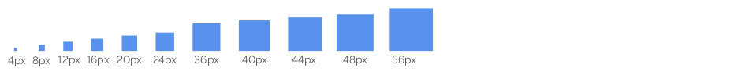

### Orientação de Uso

#### 1 | Rótulos

Em contextos comuns de uso devem ser acompanhados de rótulos que descrevam a informação que o usuário deve selecionar.

#### 2 | Placeholder

O placeholder tem a função de auxiliar o usuário a selecionar as opções disponíveis. Para limpar o campo basta selecionar o campo em branco que encabeça a listagem.

#### 3 | Distintas Alturas dos Campos

De acordo com o contexto de uso as alturas dos campos devem variar para: select em Filtro em portal; select em tabelas e select geral.

### Comportamento

O label, o placeholder e os demais comportamentos permanecem iguais.
No caso do uso em Tabelas e Filtro em portal o label pode ser suprimido, mas nesse caso o uso do placeholder é imprescindível.

### Anatomia

### Campos de Texto

São elementos usados pelos usuários para escolher uma opção em um grupo de dados. Devem ser acompanhados de rótulos que descrevam a informação que o usuário deve digitar nelas.

#### Select Habilitado

#### Select Desabilitado

#### Select Expandido

#### Select uso Filtro Portal

### Select uso Tabelas

## Estados

Os Selects podem ser representados nos estados: habilitado; desabilitado e campo com foco e dropdown aberto.

#### Select habilitado

#### Select desabilitado

#### Select com foco e dropdown aberto.

### Espaçamentos

Segue as métricas definidas para os espaçamentos de todos os elementos utilizados no componente select. Todas as medidas foram definidas com valores múltiplos de 4px e 8px.

## Cores

