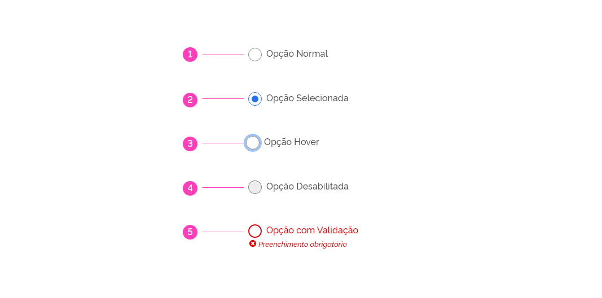
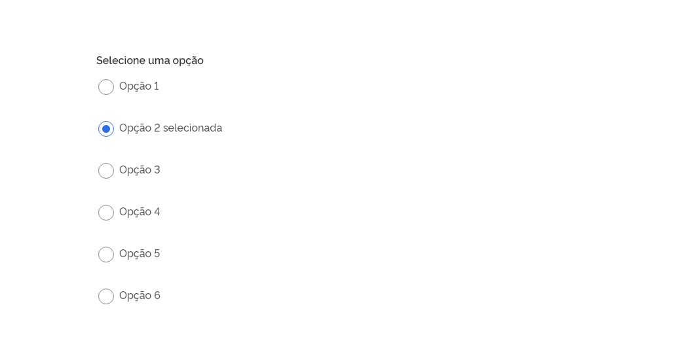
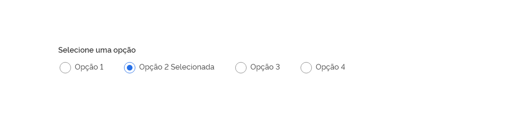
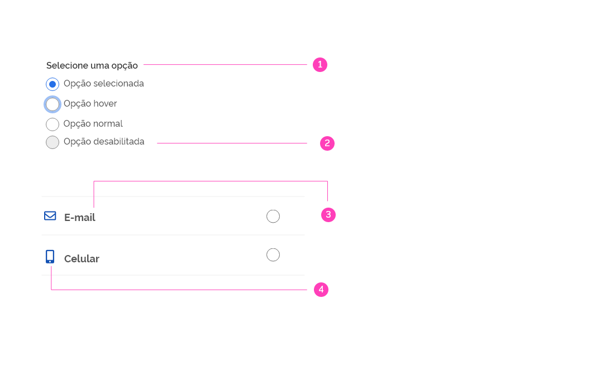
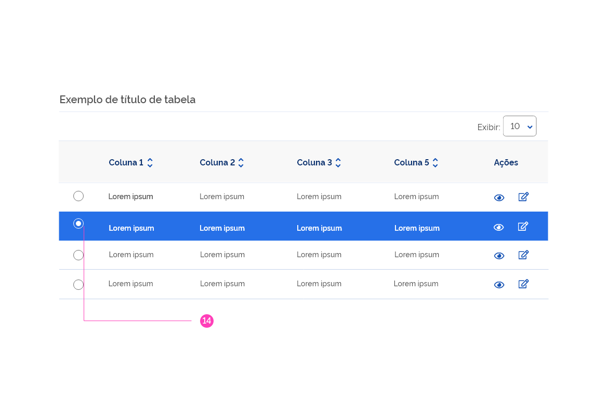
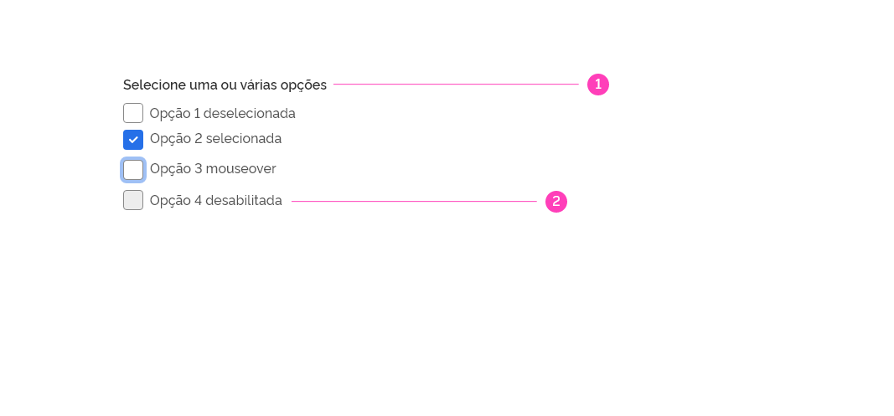
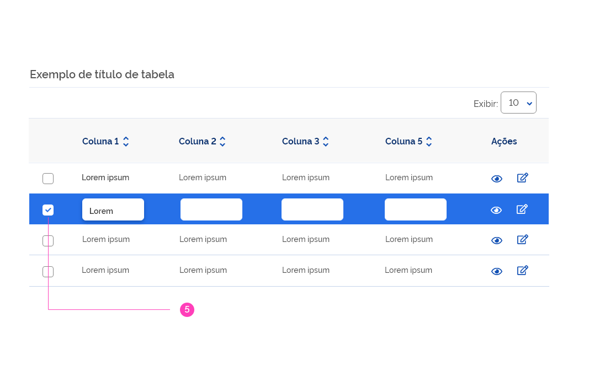
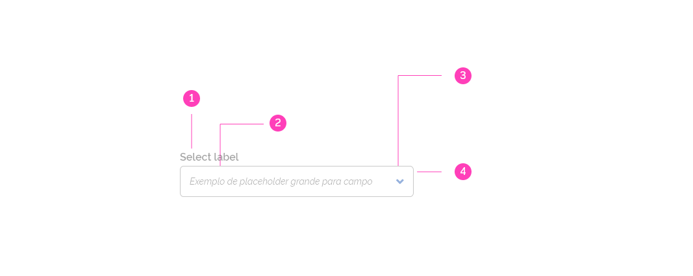
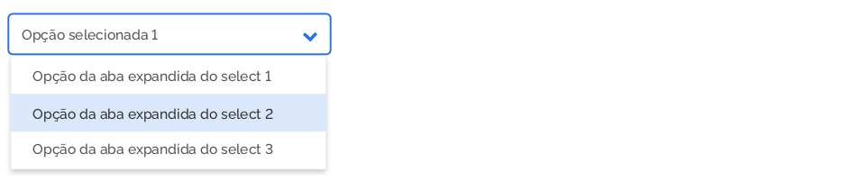

## Princípios

Os controles de seleção devem seguir os princípios básicos de **Familiaridade, Visibilidade e Eficiência**

#### Familiaridade

Os controles de seleção estão presentes nas interfaces de usuário há muito tempo e devem ser usados conforme o esperado.

#### Visíbilidade

O usuário deverá visualizar rapidamente se um controle de seleção foi acionado e os itens selecionados devem ter mais destaque visual do que os outros.

#### Eficiencia

Os controles de seleção facilitam a comparação das opções disponíveis.

## Tipos

### <a href="#Radio_Button">Radio Button</a>

### <a href="#Check_Box">Checkbox</a>

### <a href="#select">Select</a>

 

# Radio Button

Quando usar?

Devem ser usados para selecionar um opção, dentro de uma lista de itens. Clicar em um Radio Button não selecionado desmarcará qualquer outro selecionado anteriormente na lista.
O Radio Button é recomendado em formulários, onde pode substituir muitas vezes o select, pois o usuário pode ver todos os itens rapidamente e compará-los facilmente. Comparar e decidir sobre uma opção em um select leva mais tempo. O usuário tem que abrir o select e comparar as opções toda vez que ele quiser rever a opção selecionada.

 

## Estrutura

Possui um texto de orientação que auxilia a escolha do usuário. Cada opção deve ser acompanhada de um texto que a descreva.

### Formatação Básica

### Formatação com ícones

Os Radio Buttons podem vir acompanhados de ícones ou imagens para uma compreensão mais rápida e maior engajamento do usuário. Ex: Dentro de um contexto de formulário.

 

## Estados

Os estados dos Radio Buttons servem para dar feedback ao usuário sobre as ações que estão acontecendo. Eles podem estar nos estados: normal (habilitado)/deselecionado, selecionado, hover; desabilitado e validado.

#### 1 - Normal - O estado padrão deselecionado do Radio Button.

#### 2 - Click - Acontece quando clica-se no Radio Button, nesse caso os mesmos assumir a cor azul e oco.

#### 3 - Hover - O estado quando o cursor do mouse está sobre o Radio Button.

#### 4 - Disabled - Radio Button desabilitados são indicados com a cor cinza e sua ação está inativa.

#### 5 - Validado com Erro/Esquecimento do Preenchimento - Acontece quando o usuário seleciona uma opção inválida ou não preencheu um campo obrigatório.

 

## Anatomia

### Tom de Voz do RadioButton

Quando houver a necessidade de seleção de apenas um item numa lista de opções, o Radio Button é o componente ideal. É fundamental que antes da lista de opções apareça uma breve descrição orientando ao usuário do que se trata as opções.
Recomenda-se, que o texto de orientação seja breve e claro. Utilizar os verbos sempre na terceira pessoa do imperativo afirmativo. Ex.: Selecione uma opção.

### Formatação do Texto

Os textos dos Radio Buttons são formatados em letras minúsculas e minúsculas, sendo a primeira letra da primeira palavra maiúscula.. Ex.: Selecione uma opção.

## Alinhamento

Os itens do Radio Buttons devem vir preferencialmente em colunas alinhados à esquerda com o texto de orientação. Se for possível e a lista de opções não for muito extensa, utilizar apenas uma coluna. Quando houver mais de 07 opções dar preferência ao uso de um select, para um melhor aproveitamento do espaço e uma menor densidade de informação.

### 1 | Uso em 1 coluna

### 2 | Uso em 2 colunas

### 3 | Uso em 1 linha

Evitar esse tipo de formatação, pois os itens organizados em coluna são mais fáceis de serem identificados pela usuário. Utilizar apenas quando for estritamente necessário, ou quando houverem poucos itens a serem selecionados.

<!-- ### 4 | Uso em linhas com ícone

Quando houver necessidade de utilizar ícones para auxiliar no entendimento das opções, utilizar a formatação em linha, e dispor o label e o ícone alinhados à esquerda do bloco de informações e o Radio Button posicionados à direita em relação aos demais elementos.

 -->

 

## Tipografia

#### 1 - Texto de Orientação - Rawline 16px Semibold

#### 2 - Descrição da Opção - Rawline 16px Medium

#### 3 - Labels - Rawline 18px Bold

#### 4 - Ícones - Fontawesome 16px

 

## Dimensões

#### 5 - Elipse 24x24px - Espessura do Contorno 1px

#### 6 - Estado Hover - Espessura do Contorno 4px

#### 7 - Estado Selecionado - Elipse central 12x12px - Espessura do Contorno 1px

#### 8 - Estado Validação - Espessura do Contorno 2px

**Obs.: Para ficar proporcional aos textos na tabela o tamanho dos Radio Buttons foi reduzido para 20px.**

 

## Espaçamentos

Segue as métricas definidas para os espaçamentos de todos os elementos utilizados na paginação.. Todas as medidas foram definidas com valores múltiplos de 4px.

## Cores

### 1 |. Versão Positiva

#### 9 - Estado Normal - Preenchimento #FFFFFF Contorno: Cinza #888888

#### 10 - Estado Hover - Preenchimento #FFFFFF Contorno: Cinza #555555 - Contorno do Hover: Primária Azul Lighten #2670E8, opacidade: 45%

#### 11 - Estado Selecionado - Preenchimento: #FFFFFF - Contorno: Primária Azul Lighten #2670E8 1px - Elipse Central: Azul #2670E8

#### 12 - Estado Desabilitado - Preenchimento: Cinza #EDEDED - Contorno: Cinza #888888

#### 13 - Estado Validação com Erro - Preenchimento #FFFFFF Contorno: #E68888 2px

 

#### 14 - Versão Negativa - Preenchimento: Primária Azul Lighten #2670E8 - Contorno: #FFFFFF - Elipse Central: #FFFFFF

 

# Check Box

Devem ser usados para selecionar um ou mais itens de um conjunto de opções. São muito utilizados como elementos de seleção simultânea.

### Estrutura

Possui um texto de orientação que auxilia a escolha do usuário.
Cada opção deve ser acompanhada de um texto que a descreva.

### Formatação

<!-- #### Formatação Aplicada à Formulário

Pode utilizado de forma mais direta como no exemplo anterior, ou dentro de um contexto de formulário.

 -->

### Estados

Os estados dos checkbox servem para dar feedback ao usuário sobre as ações que estão acontecendo
quando usuário seleciona ou não um checkbox.

#### 1 - Normal - O estado padrão deselecionado do checkbox.

#### 2 - Click - Acontece quando clica-se no checkbox, nesse caso os mesmos assumir a cor azul e oco.

#### 3 - Hover - O estado quando o cursor do mouse está sobre o checkbox.

#### 4 - Disabled - Checkbox desabilitados são indicados com a cor cinza e sua ação está inativa.

#### 5 - Validado com Erro/Esquecimento do Preenchimento - Acontece quando o usuário se esquece de escolher ao menos uma opção,

## Anatomia

### Tom de Voz do CheckBox

Quando houver a necessidade da criação de uma lista de opções que possam ser selecionadas mutuamente, o checkbox é o componente ideal. É fundamental que antes da lista de opções apareça uma breve descrição orientando ao usuário do que se trata as opções.

É esperado que fique claro ao usuário que ele pode selecionar múltiplas opções. Recomenda-se, que o texto de orientação seja breve e claro. Utilizar os verbos sempre na terceira pessoa do imperativo afirmativo. Ex.: Selecione os estados contido no projeto.

### Formatação do Texto

Os textos dos checkbox são formatados em letras minúsculas e minúsculas, sendo a primeira letra da primeira palavra maiúscula.. Ex.: Selecione uma ou mais opções.

### Alinhamento

Os itens do checkbox devem vir preferencialmente em colunas alinhados à esquerda com o texto de orientação. Se for possível e a lista de opções não for muito extensa, utilizar apenas uma coluna.

#### 1 | Uso em 1 coluna

#### 2 | Uso em 2 colunas

#### 3 | Uso em 1 linha

Evitar esse tipo de formatação, pois os itens organizados em coluna são mais fáceis de serem identificados pela usuário.
Utilizar apenas quando for estritamente necessário, ou quando houverem poucos itens a serem selecionados.

## Tipografia

#### 1 - Texto de Orientação - Rawline 16px Semibold

#### 2 - Descrição da Opção - Rawline 16px Medium

 

### Dimensões

#### 1 | Versão Padrão

#### 1 - Estado Normal - Box: 24 x 24px - Espessura do Contorno: 1px

#### 2 - Ícone - Fontawesome: 10pt

#### 3 - Estado Hover - Contorno: 4px

#### 4 - Estado com Validação - Contorno: 2px

 

#### 2 | Versão Menor

Para se adaptar proporcionalmente ao tamanho da font utilizada na tabela, o checkbox aparecerá na mesma
num tamanho reduzido: 20px.

#### 5 - Versão Menor - Box: 20 x 20px

 

### Espaçamentos

Segue as métricas definidas para os espaçamentos de todos os elementos utilizados na paginação.
Todas as medidas foram definidas com valores múltiplos de 4px.

### Arredondamento

### Cores

#### 1 | Versão Positiva

#### 1 - Estado Normal

##### - Preenchimento: #FFFFFF

- Contorno: #888888

#### 2 - Estado Selecionado

- Preenchimento:#2670E8
- Contorno: #888888
- Ícone: #FFFFFF

#### 3 - Estado Hover

- Preenchimento: #FFFFFF
- Contorno: Cinza #888888
- Contorno externo: #2670E8, opacidade: 45%

#### 4 - Estado Validação com Erro

- Preenchimento: #FFFFFF
- Contorno: #E60000
- texto: #E60000

#### 5 - Estado Desabilitado

- Preenchimento: #EDEDED
- Contorno: #888888

#### 6 - Textos

- Itens: #555555

#### 7 - Textos

- Descrição: #333333

 

#### 2 | Versão Negativa

Utilizar a versão negativa do checkbox sobre backgrounds escuros, como por exemplo na linha selecionada da tabela.
Nesse caso o checkbox assume a cor branca como cor de background e o ícone assume cor azul.

#### 8 - Versão Negativa

- Preenchimento: Branco #FFFFFF
- Contorno: Branco #FFFFFF
- Ícone: Azul #2670E8

 

# Select

## Definição

Os componentes Select são usados ​​para coletar informações fornecidas pelo usuário em uma lista de opções.

## Orientação de Uso

#### 1 | Rótulos

Em contextos comuns de uso devem ser acompanhados de rótulos que descrevam a informação que o usuário deve selecionar.

#### 2 | Placeholder

O placeholder tem a função de auxiliar o usuário a selecionar as opções disponíveis. Para limpar o campo basta selecionar o campo em branco que encabeça a listagem.

#### 3 | Distintas Alturas dos Campos

De acordo com o contexto de uso as alturas dos campos devem variar para: select em Filtro em portal (pequeno); select em tabelas (médio) e select geral (grande).

## Comportamento

O label, o placeholder e os demais comportamentos permanecem iguais.

No caso do uso em Tabelas e Filtro em portal o label pode ser suprimido, mas nesse caso o uso do placeholder é imprescindível.

## Anatomia

Campos de Texto
São elementos usados pelos usuários para escolher uma opção em um grupo de dados. Devem ser acompanhados de rótulos que descrevam a informação que o usuário deve digitar. elas.

### Select Habilitado

#### 1 - Rótulo - 16px Semibold #333333

#### 2 - Ítem do select - 16px Medium #555555

#### 3 - Seletor #1351B4

#### 4 - Campo input 1px #888888

#### 5 - Altura e Espaçamento mínimo entre o ítem selecionado e ícone: 48px

#### 6 - Espaçamento entre o ícone e a borda direita do componente: 16px

#### 7 - Ítem do select 16px Medium #555555

#### 8 - Largura mínima proposta: 160px

 

### Select Desabilitado

#### 1 - Rótulo - 16px Semibold #333333 opacidade: 45%

#### 2 - Ítem do select - 16px Medium #555555 opacidade: 45%

#### 3 - Seletor #1351B4 opacidade: 45%

#### 4 - Campo input 1px #888888 opacidade: 45%

 

### Select Expandido

#### 1 - Seletor - #260E8

#### 2 - Campo Input - Contorno: 2px - Cor: #260E8

#### 3 - Hover - Cor de fundo - #DBE8FB

<!-- ### Select Filtro Portal

 -->

<!-- ## Estados

Os Selects podem ser representados nos estados: habilitado; desabilitado e campo com foco e dropdown aberto.

### Select Habilitado

### Select Desabilitado

### Select com foco e dropdown aberto.

 -->

<!-- ## Espaçamentos

Segue as métricas definidas para os espaçamentos de todos os elementos utilizados no componente select.. Todas as medidas foram definidas com valores múltiplos de 4px e 8px.

 -->

## Cores

