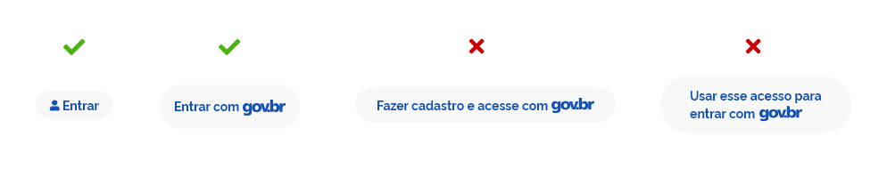
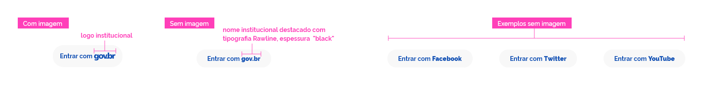
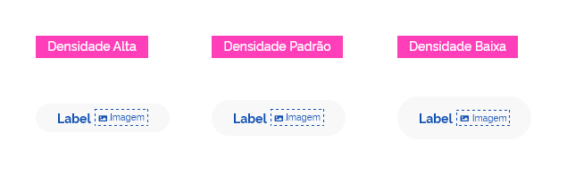
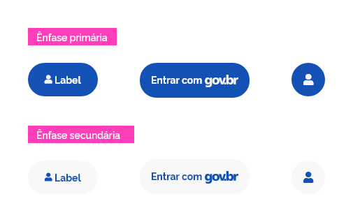
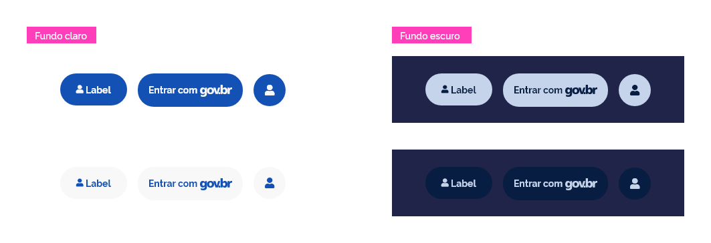
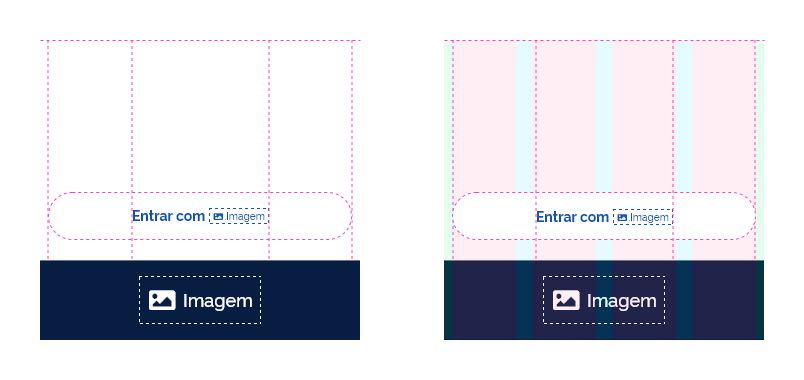
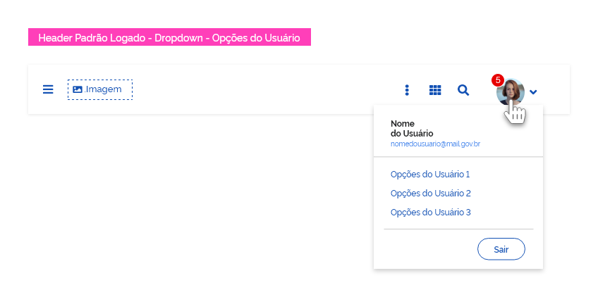

[version]: # (1.1.1)

*Exemplo do componente _sign-in_ nas versões principal e alternativa.*

Utilizado quando se deseja saber quem é o usuário ativo para fornecer conteúdo personalizado ou oportunidades para realizar uma compra.

Quando utilizar:

- Quando existir a necessidade de restringir o acesso a determinado conteúdo;
- Quando houver a necessidade de controlar quais usuários têm acesso a um determinado conteúdo;
- Quando houver informações contextuais a serem apresentadas ao usuário. O contexto pode depender da geografia, fuso horário, idade, interesses ou mesmo das interações anteriores do usuário com o _site_ (amigos adicionados, conteúdo enviado etc.);
- Para proteger as informações do usuário.

O uso desse recurso visa facilitar o acesso por parte dos usuários que possuem um cadastro prévio em seu banco de dados, facilitando seu acesso em outros _websites_ e sistemas. Atualmente essa funcionalidade é muito utilizada, por exemplo, como _login_ de acesso rápido, fazendo uso das informações de perfis já cadastrados nas redes sociais.

**Atenção:** grande parte dos _sites_ e sistemas que utilizam esse recurso, também oferecem a opção de cadastro tradicional, em que o usuário pode preencher seus dados manualmente, aumentando as chances de que ele siga em frente caso não se sinta confortável com o recurso. Aqueles usuários que já possuem cadastro em um _site_ anteriormente à implantação do _sign-in_ também podem sincronizar as contas, evitando retrabalhos e o gerenciamento de _logins_ diferentes.

---

## Anatomia

O _sign-in_ é composto basicamente por ícone ou imagem e _label_. É importante notar que os elementos que o compõe, geralmente se repetem nas versões e variações de tamanho, podendo assumir outras formas dependendo do tipo escolhido ou da resolução da tela.

Segue a estrutura básica da anatomia:

1. Ícone usuário;
2. Rótulo;
3. Imagem (_opcional_);
4. Superfície.

*Anatomia do componente _sign-in_.*

### Detalhamento dos Itens

*Exemplos do componente _sign-in_.*

#### 1- Ícone usuário

Se fará o uso do ícone de usuário, que deverá ser localizado à esquerda do rótulo, diferentemente do _sign-in_ do tipo externo que não possui ícone e a sua imagem localiza-se à direita do rótulo. No formato circular, é possível utilizar apenas o ícone.

#### 2- Rótulo

Haverá variação do tamanho dos _labels_, de acordo com a variação das densidades dos _sign-ins_ desenvolvidos já definidos na área de _tokens_.

Os textos utilizados no _label_ devem seguir os valores de fonte, tamanho, espessura e entrelinha definidas na documentação de tipografia.

##### Tamanho dos Rótulos

Naturalmente as palavras usadas nos rótulos farão a largura dos _sign-ins_ variar bastante de tamanho. O ideal é que sejam utilizadas até três palavras no máximo. Opte por rótulos concisos e diretos.

1. Deve-se evitar o uso excessivo de palavras no rotulo;
2. Nunca utilizar quebra de linhas nos rótulos do _sign-in_.

*Exemplos de uso de rótulos no componente _sign-in_.*

**Atenção:** caso o texto definido para o _label_ do _sign-in_ não traduza totalmente o sentido da ação proposta, um texto de apoio deve ser colocado no _title_ do elemento e ser exibido utilizando o componente _tooltip_.

#### 3- Imagem (_opcional_)

A área da imagem é destinada à utilização de uma assinatura ou logo institucional. Caso não exista ou opte por não a utilizar, esta área deve ser substituída pelo nome institucional, escrita na mesma tipografia utilizada no rótulo, com a mesma cor, porém, com a espessura da fonte em **(black)**, a fim de garantir maior contraste.

*Exemplos de uso de assinaturas no componente _sign-in_.*

**Atenção:** as dimensões da assinatura institucional que será utilizada na área da imagem devem seguir as seguintes restrições:

1. A largura escolhida precisa ter valor múltiplo 4px e 8px;
2. A altura não pode ultrapassar a altura da caixa de texto do rótulo (_label_) já definidas na área de _tokens_;
3. Na imagem, é recomendada que a altura utilizada para o logo institucional não ultrapasse 20px. Se possível, mantenha a largura da imagem com valores múltiplos de 4px.

#### 4- Superfície

As superfícies do _sign-in_ são elementos obrigatórios e podem sofrer variações de largura, respeitando o tamanho do texto designado para o rótulo, além da largura da imagem. As alturas para cada densidade estão designadas na área de _tokens_.

---

## Tipos

Existem três tipos de _sign-ins_:

- **Interno:** seu uso é exclusivo, interno ao _login_ gov.br, evitando uma repetição indevida do logo no _header_.

- **Externo:** projetado para as demais soluções que utilizam o acesso único gov.br para se autenticarem.

- **Icônico:** variação circular para ser utilizado apenas com ícones. É comum o uso com redes sociais ou outras possibilidades de acesso alternativo.

*Exemplos de tipos de _sign-ins_.*

---

## Comportamento

### 1- Densidade

Para conferir uma maior flexibilidade no uso do componente _sign-in_ em diferentes dispositivos e uma melhor adequação visual em tela, é disponibilizada três possibilidades de densidades:

- **Baixa:** densidade sugerida para uso em _layouts_ com poucos elementos, facilitando a percepção e aumentando a área de interação.

- **Média:** densidade sugerida para uso na maioria dos casos, sem a necessidade de grandes ajustes.

- **Alta:** densidade sugerida para uso em _layouts_ com muitos elementos ou com pouco espaço para diagramação.

*Variação das densidades para o _sign-in_ do tipo interno.*

*Variação das densidades para o _sign-in_ do externo.*

*Variação das densidades para o _sign-in_ do tipo icônico.*

### 2- Ênfases

A escolha da ênfase determinará se o componente terá mais ou menos destaque em relação a outros componentes exibidos na tela.

*Exemplos de ênfases para os tipos de _sign-in_.*

A imagem abaixo ilustra as possibilidades de aplicação em relação ao fundo:

*Possibilidades de aplicação do _sign-in_ em fundo claro e escuro.*

### 3- Bloco

Assim como os _buttons_, o componente _sign-in_ padrões pode utilizar o comportamento bloco para alterar sua largura, ocupando todo o espaço disponível na superfície (seja dentro de outro componente, como o _header_ ou de determinado lugar da _grid_).

Neste comportamento, o _sign-in_ “empurra” qualquer outro elemento existente para outro espaço disponível.

O conteúdo deve permanecer sempre centralizado. Veja o exemplo:

*Exemplo do componente _sign-in_ aplicado em uma _grid_ de 4 colunas.*

**Atenção:** observamos esse comportamento com mais frequência nas _grids_ de 4 colunas.

---

## Melhores Práticas

Visando reduzir possíveis obstáculos na utilização do componente _sign-in_ em diferentes tipos de telas, densidades  e dispositivos móveis, seguem algumas sugestões de melhores práticas de uso:

### _Sign-in Web_ - Autenticação Inicial

- Mantenha o _sign-in_ sempre próximo aos _inputs_ de entrada de texto nas opções de cadastro, mesmo quando utilizado em conjunto com outros métodos de _logins_ alternativos, como _logins_ de redes sociais, por exemplo.
- É importante sempre deixar disponíveis as opções de acesso às dúvidas frequentes, de criação de cadastro e de recuperação de _login_ e senha.
- Toda vez que o componente _sign-in_ for acessado, o sistema deve oferecer imediatamente alguma forma de _feedback_ de interação, melhorando a experiência do usuário e dando-lhe algum tipo de retorno do sistema.
- É importante certificar-se de que os usuários possam navegar e interagir pela(s) página(s) de acesso do _sign-in_ utilizando apenas o teclado. Use as marcações apropriadas para designar a região de _login_ e permitir que os leitores de tela "pulem" diretamente para os campos de entrada.
- Apresente, sempre que possível, opções variadas de cadastro e acesso, tais como: validação facial; validação via impressão digital; número de CPF e senha; dados de acesso via _Internet Banking_; certificado digital de Pessoas Físicas ou Jurídicas e Certificado Digital em Nuvem.

### _Sign-in Mobile_ - Autenticação Inicial (Usuário Anônimo)

- Garanta informações textuais concisas, tanto para o _label_ quanto para a tela, além de apresentar uma linguagem de fácil compreensão, reduzindo a carga cognitiva e facilitando ao máximo a compreensão das ações a serem tomadas pelo usuário.
- Em suas dimensões, a largura do componente deve  sempre se ajustar a _grid_ de 4 colunas, como mostrado no tópico "responsividade˜.
- Uma forma de otimizar a interação é colocar o _sign-in_ no meio ou na parte de baixo da tela, em uma área de fácil acesso aos dedos dos usuários, minimizando o esforço para executar esta ação e deixando o processo mais fluido, independentemente de fazê-lo com a mão direita ou esquerda.
- O _sign-in_ deve estar na sua versão de baixa densidade, atendendo ao problema da falta de acuracidade das mãos, pois possui uma maior área de toque, reduzindo as chances de erro do usuário.
- Mantenha o _sign-in_ sempre próximo dos campos de _input_ de entrada de texto nas opções de cadastro, mesmo quando utilizado em conjunto com outros métodos _logins_ alternativos, como _logins_ de redes sociais, por exemplo.
- É importante sempre disponibilizar as opções de acesso às dúvidas frequentes, de criação de cadastro e de recuperação de _login_ e senha.
- Toda vez que o componente _sign-in_ for acessado, o sistema deve oferecer alguma forma de _feedback_ de interação apropriada imediatamente, melhorando a experiência do usuário e dando-lhe algum tipo de retorno do sistema.
- Apresente, sempre que possível, opções variadas de cadastro e acesso, tais como: validação facial; validação via impressão digital; número de CPF e Senha; dados de acesso via Internet Banking; certificado digital de Pessoas Físicas ou Jurídicas e Certificado Digital em Nuvem.

Todos esses pontos são importantes na busca de clareza e facilidade de uso.

#### _Sign-in Web e Mobile_ -  Confirmação de Acesso (Usuário Logado)

Após a autenticação, o usuário será redirecionado à página inicial do sistema solicitado já autenticado, confirmando o seu acesso. Podendo gerenciar seus dados ou realizar _logout_ (sair) do serviço por meio do menu oculto ao lado do avatar no _header_ da versão _web_ ou no menu principal na versão _mobile_.

*Exemplo de localização do acesso para realização de _logout_.*

---

## Especificação

### Tipografia

|Name|Size|Weight|Text-transform|
|--|--|--|:--:|
|Rótulo|`--font-size-scale-base`|`--font-weight-bold`|`none`|

### Iconografia

|Name|Icon|Size|Class (Font Awesome)|
|--|:--:|--|:--:|
|Ícone Usuário|<i class="fas fa-user"></i> |`--icon-size-sm`|fa-user|

### Cores (ênfase primária - fundo claro)

|Name|Property|Color Token|
|--|--|--|
|Ícone Usuário|color|`--gray-2`|
|Rótulo|color|`--gray-2`|
|Imagem|color|`--gray-2`|
|Superfície|background color|`--blue-warm-vivid-70`|

### Cores (ênfase primária - fundo escuro)

|Name|Property|Color Token|
|--|--|--|
|Ícone Usuário|color|`--blue-warm-vivid-90`|
|Rótulo|color|`--blue-warm-vivid-90`|
|Imagem|color|`--blue-warm-vivid-90`|
|Superfície|background color|`--blue-warm-20`|

### Cores (ênfase secundária - fundo claro)

|Name|Property|Color Token|
|--|--|--|
|Ícone Usuário|color|`--blue-warm-vivid-70`|
|Rótulo|color|`--blue-warm-vivid-70`|
|Imagem|color|`--blue-warm-vivid-70`|
|Superfície|background color|`--gray-2`|

### Cores (ênfase secundária - fundo escuro)

|Name|Property|Color Token|
|--|--|--|
|Ícone Usuário|color|`--blue-warm-20`|
|Rótulo|color|`--blue-warm-20`|
|Imagem|color|`--blue-warm-20`|
|Superfície|background color|`--blue-warm-vivid-90`|

### Dimensões

| Name | Densidade | Height | Width |
|--|--|:--:|:--:|
|Superfície|Alta|`32px`|`variável`|
|Superfície|Média|`40px`|`variável`|
|Superfície|Baixa|`48px`|`variável`|
|Imagem|Todas|`max 20px`|`variável`|

### Espaçamentos

|Name|Padding-right|Margin-left|
|--|:--:|--|
|Superfície|`--spacing-scale-2x`|`--spacing-scale-2x`|
|(Rótulo+Imagem)|-|`--spacing-scale-half`|

#### Alinhamento

|Name|Value|Property|
|--|--|--|
|(Ícone+Rótulo)|`--spacing-vertical-center`|Center|
|(Ícone+Rótulo)|`--spacing-horizontal-center`|Center|
|(Rótulo+Imagem)|`--spacing-vertical-center`|Center|
|(Rótulo+Imagem)|`--spacing-horizontal-center`|Center|

### Arredondamento

|Name|Densidade|Property|Value|
|--|--|--|--|
|Superfície|Alta|border-radius|`16px`|
|Superfície|Padrão|border-radius|`20px`|
|Superfície|Baixa|border-radius|`24px`|
