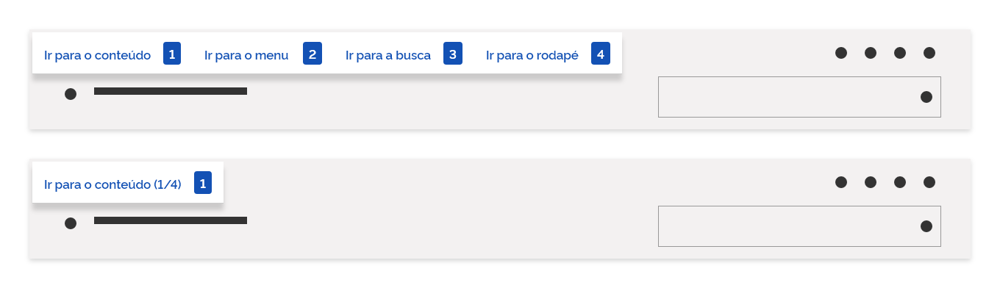
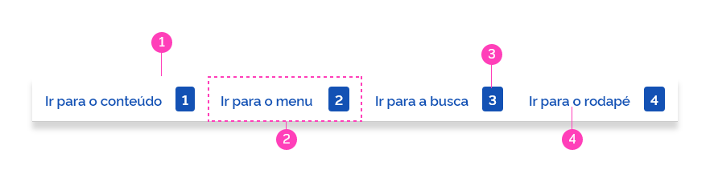
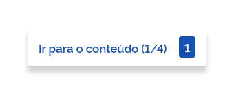
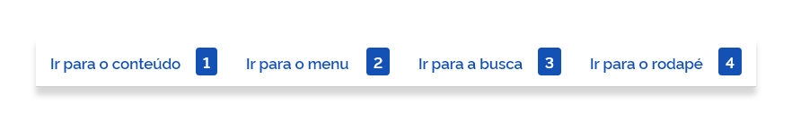
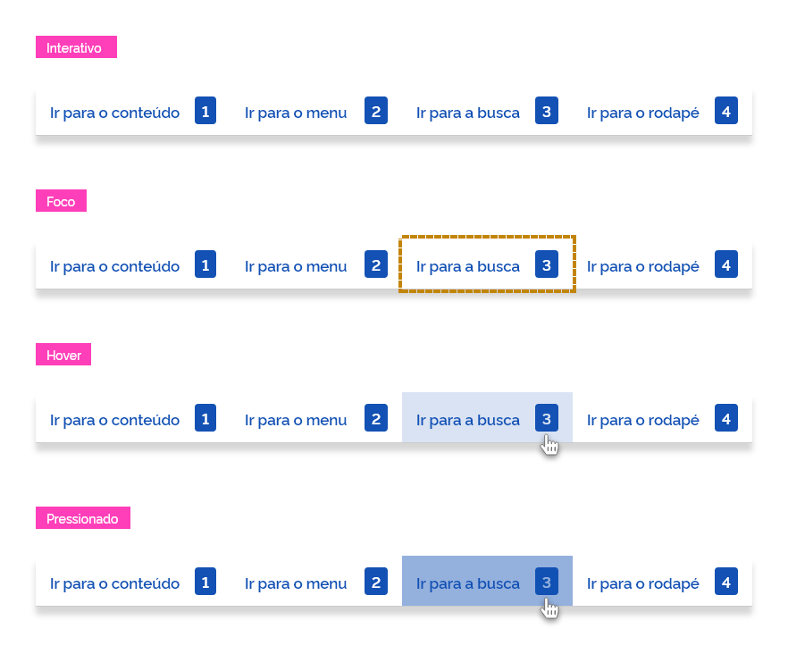

*Exemplo de skip links*

Utilize o componente *skip link* em todas as páginas do seu *site* para torná-las mais acessíveis aos usuários que navegam utilizando o teclado.

---

## Tom e Voz

Utilize *labels* com textos curtos e diretos.

---

## Anatomia

O *skip link* é composto pelos seguintes elementos:

| ID  | Nome       |                         Referência                          | Uso         |
| --- | ---------- | :---------------------------------------------------------: | ----------- |
| 1   | Superfície | [Fundamento Superfície](/ds/fundamentos-visuais/superficie) | Obrigatório |
| 2   | Item       |     [Componente Item](/ds/components/item?tab=designer)     | Obrigatório |
| 3   | *Tag*      |      [Componente Tag](/ds/components/tag?tab=designer)      | Opcional    |
| 4   | Rótulo     | [Fundamento Tipografia](/ds/fundamentos-visuais/tipografia) | Obrigatório |

*Anatomia do skip link*

---

### Detalhamento dos Itens

#### 1. Superfície (Obrigatório)

A superfície é a área onde são organizados os componentes. A diagramação dos componentes dentro dessa área é livre, porém, deve-se levar em conta as características de cada componente.

#### 2. Item (Obrigatório)

O *skip link* é formado por uma lista de itens. São eles que fornecem atalhos para navegação via teclado e com isso, evitam que o usuário necessite navegar por todos os elementos interativos da tela podendo ir diretamente para uma seção específica.

#### 3. *Tag* (Opcional)

Pode-se utilizar dentro do *item* uma *tag* do tipo texto, com o número da tecla correspondente ao *link*, tornando o processo mais visual, porém, o mais importante, é que o leitor de telas interprete o número indicado e o usuário possa por meio das teclas numéricas navegar diretamente para a seção desejada.

#### 4. Rótulo (Obrigatório)

É um elemento de descrição textual que apresenta  formatação específica e tem por finalidade nomear cada item da lista.

---

## Tipos

O componente *skip link* pode ser simples ou composto e deve ser utilizado de acordo com a necessidade de cada projeto.

### 1. Simples

É apresentado apenas uma opção de item por vez. Ocupa menos espaço em tela e funciona melhor em resoluções menores.

*Skip link tipo simples*

O tipo simples deve ter suas dimensões fixas, baseadas no item de maior dimensão.

**Atenção:** ao navegar com a tecla *TAB* as opções de itens de atalho devem ser apresentadas na mesma posição do item anterior.

Como só é apresentado um item por vez, é recomendável acrescentar no *label* a informação de quantos itens estão disponíveis no componente. Para isso, utilize a notação (1/4), (2/4), (3/4), (4/4) e assim por diante.

### 2. Composto

O tipo composto, ao contrário do tipo simples, apresenta simultaneamente todas as opções da lista.

Utilize no máximo quatro itens. Se houver necessidade de uma quantidade maior é recomendável utilizar o tipo simples descrito anteriormente.

*Skip link tipo composto*

O tipo composto apresenta apenas a altura fixa. As larguras variam de acordo com o tamanho de cada conteúdo (*label*).

---

## Comportamentos

Algumas pessoas utilizam a tecla *TAB* para navegação por *hyperlinks* e elementos de formulário em uma página *web*. Incluir o componente *skip link* oferece aos usuários uma opção de ignorar os *hyperlinks* de navegação de nível superior (menu principal) e saltar para o conteúdo principal ou qualquer outra seção de seu interesse no *site*. Portanto, é muito útil para aqueles que preferem utilizar o teclado como forma padrão de navegação, além de indispensáveis para aqueles que possuem algum tipo de deficiência visual, sendo dependentes de leitor de telas.

O componente *skip link* se encontra visualmente oculto até que a tecla *TAB* seja pressionada e, então, é disponibilizado para que o usuário possa navegar pelos seus itens via teclado, indo diretamente para a seção de seu interesse. Ao sair do *skip link* ele deve voltar ao estado oculto.

O atalho *CTRL+TAB* permite que a navegação seja feita no sentido oposto.

**Atenção:** sempre que possível, divida as áreas mais importantes de seu *site* em blocos de informações que façam sentido, por exemplo: menu principal, conteúdo, rodapé, etc. O *skip link* deve dirigir o usuário para cada um desses blocos de informação.

### Estados

O componente *skip link* apresenta os seguintes estados:

*Possíveis estados do skip link*

**Atenção:** jamais utilize o estado desabilitado no componente *skip link*.

---

## Melhores práticas

-   *Skip links* se tornam essenciais em *sites* com grandes quantidades de informação e menus com muitos itens.

-   Os usuários que navegam por auxílio de teclado devem ser capazes de acessar todos os elementos interativos, não apenas a navegação principal ou *hyperlinks*. Isso significa que os elementos do formulário, menus suspensos, botões, caixas de diálogo e outros *widgets* devem ser acessíveis por meio de tabulação na interface. Este componente deve estar logo após a *tag body* (deve ser a primeira coisa que um usuário de teclado acessaria em sua página).

-   Existem milhares de pessoas no mundo com algum tipo de deficiência. Ao possibilitar que naveguem em seu *site* por meio do *skip link*  aumentará a visibilidade, a acessibilidade e atenderá a um maior número de usuários.

-   Lembre-se que a acessibilidade é também um fator muito importante para ranqueamento do Google.

-   Implementar o *skip links* em seu *site* demonstra que seu serviço se preocupa com a inclusão, ajudando a conquistar novos potenciais clientes.

---

## Especificações

### Alinhamentos

| Name      | Property |        Spacing Token        |
| --------- | -------- | :-------------------------: |
| Rótulo    | Align    | `--spacing-vertical-center` |
| Tag       | Align    | `--spacing-vertical-center` |
| Skip link | Align    | `--spacing-horizontal-left` |

### Espaçamentos

| Name          | Property           |        Token/Value        |
| ------------- | ------------------ | :-----------------------: |
| Item          | padding-top/bottom |  `--spacing-scale-baseh`  |
| Item          | padding-left/right |   `--spacing-scale-2x`    |
| Entre os item | spacing            | `--spacing-scale-default` |
| Skip link     | spacing            |  `--spacing-scale-half`   |
| Skip link     | spacing            |  `--spacing-scale-half`   |

### Dimensões

| Name | Property |     Token/Value      |
| ---- | -------- | :------------------: |
| Item | width    |      `variável`      |
| Item | height   | `--spacing-scale-7x` |

### Tipografia

| Name   | Property | Token/Value               |
| ------ | -------- | ------------------------- |
| Rótulo | size     | `--font-size-scale-up-01` |
| Rótulo | weight   | `--font-weight-semi-bold` |

### Cores

| Name   | Property   | Color Token            |
| ------ | ---------- | ---------------------- |
| Item   | background | `--pure-0`             |
| Rótulo | text       | `--blue-warm-vivid-70` |
| Tag    | background | `--blue-warm-vivid-70` |

### Elevação

| Name |   Elevation Token   |
| ---- | :-----------------: |
| Item | `--z-index-layer-4` |

### Sombra

| Name |     Shadow Token      |
| ---- | :-------------------: |
| Item | `--surface-offset-xl` |
