[version]: # (1.1.2)

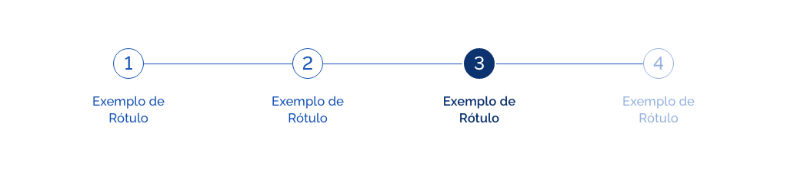
*Exemplo de Step Complexo*


*Exemplo de Steps Simples*

Utilize _Steps_ quando:

- houver necessidade de construir fluxos de navegação com etapas sequenciais;
- houver necessidade de sinalizar ao usuário uma ideia de progressão durante uma jornada: etapas concluídas, não concluídas e etapas em andamento;
- houver necessidade de sinalizar ao usuário o tamanho do fluxo que este deverá percorrer.

Não utilize _Steps_:

- quando não houver necessidade de sinalizar ao usuário uma sequência de progressão, linear ou não. Neste caso utilize _Menus_ ou _Tabs_.
- quando as etapas não possuirem relação entre si. É importante que o uso de _Steps_ esteja diretamente relacionado com a ideia de se completar um fluxo, tarefa ou jornada.

---

## Anatomia

O _Componente Step_ é constituido por:

1. Indicador;
2. Rótulos;
3. Linha do Tempo.

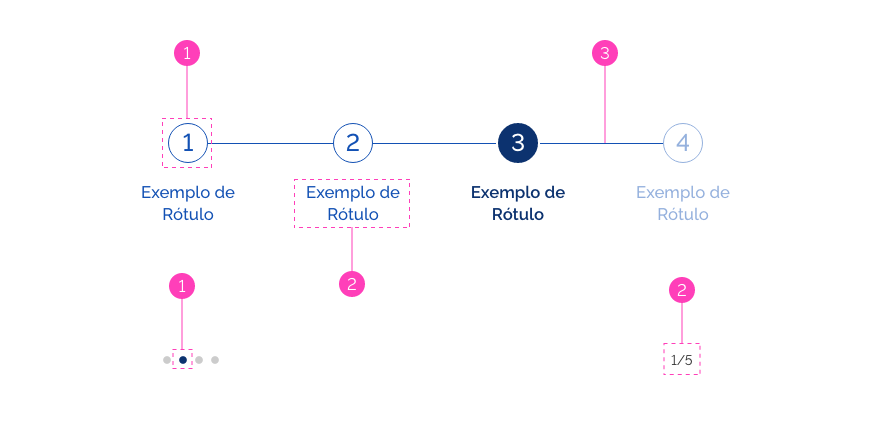
*Anatomia do Step*

### Detalhamento dos itens

#### 1 - Indicador

O _Indicador_ é o elemento que definirá os estados de cada etapa, além de servir como elemento interativo por onde o usuário poderá navegar. Os _Indicadores_ poderão ser utilizados da seguinte forma:

##### A - Representando a Ordem Numérica das Etapas

É a forma mais comum de utilização do _Indicador_. Este modelo provê ao usuário claramente a quantidade de etapas que este deverá seguir e a etapa onde se encontra.

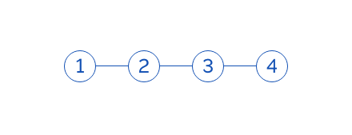
*Indicador Ordem Numérica*

##### B - Representando uma Informação Iconográfica

É um modelo que transmite ao usuário uma informação semântica através dos ícones e deverá ser utilizado com cautela. Abaixo seguem algumas dicas:

- certifique-se de que o ícone utlizado transmita uma ideia bastante clara ao usuário da ação ou etapa que representa;
- não utilize este modelo quando o número de etapas for muito extenso;
- recomenda-se fortemente a utilização de rótulos como apoio à informação transmitida;
- se possível, numere as etapas nos rótulos.


*Indicador Informação Iconográfica*

##### C - Indicador Vazio

Este formato possui uma representação mais simples e pode ser utilizado quando a necessidade for construir um layout mais minimalista. Além disso, é um modelo bastante adequado para interfaces em dispositivos móveis (_Grid de 4 colunas_), pois permite uma economia maior do espaço horizontal. Neste modelo não se utiliza informação numérica ou iconográfica.

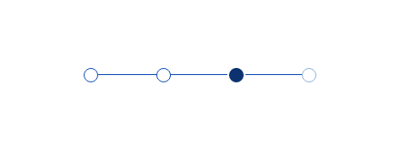
*Indicador Vazio - Sem informação numérica ou iconográfica*

Fique atento a algumas boas práticas:

- Utilize este modelo quando tiver certeza que a ausência de ícones ou números, não interferirá no entendimento do usuário durante sua jornada;

- Recomenda-se utilizar poucas etapas neste tipo de formato;

- Recomenda-se utilizar este modelo em interfaces para dispositivos móveis;

- Quando o _Rótulo_ não for utilizado, faça uso do _Componente Tooltip_ para auxiliar o usuário no seu entendimento;

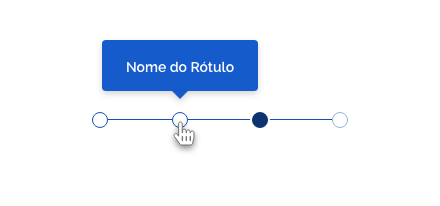
*Uso do Tooltip no Indicador Vazio*

**Atenção!** Caso também seja necessário utilizar o _Tooltip_ para indicar algum erro ou alerta, em situações onde não existe _Rótulo_, utilize o nome do _Rótulo_ dentro do _Tooltip_ que indica o erro ou alerta, juntamente com o detalhamento do erro ou alerta. Veja abaixo:

 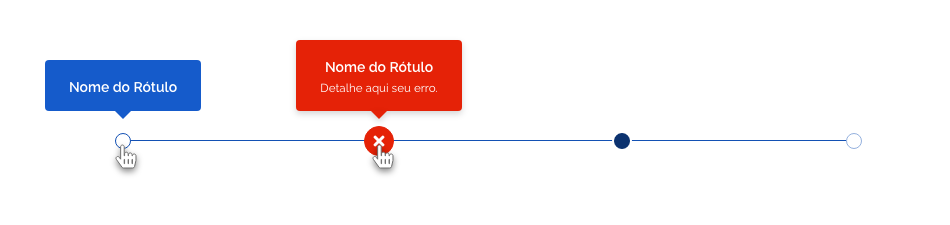
*Uso do Tooltip sem Rótulo com alertas*

#### 2 - Rótulos

O _Rótulo_ é a informação textual que acompanha o _Indicador_, sua utilização não é obrigatória, mas é recomendada. O _Rótulo_ deverá transmitir a informação, clara, direta e objetiva ao usuário da ação ou etapa que representa. Pode ser utilizado da seguinte forma:

- Centralizado abaixo do _Indicador_. É a forma mais utilizada e por tanto o modelo de posicionamento padrão para o _Rótulo_. O texto do _Rótulo_ deve possuir alinhamento centralizado;


*Rótulo Centralizado abaixo do Indicador (Padrão)*

- Centralizado acima do _Indicador_, como posicionamento alternativo. O texto do _Rótulo_ deve possuir alinhamento centralizado;


*Rótulo Centralizado acima do Indicador (Alternativo)*

- À direita do _Indicador_, como forma de posicionamento alternativo. Neste caso, o texto do _Rótulo_ deve possuir alinhamento à esquerda;


*Rótulo à direita do Indicador (Alternativo)*

- À esquerda do _Indicador_, como posicionamento alternativo. Neste caso, o texto do _Rótulo_ deve possuir alinhamento à direita.

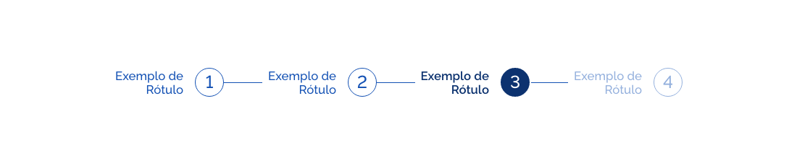
*Rótulo à esquerda do Indicador (Alternativo)*

É importante estar atendo a algumas boas práticas:

- o ideal é que se utilize apenas uma palavra no rótulo;
- caso haja necessidade, utilize duas ou três palavras, no máximo;
- use um texto claro, direto e objetivo;
- mantenha a consistência optando por apenas um dos modelos em seu projeto, não utilize mais de um tipo;
- no caso do posicionamento do _Rótulo_ à direita ou à esquerda do _Indicador_, fique atento às restrições de espaço. Estes tipos de posicionamento necessitam de mais espaço horizontal e são mais adequados em resoluções _Desktop_ (_Grid_ de 12 colunas);
- na ausência do _Rótulo_, recomenda-se utilizar o _Componente Tooltip_ para auxiliar o usuário em seu entendimento.

##### Rótulo no Tipo _Step Textual_

O _Rótulo_ também é utilizado no modelo tipo _Step Textual_. Veja mais detalhes em _Tipos_.

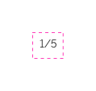
*Rótulo no Tipo Step Textual*

#### 3 - Linha do Tempo

A linha do tempo servirá para dar sentido semântico ao fluxo que deve ser seguido pelo usuário através das etapas. Esta se posiciona entre os _Indicadores_ e acompanha o espaçamento entre eles.

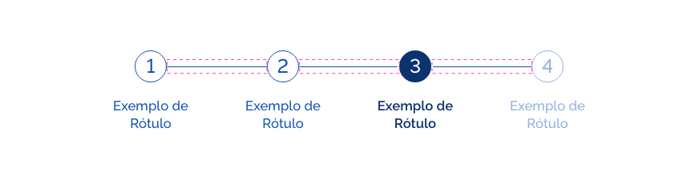
*Exemplo de Linha do Tempo*

##### Linha do Tempo com _Indicadores_ Ocultos

A linha do tempo também tem a função de indicar se existem mais _Indicadores_ ocultos. Quando isto ocorrer, a linha do tempo deverá "sangrar" até os limites da tela, indicando que há mais etapas antes ou depois das etapas visíveis na tela. Além disto, deve-se utilizar sombras nas laterais do _Painel de Etapas_, nos lados onde houver etapas ocultas. Observe o exemplo abaixo:

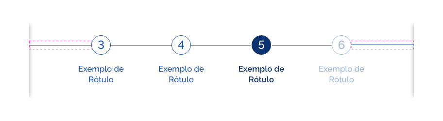
*Exemplo de Linha do Tempo com Indicadores Ocultos*

---

## Tipos

### 1 - Step Complexo

Este tipo é bastante utilizado em _Wizard (Assistentes)_ e auxiliam o usuário durante o fluxo ou jornada de alguma tarefa específica.


*Exemplo de Step Complexo*

### 2 - Step Simples

É um modelo bastante resumido e otimizado para utilização dentro de outros componentes. É mais comumente utilizado em _Carrosséis de Imagens_, _Cards_, _Janelas Modais_, entre outros. Este modelo geralmente é utilizado juntamente com outros controles de navegação, como por exemplo, botão para avançar e recuar. O funcionamento destes controles de navegação dependem do componente que contém os _Steps_. Observe o exemplo abaixo.


*Exemplo de Utilização do Step Simples - Os controles de navegação fazem parte do Carrossel no exemplo*

- Evite utilizar um número elevado de etapas no _Step Simples_, pois resulta em problemas de diagramação e usabilidade.
- recomenda-se utilizar de 4 a 5 etapas neste caso;
- caso necessite de mais etapas, utilize o _Step Textual_.

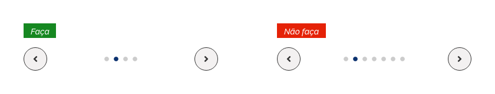
*Uso do Step Simples*

### 3 - Step Textual

O _Step Textual_ possui a mesma finalidade do _Step Simples_, e pode ser utilizado dentro de outros componentes, a diferença é que este apresenta a progressão das etapas de forma textual. Sendo formatado da seguinte maneira: "Etapa Atual" / "Total de Etapas". Este modelo oferece a possibilidade de exibir um número de etapas maior que o permitido no _Step Simples_, devido ao formato compacto da representação numérica.

Observe o exemplo abaixo:


*Exemplo de Step Textual*

- Utilize o _Step Textual_ quando houver necessidade de um número elevado de etapas;


*Uso do Step Textual*

---

## Comportamentos

### 1 - Progressão Linear x Não Linear

A progressão definirá se o usuário deverá obedecer uma ordem sequencial ou não. Sendo assim, dependendo da regra de negócio em cada projeto, a progressão das etapas pode ser linear ou não linear.

#### Linear

Na progressão linear o acesso a cada etapa depende da conclusão da etapa anterior. Logo, as etapas não visitadas deverão permanecer no estado desabilitado. Este comportamento é bastante utilizado quando há a necessidade de enviar formulários subsequentes ou na execução de tarefas que tenha interdependência.

- A - As etapas não visitadas deverão permanecer em estado desabilitado até a conclusão da etapa anterior;

- B - As etapas concluídas devem ser apresentadas no estado concluído.

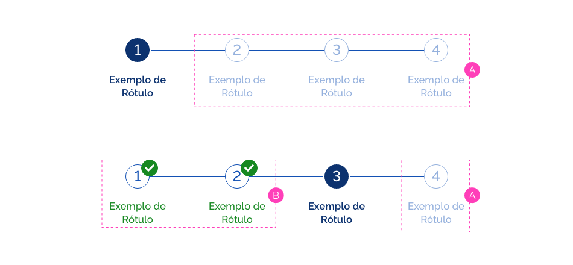
*Exemplo de Steps com Progressão Linear*

#### Não Linear

Na progressão não linear, o usuário poderá acessar todas as etapas livremente. Este comportamento é bastante utilizado quando a conclusão de uma etapa não depende da conclusão de outra.

- A - as etapas não concluídas deverão permanecer no estado interativo e o usuário poderá navegar livremente por elas;

- B - as etapas concluídas deverão permanecer com o estado concluído.

 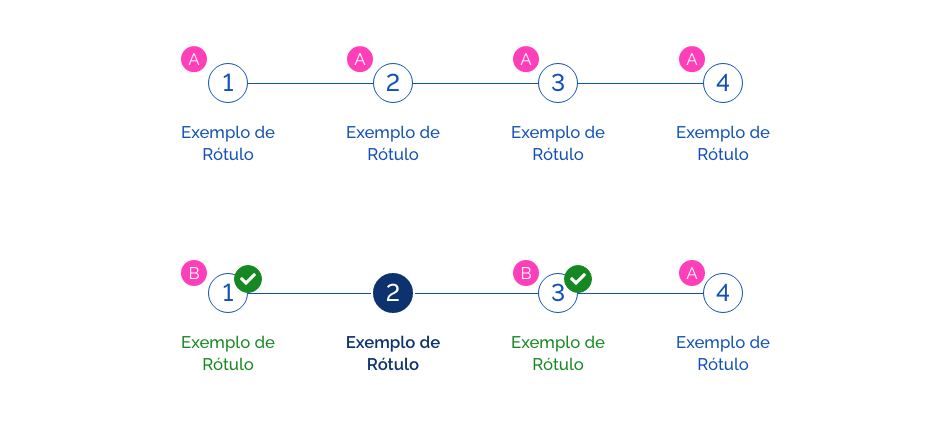
*Exemplo de Steps com Progressão Não Linear*

### 2 - Orientação Vertical x Horizontal

O _Step Complexo_ possui orientação horizontal e vertical e pode ser utilizado a depender da estrutura de layout em cada projeto.

#### Orientação Horizontal

Muito utilizada em resoluções para _Desktop_ _(Grid de 12 ou 8 colunas)_.
 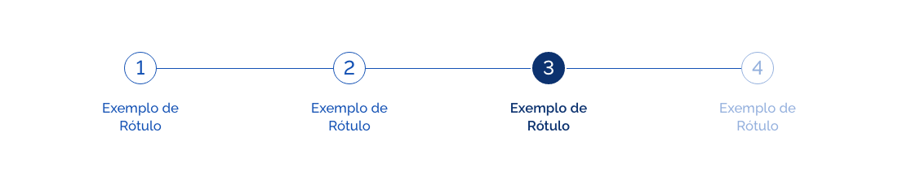
*Step Complexo - Orientação Horizontal*

#### Orientação Vertical

Apesar de não ser uma obrigatoriedade, geralmente a orientação vertical é mais adequada em dispositivos móveis _(Grid de 4 colunas)_, onde a navegação vertical é mais presente.

Neste modelo, os _Steps_ posicionam-se à esquerda, a _Linha do Tempo_ fica disposta na direção vertical e o conteúdo da etapa atual será apresentado abaixo do _Indicador_ e do _Rótulo_. Observe o modelo abaixo:

 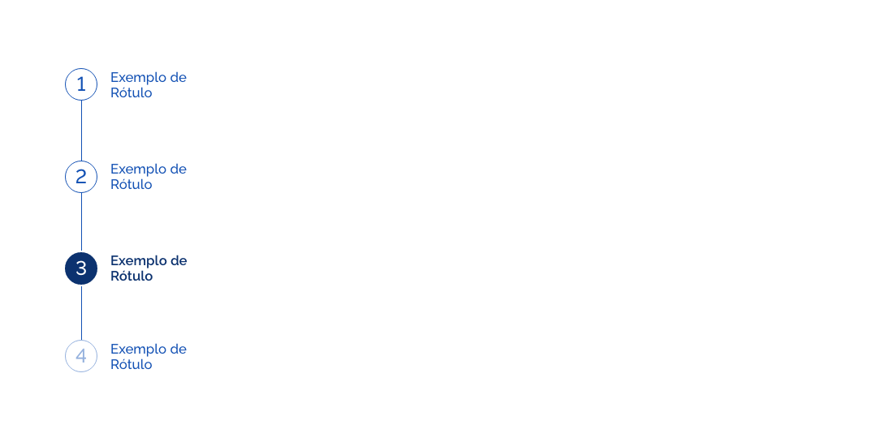
*Step Complexo - Orientação Vertical*

##### Conteúdo x Orientação Vertical

Na orientação vertical o conteúdo poderá ser posicionado entre as etapas ou ao lado delas. Observe abaixo:

 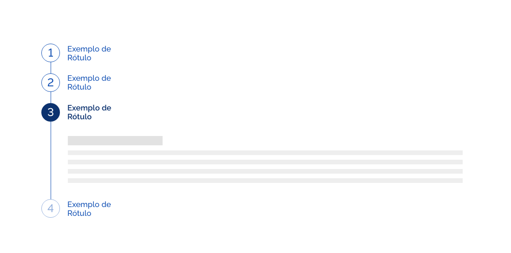
*Steps Orientação Vertical - Conteúdo entre as Etapas*

 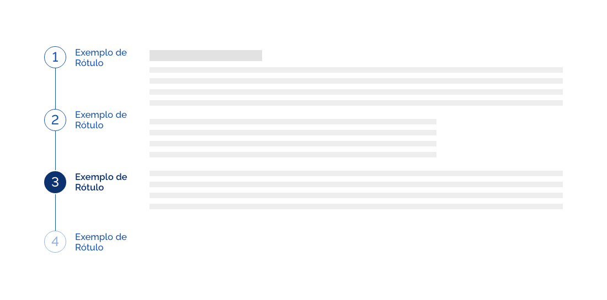
*Steps Orientação Vertical - Conteúdo ao lado das Etapas*

### 3 - Responsividade

#### _Grid_ de 12 Colunas

Nas _Grids_ de 12 colunas é possível utilizar os dois tipos de orientação para o _Steps_, horizontal e vertical. A escolha pode ser feita por razões de adequação à diagramação de interface ou questões estéticas.

 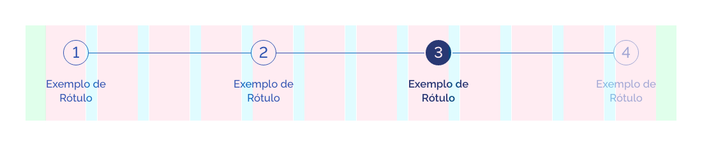
*Step Complexo - Grid de 12 Colunas - Orientação Horizontal*

 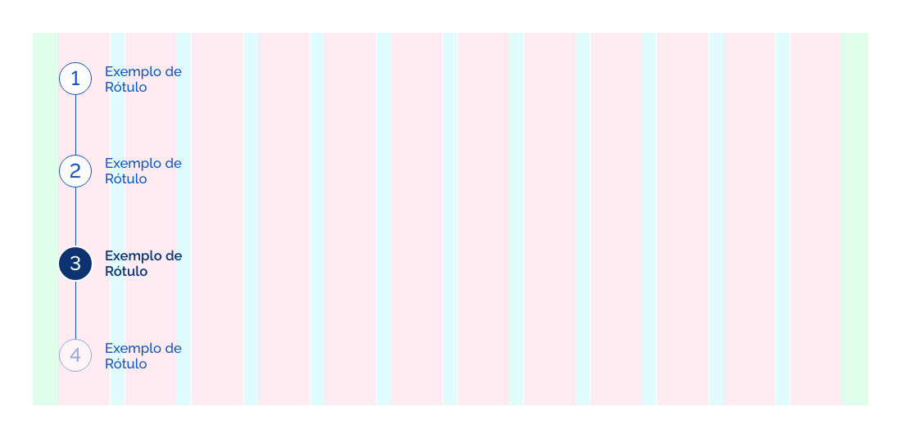
*Step Complexo - Grid de 12 Colunas - Orientação Vertical*

#### _Grid_ de 8 e 4 Colunas

Já nas _Grids_ de 8 e 4 colunas, recomenda-se utilizar a orientação vertical, pois este modelo se adequa melhor a dispositivos móveis. Veja os exemplos abaixo:

 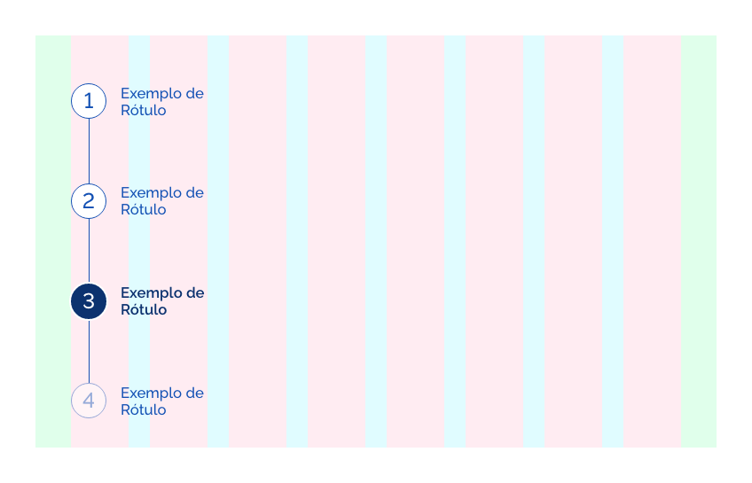
*Step Complexo - Grid de 8 Colunas - Orientação Vertical*

 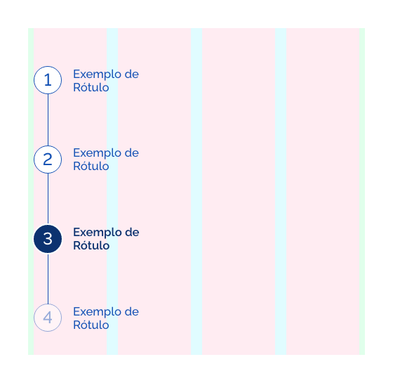
*Step Complexo - Grid de 4 Colunas - Orientação Vertical*

**Importante!** Caso seja necessário utilizar a orientação horizontal em _Grids_ de 8 e 4 colunas, é fortemente recomendado que sejam exibidos no máximo 4 *Etapas* na área vísivel da tela. As demais etapas deverão permanecer ocultas e só serão exibidas caso o usuário realize o movimento de rolagem horizontal. Veja mais detalhes sobre o comportamento de rolagem na *Seção > Comportamento > Espaçamento entre Etapas > Espaçamento com Scroll*.

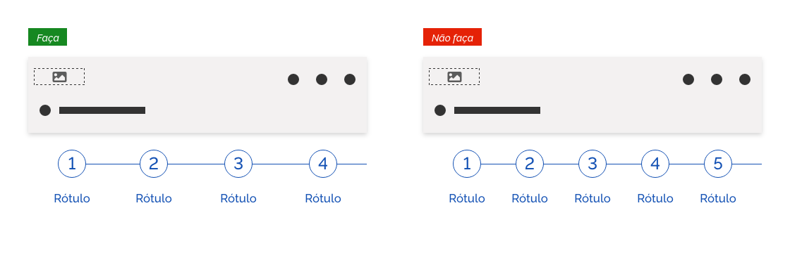
*Número Máximo de Etapas em Grids de 4 e 8 colunas*

#### Responsividade do _Step Simples_ e _Step Textual_

Estes dois tipos de _Steps_, tendo em vista sua forma compactada, não são influenciados pela resolução da tela, logo não possuem características responsivas. Geralmente estão localizados dentro de outros componentes. Neste caso, apenas os componentes que os contém é que possuem suas próprias características responsivas. Neste caso, o _Step Simples_ e _Step Textual_ devem se manter centralizados ao componente que fazem parte. Veja os exemplos abaixo:

 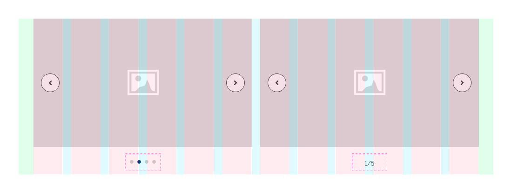
*Carrossel com Step Simples e Step Textual - Grid de 12 Colunas*

 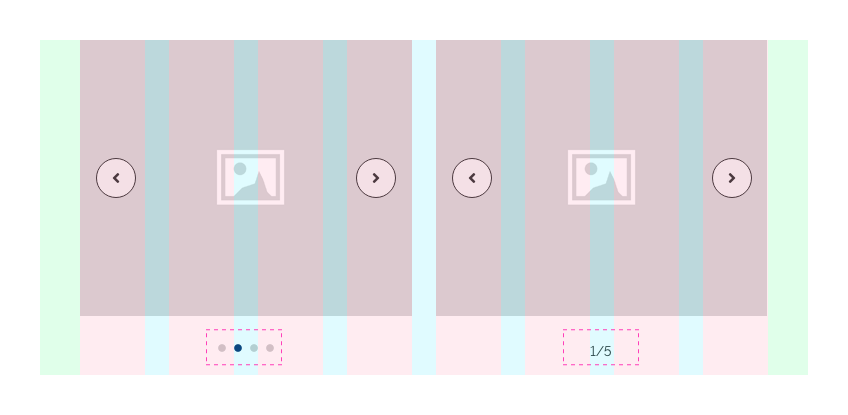
*Carrossel com Step Simples e Step Textual - Grid de 8 Colunas*

 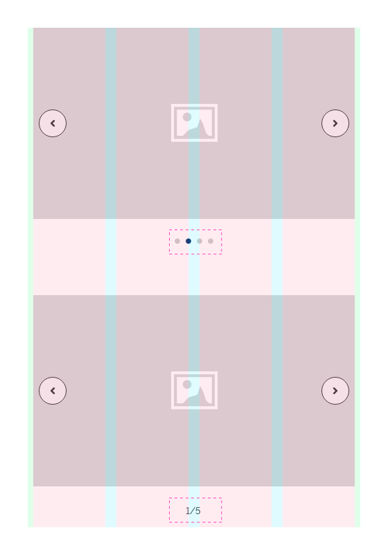
*Carrossel com Step Simples e Step Textual - Grid de 4 Colunas*

### 4 - Espaçamento entre as Etapas

Os _Rótulos_ e _Indicadores_ das etapas podem ser distribuídos na tela de duas formas: com espaçamento dinâmico ou com o espaçamento fixo com _scroll_.

#### Espaçamento Dinâmico

No espaçamento dinâmico, os _Rótulos_ e _Indicadores_ são distribuídos de forma linear e equidistantes por toda largura ou altura disponível na área visível da tela. Não importa o número de etapas, estas serão distribuídas pela largura ou altura útil da tela. Observe abaixo:

 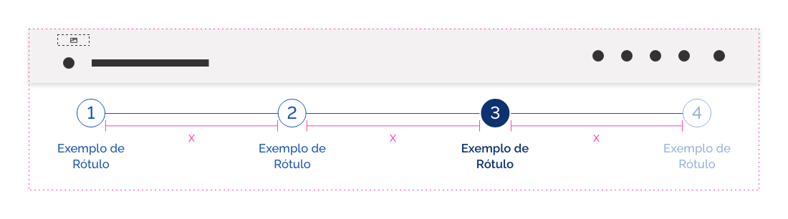
*Espaçamento Dinâmico entre as Etapas - Horizontal*

 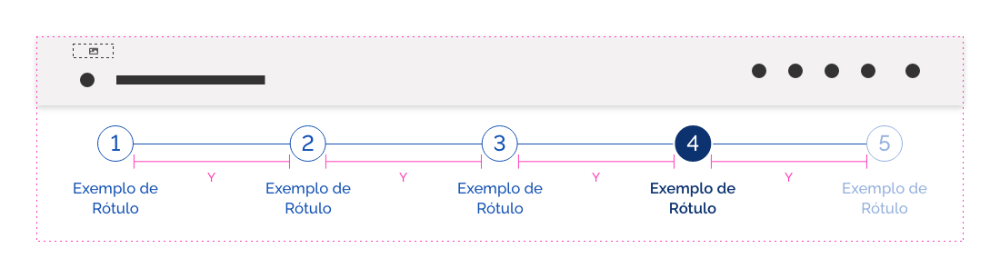
*Espaçamento Dinâmico entre as Etapas - Horizontal*

 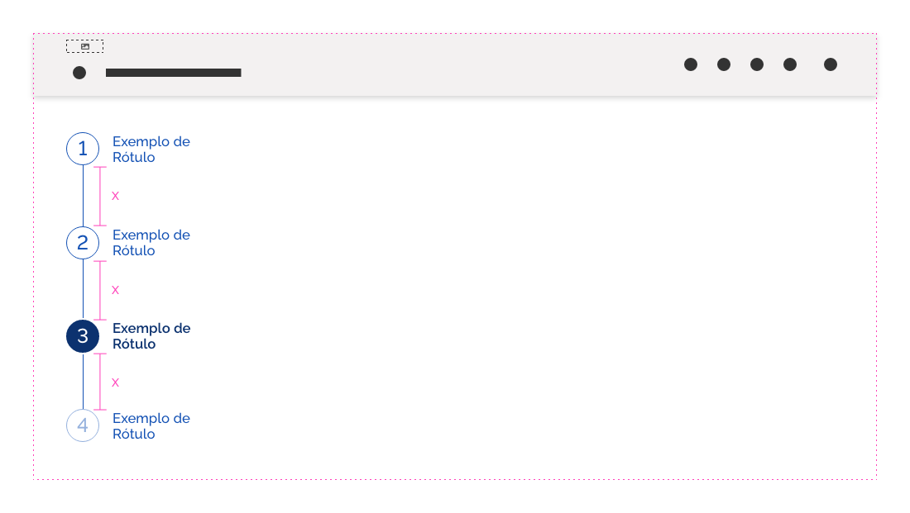
*Espaçamento Dinâmico entre as Etapas - Vertical*

 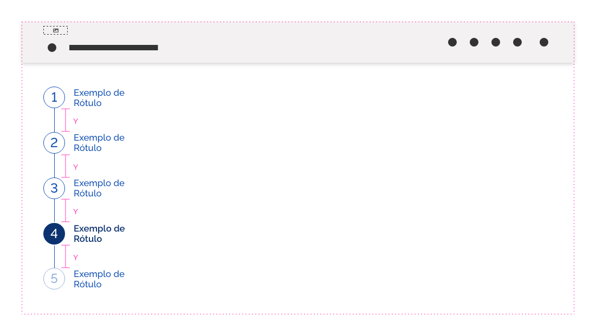
*Espaçamento Dinâmico entre as Etapas - Vertical*

#### Espaçamento Fixo com _Scroll_

No espaçamento fixo com _Scroll_, a distância entre as etapas são determinadas por parâmetro e caso o número de etapas ultrapasse a área visível da tela, o usuário poderá navegar pelas etapas ocultas com _Scroll_.

A - O espaçamento fixo é determinado por parâmetro;
B - Caso o número de etapas ultrapasse a área visível da tela, é utilizado o _Scroll_ para acessar as etapas ocultas;
C - Área visível da tela.

 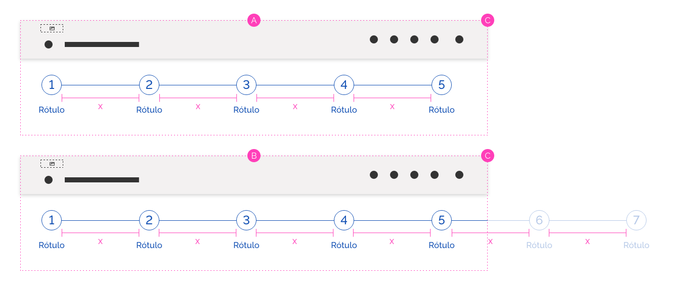
*Espaçamento Fixo com Scroll*

##### Comportamento do Scroll

**A -** O usuário poderá posicionar o dedo ou o mouse sobre qualquer uma das etapas visíveis e;

**B -** poderá deslizar horizontalmente para esquerda ou direita, exibindo as etapas ocultas.

 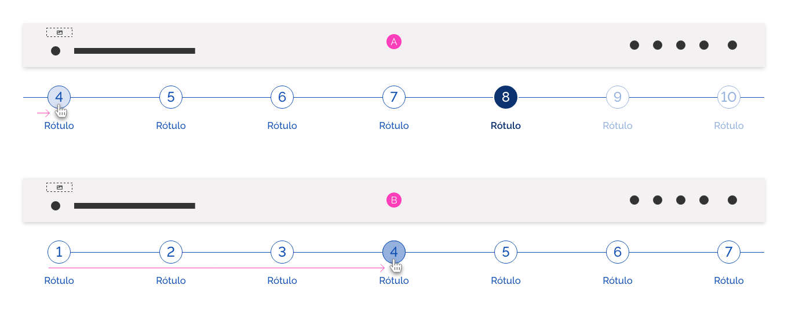
*Espaçamento Fixo com Scroll - Grid de 12 colunas*

 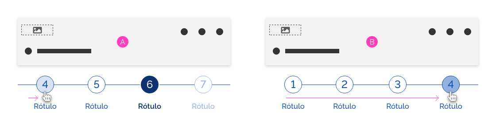
*Espaçamento Fixo com Scroll - Grid de 4 colunas*

### 5 - Densidade

#### Densidade Alta

Utilize densidade alta quando houver necessidade de economizar espaço em tela, ou quando esta densidade se adequar melhor ao projeto de layout. Para o _Step Simples_, não há necessidade de se utilizar a alta densidade, visto que este componente já possui uma compactação muito elevada.

 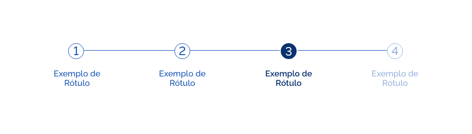
*Densidade Alta*

#### Densidade Média (Padrão)

A densidade média ou padrão é forma comum do _Step Complexo_ e do _Step Simples_.

 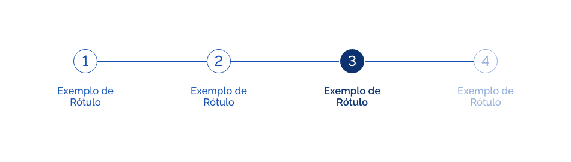
*Densidade Média (Padrão) do Step Complexo*

 
*Densidade Média (Padrão) do Step Simples*

#### Densidade Baixa

Utilize a densidade baixa quando houver necessidade de uma área maior de clique ou um destaque maior para as etapas.

 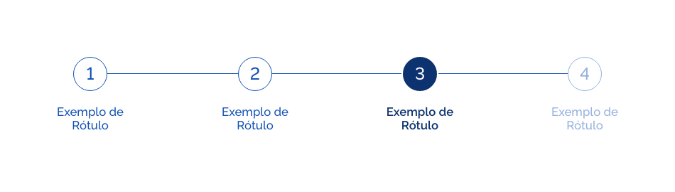
*Densidade Baixa do Step Complexo*

 
*Densidade Baixa do Step Simples*

### 6 - Uso de Alertas, Erros e Concluído

No _Step Complexo_, é possível sinalizar ao usuário erros ou pendências ocorridas nas etapas, além de sinalizar se a etapa foi concluída. Isto é feito com a utilização do _Componente Tag_, do tipo _Ícone_. Esta _Tag_ é posicionada no topo e à direita do _Indicador_, e pode representar os _Estados Alert_, _Error_ e _Concluído_.

- Quando ocorrer alguma pendência referente à tarefa realizada em alguma etapa do fluxo, comunique através da _Tag_ no _Estado Alert_ no _Indicador_ e _Rótulo_.

 
*Estado Alert*

- Da mesma forma, caso ocorra algum erro ou impedimento na tarefa executada em alguma etapa, comunique ao usuário através da _Tag_ no _Estado Error_ no _Indicador_ e _Rótulo_;

 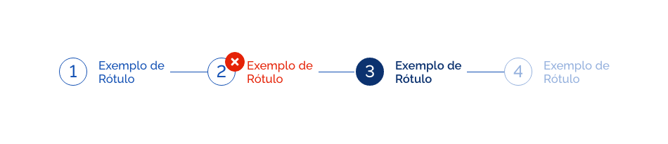
*Estado Error*

- Quando a tarefa é finalizada em uma determinada etapa, utilize a _Tag_ com o estado concluído no _Indicador_ e _Rótulo_.

 
*Estado Concluído*

- Recomenda-se utilizar também o _Componente Tooltip_ para exibir o detalhamento da pendência. Utilize o _Tooltip_ com a interação `mouseover` e detalhe em poucas palavras qual erro ou pendência precisa ser sanada pelo usuário. Observe os exemplos abaixo:

 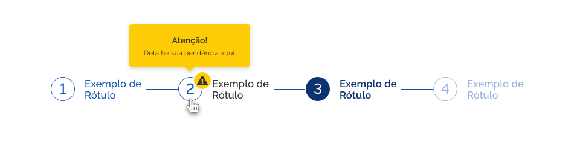
*Uso do Tooltip com Estado Alert*

 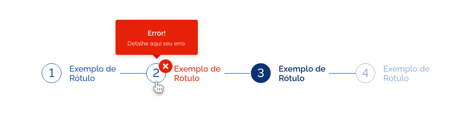
*Uso do Tooltip com Estado Error*

#### Alertas e Erros com o _Indicador Vazio_

Nesta situação, a utilização da _Tag_ de _Erro_ ou _Alerta_ substituirá o _Indicador_, dando ênfase à etapa com pendências.

 
*Erros com o Indicador Vazio*

 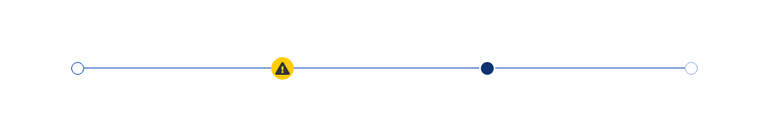
*Alertas com o Indicador Vazio*

**Atenção!** Quando a etapa com erro, alerta ou concluído for a etapa em que o usuário se encontra, ou seja, quando for a etapa ativa, a _Tag_ de erro, alerta ou concluído deve ser circulada por uma borda representando a cor do estado ativo. Veja as diferenças abaixo:

 
*Erro com o Indicador Numérico no Estado Ativo*

 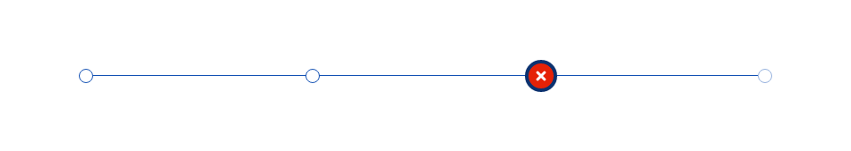
*Erro com o Indicador Vazio no Estado Ativo*

 
*Alerta com o Indicador Numérico no Estado Ativo*

 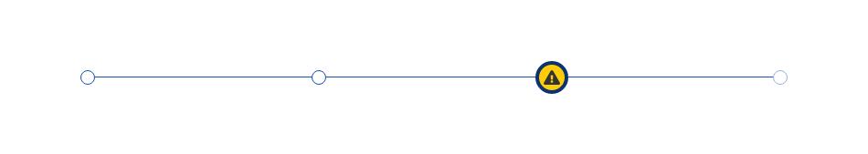
*Alerta com o Indicador Vazio no Estado Ativo*

 
*Concluído com o Indicador Numérico no Estado Ativo*

 
*Concluído com o Indicador Vazio no Estado Ativo*

### 7 - Estados

#### Estado Interativo

Utilize o estado interativo sobre os elementos nos quais o usuário irá interagir, nesse caso o _Rótulo_ e o _Indicador_.

 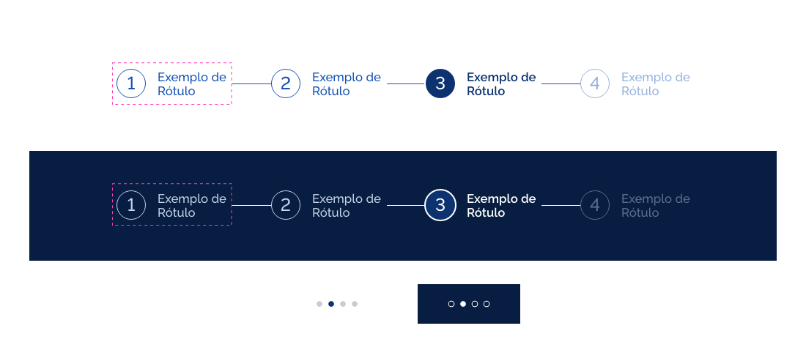
*Estado Interativo*

- Durante a progressão não linear, as etapas não visitadas podem apresentar-se no estado interativo, pois o acesso a essas etapas não dependem da conclusão das anteriores.

  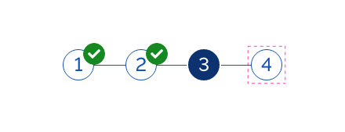
*Etapas Não Visitadas - Estado Interativo*

#### Estado Hover

O estado hover ocorre sobre o _Indicador_ e _Rótulo_ quando o usuário passar o mouse sobre eles.

 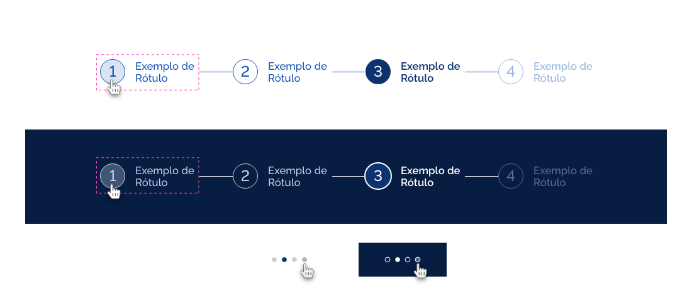
*Estado Hover*

#### Estado Ativo

O estado ativo ocorre sobre o _Indicador_ e _Rótulo_ que representam a etapa na qual o usuário se encontra.

 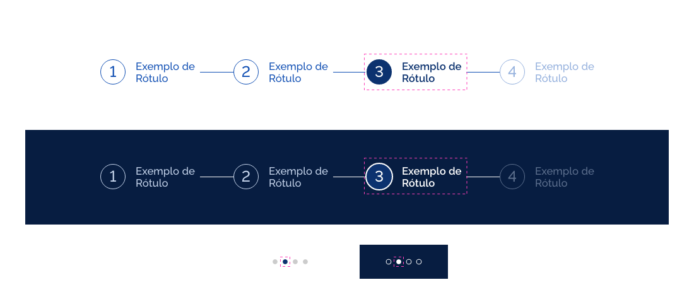
*Estado Ativo*

#### Estado Desabilitado

O estado desabilitado ocorre nas etapas não visitadas ou inoperantes.

 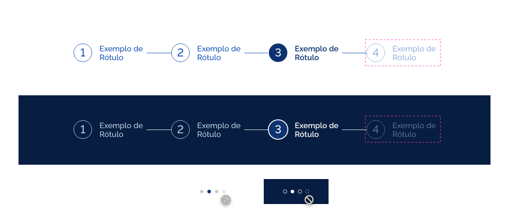
*Estado Desabilitado*

- quando o acesso a etapas não visitadas depender da conclusão das anteriores, ou seja na progressão linear, utilize o estado desabilitado.

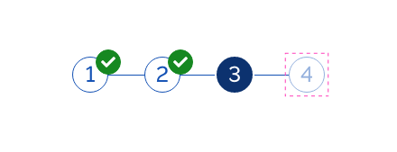
*Indicador de Etapa Não Visitada Desabilitado - depende da conclusão das etapas anteriores*

#### Estado Pressionado

O estado pressionado ocorre quando o usuário clica sobre o _Indicador_ ou _Rótulo_.

 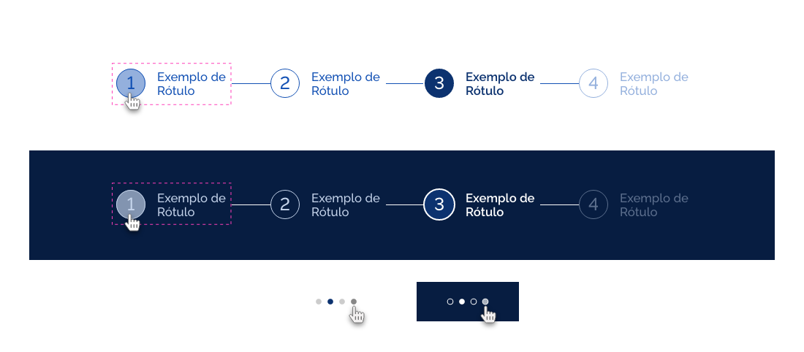
*Estado Pressionado*

#### Estado Foco

O estado foco ocorre quando o _Indicador_ ou _Rótulo_ recebe o foco do navegador através de uma navegação via tecla `Tab`.

 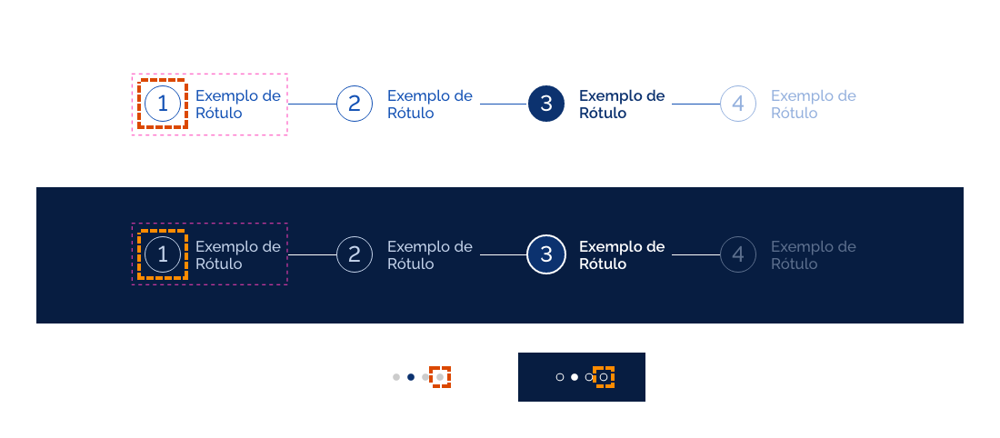
*Estado Foco*

#### Estado Concluído

Este formato tem a finalidade exclusiva de representar as etapas concluídas. Ou seja, a tarefa referente àquela etapa precisa estar finalizada. Por exemplo, um envio de um formulário ou a leitura de um texto com consentimento.

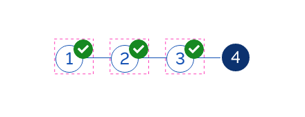
*Indicador Etapa Concluída*

 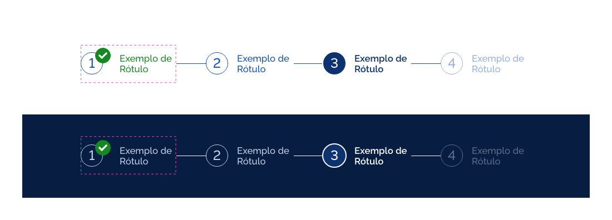
*Estado Concluído*

#### Estado Alert

O estado alert ocorre sobre o _Indicador_ e o Rótulo quando há a necessidade de informar alguma pendência referente à tarefa de alguma etapa.

 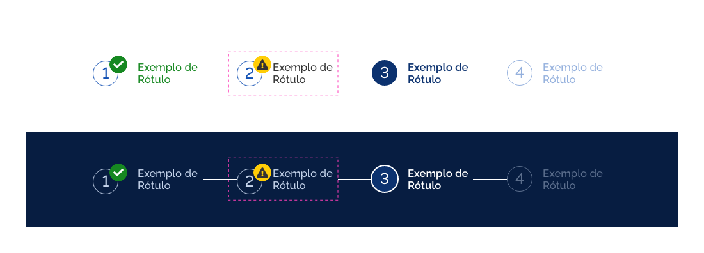
*Estado Alert*

#### Estado Error

O estado error ocorre sobre o _Indicador_ e o Rótulo quando há a necessidade de informar algum erro ou impedimento referente à tarefa de alguma etapa.

 
*Estado Error*

---

## Acessibilidade

É importante observar algumas boas práticas no quesito acessibilidade. Veja abaixo:

- quando utilizar _Indicadores_ sem _Rótulo_, utilize sempre recursos de `aria-labels` no código _HTML_, trazendo a informação da ação e permitindo a possibilidade de leitores de tela;

``` html
<tag aria-label="Nome do Rótulo"></tag>
```

- fique atento ao contraste de cores utilizado entre o plano de fundo e a cor dos _Rótulos_ ou _Indicadores_. Observe as especificações de contraste no [_Fundamento Cores_](/ds/fundamentos-visuais/cores);

 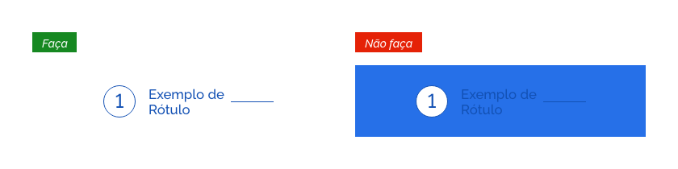
*Fique atento ao contraste de cores nos Rótulos*

 
*Fique atento ao contraste de cores no Indicador Simples*

- evite utilizar _Indicador Simples_ como a ÚNICA de forma interativa de navegação. Sua forma reduzida dificulta a interação do usuário através do _mouse_ ou _touch_; Se for o caso, utilize-o apenas como um elemento de apoio para navegação, acompanhado de um elemento de navegação principal;

 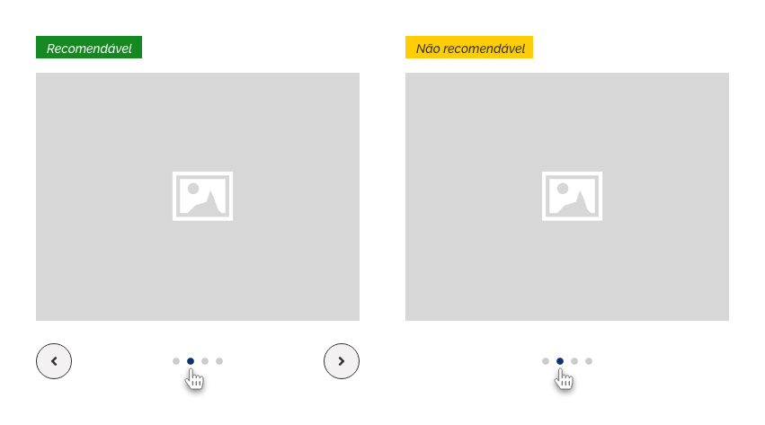
*Evite utilizar o _Indicador Simples_ como a ÚNICA de forma interativa de navegação*

- ofereça controles de navegação ao usuário sempre que utilizar o _Step Simples_ e o _Step Textual_. Estes controles devem fazer parte do componente que os contém e seu funcionamento depende exclusivamente da característica deste componente;

 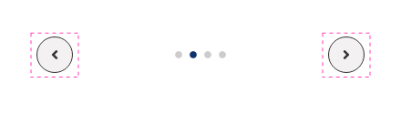
*Controles de Navegação no Step Simples*

 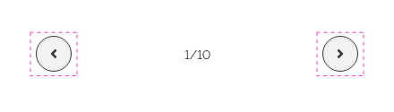
*Controles de Navegação no Step Textual*

- em caso de _Steps_ que funcionem em _loop_ automático, ofereça ao usuário controles de interação que permitam pausar ou retomar a animação.

  
*Exemplo de controles de interação*

---

## Especificação

### Cores

#### Estado Interativo

| Name                             | Property     | Token/Value            |
| -------------------------------- | ------------ | ---------------------- |
| Rótulos                          | color        | `--blue-warm-vivid-70` |
| Rótulos (Fundo Escuro)           | color        | `--blue-warm-20`       |
| Indicador                        | color        | `--blue-warm-vivid-70` |
| Indicador                        | border-color | `--blue-warm-vivid-70` |
| Indicador                        | border-style | `solid`                |
| Indicador                        | border-width | `--surface-width-sm`   |
| Indicador (Fundo Escuro)         | color        | `--blue-warm-20`       |
| Indicador (Fundo Escuro)         | border-color | `--blue-warm-20`       |
| Indicador (Fundo Escuro)         | border-style | `solid`                |
| Indicador (Fundo Escuro)         | border-width | `--surface-width-sm`   |
| Indicador Simples                | background   | `--gray-20`            |
| Indicador Simples (Fundo Escuro) | border-color | `--pure-0`             |
| Indicador Simples (Fundo Escuro) | border-style | `solid`                |
| Indicador Simples (Fundo Escuro) | border-width | `--surface-width-sm`   |
| Linha do Tempo                   | border-color | `--blue-warm-vivid-70` |
| Linha do Tempo (Fundo Escuro)    | border-color | `--pure-0`             |
| Linha do Tempo                   | border-style | `solid`                |
| Linha do Tempo                   | border-width | `--surface-width-sm`   |

#### Estado Ativo

| Name                                        | Property     | Token/Value            |
| ------------------------------------------- | ------------ | ---------------------- |
| Rótulos                                     | color        | `--blue-warm-vivid-80` |
| Rótulos (Fundo Escuro)                      | color        | `--blue-warm-20`       |
| Indicador                                   | color        | `--pure-0`             |
| Indicador                                   | border-color | `--pure-0`             |
| Indicador                                   | border-style | `solid`                |
| Indicador                                   | border-width | `--surface-width-sm`   |
| Indicador Simples                           | background   | `--blue-warm-vivid-80` |
| Indicador Simples (Fundo Escuro)            | background   | `--pure-0`             |
| Indicador Vazio (Error, Alerta e concluído) | border-color | `--blue-warm-vivid-80` |
| Indicador Vazio (Error, Alerta e concluído) | border-style | `solid`                |
| Indicador Vazio (Error, Alerta e concluído) | border-width | `--surface-width-lg`   |

#### Estado Concluído

| Name                   | Property | Token/Value             |
| ---------------------- | -------- | ----------------------- |
| Rótulos                | color    | `--green-cool-vivid-50` |
| Rótulos (Fundo Escuro) | color    | `--blue-warm-20`        |

#### Estado Alerta

| Name                   | Property | Token/Value      |
| ---------------------- | -------- | ---------------- |
| Rótulos                | color    | `--gray-80`      |
| Rótulos (Fundo Escuro) | color    | `--blue-warm-20` |

#### Estado Error

| Name                   | Property | Token/Value      |
| ---------------------- | -------- | ---------------- |
| Rótulos                | color    | `--red-vivid-50` |
| Rótulos (Fundo Escuro) | color    | `--blue-warm-20` |

### Tipografia

| Name         | Token Size               | Token Weight            |
| ------------ | ------------------------ | ----------------------- |
| Rótulos      | `-font-size-scale-up-01` | `--font-weight-medium`  |
| Step Textual | `--font-size-scale-base` | `--font-weight-regular` |

### Iconografia

| Name                   | Estado | Ícone                                       | Token Size         | Class (Font Awesome)       |
| ---------------------- | ------ | ------------------------------------------- | ------------------ | -------------------------- |
| Indicador Simples      | --     | <i class="fas fa-circle"></i>               | `--icon-size-xs`   | `.fa-circle`               |
| Ícone Estado Concluído | --     | <i class="fas fa-check"></i>                | `--icon-size-base` | `.fa-check`                |
| Ícone Estado Alert     | --     | <i class="fas fa-exclamation-triangle"></i> | `--icon-size-base` | `.fa-exclamation-triangle` |
| Ícone Estado Error     | --     | <i class="fas fa-times"></i>                | `--icon-size-base` | `.fa-times`                |

### Espaçamentos

| Name                            | Property      |      Token/Value       |
| ------------------------------- | ------------- | :--------------------: |
| Indicador                       | margin-right  |  `--spacing-scale-2x`  |
| Indicador                       | margin-botton |  `--spacing-scale-2x`  |
| Indicador (Orientação Vertical) | margin-botton |  `--spacing-scale-3x`  |
| Indicador Simples               | margin-right  | `--spacing-scale-base` |

### Dimensões

| Name                                 | Property | Token/Value |
| ------------------------------------ | -------- | :---------: |
| Indicador (Densidade Padrão)         | width    |   `40px`    |
| Indicador (Densidade Padrão)         | height   |   `40px`    |
| Indicador Simples (Densidade Padrão) | width    |    `8px`    |
| Indicador Simples (Densidade Padrão) | height   |    `8px`    |
| Indicador (Densidade Baixa)          | width    |   `48px`    |
| Indicador (Densidade Baixa)          | height   |   `48px`    |
| Indicador Simples (Densidade Baixa)  | width    |   `12px`    |
| Indicador Simples (Densidade Baixa)  | height   |   `12px`    |
| Indicador (Densidade Alta)           | width    |   `32px`    |
| Indicador (Densidade Alta)           | height   |   `32px`    |
