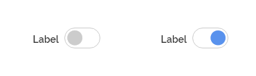
*Exemplo do componente switch.*

Utilize *switches* para ajudar usuários a atualizar preferências, configurações e outros tipos de informação que envolvam uma escolha entre duas seleções e os resultados são eficazes e visíveis imediatamente, não havendo necessidade de o usuário clicar em um botão de envio.

---

## Anatomia

| ID  | Nome                 |                     Referência                     | Uso         |
| --- | -------------------- | :------------------------------------------------: | ----------- |
| 1   | *Label*              |  [Tipografia](/ds/fundamentos-visuais/tipografia)  | Opcional    |
| 2   | *container*          |  [Superfície](/ds/fundamentos-visuais/superficie)  | Obrigatório |
| 3   | Chave de alternância |                        ---                         | Obrigatório |
| 4   | Rótulo               |  [Tipografia](/ds/fundamentos-visuais/tipografia)  | Opcional    |
| 5   | Ícone                | [Iconografia](/ds/fundamentos-visuais/iconografia) | Opcional    |

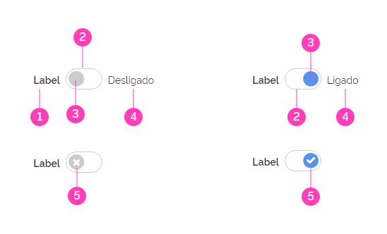
*Anatomia do componente switch.*

---

## Detalhamento dos Itens

### 1. *Label* (Opcional)

*Labels* são itens opcionais. Muitas vezes *switches* podem funcionar adequadamente sem *labels*, porém, se houver necessidade de deixar o entendimento mais claro, não hesite em utilizar *labels* que devem descrever concisamente o que o componente faz quando a alternância estiver ativada.

O *label* pode estar localizado à esquerda, à direita ou acima do *switch* e a distância entre o *label* e o *switch* pode ser determinado pelo *layout* da tela. Uma vez definido como serão aplicados os *labels* em seu produto, mantenha sempre a consistência.

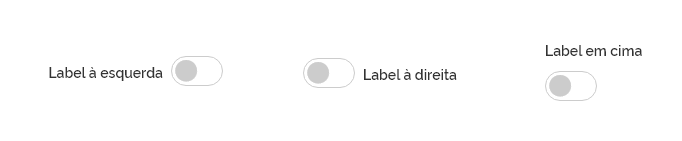
*Labels podem estar localizados em diversas posições em relação ao switch para melhor se adequar ao layout da página.*

### 2. *Container* (Obrigatório)

*Container* é o espaço que contém a chave de alternância e limita as duas posições aceitáveis para a escolha do usuário.

### 3. Chave de alternância (Obrigatório)

Chave de alternância é simplesmente o sinalizador que alterna as posições ligado/desligado. Embora o usuário possa interagir clicando em qualquer parte do *switch*, é por meio da chave que o usuário tem o *feedback* da ação realizada.

### 4. Rótulo (Opcional)

Rótulo são itens opcionais que ajudam a esclarecer as duas possibilidades de escolha do usuário. É recomendável usar rótulos quando for necessário dar maior visibilidade às opções disponíveis.

Rótulos favorecem a usabilidade, pois auxiliam no entendimento da posição em que a chave se encontra.

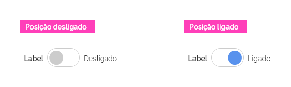
*Use rótulos curtos e concisos.*

### 5. Ícone (Opcional)

Ícones podem ser utilizados opcionalmente para reforçar a opção escolhida pelo usuário. Neste caso, a usabilidade é potencializada, pois além da cor e da posição, o ícone auxilia semanticamente a posição que a chave de alternância se encontra.

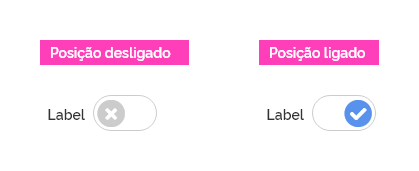
*Ícones podem auxiliar a leitura das posições ligado/desligado.*

---

## Comportamentos

### 1. Densidades

O componente *switch* possui três densidades. Quanto menor for a densidade, maior a área de interação.

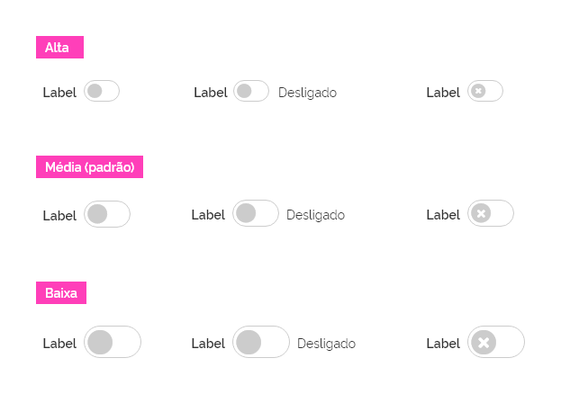
*Exemplos das possíveis densidades do componente switch.*

### 2. Área interativa

O componente *switch* pode ser interativo em toda a área compreendida pelo elemento *container* e pelo *label* correspondente.

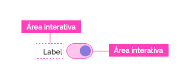
*A interatividade do componente switch ocorre tanto na área compreendida pelo container como pelo label correspondente.*

**Atenção:** nos casos em que o label e o *container* não estejam próximos apenas o *container* deverá ser interativo.

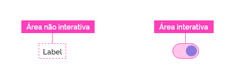
*Neste exemplo apenas o container é interativo.*

### 3. Estados

#### Desabilitado

Um *switch* pode ficar desabilitado quando uma interação for feita pelo usuário anteriormente e que reflita neste *switch*.

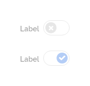
*Switches desabilitados.*

A seguir apresentamos uma tabela com outros possíveis estados para o componente *switches*.

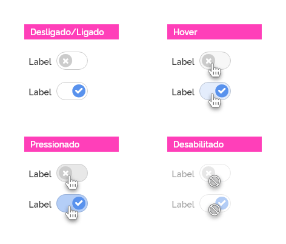
*Estados possíveis dos switches.*

**Atenção:** consulte o documento de estados para se informar sobre a aplicação dos estados mencionados no componente *switch*.

### 4. Agrupamento

O componente *switch*, funciona basicamente como um interruptor de alternância, permitindo aos usuários ligar ou desligar as opções apresentadas. No entanto, quando utilizados de forma agrupada, deverão vir associados a um componente *checkbox* principal, permitindo ao usuário selecionar e desselecionar todas, além de ter o *feedback* relacionado ao estado intermediário. Para maiores informações consultar "Estado Intermediário" na documentação do componente checkbox.
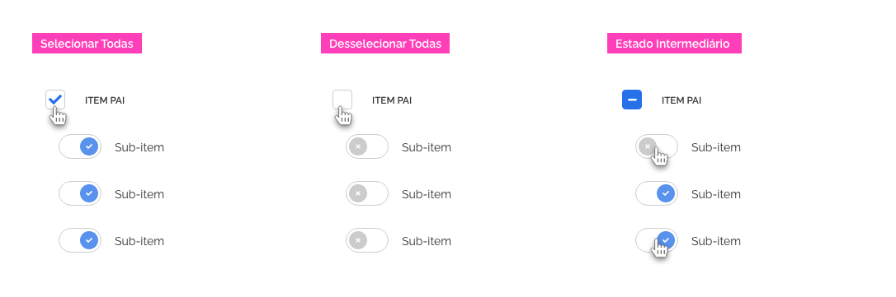
*Exemplo de switches agrupados em uma lista associada a um checkbox principal.*

### 5. Responsividade

Não há nenhum comportamento especial previsto para o componente *switch* quando aplicado em resoluções menores. Apenas esteja atento quanto à área de interação. Em dispositivos *touch screen* prefira utilizar densidade baixa, pois apresenta uma maior área de interação ao toque.

---

## Melhores Práticas

-   *Switches* devem ter efeito imediato e não devem exigir que o usuário clique em botões de "Salvar" ou "Enviar" para aplicar o novo estado.

-   Evite incluir *switches* em formulários longos onde outros tipos de campos de formulário estão presentes e os usuários precisarão clicar no botão "Enviar" para que outras alterações tenham efeito. Este cenário confunde os usuários porque eles não podem ter certeza se sua escolha de alternância terá efeito imediato.

-   Mantenha os rótulos dos *switches* curtos e diretos.

-   Certifique-se de que os *switches* sejam implementados de forma consistente. A inconsistência força os usuários a gastar mais tempo pensando em como interagir com os componentes.

-   O *Switch* deve ser posicionado na interface de forma firme e consistente durante o movimento da *chave de alternância* ou alternância de *labels* e surgimento de bordas de foco, evitando mudar o posicionamento do seu *container*. Caso contrário, poderá confundir ou atrapalhar o processo de interação do usuário com o componente.

-   Os rótulos devem descrever o que o *switch* fará quando a chave estiver ligada ou desligada. Eles não devem ser neutros ou ambíguos.

-   Evite mais de três termos para definir rótulos.

-   Use rótulos sempre na mesma posição em relação ao *switch*.

-   Evite utilizar rótulo apenas para um estado possível.

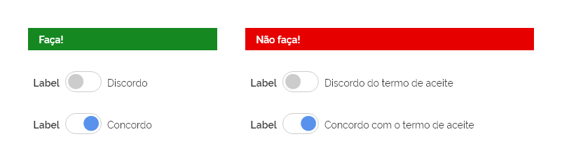
*Use rótulos curtos e concisos.*

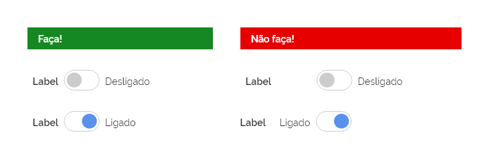
*Não alterne a posição dos rótulos.*

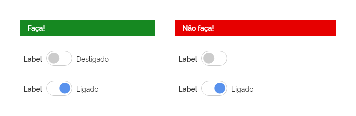
*Use os rótulos sempre em pares.*

**Atenção:** quando utilizar rótulos prefira alinhar o componente reservando espaço pelo rótulo de maior extensão, desta forma, evita-se o deslocamento do componente quando for alterada a chave de alternância.

*Exemplos de boas práticas no alinhamento dos rótulos.*

---

## Especificações

### Alinhamento

| Name  |        Spacing Token        |
| ----- | :-------------------------: |
| Label | `--spacing-vertical-center` |
| Label | `--spacing-horizontal-left` |

### Espaçamento

| Name                        | Property                               |      Token/Value       |
| --------------------------- | -------------------------------------- | :--------------------: |
| Label (depende da posição)  | margin-right/margin-left/margin-botton |  `--spacing-scale-2x`  |
| Rótulo (depende da posição) | margin-right/margin-left               | `--spacing-scale-base` |
| *container* (alta)          | padding-all                            | `--spacing-scale-half` |
| *container* (média)         | padding-all                            | `--spacing-scale-half` |
| *container* (baixa)         | padding-left, padding-right            | `--spacing-scale-half` |
| *container* (baixa)         | padding-top, padding-botton            | `--spacing-scale-half` |
| *container*                 | margin-bottom                          | `--spacing-scale-base` |
| Chave (ligado)              | horizontal align                       |        `right`         |
| Chave (desligado)           | horizontal align                       |         `left`         |

### Dimensão

| Name                         | Property | Token/Value |
| ---------------------------- | -------- | :---------: |
| *container* (alta)           | width    |   `40px`    |
| *container* (alta)           | height   |   `24px`    |
| Chave de alternância (alta)  | width    |   `16px`    |
| Chave de alternância (alta)  | height   |   `16px`    |
| *container* (média)          | width    |   `52px`    |
| *container* (média)          | height   |   `30px`    |
| Chave de alternância (média) | width    |   `22px`    |
| Chave de alternância (média) | height   |   `22px`    |
| *container* (baixa)          | width    |   `64px`    |
| *container* (baixa)          | height   |   `36px`    |
| Chave de alternância (baixa) | width    |   `28px`    |
| Chave de alternância (baixa) | height   |   `28px`    |

### Cor

| Name                       | Property   |      Color Token       |
| -------------------------- | ---------- | :--------------------: |
| Superfície                 | background |       `--pure-0`       |
| Label                      | text       |      `--gray-80`       |
| Rótulo                     | text       |      `--gray-80`       |
| chave de alternância - on  | icon       | `--blue-warm-vivid-40` |
| chave de alternância - off | icon       |      `--gray-20`       |
| Ícones                     | icon       |       `--pure-0`       |

### Tipografia

| Name   | Property    |        Token/Value        |
| ------ | ----------- | :-----------------------: |
| Label  | size        | `--font-size-scale-base`  |
| Label  | font-weight | `--font-weight-semi-bold` |
| Rótulo | size        | `--font-size-scale-base`  |
| Rótulo | font-weight |  `--font-weight-regular`  |

### Iconografia

| Name                         |             Ícone             |        Size        | Class (Font Awesome) |
| ---------------------------- | :---------------------------: | :----------------: | :------------------: |
| Chave de alternância (alta)  | <i class="fas fa-circle"></i> |  `--icon-size-sm`  |     `fa-circle`      |
| Chave de alternância (média) | <i class="fas fa-circle"></i> |  `--icon-size-lg`  |     `fa-circle`      |
| Chave de alternância (baixa) | <i class="fas fa-circle"></i> |  `--icon-size-2x`  |     `fa-circle`      |
| Ícone off (alta)             | <i class="fas fa-times-circle"></i> |  `--icon-size-xs`  |      `fa-times-circle`      |
| Ícone off (média)            | <i class="fas fa-times-circle"></i> |  `--icon-size-sm`  |      `fa-times-circle`      |
| Ícone off (baixa)            | <i class="fas fa-times-circle"></i> | `--icon-size-base` |      `fa-times-circle`      |
| Ícone on (alta)              | <i class="fas fa-check-circle"></i> |  `--icon-size-xs`  |      `fa-check-circle`      |
| Ícone on (média)             | <i class="fas fa-check-circle"></i> |  `--icon-size-sm`  |      `fa-check-circle`      |
| Ícone on (baixa)             | <i class="fas fa-check-circle"></i> | `--icon-size-base` |      `fa-check-circle`      |
