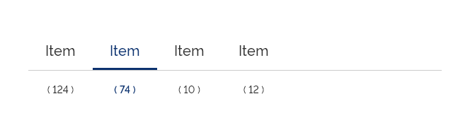
*Exemplo de Tab*

Utilize as *Tabs* quando:

*   Existir informação disponível em excesso, por página, e houver a necessidade de organizá-la em partes menores, ou seja, Categorias ou Seções;

*   For necessário melhorar a usabilidade e organização de conteúdos em tela.

---

## Anatomia

As *Tabs* são compostas pelos seguintes elementos:

| ID  | Nome                 |                     Referência                     | Uso         |
| --- | -------------------- | :------------------------------------------------: | ----------- |
| 1   | Item da *Tab*        |      [Item](/ds/components/item?tab=designer)      | Obrigatório |
| 2   | Rótulo da *Tab*      |  [Tipografia](/ds/fundamentos-visuais/tipografia)  | Opcional    |
| 3   | Superfície da *Tab*  |  [Superfície](/ds/fundamentos-visuais/superficie)  | Obrigatório |
| 4   | Rótulo Contador      |  [Tipografia](/ds/fundamentos-visuais/tipografia)  | Opcional    |
| 5   | Ícone                | [Iconografia](/ds/fundamentos-visuais/iconografia) | Opcional    |
| 6   | Componente *Divider* |   [Divider](/ds/components/divider?tab=designer)   | Obrigatório |

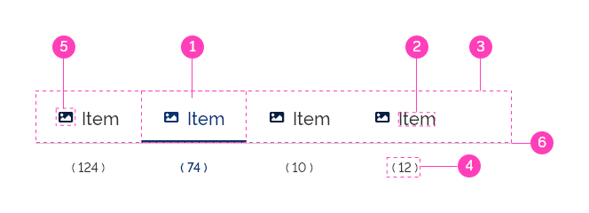
*Anatomia das Tabs*

---

### Detalhamento dos Itens

#### 1. Item da *Tab* (Obrigatório)

O Item da *Tab* é o elemento obrigatório que poderá conter ícone e informação textual correspondente à categoria ou seção. Seu número é variado dentro do Componente *Tab* e dependerá da quantidade de seções ou categorias existentes.

É importante ressaltar que este elemento possui dois estados obrigatórios, o ativo e o interativo.

*Item da Tab*

A - O Item da *Tab* Ativo tem a finalidade de mostrar ao usuário em qual aba ele se encontra.

B - O Item da *Tab* Interativo é o estado padrão da *Tab* e representa as seções ou categorias não ativas.

O tamanho do Item da *Tab* deverá sempre acompanhar a largura do Rótulo, respeitando os espaçamentos internos. Observe abaixo:

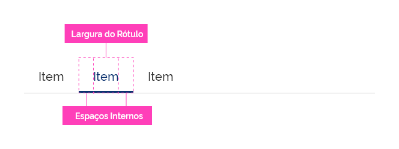
*Largura da Tab*

#### 2. Rótulo da *Tab* (Opcional)

O Rótulo da *Tab* é a informação textual que representa a categoria ou seção da *Tab*. O Tom e Voz deste elemento deve ser uma informação curta, direta e objetiva. Não é recomendado utilizar textos longos. Deve-se prezar, ao máximo, pelo uso de uma a três palavras.

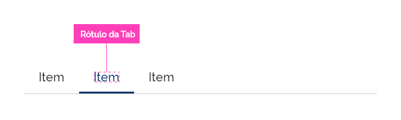
*Rótulo da Tab*

#### 3. Superfície da *Tab* (Obrigatório)

A Superfície da *Tab* é um elemento obrigatório e conterá todos os Itens da *Tab*. Em sua base ele contém o Componente Divider, que tem a função de dividir as *Tabs* e o seu conteúdo. Observe abaixo:

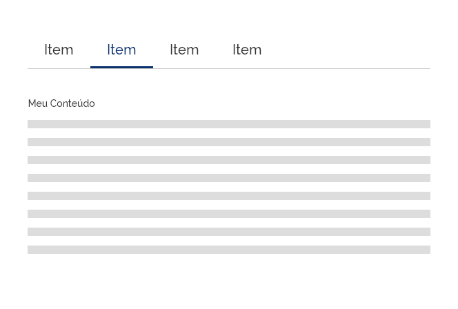
*Superfície da Tab*

**Atenção:** É importante observar, que mesmo se o número de Itens de *Tabs* somar uma largura menor que a largura da tela, a Superfície da *Tab* se estenderá até o limite da tela, como visto no exemplo acima.

#### 4. Rótulo Contador (Opcional)

O Rótulo Contador é um elemento opcional que tem como função exibir a quantidade de referências encontradas em uma *Tab*, como resultado de uma ação de uma pesquisa realizada pelo usuário.

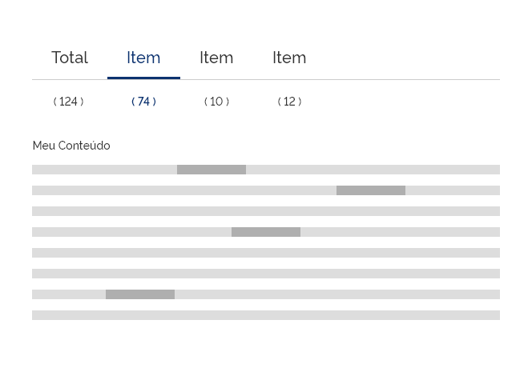
*Rótulo Contador*

No exemplo acima, o usuário realizou uma busca por palavra-chave e o Componente *Tabs* exibe o Rótulo Contador em cada Item de *Tab*. Cada Rótulo Contador exibiu a quantidade de palavras-chave encontradas dentro de cada categoria ou seção.

#### 5. Ícone (Opcional)

O uso do elemento ícone no item da *tab* é opcional, tendo como função ser uma representação visual da funcionalidade do item ao qual ele representa, ilustrando e reforçando a compreensão da sua função pelo usuário.

Na *web*, o item da *tab* quando apresentado sem os seus respectivos rótulos, ou seja, somente com os ícones, deverá este utilizar o recurso de *tooltip* para que o usuário tenha acesso ao nome do rótulo.

Consulte especificações em [Tooltip](/ds/components/tooltip?tab=designer).

*Variações do uso de ícone nos itens da Tab*

#### 6. Componente *Divider* (Obrigatório)

Componente padrão. Ver especificações em [Componente Divider](/ds/components/divider?tab=designer).

---

## Comportamentos

### 1. Responsividade

O Componente *Tab* deve se adequar à largura da página, estendendo a Superfície da *Tab* até o limite na extremidade direita. Observe abaixo:

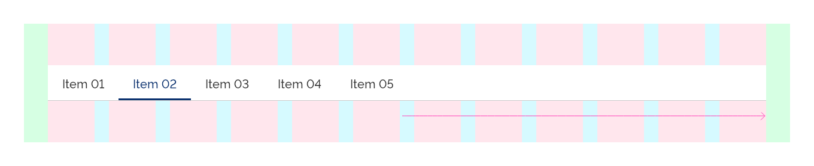
*Grid de 12 Colunas*

Quando o espaçamento lateral for muito reduzido, deverão ficar visíveis apenas o Item da *Tab* Ativo e os que estiverem próximos a este. Neste caso, haverá navegação através do acesso por *swipe* dos Itens de *Tab* ocultos.

É importante observar que este comportamento também ocorre quando o número de Itens de *Tab* for maior que a largura da tela.

#### Responsividade Interna (Ícone e *Label*)

O componente item, quando apresentado com ícone e label, mudará sua disposição de diagramação, de horizontal para vertical, quando estiver na proporção do grid de 4 colunas, alinhando-os de forma responsiva com a mudança na dimensão e disposição da tela.
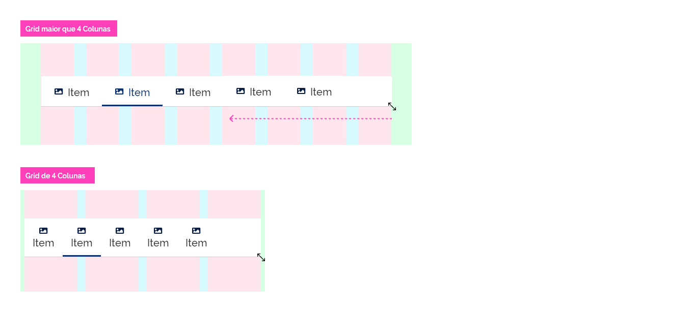
*Posicionamento responsivo interno do componente item*

### 2. Navegação por *Swipe*

A navegação por *swipe* é uma funcionalidade muito utilizada em dispositivos móveis e é destinada a solucionar problemas de dimensão e responsividade.

É recomendável utilizar essa forma de navegação quando a quantidade de abas exceder a largura da tela ou dispositivo. Nesse caso, ao clicar e arrastar as abas para a direita, todas as *tabs* se deslocarão para a esquerda, exibindo as que estiverem ocultas. O mesmo poderá ser feito em sentido contrário. Observe abaixo:

A - O Componente *Tabs* se adéqua perfeitamente à tela com espaço excedente;

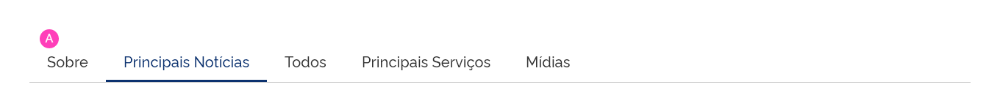
*Componente Tabs sem o swipe*

B - O Componente de *Tabs* é visualizado numa largura reduzida, alinhado à esquerda. Ao arrastar para a direita, os Itens de *Tab* ocultos deverão ser exibidos;

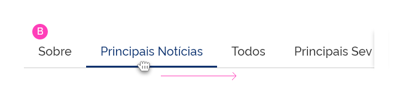
*Comportamento swipe à direita*

C - Quando o usuário fizer o movimento de *swipe* ou arrasto no sentido contrário (da esquerda para a direita), deverá ser mostrado novamente as *Tabs* antes ocultas à esquerda;
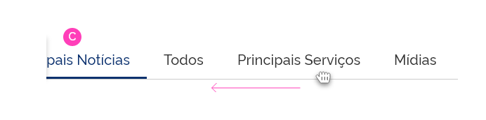
*Comportamento swipe à esquerda*

Optou-se pelo uso de "sombras" nas laterais onde as *tabs* estiverem ocultas, facilitando ao usuário, o entendimento da necessidade de se utilizar o recurso de navegação por *swipe* para exibir o conteúdo parcialmente oculto.

#### Controle *Swipe* via Teclado

O Componente *Tabs* poderá ter sua função de *swipe* controlada por teclado, utilizando as Teclas de Navegação, Seta Esquerda e Seta Direita. A cada clique nas Teclas de Navegação, os Itens da *Tab* se deslocam para esquerda ou direita na distância de sua própria largura.

Para mais informações acessar [Example of Tabs with Manual Activation](https://www.w3.org/TR/wai-aria-practices-1.1/examples/tabs/tabs-2/tabs.html).

### 3. Alinhamento

Os Itens de *Tabs* devem, por padrão, manter o alinhamento à esquerda na Superfície da *Tab*.

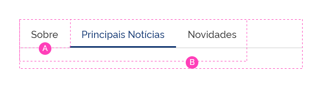
*Alinhamento*

A - Rótulo centralizado no Item de *Tab*;

B - Itens de *Tab* alinhados à esquerda na Superfície de *Tab*.

### 4. Densidade

O Componente *Tab* possui três categorias de densidade:

#### A. Baixa Densidade

Utilize Baixa Densidade quando o projeto de layout permitir mais espaço ou quando houver a necessidade de dar mais destaque ao Componente *Tab*.
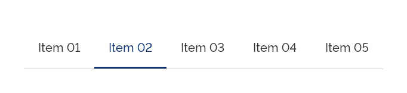
*Tab em baixa densidade*

#### B. Densidade Padrão

É a forma comum do Componente *Tab*. Oferece um espaçamento interno adequado e equilibrado para várias categorias de projeto.
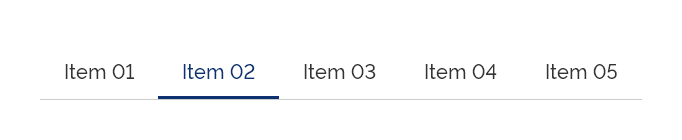
*Tab em densidade padrão*

#### C. Alta Densidade

Utilize Alta Densidade quando for necessário utilizá-lo em espaços mais restritos, ou dentro de outros elementos.
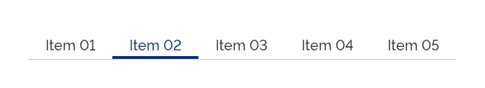
*Tab em alta densidade*

---

## Melhores Práticas

### *Tabs* dentro de *Tabs*

Seguindo os Princípios Gerais e Boas Práticas de *Design* e Usabilidade, é recomendado que *não* se utilize o Componente *Tabs* dentro de outro Componente *Tabs*. Isto deve-se ao fato de que, quando isto ocorre, o usuário poderá ter sua experiência de navegação confundida, além de aumentar sua sobrecarga cognitiva.

Logo, quando for necessário definir uma nova divisão de categorias em um dos Itens de *Tab*, deve-se recorrer a outro Componente que propicie esta subdivisão, como, por exemplo, o Componente *List*. Veja os exemplos abaixo:

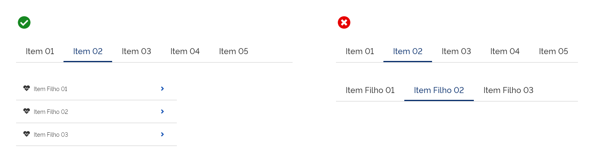
*Utilize o componente list dentro de Tab, em vez de Tabs dentro de Tabs*

---

## Especificações

### Cores

| Name                             | Property   | Color Token            |
| -------------------------------- | ---------- | ---------------------- |
| Rótulo da *Tab*                  | color      | `--gray-80`            |
| Rótulo da *Tab* Fundo Escuro     | color      | `--pure-0`             |
| Rótulo Contador                  | color      | `--gray-80`            |
| Rótulo Contador Ativo            | color      | `--blue-warm-vivid-80` |
| Rótulo Contador Fundo Escuro     | color      | `--pure-0`             |
| Item da *Tab*                    | background | `--pure-0`             |
| Item da *Tab* Fundo Escuro       | background | `--blue-warm-vivid-90` |
| Superfície da *Tab*              | background | `--pure-0`             |
| Superfície da *Tab* Fundo Escuro | background | `--blue-warm-vivid-90` |
| Ícone                            | color      | `--blue-warm-vivid-90` |
| Ícone Fundo Escuro               | color      | `--pure-0`             |

### Tipografia

| Name                  | Size                      | Weight                    |
| --------------------- | ------------------------- | ------------------------- |
| Rótulo da *Tab*       | `--font-size-scale-up-02` | `--font-weight-medium`    |
| Rótulo Contador       | `--font-size-scale-base`  | `--font-weight-medium`    |
| Rótulo Contador Ativo | `--font-size-scale-base`  | `--font-weight-semi-bold` |

### Borda

| Name                       | Style   | Width                | Color                  | Size     |
| -------------------------- | ------- | -------------------- | ---------------------- | -------- |
| item do *Tab*              | `solid` | `--surface-width-lg` | `--blue-warm-vivid-90` | `bottom` |
| item do *Tab* Fundo Escuro | `solid` | `--surface-width-lg` | `--pure-0`             | `bottom` |

### Espaçamentos

| Name                           | Property       |           Value           |
| ------------------------------ | -------------- | :-----------------------: |
| Item da *Tab* Densidade Padrão | padding-left   |   `--spacing-scale-3x`    |
| Item da *Tab* Densidade Padrão | padding-right  |   `--spacing-scale-3x`    |
| Item da *Tab* Densidade Padrão | padding-top    |   `--spacing-scale-2x`    |
| Item da *Tab* Densidade Padrão | padding-bottom |   `--spacing-scale-2x`    |
| Item da *Tab* Baixa Densidade  | padding-left   |   `--spacing-scale-3x`    |
| Item da *Tab* Baixa Densidade  | padding-right  |   `--spacing-scale-3x`    |
| Item da *Tab* Baixa Densidade  | padding-top    |   `--spacing-scale-3x`    |
| Item da *Tab* Baixa Densidade  | padding-bottom |   `--spacing-scale-3x`    |
| Item da *Tab* Alta Densidade   | padding-left   |   `--spacing-scale-3x`    |
| Item da *Tab* Alta Densidade   | padding-right  |   `--spacing-scale-3x`    |
| Item da *Tab* Alta Densidade   | padding-top    |  `--spacing-scale-base`   |
| Item da *Tab* Alta Densidade   | padding-bottom |  `--spacing-scale-base`   |
| Superfície da *Tab*            | margin-bottom  |   `--spacing-scale-2x`    |
| Rótulo Contador                | margin-top     |   `--spacing-scale-2x`    |
| Ícone (Disposição Horizontal)  | margin-right   |  `--spacing-scale-base`   |
| Ícone (Disposição Vertical)    | margin-bottom  | `--spacing-scale-default` |
