[version]: # (5.3.0)

*Exemplo de Table*

Utilize a *Table* quando houver necessidade de organizar as informações de uma maneira intuitiva, com uma estrutura lógica que facilite a compreensão do conteúdo, utilizando o uso de hierarquia ou alfabetização.

---

## Anatomia

A *Table* é estruturada em:

| ID  | Nome               |                            Referência                            | Uso         |
| --- | ------------------ | :--------------------------------------------------------------: | ----------- |
| 1   | Barra de Título    |    [Item](https://www.gov.br/ds/components/item?tab=designer)    | Opcional    |
| 2   | Barra Contextual   |    [Item](https://www.gov.br/ds/components/item?tab=designer)    | Opcional    |
| 3   | *Header* da Tabela |  [Header](https://www.gov.br/ds/components/header?tab=designer)  | Obrigatório |
| 4   | Linhas             | [Divider](https://www.gov.br/ds/components/divider?tab=designer) | Obrigatório |
| 5   | Barra de Paginação |  [Footer](https://www.gov.br/ds/components/footer?tab=designer)  | Opcional    |
| 6   | Colunas            | [Divider](https://www.gov.br/ds/components/divider?tab=designer) | Obrigatório |

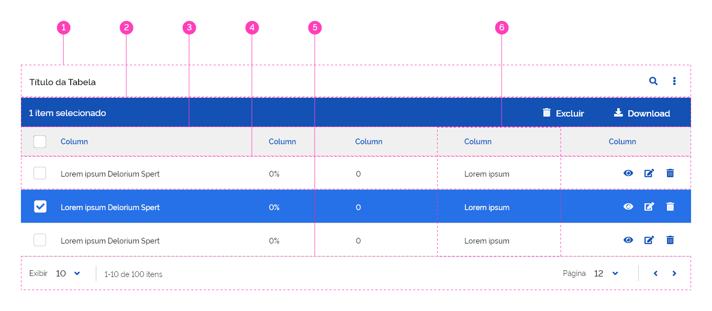
*Exemplo de Table*

---

### Detalhamento dos Itens

#### 1. Barra de Título (Opcional)

A - A barra de título tem a função de exibir o título da tabela, texto usado para descrever o assunto da tabela. Caso seja necessário utilizá-lo, deve-se prezar por um tom e voz curto e objetivo. Não é recomendado utilizar um texto com mais de uma linha.

B - A barra de título também tem a função de abrigar ícones de ações utilitárias.

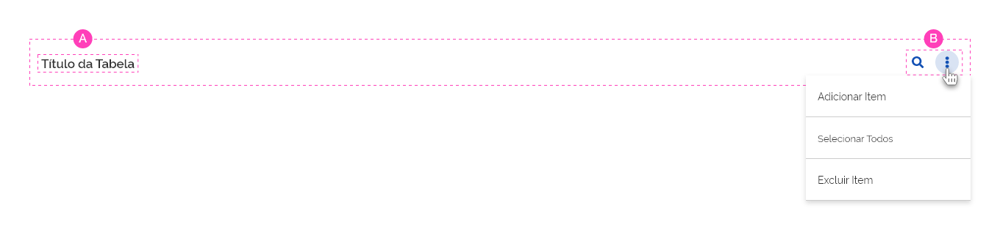
*Barra de Título*

##### Quantidade de ícones de ação

Tendo em vista a otimização do conteúdo na barra de título, recomendamos a utilização de até 4 ícones dispostos lado a lado na barra de título. Caso seja necessário utilizar uma quantidade maior, deve-se optar pelo uso do *menu* flutuante, que será acessado pelo botão `Ellipsis-v`. Veja o exemplo a seguir.

A - Recomendamos utilizar até 4 ícones dispostos lado a lado;

B - Com mais de 4 ícones de ação, utilize o botão de acesso ao *menu* flutuante;

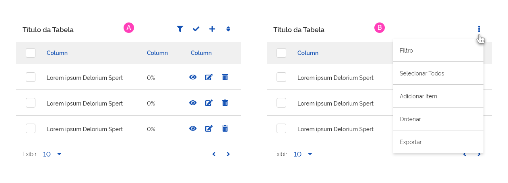
*Quantidade de Ícones de Ação*

#### 2. Barra Contextual (Opcional)

A barra contextual tem a função de exibir informações, ou ações contextuais referentes a uma, ou várias linhas selecionadas. Ao realizar a seleção de alguma linha, a barra contextual deverá aparecer logo abaixo da barra de títulos, deslocando as linhas da tabela para baixo e exibindo as ações ou informações relacionadas. Observe abaixo:

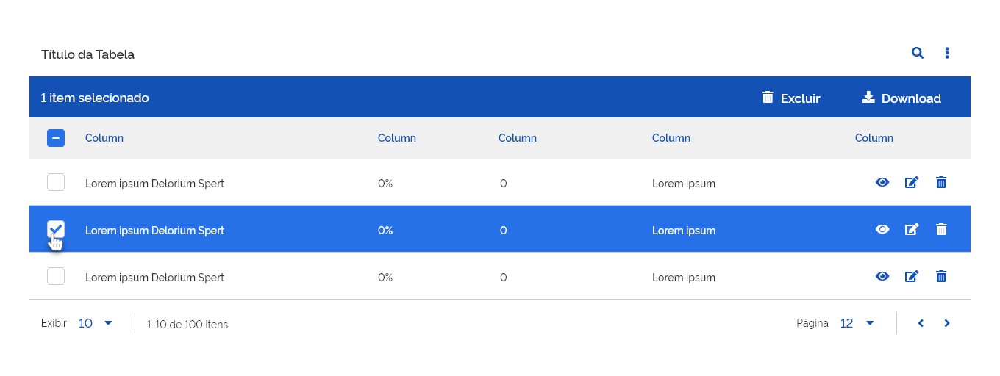
*Barra Contextual*

A barra contextual pode conter:

1. *Texto Contextual*

2. *Itens de Ação Contextual*

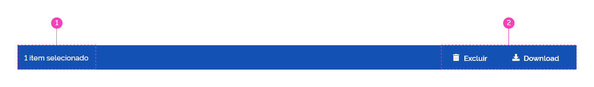
*Barra Contextual*

#### 3. *Header* da Tabela (Obrigatório)

O *header* da tabela é um elemento obrigatório, pois descreve o tipo de conteúdo exibido em cada coluna.

##### Nome da coluna

*Header da Tabela*

###### Tom e Voz

O nome da coluna, texto que descreve o tipo de conteúdo exibido, deve ser conciso de modo a comunicar a sua mensagem da maneira mais eficiente possível. Estes textos não devem ser extensos (preferencialmente com quantidade de caracteres menor que os dados referentes).

> *Dica*: faça uma lista de palavras-chave e depois escolha as mais relevantes para sua necessidade.

*Exemplo*: nomes como "Data Inicial" e "Data Final" podem ser utilizados como "Inicial" e "final" respectivamente.

#### 4. Linhas (Obrigatório)

As linhas são elementos obrigatórios e apresentam os dados ou informações organizadas por colunas. Podem também conter funcionalidades para manipulação destes dados. Observe abaixo:

1. *Dados ou Elementos Interativos*

2. *Ação Expandir/Retrair*

3. *Seleção de Linhas*

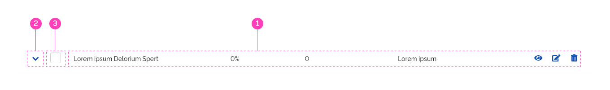
*Elementos da Linha da Tabela*

##### Dados ou elementos interativos

Os dados de uma linha podem conter:

*   Ícones

*   *Links*

*   Textos

*   Componentes de formulários (*checkbox*, *text*, *radio*, *select*...)

#### Estado *Hover* em tabelas sem interatividade (opcional)

Em tabelas muito extensas, sem interatividade, recomendamos a utilização do Estado *Hover* visando auxiliar o usuário durante a leitura dos dados na localização e acompanhamento das informações através do *mouse*, desta forma, "marcando" a linha com o ponteiro do *mouse* enquanto ocorre a leitura dos dados, desta forma a seta do cursor deverá ser apresentado no seu formato padrão. Ver exemplo abaixo:

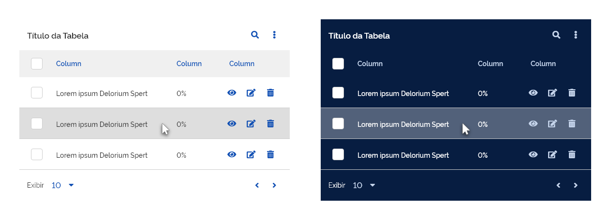
*Utilizando o estado hover na linha da Table*

#### 5. Barra de Paginação (Opcional)

A paginação é exibida na parte inferior de uma tabela. Os controles de paginação fornecem acesso rápido a todas as páginas, enquanto indicam e permitem a configuração da quantidade de linhas de uma tabela. Consulte mais detalhes a respeito da paginação na documentação específica do componente *Pagination*.

*Barra de Paginação*

#### 6. Colunas (Obrigatório)

A coluna é um elemento obrigatório e essencial da tabela, pois para constituir uma tabela é necessário pelo menos uma coluna. Esta faz intersecção com o *Header* da tabela e a linha da tabela e abrigam os dados tanto do *Header* como da linha. O número de colunas em uma tabela é ilimitado e sua largura depende do tamanho do conteúdo interno.

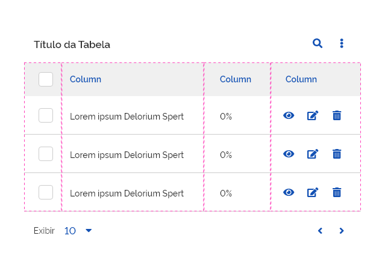
*Coluna da Tabela*

---

## Comportamentos

### 1. Responsividade

#### *Grid* de 12 e 8 colunas

Nas *grids* de 12 e 8 colunas o comportamento responsivo padrão funciona com a quebra de linha do conteúdo interno das células da tabela. Esse é o comportamento padrão oferecido pela estrutura *HTML*. É importante observar, que este comportamento padrão ocorre não apenas com textos, mas em todos os tipos de conteúdo interno às células da tabela, como, por exemplo: ícones, botões ou imagens em sequência.

Veja abaixo:

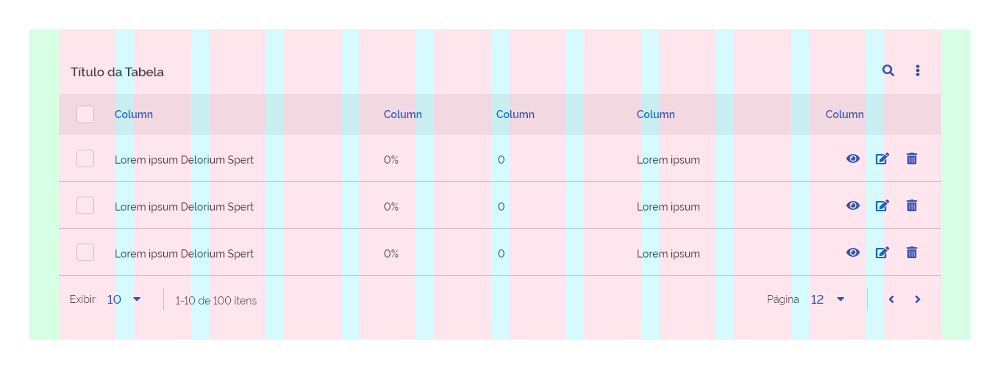
*Grid de 12 Colunas*

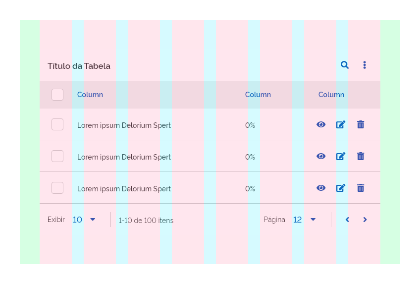
*Grid de 8 Colunas*

##### Truncamento

Pode-se utilizar um recurso para limitar o número de caracteres nas células e exibir apenas o início de cada texto. Os textos devem ser truncados exibindo as reticências no final. Ao passar o *mouse* sobre o texto truncado é revelado o texto completo pelo uso de *tooltip*. Veja o exemplo abaixo.

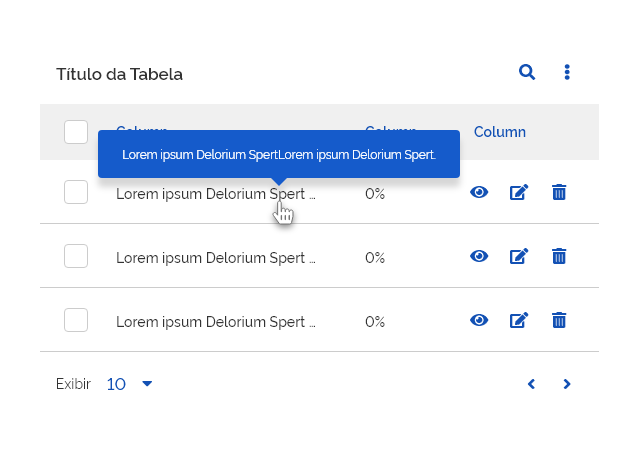
*Grid de 8 Colunas com Truncamento de Linha*

#### *Grid* de 4 colunas

Na *Grid* de 4 colunas, tendo em vista a característica bastante horizontal da tabela, é recomendável utilizar o recurso de rolagem, caso seja necessário exibir muitas colunas na tabela. Consulte detalhes em *Comportamento > Rolagem*.

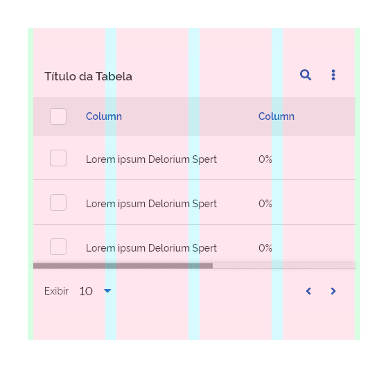
*Grid de 4 Colunas*

##### Sugestão de usabilidade em *grids* de 4 Colunas

Sempre que possível, opte pela utilização dos recursos de busca e paginação, visando garantir uma melhor usabilidade, principalmente em *layouts* reduzidos.

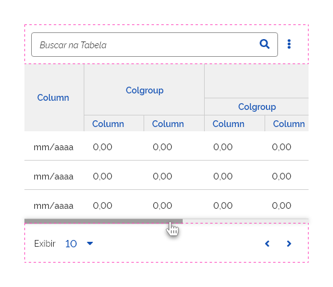
*Exemplo de recursos para melhorar a usabilidade*

##### *Grid* de 4 colunas - Responsividade da barra contextual e da barra de título

Na barra contextual e barra de títulos o conjunto de ícones de ação podem ser agrupados em um único ícone. E as ações acessadas a partir do *menu* flutuante. Observe o exemplo abaixo:

A - Os ícones de ação são dispostos lado a lado nas barra de título e contextual;

B - Os ícones de ação são agrupados em um único ícone de *menu* flutuante.

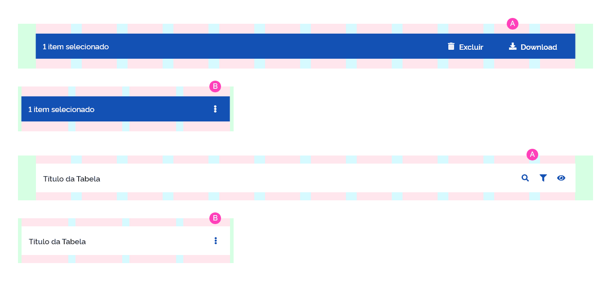
*Responsividade barra contextual e de título*

**Atenção:** É importante lembrar que quando houver mais de quatro ícones de ação na barra de título, é recomendável a utilização do ícone `Ellipsis-V` para o *menu* flutuante. Observe o exemplo acima.

### 2. Rolagem

O comportamento de rolagem visa solucionar problemas de exibição de conteúdos muito extensos na tabela ou exibir conteúdo em espaços restritos.

#### Rolagem vertical

Na rolagem vertical, a barra de título, o *Header da Table* e a barra de paginação permanecem fixas enquanto a rolagem ocorre apenas nas linhas da tabela. A barra de rolagem deverá ser posicionada na extrema direita da tabela entre o *Header da Table* e a barra de paginação.

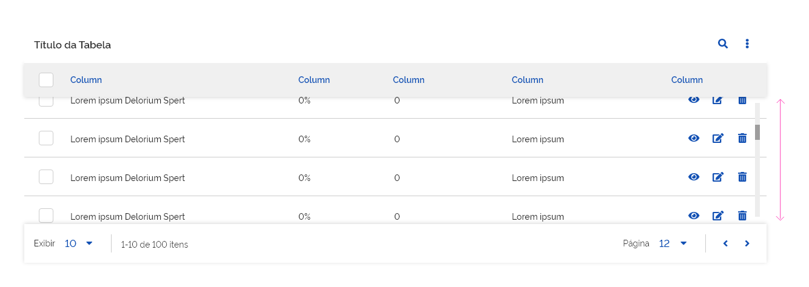
*Rolagem Vertical*

#### Rolagem horizontal

A rolagem horizontal visa solucionar a exibição de uma tabela com muitas colunas em um espaço restrito. Neste caso, a barra de paginação e a barra de título permanecem fixas enquanto todo conteúdo da tabela deverá ser deslocado horizontalmente durante a rolagem. A barra de rolagem fica posicionada logo acima da barra de paginação.

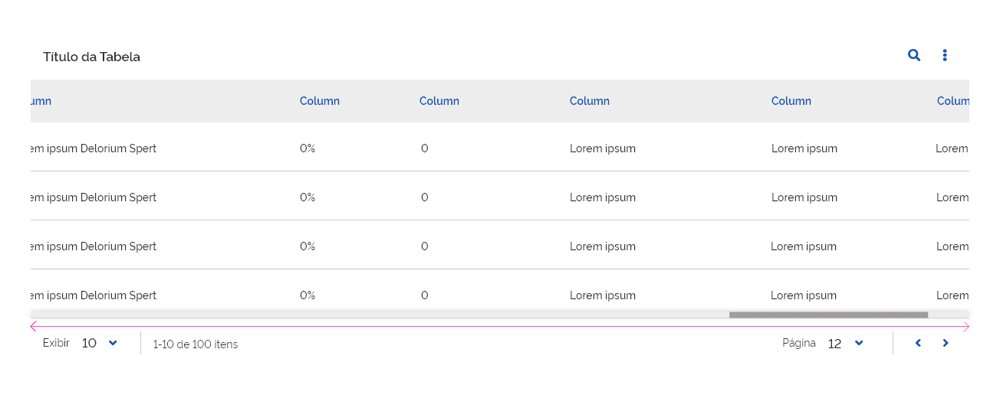
*Rolagem Horizontal*

Em *layouts* muito pequenos como em dispositivos móveis (*Grid* de 4 colunas), o uso de barras de rolagem simples também deverão ser utilizados considerando todo o conteúdo da tabela.

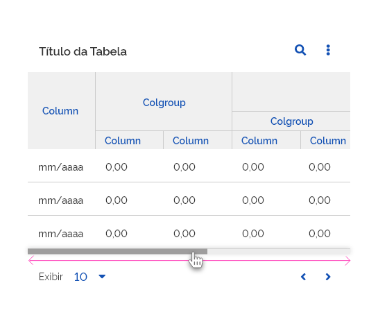
*Exemplo de tabela em telas reduzidas com rolagem horizontal*

### 3. Expandir e *collapse*

Este comportamento visa expandir a visualização de uma linha da tabela e exibir um conteúdo oculto, seja um painel, seja uma imagem ou qualquer outro conteúdo.

A expansão da linha ocorre quando o usuário clicar sobre o botão `Chevron-Down` que se localiza no início de cada linha. Após a expansão ocorrer, o botão muda seu ícone para `Chevron-Up` e o usuário poderá recolher a visualização do conteúdo. Observe abaixo.

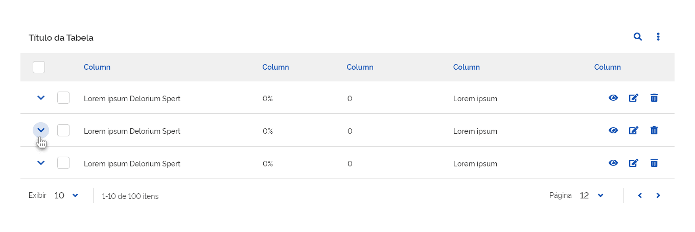
*Linha Recolhida*

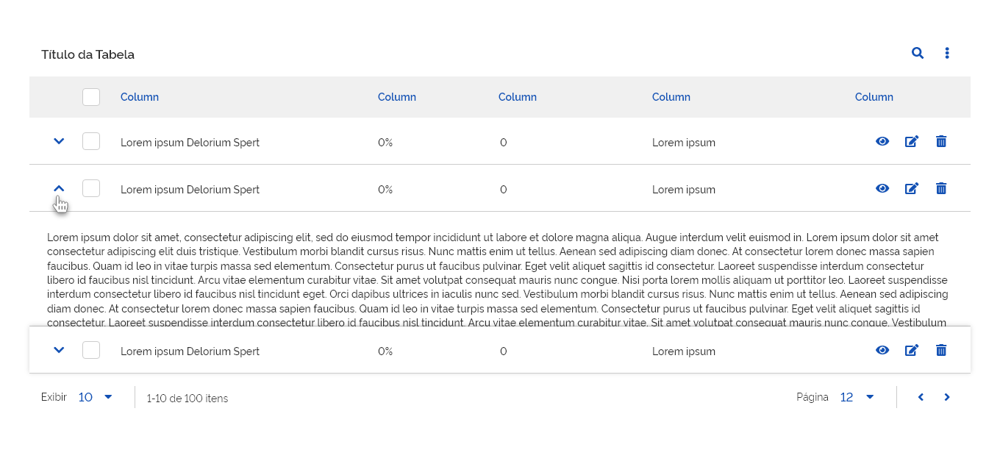
*Linha Expandida*

Observe que o conteúdo exibido após a expansão da linha é marcado com uma sombra, fazendo diferenciação de hierarquia.

**Atenção:** O conteúdo que será expandido internamente em cada linha, deve ser diagramado com cautela. O excesso de informação e elementos interativos podem confundir o usuário, atrapalhando a leitura e o entendimento dos dados encontrados na tabela. Evite componentes como: tabela, *card*, ou qualquer outro componente complexo responsável por organizar e ordenar informações em excesso. O uso mais comum de apresentar estes dados adicionais seria por uso de listas.

### 4. Seleção de linhas

O comportamento de seleção de linhas é necessário quando o usuário deseja realizar uma ação posterior referente ao conteúdo desta linha. A seleção da linha ocorre quando o usuário marca o *checkbox* localizado no início de cada linha. Neste caso, toda linha assume o estado selecionado.

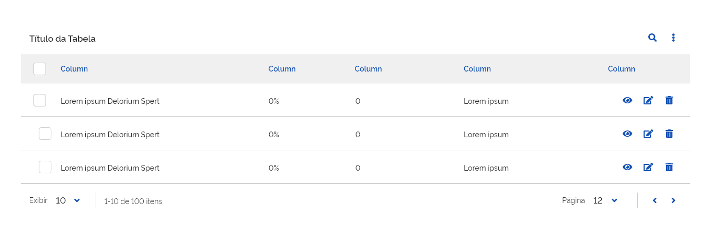
*Linha sem seleção*

Após selecionada a linha, poderá ser utilizada a *Barra Contextual* que conterá informações e ações referentes à linha selecionada. Esta surgirá logo abaixo da barra de título. Quando forem selecionadas uma ou mais linhas da tabela, mas não todas, o *checkbox* do *header* da tabela assumirá o estado intermediário, indicando que uma ou algumas linhas estão selecionadas. Observe abaixo:

*Linha selecionada e Barra Contextual*

O usuário também poderá selecionar todas as linhas simultaneamente, clicando no *checkbox* localizado no *header* da tabela. Neste caso, o *checkbox* no *header* da tabela assumirá o estado selecionado.

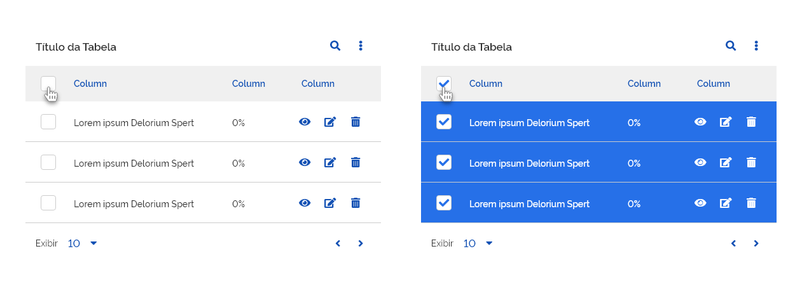
*Selecionando todas as linhas*

### 5. Densidade

O componente *table* possui três categorias de densidade.

#### Baixa densidade

Utilize baixa densidade quando o projeto de *layout* permitir mais espaço ou quando houver necessidade de dar mais destaque ao componente *Table*.

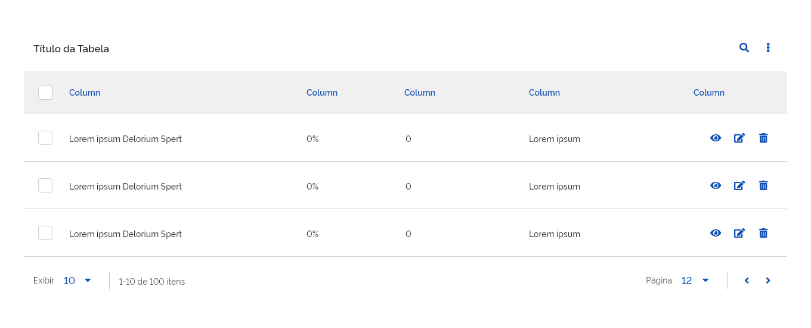
*Baixa Densidade*

#### Densidade padrão

É a forma comum do componente *Table*. Oferece um espaçamento interno adequado e equilibrado para vários tipos de projetos.

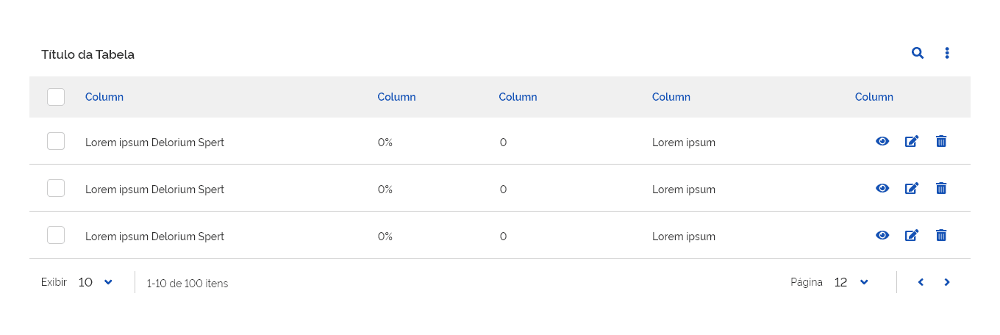
*Densidade Padrão*

#### Alta densidade

Utilize alta densidade quando for necessário usar o componente *Table* em espaços mais restritos ou otimizar o conteúdo em tela.

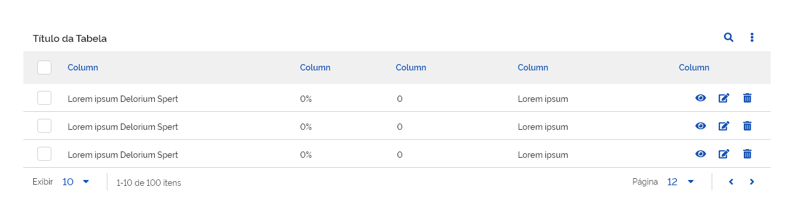
*Alta Densidade*

Consulte especificações de Densidade em *Design Tokens*.

**OBS:** Atentar-se para a correta utilização das densidades, onde a densidade escolhida afetará toda a estrutura da tabela (linhas e colunas).

### 6. Busca

Este comportamento tem a função de auxiliar o usuário na procura por algum conteúdo específico na tabela. O usuário poderá fazer a busca por palavra-chave acionando o botão `Search` na barra de título da tabela. Observe abaixo:

A - O usuário aciona o botão `Search` na barra de título para abrir a opção de busca;

B - Após acionar o botão `Search`, o campo de busca aparece por cima da barra de título cobrindo os demais elementos e, ao lado dele, será exibido o botão fechar;

C - Enquanto o usuário digitar a palavra-chave no campo de busca, as palavras correspondentes à pesquisa serão destacadas automaticamente no conteúdo da tabela, e só serão exibidas as linhas contendo a palavra-chave digitada;

D - O usuário poderá ocultar o campo de busca clicando no botão fechar.

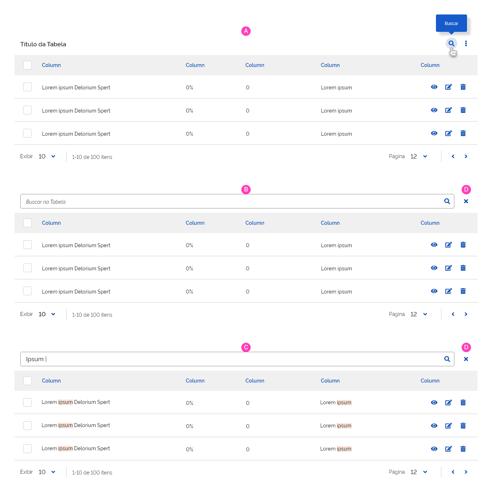
*Busca*

### 7. Estados

O componente *Table* possui os seguintes estados:

#### Estado *hover*

O estado *hover* ocorre quando o usuário passa o *mouse* sobre a linha da tabela.

*Estado Hover - Fundo Claro e Escuro*

#### Estado selecionado

O estado selecionado ocorre quando o usuário seleciona uma ou todas as linhas da tabela através do *checkbox*.

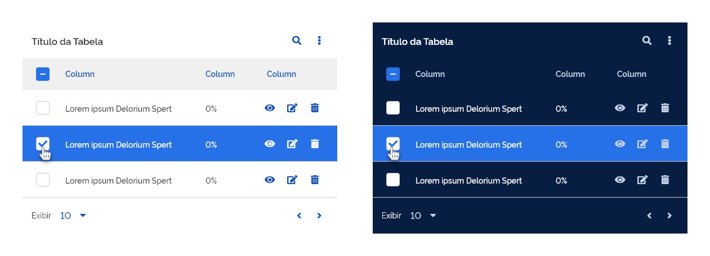
*Estado Selecionado - Fundo Claro e Escuro*

### 8. Agrupamento de colunas e linhas

Sempre que possível opte pela utilização de tabelas simples, pois, múltiplos níveis de cabeçalhos para colunas podem confundir usuários que se utilizam de leitores de tela, contudo, em alguns casos, existe a necessidade da utilização de tabelas complexas que requerem mais do que um nível de cabeçalhos de linhas e/ou colunas. Essa organização visa garantir uma maior liberdade e flexibilidade na organização das informações apresentadas.

#### Agrupamento por colunas

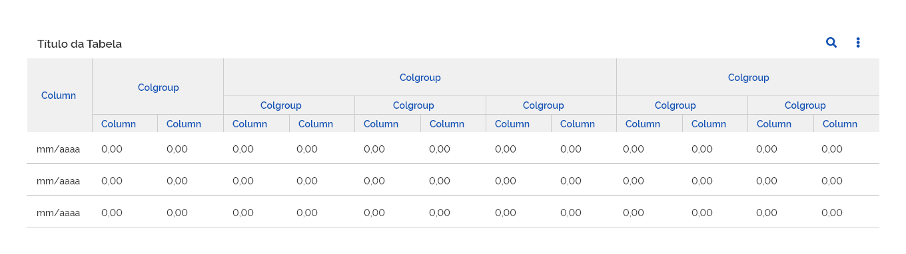
*Exemplo de tabela com colunas agrupadas*

#### Agrupamento por linhas

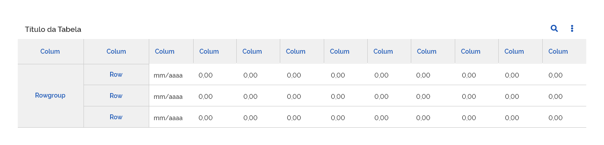
*Exemplo de tabela com linhas agrupadas*

**OBS:** Para mais informações consultar "Tables with irregular headers", da W3C na área de referências.

### 9. Ordenação

O comportamento de ordenação tem a utilidade de organizar o conteúdo das colunas exibidas na tabela a partir de uma lógica de visualização, ou seja: ordem crescente ou decrescente. Para ordenar a visualização da tabela, o usuário poderá clicar em qualquer área da célula do *header* que esteja com o texto no seu estado interativo. A cada novo clique o ícone e a cor do estado mudará, garantindo um *feedback* visual e indicando o tipo de ordenação utilizado na coluna.

Após clicar no *header* de uma coluna que esteja no estado interativo, seu celular mudará para o estado ordenado, indicando que houve uma mudança na ordenação da coluna. Ver sequência e estados de acionamentos abaixo:

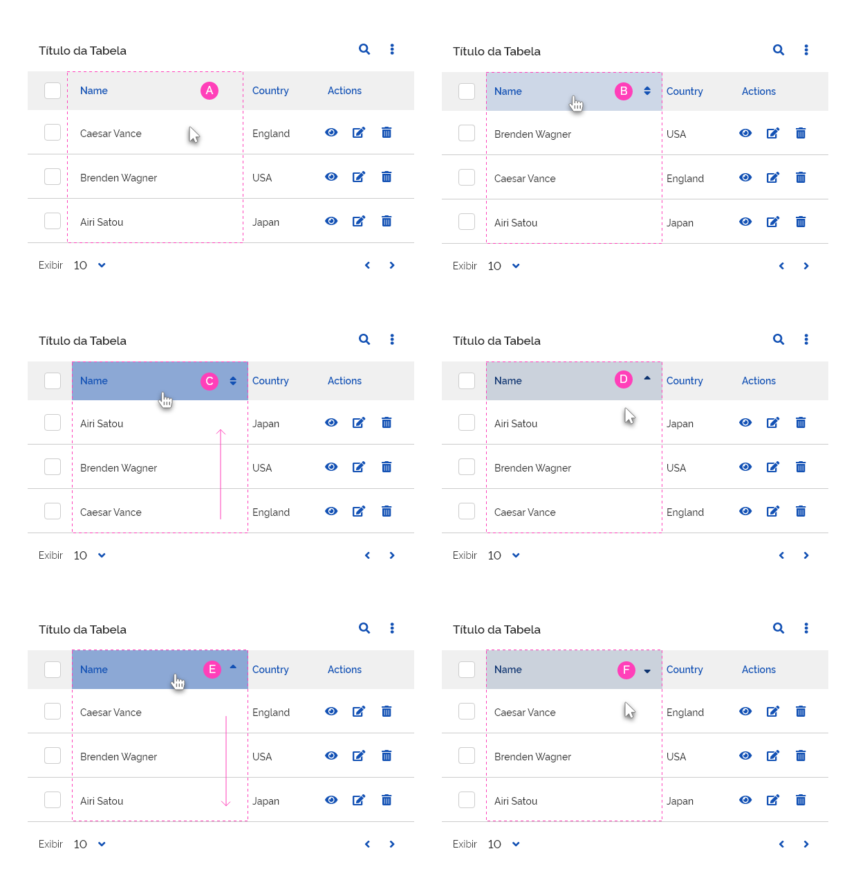
*A - Exemplo de tabela sem ordenação definida;*
*B - Após contato com a seta do mouse o estado do header mudará o hover;*
*C - Exemplo do header da tabela sendo clicado;*
*D - Após clique, os dados da coluna serão ordenado no modo crescente, com o ícone indicando o sentido e o header será apresentado no estado ordenado;*
*E - No instante de um novo clique, o header da tabela apresentará novamente o estado pressionado;*
*F - Após novo acionamento, os dados serão reordenados no modo decrescente, o estado do header será apresentado novamente no estado ordenado, porém com o sentido do ícone invertido indicando a nova ordenação.*

**Atenção:** Na ordenação, o usuário só poderá selecionar um parâmetro por vez (Sem ordenação, Crescente ou Decrescente).

#### Possibilidade de ordenação de tabelas

O header da tabela poderá ser apresentado, de forma opcional, de duas maneiras distintas. Ver exemplo abaixo:

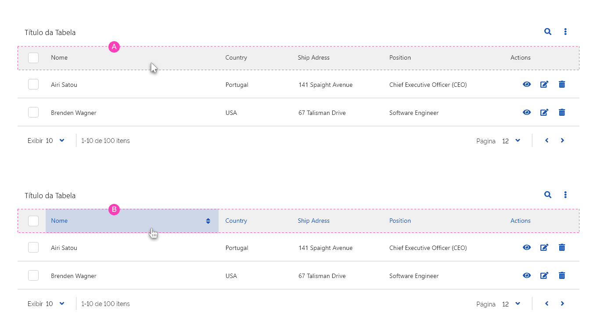
*A - Células não interativas, sem a funcionalidade de ordenação;*
*B - Células interativas que permitem a funcionalidade de ordenação.*

Desta maneira, o usuário poderá ser apresentando a funcionalidade de ordenação, através de uma representação interativa ou *feedback* visual (B) ou sem o estado interativo, onde não será possível ordenar o conteúdo da coluna da tabela (A).

#### Ordenação em tabelas complexas

O comportamento de ordenação em tabelas complexas poderá ser utilizado apenas nas colunas mais próximas às linhas, não podendo ser aplicado em colunas que agrupem outras colunas. Ver exemplos abaixo:

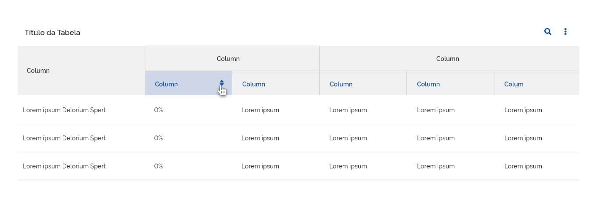
*Ordenação em tabelas complexas*

#### Ícones de ordenação

Para indicar qual coluna está ordenada, será exibido um ícone com seta para baixo (decrescente) ou para cima (crescente) ao lado do nome da coluna. A ausência de setas ou uso de seta dupla (com estado *hover*) significa que a coluna está com ordenação padrão. Observe a seguir:

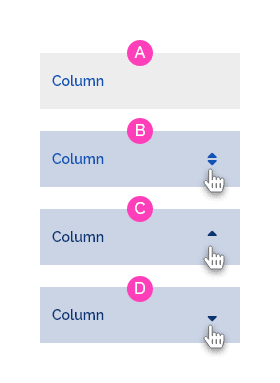
*A - Ordenação Padrão;*
*B - Ordenação Padrão (*hover*);*
*C - Ordenação Crescente;*
*D - Ordenação Decrescente*

---

## Melhores Práticas

Para que as tabelas atendam aos padrões do Design System de forma satisfatória é necessário atentar-se a algumas recomendações:

*   Antes de optar pelo agrupamento de linhas ou colunas nas tabelas, é necessário atentar-se para a possibilidade de simplificação das informações, evitando ao máximo problemas de entendimento devido ao excesso de informações apresentadas.

*   Para uma melhor organização, deve-se optar por fazer separações visuais nítidas com o uso de recursos com bordas destacadas entre os agrupamentos.

*   Evite o uso de colunas com células vazias.

*   Sempre que uma ordenação estiver sendo feita, a coluna selecionada deverá ser apresentada com o estado ativo e com ícone visível.

*   Quando o cabeçalho da tabela não disponibilizar a funcionalidade de ordenação, o rótulo utilizado não deverá ser apresentado na cor do seu estado interativo.

**OBS:** Essas recomendações visam beneficiar não somente as pessoas que possuem necessidades especiais, como também busca facilitar o entendimento para os demais usuários.

---

## Especificações

### Cores

| Name                              | Property   | Color Token            |
| --------------------------------- | ---------- | ---------------------- |
| Barra de Título                   | color      | `--gray-80`            |
| Barra de Título                   | background | `--pure-0`             |
| Barra de Título (Fundo Escuro)    | color      | `--pure-0`             |
| Barra de Título (Fundo Escuro)    | background | `--blue-warm-vivid-90` |
| Header da Tabela                  | color      | `--blue-warm-vivid-70` |
| Header da Tabela                  | background | `--gray-5`             |
| Header da Tabela (Fundo Escuro)   | color      | `--blue-warm-20`       |
| Header da Tabela (Fundo Escuro)   | background | `--blue-warm-vivid-90` |
| Linhas                            | color      | `--gray-80`            |
| Linhas                            | background | `--pure-0`             |
| Linhas (Fundo Escuro)             | color      | `--pure-0`             |
| Linhas (Fundo Escuro)             | background | `--blue-warm-vivid-90` |
| Barra de Paginação                | color      | `--gray-80`            |
| Barra de Paginação                | background | `--pure-0`             |
| Barra de Paginação (Fundo Escuro) | color      | `--pure-0`             |
| Barra de Paginação (Fundo Escuro) | background | `--blue-warm-vivid-90` |

#### Estado Ordenação

| Name                            | Property   | Color Token            |        Opacity         |
| ------------------------------- | ---------- | ---------------------- | :--------------------: |
| Header da Tabela                | color      | `--blue-warm-vivid-80` |           -            |
| Header da Tabela                | background | `--blue-warm-vivid-80` | `--surface-opacity-xs` |
| Header da Tabela (Fundo Escuro) | color      | `--pure-0`             |           -            |
| Header da Tabela (Fundo Escuro) | background | `--pure-0`             | `--surface-opacity-xs` |

### Tipografia

| Name             | Size                      | Weight                    |
| ---------------- | ------------------------- | ------------------------- |
| Barra de Título  | `--font-size-scale-up-01` | `--font-weight-semi-bold` |
| Header da Tabela | `--font-size-scale-base`  | `--font-weight-semi-bold` |
| Linhas           | `--font-size-scale-base`  | `--font-weight-medium`    |

### Espaçamentos

| Name                                  | Property       |         Value          |
| ------------------------------------- | -------------- | :--------------------: |
| Barra de Título (Densidade Padrão)    | padding-top    |  `--spacing-scale-2x`  |
| Barra de Título (Densidade Padrão)    | padding-bottom |  `--spacing-scale-2x`  |
| Barra de Título (Densidade Padrão)    | padding-left   |  `--spacing-scale-2x`  |
| Barra de Título (Densidade Padrão)    | padding-right  |  `--spacing-scale-2x`  |
| Header da Tabela (Densidade Padrão)   | padding-top    |  `--spacing-scale-2x`  |
| Header da Tabela (Densidade Padrão)   | padding-bottom |  `--spacing-scale-2x`  |
| Header da Tabela (Densidade Padrão)   | padding-left   |  `--spacing-scale-3x`  |
| Header da Tabela (Densidade Padrão)   | padding-right  |  `--spacing-scale-3x`  |
| Linhas (Densidade Padrão)             | padding-top    |  `--spacing-scale-2x`  |
| Linhas (Densidade Padrão)             | padding-bottom |  `--spacing-scale-2x`  |
| Linhas (Densidade Padrão)             | padding-left   |  `--spacing-scale-3x`  |
| Linhas (Densidade Padrão)             | padding-right  |  `--spacing-scale-3x`  |
| Barra de Paginação (Densidade Padrão) | padding-top    |  `--spacing-scale-2x`  |
| Barra de Paginação (Densidade Padrão) | padding-bottom |  `--spacing-scale-2x`  |
| Barra de Paginação (Densidade Padrão) | padding-left   |  `--spacing-scale-2x`  |
| Barra de Paginação (Densidade Padrão) | padding-right  |  `--spacing-scale-2x`  |
| Barra de Título (Baixa Densidade)     | padding-top    |  `--spacing-scale-3x`  |
| Barra de Título (Baixa Densidade)     | padding-bottom |  `--spacing-scale-3x`  |
| Barra de Título (Baixa Densidade)     | padding-left   |  `--spacing-scale-2x`  |
| Barra de Título (Baixa Densidade)     | padding-right  |  `--spacing-scale-2x`  |
| Header da Tabela (Baixa Densidade)    | padding-top    |  `--spacing-scale-3x`  |
| Header da Tabela (Baixa Densidade)    | padding-bottom |  `--spacing-scale-3x`  |
| Header da Tabela (Baixa Densidade)    | padding-left   |  `--spacing-scale-3x`  |
| Header da Tabela (Baixa Densidade)    | padding-right  |  `--spacing-scale-3x`  |
| Linhas (Baixa Densidade)              | padding-top    |  `--spacing-scale-3x`  |
| Linhas (Baixa Densidade)              | padding-bottom |  `--spacing-scale-3x`  |
| Linhas (Baixa Densidade)              | padding-left   |  `--spacing-scale-3x`  |
| Linhas (Baixa Densidade)              | padding-right  |  `--spacing-scale-3x`  |
| Barra de Paginação (Baixa Densidade)  | padding-top    |  `--spacing-scale-3x`  |
| Barra de Paginação (Baixa Densidade)  | padding-bottom |  `--spacing-scale-3x`  |
| Barra de Paginação (Baixa Densidade)  | padding-left   |  `--spacing-scale-2x`  |
| Barra de Paginação (Baixa Densidade)  | padding-right  |  `--spacing-scale-2x`  |
| Barra de Título (Alta Densidade)      | padding-top    | `--spacing-scale-base` |
| Barra de Título (Alta Densidade)      | padding-bottom | `--spacing-scale-base` |
| Barra de Título (Alta Densidade)      | padding-left   |  `--spacing-scale-2x`  |
| Barra de Título (Alta Densidade)      | padding-right  |  `--spacing-scale-2x`  |
| Header da Tabela (Alta Densidade)     | padding-top    |  `--spacing-scale-2x`  |
| Header da Tabela (Alta Densidade)     | padding-bottom |  `--spacing-scale-2x`  |
| Header da Tabela (Alta Densidade)     | padding-left   |  `--spacing-scale-3x`  |
| Header da Tabela (Alta Densidade)     | padding-right  |  `--spacing-scale-3x`  |
| Linhas (Alta Densidade)               | padding-top    | `--spacing-scale-base` |
| Linhas (Alta Densidade)               | padding-bottom | `--spacing-scale-base` |
| Linhas (Alta Densidade)               | padding-left   |  `--spacing-scale-3x`  |
| Linhas (Alta Densidade)               | padding-right  |  `--spacing-scale-3x`  |
| Barra de Paginação (Alta Densidade)   | padding-top    | `--spacing-scale-base` |
| Barra de Paginação (Alta Densidade)   | padding-bottom | `--spacing-scale-base` |
| Barra de Paginação (Alta Densidade)   | padding-left   |  `--spacing-scale-2x`  |
| Barra de Paginação (Alta Densidade)   | padding-right  |  `--spacing-scale-2x`  |

### Sombra (Collapse e Scroll)

|  Name  | Offset (px) |                   Offset Token                   |
| :----: | :---------: | :----------------------------------------------: |
| Header |      1      |              `--surface-offset-sm`               |
| Linha  |   1 ou -1   | `--surface-offset-sm` ou `--surface-offset-sm-n` |
| Footer |     -1      |             `--surface-offset-sm-n`              |

|      Name      | Blur (px) |     Blur Token      |
| :------------: | :-------: | :-----------------: |
| Header e Linha |     6     | `--surface-blur-lg` |

|      Name      | Camada |     Layer Token     |
| :------------: | :----: | :-----------------: |
| Header e Linha |   1    | `--z-index-layer-1` |

---

## Referências

*   [Tables with irregular headers](https://www.w3.org/WAI/tutorials/tables/irregular/)
