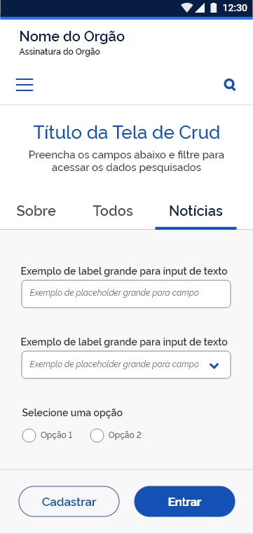
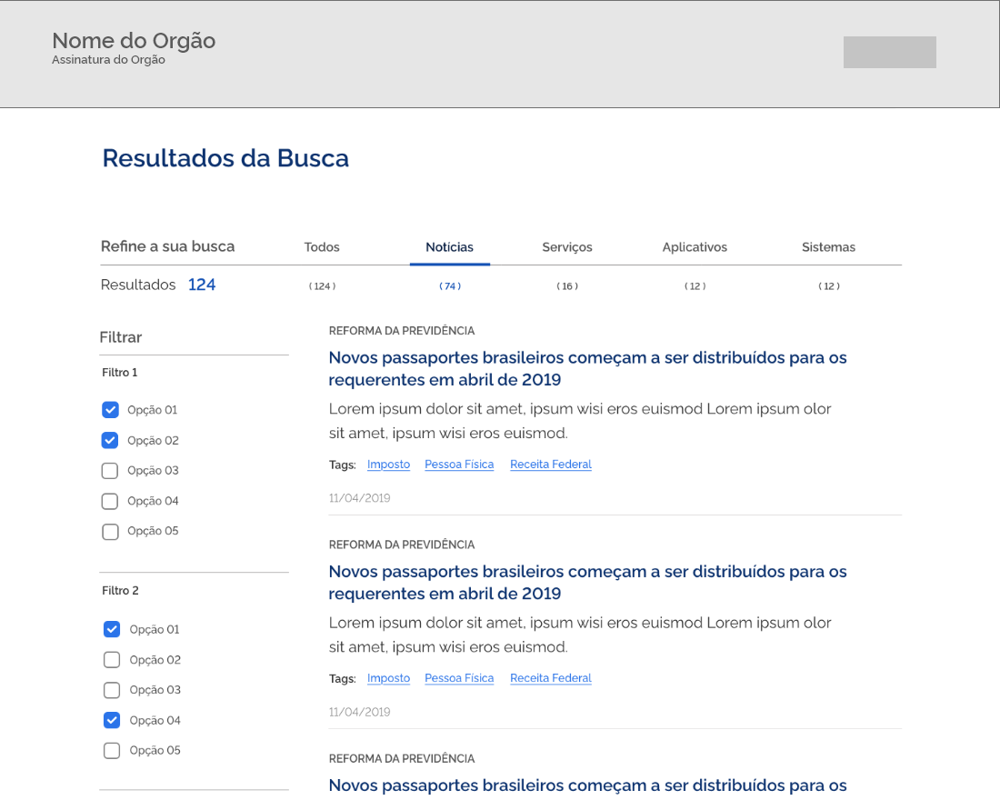
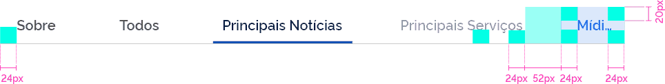
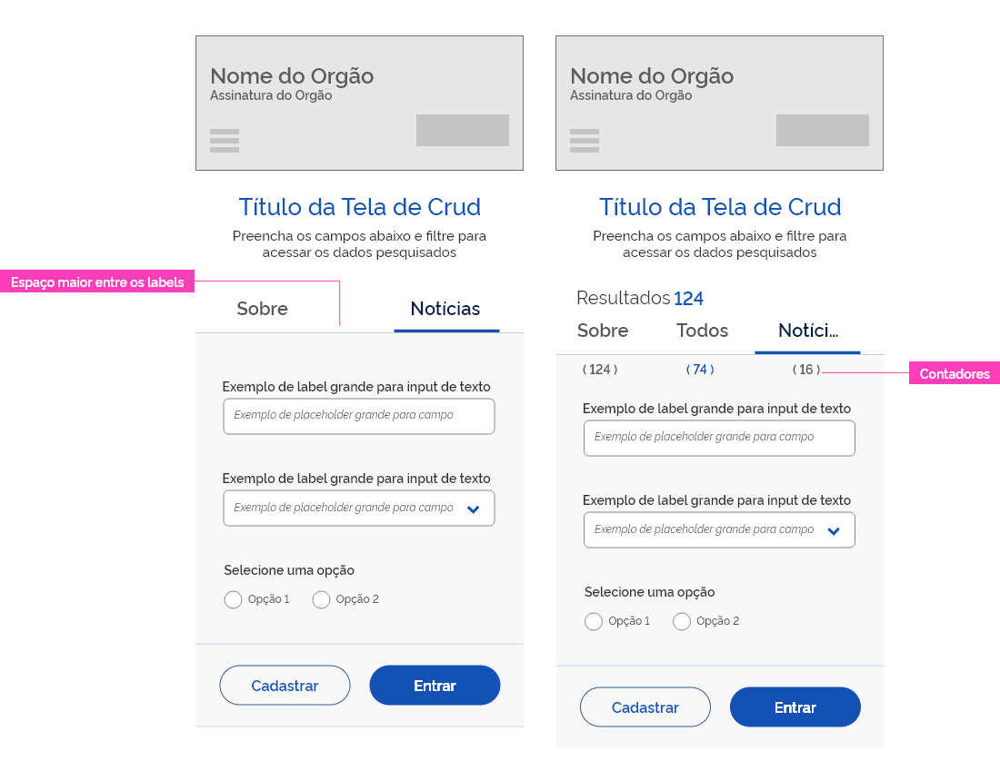
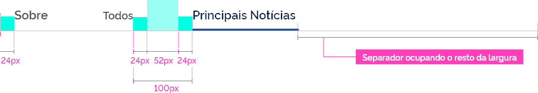
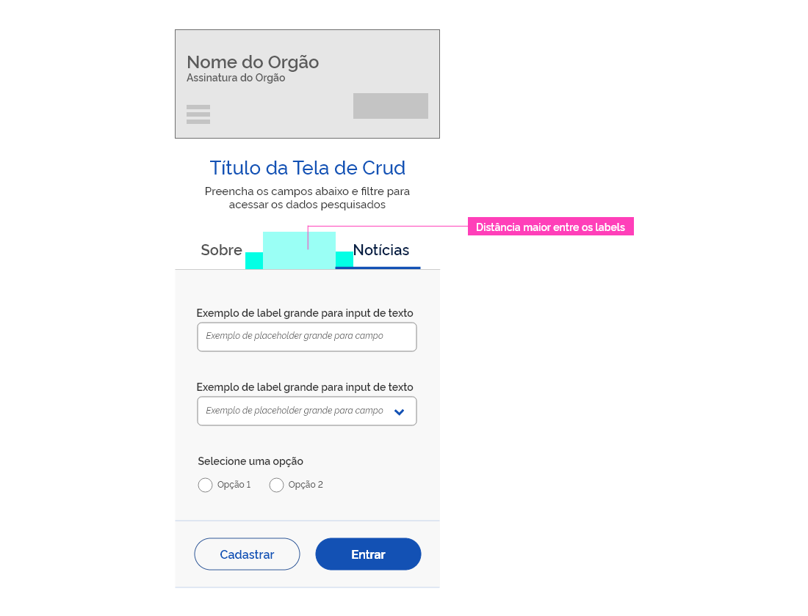

[version]: # '6.0.0'

## Princípios

### Experiência Única

As informações são organizadas em assuntos. Cada aba se destina a um assunto dentro de um contexto específico, facilitando que o usuário encontre o que procura e possa facilmente alternar de um assunto para o outro.

### Eficiência e Clareza

Abas são exibidas umas ao lado das outras, em categorias de igual importância. Dessa forma, possuem o mesmo nível de hierarquia, mesmo se tratando de informações distintas dentro de um mesmo contexto.

### Acessibilidade

As interfaces devem cumprir as diferentes necessidades de acessibilidade. Por causa disso, o tamanho da tipografia e as cores foram aplicadas prevendo — de um nível mínimo de adequação à legibilidade.

### Estrutura

Cada aba deve possuir um label (rótulo) que a defina de forma clara e sintética. Para que a leitura não seja prejudicada e a interface se mantenha organizada, é recomendado que o label das abas seja composto de apenas uma palavra (no máximo duas). É recomendado que apareçam no máximo, 06 abas por tela. Os rótulos das abas devem aparecer em uma única linha. E os contadores devem aparecer abaixo do separador que dá suporte aos labels.

##### 1 | Abas Padrão

No mobile o ideal é que apareçam pelo menos 3 itens de abas

##### 2 | Abas com Contadores

Os contadores devem aparecer abaixo dos rótulos e alinhados ao centro com os mesmos. Nessa versão sugere-se que apareçam no máximo 04 abas por tela.

Exemplo de Abas em um contexto de resultado de busca com contadores:

##### 3 | Abas Deslocáveis

Recomenda-se utilizar essa opção quando a quantidade de abas exceder a largura da tela ou dispositivo. Nesse caso, ao passar o mouse em cima da última aba da direita, todas as outras se deslocarão para esquerda, liberando espaço às abas que estavam ocultas. O rótulo da última aba pode aparecer truncado, sinalizando ao usuário que há uma continuação. Este recurso é bastante útil para interfaces mobiles.

---

## Estados

Os estados das abas servem para dar feedback ao usuário sobre as ações que estão acontecendo quando há uma interação com o elemento.

##### A| Interativo (Normal)

O estado padrão do botão. Como as abas são exibidas naturalmente na interface.

##### B | Foco

Indica ao usuário o elemento em foco.

##### C | Selecionado

Ocorre quando uma aba é clicada.

##### D | Desabilitado

Abas inativas são apresentadas num tom de azul mais claro, indicando que sua ação está desabilitada.

##### E | Hover

Ocorre quando o cursor do mouse está sobre uma das abas.

---

## Anatomia

### Tom de Voz das Abas

O tom de voz das abas é, essencialmente, como elas vão se comunicar, qual assunto se trata, deixando claro para o usuário que assunto ele vai encontrar em cada aba.

Recomenda-se, sempre que possível, a utilização de substantivos que determinem de forma clara qual conteúdo se destina aquela aba.
Evitar uso de siglas ou expressões que sejam desconhecidas do público em geral. Como mencionado anteriormente, optar pelo uso de uma ou duas palavras apenas. Evitar rótulos extensos ou que confundam o usuário.

#### Formatação do Texto

Os textos dos labels precisam ser formatados em letras minúsculas com a primeira letra maiúscula. Ex.: Principais Notícias

### Alinhamento

Deve-se deixar uma margem entre o primeiro label e o separador, como exemplificado no item espaçamentos. O Marcador que aparece abaixo da aba selecionada deve apresentar-se alinhado ao centro com o label da aba a que se destina.

O título "refine sua busca" ocorre apenas quando há filtros na busca. Ele deve vir alinhado à esquerda com a quantidade de resultados e com o separador. O alinhamento entre o rótulo da aba e os contadores deve ser centralizado.

## Espaçamento

Deve-se deixar uma margem de 24px entre o primeiro label e a extremidade do separador, também entre o label e a extremidade do marcador da aba selecionada.

##### 1 | Aplicação Web

Na web deve ser deixada uma distância total de 100 px entre os labels, ou seja, 24px de margem de cada lado, acrescidas de uma distância de 52px.

##### 2 | Aplicação Mobile

Nos dispositivos móveis a distancia entre os labels deve diminuir de acordo com o formato de cada tela. O ideal é que fiquem sempre visíveis no mínimo 3 abas. Se houver mais de 3 abas, a que se encontra mais à direita da tela virá truncada, indicando ao usuário que há mais abas disponíveis para o clique. Nos casos em que haja necessidade de contador, os mesmos devem aparecer abaixo do separador, como acontece na versão mobile.

---

## Comportamento

##### 1 | Aplicação Web

Quando houver poucas abas, conservar a distância de 100px entre elas. O separador porém, deve preencher toda largura disponível na tela.

#### 2 | Aplicação Mobile

Nos dispositivos móveis é necessário ajustar a largura de acordo com a tela. No exemplo abaixo, a distância entre os label aumentou para que as abas ficassem dispostas aproveitando toda a largura útil do dispositivo.

### Área de Toque

A área de toque foi definida de acordo com as margens projetadas para as abas. Sendo assim, tanto na aplicação web como mobile, a área de toque compreende a largura total do label, acrescida das margens laterais de 24px e das margens superior e inferior de 20px.

