[version]: # (8.1.5)

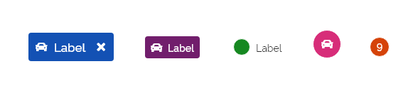
*Exemplos de tipos do componente _tag_.*

Use _tags_ para informar, rotular, chamar atenção ou categorizar itens usando palavras-chave, ícones ou cores.

---

## Tom e voz

Devem ter um relacionamento claro e útil com o conteúdo ou tarefa aos quais estão relacionados. Por serem elementos compactos é recomendado o uso de informações discretas e objetivas:

-  No caso de textos, utilize o mínimo de palavras possíveis (de preferência somente uma) e/ou um ícone apenas;

- Utilize apenas uma cor por _tag_.

---

## Anatomia

1. Superfície;
2. Ícone;
3. _Label_;
4. Botão terciário.

*Anatomia do componente _tag_.*

### Detalhamento dos itens

#### 1- Superfície

Todos os elementos da _tag_ estão contidos na superfície que pode ter o formato retangular ou circular, conforme o tipo.

*Superfícies do _tag_.*

Cuidado com contraste de cores (**superfície** e o **texto/ícone**) nas _tag_ que podem ser personalizadas.

**Atenção:** os únicos tipos de _tags_ que podem conter bordas são as _tags_ de _status_ e as _tags_ de contagem.

#### 2- Ícone

Os ícones identificam entidades ou categorias. Funcionam como apoio aos _labels_ ou podem ser o único conteúdo da _tag_. Nos casos em que o ícone seja o único elemento da _tag_ o uso de _tooltip_ é necessário.

*Use _tooltips_ para complementar informações em _tags_ de ícone ou de _status_.*

#### 3- _Label_

_Labels_ são conteúdos presentes nas _tags_ com exceção da _tag_ de ícone, o único tipo que não apresenta _label_. Na _tag_ de _status_ o uso de _label_ é opcional.

*Exemplos de _tags_ com uso de _labels_.*

**Atenção:** o _label_ da _tag_ deve ser um adjetivo ou substantivo, **não use verbos**.

#### 4- Botão terciário

A **_tag_ interativa** é o único tipo em que é possível incluir um botão terciário para a sua remoção ou exclusão.

Foi criada uma nova densidade para o botão terciário fechar especialmente para o componente _tag_ denominada **extra-alta**.

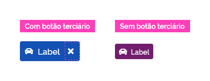
*Exemplo do uso de botão terciário em uma _tag_ interativa e uma tag de texto que não possui botão terciário.*

O botão terciário deve manter o seu comportamento dentro do componente e funciona da mesma maneira em todos os estados.

---

## Tipos

Encontramos cinco tipos de componentes _tag_:

1. _Tag_ de interação;
2. _Tag_ de texto;
3. _Tag_ de _status_;
4. _Tag_ de contagem;
5. _Tag_ de ícone.

### 1- _Tag_ de Interação

As _tags_ de interação, como o próprio nome sugere, são interativas, isto é, possuem uma ação ao serem clicadas/tocadas. De acordo com o tipo de interação podemos ter _tags_ interativas dispensáveis e persistentes.

#### 1.1- Dispensável

Uma _tag_ é considerada dispensável quando apresenta o botão terciário que permite que o usuário possa excluir a _tag_.

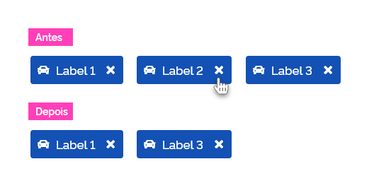
*Ao clicar/tocar no botão fechar, uma _tag_ é excluída de uma amostragem. Neste exemplo, a _tag Label_ 2 foi excluída.*

Uma _tag_ interativa dispensável pode ser adicionada por meio de diversos componentes de entrada como: _input_, _select_, etc.

#### 1.2- Persistente

Uma _tag_ é considerada persistente quando permitir que possa ser selecionada/desselecionada.

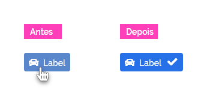
*Exemplo de _tag_ selecionada.*

Essa funcionalidade é realizada interagindo em qualquer área do componente para selecionar uma _tag de interação persistente_. Ao se clicar/tocar novamente em uma _tag_ já selecionada, ela é desselecionada retornando ao estado original.

Quando se trabalha com grupos de _tags_ é possível selecionar quantas _tags_ desejar.

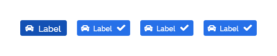
*Neste exemplo temos três _tags_ selecionadas.*

**Atenção:** as duas variações de _tags_ de interação apresentadas (dispensáveis e persistentes) não podem ser utilizadas simultaneamente em um mesmo componente ou grupo de componentes.

### 2- _Tag_ de Texto

_Tags_ de texto são utilizados quando é necessário identificar ou chamar a atenção de um elemento no _layout_, que de outra forma, poderia ser perdido. A _tag_ de texto nunca é interativa.

Muitas vezes, _tags_ de texto podem utilizar um ícone para reforçar a sua mensagem. Quando isso ocorrer, o ícone deve vir à esquerda do _label_, como ilustra a figura abaixo:

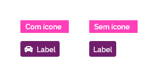
*Exemplo de _tag_ de texto com e sem uso de ícone.*

A imagem a seguir ilustra alguns dos mais frequentes usos da _tag_ de texto:

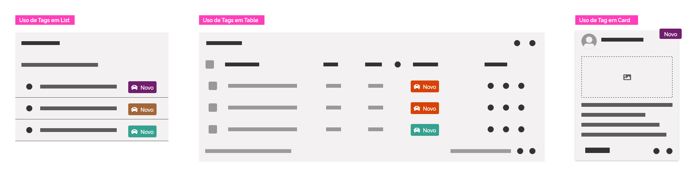
*Algumas possibilidades comuns de uso da _tag_ de texto.*

### 3- _Tag_ de _Status_

_Tags_ de _status_ basicamente informa o _status_ de um elemento. É flexível podendo ser utilizado com _label_ ou apenas a superfície circular. Neste caso, a informação é transmitida unicamente por meio de cores.

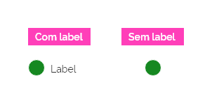
*Exemplo de _tag_ de _status_ com e sem uso de _label_.*

**Atenção:** lembre-se que ao optar pela _tag_ de _status_ sem _label_ é recomendável utilizar _tooltip_ para evitar ambiguidade.

### 4- _Tag_ de Contagem

_Tags_ de contagem têm a função de contabilizar uma determinada informação e apresentar ao usuário. Por exemplo, a quantidade de mensagens não lidas na caixa de entrada.

*Exemplo de _tag_ de contagem.*

As _tags_ de contagem podem conter no máximo três dígitos. Qualquer valor acima de 999 deve ser acrescido do sinal de "+" após o número 999.

*Exemplos das possibilidades de quantidade de dígitos nas _tag_ de contagem.*

**Atenção:** em caso de números com mais de três dígitos é recomendado o uso de _tooltip_ para especificar a quantidade exata do valor.

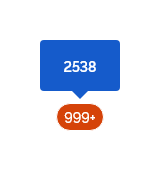
*Exemplos do uso de uma _tag_ de contagem com mais de três dígitos.*

A imagem a seguir ilustra alguns dos mais frequentes usos da _tag_ de contagem:

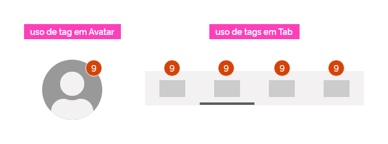
*Algumas possibilidades comuns de uso da _tag_ de contagem.*

### 5- _Tag_ de Ícone

_Tags_ de ícone funcionam exatamente da mesma forma que as _tags_ de texto, porém utilizam ícones em vez de textos para transmitir a informação.

*Algumas possibilidades comuns de uso da _tag_ de ícone.*

Por ser visual, a _tag_ de ícone é mais sintética e direta. Por isso, escolha ícones que sejam de fácil assimilação pelo usuário e de preferência aqueles que já sejam popularmente conhecidos pela audiência. Lembre-se que é recomendado a utilização de _tooltip_ para evitar ambiguidade.

**Atenção:** somente as _tags_ de _status_, de ícone e de contagem possuem bordas. Isso se deve ao fato de usualmente elas sobreporem outros elementos. Porém, por serem opcionais as bordas podem ser omitidas quando desnecessárias.

---

## Comportamento

### 1- Classificação

Geralmente é utilizada a cor azul padrão para o _background_ da superfície do componente _tag de interação_ porque esta é a cor que indica que um elemento é interativo. Para os demais tipos de _tags_ sugerimos utilizar a paleta de cores de apoio do _Design System_. Esteja sempre atento para garantir legibilidade e coerência semântica na escolha das cores.

**Atenção:** não exagere na variedade de cores pois isso pode desviar a atenção do usuário do foco principal da tela.

### 2- Estados

Somente a _tag_ de interação possui estados que devem seguir o padrão dos demais componentes do DS, porém há algumas peculiaridades:

- Quando houver botão terciário os estados de _hover_, pressionado e foco devem ocorrer no próprio botão;

- Os demais estados ocorrem na _tag_ por completo.

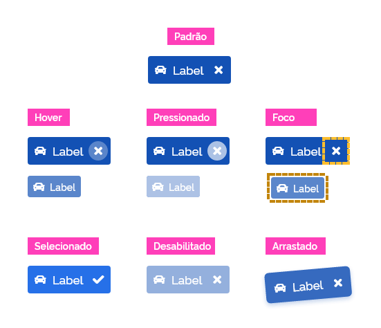
*Exemplo dos estados possíveis para _tags_.*

**Atenção:** quando _tag_ é arrastada de uma posição para a outra, além de assumir o estado arrastado enquanto é realizada a ação, as demais _tags_ à sua direita devem se deslocar para a esquerda e ao ser posicionado na nova posição os componentes a sua direita devem se deslocar para a direita.

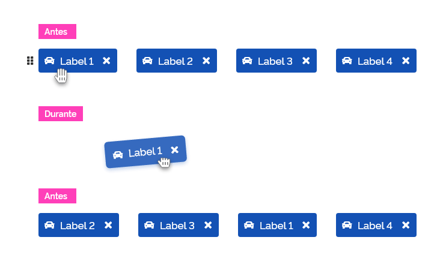
*Exemplo do comportamento de _dragging_ com _tags_.*

### 3- Densidade

O ajuste da densidade consiste em aumentar ou reduzir os espaçamentos internos dos elementos com intuito de possibilitar _tags_ mais compactas ou mais expandidas em seu formato. Este recurso permite uma maior flexibilidade de uso das _tags_.

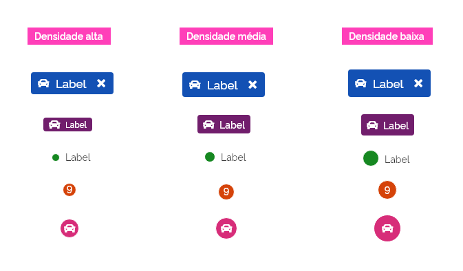
*Exemplo das possíveis densidades para _tags_.*

### 4- Dimensões

O componente _tag_ possui uma altura fixa e por isso não é permitida mais de uma linha de texto ou ícone no mesmo componente.

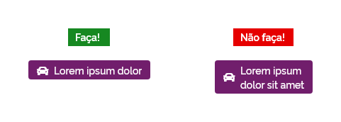
*Só é permitida uma única linha de texto/ícone nas _tags_.*

Quanto à largura, a quantidade máxima permitida é de **cem caracteres**. Se um texto com mais de cem caracteres for inevitável deve-se truncar o conteúdo com o uso de reticências (...) a partir do centésimo caractere. Desta forma é indicado ao usuário que o texto tem continuidade.

*Exemplo com a quantidade máxima de caracteres aceita pela _tag_.*

**Atenção:** uma boa prática nesses casos é a utilização de _tooltip_ para mostrar a informação completa.

### 5- Distribuição

_Tags_ podem estar agrupadas tanto horizontal quanto verticalmente mantendo a consistência nos espaços entre as _tags_.

*Exemplos de possibilidades de distribuição de _tag_ na tela.*

**Atenção:** tenha em mente que _tags_ também podem estar contidas em outros componentes como: modais, _cards_, _tables_, etc. e devem respeitar as orientações desses componentes.

### 6- Entrada de _tags_

Quando for necessário o cadastro de _tags_ pelo usuário sugerimos a utilização de componentes de entrada de dados, como: o _input_ ou o _select_.

O componente _input_ é mais indicado para a entrada de _tags_ criadas aleatoriamente pelo usuário por meio de digitação. Já o componente _select_ funciona melhor para apresentar as _tags_ sugeridas pelo sistema para que o usuário faça suas escolhas.

#### Entrada de _tags_ com o componente _input_

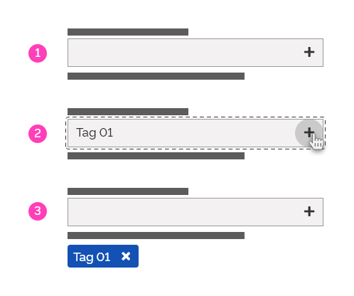
*Exemplo dos passos para a criação de uma _tag_ por meio do componente de entrada _input_.*

**Atenção:** o recurso de **_auto complete_** pode ser interessante em determinados casos.

#### Entrada de _tags_ com o componente _select_

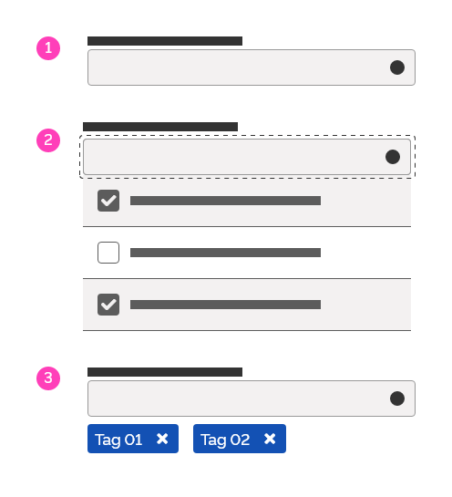
*Exemplo dos passos para a criação de uma _tag_ por meio do componente de entrada _select_.*

**Atenção:** quando a entrada de _tags_ for por meio de um componente de entrada como _input_ ou _select_ a _tag_ deve ser do tipo **interação dispensável**.

As _tags_ adicionadas devem ser disponibilizadas lado a lado até preencher o espaço horizontal disponível. Caso seja necessário, outras linhas de _tags_ poderão ser criadas.

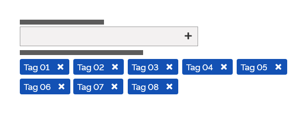
*Para concluir a inserção de uma _tag_ utilizando campos de _input_ basta clicar no botão "+", "Enter" ou clicar fora da área do componente _input_ após digitar o nome da _tag_.*

## Melhores Práticas

- _Tags_ são elementos de apoio e geralmente acompanham outros elementos. A exceção é a _tag_ de interação, que pode funcionar como um componente isolado.

- Evite utilizar _tags_ de interação próximas a botões, pois podem causar confusão. Na dúvida, conduza testes de usabilidade para certificar-se de que sua implementação não esteja causando frustração.

- Não misture _tags_ de interação com _tags_ estáticas. Depois de estabelecer um padrão de como as _tags_ se comportam em seu _site_, os usuários sempre esperam esse comportamento.

- Não exagere. As _tags_ são mais úteis quando utilizadas com cautela, caso contrário seu significado pode ser diminuído. Lembre-se: se tudo em uma página for considerado importante, nada atrairá atenção exclusiva.

- Mantenha a consistência dos _labels_ ao realizar a entrada de _tags_.

---

## Especificação

### Alinhamento [_tag_ de Interação]

|Name|Spacing Token|
|--|:--:|
|Label/Icon/Terciary-button|`--spacing-vertical-center`|
|Label|`--spacing-horizontal-center`|
|Icon|`--spacing-horizontal-left`|
|Tertiary-button|`--spacing-horizontal-right`|

### Alinhamento [_tag_ de Texto]

|Name|Spacing Token|
|--|:--:|
|Label/Icon|`--spacing-vertical-center`|
|Label|`--spacing-horizontal-right`|
|Icon|`--spacing-horizontal-left`|

### Alinhamento [_tag_ de Status]

|Name|Spacing Token|
|--|:--:|
|Label|`--spacing-vertical-center`|
|Label|`--spacing-horizontal-center`|
|Superficie|`--spacing-vertical-center`|
|Superficie|`--spacing-horizontal-center`|

### Alinhamento [_tag_ de Ícone]

|Name|Spacing Token|
|--|:--:|
|Icon|`--spacing-vertical-center`|
|Icon|`--spacing-horizontal-center`|

### Alinhamento [_tag_ de Contagem]

|Name|Spacing Token|
|--|:--:|
|Label|`--spacing-vertical-center`|
|Label|`--spacing-horizontal-center`|

### Espaçamento [_Tag_ de Interação]

|Name|Property|Token/Value|
|--|--|:--:|
|Label|margin-right/margin-left|`--spacing-scale-baseh`|
|Icon|margin-left|`--spacing-scale-base`|
|Tertiary-button|margin-right|`--spacing-scale-default`|

### Espaçamento [_Tag_ de Texto]

|Name|Property|Token/Value|
|--|--|:--:|
|Label|margin-right/margin-left|`--spacing-scale-baseh`|
|Icon|margin-left|`--spacing-scale-baseh`|

### Espaçamento [_Tag_ de Status]

|Name|Property|Token/Value|
|--|--|:--:|
|Label|margin-left|`--spacing-scale-base`|

### Espaçamento [_Tag_ de Entrada]

|Name|Property|Token/Value|
|--|--|:--:|
|Tag de Entrada|margin-right/margin-top|`--spacing-scale-base`|

### Tipografia [_Tag_ de Interação]

|Name|Property|Token/Value|
|--|--|:--:|
|Label|family|`–-font-family-base`|
|Label|font-weight|`--font-weight-medium`|
|Label|size|`--font-size-scale-up-01`|

### Tipografia [_Tag_ de Texto]

|Name|Property|Token/Value|
|--|--|:--:|
|Label|family|`–-font-family-base`|
|Label|font-weight|`--font-weight-medium`|
|Label|size|`--font-size-scale-base`|

### Tipografia [_Tag_ de Status]

|Name|Property|Token/Value|
|--|--|:--:|
|Label|family|`–-font-family-base`|
|Label|font-weight|`--font-weight-regular`|
|Label|size|`--font-size-scale-base`|

### Tipografia [_Tag_ de Contagem]

|Name|Property|Token/Value|
|--|--|:--:|
|Label|family|`–-font-family-base`|
|Label|font-weight|`--font-weight-medium`|
|Label|size|`--font-size-scale-base`|

### Iconografia

|Name|Property|Token/Value|
|--|--|:--:|
|tag de interação|size|`--icon-size-base`|
|tag de texto|size|`--icon-size-base`|
|tag de ícone|size|`--icon-size-base`|

### Cores [_Tag_ de Interação]

|Name|Property|Token/Value|
|--|--|:--:|
|Label|color|`--pure-0`|
|Superficie|color|`--blue-warm-vivid-70`|

### Cores [_Tag_ de Texto]

|Name|Property|Token/Value|
|--|--|:--:|
|Label|color|`--pure-0` ou `--gray-80`|
|Superficie|color|`Qualquer cor da paleta de apoio`|

### Cores [_Tag_ de Status]

|Name|Property|Token/Value|
|--|--|:--:|
|Label|color|`--gray-80`|
|Superficie|color|`Qualquer cor da paleta de apoio ou paleta de aviso`|

### Cores [_Tag_ de Ícone]

|Name|Property|Token/Value|
|--|--|:--:|
|Ícone|color|`--pure-0` ou `--gray-80`|
|Superficie|color|`Qualquer cor da paleta de apoio ou paleta de aviso`|

### Cores [_Tag_ de Contagem]

|Name|Property|Token/Value|
|--|--|:--:|
|Label|color|`--pure-0` ou `--gray-80`|
|Superficie|color|`Qualquer cor da paleta de apoio ou paleta de aviso`|

### Arredondamento [_Tag_ de Interação]

|Name|Property|Value|
|--|--|:--:|
|Superficie|top-left-bottom-right|`--surface-rounder-sm`|

### Arredondamento [_Tag_ de Texto]

|Name|Property|Value|
|--|--|:--:|
|Superficie|top-left-bottom-right|`--surface-rounder-sm`|

### Arredondamento [_Tag_ de Ícone]

|Name|Property|Value|
|--|--|:--:|
|Superficie|top-left-bottom-right|`--surface-rounder-pill`|

### Arredondamento [_Tag_ de Contagem]

|Name|Property|Value|
|--|--|:--:|
|Superficie|top-left-bottom-right|`--surface-rounder-pill`|

### Tertiary Button [Tag de Interação]

|Name|Property|Token/Value|
|--|--|:--:|
|Densidade extra-alta|height|`--spacing-scale-3xh`|

### Densidade

|Name|Property|Token/Value|
|--|--|:--:|
|Tag de interação (dens. alta)|height|`--spacing-scale-4x`|
|Tag de interação (dens. media)|height|`--spacing-scale-5x`|
|Tag de interação (dens. baixa)|height|`--spacing-scale-5xh`|
|Tag de texto (dens. alta)|height|`--spacing-scale-2xh`|
|Tag de texto (dens. media)|height|`--spacing-scale-3xh`|
|Tag de texto (dens. baixa)|height|`--spacing-scale-4xh`|
|Tag de status (dens. alta)|height|`--spacing-scale-baseh`|
|Tag de status (dens. media)|height|`--spacing-scale-2x`|
|Tag de status (dens. baixa)|height|`--spacing-scale-3x`|
|Tag de contagem (dens. alta)|height|`--spacing-scale-2xh`|
|Tag de contagem (dens. media)|height|`--spacing-scale-3x`|
|Tag de contagem (dens. baixa)|height|`--spacing-scale-3xh`|
|Tag de ícone (dens. alta)|height|`--spacing-scale-3xh`|
|Tag de ícone (dens. media)|height|`--spacing-scale-4x`|
|Tag de ícone (dens. baixa)|height|`--spacing-scale-5xh`|

### Border

| Name | Surface Border Token | Style | Width | Color |
|--|--|--|--|--|
| Tag de status |`--surface-border-solid-sm`|solid|`--surface-width-sm`|`--pure-0`|
| Tag de contagem |`--surface-border-solid-sm`|solid|`--surface-width-sm`|`--pure-0`|
