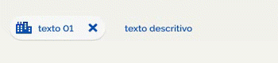
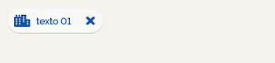
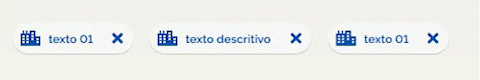
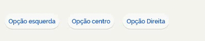
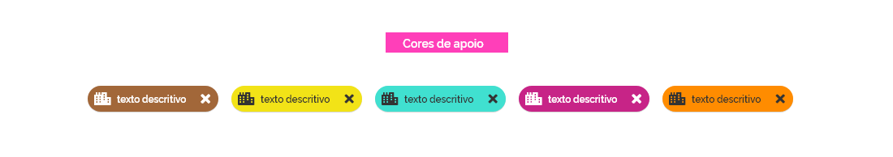
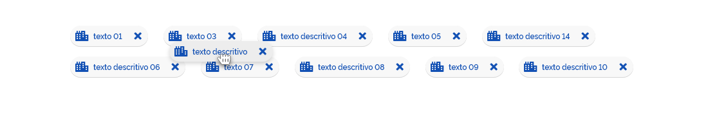
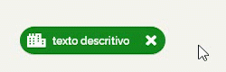
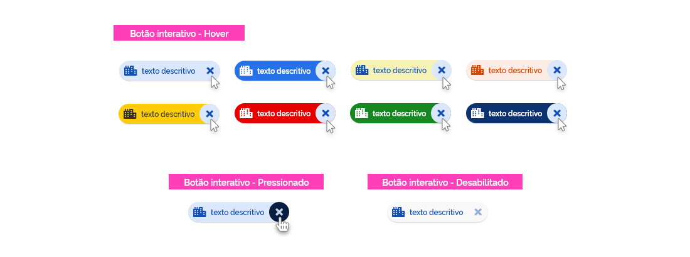
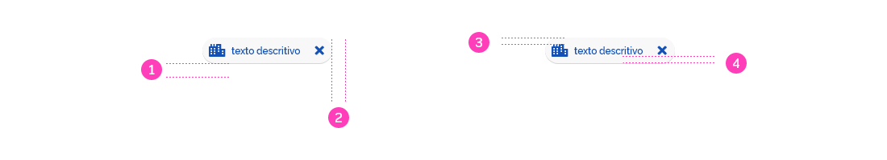
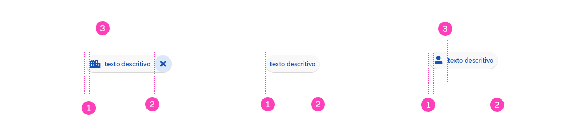

[version]: # '7.0.0'

---

## Tom de voz

Por serem elementos compactos é recomendado que se utilizem informações discretas e se possível com apenas uma palavra.
Devem ter um relacionamento claro e útil com o conteúdo ou tarefa que eles representam.

---

## Anatomia

1. Container
2. Área de conteúdo
3. Texto descritivo (opcional se houver um ícone)
4. Ícone informativo (opcional se houver um texto descritivo)
5. Botão (opcional)

### 1. Container

O componente Tag nasce de um container na forma de um retângulo com os cantos arredondados formando uma cápsula.
Todos os elementos do Tag estão contidos no container e seu tamanho é determinado por esse elemento.

### 2. Área de Conteúdo

A Área de conteúdo do Tag pode ser um nome de entidade, descrição, palavra-chave, ação ou conversação e/ou um ícone informativo. O componente deve, obrigatoriamente possuir um ícone informativo (3) e/ou um texto descritivo (4).

### 3. Ícone informativo

Os ícone informativo (3) identifica entidades ou categorias exibindo um símbolo ou ícone.

### 4. Texto descritivo

O texto descritivo (4) pode ser um nome de entidade, descrição, palavra-chave, fixo ou dinâmico.

### 5. Botão

No tipo Tag de entrada pode-se incluir um botão para a sua remoção ou exclusão. Para isso é utilizado o _Botão circular de ênfase terciária_.

Não é recomendado utilizar o botão no componente do tipo Tag de escolha.

---

## Tipos

O componente Tag possui duas variações os Tag de entrada(1) e os Tag de escolha(2).

### 1. Tag de entrada

O tipo Tag de entrada é composto pelo container, ícone informativo e/ou texto descritivo e caso haja necessidade pode-se utilizar o botão (fechar).
Representam informações usadas em campos, como uma entidade ou atributos diferentes.

Uma informação pode ser convertida em Tag de entrada através de um comando específico (um atalho de teclado ou uma ação do item de menu, por exemplo) mas também podem ser convertida após o processamento das informações (Ex.: Identificar palavras-chave).

 &nbsp; &nbsp; &nbsp; &nbsp; 

Pode ser oferecida a opção de modificar o seu conteúdo.

### 2. Tag de escolha

O Tag de escolha é composto pelo container, ícone informativo e/ou texto descritivo e, mesmo não sendo recomendado, caso haja necessidade pode-se utilizar o botão (fechar).

Nos conjuntos que contêm pelo menos duas opções, os tipos Tag de escolha podem representar uma única seleção ou múltipla dentre um conjunto de opções.

#### Seleção única

#### Seleção múltipla

Os elementos escolhidos devem ser definidos claramente. Eles são uma boa alternativa para alternar botões, botões de opção e menus de alternância de seleção.
Podem ser utilizados para ligar e desligar itens, por exemplo.

---

### Comportamento

#### Cores

É utilizada uma cor padrão para o background do container do componente Tag e para os elementos da área de conteúdo (ícone informativo e/ou texto descritivo).

Pode-se utilizar as _Cores de Apoio_ listadas no fundamento _Cores_ deste design system de forma alternativa a cor padrão do container, observando principalmente a sua relação de acessibilidade com os outros elementos.

A cor do ícone do botão circular deve sempre seguir a mesma cor do conteúdo (ícone informativo e/ou texto descritivo).

#### Estados

Ambos os tipos do componente podem assumir os estados:

-   Hover

          Estado que comunica quando um usuário coloca o cursor sobre o componente.

    

-   Selecionado (Selected)

          Estado que comunica uma escolha do usuário.

    

-   Desabilitado (Disabled)

          Estado que comunica que um componente ou elemento não é interativo temporariamente.

    

-   Foco (Focused)

          Estado que comunica quando um usuário destaca um componente ou elemento, utilizando-se de um método de entrada como teclado ou voz.

    

-   Destacado

          Estado que comunica um destaque sobre um texto, iniciado pelo usuário ou não.

    

-   Ativado

          Estado que comunica um destaque sobre um determinado destino ou conjunto de escolha, iniciado pelo usuário ou não.

    

-   Arrastado

    Estado que comunica quando um usuário pressiona (com clique ou toque) e move um componente ou elemento.

    

    Quando o componente é arrastado de uma posição para a outra, além de assumir o estado arrastado enquanto é realizada a ação, os demais componentes a sua direita devem se deslocar à esquerda e ao ser posicionado na nova posição os componentes a sua direita devem se deslocar para a direita.

    

-   Ligado

          Estado que comunica a opção “ligado” na alternância entre duas opções.

    

-   Desligado

          Estado que comunica a opção “desligado” na alternância entre duas opções.

    

-   Informação (Information)
    

-   Erro (Danger)
    

-   Sucesso (Success)
    

-   Alerta (Warning)
    

#### Botão

O botão deve manter o seu comportamento dentro do componente em todos os seus estados pertinentes.

### Densidade

Para dar maior flexibilidade em composição de tela ou até mesmo refinar o equilíbrio visual dos componentes na tela, é utilizado o recurso da _Densidade_. O ajuste da _Densidade_ consiste em aumentar ou reduzir a altura e os espaçamentos internos do componente de forma a deixá-los mais compactos ou mais expandidos em seu formato.

IMPORTANTE: É importante observar que a área de conteúdo (ícone informativo e/ou texto descritivo) e o ícone do Botão permanecem sempre com seus tamanhos inalterados. Também permanece inalterado o espaçamento entre os elementos internos e externos.

#### A. Densidade Média

Em sua densidade média o Tag possui uma altura sugerida a qual servirá de base para as demais (ver design tokens).

#### B. Densidade Baixa

Aqui o Tag tem sua altura aumentada e o container do botão deve possuir a mesma altura do container.

#### C. Densidade Alta

Aqui o componente tem sua altura reduzida e o container do botão deve possuir a mesma altura do container.

Consulte as informações dos valores dos espaçamentos e alturas na seção _Design Tokens_.

### Largura

Apesar de não haver limitação para a largura, o componente Tag possui uma altura fixa não podendo conter mais de uma linha de texto ou ícone no mesmo componente.
Caso a largura da tela ou do componente no qual o Tag está contido não seja suficiente deve-se colocar o sinal de reticências (...) ao final da última palavra indicando a sua continuidade.

No caso de textos curtos ou mesmo apenas um ícone as diretrizes devem ser aplicadas sem alteração.

### Espaçamento

Os tag possuem uma margem de segurança à direita e abaixo mantendo sempre um alinhamento à esquerda de cada elemento anterior.

A área de conteúdo de cada Tag deve manter um igual afastamento à esquerda e à direita dos outros elementos do componente (1)(2).

O _ícone ilustrativo_, caso haja deve manter um afastamento à direita(3), separando-o de forma equilibrada do teto descritivo.

O seu _botão_, caso haja, deve ser sempre alinhado à direita. Ver design tokens.

---

## Design Tokens

### Iconografia

| Name              | Ícone |        Size        | Class (Font Awesome) |
| ----------------- | :---: | :----------------: | :------------------: |
| Ícone informativo |  --   | `--icon-size-base` |          --          |

|

### Tipografia

| Name             | family-type          | font-size                   | font-weight               |
| ---------------- | -------------------- | --------------------------- | ------------------------- |
| Texto descritivo | `–-font-family-base` | `--font-size-scale-down-01` | `--font-weight-semi-bold` |

|

### Cores

| Name             | Property   |        Token/Value        |
| ---------------- | ---------- | :-----------------------: |
| Texto descritivo | text/icon  | `--color-primary-default` |
| Container        | background |  `--color-secondary-02`   |
| Icon button      | text/icon  | `--color-primary-default` |

|

### Sombra

| Name                | Horizontal | Vertical | Blur  |         Color          | opacity |
| ------------------- | :--------: | :------: | :---: | :--------------------: | :-----: |
| container           |   `1px`    |  `1px`   | `1px` | `--color-secondary-09` |   16%   |
| container (dragged) |   `0px`    |  `3px`   | `6px` | `--color-secondary-09` |   16%   |

|

### Espaçamento

#### Dimensão

| Name             | Density | Property | Token/Value |
| ---------------- | ------- | -------- | :---------: |
| container        | Hight   | height   |   `24px`    |
| container        | Medium  | height   |   `32px`    |
| container        | Low     | height   |   `40px`    |
| --               | --      | --       |     --      |
| button container | Hight   | height   |   `24px`    |
| button container | Medium  | height   |   `32px`    |
| button container | Low     | height   |   `40px`    |

|

#### Alinhamento

| Name              | Property         |         Token/Value         |
| ----------------- | ---------------- | :-------------------------: |
| ícone informativo | spacing-vertical | `--spacing-vertical-center` |
| texto descritivo  | spacing-vertical | `--spacing-vertical-center` |
| Button            | spacing-vertical | `--spacing-vertical-center` |

|

#### Escala

| Name              | Type    |            Top            |           Right           |          Bottom           |           Left            |
| ----------------- | ------- | :-----------------------: | :-----------------------: | :-----------------------: | :-----------------------: |
| container         | Externo | `--spacing-scale-default` |   `--spacing-scale-2x`    |   `--spacing-scale-2x`    | `--spacing-scale-default` |
| container         | Interno | `--spacing-scale-default` | `--spacing-scale-default` | `--spacing-scale-default` | `--spacing-scale-default` |
| Área de conteúdo  | Externo | `--spacing-scale-default` |   `--spacing-scale-2x`    | `--spacing-scale-default` |   `--spacing-scale-2x`    |
| Texto descritivo  | Externo | `--spacing-scale-default` | `--spacing-scale-default` | `--spacing-scale-default` | `--spacing-scale-default` |
| Ícone ilustrativo | Externo | `--spacing-scale-default` |  `--spacing-scale-base`   | `--spacing-scale-default` | `--spacing-scale-default` |

|

### Estados

| State     | Name             | Type       |           Token/Value           |
| --------- | ---------------- | ---------- | :-----------------------------: |
| Hover     | Texto descritivo | text/icon  |      `--status-hover-text`      |
| Hover     | Container        | background |   `--status-hover-background`   |
| Hover     | Icon button      | text/icon  |      `--status-hover-text`      |
| Focused   | Texto descritivo | text/icon  |     `--status-focused-text`     |
| Focused   | Container        | background |  `--status-focused-background`  |
| Focused   | Icon button      | text/icon  |     `--status-focused-text`     |
| Focused   | Container        | overlay    |   `--status-focused-overlay`    |
| Selected  | Texto descritivo | text/icon  |    `--status-selected-text`     |
| Selected  | Container        | background | `--status-selected-background`  |
| Selected  | Icon button      | text/icon  |    `--status-selected-text`     |
| Dragged   | Texto descritivo | text/icon  |     `--status-dragged-text`     |
| Dragged   | Container        | background |  `--status-dragged-background`  |
| Dragged   | Icon button      | text/icon  |     `--status-dragged-text`     |
| Dragged   | Cursor           | cursor     |       `--status-dragged`        |
| activated | Texto descritivo | text/icon  |    `--status-activated-text`    |
| activated | Container        | background | `--status-activated-background` |
| activated | Icon button      | text/icon  |    `--status-activated-text`    |
| Hightligh | Texto descritivo | text/icon  |    `--status-hightligh-text`    |
| Hightligh | Container        | background | `--status-hightligh-background` |
| Hightligh | Icon button      | text/icon  |    `--status-hightligh-text`    |
| Hightligh | Container        | overlay    |  `--status-hightligh-overlay`   |
| Disabled  | Texto descritivo | text/icon  |    `--status-disabled-text`     |
| Disabled  | Container        | background | `--status-disabled-background`  |
| Disabled  | Icon button      | text/icon  |    `--status-disabled-text`     |
| Disabled  | Cursor           | cursor     |       `--status-disabled`       |
| Danger    | Texto descritivo | text/icon  |     `--color-secondary-01`      |
| Danger    | Container        | background |     `--color-alarm-danger`      |
| Danger    | Icon button      | text/icon  |     `--color-secondary-01`      |
| Warning   | Texto descritivo | text/icon  |     `--color-secondary-08`      |
| Warning   | Container        | background |     `--color-alarm-warning`     |
| Warning   | Icon button      | text/icon  |     `--color-secondary-08`      |
| Success   | Texto descritivo | text/icon  |     `--color-secondary-01`      |
| Success   | Container        | background |     `--color-alarm-success`     |
| Success   | Icon button      | text/icon  |     `--color-secondary-01`      |
| Info      | Texto descritivo | text/icon  |     `--color-secondary-01`      |
| Info      | Container        | background |      `--color-alarm-info`       |
| Info      | Icon button      | text/icon  |     `--color-secondary-01`      |
