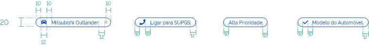
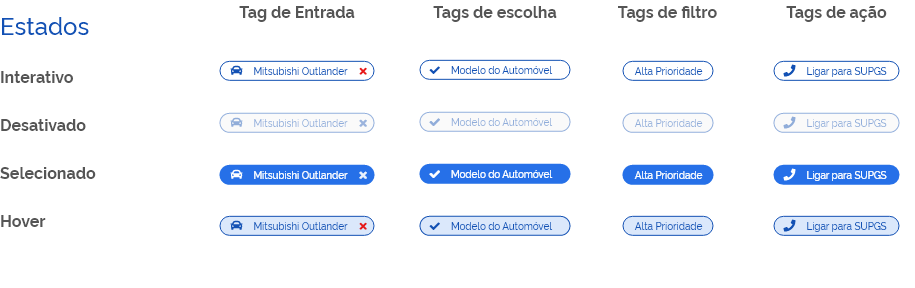

[version]: # '6.0.0'

## Princípios

Os Tags são compactos, relevantes e focados.

#### 1| Compactos

Tags são componentes compactos que representam informações discretas.

#### 2| Relevante

Os Tags devem ter um relacionamento claro e útil com o conteúdo ou tarefa que eles representam.

#### 3| Focado

Devem facilitar a conclusão das tarefas ou a classificação do conteúdo.

## Tipos

### Tags de entrada

Representam informações usadas em campos, como uma entidade ou atributos diferentes.

Os Tags de entrada representam uma informação complexa em formato compacto, como uma entidade (pessoa, local ou coisa) ou texto. Eles habilitam a entrada do usuário e verificam essa entrada convertendo texto em Tags.

### Tags de escolha

Nos conjuntos que contêm pelo menos duas opções, os Tags de escolha representam uma única seleção ou seja, permitem a seleção de um único Tag dentre um conjunto de opções.

Os Tags escolhidos definem claramente e exibem as opções em uma área compacta. Eles são uma boa alternativa para alternar botões, botões de opção e menus de seleção única.

### Tags de filtro

Os Tags de filtro representam filtros para uma coleção usando palavras descritivas para filtrar o conteúdo.

Os Tags de filtro delineiam e exibem claramente as opções em uma área compacta. Eles são uma boa alternativa para alternar botões ou caixas de seleção.

### Tags de ação

Acionam recursos relacionadas ao conteúdo principal.

Os Tags de ação oferecem ações relacionadas ao conteúdo principal. Eles devem aparecer dinamicamente e contextualmente em uma interface do usuário.

Podem ser usados como uma alternativa aos botões, que devem aparecer de forma persistente e consistente.

## Anatomia

### 1| Recipiente

Os recipientes contêm todos os elementos do Tag e seu tamanho é determinado por esses elementos.

### 2| Miniatura (opcional)

As miniaturas identificam entidades (como indivíduos) exibindo um avatar, logotipo ou ícone.

### 3| Texto

O texto do Tag pode ser um nome de entidade, descrição, palavra-chave, ação ou conversação.

### 4| Remova o ícone [opcional]

Os Tags de entrada podem incluir um ícone Remover.

## Especificação

## Estados

