[version]: # (2.1.0)

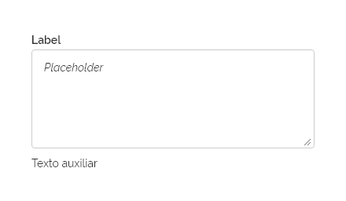
*Exemplo de Textarea*

Utilize o _Textarea_ quando:

- Houver a necessidade de inserir dados de forma textual através de um sistema ou aplicação;
- A informação textual requerida for relativamente longa, exigindo múltiplas linhas de texto.

---

## Anatomia

O _Textarea_ é constituído por:

1 - _Label_ (Opcional)
2 - Campo de Entrada de Texto (Obrigatório)
3 - Ícone de Redimensionamento (Obrigatório)
4 - _Placeholder_ (Opcional)
5 - Mensagem (Opcional)
6 - Texto Auxiliar (Opcional)

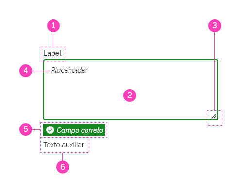
*Anatomia do Textarea*

### Detalhamento dos itens

Abaixo segue o detalhamento dos itens do _Componente Textarea_. Para maiores informações consulte também a documentação [Padrão de Formulário](/ds/padroes/formulario).

#### 1 - Label (Opcional)

Auxiliam o usuário, indicando que tipo de informação deverá ser digitada no _Campo de Texto_. O texto do _Label_ deverá ser curto e objetivo.

Além disso, o _Label_ também tem a função de indicar ao usuário se o **Campo de Texto é obrigatório ou não**. Veja detalhes sobre a indicação de **Campos Obrigatórios/Opcionais** no documento [Padrão de Formulário](/ds/padroes/formulario).

##### Posicionamento do Label

A - O _Label_ posiciona-se por padrão no topo do _Campo de Texto_.

B - Caso haja necessidade, há um posicionamento alternativo, à esquerda do _Campo de Texto_, alinhado ao topo. Observe abaixo:

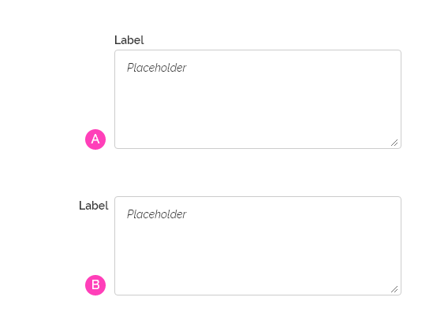
*Posições para o Label*

**Atenção:** ao optar por um tipo de posicionamento, recomenda-se que todos os campos na página sigam o mesmo posicionamento, seja no topo ou na lateral do _Campo_.

#### 2 - Campo de Entrada de Texto (Obrigatório)

Este é o elemento essencial e obrigatório do componente. Através dele o usuário poderá inserir múltiplas linhas de texto.

É recomendado que o campo _Textarea_ tenha um tamanho aproximado ao texto de entrada esperado, ou seja, recomenda-se prever este tamanho aproximado, dependendo da quantidade de caracteres esperada.  Observe o exemplo abaixo:

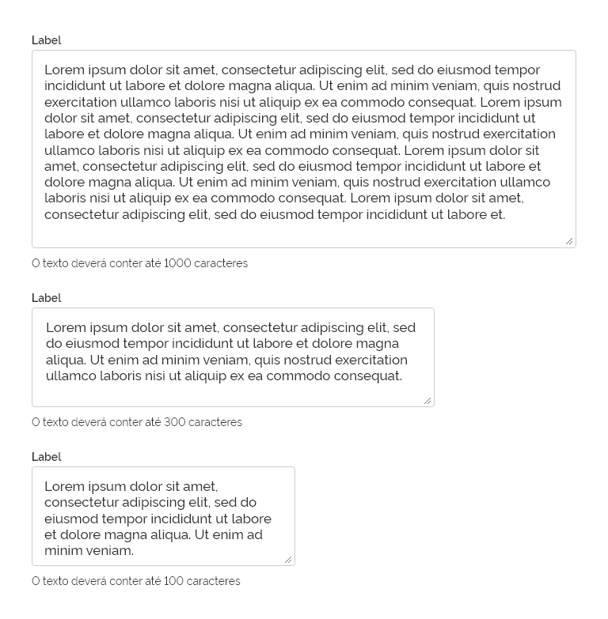
*Tamanho do Textarea*

#### 3 - Ícone de Redimensionamento (Obrigatório)

Este é um elemento padrão do próprio html, que tem como funcionalidade redimensionar o componente _Textarea_. É posicionado na parte inferior direita do _Textarea_ e o redimensionamento poderá ser feito tanto na horizontal quanto na vertical. Para mais detalhes consulte _Comportamento > Redimensionamento_.

*Exemplo de Ícone de Redimensionamento*

#### 4 - _Placeholder_ (Opcional)

O _placeholder_ tem a função de auxiliar o usuário em como preencher os dados solicitados. Obrigatoriamente deverá trazer uma informação mais completa que a contida no _Label/Label_. Ele desaparecerá logo ao iniciar a digitação no campo de entrada de texto. E retornar no caso de exclusão da informação.

Use o _Placeholder_ quando o usuário não estiver familiarizado com a entrada solicitada ou a formatação estiver em questão (por exemplo, AAAA-MM-DD).

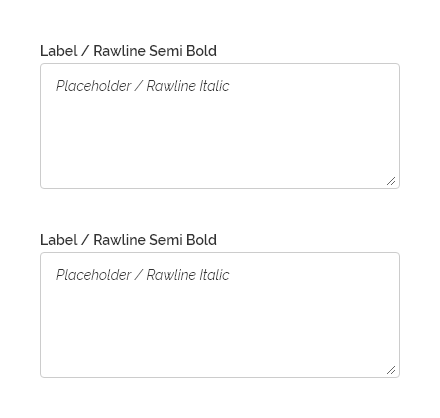
*Exemplo de Placeholder*

#### 5 - Mensagem (Opcional)

O Componente _Message_ é utilizado quando há necessidade de dar uma mensagem de _feedback_ ao usuário. A mensagem pode ter até quatro objetivos diferentes: _Erro_, _Sucesso_, _Alerta_ e _Informativo_. Observe os exemplos abaixo:

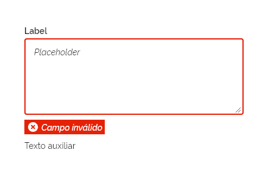
*Componente Mensagem Erro*

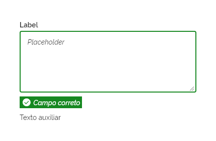
*Componente Mensagem Sucesso*

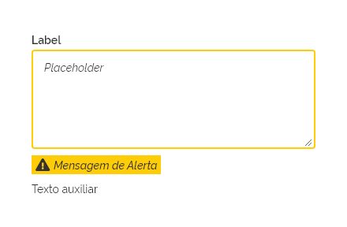
*Componente Mensagem Alerta*

*Componente Mensagem Informativa*

#### 6 - Texto Auxiliar (Opcional)

O _Texto Auxiliar_ é opcional e tem a função de ajudar o usuário no preenchimento do texto, acrescentando alguma informação mais detalhada. É bastante útil quando a informação no _Label_ e _Placeholder_ não são suficientes.

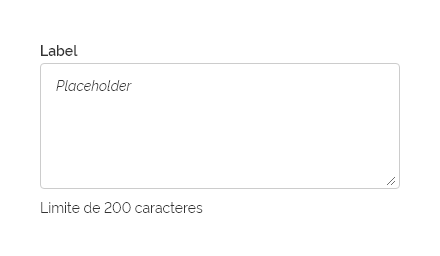
*Exemplo de Texto Auxiliar*

---

## Comportamento

### 1 - Responsividade

#### Grid de 12 e 8 Colunas

Na Grid de 12 e 8 colunas o _Textarea_ terá seu tamanho ajustado a um tamanho aproximado da entrada de texto esperada. Poderá variar conforme à necessidade.

Ao reduzir a resolução da tela o _Textarea_ poderá ter dois comportamentos esperados:

1 - Adequa-se a nova largura de tela, quebrando linha e ocupando toda horizontal

2 - Poderá ter sua própria largura comprimida.

Observe abaixo:

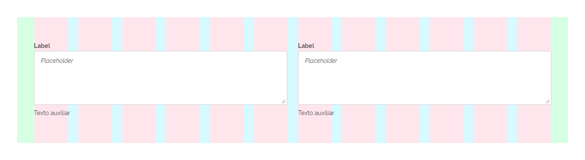
*Textarea - Grid de 12 colunas*

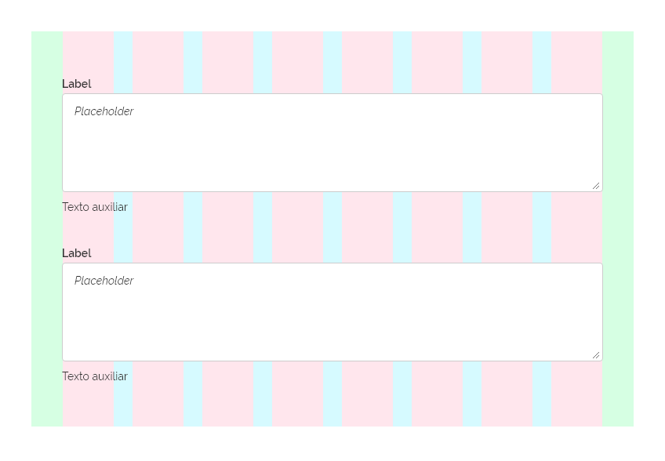
*Textarea - Grid de 8 colunas ocupando toda largura Horizontal*

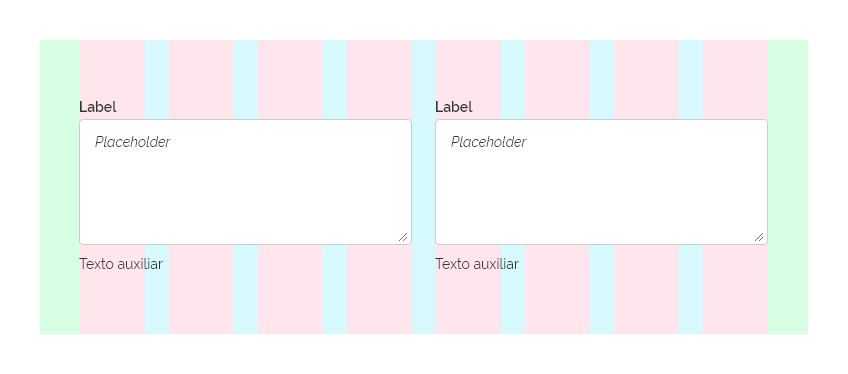
*Textarea - Grid de 8 colunas com largura comprimida*

#### Grid de 4 Colunas

Na Grid de 4 colunas, o _Textarea_ deverá se estender por toda largura da tela, proporcionando mais espaço para o usuário digitar o texto solicitado. Também deverá ser utilizada uma altura razoável para melhor visualização por parte do usuário.

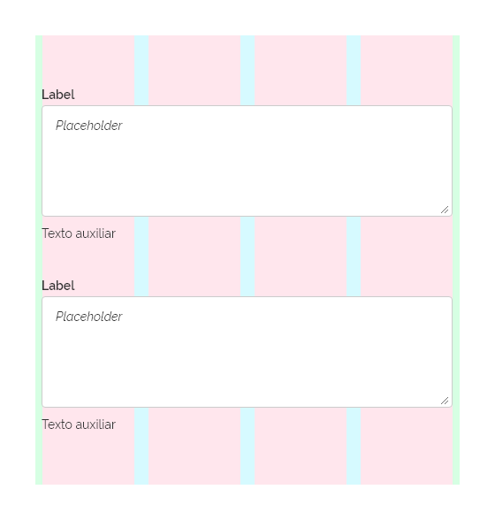
*Textarea - Grid de 4 colunas*

### 2 - Redimensionamento

Através do _Ícone de Redimensionamento_, o _Textarea_ poderá ser re-ajustado tanto na horizontal quanto na vertical ou em ambas as dimensões simultaneamente. Observe os exemplos abaixo:

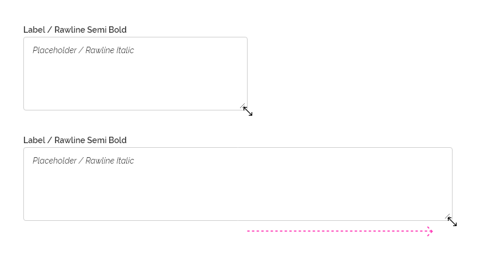
*Redimensionamento Horizontal*

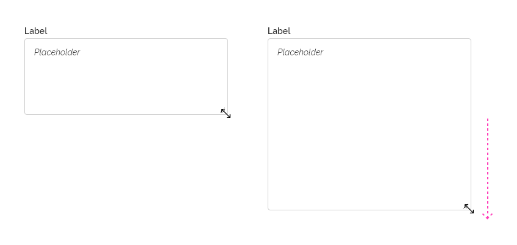
*Redimensionamento Vertical*

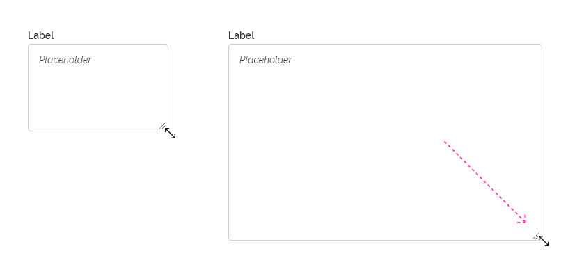
*Redimensionamento em ambas dimensões*

#### Tamanho Fixo Opcional

O redimensionamento do _Textarea_ é um comportamento opcional, este poderá ser configurado para permanecer com o tamanho fixo na tela. Neste caso, o _Ícone de Redimensionamento_ não será exibido.

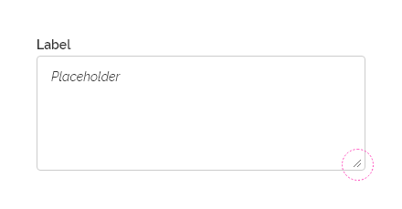
*Textarea com Tamanho Fixo*

#### Tamanho Fixo Obrigatório - Mobile

Em dispositivos móveis, _Grid de 4 Colunas_, o tamanho do _Textarea_ deve permanecer fixo, ocupando toda largura disponível, devido ao espaço reduzido para realizar o redimensionamento.

### 3 - Barra de Rolagem

Quando o número de caracteres ultrapassa a altura do _Textarea_, este deverá apresentar uma barra de rolagem. Observe abaixo:

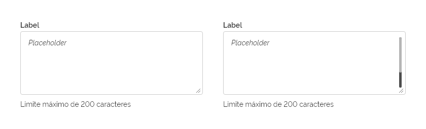
*Textarea com Barra de Rolagem*

**Atenção:** a _Barra de Rolagem_ será o elemento nativo renderizado pelo _Navegador_.

### 4 - Contagem de Caracteres (Opcional)

O _Componente Textarea_ possui o comportamento de contagem de caracteres. Este comportamento é opcional e funciona de duas formas. Observe abaixo:

#### 1 - Preenchimento com limite máximo

Compreende em definir uma quantidade máxima de caracteres e através do _Texto Auxiliar_ a quantidade restante de caracteres será atualizada dinamicamente enquanto o usuário digitar. Veja o exemplo abaixo:

1 - O usuário ainda não começou digitar no campo de texto. O _Texto Auxiliar_ informa ao usuário o limite máximo de caracteres permitidos.

2 - O usuário está digitando o texto. A informação de caracteres restantes é atualizada dinamicamente no _Texto Auxiliar_.

3 - O usuário atinge o limite máximo de caracteres permitido. O _Textarea_ bloqueia o acesso à digitação e o _Texto Auxiliar_ informa que não restam mais caracteres a serem preenchidos.

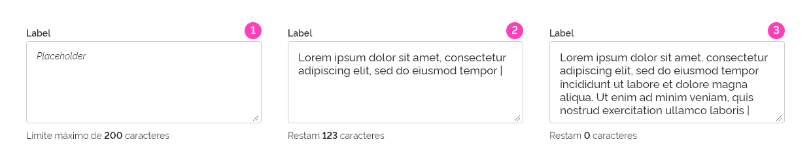
*Contagem de Caracteres com limite*

#### 2 - Preenchimento sem limite máximo de caractere

Nesta situação o contador de caracteres indica a quantidade que já foi digitada apenas como informação ao usuário. Neste tipo, não há limitação da quantidade de caracteres digitada. Observe abaixo:

1 - O usuário ainda não começou a digitar e o _Texto Auxiliar_ informa que não foi digitado qualquer caractere.

2 - O usuário está digitando e o _Texto Auxiliar_ vai sendo atualizado dinamicamente informando a quantidade de caracteres digitada.

3 - Enquanto o usuário continuar digitando a informação será atualizada no _Texto Auxiliar_. Neste caso não há limite máximo de caracteres.

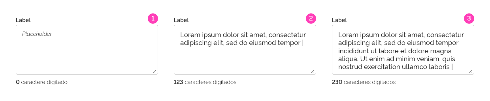
*Contagem de Caracteres sem limite*

### 5 - Densidade

O _Textarea_ poderá ser usado com densidades diferentes. A _Densidade_ tem a ver com o espaço interno oferecido no _Campo de Entrada de Texto_. Consulte os espaçamentos em _Design > Tokens_.

#### A - Densidade Baixa

É bastante útil quando for necessária uma área de 'respiro' maior ou quando for mais adequado ao projeto de _layout_.
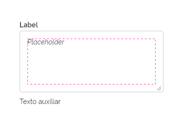

#### B - Densidade Média

É a densidade comum utilizada nos campos de entrada de texto. Geralmente utilizada, na maioria dos casos, em resoluções para _Tablet_ e _Desktop_.
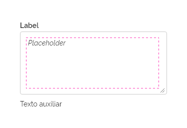

#### C - Densidade Alta

É a situação onde o espaçamento interno do campo é bastante reduzido.

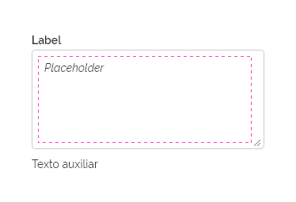
*Densidade do Textarea*

### 6 - Estados

O componente _Textarea_ é bem parecido com o componente _input_. Portanto, boa parte dos comportamentos são similares e podem ser "reaproveitados".

Para simplificação, utilize o comportamento Estados da mesma forma como é encontrado no [_Input_](/ds/components/input) (tanto na parte de uso em fundos claros e escuros como nas suas limitações descritas).

---

## Especificação

### Cores

| Name                     | Property   | Token/Value |
| ------------------------ | ---------- | ----------- |
| Label/Label              | color      | `--gray-80` |
| Label/Label Fundo Escuro | color      | `--pure-0`  |
| Placeholder              | color      | `--gray-80` |
| Texto Auxiliar           | color      | `--gray-80` |
| Campo de texto           | background | `--pure-0`  |
| Borda Campo de texto     | background | `--gray-40` |

### Tipografia

| Name           | Token Size               | Token Weight              |
| -------------- | ------------------------ | ------------------------- |
| Label/Label    | `--font-size-scale-base` | `--font-weight-semi-bold` |
| Placeholder    | `--font-size-scale-base` | `--font-weight-regular`   |
| Texto Auxiliar | `--font-size-scale-base` | `--font-weight-regular`   |

### Dimensões

| Name           |   Property    |      Token/Value       |
| -------------- | :-----------: | :--------------------: |
| Campo de texto |     Width     |       `variável`       |
| Campo de texto |    Height     |       `variável`       |
| Campo de texto | Border-Radius | `--surface-rounder-sm` |

### Espaçamentos

| Name                           | Property       |       Token/Value       |
| ------------------------------ | -------------- | :---------------------: |
| Label/Label Topo               | margin-bottom  | `--spacing-scale-half`  |
| Label/Label Lateral            | margin-right   | `--spacing-scale-base`  |
| Placeholder                    | margin-left    |  `--spacing-scale-2x`   |
| Placeholder                    | margin-top     | `--spacing-scale-base`  |
| Texto Auxiliar                 | margin-top     | `--spacing-scale-base`  |
| Campo de texto                 | margin-top     | `--spacing-scale-half`  |
| Campo de texto                 | margin-bottom  | `--spacing-scale-base`  |
| Campo de texto Densidade Baixa | padding-top    |  `--spacing-scale-2x`   |
| Campo de texto Densidade Baixa | padding-bottom |  `--spacing-scale-2x`   |
| Campo de texto Densidade Baixa | padding-left   |  `--spacing-scale-2x`   |
| Campo de texto Densidade Baixa | padding-right  |  `--spacing-scale-2x`   |
| Campo de texto Densidade Média | padding-top    | `--spacing-scale-baseh` |
| Campo de texto Densidade Média | padding-bottom | `--spacing-scale-baseh` |
| Campo de texto Densidade Média | padding-left   | `--spacing-scale-baseh` |
| Campo de texto Densidade Média | padding-right  |  `--spacing-scale-2x`   |
| Campo de texto Densidade Alta  | padding-top    | `--spacing-scale-base`  |
| Campo de texto Densidade Alta  | padding-bottom | `--spacing-scale-base`  |
| Campo de texto Densidade Alta  | padding-left   | `--spacing-scale-base`  |
| Campo de texto Densidade Alta  | padding-right  |  `--spacing-scale-2x`   |
