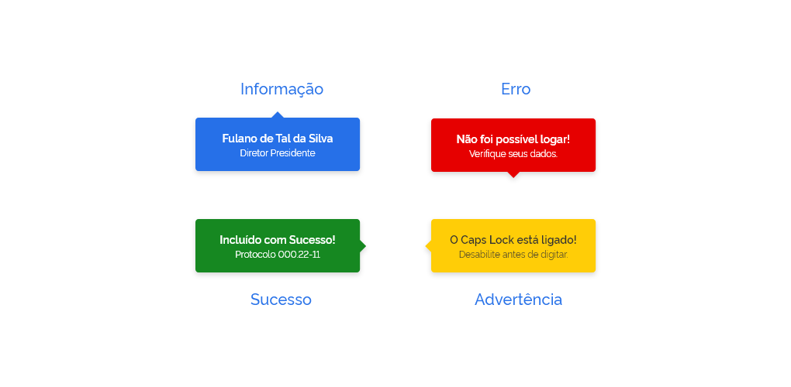
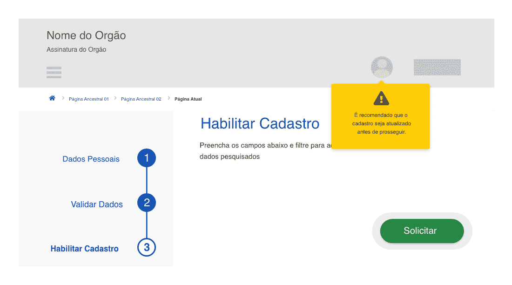
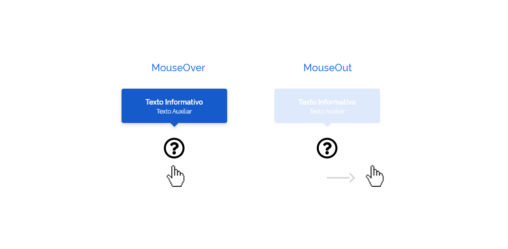
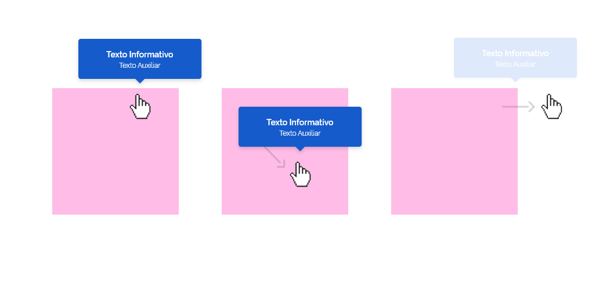
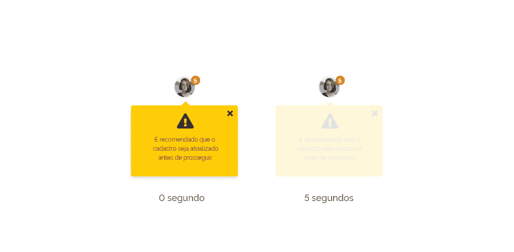
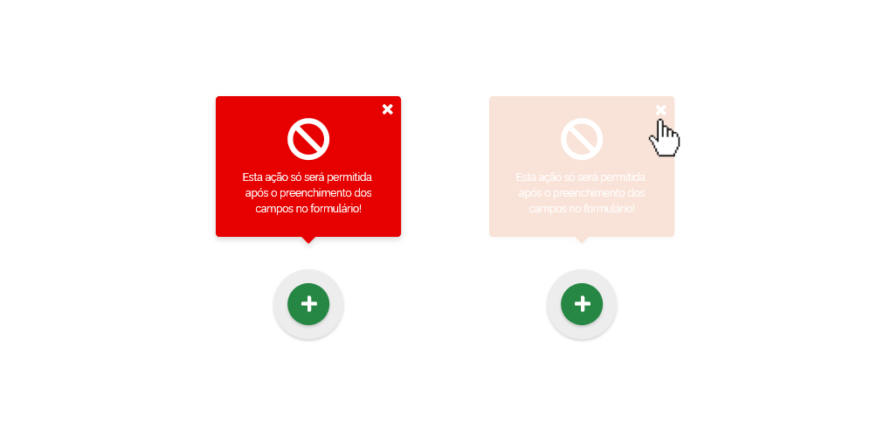
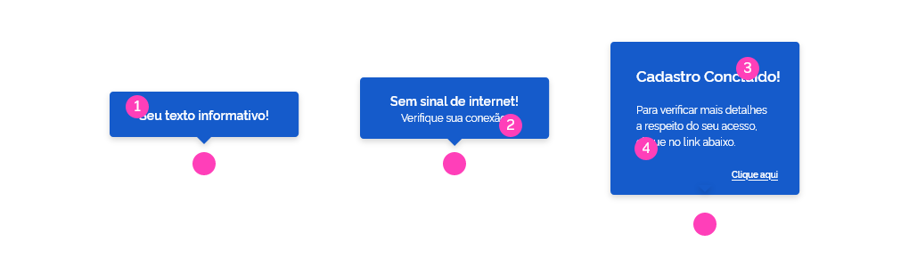
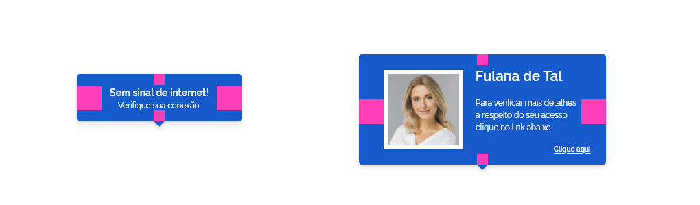
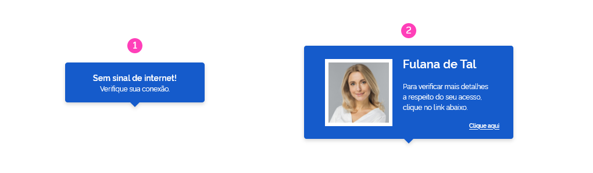

### Estrutura

O Tooltip é estruturado da seguinte forma:

#### 1 | Balão flutuante

O balão flutuante aparecerá sobre o elemento relacionado.

#### 2 | Texto informativo

O texto informativo deve ser claro, objetivo e contextual. O alinhamento de texto interno ao Tooltip **deve ser centralizado**.

#### 3 | Seta Direcional

A seta direcional do balão poderá aparecer em qualquer um dos lados, indicando a posição do elemento relacionado.

---

### Tipos de Tooltip

Este componente possui alguns tipos e variações que poderão ser utilizadas de acordo com uma necessidade específica.

#### Com Texto Simples

Esta forma é a mais comum, transmite uma informação curta e direta.

#### Com Texto Auxiliar

A versão com texto auxiliar permite um reforço na informação. Deve ser usada quando o contexto necessitar de uma comunicação mais detalhada.

#### Com Semântica nas Cores

Para os componentes Tooltip e PopOvers, é utilizada a seguinte semântica de cores:

- **Azul (#155BCB)** para informação, como padrão;
- **Verde (#168821)** para sucesso;
- **Vermelho (#E60000)** para erros;
- **Amarelo (#FFCD07)** para advertência.

#### Tipo PopOver

O componente PopOver permite um conteúdo mais elaborado, podendo utilizar recursos interativos, como botões, links; elementos gráficos, como imagens e ícones; e uma formatação de texto mais rica, com bold, italico e **alinhamento de texto variado**. Deve-se prezar pelas boas práticas e não exagerar na utilização deste componente por tela evitando a poluição visual. A diagramação do conteúdo interno ao PopOver deve seguir as mesmas regras gerais de diagramação de uma página, sendo observado sempre os princípios gerais de design.

---

### Comportamento

Os componentes **Tooltip** e **PopOver** surgirão na tela em decorrência de alguma **ação interativa, direta ou indireta**, do usuário ou **automaticamente pelo sistema**, como demonstrado nos exemplos abaixo:

### Ação Direta do Usuário

A ação direta é aquela que ocorre quando o usuário interage diretamente com o elemento sobre o qual aparecerá o Tooltip. Como por exemplo, nos eventos **MouseOver**, **Click** e **Focus**.

### Ação Indireta do Usuário

Na ação indireta, o usuário interage com algum elemento, porém o **Tooltip** aparecerá fazendo referência a outro elemento ou parte da tela. No exemplo abaixo, o usuário clicou num botão, com ação de incluir linhas na tabela. Como reflexo desta ação, o Tooltip indicou o surgimento da nova linha dentro da tabela.

### Automaticamente pelo Sistema

No exemplo abaixo, o usuário acabou de logar no sistema, e há uma necessidade de atualização das informações cadastrais. Logo, o sistema sinalizou automaticamente um **PopOver** para chamar a atenção do usuário à atualização do cadastro.

#### Permanência

A permanência é o tempo que o Tooltip ou PopOver se mantém visível na tela ao usuário. Existem quatro formas de permanência:

### Por Evento Mouse Over

Na permanência por evento Mouse Over, o Tooltip ou PopOver ficará visível durante o evento Mouse Over e desaparecerá quando o usuário retirar o mouse do elemento.

### Por Área

Na permanência por área, o Tooltip acompanha o movimento do mouse dentro de uma determinada área. O Tooltip aparecerá com o evento Mouse Over e só desaparecerá quando o usuário retirar o mouse da área determinada.

### Por Tempo

Na permanência por tempo, o **Tooltip** ou **PopOver** desaparecerá automaticamente após passado algum tempo. Este tipo de permanência geralmente ocorre quando o Tooltip ou PopOver aparece apenas para chamar atenção do usuário momentâneamente a algum elemento ou parte da tela. Após cumprir este papel, o Tooltip ou PopOver desaparecerá. É necessário ter cuidado com a duração deste tempo de permanência em decorrência do tamanho do texto a ser lido pelo usuário. Quanto maior o texto a ser lido, maior o tempo de permanência.

### Por Vontade do Usuário

Neste tipo de permanência, o Tooltip ou PopOver permanecerá visível até o usuário clicar no ícone **"Fechar"** ou **clicar fora** do Tooltip ou PopOver. É mais utilizado quando o texto a ser lido é grande ou quando existe algum recurso interativo, como links ou botões dentro do PopOver.

### Direção

A recomendação é que se utilize os Tooltips e PopOvers de forma a não conflitar com os limites da tela ou com o conteúdo ao qual se quer dar destaque. Por padrão, o Tooltipo ou PopOver aparecerá acima do elemento, como mostra o exemplo abaixo.

No exemplo abaixo, os balões flutuantes dos Tooltips aparecem no sentido oposto aos limites da tela de exibição, evitanto ficar ocultos ou criar barra de rolagem. Logo:

- o Tooltip **próximo ao topo da tela** aparecerá **abaixo do elemento**;
- o Tooltip **próximo à base da tela** aparecerá **acima do elemento**;
- o Tooltip **próximo à direita da tela**, aparecerá à **esquerda do elemento**;
- e o Tooltip **próximo à esquerda da tela**, aparecerá à **direita do elemento**.

---

## Anatomia

### Limites de Texto e Tipografia

Tendo em vista que a comunicação através de Tooltips e PopOvers deve ser curta e objetiva, **é necessário evitar textos longos**.

- Então para Tooltips simples, recomenda-se utilizar uma frase com uma linha de aproximadamente **cinco palavras**;
- Para Tooltips com texto auxiliar, recomenda-se utilizar uma frase com uma linha para o texto principal, com aproximadamente cinco palavras e uma frase auxiliar com uma linha de aproximadamente cinco palavras;
- Para PopOvers, recomenda-se utlizar no título até aproximadamente cinco palavras. E no texto auxiliar até cinco linhas.

**OBS:** Claro que os limites aqui estabelecidos são apenas uma recomendação e podem ser ultrapassados com moderação em decorrência de necessidades específicas. A ideia aqui explicitada é evitar a utilização de textos muito longos, descaracterizando o objetivo do componente.

#### Abaixo seguem as especificações da tipografia:

**1 |** Rawline, Semibold, 14px

**2 |** Rawline, Regular, 11,67px

**3 |** Rawline, Semibold, 16,8px

**4 |** Rawline, Regular, 11,67px

### Espaçamentos

Deve-se respeitar os espaçamentos internos ao Tooltip e PopOver nas especificações abaixo:

**Horizontal: 36px**
**Vertical: 16px**

### Largura Máxima

Deve-se respeitar as larguras máxima para Tooltip e PopOvers de acordo com as especificações abaixo:

#### 1 | Largura Máxima para Tooltip

240px

#### 2 | Largura Máxima para PopOver

360px

---

## Responsividade | Versão Mobile

Nos dispositivos móveis, o componente **Tooltip** perde o sentido em termos funcionais, visto que não existe o evento MouseOver nestes dispositivos. Portanto, não serão usados. Para os componentes **PopOver** que aparecem automaticamente, sem a ação interativa do usuário, estes podem vir no formato de mensagem do tipo **Toast**, recurso mais comum nesses dispositivos.

---

## Especificações

https://xd.adobe.com/view/1d1c688a-2f8c-4c67-6548-902cdcd3ecb7-6b2d/
