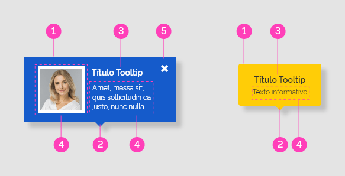
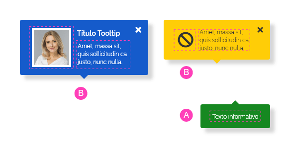
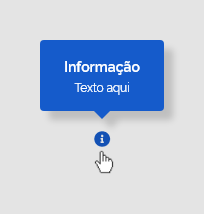
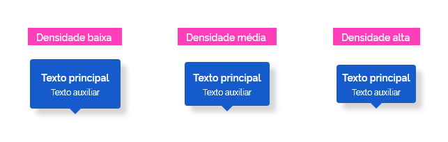

*Exemplo de tooltip*

Utilize *tooltip* quando:

-   houver necessidade de agregar detalhes de informação a elementos da interface ou qualquer informação visível na tela;

-   houver necessidade de exibição de informação que, em um primeiro momento, não necessita estar visível.

---

## Anatomia

O *tooltip* é composto pelos seguintes elementos:

| ID  | Nome            |                         Referência                          | Uso         |
| --- | --------------- | :---------------------------------------------------------: | ----------- |
| 1   | Balão Flutuante | [Fundamento Superfície](/ds/fundamentos-visuais/superficie) | Obrigatório |
| 2   | Seta Direcional |                             ---                             | Obrigatório |
| 3   | Título          | [Fundamento Tipografia](/ds/fundamentos-visuais/tipografia) | Opcional    |
| 4   | Conteúdo        |                             ---                             | Obrigatório |
| 5   | Botão Fechar    |                             ---                             | Opcional    |

*Anatomia do tooltip*

---

### Detalhamento dos Itens

#### 1. Balão Flutuante (Obrigatório)

O balão flutuante é o elemento essencial que contém todo conteúdo informativo do *tooltip* e possui as seguintes  características:

-   Posicionamento dinâmico;

-   Visibilidade dinâmica;

-   Flutua sobre todos os outros elementos da tela.

Este também pode ser apresentado com configurações de cores diferenciadas dependendo do contexto.

*Balões Flutuantes com cores diferenciadas*

**Atenção:** por ser um elemento flutuante e se encontrar na camada 4 de elevação, o *tooltip* deve sempre apresentar sombras.

Consulte o documento de [Fundamentos Visuais > Elevação](/ds/fundamentos-visuais/elevacao) para mais detalhes.

#### 2. Seta Direcional (Obrigatório)

A seta direcional é elemento obrigatório, e tem por finalidade indicar o elemento da interface ao qual o *tooltip* se refere.

A seta pode ocorrer em qualquer um dos lados do balão flutuante. Este comportamento é útil para melhor ajuste do *tooltip* em relação à interface.

*Setas direcionais nas quatro direções do tooltip*

**Atenção:** caso a seta seja utilizada no topo ou na base do balão flutuante, esta deverá permanecer centralizada horizontalmente com o balão flutuante. Caso a seta seja usada nas laterais do balão flutuante, esta deve permanecer centralizada verticalmente em relação ao balão flutuante.

#### 3. Título (Opcional)

O título do *tooltip* pode ser utilizado quando houver a necessidade de conferir mais ênfase à informação apresentada.

**Atenção:** nunca utilize o título com função de texto informativo. Confira a imagem abaixo:

*Não utilize tooltips contendo apenas títulos*

#### 4. Conteúdo (Obrigatório)

O conteúdo do *tooltip* deve sempre apresentar o texto informativo como padrão.

*Conteúdo do tooltip com texto informativo padrão*

Se for necessário apresentar conteúdos mais complexos, é possível utilizar recursos interativos como *buttons*, *hiperlinks* ou elementos gráficos, como imagens e ícones. É possível ainda a formatação de texto com recursos estilísticos como: *bold*, itálico, etc., assim como alinhamentos de texto variados. Nestes casos, utilize o tipo *popover*.

*Conteúdo do tooltip*

**Atenção:** tenha sempre a preocupação de conferir o contraste dos elementos do conteúdo do *popover*.

#### 5. Botão Fechar (Opcional)

Utilize o componente *button* circular com ênfase terciária de densidade alta apenas no tipo *popover* e posicione-o sempre no canto superior direito do balão flutuante.

*Botão fechar em um tooltip do tipo popover*

---

## Tipos

### 1. Padrão

*Tooltips* do tipo padrão são aqueles que surgem automaticamente na tela ao se passar o ponteiro do *mouse* sobre um elemento (*mouse over*). São contextuais e devem apresentar informações curtas e concisas.

*Tooltips do tipo padrão*

Geralmente são utilizados para explicar um ícone ou uma ação relacionada ao elemento relacionado ou trazer um *feedback* relacionada a uma ação previamente executada.

### 2. *Popover*

São *tooltips* que ficam visíveis na tela até serem fechados pelo usuário. Por isso apresenta sempre um botão para fechá-lo.

Podem ser acionados por meio de clique ou já serem apresentados automaticamente pelo sistema.

Podem trazem uma maior complexidade de informação e permitem maior estilização de seu conteúdo, inclusive com a possibilidade de inclusão de elementos interativos e de elementos gráficos.

*Tooltips do tipo popover*

Geralmente são utilizados como um complemento da navegação. Como podem ocorrer problemas de acessibilidade, utilize somente quando for indispensável e ofereça sempre alternativas de acesso para o mesmo conteúdo.

---

## Comportamentos

### 1. Responsividade

O comportamento responsivo do componente *tooltip* é invariável, com relação às suas dimensões, pois é sempre exibido de forma flutuante sobre a tela e com posicionamento dinâmico. Portanto, as dimensões da tela não afetam sua forma característica.

*Grid de 12 colunas*

*Grid de 8 colunas*

#### *Grids* de 4 Colunas

No *grid* de 4 colunas, o *tooltip* também não sofre alterações sobre sua aparência ou dimensões, porém existem restrições a respeito do seu acionamento. Por não haver evento *mouseover* em dispositivos móveis, o *tooltip* terá seu acionamento restrito apenas ao clique ou foco. Observe abaixo:

1. Acionamento por clique;

2. Acionamento por foco.

*Grid de 4 colunas - acionamento restrito ao clique, foco ou automático*

### 2. Direções do *Tooltip*

Por princípio, as setas direcionais devem estar apontadas para o elemento ao qual o *tooltip* se refere e o *tooltip* deve estar posicionado próximo a este elemento.

Por padrão, o *tooltip* será localizado no topo do elemento ao qual se refere. Observe abaixo:

*Posicionamento do tooltip padrão no topo do elemento*

No entanto, o posicionamento do *tooltip* pode variar conforme a necessidade do *layout*.

*Variados posicionamentos permitidos do tooltip*

A posição do *tooltip* em relação ao elemento varia conforme a posição e os limites da tela.

Acompanhe a seguir:

1. Caso o elemento esteja próximo ao topo da tela, o *tooltip* deve estar posicionado abaixo do elemento;

2. Caso o elemento esteja próximo à base da tela, o *tooltip* deve estar posicionado acima do elemento;

3. Caso o elemento esteja próximo à lateral esquerda da tela, o *tooltip* deve estar posicionado à direita do elemento;

4. Caso o elemento esteja próximo à lateral direita da tela, o *tooltip* deve estar posicionado à esquerda do elemento.

*Posicionamento e limites da tela*

### 3. Acionamento do *Tooltip*

O *tooltip* pode ser configurado para ser acionado por meio dos seguintes eventos:

1. *Mouseover*: quando o usuário passa o ponteiro do *mouse* sobre o elemento. Use somente no tipo padrão;

2. Clique: quando o usuário clicar no elemento. Use somente no tipo *popover*;

3. *Foco:* quando o estado foco for acionado no elemento. Use em todos os tipos.;

4. Automaticamente: quando for programado pelo sistema para ser mostrado em determinada situação, independentemente de ação do usuário. Use somente no tipo *popover*.

*Possibilidade de acionamento do tooltip*

### 4. Fechamento do *Tooltip*

O *tooltip* pode ser configurado para ser ocultado por meio dos seguintes eventos:

A - *Mouseout*: quando o usuário retirar o ponteiro do *mouse* de cima do elemento;

B - *Clique*: ao clicar no *button* fechar ou clicar em qualquer área da tela fora do *tooltip*;

C - *Por tempo determinado:* quando for programado para ser ocultado após um tempo predefinido pelo sistema.

*Fechamentos do tooltip*

### 5. Largura do *Tooltip* x Conteúdo Interno

A largura do *tooltip* cresce conforme aumenta o conteúdo. No entanto, esteja atento às boas práticas e procure utilizar um conteúdo textual curto e objetivo.

1. Largura mínima do *tooltip*: corresponde a um conteúdo de texto informativo de 12 caracteres;

2. Largura ajustável ao texto.

*Largura do tooltip*

A altura do *tooltip* também se ajusta proporcionalmente à quantidade de conteúdo.

*Neste exemplo, a altura do tooltip original (1) cresceu conforme recebeu mais conteúdo (2)*

### 6. Densidades

Pode-se encontrar o componente *tooltip* nas três densidades abaixo. Utilize a que melhor se adequar ao seu *layout*.

*Densidades previstas para utilização no tooltip*

### 7. Estados

O componente *tooltip* pode ser apresentado nos seguintes estados:

#### Estado Informativo

É o estado padrão do *tooltip*. É utilizado quando o objetivo da mensagem consiste em uma informação neutra.

*Estado Informativo aplicado em fundo claro e fundo escuro*

#### Estado Sucesso

Utilize o estado Sucesso quando o objetivo da mensagem for transmitir ideia de conclusão com êxito de uma tarefa ou etapa.

*Estado Sucesso aplicado em fundo claro e fundo escuro*

#### Estado Alerta

O estado Alerta deve ser utilizado quando o objetivo da mensagem for transmitir uma ideia de advertência ao usuário, geralmente com finalidade de prevenção de erros.

*Estado Alerta aplicado em fundo claro e fundo escuro*

#### Estado Erro

Utilize o estado Erro quando o objetivo da mensagem for transmitir a ocorrência de erro por parte do usuário ou do sistema.

*Estado Erro aplicado em fundo claro e fundo escuro*

**Atenção:** não confie apenas nas cores para transmitir uma mensagem. Utilize o título do *tooltip* para reforçar que se trata de um *tooltip* de erro, alerta ou sucesso.

---

## Melhores Práticas

-   Use *tooltips*  somente quando necessário pois o uso excessivo desse recurso pode ser irritante para a experiência do usuário.

-   *Tooltips* podem ser uma forma útil de introduzir os usuários a novas e importantes funcionalidades, mas quando o usuário aprender a usar essa funcionalidade, esse *tooltip* deve desaparecer.

-   *Tooltips* devem ser incisivos, informativos e orientados à ação. Se você precisa escrever um texto para explicar aos usuários o que eles precisam fazer, então um *tooltip* não é a melhor solução. Talvez seja melhor fornecer ao usuário um tutorial em vídeo ou até mesmo um guia interativo.

-   O texto do *tooltip* deve ser curto e ir direto ao ponto, deve ser informativo e não enrolado e deve ser orientado à ação, indicando ao usuário o que ele precisa e o que ele pode fazer. Ele também pode ser útil para explicar aos usuários como uma funcionalidade específica que eles estão observando os ajudará.

-   Use um *tooltip* por vez na tela. Por atrair o foco da atenção do usuário para um determinado elemento na tela, não é interessante apresentar mais de um *tooltip* ao mesmo tempo.

---

## Especificações

### Alinhamentos

| Name            | Property |         Spacing Token         |
| --------------- | -------- | :---------------------------: |
| Seta Direcional | Align    |  `--spacing-vertical-center`  |
| Seta Direcional | Align    | `--spacing-horizontal-center` |

### Espaçamentos

| Name                             | Property                     |       Token/Value       |
| -------------------------------- | ---------------------------- | :---------------------: |
| Balão Flutuante (dens. baixa)    | padding-top/bottom           |  `--spacing-scale-2x`   |
| Balão Flutuante (dens. baixa)    | padding-left/right           |  `--spacing-scale-2x`   |
| Balão Flutuante (dens. média)    | padding-top/bottom           | `--spacing-scale-baseh` |
| Balão Flutuante (dens. média)    | padding-left/right           | `--spacing-scale-baseh` |
| Balão Flutuante (dens. alta)     | padding-top/bottom           | `--spacing-scale-base`  |
| Balão Flutuante (dens. alta)     | padding-left/right           | `--spacing-scale-base`  |
| Título do Tooltip                | margin-bottom                | `--spacing-scale-half`  |
| Botão Fechar                     | margin-top                   | `--spacing-scale-half`  |
| Botão Fechar                     | margin-left/right            | `--spacing-scale-half`  |
| Tooltip (em relação ao elemento) | margin-left/right/top/bottom | `--spacing-scale-base`  |

### Dimensões

| Name                             | Property | Token/Value |
| -------------------------------- | -------- | :---------: |
| Balão Flutuante                  | Width    | `variável`  |
| Balão Flutuante                  | Height   | `variável`  |
| Balão Flutuante (largura mínima) | Width    |   `108px`   |
| Seta Direcional                  | Width    |   `16px`    |
| Seta Direcional                  | Height   |    `8px`    |

### Tipografia

| Name              | Property    | Token/Value                 |
| ----------------- | ----------- | --------------------------- |
| Título            | size        | ``--font-size-scale-base``  |
| Título            | font-weight | `--font-weight-semi-bold`   |
| Texto Informativo | size        | `--font-size-scale-down-01` |
| Texto Informativo | font-weight | `--font-weight-regular`     |

### Iconografia

| Name         | Ícone                 | Token Size       | Class (Font Awesome) |
| ------------ | --------------------- | ---------------- | -------------------- |
| Botão Fechar | <i class="times"></i> | `--icon-size-xs` | `times`              |

### Cores

#### Cores do Estado Informativo

| Name              | Property   | Color Token            |
| ----------------- | ---------- | ---------------------- |
| Balão Flutuante   | background | `--blue-warm-vivid-60` |
| Seta Direcional   | background | `--blue-warm-vivid-60` |
| Título            | color      | `--pure-0`             |
| Texto Informativo | color      | `--pure-0`             |
| Botão Fechar      | color      | `--pure-0`             |

#### Cores do Estado Sucesso

| Name              | Property   | Color Token             |
| ----------------- | ---------- | ----------------------- |
| Balão Flutuante   | background | `--green-cool-vivid-50` |
| Seta Direcional   | background | `--green-cool-vivid-50` |
| Título            | color      | `--pure-0`              |
| Texto Informativo | color      | `--pure-0`              |
| Botão Fechar      | color      | `--pure-0`              |

#### Cores do Estado Alerta

| Name              | Property   | Color Token         |
| ----------------- | ---------- | ------------------- |
| Balão Flutuante   | background | `--yellow-vivid-20` |
| Seta Direcional   | background | `--yellow-vivid-20` |
| Título            | color      | `--gray-80`         |
| Texto Informativo | color      | `--gray-80`         |
| Botão Fechar      | color      | `--gray-80`         |

#### Cores do Estado Erro

| Name              | Property   | Color Token      |
| ----------------- | ---------- | ---------------- |
| Balão Flutuante   | background | `--red-vivid-50` |
| Seta Direcional   | background | `--red-vivid-50` |
| Título            | color      | `--pure-0`       |
| Texto Informativo | color      | `--pure-0`       |
| Botão Fechar      | color      | `--pure-0`       |

### Sombra

| Name            |    Shadow Token     |
| --------------- | :-----------------: |
| Balão Flutuante |    `--shadow-xl`    |
| Balão Flutuante | `--shadow-xl-right` |
