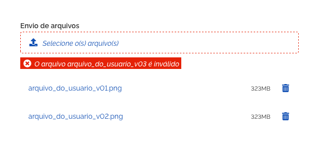
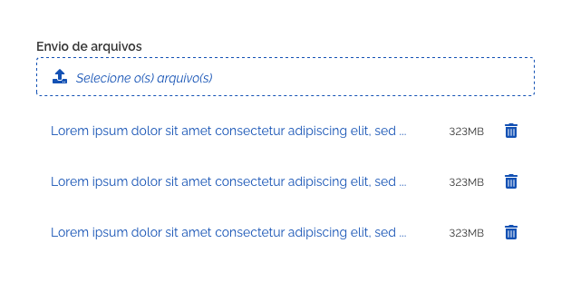
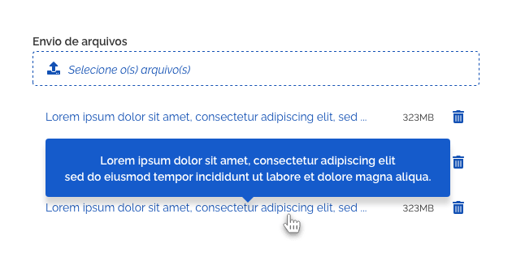
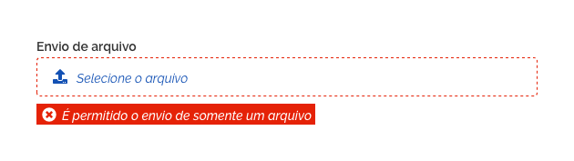
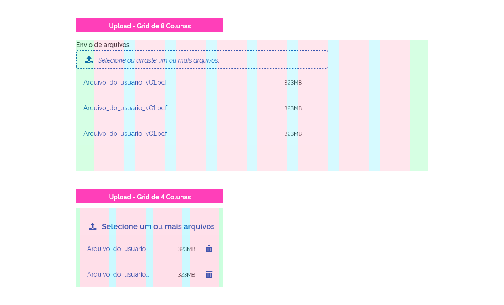
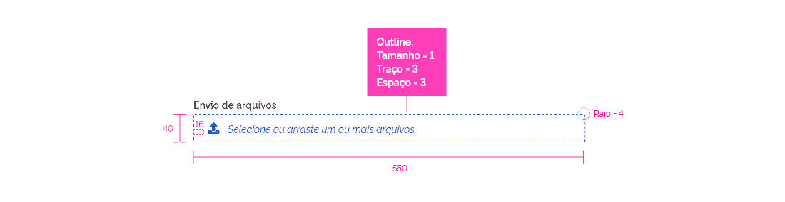

 *Exemplo do componente Upload.*

O componente *Upload* é geralmente usado dentro de formulários, mas pode eventualmente ser também utilizado como um componente isolado.

---

## Tom e voz

O texto do *placeholder* e o ícone ilustrativo (fa-upload) são únicos e não podem ser alterados. Já o texto do *label* deve ser claro, objetivo e informativo seguindo o seguinte padrão: "Envio de arquivos", "Envio de vídeos", "Envio de imagens", "Envio de documentos" e assim por diante. Se houver algum motivo especial que justifique a alteração desse padrão a equipe de design responsável pelo *Design System* deverá ser consultada.

---

## Anatomia

A seguir é ilustrada a relação de componentes utilizados na construção do componente *upload*.

| ID  | Nome                               |                          Referência                           | Uso         |
| --- | ---------------------------------- | :-----------------------------------------------------------: | ----------- |
| 1   | *Label* ou rótulo                  |  [Fundamento Tipografia](/ds/fundamentos-visuais/tipografia)  | Opcional    |
| 2   | Superfície (Área de Transferência) |  [Fundamento Superfície](/ds/fundamentos-visuais/superficie)  | Obrigatório |
| 3   | Ícone Subir Arquivo/*Upload*       | [Fundamento Iconografia](/ds/fundamentos-visuais/iconografia) | Opcional    |
| 4   | *Placeholder*                      |  [Fundamento Tipografia](/ds/fundamentos-visuais/tipografia)  | Opcional    |
| 5   | *Message*                          |   [Componente Message](/ds/components/message?tab=designer)   | Opcional    |
| 6   | *List*                             |      [Componente List](/ds/components/list?tab=designer)      | Opcional    |
| 7   | Texto auxiliar                     |  [Fundamento Tipografia](/ds/fundamentos-visuais/tipografia)  | Opcional    |
| 8   | *Loading*                          |   [Componente Loading](/ds/components/loading?tab=designer)   | Opcional    |

 *Anatomia do Upload.*

 *Anatomia do componente upload com componente Loading.*

---

## Comportamentos

### 1. Adição de Arquivos

O componente *upload* serve para o usuário enviar arquivos solicitados pelo sistema e isto pode ser realizado de duas maneiras distintas:

1. Clicando no componente para acessar a janela de arquivos do sistema operacional;

2. Arrastando os arquivos diretamente para a superfície (área de transferência) do componente.

Neste último caso, a cor da borda do componente muda para verde quando o usuário arrasta o *mouse* (*dragging*) com os arquivos selecionados corretamente para a área tracejada. Veja a figura a seguir:

 *Uso do estado Dropzone.*

Se o usuário soltar os arquivos na área correta (ou se ele clicar na área tracejada e selecionar os arquivos desejados) o processo de transferência se inicia e o ícone de *loading* é mostrado durante o tempo de transferência dos arquivos.

 *Três arquivos estão sendo transferidos e mostrado um Loading por arquivo.*

Após a conclusão da transferência, uma lista com os nomes dos arquivos e seus respectivos tamanhos é disponibilizada logo abaixo do componente *upload*.

*Lista de arquivos adicionados no upload.*

**Atenção:** a lista permite que o usuário possa excluir os arquivos que desejar antes que sejam submetidos para o servidor. O usuário pode ainda clicar no nome do arquivo para abri-lo no seu sistema operacional.

### 2. Selecionar ou Arrastar arquivos

O componente *upload* deve disponibilizar o recurso de arrastar arquivos. Esta funcionalidade deve ser informada ao usuário na mensagem abaixo do campo.

*Exemplo de uso do texto auxiliar.*

### 3. Mensagem de erro

Nos casos em que os arquivos não atendam aos requisitos desejados uma mensagem de erro é apresentada ao usuário.

*Uso do componente message no upload.*

Se o usuário mover ou selecionar vários arquivos e um deles não estiver de acordo com o requisito, uma mensagem de erro é apresentada para este arquivo. Os arquivos que estiverem válidos serão aceitos normalmente.

*Mensagem de erro para um arquivo específico.*

**Atenção:** qualquer tipo de erro como: formato inválido, tamanho excessivo, envio não concluído, etc, deverá ser tratado com *feedbacks* de mensagens do sistema (consultar diretrizes desse componente).

### 4. Truncamento de texto

Nos casos em que o nome do arquivo seja maior que o espaço destinado a ele, deve-se truncar a parte do nome que exceda o espaço definido.

Veja a imagem a seguir:

*Os nomes dos arquivos são truncados quando forem maiores que o espaço disponível.*

**Atenção:** é recomendável o uso de *tooltips* para apresentar ao usuário o texto completo que foi truncado.

*Use o componente tooltip para mostrar o nome completo do arquivo truncado.*

### 5. Envio de 1 arquivo

Se o *site*/sistema permitir o envio de apenas um único arquivo, o *label* do componente deverá ser alterado para *"Envio de arquivo"* e o *placeholder* para *"Selecione o arquivo"* (ou variações).

*Textos do label e placeholder alterados.*

Nesse caso, o usuário não conseguirá selecionar mais de um arquivo para ser enviado. Se arrastar mais de um arquivo, o componente não aceitará a ação e retornará uma mensagem ao usuário deixando claro que só será permitido realizar *upload* de um único arquivo.

*Exemplo de erro.*

**Atenção:** se o usuário já enviou um arquivo para a lista e tentar enviar outro, o arquivo mais recente substituirá o mais antigo. Uma mensagem de alerta do sistema deve manter o usuário informado sobre este comportamento.

*Neste exemplo o "arquivo_do_usuario_v01" foi substituído pelo "arquivo_do_usuario_v02" mais recente.*

### 6. Resolução de 4 colunas

Em resoluções maiores que 4 colunas o componente *Upload* não sofrerá qualquer transformação, mas ao se atingir a resolução de 4 colunas o componente *Upload* terá sua largura adequada para esta resolução de tela.

*Largura do componente upload sendo ajustada.*

*Comparação da aplicação do upload em diferentes Grids.*

Nestes tipos de dispositivos, não há o recurso de arrastar arquivos, portanto, a única forma do usuário enviar arquivos é por meio do clique no componente *upload* (ou toque, nos casos de dispositivos *mobile*).

---

## Especificações

### Tipografia

| Name          | Size Token               | Weight Token              | Text-transform | Outros Estilos       |
| ------------- | ------------------------ | ------------------------- | -------------- | -------------------- |
| *Label*       | `--font-size-scale-base` | `--font-weight-semi-bold` | uppercase      | -                    |
| *Placeholder* | `--font-size-scale-base` | `--font-weight-regular`   | uppercase      | `font-style:` italic |

### Iconografia

| Name          | ícone                            | Size Token       | Class (Font Awesome) |
| ------------- | -------------------------------- | ---------------- | -------------------- |
| Ícone Upload  | <i class="fas fa-upload"></i>    | `--icon-size-lg` | fa-upload            |
| Ícone Excluir | <i class="fas fa-trash-alt"></i> | `--icon-size-sm` | fa-trash-alt         |

### Cor

| Name                        | Property         | Color Token             |
| --------------------------- | ---------------- | ----------------------- |
| *Label*                     | text color       | `--gray-80`             |
| *Placeholder*               | text color       | `--blue-warm-vivid-70`  |
| Ícone Upload                | icon             | `--blue-warm-vivid-70`  |
| Ícone Excluir               | icon             | `--blue-warm-vivid-70`  |
| *container*                 | background-color | `--pure-0`              |
| *container* (borda)         | background-color | `--blue-warm-vivid-70`  |
| *container* (borda-sucesso) | background-color | `--green-cool-vivid-50` |

### Dimensões

| Name       | Property | Value |
| ---------- | -------- | ----- |
| Superfície | width    | 550px |

### Espaçamento

| Name           | Property                     | Value                  |
| -------------- | ---------------------------- | ---------------------- |
| Superfície     | padding-left / padding-right | `--spacing-scale-2x`   |
| Superfície     | padding-top / padding-bottom | `--spacing-scale-base` |
| Superfície     | margin-bottom                | `--spacing-scale-base` |
| Message        | margin-bottom                | `--spacing-scale-base` |
| Texto Auxiliar | margin-bottom                | `--spacing-scale-base` |
| Ícone Upload   | margin-right                 | `--spacing-scale-2x`   |
| *Placeholder*  | margin-left                  | `--spacing-scale-half` |
| *Loading*      | margin-top                   | `--spacing-scale-base` |

### Superfície

| Name       | Property | Value                        |
| ---------- | -------- | ---------------------------- |
| Superfície | border   | `--surface-border-dashed-sm` |

*Imagem de apoio para a especificação.*
