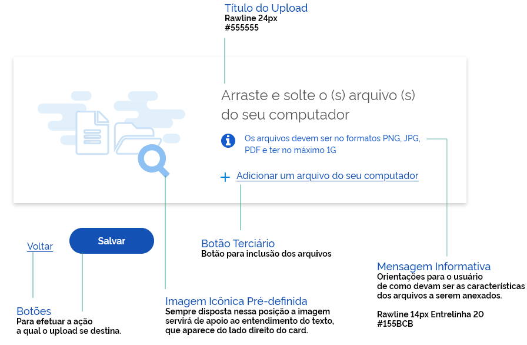

[version]: # '6.0.0'

## Cores

No Upload o card deve ser branco #FFFFFF e no estado “hover, deve seguir o padrão com o fundo na cor #DBE8FB.

## Orientações de Uso

### Upload com cards de 770 x 248px

Os cards tem altura sempre adaptada a quantidade de texto. A largura mínima deve ser 770px e Altura mínima 248px (antes dos arquivos serem selecionados).

O upload pode ou não vir acompanhado de um título.

### Upload com cards contidos dentro de colapse

O card do upload pode aparecer contido num elemento de colapse. o mesmo servirá de título para o upload.

### Comportamento do hover

Ao passar o mouse em cima do card, este mudará a cor de fundo para #DBE8FB. Isto ocorrerá apenas na versão web.

### 4 | Cards com Altura e LARGURA Variáveis

Os cards do upload podem aumentar a altura em função da quantidade dos arquivos incluídos e podem variar a largura
conforme disposição dos elementos do formulário.

#### Comportamento

Após inclusão dos arquivos aparecerá um ícone ‘X” para excluir o arquivo, caso o usuário tenha selecionado errado. O botão terciário para inclusão de arquivos permanecerá visível no card mesmo após a seleção de vários arquivos,

### 5 | Upload após seleção dos arquivos

Link para o arquivo XD
https://xd.adobe.com/view/450729fc-7335-4fbf-532b-c7000cf57dcc-3336/
