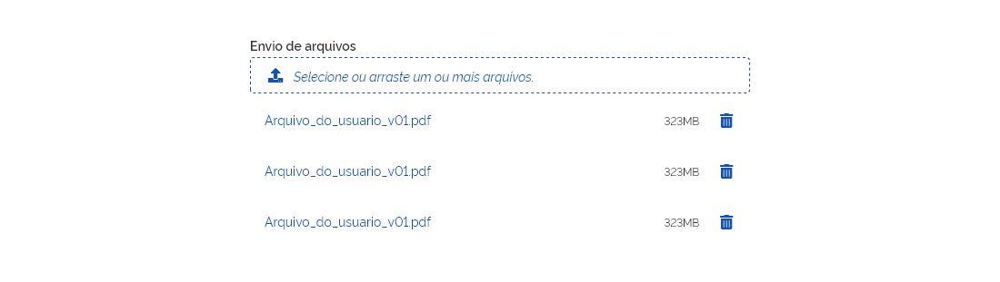

[version]: # '7.0.0'

---

## Uso

O _Upload_ é geralmente usado dentro de formulários mas pode eventualmente ser também utilizado como um componente isolado.

### Tom de voz

O texto do _placeholder_ e o ícone ilustrativo (fa-upload) são únicos e não podem ser alterados. Já o texto do _label_, deve ser claro, objetivo e informativo seguindo o seguinte padrão: "Envio de arquivos", "Envio de vídeos", "Envio de imagens", "Envio de documentos" e assim por diante. Se houver algum motivo especial que justifique a alteração desse padrão a equipe de design responsável pelo _Design System_ deverá ser consultada.

---

## Anatomia

A seguir é ilustrada a relação de componentes utilizados na construção do _Upload_:

1. _Label_ ou Rótulo (Consultar as diretrizes do componente _Input_);
2. _Conteiner_: Área de Transferência;
3. Ícone Subir Arquivo/Upload: fa-upload ;
4. _Placheholder_ (Consultar as diretrizes do componente _Input_);

Nos casos em que os arquivos não atendam aos requisitos desejados uma mensagem de erro é apresentada ao usuário. Se o usuáio mover ou selecionar vários arquivos e um deles não estiver de acordo com o desejado, os arquivos que estiverem ok serão aceitos e uma mensagem de erro é mostrada para o arquivo recusado.

5. Mensagem de erro (consultar as diretrizes do componente _Input_);

Ao mover os arquivos para a área de transferência, o estado (_dragging_) é ativado de forma que o usuário perceba que pode soltar o botão do mouse e iniciar a transferência dos arquivos. Neste caso, a cor do _conteiner_ se altera para verde para reforçar ainda mais que o componente está pronto para receber os arquivos arrastados.

6. _Conteiner_ com cor alterada para verde. Ícone, _placeholder_ e contorno ficam brancos.

Ao soltar os arquivos (ou selecioná-los por meio da janela de seu computador) o ícone _loading_ é mostrado para que o usuário entenda que os arquivos estão sendo enviados.

7. Ícone _loading_ (Consultar componente _Loading_);

Ao finalizar o envio, os arquivos são apresentados logo abaixo do componente _Upload_ por meio do componente Lista.

Em casos de resoluções muito pequenas, por exemplo 4 colunas, o componente _Upload_ deve ser usado como um botão terciário.

---

## Comportamento

O componente _Upload_ serve para o usuário enviar arquivos solicitados pelo sistema e isto pode ser realizado de duas maneiras distintas:

1. Clicando no componente para acessar a janela de arquivos do sistema operacional;

2. Arrastando os arquivos diretamente para o _conteiner_ área de transferência do componente.

Neste último caso, a cor do componente muda para verde quando o usuário arrasta o mouse (_dragging_) com os arquivos selecionados corretamente para a área tracejada. Veja a figura a seguir:

Se o usuário soltar os arquivos na área correta (ou se ele clicar na área tracejada e selecionar os arquivos desejados) o processo de transferência se inicia e o ícone de _Loading_ é mostrado durante o tempo de transferência dos arquivos. No exemplo abaixo, três arquivos estão sendo transferidos e por isso é mostrado um _Loading_ por arquivo.

Após a conclusão da transferência dos arquivos, uma lista com os nomes dos arquivos e seus respectivos tamanhos é disponibilizada logo abaixo do componente _Upload_.

**Atenção:** A lista permite que o usuário possa excluir os arquivos que desejar antes que sejam submetidos para o servidor. O usuário pode ainda clicar no nome do arquivo para editá-lo.

Os demais estados seguem os padrões definidos no documento de fundamentos.

### Envio de 1 arquivo

Se o site/sistema apenas permitir o envio de um único arquivo, o _label_ do componente deverá ser alterado para **"Envio de arquivo"** (ou variações) e o _placeholder_ para **"Selecione ou arraste um arquivo"**.

Nesses casos, o usuário não conseguirá selecionar mais de um arquivo para ser enviado. Se arrastar mais de um arquivo, o componente não aceitará a ação e retornará uma mensagem ao usuário deixando claro que só será permitido realizar _upload_ de um único arquivo.

**Atenção:** qualquer outro tipo de erro como: formato inválido, tamanho excessivo, envio não concluído, etc, deverá ser tratado com _feedbacks_ de mensagens do sistema (concultar diretrizes desse componente).

### Resolução de 4 colunas

Em resoluções maiores que 4 colunas o componente _Upload_ não sofre qualquer transformação mas ao se atingir a resolução de 4 colunas o componente _Upload_ sofre pequenos ajustes para se adequar melhor a esta resolução de tela.

O _conteiner_ de Área de Transferência deve ser substituído por um **botão terciário com ícone**. Nestes tipos de dispositivos, não há o recurso de arrastar arquivo, portanto, a única forma de o usuário enviar arquivos é por meio do clique no botão (ou toque, nos casos de dispositivos mobile). Repare que o texto do botão é alterado.

---

## Exemplo de Uso

A seguir é ilustrado meramente como exemplo como o componente _Upload_ pode ocorrer em telas de CRUD:

**a) Antes de anexar arquivos:**

**b) Após arquivos serem anexados:**

**c) Em versões com telas reduzidas (4 colunas):**

**Atenção:** Nesta resolução o botão terciário deve ocupar 100% da resolução da tela.

---

## Design Tokens

### Tipografia

| Name          | Size Token               | Weight Token              | Text-transform | Outros Estilos       |
| ------------- | ------------------------ | ------------------------- | -------------- | -------------------- |
| _Label_       | `--font-size-scale-base` | `--font-weight-semi-bold` | uppercase      | -                    |
| _Placeholder_ | `--font-size-scale-base` | `--font-weight-regular`   | uppercase      | `font-style:` italic |

### Iconografia

| Name            | ícone                         | Size Token     | Class (Font Awesome) |
| --------------- | ----------------------------- | -------------- | -------------------- |
| Ícone fa-upload | <i class="fas fa-upload"></i> | --icon-size-lg | fa-upload            |

### Botão Terciário

| Name    | ícone                            | Size Token     | Class (Font Awesome) |
| ------- | -------------------------------- | -------------- | -------------------- |
| Excluir | <i class="fas fa-trash-alt"></i> | --icon-size-sm | fa-trash-alt         |

### Cor

| Name                    | Property   | Color Token               |
| ----------------------- | ---------- | ------------------------- |
| _Label_                 | text color | `--color-secondary-08`    |
| _Placeholder_           | text color | `--color-primary-default` |
| Ícone fa-upload         | icon       | `--color-primary-default` |
| Botão terciário Excluir | icon       | `--color-primary-default` |
| _Conteiner_             | conteiner  | `--color-secondary-01`    |
| _Conteiner_ (borda)     | conteiner  | `--color-primary-default` |

### Estado

| Property            | Status    | Color Token            |
| ------------------- | --------- | ---------------------- |
| Ícone fa-upload     | drop zone | `--color-secondary-01` |
| _Placeholder_       | drop zone | `--color-secondary-01` |
| _Conteiner_ sucesso | drop zone | `--color-support-01`   |
| _Conteiner_ (Borda) | drop zone | `--color-secondary-01` |

### Dimensões

| Name                            | Property | Value |
| ------------------------------- | -------- | ----- |
| Conteiner Área de Transferência | height   | 40px  |
| Conteiner Área de Transferência | width    | 550px |

### Espaçamento

| Name            | Property       | Value |
| --------------- | -------------- | ----- |
| Ícone fa-upload | padding-left   | 16px  |
| _Placeholder_   | padding-left   | 4px   |
| Ícone _Loading_ | padding-top    | 18px  |
| Ícone _Loading_ | padding-bottom | 18px  |

Imagem de apoio:

