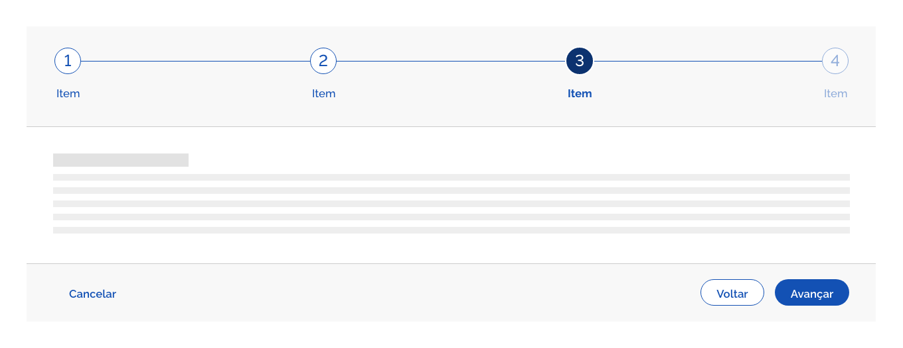
*Exemplo do componente wizard.*

Use *wizards* como um padrão para entrada de informações que devam seguir uma ordem específica. Os assistentes funcionam bem para processos executados apenas ocasionalmente.

---

## Anatomia

O *Componente Wizard* é constituído pelos seguintes elementos.

| ID  | Nome               |                     Referência                      | Uso         |
| --- | ------------------ | :-------------------------------------------------: | ----------- |
| 1   | Painel de etapas   |                         ---                         | Obrigatório |
| 2   | Componente Step    | [Componente Step](/ds/components/step?tab=designer) | Obrigatório |
| 3   | Área de Conteúdo   |                         ---                         | Obrigatório |
| 4   | Barra de Navegação |                         ---                         | Obrigatório |

*Elementos do componente Wizard.*

---

## Detalhamento dos Itens

### 1. Painel de Etapas (Obrigatório)

Nesta área são exibidas as etapas do *wizard*. O painel de etapas se estende por toda largura da tela e as etapas devem seguir as orientações e recomendações de boas práticas do Componente *Step*.

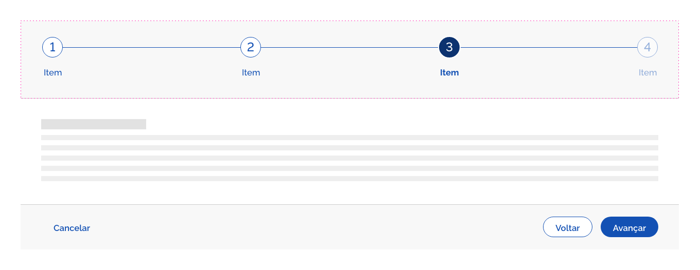
*Painel de Etapas*

Consulte detalhes em [Componente Step](/ds/components/step?tab=designer).

### 2. Componente *Steps* (Obrigatório)

*Steps* são indicadores de etapas e progresso que auxiliam os usuários durante um fluxo de trabalho, seguindo uma sequência lógica linear, aleatória, numeradas ou não. Consulte detalhes sobre comportamentos e boas práticas dos *Steps* em [Componente Step](/ds/components/step?tab=designer).

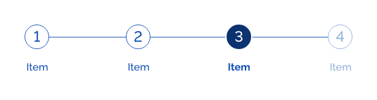
*Exemplo de Componente Step*

### 3. Área de Conteúdo (Obrigatório)

Esta área reserva o espaço para o conteúdo do *Wizard*. Geralmente são encontrados elementos de formulário, interativos ou informacionais que auxiliarão o usuário realizar sua jornada de tarefas.

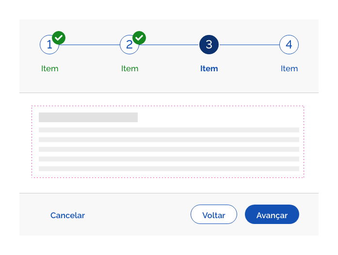
*Exemplo de Conteúdo - Texto*

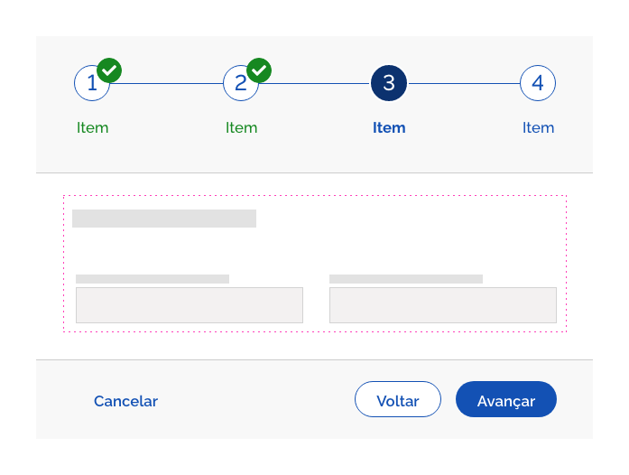
*Exemplo de Conteúdo - Formulário*

### 4. Barra de Navegação (Obrigatório)

Na barra de navegação estão disponíveis os botões de *Cancelar*, *Avançar* e *Voltar*. Assim o usuário tem o total controle da navegação no *Wizard*.

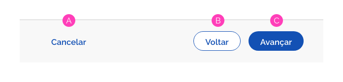
*Barra de Navegação*

#### A. Botão Cancelar

O *Botão Cancelar* deve ser sempre do tipo *terciário*. É utilizado para o usuário cancelar o processo assistente e retornar para a tela imediatamente anterior ao do *Wizard*. É uma boa prática fornecer um aviso que os dados inseridos até aquele ponto serão perdidos clicando no *Botão Cancelar*.

#### B. Botão Voltar

O *Botão Voltar* deve ser sempre do tipo *secundário* e serve para o usuário retroceder um passo na sequência de etapas. Na primeira etapa, o *Botão Voltar* não será exibido.

*A -* Primeira Etapa: O *Botão Voltar* não será exibido.
*B -* Etapas Subsequentes: *Botão Voltar* é exibido no *Estado Interativo*.

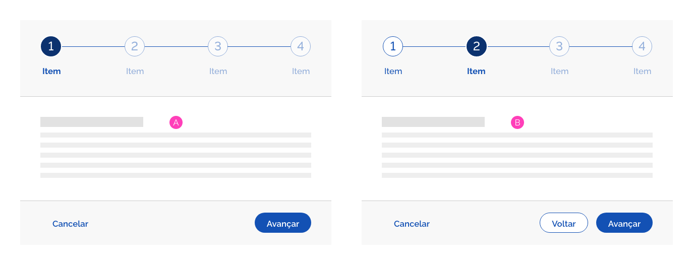
*Na primeira etapa o Botão Voltar não será exibido*

#### C. Botão Avançar

O *Botão Avançar* deve ser sempre do tipo *primário* e serve para o usuário avançar um nível na sequência de etapas. Uma vez atingida a última etapa, o botão apresentado deve ser o de *Concluir* para sinalizar o fim das etapas.

*A -* Etapas iniciais e intermediárias: *Botão Avançar*;
*B -* Na última etapa, o rótulo do botão *Avançar* deve ser alterado para *Concluir*.

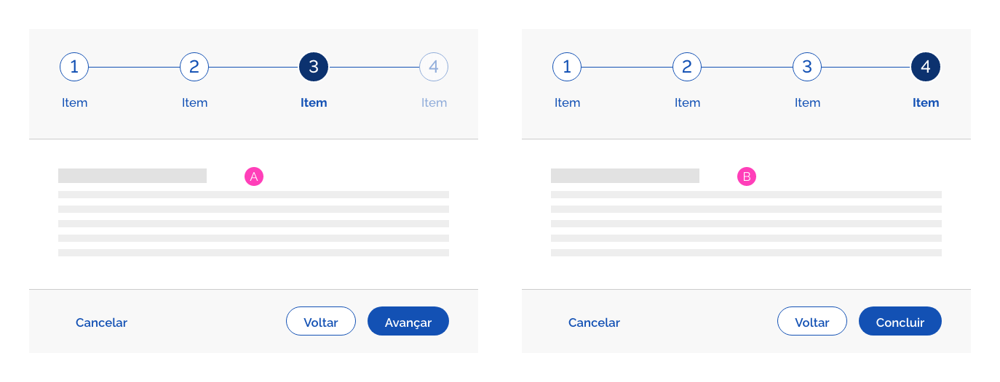
*Na última etapa, o rótulo do botão Avançar deve ser alterado para Concluir*

#### Barra de Navegação Mobile (Grid de 4 Colunas)

Na versão mobile da Barra de Navegação o Botão Cancelar será substituído por um link e os botões Avançar e Voltar serão substituídos por botões do tipo circular. Além disso, a Barra de Navegação mobile deverá ter um posicionamento fixo na base da área visível da tela.

A - Link Cancelar;
B - Botão Voltar (Circular com Ênfase Secundária);
C - Botão Avançar (Circular com Ênfase Primária);
D - Botão Concluir (Circular com Ênfase Primária).

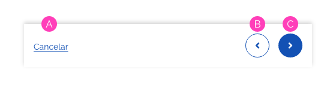
*Barra de Navegação Mobile*

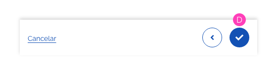
*Barra de Navegação Mobile com Botão Concluir*

---

## Tipos

O *Wizard* possui dois tipos, o horizontal e o vertical. Não existe uma obrigatoriedade ou restrição para o uso de cada tipo. Estes poderão ser utilizados de acordo com a preferência estética ou funcional, seguindo a necessidade de cada projeto.

### 1. Tipo Horizontal (Padrão)

O *Tipo Horizontal* é comumente o mais utilizado e por isso é considerado o padrão.

*Tipo Horizontal*

### 2. Tipo Vertical

O *Tipo Vertical*, geralmente menos utilizado, pode ser mais adequado em alguns contextos específicos, se adequando a composição estética ou diagramação do sistema.

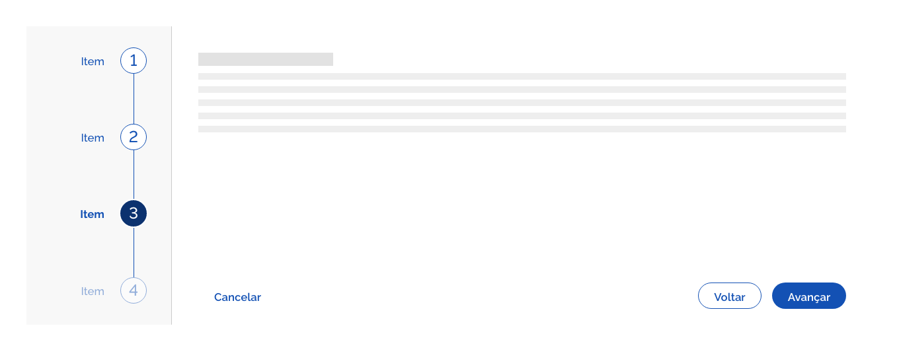
*Tipo Vertical*

---

## Comportamentos

### 1. Responsividade

#### Grid de 12 e 8 Colunas

Nas *Grids* de 12 e 8 colunas o Componente *Wizard* adequa-se ocupando todo o espaçamento horizontal permitido pela *Grid*. Observe abaixo:

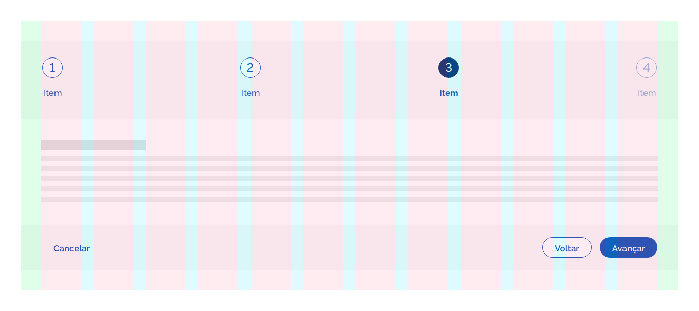
*Wizard Horizontal - Grid de 12 Colunas*

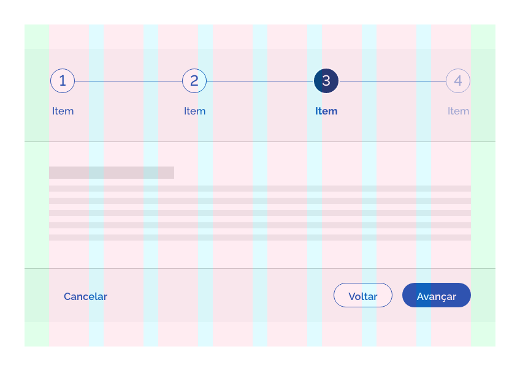
*Wizard Horizontal - Grid de 8 Colunas*

*Wizard Vertical - Grid de 12 Colunas*

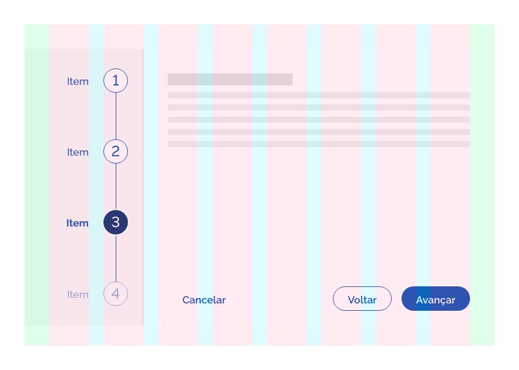
*Wizard Vertical - Grid de 8 Colunas*

**Atenção:** é importante lembrar que os espaçamentos entre as etapas permanecem equidistantes.

#### Grid de 4 Colunas

Na *Grid* de 4 colunas o *Componente Wizard* tem o seu formato modificado a fim de reduzir os espaços internos na *Barra de Etapas* e proporcionar maior espaço na *Área de Conteúdo*. A *Barra de Navegação* é exibida abaixo da *Área de Conteúdo*, apenas mudando sua cor de fundo e permanecendo com a mesma cor da *Área de Conteúdo*. Veja a seguir:

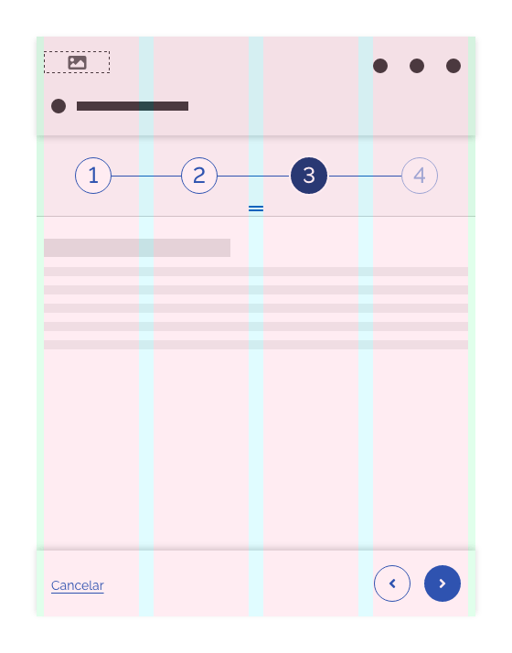
*Wizard Horizontal - Grid de 4 Colunas*

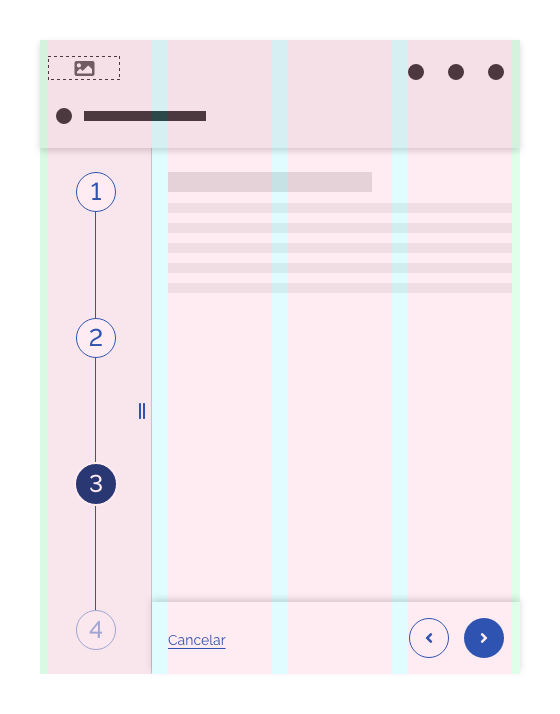
*Wizard Vertical - Grid de 4 Colunas*

**Atenção:** Neste formato, tanto no *Tipo Horizontal* como no *Tipo Vertical*, o *Componente Wizard* se apresenta ocultando os *Rótulos*. Este exibirá inicialmente apenas os *Botões das Etapas*. Porém o usuário poderá expandir a *Barra de Etapas* e visualizar os *Rótulos*.

### 2. Slide

Este comportamento tem o objetivo de oferecer ao usuário a opção de exibir e ocultar os *Rótulos* do *Componente Wizard* no formato para *Grid de 4 Colunas*.

#### Slide Tipo Horizontal

No *Tipo Horizontal*, o usuário poderá realizar o *Touch* no ícone `grip-lines`, na parte inferior central do *Painel de Etapas* e deslizar o dedo para baixo, exibindo os *Rótulos* das *Etapas*. Poderá também realizar o movimento contrário para ocultá-los.

*A* - O usuário pode clicar no ícone `grip-lines`
*B* - e deslizar o Painel de Etapas para baixo.

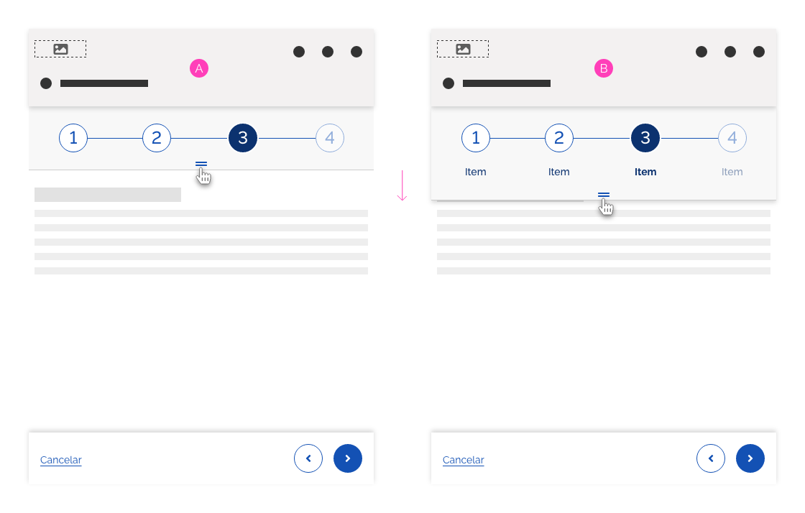
*Slide - Wizard Horizontal*

**Atenção:** O *Painel de Etapas* deslizará sobre a *Área de Conteúdo* exibindo uma sombra de elevação abaixo do painel.

#### Slide Tipo Vertical

No *Tipo Vertical*, o *Painel de Etapas* se posiciona na parte lateral esquerda da tela. Da mesma forma, o usuário realizará o *Touch* no ícone `grip-lines-vertical`, localizado centralizado verticalmente à direita do *Painel de Etapas*. O usuário deslizará o dedo horizontalmente para direita exibindo os *Rótulos* das *Etapas*. Poderá também realizar o movimento contrário para ocultá-los.

*A* - O usuário pode clicar no ícone `grip-lines-vertical`
*B* - e deslizar o Painel de Etapas para o lado.

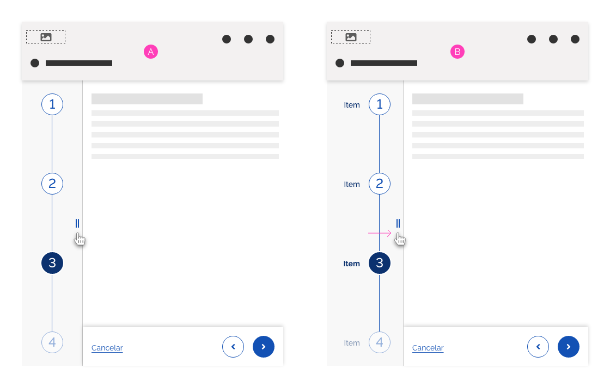
*Slide - Wizard Vertical*

**Atenção:** Ao expandir o Painel de Etapas, este "empurrará" a Área de Conteúdo e a largura desta será ajustada dinamicamente, assim como a largura da Barra de Navegação.

### 3. Densidade

O comportamento de densidade no componente *Wizard* refere-se aos espaçamentos internos do Painel de Etapas,Área de Conteúdo e Barra de Navegação. Além destes, também recomenda-se utilizar as densidades dos componentes *Button* e *Steps* seguindo a mesma densidade do *Wizard*. Consulte os espaçamentos de densidades dos componentes *Button* e *Steps* nas documentações específicas de cada um deles.

#### Baixa Densidade

Utilize *Baixa Densidade* quando o projeto de *layout* permitir mais espaço ou quando quando houver necessidade de dar mais destaque ao *Componente Wizard*.

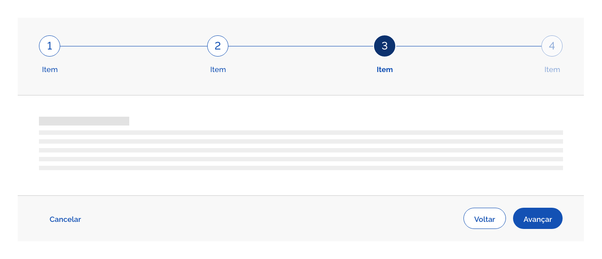
*Wizard Horizontal - Baixa Densidade*

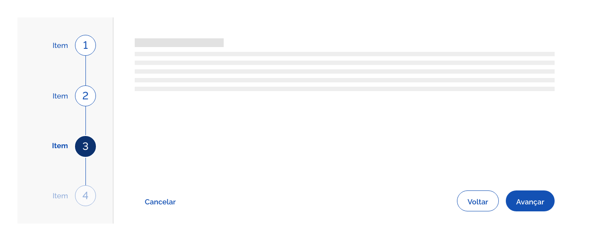
*Wizard Vertical - Baixa Densidade*

#### Densidade Padrão

É a forma comum do *Componente Wizard*. Oferece um espaçamento interno adequado e equilibrado para vários tipos de projetos.

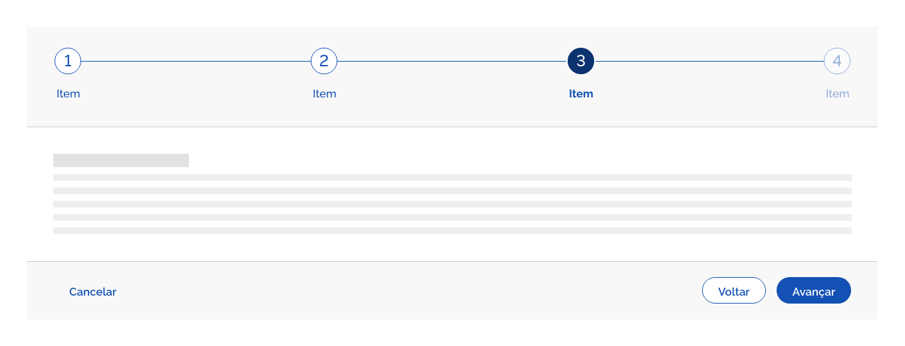
*Wizard Horizontal - Densidade Padrão*

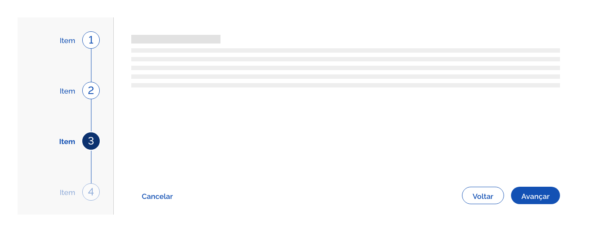
*Wizard Vertical - Densidade Padrão*

#### Alta Densidade

Utilize *Alta Densidade* quando for necessário usar o *Componente Wizard* em espaços mais restritos ou otimizar o conteúdo em tela.

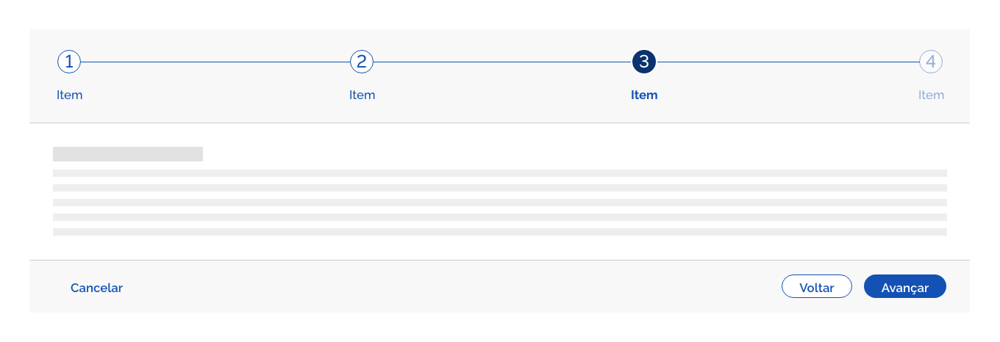
*Wizard Horizontal - Alta Densidade*

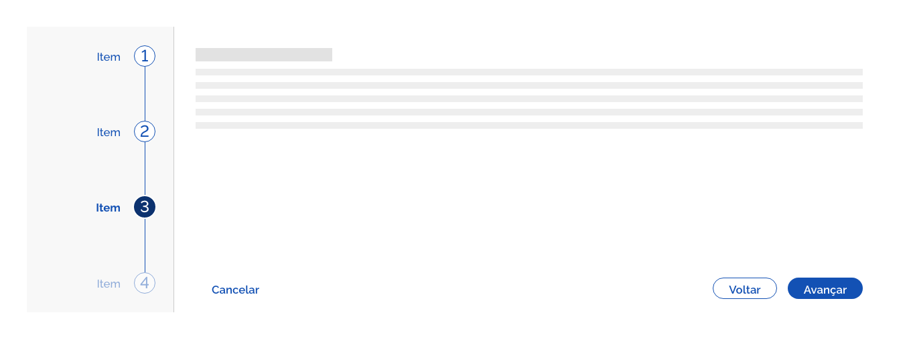
*Wizard Vertical - Alta Densidade*

Consulte especificações de *Densidade* em *Design Tokens*.

### 4. Scroll

O componente *Wizard* pode ser utilizado com duas formas de rolagem do conteúdo.

#### Rolagem Nativa do Navegador

Neste formato o conteúdo cresce naturalmente e o usuário poderá utilizar a barra de rolagem do navegador para acessar o conteúdo. Veja os exemplos na orientação vertical e horizontal.

A - Barra de Rolagem nativa do navegador.

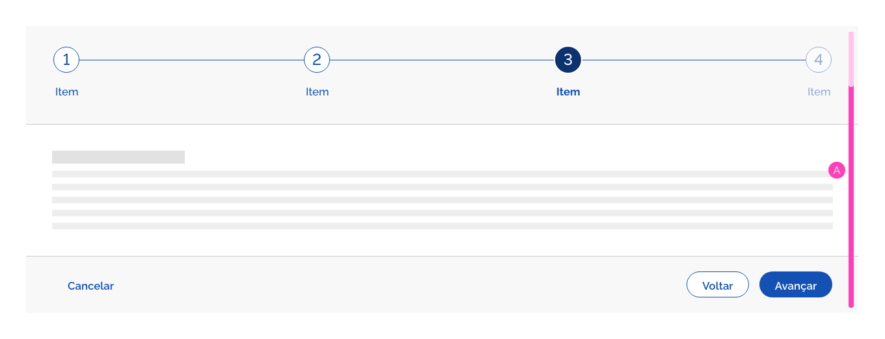
*Wizard Horizontal - Rolagem Natural do Navegador*

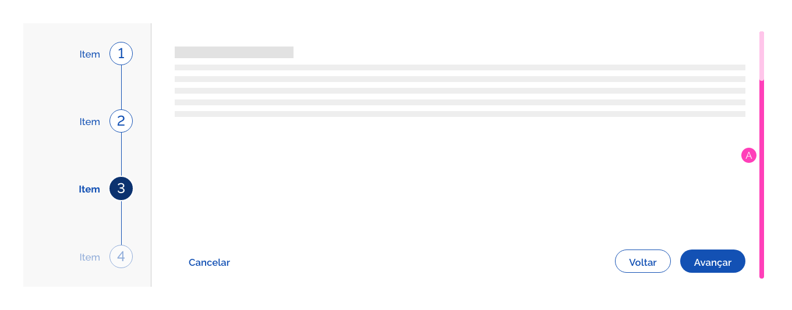
*Wizard Vertical - Rolagem Natural do Navegador*

#### Rolagem Interna na Área de Conteúdo

Neste modelo, a Área de Conteúdo possui uma altura fixa e a rolagem ocorre dentro dela com uma barra de rolagem customizada. O Painel de Etapas e a Barra de Navegação permanecem com posicionamento fixo na tela.

A - Barra de Rolagem customizada na Área de Conteúdo;
B - Painel de Etapas com posicionamento fixo;
C - Barra de Navegação com posicionamento fixo;

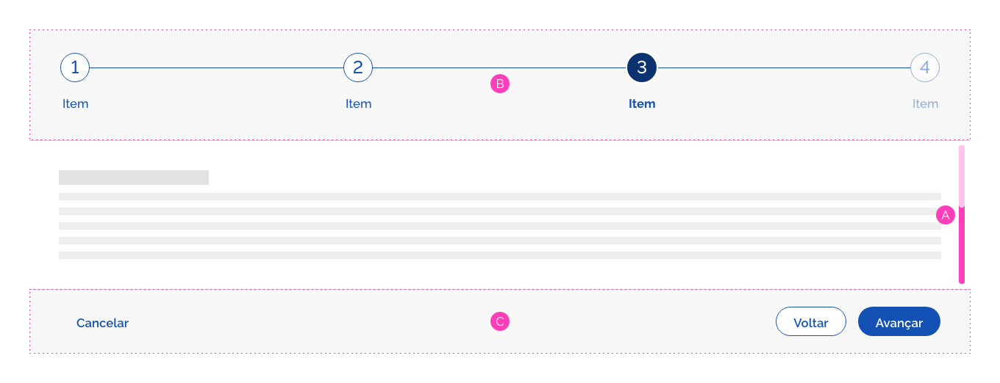
*Wizard Horizontal - Rolagem na Área de Conteúdo*

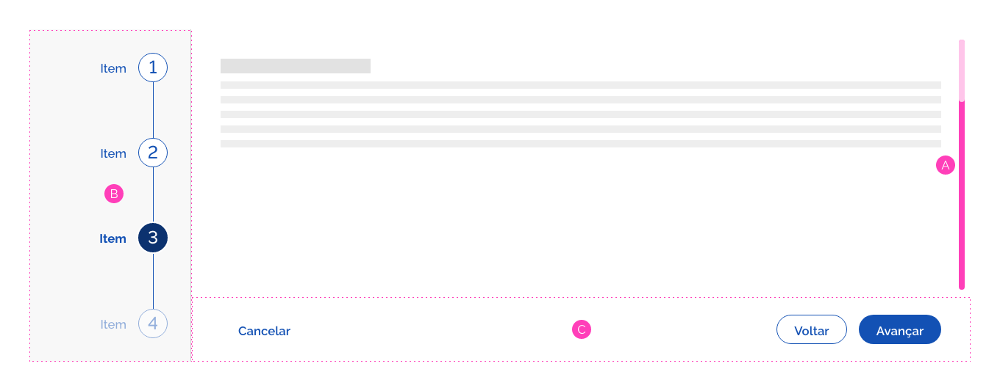
*Wizard Vertical - Rolagem na Área de Conteúdo*

---

## Melhores Práticas

-   *Wizard* é uma ótima opção quando o usuário precisa executar uma tarefa complexa que consiste em várias sub tarefas.

-   O *Wizard* deve ser utilizado sempre com o objetivo de seguir uma navegação linear. Caso seja permitido navegar livremente entre as etapas, utilize o *Componente Tab*.

-   *Wizard* também é eficiente quando o usuário precisa de orientação: o usuário deseja atingir uma meta geral, mas pode não estar familiarizado com as etapas necessárias para atingir a meta.

-   Os *wizards* devem ser rápidos e fáceis. Por esse motivo, é uma boa ideia manter o conteúdo de uma tela, bem como sua navegação, dentro da área visível da tela, evitando assim barras de rolagens.

-   Geralmente as etapas necessárias para atingir uma meta final podem variar devido a decisões tomadas em estágios anteriores. Se não for este o caso, prefira utilizar o componente *Tab*.

-   Use linguagem simples. Os usuários de um *wizard* não são necessariamente especialistas, por isso deve ser evitado o uso de jargão técnico. A linguagem usada deve ser adaptada ao usuário e não o contrário.

-   É uma boa prática apresentar para o usuário um resumo das opções feitas em todo o assistente na etapa final. Isso permitirá que o usuário revise e verifique os dados inseridos antes de clicar no Botão Concluir. No caso de o usuário desejar alterar os dados inseridos, ele deve ser capaz de navegar de volta para etapas anteriores. Se a quantidade de etapas for maior que seis, é uma boa ideia fornecer *links* diretamente para a tela de entrada do dado que deve ser alterado.

---

## Especificações

### Cores

| Name                            | Property   | Color Token            |
| ------------------------------- | ---------- | ---------------------- |
| Painel de etapas                | background | `--gray-2`             |
| Painel de etapas Fundo Escuro   | background | `--blue-warm-vivid-90` |
| Área de Conteúdo                | background | `--pure-0`             |
| Área de Conteúdo Fundo Escuro   | background | `--blue-warm-vivid-90` |
| Barra de Navegação              | background | `--gray-2`             |
| Barra de Navegação Fundo Escuro | background | `--blue-warm-vivid-90` |
| Rótulos                         | color      | `--blue-warm-vivid-70` |
| Rótulos Fundo Escuro            | color      | `--pure-0`             |

### Tipografia

| Name           | Size                     | Weight                 |
| -------------- | ------------------------ | ---------------------- |
| Rótulos        | `-font-size-scale-up-01` | `--font-weight-medium` |
| Rótulos Mobile | `--font-size-scale-base` | `--font-weight-medium` |

### Iconografia

| Name                   | Ícone                               | Token Size          | Class (Font Awesome)  |
| ---------------------- | ----------------------------------- | ------------------- | --------------------- |
| Ícones dos Steps       | -                                   | `--icone-size-base` | -                     |
| Ícone Slide Horizontal | <i class="grip-lines"></i>          | `--icone-size-base` | `grip-lines`          |
| Ícone Slide Vertical   | <i class="grip-lines-vertical"></i> | `--icone-size-base` | `grip-lines-vertical` |

### Espaçamentos

| Name                                  | Property       |        Value         |
| ------------------------------------- | -------------- | :------------------: |
| Painel de etapas (Densidade Padrão)   | padding-top    | `--spacing-scale-4x` |
| Painel de etapas (Densidade Padrão)   | padding-bottom | `--spacing-scale-4x` |
| Painel de etapas (Densidade Padrão)   | padding-left   | `--spacing-scale-5x` |
| Painel de etapas (Densidade Padrão)   | padding-right  | `--spacing-scale-5x` |
| Painel de etapas (Baixa Densidade)    | padding-top    | `--spacing-scale-5x` |
| Painel de etapas (Baixa Densidade)    | padding-bottom | `--spacing-scale-5x` |
| Painel de etapas (Baixa Densidade)    | padding-left   | `--spacing-scale-6x` |
| Painel de etapas (Baixa Densidade)    | padding-right  | `--spacing-scale-6x` |
| Painel de etapas (Alta Densidade)     | padding-top    | `--spacing-scale-3x` |
| Painel de etapas (Alta Densidade)     | padding-bottom | `--spacing-scale-3x` |
| Painel de etapas (Alta Densidade)     | padding-left   | `--spacing-scale-4x` |
| Painel de etapas (Alta Densidade)     | padding-right  | `--spacing-scale-4x` |
| Área de Conteúdo (Densidade Padrão)   | padding-top    | `--spacing-scale-5x` |
| Área de Conteúdo (Densidade Padrão)   | padding-bottom | `--spacing-scale-5x` |
| Área de Conteúdo (Densidade Padrão)   | padding-left   | `--spacing-scale-5x` |
| Área de Conteúdo (Densidade Padrão)   | padding-right  | `--spacing-scale-5x` |
| Área de Conteúdo (Baixa Densidade)    | padding-top    | `--spacing-scale-6x` |
| Área de Conteúdo (Baixa Densidade)    | padding-bottom | `--spacing-scale-6x` |
| Área de Conteúdo (Baixa Densidade)    | padding-left   | `--spacing-scale-6x` |
| Área de Conteúdo (Baixa Densidade)    | padding-right  | `--spacing-scale-6x` |
| Área de Conteúdo (Alta Densidade)     | padding-top    | `--spacing-scale-4x` |
| Área de Conteúdo (Alta Densidade)     | padding-bottom | `--spacing-scale-4x` |
| Área de Conteúdo (Alta Densidade)     | padding-left   | `--spacing-scale-4x` |
| Área de Conteúdo (Alta Densidade)     | padding-right  | `--spacing-scale-4x` |
| Barra de Navegação (Densidade Padrão) | padding-top    | `--spacing-scale-3x` |
| Barra de Navegação (Densidade Padrão) | padding-bottom | `--spacing-scale-3x` |
| Barra de Navegação (Densidade Padrão) | padding-left   | `--spacing-scale-5x` |
| Barra de Navegação (Densidade Padrão) | padding-right  | `--spacing-scale-5x` |
| Barra de Navegação (Baixa Densidade)  | padding-top    | `--spacing-scale-4x` |
| Barra de Navegação (Baixa Densidade)  | padding-bottom | `--spacing-scale-4x` |
| Barra de Navegação (Baixa Densidade)  | padding-left   | `--spacing-scale-6x` |
| Barra de Navegação (Baixa Densidade)  | padding-right  | `--spacing-scale-6x` |
| Barra de Navegação (Alta Densidade)   | padding-top    | `--spacing-scale-2x` |
| Barra de Navegação (Alta Densidade)   | padding-bottom | `--spacing-scale-2x` |
| Barra de Navegação (Alta Densidade)   | padding-left   | `--spacing-scale-4x` |
| Barra de Navegação (Alta Densidade)   | padding-right  | `--spacing-scale-4x` |
