# Wizard

### Definição
>Compreende uma sequência de etapas ou passos que o usuário deve percorrer para concluir uma determinada tarefa ou processo dentro de um sistema ou website. É frequentemente utilizado com o intuito de guiar o usuário durante a navegação sem deixar dúvidas em relação as etapas já concluídas e as demais.

---

### Estrutura

O template de wizard é organizado nas seguintes áreas, demonstradas abaixo:

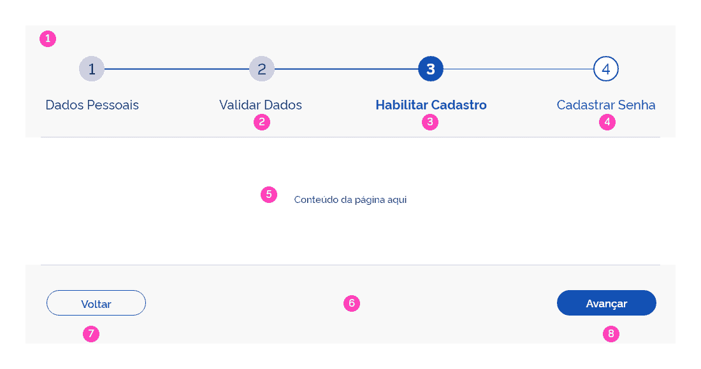

#### 1 | Painel de Etapas
Aqui serão exibidas de forma linear todas as etapas do Wizard. Deverão ser exibidos por escrito os rótulos de cada etapa, ordenados numericamente. Tanto os rótulos como os indicadores numéricos deverão ser clicáveis e o usuário poderá navegar, também, através deles.

#### 2 | Etapa Concluída
A etapa concluída deverá ser formatada de acordo com exemplo acima. Com o círculo preenchido em torno do número, o usuário tem a confirmação de que aquela etapa foi preenchida e/ou concluída.

#### 3 | Etapa Atual
Na etapa atual, o rótulo ficará no estilo Bold e o círculo branco, com a borda em azul. Transmite a ideia de que a etapa atual ainda está incompleta.

#### 4 | Etapa Não Concluída
Na etapa não concluída, o rótulo e borda do círculo ficarão na cor cinza. 

#### 5 | Área de Conteúdo
Esta área é o espaço reservado para o conteúdo da tela.

#### 6 | Barra de Navegação
Na barra de navegação estarão disponíveis os botões de avançar e voltar. Assim o usuário poderá percorrer por todas as etapas necessárias.

#### 7 | Botão Voltar
Aqui será usado o botão na versão secundária.

#### 8 | Botão Avançar
Aqui será usado o botão na versão primária.

---

### Versões do Wizard

Este template dispõe de duas formas de diagramação, a horizontal e a vertical. Estas poderão ser utilizadas de acordo com a necessidade de cada projeto, atendendo os requisitos em cada contexto.

#### Versão Horizontal
A versão horizontal, comumente mais usada, é a **versão padrão**.

Nenhum item foi preenchido pelo usuário.

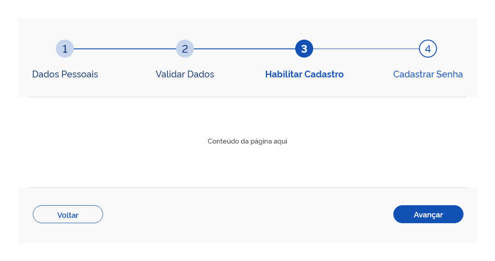

Apenas o item 04 ainda não foi preenchido pelo usuário.

#### Versão Vertical

A versão vertical pode ser mais adequada em alguns contextos específicos. 

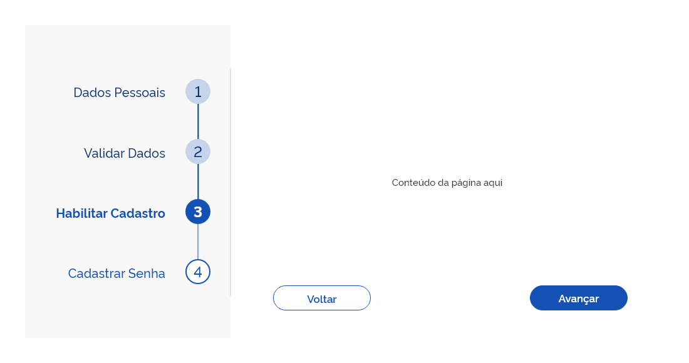

---

### Estados

#### Estado Normal

Quando o wizard ainda não foi preenchido os elementos devem seguir as especificações do **estado interativo**, indicando ao usuário que os itens são clicáveis.

#### Estado Hover

No estado **Hover** os elementos seguem as seguintes especificações:

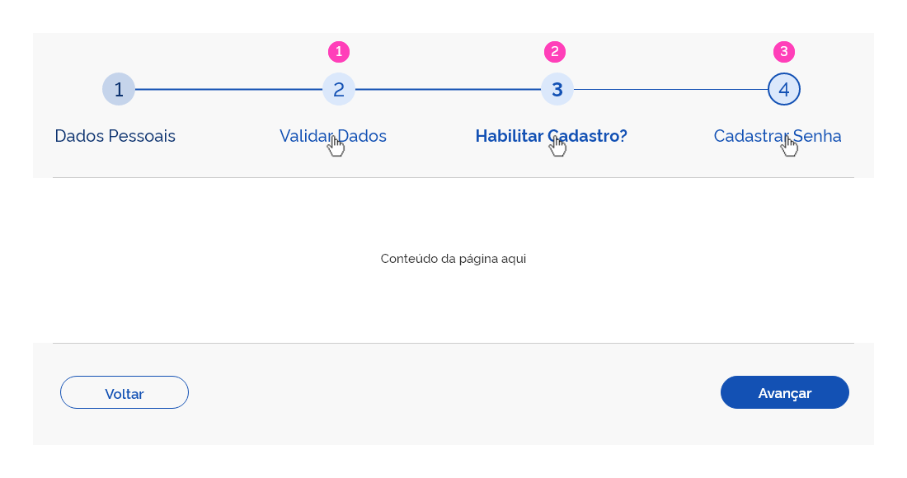

**1 |  Hover na Etapa Concluída**

**2 | Hover na Etapa Atual**

**3 | Hover na Etapa Não Concluída**

#### Estado Focus

No estado **Focus** os elementos seguem as seguintes especificações:

**1 |  Foco na Etapa Concluída**

**2 | Foco na Etapa Atual**

**3 | Foco na Etapa Não Concluída**

#### Estado Disable

Nesse estado, os elementos preservam suas especificações em cada etapa, porém a opacidade deve ser reduzida para 45%, conforme foi definido no estado desabilitado. 

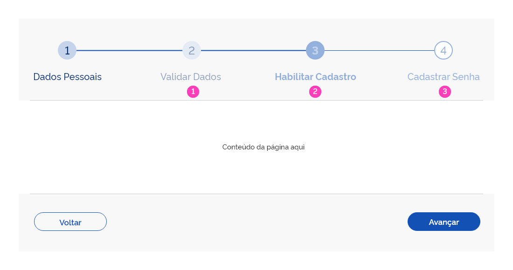

**1 | Disable na Etapa Concluída**

**2 | Disable na Etapa Atual**

**3 | Disable na Etapa Não Concluída**

---

### Responsividade | Versão Mobile

Nos dispositivos móveis, o Wizard segue uma formatação mais resumida, visando otimizar a adequação nos espaços reduzidos. Assim como na versão web, o Wizard mobile também possui duas formas de diagramação: a horizontal e a vertical, como demonstrado no modelo abaixo:

#### Versões do Wizard em Dispositivos Móveis

Na versão mobile, o Wizard possui os mesmos elementos disponíveis da versão web.

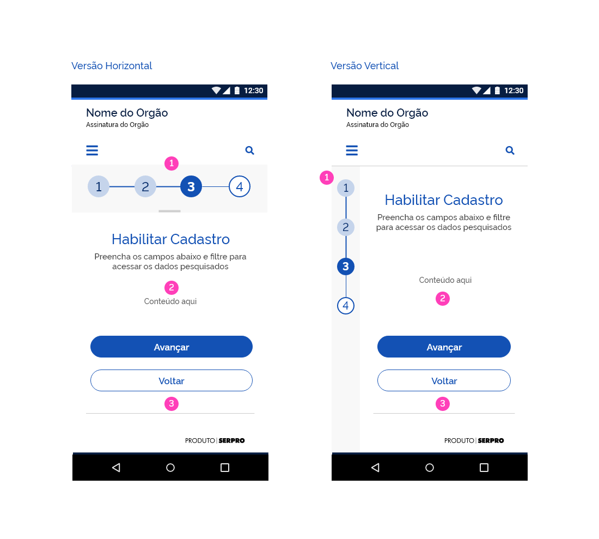

#### 1 | Painel de Etapas 
Configura-se com a numeração das etapas aparente e rótulos ocultos. Os ícones com a númeração das etapas são elementos clicáveis e o usuário poderá, também, navegar por eles.

#### 2 | Área de Conteúdo
De acordo com o tamanho do conteúdo, haverá rolagem natural na tela pelo dispositivo.

#### 3 | Barra de Navegação
Com os botões **Avançar** e **Voltar**, nos formatos **Primário** e **Secundário** respectivamente.

--- 

### Comportamento

Tendo em vista o formato mais resumido, o Wizard na versão mobile necessita de alguns comportamentos interativos que vão proporcionar ao usuário o acesso a toda informação necessária e recursos de navegação disponíveis, assim como no modelo web.

#### 1 | Painel de Etapas Retrátil

Na versão mobile, o painel de etapas é retrátil. O usuário poderá abri-lo com o touch deslizando-o para baixo. O movimento para fechar segue o sentido contrário, deslizando o painel para cima. Desta forma, o usuário poderá visualizar os rótulos das etapas, antes ocultados para otimização dos espaços.

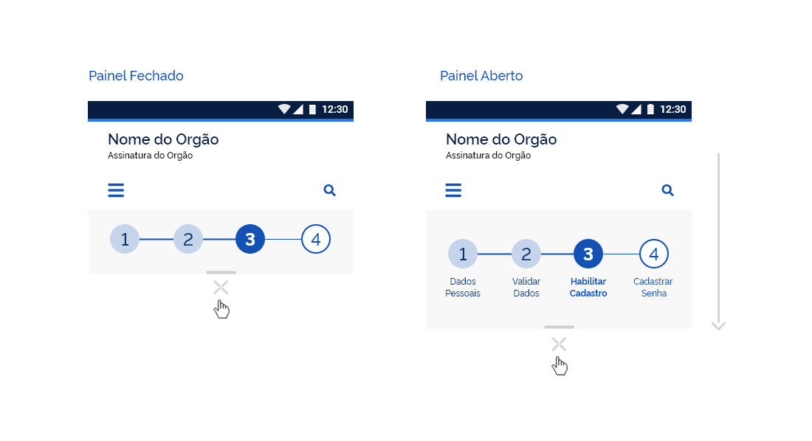

#### 2 | Painel de Etapas Retrátil | Versão Vertical

Assim como na versão horizontal, o painel de etapas é retrátil também na versão vertical. O recurso interativo é o mesmo: o usuário poderá interagir com o touch no painel e deslizar horizontalmente para direita para abrir o painel. Para fechá-lo, o movimento é o oposto, deslizando suavemente para esquerda. Durante o movimento de abertura do painel, uma máscara negra com opacidade vai aparecendo gradualmente no fundo entre o painel e o conteúdo de tela, até atingir **11% de opacidade**. Também aparecerá de forma gradual uma sombra abaixo do Painel de Etapas para ressaltar com mais ênfase em relação ao conteúdo de fundo. Assim o usuário poderá ter acesso aos rótulos das etapas e ocultá-los quando desejar.

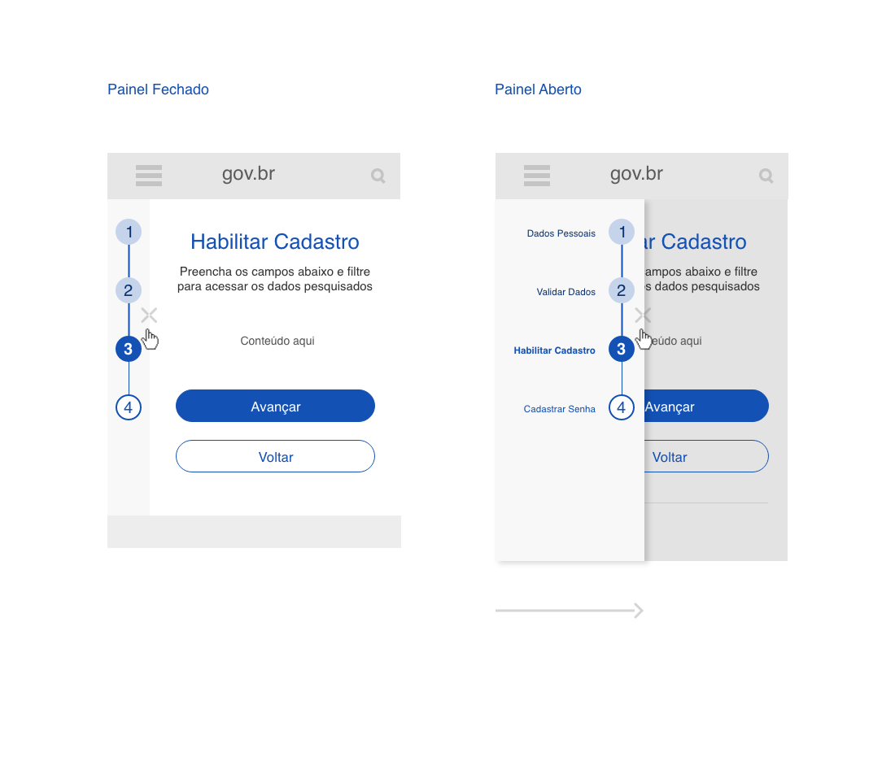

#### 3 | Controle de Exibição do Números de Etapas na Tela

Com o intuito de preservar a estética e manter um design mais limpo, recomenda-se um **número máximo de exibição de quatro etapas na tela**. Nos casos em que houver mais de quatro etapas, **serão exibidas apenas três: a atual, a anterior e a seguinte**. As demais etapas ficarão ocultas e poderão ser acessadas a partir da rolagem horizontal como descrito no comportamento abaixo.

#### 4 | Rolagem das etapas dentro do painel

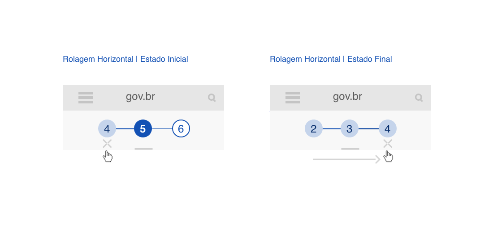

O comportamento de rolagem dentro do painel se faz necessário por conta da limitação no número de etapas na tela. Ao fazer o movimento de swipe no painel para esquerda ou para direita, o usuário poderá visualizar as etapas ocultas e navegar por elas. Este comportamento funcionará da mesma forma, com o painel aberto ou fechado.

#### 5 | Área de clique ou touch

A área de clique ou touch deverá envolver o conteúdo do rótulo e ícone com a numeração, evitando o erro por parte do usuário durante a ação. Abaixo pode-se observar a limitação da área de clique e touch em cada versão do Wizard.

##### Área de clique na versão web horizontal

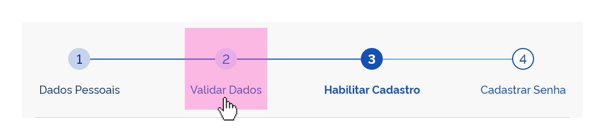

##### Área de clique na versão web vertical

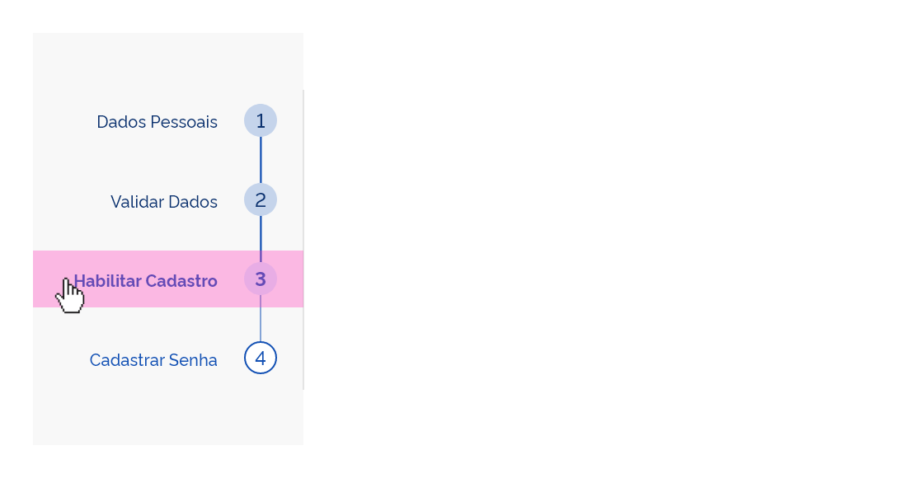

##### Área de clique nas versões mobile, horizontal e vertical, painel aberto e fechado

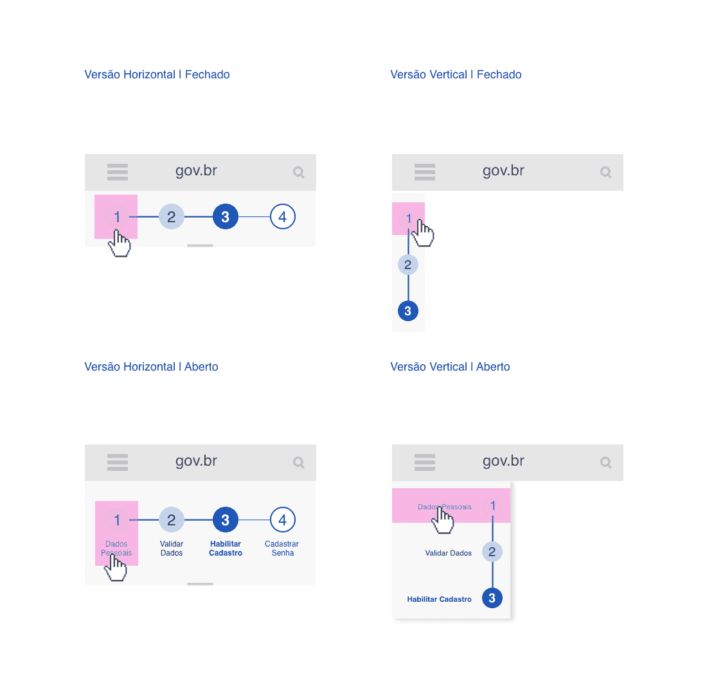

---

### Exemplos

Abaixo pode-se observar alguns exemplos do Wizard nas versões web e mobile.

#### Versão Horizontal

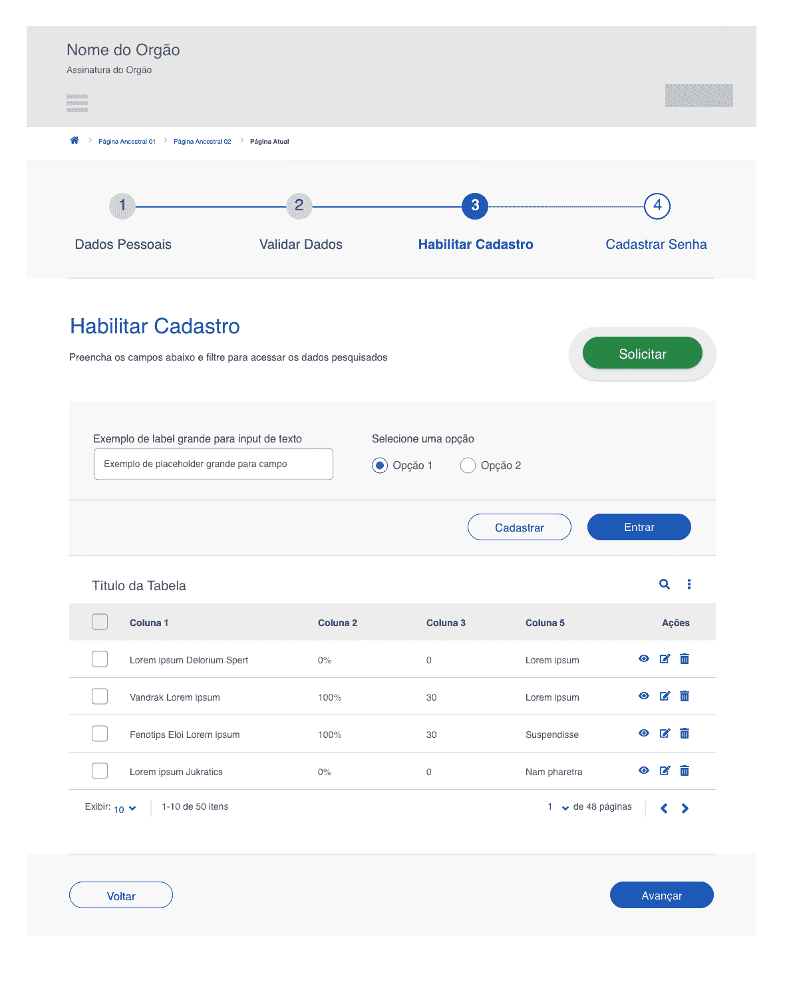

#### Versão Vertical

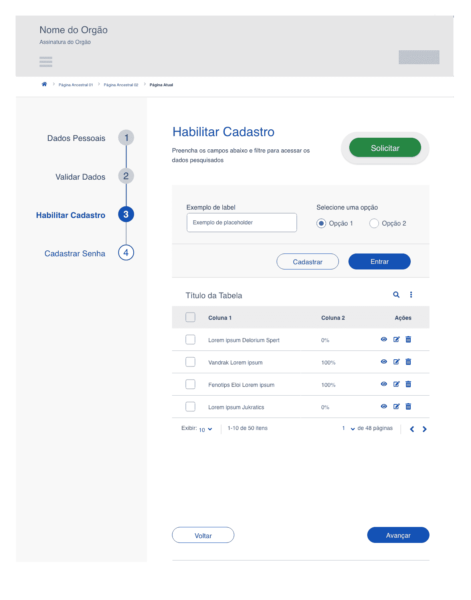

#### Versão Mobile

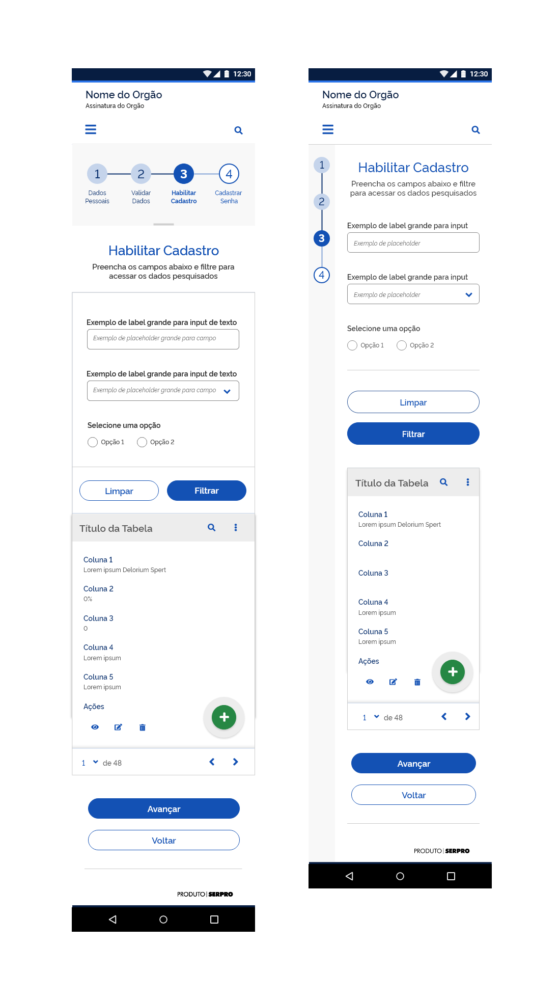