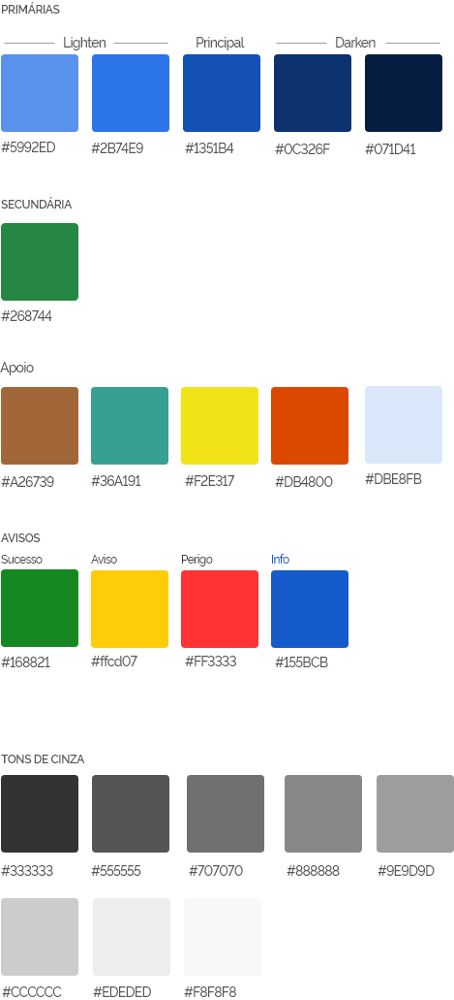

# Cores

A paleta do Design System de Governo totaliza 23 cores, incluindo 5 primárias, 1 secundária, 5 cores de apoio, 4 cores de avisos e 8 tons de cinza. Foram feitos testes de acessibilidade com textos pretos ou brancos sobre todas as cores da paleta.



## Uso das cores

As cores foram declaradas usando **Design Tokens** - <https://css-tricks.com/what-are-design-tokens/>. Ficaram definidas neste formato:

```scss
// Primary Colors
$color-primary: #1351b4;
$color-primary-lighten-15: #2b74e9;
$color-primary-lighten-25: #5992ed;
$color-primary-pastel: #dbe8fb;
$color-primary-darken-15: #0c326f;
$color-primary-darken-25: #071d41;

// Secondary Colors
$color-secondary: #268744;

// State Colors
$color-success: #168821;
$color-warning: #ffcd07;
$color-danger: #ff3333;
$color-info: #155bcb;

// Support Colors
$color-brown: #a26739;
$color-teal: #36a191;
$color-yellow: #f2e317;
$color-orange: #d84800;

// Grayscale Colors
$color-white: #ffffff;
$color-gray-1: #f8f8f8;
$color-gray-2: #ededed;
$color-gray-3: #cccccc;
$color-gray-4: #9e9d9d;
$color-gray-5: #888888;
$color-gray-6: #555555;
$color-gray-7: #333333;
$color-black: #000000;
```

Estão disponíveis variações de background e texto usando as cores do DS-Gov.

Para modificar a cor de fundo use `.bg-*`. Para modificar a cor de texto use `text-*`.

Exemplo de uso:

```html
<div class="bg-primary">
  <p class="text-white">Texto...</p>
</div>
```

Veja como usar as folhas de estilo do Design System de Governo em [**Boas Práticas --> Desenvolvimento --> Uso do CSS**](ds/boaspraticas/uso-do-css).
