# Sistema de Grid

O sistema de Grid do Design System de Governo se adequa a 4 breakpoints de referência, abrangendo resoluções para Mobile, Tablet, Desktop e resoluções superiores. São elas:

- SmartPhone Portrait (**xs**): até **576px**
- SmartPhone Landscape e Tablet Portrait (**sm**): a partir de **576px**
- Tablet Landscape (**md**): a partir de **992px**
- Desktop (**lg**): a partir de **1280px**
- Big Desktop e TV (**xl**): a partir de **1600px**

Para tanto, será utilizado o **Sistema de 12 Colunas** como norteador na estrutura geral, além da **Grade de 8 Pontos** - <https://spec.fm/specifics/8-pt-grid> - para definir dimensões, preenchimento e margem de elementos em bloco e em linha.

Enquanto o Sistema de 12 Colunas permite uma boa flexibilidade para diagramação de layout, também se adequa aos principais Frameworks CSS, facilitando a escolha na teconologia a ser utilizada.

Já o princípio da Grade de 8 Pontos é mais adequado a um Design Multi-Plataforma, visto que os tamanhos de tela mais populares são divisíveis por 8 em pelo menos um eixo e, geralmente em ambos os eixos. Isto facilita a preservação das proporções em dispositivos com tamanhos de telas diversos.

## Base da Grid do Design System de Governo

A Grid do Design System de Governo foi criada usando o Bootstrap como base, portanto sua forma de uso é a mesma. Os tamanhos de breakpoints, containers e gutters (Medianiz) possuem valores diferenciados que se aplicam às regras do Design System de Governo.

Leia a documentação oficial de uso da Grid Bootstrap no endereço [https://getbootstrap.com/docs/4.3/layout/grid/](https://getbootstrap.com/docs/4.3/layout/grid/).

Exemplo de uso:

```html
<div class="container">
  <div class="row">
    <!-- Coluna com largura pré-definida -->
    <div class="col-sm-6 col-md-5 col-lg-4 col-xl-3">...</div>
    <!-- Coluna com espaço restante -->
    <div class="col">...</div>
  </div>
</div>
```

Tabela de configurações da Grid

Breakpoints | Containers | Gutters
--- | --- | ---
xs: **até 576px**<br>sm: **a partir de 576px**<br>md: **a partir de 992px**<br>lg: **a partir de 1280px**<br> xl:  **a partir de 1600px** | xs, sm e md: **100% da largura**<br>lg: **máximo de 1152px**<br>xl: **máximo de 1440px** | xs, sm e md: **16px**<br>lg: **24px**<br>xl: **32px**

## Aplicação na prática

### Desktop

As 12 colunas serão divididas em **1152 pixels** de largura com espaçamentos de **24 pixels** entre elas. Esse sistema permite a organização do conteúdo em diversas formatações de coluna e facilita a reorganização dele nos grids das versões tablet e mobile.

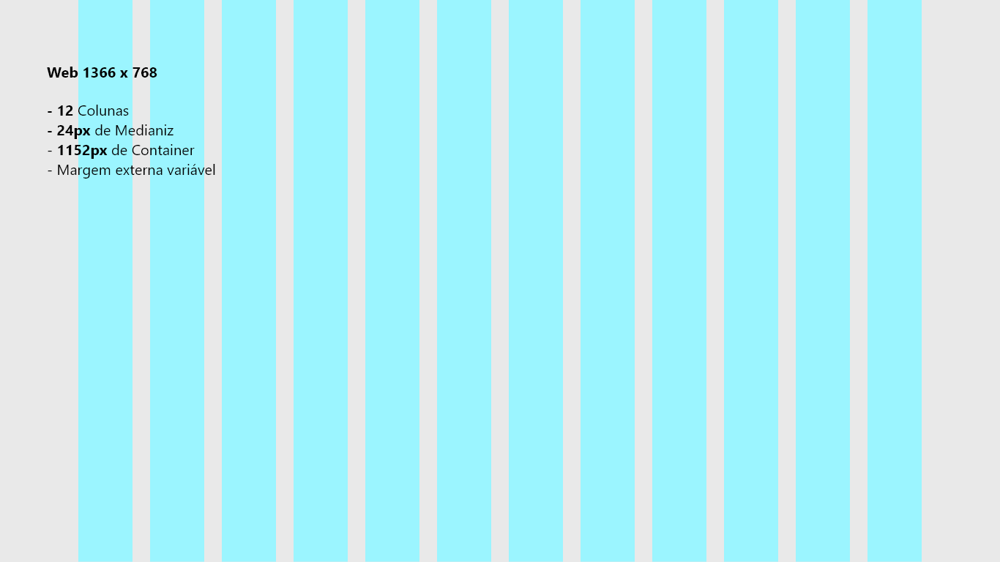

A margem externa ao conteúdo será sempre variável se adequando às dimensões da tela. Abaixo seguem alguns exemplos:

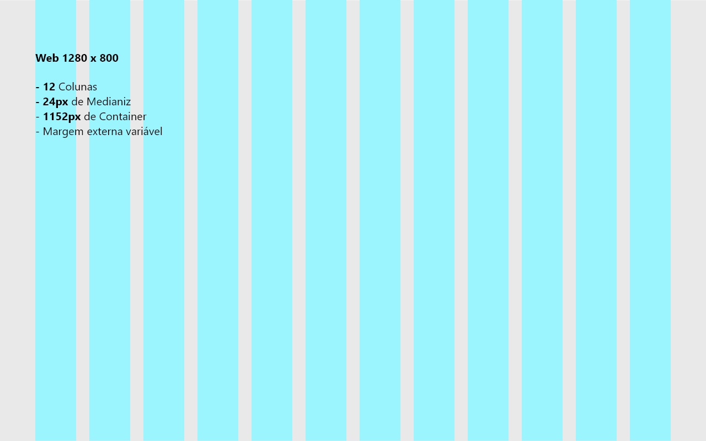

A medida para o conteúdo permanece com a largura máxima de 1152px para preservar a consistência do projeto de layout.

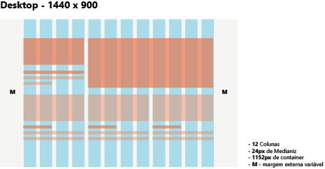

Para resoluções maiores que **1440px** também utiliza-se o padrão de **12 colunas** com medianiz de **32px** e largura máxima de **1440px**. Nestas resoluções o conteúdo cresce de forma proporcional tanto na horizontal como na vertical.

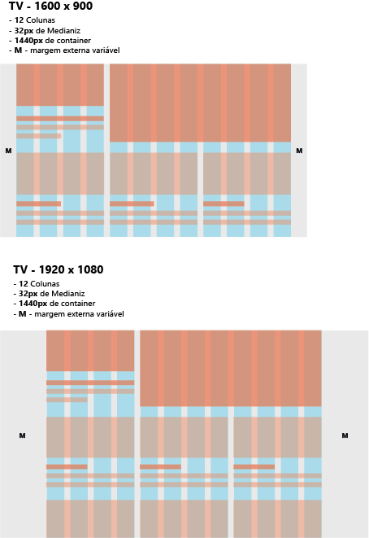

### Tablet

Nos dispositivos tablets, o conteúdo pode ser reorganizado em até **8 colunas** se adequando às variações retrato e paisagem. O espaçamento entre as
colunas será de **24px** e a margem externa ao conteúdo de **40px**.

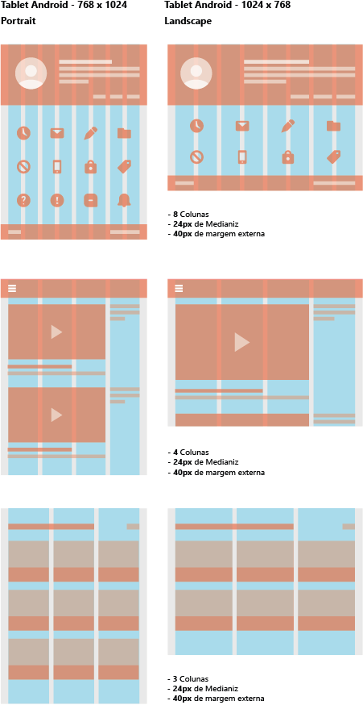

Para responsividade em sites e portais o ideal é que se use uma diagramação com **2 colunas** apenas, visto que o conteúdo textual e o enquadramento das fotos funciona melhor quando há uma redução na largura de Desktop para tablets.

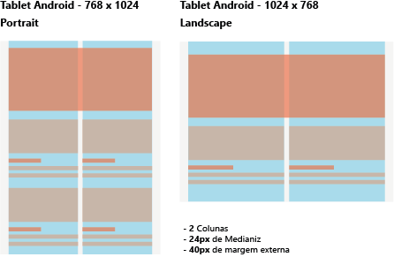

### Mobile

Conteúdo pode ser reorganizado em até **4 colunas** e respeitando a margem de **24px** nas laterais e **medianiz de 16px**.

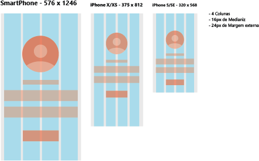

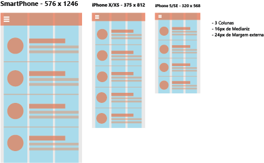

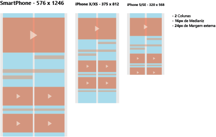

Para responsividade em sites e portais o ideal é que se use uma diagramação com **1 coluna** apenas, visto que o conteúdo textual e o enquadramento das fotos funciona melhor quando há uma redução na largura de Desktop para Smartphones.

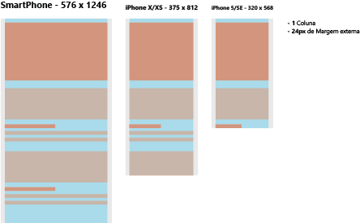

### Grade de 8 pontos

Use múltiplos de 8 para definir dimensões, reenchimento e margem de elementos em bloco e em linha. Os elementos são posicionados dentro da grid e mantêm distâncias relativas um com os outros.

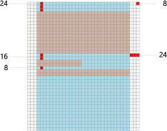

A Grade de 8 Pontos é mais adequado a um Design Multi-Plataforma, visto que os tamanhos de tela mais populares são divisíveis por 8 em pelo menos um eixo e, geralmente em ambos os eixos. Isto facilita a preservação das proporções em dispositivos com tamanhos de telas diversos.


