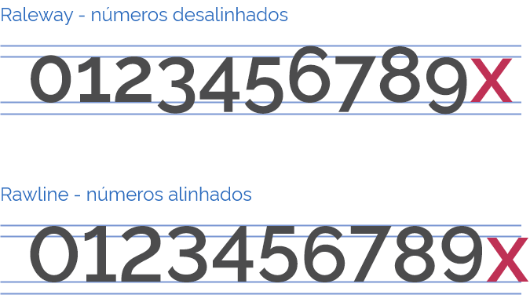

# Tipografia

Para a apresentação de todo o conteúdo dos novos sites do Governo Federal, somente uma família de fonte é utilizada e indicada no Guia de Estilos do Governo Federal, - A Raleway. Porém, optou-se pela substituição desta fonte pela **Rawline**, já que ambas são iguais porém os caracteres numéricos da Rawline são alinhados pela base o que facilita a leitura.

A Rawline foi escolhida para compor o Design System do Governo Brasileiro, tendo como objetivo: facilitar o reconhecimento, por parte dos cidadãos, dos produtos do Governo Federal, juntamente com o padrão de cores e elementos gráficos definidos no Design System.

A Rawline é um tipo de letra sem serifa, elegante concebido com um único peso fino e que possui uma diversidade de pesos que facilita o uso e a criação de hierarquias entre os textos, bem como a compreensão dos elementos da tela.

A Rawline pode ser baixada em [https://h-ibaldo.github.io/Raleway_Fixed_Numerals/](https://h-ibaldo.github.io/Raleway_Fixed_Numerals/)

## Números | Alinhamento

Verificou-se que a fonte Raleway possui uma variação no alinhamento dos números. Com o objetivo de aumentar a legibilidade, **optou-se por utilizar a fonte Rawline** substituindo a Raleway, pois os caracteres númericos da **Rawline são alinhados
pela base**, evitando estranhamento por parte de alguns usuários.

## Tamanhos | Pesos

Para definir os tamanhos principais dos textos do Design System do Governo Federal, e garantir ume melhor legibilidade, tomou-se como base uma escala modular, o Type Scale, que define uma relação de proporção e hierarquia entre os tamanhos tipográficos.

Utilizou-se **16px** como o tamanho base para os textos, e optou-se pelo uso da escala (Major Second) de aproximadamente 1,125 , com peso de 400 (que equivale a Regular).

Os pesos maiores serão definidos na criação dos componentes e templates, de acordo com a necessidade de se criar hierarquias entre os textos.

## Tabela de estilos

  

    <table>
      <thead>
          <th>Tipo</th>
          <th>Estilos</th>
          <th>Descrição</th>
        </tr>
      </thead>
      <tbody>
        <tr>
          <td>Texto padrão</td>
          <td>16px Regular | Cor #555555</td>
          <td>Texto padrão, input, textarea e select</td>
        </tr>
        <tr>
          <td><a href="javascript:void(0)">Link</a></td>
          <td>16px Regular | Cor #1351b4 | Sublinhado</td>
          <td>Link</td>
        </tr>
        <tr>
          <td>Título da página</td>
          <td>32px Medium | Cor #1351B4</td>
          <td>Título principal</td>
        </tr>
        <tr>
          <td>Legend de fieldset</td>
          <td>22px Regular | Cor #1351b4</td>
          <td>Legenda do agrupador de campos de formulário</td>
        </tr>
        <tr>
          <td>Label</td>
          <td>16px Semibold | Cor #333333</td>
          <td>Rótulo de campos de formulários</td>
        </tr>
        <tr>
          <td>Placeholder</td>
          <td>14px Regular Itálico | Cor #555555</td>
          <td>Texto de exemplo dentro de input, textarea e select</td>
        </tr>
        <tr>
          <td>Texto de auxílio</td>
          <td>13px Regular | Cor #333333</td>
          <td>Texto auxiliar após campos de formulários para prevenir erros</td>
        </tr>
        <tr>
          <td>Feedback positivo</td>
          <td>13px Regular Itálico | Cor #168821</td>
          <td>Feedback positivo após o campo do formulário</td>
        </tr>
        <tr>
          <td>Feedback negativo</td>
          <td>13px Regular Itálico | Cor #ff3333</td>
          <td>Feedback negativo após o campo do formulário</td>
        </tr>
      </tbody>
    </table>
  

