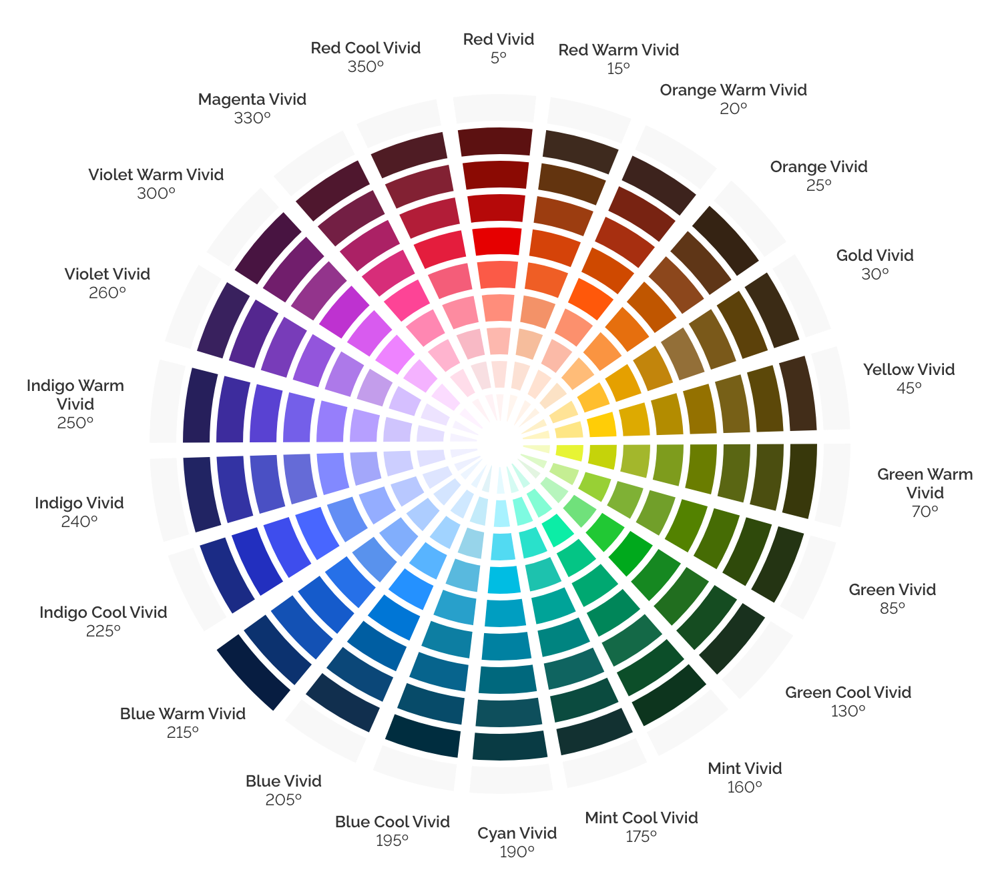
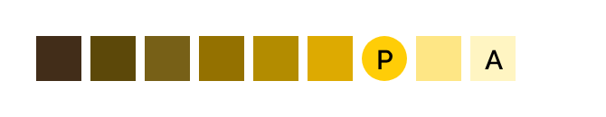
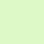

[version]: # (7.1.4)

A aplicação correta da paleta de cores visa trazer consistência ao _Design System_ e contribuir para garantir uma interface unificada e facilmente reconhecível pelos seus usuários. É fundamental que a paleta esteja alinhada aos Princípios do _Design System_ e seja aplicada corretamente na biblioteca de componentes contribuindo para o equilíbrio entre os diversos produtos e sistemas do governo.

---

## Princípios

### Experiência Única

A paleta do GOVBR-DS é constituída e organizada por cores e famílias de cores, abrangendo dimensões de matizes, brilhos e saturação. Além disso, são estabelecidas finalidades específicas para algumas dessas famílias: **Cores de Superfície**, **Cores de Leitura**, **Cores Interativas** e **Cores de Feedback**. Elas tem o objetivo de preservar a identidade visual e manter a mesma experiência em todos os produtos e sistemas do Governo Federal.

> **Exemplo:** Nesse sistema, a família **Blue Warm Vivid**, que contém a cor **Blue Warm Vivid 70**, foram as cores selecionadas para representar a identidade do Governo Federal.

### Eficiência e Clareza

A cor deve indicar o estado e hierarquia dos elementos dispostos em uma interface, facilitando o _feedback_ e comunicação entre a interface e o usuário, enquanto se mantêm consistentes ao longo de toda a navegação.

> **Exemplo:** A cor ajuda a indicar quais elementos são interativos, como eles se relacionam com outros elementos.

### Acessibilidade

Um sistema de serviço deve cumprir as diferentes necessidades de acessibilidade. Para tanto, as cores existentes na paleta foram selecionadas para se obter um mínimo de contraste e garantir boa legibilidade nas interfaces digitais.

A [WCAG 2.1](https://www.w3.org/TR/WCAG20/) (Diretrizes de Acessibilidade para o Conteúdo da Web) descreve que existem vários níveis de conformidade (A, AA ou AAA), de forma que, quanto mais itens são atendidos, maior será o nível ou suporte de acessibilidade na interface.

O contraste varia entre 1 a 21 (geralmente descritos 1:1 a 21:1).

O **nível AA** indica que é necessária uma taxa de contraste de pelo menos **4,5:1** para que o texto seja considerado normal e tenha boa legibilidade. Para texto grande a taxa de contraste mínimo deve ser de pelo menos **3:1**.

O **nível AAA** requer uma taxa de contraste de pelo menos **7:1** para texto normal e **4,5:1** para texto grande.

É considerado **texto grande** aquele em que a fonte possui pelo menos 18 pontos (24px, 1,71em, 171% do tamanho padrão da Fonte Base, veja [Tipografia](/fundamentos-visuais/tipografia) para maiores detalhes) ou 14 pontos em negrito (19px, 1,325em, 132,5%), um texto com tamanho abaixo desses valores (tal como 14pt regular) é considerado **texto normal**.

Elementos gráficos e componentes da interface (como ícones e bordas) seguem as mesmas regras de texto grande.  

O _Design System_ do governo trabalha com nível de conformidade **mínima de AA** (na taxa de contraste **4,5:1**), pois permite uma flexibilidade maior de variações de cores (em relação à conformidade AAA) e atende aos critérios mínimos de contraste proposto pela WCAG 2.1.

_Observação_: algumas cores foram selecionadas para um uso bastante específico, deste modo, elas funcionam no contraste mínimo de 3:1, ou seja, apenas para uso em elementos gráficos (ou texto grande).

> Para testar a acessibilidade das cores foram utilizadas as seguintes ferramentas online <https://contrastchecker.com/> e  <https://webaim.org/resources/contrastchecker/>

Para o _Design System_ foi analisado a relação de contraste entre **a cor aplicada aos textos (2 variações que dependendo do brilho do plano de fundo da interface: claro ou escuro) e as cores que compõem a paleta do DS**.

> **Exemplo:** Para o texto em **fundo claro** optou-se pelo uso do cinza **#333333** que possui contraste inferior ao preto, mas suficiente para uma boa leitura na tela. O tom neutro, deixa a composição mais leve, tornando a leitura mais agradável. Para texto em **fundo escuro** optou-se pela cor branca **#FFFFF**.

### Reutilização e Colaboração

Interfaces digitais do governo devem utilizar sempre as cores pré-definidas. Havendo a necessidade de acrescentar uma nova cor à paleta do DS, faz-se necessário que a cor seja testada do ponto de vista de acessibilidade e passe por uma prévia aprovação da equipe de design do DS.

**OBS:** Consulte a acessibilidade das cores usadas no GOVBR-DS na **Tabela de Contraste**.

---

## Sistema de Cores

O sistema de cores utilizado no GOVBR-DS, assim como o modelo de gradação em luminância e _Famílias de Cores_, foram adaptados do modelo de cores do [U.S. Web Design System (USWDS)](https://designsystem.digital.gov/).

### Cor

É qualquer amostra específica em nossas famílias de cores. Elas são representadas por uma nomenclatura construída com base na família e luminância. Por exemplo:  `Red 50`, `Blue Warm Vivid 70`, `Indigo Cool Vivid 5`, etc.

### Família de Cores

É um grupo de cores que têm o mesmo matiz em um círculo cromático. Eles contêm várias cores individuais, diferenciadas pelo brilho ou saturação de cada uma delas. Uma família de cores é normalmente representada por um nome que faz referência a sua matiz, como por exemplo: `Red`, `Blue Warm`, `Green Cool`, etc.

As famílias de cores do GOVBR-DS são escolhidas a partir do modelo _HSL_ _(Hue, Saturation, Lightness)_, sistema de cores que utiliza os parâmetros de matiz, saturação e brilho, sendo dispostas em 360º em um círculo cromático. Desta forma, é possível rotular cada família através de sua posição em graus, neste modelo. As cores são selecionadas seguindo a mesma lógica de gradação de luminância em todas as famílias.

### Família de Cores Alternativas

Refere-se ao mesmo conceito de _Família de Cores_. Fazem parte de um grupo de cores de um mesmo matiz mas pertencentes a um outro círculo cromático (com característica diferente da família "padrão"). Sua nomenclatura tem a mesma base da _Família de Cores_ adicionando um sufixo.

Atualmente temos apenas um círculo cromático alternativo chamado `Vivid`, criando famílias como `Red Vivid`, `Blue Warm Vivid`, `Green Cool Vivid`, etc.

### Círculo Cromático

Os círculos cromáticos são uma maneira de exibir as famílias do sistema de cores do GOVBR-DS, dispostas em 360° no modelo de cores HSL. Cada família de cores está localizada com sua posição (em graus) neste modelo.

Abaixo é possível observar o padrão das famílias de cores do GOVBR-DS dentro de cada círculo cromático.

_Círculo cromático (padrão)_

*Círculo cromático _vivid_ (alternativo) -  cores mais saturadas.*

Existem algumas famílias que não estão visíveis dentro dos círculos cromáticos acima mas que podem ser usados como cores neutras:

- Famílias de Cinza: `Gray`, `Gray-Cool` e `Gray-Warm`.
- Família Pura: `Pure`

A lista de todas as cores disponíveis podem ser encontradas na **Paleta do GOVBR-DS**.

---

## Função das Cores

O GOVBR-DS estabelece finalidades específicas utilizando as famílias de cores, com o intuito de facilitar a lógica para criação de temas. Em cada função estabelecida, qualquer cor da família especificada poderá ser usada, porém é recomendado utilizar a cor principal ou as alternativas indicadas nas escalas de cores.

**Obs:** Em algumas situações, poderá ser observado o uso 2 de famílias para um determinada função e aplicação de fundo. Isso acontece por causa do uso da **Família Pure**, ela funciona como uma "família de apoio" para as demais. Maiores informações veja Paleta do GOVBR-DS.

### Cor Principal

É a recomendação de uso principal que poderá ser usada para as finalidades estabelecidas. São representadas pela letra **P** e indicadas na _Família de Cores_ da seguinte forma:

_Exemplo de Indicação - Cor Principal_

### Cor Alternativa

São alternativas de cores recomendadas que podem ser usadas quando não for possível utilizar a recomendação principal, ou trabalhar com ênfases. São representadas pela letra **A** e indicadas na _Família de Cores_ da seguinte forma:

_Exemplo de Indicação - Cor Alternativa_

### Fundo Claro Vs Fundo Escuro

Quando se escolhe uma cor para um determinado elemento ou função, geralmente existe uma superfície comum da qual será aplicado aquele elemento. Porém, em algumas situações, a luminância desse fundo pode ser diferente do habitual, gerando contraste insuficiente (entre o fundo e o elemento) para se perceber o elemento.

Sempre que escolher uma cor (seja a principal ou as alternativas), determine o uso dela em diferentes luminâncias. Para facilitar, podemos pensar no uso desses elementos em diferentes superfícies: claro e escuro.

Abaixo estão listadas as principais funções das cores, as recomendações de qual família de cor utilizar, assim como a recomendação da cor principal e das alternativas dentro do tema base.

**Obs:** Cada função está ligada a um ou mais fundamentos. Procure as documentações relacionadas para maiores detalhes.

### 1. Função Contêiner ([Superfícies](/fundamentos-visuais/superficie))

As **cores de superfície** são utilizadas como base cromática neutra para composição do tema e compõem harmonicamente com as demais cores. São usadas especificamente em planos de fundo nas telas da interface e superfícies de componentes. Também devem proporcionar contraste com o texto e elementos interativos, assim como qualquer outro elemento de comunicação visual na interface, como imagens, ilustrações, ícones, etc.

#### Especificação

 De modo geral, as cores de superfície mais utilizadas são as gradações de cinza, presentes na família `Gray` e branco ou preto na família `Pure`. Também pode se utilizar a família `Blue Warm Vivid` para fundos escuros. Elas são usadas como plano de fundo na tela e praticamente em todos os componentes do GOVBR-DS.

##### Fundo Claro

| Legenda |  Recomendação   | Hexadecimal |   Token    |
| :-----: | :-------------: | :---------: | :--------: |
|  **P**  |  Cor Principal  |  `#ffffff`  | `--pure-0` |
|  **A**  | Cor Alternativa |  `#f8f8f8`  | `--gray-2` |

*Cor Superfície - Família `Pure` para Fundos Claros*

*Cor Superfície Alternativa - Família `Gray` para Fundos Claros*

##### Fundo Escuro

| Legenda | Recomendação  | Hexadecimal |         Token          |
| :-----: | :-----------: | :---------: | :--------------------: |
|  **P**  | Cor Principal |  `#071D41`  | `--blue-warm-vivid-90` |
|  **A**  | Cor Principal |  `#0C326F`  | `--blue-warm-vivid-80` |

*Cor Superfície - Família `Blue Warm Vivid` para Fundos Escuros*

### 2. Função Leitura ([Tipografia](/fundamentos-visuais/tipografia) e [Iconografia](/fundamentos-visuais/iconografia))

São as cores usadas nos elementos que necessitam de legibilidade, como textos e ícones, por exemplo. A função principal dessas cores é proporcionar contraste com a _Cor Superfície_ usada na tela ou elementos. Logo, para toda _Cor Superfície_, existe uma _Cor Leitura_ contrastante.

#### Especificação

##### Fundo Claro

| Legenda | Recomendação  | Hexadecimal |    Token    |
| :-----: | :-----------: | :---------: | :---------: |
|  **P**  | Cor Principal |  `#333333`  | `--gray-80` |

*Cor Leitura - Família `Gray` para Fundos Claros*

##### Fundo Escuro

| Legenda | Recomendação  | Hexadecimal |   Token    |
| :-----: | :-----------: | :---------: | :--------: |
|  **P**  | Cor Principal |  `#ffffff`  | `--pure-0` |

*Cor Leitura - Família `Pure` para Fundos Escuros*

### 3. Função _Feedback_ ([Estados](/fundamentos-visuais/estados))

São representações visuais para feedbacks interativos ou informacionais relacionadas aos elementos na interface. Podemos subdividir essa função em dois grupos de estados: **interação** e **avisos**.

#### Função Interação

São cores que servem para indicar ao usuário a possibilidade de interação sobre qualquer elemento que a utiliza. É necessário que estas cores se destaquem sobre os outros elementos ou informações textuais na interface.

##### Especificação

Para este tipo de cor, utilizam-se as famílias `Blue Warm` e `Blue Warm Vivid`. Abaixo seguem as referências.

###### Fundo Claro

| Legenda | Recomendação  | Hexadecimal |         Token          |
| :-----: | :-----------: | :---------: | :--------------------: |
|  **P**  | Cor Principal |  `#1351B4`  | `--blue-warm-vivid-70` |

*Cor Interativa - Família `Blue Warm Vivid` para Fundos Claros*

###### Fundo Escuro

| Legenda | Recomendação  | Hexadecimal |      Token       |
| :-----: | :-----------: | :---------: | :--------------: |
|  **P**  | Cor Principal |  `#C5D4EB`  | `--blue-warm-20` |

*Cor Interativa - Família `Blue Warm` para Fundos Escuros*

#### Função de Avisos

 As cores de avisos foram escolhidas para serem aplicadas em situações que exijam mais atenção do usuário, como ocorre nas mensagens de _Feedback_ e estados correlacionados.

##### Especificação

São cores fortemente reconhecidas pela boa parte dos usuários e relacionadas a avisos específicos. Consulte o documento [Fundamentos Visuais > Estados](/fundamentos-visuais/estados) para maiores informações.

###### Feedback Informação

| Legenda |  Recomendação   | Hexadecimal |         Token          |
| :-----: | :-------------: | :---------: | :--------------------: |
|  **P**  |  Cor Principal  |  `#155BCB`  | `--blue-warm-vivid-60` |
|  **A**  | Cor Alternativa |  `#D4E5FF`  | `--blue-warm-vivid-10` |

*Cor Feedback Informação - Família `Blue Warm Vivid`*

###### Feedback Sucesso

| Legenda |  Recomendação   | Hexadecimal |          Token          |
| :-----: | :-------------: | :---------: | :---------------------: |
|  **P**  |  Cor Principal  |  `#168821`  | `--green-cool-vivid-50` |
|  **A**  | Cor Alternativa |  `#E3F5E1`  | `--green-cool-vivid-5`  |

*Cor _Feedback_ Sucesso - Família `Green Cool Vivid`*

###### Feedback Alerta

| Legenda |  Recomendação   | Hexadecimal |        Token        |
| :-----: | :-------------: | :---------: | :-----------------: |
|  **P**  |  Cor Principal  |  `#FFCD07`  | `--yellow-vivid-20` |
|  **A**  | Cor Alternativa |  `#FFF5C2`  | `--yellow-vivid-5`  |

*Cor _Feedback_ Alerta - Família `Yellow Vivid`*

###### Feedback Erro

| Legenda |  Recomendação   | Hexadecimal |      Token       |
| :-----: | :-------------: | :---------: | :--------------: |
|  **P**  |  Cor Principal  |  `#E52207`  | `--red-vivid-50` |
|  **A**  | Cor Alternativa |  `#FDE0DB`  | `--red-vivid-10` |

*Cor _Feedback_ Erro - Família `Red Vivid`*

 ---

## Paleta do GOVBR-DS

Como dito anteriormente, a paleta do GOVBR-DS foi constituída por grupos de famílias, formadas por grupos de cores dentro do círculo cromático (HSL), com um matiz igual ou muito próximo. As famílias alternativas estão descritas com sufixo `Vivid` junto ao nome da família.

Os nomes das cores são formados pelo nome da família correspondente, adicionando o fator de luminância ao qual ela pertence, dentro daquela família.

Abaixo estão listadas todas as famílias do GOVBR-DS.

### Red

|              Cor               | Nome da Cor | Luminância |       HSL / Hexadecimal        |   Token    |
| :----------------------------: | :---------: | :--------: | :----------------------------: | :--------: |
|  |  `Red 90`   |  `0.008`   | `hsl(0, 10%, 10%)` / `#1b1616` | `--red-90` |
|  |  `Red 80`   |  `0.027`   | `hsl(5, 23%, 20%)` / `#3e2927` | `--red-80` |
|  |  `Red 70`   |  `0.059`   | `hsl(2, 39%, 31%)` / `#6f3331` | `--red-70` |
|  |  `Red 60`   |  `0.106`   | `hsl(0, 49%, 43%)` / `#a23737` | `--red-60` |
|  |  `Red 50`   |  `0.177`   | `hsl(2, 68%, 52%)` / `#d83933` | `--red-50` |
|  |  `Red 40`   |  `0.282`   | `hsl(4, 76%, 64%)` / `#e9695f` | `--red-40` |
|  |  `Red 30`   |  `0.416`   | `hsl(4, 80%, 75%)` / `#f2938c` | `--red-30` |
|  |  `Red 20`   |  `0.584`   | `hsl(9, 81%, 83%)` / `#F7BBB1` | `--red-20` |
|  |  `Red 10`   |  `0.790`   | `hsl(7, 65%, 92%)` / `#F8E1DE` | `--red-10` |
|  |   `Red 5`   |  `0.874`   | `hsl(0, 48%, 95%)` / `#F9EEEE` | `--red-5`  |

### Red Vivid

|              Cor               |  Nome da Cor   | Luminância |        HSL / Hexadecimal        |      Token       |
| :----------------------------: | :------------: | :--------: | :-----------------------------: | :--------------: |
|  | `Red Vivid 80` |  `0.027`   | `hsl(0, 69%, 21%)` / `#5C1111`  | `--red-vivid-80` |
|  | `Red Vivid 70` |  `0.057`   | `hsl(3, 96%, 28%)` / `#8B0A03`  | `--red-vivid-70` |
|  | `Red Vivid 60` |  `0.100`   | `hsl(0, 91%, 37%)` / `#B50909`  | `--red-vivid-60` |
|  | `Red Vivid 50` |  `0.178`   | `hsl(7, 94%, 46%)` / `#E52207`  | `--red-vivid-50` |
|  | `Red Vivid 40` |  `0.282`   | `hsl(6, 96%, 63%)` / `#FB5A47`  | `--red-vivid-40` |
|  | `Red Vivid 30` |  `0.417`   | `hsl(8, 100%, 74%)` / `#FF8D7B` | `--red-vivid-30` |
|  | `Red Vivid 20` |  `0.582`   | `hsl(8, 95%, 84%)` / `#FDB8AE`  | `--red-vivid-20` |
|  | `Red Vivid 10` |  `0.793`   | `hsl(9, 89%, 93%)` / `#FDE0DB`  | `--red-vivid-10` |
|  | `Red Vivid 5`  |  `0.917`   | `hsl(5, 100%, 97%)` / `#FFF3F2` | `--red-vivid-5`  |

### Red Cool

|              Cor               |  Nome da Cor  | Luminância |        HSL / Hexadecimal         |      Token      |
| :----------------------------: | :-----------: | :--------: | :------------------------------: | :-------------: |
|  | `Red Cool 90` |  `0.008`   | `hsl(347, 18%, 10%)` / `#1E1517` | `--red-cool-90` |
|  | `Red Cool 80` |  `0.027`   | `hsl(350, 23%, 20%)` / `#40282C` | `--red-cool-80` |
|  | `Red Cool 70` |  `0.059`   | `hsl(349, 32%, 31%)` / `#68363F` | `--red-cool-70` |
|  | `Red Cool 60` |  `0.107`   | `hsl(349, 47%, 42%)` / `#9E394B` | `--red-cool-60` |
|  | `Red Cool 50` |  `0.176`   | `hsl(349, 58%, 53%)` / `#CD425B` | `--red-cool-50` |
|  | `Red Cool 40` |  `0.280`   | `hsl(349, 66%, 65%)` / `#E16B80` | `--red-cool-40` |
|  | `Red Cool 30` |  `0.417`   | `hsl(350, 53%, 74%)` / `#E09AA6` | `--red-cool-30` |
|  | `Red Cool 20` |  `0.587`   | `hsl(350, 55%, 84%)` / `#ECBEC6` | `--red-cool-20` |
|  | `Red Cool 10` |  `0.785`   | `hsl(350, 43%, 92%)` / `#F3E1E4` | `--red-cool-10` |
|  | `Red Cool 5`  |  `0.880`   | `hsl(347, 39%, 95%)` / `#F8EFF1` | `--red-cool-5`  |

### Red Cool Vivid

|              Cor               |     Nome da Cor     | Luminância |         HSL / Hexadecimal         |         Token         |
| :----------------------------: | :-----------------: | :--------: | :-------------------------------: | :-------------------: |
|  | `Red Cool Vivid 80` |  `0.026`   | `hsl(351, 48%, 21%)` / `#4F1C24`  | `--red-cool-vivid-80` |
|  | `Red Cool Vivid 70` |  `0.060`   | `hsl(349, 60%, 32%)` / `#822133`  | `--red-cool-vivid-70` |
|  | `Red Cool Vivid 60` |  `0.106`   | `hsl(349, 72%, 41%)` / `#B21D38`  | `--red-cool-vivid-60` |
|  | `Red Cool Vivid 50` |  `0.177`   | `hsl(350, 79%, 50%)` / `#E41D3D`  | `--red-cool-vivid-50` |
|  | `Red Cool Vivid 40` |  `0.284`   | `hsl(349, 87%, 66%)` / `#F45D79`  | `--red-cool-vivid-40` |
|  | `Red Cool Vivid 30` |  `0.418`   | `hsl(349, 97%, 77%)` / `#FD8BA0`  | `--red-cool-vivid-30` |
|  | `Red Cool Vivid 20` |  `0.586`   | `hsl(349, 82%, 85%)` / `#F8B9C5`  | `--red-cool-vivid-20` |
|  | `Red Cool Vivid 10` |  `0.782`   | `hsl(353, 64%, 92%)` / `#F8DFE2`  | `--red-cool-vivid-10` |
|  | `Red Cool Vivid 5`  |  `0.913`   | `hsl(346, 100%, 97%)` / `#FFF2F5` | `--red-cool-vivid-5`  |

### Red Warm

|              Cor               |  Nome da Cor  | Luminância |        HSL / Hexadecimal        |      Token      |
| :----------------------------: | :-----------: | :--------: | :-----------------------------: | :-------------: |
|  | `Red Warm 90` |  `0.011`   | `hsl(34, 13%, 11%)` / `#1F1C18` | `--red-warm-90` |
|  | `Red Warm 80` |  `0.027`   | `hsl(24, 11%, 18%)` / `#332D29` | `--red-warm-80` |
|  | `Red Warm 70` |  `0.059`   | `hsl(26, 21%, 27%)` / `#524236` | `--red-warm-70` |
|  | `Red Warm 60` |  `0.106`   | `hsl(19, 38%, 36%)` / `#805039` | `--red-warm-60` |
|  | `Red Warm 50` |  `0.176`   | `hsl(15, 63%, 47%)` / `#C3512C` | `--red-warm-50` |
|  | `Red Warm 40` |  `0.282`   | `hsl(17, 58%, 58%)` / `#D27A56` | `--red-warm-40` |
|  | `Red Warm 30` |  `0.419`   | `hsl(20, 57%, 68%)` / `#DCA081` | `--red-warm-30` |
|  | `Red Warm 20` |  `0.583`   | `hsl(22, 64%, 79%)` / `#ECC0A7` | `--red-warm-20` |
|  | `Red Warm 10` |  `0.792`   | `hsl(19, 53%, 91%)` / `#F4E3DB` | `--red-warm-10` |
|  | `Red Warm 5`  |  `0.872`   | `hsl(25, 40%, 94%)` / `#F6EFEA` | `--red-warm-5`  |

### Red Warm Vivid

|              Cor               |     Nome da Cor     | Luminância |        HSL / Hexadecimal         |         Token         |
| :----------------------------: | :-----------------: | :--------: | :------------------------------: | :-------------------: |
|  | `Red Warm Vivid 80` |  `0.027`   | `hsl(23, 35%, 18%)` / `#3E2A1E`  | `--red-warm-vivid-80` |
|  | `Red Warm Vivid 70` |  `0.051`   | `hsl(26, 74%, 22%)` / `#63340F`  | `--red-warm-vivid-70` |
|  | `Red Warm Vivid 60` |  `0.104`   | `hsl(19, 81%, 34%)` / `#9C3D10`  | `--red-warm-vivid-60` |
|  | `Red Warm Vivid 50` |  `0.181`   | `hsl(17, 92%, 44%)` / `#D54309`  | `--red-warm-vivid-50` |
|  | `Red Warm Vivid 40` |  `0.264`   | `hsl(17, 86%, 54%)` / `#EF5E25`  | `--red-warm-vivid-40` |
|  | `Red Warm Vivid 30` |  `0.406`   | `hsl(18, 85%, 68%)` / `#F39268`  | `--red-warm-vivid-30` |
|  | `Red Warm Vivid 20` |  `0.583`   | `hsl(22, 83%, 79%)` / `#F6BD9C`  | `--red-warm-vivid-20` |
|  | `Red Warm Vivid 10` |  `0.792`   | `hsl(19, 87%, 91%)` / `#FCE1D4`  | `--red-warm-vivid-10` |
|  | `Red Warm Vivid 5`  |  `0.927`   | `hsl(25, 100%, 97%)` / `#FFF5EE` | `--red-warm-vivid-5`  |

### Orange

|              Cor               | Nome da Cor | Luminância |        HSL / Hexadecimal        |     Token     |
| :----------------------------: | :---------: | :--------: | :-----------------------------: | :-----------: |
|  | `Orange 90` |  `0.008`   | `hsl(17, 15%, 9%)` / `#1B1614`  | `--orange-90` |
|  | `Orange 80` |  `0.027`   | `hsl(30, 13%, 18%)` / `#332D27` | `--orange-80` |
|  | `Orange 70` |  `0.059`   | `hsl(26, 21%, 27%)` / `#524236` | `--orange-70` |
|  | `Orange 60` |  `0.107`   | `hsl(23, 30%, 36%)` / `#775540` | `--orange-60` |
|  | `Orange 50` |  `0.176`   | `hsl(26, 48%, 43%)` / `#A26739` | `--orange-50` |
|  | `Orange 40` |  `0.283`   | `hsl(23, 71%, 53%)` / `#DD7533` | `--orange-40` |
|  | `Orange 30` |  `0.418`   | `hsl(23, 83%, 66%)` / `#F09860` | `--orange-30` |
|  | `Orange 20` |  `0.583`   | `hsl(28, 80%, 76%)` / `#F3BF90` | `--orange-20` |
|  | `Orange 10` |  `0.791`   | `hsl(32, 54%, 89%)` / `#F2E4D4` | `--orange-10` |
|  | `Orange 5`  |  `0.872`   | `hsl(28, 42%, 94%)` / `#F6EFE9` | `--orange-5`  |

### Orange Vivid

|              Cor               |    Nome da Cor    | Luminância |        HSL / Hexadecimal         |        Token        |
| :----------------------------: | :---------------: | :--------: | :------------------------------: | :-----------------: |
|  | `Orange Vivid 80` |  `0.020`   | `hsl(28, 47%, 14%)` / `#352313`  | `--orange-vivid-80` |
|  | `Orange Vivid 70` |  `0.051`   | `hsl(26, 61%, 23%)` / `#5F3617`  | `--orange-vivid-70` |
|  | `Orange Vivid 60` |  `0.101`   | `hsl(23, 67%, 33%)` / `#8C471C`  | `--orange-vivid-60` |
|  | `Orange Vivid 50` |  `0.178`   | `hsl(27, 100%, 38%)` / `#C05600` | `--orange-vivid-50` |
|  | `Orange Vivid 40` |  `0.282`   | `hsl(27, 89%, 48%)` / `#E66F0E`  | `--orange-vivid-40` |
|  | `Orange Vivid 30` |  `0.400`   | `hsl(33, 100%, 50%)` / `#FF8C00` | `--orange-vivid-30` |
|  | `Orange Vivid 20` |  `0.585`   | `hsl(30, 100%, 74%)` / `#FFBC78` | `--orange-vivid-20` |
|  | `Orange Vivid 10` |  `0.791`   | `hsl(32, 90%, 88%)` / `#FCE2C5`  | `--orange-vivid-10` |
|  | `Orange Vivid 5`  |  `0.919`   | `hsl(39, 85%, 95%)` / `#FDF5E6`  | `--orange-vivid-5`  |

### Orange Warm

|              Cor               |   Nome da Cor    | Luminância |        HSL / Hexadecimal        |       Token        |
| :----------------------------: | :--------------: | :--------: | :-----------------------------: | :----------------: |
|  | `Orange Warm 90` |  `0.008`   | `hsl(9, 14%, 10%)` / `#1C1615`  | `--orange-warm-90` |
|  | `Orange Warm 80` |  `0.027`   | `hsl(10, 24%, 19%)` / `#3D2925` | `--orange-warm-80` |
|  | `Orange Warm 70` |  `0.059`   | `hsl(10, 33%, 29%)` / `#633A32` | `--orange-warm-70` |
|  | `Orange Warm 60` |  `0.107`   | `hsl(12, 47%, 39%)` / `#914734` | `--orange-warm-60` |
|  | `Orange Warm 50` |  `0.177`   | `hsl(19, 66%, 45%)` / `#BD5727` | `--orange-warm-50` |
|  | `Orange Warm 40` |  `0.281`   | `hsl(18, 73%, 57%)` / `#E17141` | `--orange-warm-40` |
|  | `Orange Warm 30` |  `0.419`   | `hsl(18, 85%, 69%)` / `#F3966D` | `--orange-warm-30` |
|  | `Orange Warm 20` |  `0.583`   | `hsl(18, 84%, 80%)` / `#F7BCA2` | `--orange-warm-20` |
|  | `Orange Warm 10` |  `0.783`   | `hsl(22, 84%, 90%)` / `#FBE0D0` | `--orange-warm-10` |
|  | `Orange Warm 5`  |  `0.871`   | `hsl(26, 68%, 94%)` / `#FAEEE5` | `--orange-warm-5`  |

### Orange Warm Vivid

|              Cor               |      Nome da Cor       | Luminância |        HSL / Hexadecimal         |          Token           |
| :----------------------------: | :--------------------: | :--------: | :------------------------------: | :----------------------: |
|  | `Orange Warm Vivid 80` |  `0.022`   | `hsl(11, 36%, 18%)` / `#3D231D`  | `--orange-warm-vivid-80` |
|  | `Orange Warm Vivid 70` |  `0.052`   | `hsl(10, 74%, 27%)` / `#782312`  | `--orange-warm-vivid-70` |
|  | `Orange Warm Vivid 60` |  `0.102`   | `hsl(12, 83%, 36%)` / `#A72F10`  | `--orange-warm-vivid-60` |
|  | `Orange Warm Vivid 50` |  `0.180`   | `hsl(21, 100%, 41%)` / `#CF4900` | `--orange-warm-vivid-50` |
|  | `Orange Warm Vivid 40` |  `0.282`   | `hsl(19, 100%, 52%)` / `#FF580A` | `--orange-warm-vivid-40` |
|  | `Orange Warm Vivid 30` |  `0.417`   | `hsl(15, 96%, 71%)` / `#FC906D`  | `--orange-warm-vivid-30` |
|  | `Orange Warm Vivid 20` |  `0.584`   | `hsl(14, 91%, 82%)` / `#FBBAA7`  | `--orange-warm-vivid-20` |
|  | `Orange Warm Vivid 10` |  `0.802`   | `hsl(22, 100%, 91%)` / `#FFE2D1` | `--orange-warm-vivid-10` |
|  | `Orange Warm Vivid 5`  |  `0.913`   | `hsl(26, 100%, 96%)` / `#FFF3EA` | `--orange-warm-vivid-5`  |

### Gold

|              Cor               | Nome da Cor | Luminância |        HSL / Hexadecimal        |    Token    |
| :----------------------------: | :---------: | :--------: | :-----------------------------: | :---------: |
|  |  `Gold 90`  |  `0.008`   | `hsl(36, 11%, 9%)` / `#191714`  | `--gold-90` |
|  |  `Gold 80`  |  `0.026`   | `hsl(35, 14%, 17%)` / `#322D26` | `--gold-80` |
|  |  `Gold 70`  |  `0.059`   | `hsl(34, 16%, 26%)` / `#4D4438` | `--gold-70` |
|  |  `Gold 60`  |  `0.107`   | `hsl(30, 20%, 35%)` / `#6B5947` | `--gold-60` |
|  |  `Gold 50`  |  `0.179`   | `hsl(31, 29%, 43%)` / `#8E704F` | `--gold-50` |
|  |  `Gold 40`  |  `0.282`   | `hsl(32, 31%, 54%)` / `#AD8B65` | `--gold-40` |
|  |  `Gold 30`  |  `0.419`   | `hsl(36, 40%, 63%)` / `#C7A97B` | `--gold-30` |
|  |  `Gold 20`  |  `0.582`   | `hsl(39, 51%, 74%)` / `#DEC69A` | `--gold-20` |
|  |  `Gold 10`  |  `0.791`   | `hsl(40, 56%, 87%)` / `#F1E5CD` | `--gold-10` |
|  |  `Gold 5`   |  `0.874`   | `hsl(40, 43%, 93%)` / `#F5F0E6` | `--gold-5`  |

### Gold Vivid

|              Cor               |   Nome da Cor   | Luminância |        HSL / Hexadecimal         |       Token       |
| :----------------------------: | :-------------: | :--------: | :------------------------------: | :---------------: |
|  | `Gold Vivid 80` |  `0.027`   | `hsl(35, 48%, 16%)` / `#3B2B15`  | `--gold-vivid-80` |
|  | `Gold Vivid 70` |  `0.060`   | `hsl(40, 80%, 20%)` / `#5C410A`  | `--gold-vivid-70` |
|  | `Gold Vivid 60` |  `0.113`   | `hsl(39, 65%, 29%)` / `#7A591A`  | `--gold-vivid-60` |
|  | `Gold Vivid 50` |  `0.178`   | `hsl(36, 45%, 40%)` / `#936F38`  | `--gold-vivid-50` |
|  | `Gold Vivid 40` |  `0.282`   | `hsl(40, 88%, 40%)` / `#C2850C`  | `--gold-vivid-40` |
|  | `Gold Vivid 30` |  `0.417`   | `hsl(42, 100%, 45%)` / `#E5A000` | `--gold-vivid-30` |
|  | `Gold Vivid 20` |  `0.582`   | `hsl(41, 100%, 59%)` / `#FFBE2E` | `--gold-vivid-20` |
|  | `Gold Vivid 10` |  `0.784`   | `hsl(44, 100%, 79%)` / `#FFE396` | `--gold-vivid-10` |
|  | `Gold Vivid 5`  |  `0.875`   | `hsl(44, 96%, 89%)` / `#FEF0C8`  | `--gold-vivid-5`  |

### Yellow

|              Cor               | Nome da Cor | Luminância |        HSL / Hexadecimal        |     Token     |
| :----------------------------: | :---------: | :--------: | :-----------------------------: | :-----------: |
|  | `Yellow 90` |  `0.008`   | `hsl(20, 13%, 9%)` / `#1A1614`  | `--yellow-90` |
|  | `Yellow 80` |  `0.027`   | `hsl(30, 13%, 18%)` / `#332D27` | `--yellow-80` |
|  | `Yellow 70` |  `0.059`   | `hsl(34, 23%, 25%)` / `#504332` | `--yellow-70` |
|  | `Yellow 60` |  `0.107`   | `hsl(40, 30%, 32%)` / `#6B5A39` | `--yellow-60` |
|  | `Yellow 50` |  `0.177`   | `hsl(43, 43%, 38%)` / `#8A7237` | `--yellow-50` |
|  | `Yellow 40` |  `0.284`   | `hsl(44, 40%, 47%)` / `#A88F48` | `--yellow-40` |
|  | `Yellow 30` |  `0.420`   | `hsl(46, 54%, 54%)` / `#C9AB48` | `--yellow-30` |
|  | `Yellow 20` |  `0.581`   | `hsl(48, 75%, 60%)` / `#E6C74C` | `--yellow-20` |
|  | `Yellow 10` |  `0.791`   | `hsl(47, 78%, 82%)` / `#F5E6AF` | `--yellow-10` |
|  | `Yellow 5`  |  `0.890`   | `hsl(50, 80%, 90%)` / `#FAF3D1` | `--yellow-5`  |

### Yellow Vivid

|              Cor               |    Nome da Cor    | Luminância |        HSL / Hexadecimal         |        Token        |
| :----------------------------: | :---------------: | :--------: | :------------------------------: | :-----------------: |
|  | `Yellow Vivid 80` |  `0.031`   | `hsl(29, 45%, 18%)` / `#422D19`  | `--yellow-vivid-80` |
|  | `Yellow Vivid 70` |  `0.069`   | `hsl(46, 82%, 20%)` / `#5C4809`  | `--yellow-vivid-70` |
|  | `Yellow Vivid 60` |  `0.123`   | `hsl(46, 68%, 28%)` / `#776017`  | `--yellow-vivid-60` |
|  | `Yellow Vivid 50` |  `0.181`   | `hsl(46, 100%, 29%)` / `#947100` | `--yellow-vivid-50` |
|  | `Yellow Vivid 40` |  `0.283`   | `hsl(47, 100%, 35%)` / `#B38C00` | `--yellow-vivid-40` |
|  | `Yellow Vivid 30` |  `0.441`   | `hsl(46, 99%, 44%)` / `#DDAA01`  | `--yellow-vivid-30` |
|  | `Yellow Vivid 20` |  `0.649`   | `hsl(48, 100%, 51%)` / `#FFCD07` | `--yellow-vivid-20` |
|  | `Yellow Vivid 10` |  `0.793`   | `hsl(48, 98%, 76%)` / `#FEE685`  | `--yellow-vivid-10` |
|  | `Yellow Vivid 5`  |  `0.904`   | `hsl(50, 100%, 88%)` / `#FFF5C2` | `--yellow-vivid-5`  |

### Green

|              Cor               | Nome da Cor | Luminância |        HSL / Hexadecimal        |    Token     |
| :----------------------------: | :---------: | :--------: | :-----------------------------: | :----------: |
|  | `Green 90`  |  `0.008`   |  `hsl(90, 9%, 9%)` / `#161814`  | `--green-90` |
|  | `Green 80`  |  `0.026`   | `hsl(88, 19%, 16%)` / `#293021` | `--green-80` |
|  | `Green 70`  |  `0.060`   | `hsl(85, 29%, 23%)` / `#3C4A29` | `--green-70` |
|  | `Green 60`  |  `0.107`   | `hsl(83, 47%, 27%)` / `#4C6424` | `--green-60` |
|  | `Green 50`  |  `0.179`   | `hsl(85, 41%, 35%)` / `#607F35` | `--green-50` |
|  | `Green 40`  |  `0.283`   | `hsl(83, 33%, 46%)` / `#7D9B4E` | `--green-40` |
|  | `Green 30`  |  `0.416`   | `hsl(84, 32%, 58%)` / `#9BB672` | `--green-30` |
|  | `Green 20`  |  `0.583`   | `hsl(85, 41%, 70%)` / `#B8D293` | `--green-20` |
|  | `Green 10`  |  `0.789`   | `hsl(83, 41%, 86%)` / `#DFEACD` | `--green-10` |
|  |  `Green 5`  |  `0.874`   | `hsl(86, 51%, 91%)` / `#EAF4DD` | `--green-5`  |

### Green Vivid

|              Cor               |   Nome da Cor    | Luminância |        HSL / Hexadecimal         |       Token        |
| :----------------------------: | :--------------: | :--------: | :------------------------------: | :----------------: |
|  | `Green Vivid 80` |  `0.028`   | `hsl(89, 46%, 14%)` / `#243413`  | `--green-vivid-80` |
|  | `Green Vivid 70` |  `0.055`   | `hsl(86, 74%, 17%)` / `#2F4A0B`  | `--green-vivid-70` |
|  | `Green Vivid 60` |  `0.120`   | `hsl(82, 93%, 22%)` / `#466C04`  | `--green-vivid-60` |
|  | `Green Vivid 50` |  `0.178`   | `hsl(82, 100%, 25%)` / `#538200` | `--green-vivid-50` |
|  | `Green Vivid 40` |  `0.284`   | `hsl(84, 58%, 39%)` / `#719F2A`  | `--green-vivid-40` |
|  | `Green Vivid 30` |  `0.362`   | `hsl(84, 54%, 45%)` / `#7FB135`  | `--green-vivid-30` |
|  | `Green Vivid 20` |  `0.520`   | `hsl(82, 62%, 51%)` / `#98D035`  | `--green-vivid-20` |
|  | `Green Vivid 10` |  `0.751`   | `hsl(87, 73%, 75%)` / `#C5EE93`  | `--green-vivid-10` |
|  | `Green Vivid 5`  |  `0.872`   | `hsl(94, 81%, 88%)` / `#DDF9C7`  | `--green-vivid-5`  |

### Green Cool

|              Cor               |   Nome da Cor   | Luminância |        HSL / Hexadecimal         |       Token       |
| :----------------------------: | :-------------: | :--------: | :------------------------------: | :---------------: |
|  | `Green Cool 90` |  `0.012`   | `hsl(120, 9%, 11%)` / `#1A1F1A`  | `--green-cool-90` |
|  | `Green Cool 80` |  `0.028`   | `hsl(133, 10%, 17%)` / `#28312A` | `--green-cool-80` |
|  | `Green Cool 70` |  `0.058`   | `hsl(133, 14%, 25%)` / `#37493B` | `--green-cool-70` |
|  | `Green Cool 60` |  `0.107`   | `hsl(118, 20%, 33%)` / `#446443` | `--green-cool-60` |
|  | `Green Cool 50` |  `0.176`   | `hsl(129, 25%, 40%)` / `#4d8055` | `--green-cool-50` |
|  | `Green Cool 40` |  `0.281`   | `hsl(130, 26%, 50%)` / `#5E9F69` | `--green-cool-40` |
|  | `Green Cool 30` |  `0.417`   | `hsl(129, 27%, 63%)` / `#86B98E` | `--green-cool-30` |
|  | `Green Cool 20` |  `0.583`   | `hsl(131, 23%, 76%)` / `#B4D0B9` | `--green-cool-20` |
|  | `Green Cool 10` |  `0.797`   | `hsl(131, 29%, 89%)` / `#DBEBDE` | `--green-cool-10` |
|  | `Green Cool 5`  |  `0.879`   | `hsl(120, 23%, 94%)` / `#ECF3EC` | `--green-cool-5`  |

### Green Cool Vivid

|              Cor               |      Nome da Cor      | Luminância |         HSL / Hexadecimal         |          Token          |
| :----------------------------: | :-------------------: | :--------: | :-------------------------------: | :---------------------: |
|  | `Green Cool Vivid 80` |  `0.024`   | `hsl(133, 32%, 15%)` / `#19311E`  | `--green-cool-vivid-80` |
|  | `Green Cool Vivid 70` |  `0.054`   | `hsl(133, 57%, 19%)` / `#154C21`  | `--green-cool-vivid-70` |
|  | `Green Cool Vivid 60` |  `0.115`   | `hsl(118, 56%, 28%)` / `#216E1F`  | `--green-cool-vivid-60` |
|  | `Green Cool Vivid 50` |  `0.178`   | `hsl(126, 72%, 31%)` / `#168821`  | `--green-cool-vivid-50` |
|  | `Green Cool Vivid 40` |  `0.284`   | `hsl(130, 100%, 33%)` / `#00A91C` | `--green-cool-vivid-40` |
|  | `Green Cool Vivid 30` |  `0.418`   | `hsl(127, 72%, 46%)` / `#21C834`  | `--green-cool-vivid-30` |
|  | `Green Cool Vivid 20` |  `0.587`   | `hsl(126, 65%, 66%)` / `#70E17B`  | `--green-cool-vivid-20` |
|  | `Green Cool Vivid 10` |  `0.790`   | `hsl(126, 76%, 84%)` / `#B7F5BD`  | `--green-cool-vivid-10` |
|  | `Green Cool Vivid 5`  |  `0.870`   | `hsl(114, 50%, 92%)` / `#E3F5E1`  | `--green-cool-vivid-5`  |

### Green Warm

|              Cor               |   Nome da Cor   | Luminância |        HSL / Hexadecimal        |       Token       |
| :----------------------------: | :-------------: | :--------: | :-----------------------------: | :---------------: |
|  | `Green Warm 90` |  `0.008`   | `hsl(60, 12%, 8%)` / `#171712`  | `--green-warm-90` |
|  | `Green Warm 80` |  `0.027`   | `hsl(69, 18%, 16%)` / `#2D2F21` | `--green-warm-80` |
|  | `Green Warm 70` |  `0.059`   | `hsl(65, 20%, 23%)` / `#45472F` | `--green-warm-70` |
|  | `Green Warm 60` |  `0.106`   | `hsl(68, 26%, 30%)` / `#5A5F38` | `--green-warm-60` |
|  | `Green Warm 50` |  `0.176`   | `hsl(72, 30%, 37%)` / `#6F7A41` | `--green-warm-50` |
|  | `Green Warm 40` |  `0.283`   | `hsl(71, 34%, 45%)` / `#8A984B` | `--green-warm-40` |
|  | `Green Warm 30` |  `0.418`   | `hsl(70, 39%, 53%)` / `#A6B557` | `--green-warm-30` |
|  | `Green Warm 20` |  `0.597`   | `hsl(64, 49%, 65%)` / `#CBD17A` | `--green-warm-20` |
|  | `Green Warm 10` |  `0.792`   | `hsl(64, 55%, 82%)` / `#E7EAB7` | `--green-warm-10` |
|  | `Green Warm 5`  |  `0.883`   | `hsl(66, 57%, 90%)` / `#F1F4D7` | `--green-warm-5`  |

### Green Warm Vivid

|              Cor               |      Nome da Cor      | Luminância |        HSL / Hexadecimal         |          Token          |
| :----------------------------: | :-------------------: | :--------: | :------------------------------: | :---------------------: |
|  | `Green Warm Vivid 80` |  `0.036`   | `hsl(60, 67%, 13%)` / `#38380B`  | `--green-warm-vivid-80` |
|  | `Green Warm Vivid 70` |  `0.069`   | `hsl(63, 66%, 18%)` / `#4B4E10`  | `--green-warm-vivid-70` |
|  | `Green Warm Vivid 60` |  `0.117`   | `hsl(69, 69%, 24%)` / `#5A6613`  | `--green-warm-vivid-60` |
|  | `Green Warm Vivid 50` |  `0.177`   | `hsl(69, 100%, 25%)` / `#6A7D00` | `--green-warm-vivid-50` |
|  | `Green Warm Vivid 40` |  `0.283`   | `hsl(74, 69%, 36%)` / `#7E9C1D`  | `--green-warm-vivid-40` |
|  | `Green Warm Vivid 30` |  `0.418`   | `hsl(69, 61%, 45%)` / `#A3B72C`  | `--green-warm-vivid-30` |
|  | `Green Warm Vivid 20` |  `0.584`   | `hsl(64, 91%, 43%)` / `#C5D30A`  | `--green-warm-vivid-20` |
|  | `Green Warm Vivid 10` |  `0.819`   | `hsl(64, 90%, 58%)` / `#E7F434`  | `--green-warm-vivid-10` |
|  | `Green Warm Vivid 5`  |  `0.922`   | `hsl(66, 88%, 87%)` / `#F5FBC1`  | `--green-warm-vivid-5`  |

### Mint

|              Cor               | Nome da Cor | Luminância |        HSL / Hexadecimal         |    Token    |
| :----------------------------: | :---------: | :--------: | :------------------------------: | :---------: |
|  |  `Mint 90`  |  `0.008`   | `hsl(143, 33%, 8%)` / `#0D1A12`  | `--mint-90` |
|  |  `Mint 80`  |  `0.027`   | `hsl(145, 34%, 15%)` / `#193324` | `--mint-80` |
|  |  `Mint 70`  |  `0.060`   | `hsl(146, 42%, 22%)` / `#204E34` | `--mint-70` |
|  |  `Mint 60`  |  `0.107`   | `hsl(148, 44%, 28%)` / `#286846` | `--mint-60` |
|  |  `Mint 50`  |  `0.177`   | `hsl(160, 48%, 35%)` / `#2E8367` | `--mint-50` |
|  |  `Mint 40`  |  `0.284`   | `hsl(160, 52%, 42%)` / `#34A37E` | `--mint-40` |
|  |  `Mint 30`  |  `0.416`   | `hsl(155, 44%, 55%)` / `#5ABF95` | `--mint-30` |
|  |  `Mint 20`  |  `0.593`   | `hsl(155, 48%, 71%)` / `#92D9BB` | `--mint-20` |
|  |  `Mint 10`  |  `0.793`   | `hsl(161, 56%, 86%)` / `#C7EFE2` | `--mint-10` |
|  |  `Mint 5`   |  `0.870`   | `hsl(160, 60%, 91%)` / `#DBF6ED` | `--mint-5`  |

### Mint Vivid

|              Cor               |   Nome da Cor   | Luminância |         HSL / Hexadecimal         |       Token       |
| :----------------------------: | :-------------: | :--------: | :-------------------------------: | :---------------: |
|  | `Mint Vivid 80` |  `0.027`   | `hsl(145, 61%, 13%)` / `#0D351E`  | `--mint-vivid-80` |
|  | `Mint Vivid 70` |  `0.056`   | `hsl(146, 73%, 18%)` / `#0C4E29`  | `--mint-vivid-70` |
|  | `Mint Vivid 60` |  `0.107`   | `hsl(156, 68%, 25%)` / `#146947`  | `--mint-vivid-60` |
|  | `Mint Vivid 50` |  `0.177`   | `hsl(160, 100%, 26%)` / `#008659` | `--mint-vivid-50` |
|  | `Mint Vivid 40` |  `0.291`   | `hsl(160, 100%, 33%)` / `#00A871` | `--mint-vivid-40` |
|  | `Mint Vivid 30` |  `0.416`   | `hsl(160, 96%, 39%)` / `#04C585`  | `--mint-vivid-30` |
|  | `Mint Vivid 20` |  `0.633`   | `hsl(161, 90%, 49%)` / `#0CEDA6`  | `--mint-vivid-20` |
|  | `Mint Vivid 10` |  `0.791`   | `hsl(160, 95%, 75%)` / `#83FCD4`  | `--mint-vivid-10` |
|  | `Mint Vivid 5`  |  `0.874`   | `hsl(161, 86%, 89%)` / `#C9FBEB`  | `--mint-vivid-5`  |

### Mint Cool

|              Cor               |  Nome da Cor   | Luminância |        HSL / Hexadecimal         |      Token       |
| :----------------------------: | :------------: | :--------: | :------------------------------: | :--------------: |
|  | `Mint Cool 90` |  `0.008`   | `hsl(180, 17%, 8%)` / `#111818`  | `--mint-cool-90` |
|  | `Mint Cool 80` |  `0.027`   | `hsl(180, 21%, 16%)` / `#203131` | `--mint-cool-80` |
|  | `Mint Cool 70` |  `0.059`   | `hsl(169, 28%, 23%)` / `#2A4B45` | `--mint-cool-70` |
|  | `Mint Cool 60` |  `0.108`   | `hsl(177, 29%, 30%)` / `#376462` | `--mint-cool-60` |
|  | `Mint Cool 50` |  `0.180`   | `hsl(178, 33%, 38%)` / `#40807E` | `--mint-cool-50` |
|  | `Mint Cool 40` |  `0.284`   | `hsl(176, 33%, 46%)` / `#4F9E99` | `--mint-cool-40` |
|  | `Mint Cool 30` |  `0.417`   | `hsl(174, 35%, 58%)` / `#6FBAB3` | `--mint-cool-30` |
|  | `Mint Cool 20` |  `0.585`   | `hsl(175, 40%, 72%)` / `#9BD4CF` | `--mint-cool-20` |
|  | `Mint Cool 10` |  `0.788`   | `hsl(176, 55%, 85%)` / `#C4EEEB` | `--mint-cool-10` |
|  | `Mint Cool 5`  |  `0.890`   | `hsl(177, 59%, 92%)` / `#E0F7F6` | `--mint-cool-5`  |

### Mint Cool Vivid

|              Cor               |     Nome da Cor      | Luminância |         HSL / Hexadecimal         |         Token          |
| :----------------------------: | :------------------: | :--------: | :-------------------------------: | :--------------------: |
|  | `Mint Cool Vivid 80` |  `0.025`   | `hsl(180, 46%, 13%)` / `#123131`  | `--mint-cool-vivid-80` |
|  | `Mint Cool Vivid 70` |  `0.054`   | `hsl(169, 74%, 17%)` / `#0B4B3F`  | `--mint-cool-vivid-70` |
|  | `Mint Cool Vivid 60` |  `0.100`   | `hsl(177, 74%, 23%)` / `#0F6460`  | `--mint-cool-vivid-60` |
|  | `Mint Cool Vivid 50` |  `0.180`   | `hsl(178, 100%, 26%)` / `#008480` | `--mint-cool-vivid-50` |
|  | `Mint Cool Vivid 40` |  `0.283`   | `hsl(171, 50%, 42%)` / `#36A191`  | `--mint-cool-vivid-40` |
|  | `Mint Cool Vivid 30` |  `0.419`   | `hsl(173, 74%, 44%)` / `#1DC2AE`  | `--mint-cool-vivid-30` |
|  | `Mint Cool Vivid 20` |  `0.589`   | `hsl(174, 72%, 56%)` / `#40E0D0`  | `--mint-cool-vivid-20` |
|  | `Mint Cool Vivid 10` |  `0.788`   | `hsl(168, 94%, 74%)` / `#7EFBE1`  | `--mint-cool-vivid-10` |
|  | `Mint Cool Vivid 5`  |  `0.896`   | `hsl(167, 83%, 91%)` / `#D5FBF3`  | `--mint-cool-vivid-5`  |

### Cyan

|              Cor               | Nome da Cor | Luminância |        HSL / Hexadecimal         |    Token    |
| :----------------------------: | :---------: | :--------: | :------------------------------: | :---------: |
|  |  `Cyan 90`  |  `0.008`   | `hsl(188, 19%, 8%)` / `#111819`  | `--cyan-90` |
|  |  `Cyan 80`  |  `0.027`   | `hsl(186, 23%, 16%)` / `#203133` | `--cyan-80` |
|  |  `Cyan 70`  |  `0.059`   | `hsl(187, 28%, 24%)` / `#2C4A4E` | `--cyan-70` |
|  |  `Cyan 60`  |  `0.107`   | `hsl(188, 44%, 30%)` / `#2A646D` | `--cyan-60` |
|  |  `Cyan 50`  |  `0.176`   | `hsl(189, 74%, 33%)` / `#168092` | `--cyan-50` |
|  |  `Cyan 40`  |  `0.283`   | `hsl(189, 43%, 47%)` / `#449DAC` | `--cyan-40` |
|  |  `Cyan 30`  |  `0.446`   | `hsl(189, 56%, 59%)` / `#5DC0D1` | `--cyan-30` |
|  |  `Cyan 20`  |  `0.649`   | `hsl(189, 66%, 76%)` / `#99DEEA` | `--cyan-20` |
|  |  `Cyan 10`  |  `0.792`   | `hsl(189, 59%, 87%)` / `#CCECF2` | `--cyan-10` |
|  |  `Cyan 5`   |  `0.896`   | `hsl(187, 55%, 94%)` / `#E7F6F8` | `--cyan-5`  |

### Cyan Vivid

|              Cor               |   Nome da Cor   | Luminância |         HSL / Hexadecimal         |       Token       |
| :----------------------------: | :-------------: | :--------: | :-------------------------------: | :---------------: |
|  | `Cyan Vivid 80` |  `0.036`   | `hsl(189, 77%, 15%)` / `#093B44`  | `--cyan-vivid-80` |
|  | `Cyan Vivid 70` |  `0.064`   | `hsl(190, 74%, 21%)` / `#0E4F5C`  | `--cyan-vivid-70` |
|  | `Cyan Vivid 60` |  `0.113`   | `hsl(190, 100%, 25%)` / `#00687D` | `--cyan-vivid-60` |
|  | `Cyan Vivid 50` |  `0.182`   | `hsl(192, 100%, 32%)` / `#0081A1` | `--cyan-vivid-50` |
|  | `Cyan Vivid 40` |  `0.283`   | `hsl(191, 100%, 38%)` / `#009EC1` | `--cyan-vivid-40` |
|  | `Cyan Vivid 30` |  `0.419`   | `hsl(190, 100%, 45%)` / `#00BDE3` | `--cyan-vivid-30` |
|  | `Cyan Vivid 20` |  `0.583`   | `hsl(189, 86%, 64%)` / `#52DAF2`  | `--cyan-vivid-20` |
|  | `Cyan Vivid 10` |  `0.790`   | `hsl(189, 100%, 83%)` / `#A8F2FF` | `--cyan-vivid-10` |
|  | `Cyan Vivid 5`  |  `0.922`   | `hsl(192, 100%, 95%)` / `#E5FAFF` | `--cyan-vivid-5`  |

### Blue

|              Cor               | Nome da Cor | Luminância |        HSL / Hexadecimal         |    Token    |
| :----------------------------: | :---------: | :--------: | :------------------------------: | :---------: |
|  |  `Blue 90`  |  `0.008`   | `hsl(205, 26%, 9%)` / `#11181D`  | `--blue-90` |
|  |  `Blue 80`  |  `0.027`   | `hsl(207, 33%, 18%)` / `#1F303E` | `--blue-80` |
|  |  `Blue 70`  |  `0.059`   | `hsl(207, 43%, 27%)` / `#274863` | `--blue-70` |
|  |  `Blue 60`  |  `0.107`   | `hsl(207, 52%, 36%)` / `#2C608A` | `--blue-60` |
|  |  `Blue 50`  |  `0.177`   | `hsl(208, 70%, 45%)` / `#2378C3` | `--blue-50` |
|  |  `Blue 40`  |  `0.283`   | `hsl(207, 59%, 56%)` / `#4F97D1` | `--blue-40` |
|  |  `Blue 30`  |  `0.416`   | `hsl(207, 71%, 68%)` / `#73B3E7` | `--blue-30` |
|  |  `Blue 20`  |  `0.582`   | `hsl(208, 63%, 80%)` / `#AACDEC` | `--blue-20` |
|  |  `Blue 10`  |  `0.797`   | `hsl(216, 80%, 92%)` / `#DBE8FB` | `--blue-10` |
|  |  `Blue 5`   |  `0.912`   | `hsl(205, 60%, 96%)` / `#EFF6FB` | `--blue-5`  |

### Blue Vivid

|              Cor               |   Nome da Cor   | Luminância |         HSL / Hexadecimal         |       Token       |
| :----------------------------: | :-------------: | :--------: | :-------------------------------: | :---------------: |
|  | `Blue Vivid 80` |  `0.027`   | `hsl(210, 64%, 19%)` / `#112F4E`  | `--blue-vivid-80` |
|  | `Blue Vivid 70` |  `0.059`   | `hsl(207, 83%, 26%)` / `#0B4778`  | `--blue-vivid-70` |
|  | `Blue Vivid 60` |  `0.106`   | `hsl(205, 100%, 32%)` / `#005EA2` | `--blue-vivid-60` |
|  | `Blue Vivid 50` |  `0.178`   | `hsl(207, 100%, 42%)` / `#0076D6` | `--blue-vivid-50` |
|  | `Blue Vivid 40` |  `0.278`   | `hsl(210, 100%, 57%)` / `#2491FF` | `--blue-vivid-40` |
|  | `Blue Vivid 30` |  `0.419`   | `hsl(207, 100%, 67%)` / `#58B4FF` | `--blue-vivid-30` |
|  | `Blue Vivid 20` |  `0.613`   | `hsl(208, 100%, 82%)` / `#A1D3FF` | `--blue-vivid-20` |
|  | `Blue Vivid 10` |  `0.781`   | `hsl(209, 100%, 91%)` / `#CFE8FF` | `--blue-vivid-10` |
|  | `Blue Vivid 5`  |  `0.896`   | `hsl(206, 100%, 95%)` / `#E8F5FF` | `--blue-vivid-5`  |

### Blue Cool

|              Cor               |  Nome da Cor   | Luminância |        HSL / Hexadecimal         |      Token       |
| :----------------------------: | :------------: | :--------: | :------------------------------: | :--------------: |
|  | `Blue Cool 90` |  `0.008`   | `hsl(194, 30%, 8%)` / `#0F191C`  | `--blue-cool-90` |
|  | `Blue Cool 80` |  `0.028`   | `hsl(195, 51%, 16%)` / `#14333D` | `--blue-cool-80` |
|  | `Blue Cool 70` |  `0.059`   | `hsl(196, 44%, 24%)` / `#224A58` | `--blue-cool-70` |
|  | `Blue Cool 60` |  `0.106`   | `hsl(197, 44%, 32%)` / `#2E6276` | `--blue-cool-60` |
|  | `Blue Cool 50` |  `0.177`   | `hsl(196, 44%, 41%)` / `#3A7D95` | `--blue-cool-50` |
|  | `Blue Cool 40` |  `0.285`   | `hsl(198, 32%, 54%)` / `#6499AF` | `--blue-cool-40` |
|  | `Blue Cool 30` |  `0.416`   | `hsl(198, 40%, 65%)` / `#82B4C9` | `--blue-cool-30` |
|  | `Blue Cool 20` |  `0.586`   | `hsl(197, 40%, 77%)` / `#ADCFDC` | `--blue-cool-20` |
|  | `Blue Cool 10` |  `0.793`   | `hsl(195, 37%, 89%)` / `#DAE9EE` | `--blue-cool-10` |
|  | `Blue Cool 5`  |  `0.870`   | `hsl(193, 41%, 93%)` / `#E7F2F5` | `--blue-cool-5`  |

### Blue Cool Vivid

|              Cor               |     Nome da Cor      | Luminância |         HSL / Hexadecimal         |         Token          |
| :----------------------------: | :------------------: | :--------: | :-------------------------------: | :--------------------: |
|  | `Blue Cool Vivid 80` |  `0.022`   | `hsl(197, 100%, 12%)` / `#002D3F` | `--blue-cool-vivid-80` |
|  | `Blue Cool Vivid 70` |  `0.060`   | `hsl(198, 87%, 22%)` / `#074B69`  | `--blue-cool-vivid-70` |
|  | `Blue Cool Vivid 60` |  `0.110`   | `hsl(198, 91%, 29%)` / `#07648D`  | `--blue-cool-vivid-60` |
|  | `Blue Cool Vivid 50` |  `0.176`   | `hsl(194, 85%, 34%)` / `#0D7EA2`  | `--blue-cool-vivid-50` |
|  | `Blue Cool Vivid 40` |  `0.299`   | `hsl(196, 67%, 48%)` / `#28A0CB`  | `--blue-cool-vivid-40` |
|  | `Blue Cool Vivid 30` |  `0.420`   | `hsl(197, 67%, 61%)` / `#59B9DE`  | `--blue-cool-vivid-30` |
|  | `Blue Cool Vivid 20` |  `0.596`   | `hsl(196, 66%, 75%)` / `#97D4EA`  | `--blue-cool-vivid-20` |
|  | `Blue Cool Vivid 10` |  `0.779`   | `hsl(196, 85%, 87%)` / `#C3EBFA`  | `--blue-cool-vivid-10` |
|  | `Blue Cool Vivid 5`  |  `0.868`   | `hsl(193, 62%, 93%)` / `#E1F3F8`  | `--blue-cool-vivid-5`  |

### Blue Warm

|              Cor               |  Nome da Cor   | Luminância |        HSL / Hexadecimal         |      Token       |
| :----------------------------: | :------------: | :--------: | :------------------------------: | :--------------: |
|  | `Blue Warm 90` |  `0.008`   | `hsl(220, 24%, 10%)` / `#13171F` | `--blue-warm-90` |
|  | `Blue Warm 80` |  `0.027`   | `hsl(216, 25%, 19%)` / `#252F3E` | `--blue-warm-80` |
|  | `Blue Warm 70` |  `0.059`   | `hsl(216, 38%, 30%)` / `#2F4668` | `--blue-warm-70` |
|  | `Blue Warm 60` |  `0.107`   | `hsl(215, 49%, 40%)` / `#345D96` | `--blue-warm-60` |
|  | `Blue Warm 50` |  `0.179`   | `hsl(215, 42%, 50%)` / `#4A77B4` | `--blue-warm-50` |
|  | `Blue Warm 40` |  `0.282`   | `hsl(217, 43%, 61%)` / `#7292C7` | `--blue-warm-40` |
|  | `Blue Warm 30` |  `0.419`   | `hsl(216, 39%, 71%)` / `#98AFD2` | `--blue-warm-30` |
|  | `Blue Warm 20` |  `0.649`   | `hsl(216, 49%, 85%)` / `#C5D4EB` | `--blue-warm-20` |
|  | `Blue Warm 10` |  `0.795`   | `hsl(218, 36%, 91%)` / `#E1E7F1` | `--blue-warm-10` |
|  | `Blue Warm 5`  |  `0.874`   | `hsl(213, 41%, 95%)` / `#ECF1F7` | `--blue-warm-5`  |

### Blue Warm Vivid

|              Cor               |     Nome da Cor      | Luminância |         HSL / Hexadecimal         |         Token          |
| :----------------------------: | :------------------: | :--------: | :-------------------------------: | :--------------------: |
|  | `Blue Warm Vivid 90` |  `0.013`   | `hsl(217, 81%, 14%)` / `#071D41`  | `--blue-warm-vivid-90` |
|  | `Blue Warm Vivid 80` |  `0.035`   | `hsl(217, 80%, 24%)` / `#0C326F`  | `--blue-warm-vivid-80` |
|  | `Blue Warm Vivid 70` |  `0.093`   | `hsl(217, 81%, 39%)` / `#1351B4`  | `--blue-warm-vivid-70` |
|  | `Blue Warm Vivid 60` |  `0.119`   | `hsl(217, 81%, 44%)` / `#155BCB`  | `--blue-warm-vivid-60` |
|  | `Blue Warm Vivid 50` |  `0.178`   | `hsl(217, 81%, 53%)` / `#2670E8`  | `--blue-warm-vivid-50` |
|  | `Blue Warm Vivid 40` |  `0.287`   | `hsl(217, 80%, 64%)` / `#5992ED`  | `--blue-warm-vivid-40` |
|  | `Blue Warm Vivid 30` |  `0.419`   | `hsl(218, 95%, 75%)` / `#81AEFC`  | `--blue-warm-vivid-30` |
|  | `Blue Warm Vivid 20` |  `0.597`   | `hsl(217, 100%, 84%)` / `#ADCDFF` | `--blue-warm-vivid-20` |
|  | `Blue Warm Vivid 10` |  `0.772`   | `hsl(216, 100%, 92%)` / `#D4E5FF` | `--blue-warm-vivid-10` |
|  | `Blue Warm Vivid 5`  |  `0.905`   | `hsl(213, 100%, 96%)` / `#EDF5FF` | `--blue-warm-vivid-5`  |

### Indigo

|              Cor               | Nome da Cor | Luminância |        HSL / Hexadecimal         |     Token     |
| :----------------------------: | :---------: | :--------: | :------------------------------: | :-----------: |
|  | `Indigo 90` |  `0.008`   | `hsl(233, 17%, 10%)` / `#16171F` | `--indigo-90` |
|  | `Indigo 80` |  `0.026`   | `hsl(237, 20%, 21%)` / `#2B2C40` | `--indigo-80` |
|  | `Indigo 70` |  `0.059`   | `hsl(237, 32%, 35%)` / `#3D4076` | `--indigo-70` |
|  | `Indigo 60` |  `0.107`   | `hsl(237, 39%, 49%)` / `#4D52AF` | `--indigo-60` |
|  | `Indigo 50` |  `0.177`   | `hsl(237, 47%, 59%)` / `#676CC8` | `--indigo-50` |
|  | `Indigo 40` |  `0.282`   | `hsl(239, 54%, 70%)` / `#8889DB` | `--indigo-40` |
|  | `Indigo 30` |  `0.420`   | `hsl(237, 64%, 78%)` / `#A5A8EB` | `--indigo-30` |
|  | `Indigo 20` |  `0.582`   | `hsl(240, 66%, 86%)` / `#C5C5F3` | `--indigo-20` |
|  | `Indigo 10` |  `0.790`   | `hsl(243, 69%, 94%)` / `#E5E4FA` | `--indigo-10` |
|  | `Indigo 5`  |  `0.868`   | `hsl(240, 39%, 95%)` / `#EFEFF8` | `--indigo-5`  |

### Indigo Vivid

|              Cor               |    Nome da Cor    | Luminância |         HSL / Hexadecimal         |        Token        |
| :----------------------------: | :---------------: | :--------: | :-------------------------------: | :-----------------: |
|  | `Indigo Vivid 80` |  `0.024`   | `hsl(237, 50%, 26%)` / `#212463`  | `--indigo-vivid-80` |
|  | `Indigo Vivid 70` |  `0.057`   | `hsl(240, 52%, 42%)` / `#3333A3`  | `--indigo-vivid-70` |
|  | `Indigo Vivid 60` |  `0.111`   | `hsl(237, 51%, 53%)` / `#4A50C4`  | `--indigo-vivid-60` |
|  | `Indigo Vivid 50` |  `0.181`   | `hsl(237, 59%, 62%)` / `#656BD7`  | `--indigo-vivid-50` |
|  | `Indigo Vivid 40` |  `0.298`   | `hsl(237, 100%, 75%)` / `#8289FF` | `--indigo-vivid-40` |
|  | `Indigo Vivid 30` |  `0.423`   | `hsl(237, 90%, 81%)` / `#A3A7FA`  | `--indigo-vivid-30` |
|  | `Indigo Vivid 20` |  `0.641`   | `hsl(238, 100%, 90%)` / `#CCCEFF` | `--indigo-vivid-20` |
|  | `Indigo Vivid 10` |  `0.763`   | `hsl(240, 100%, 94%)` / `#E0E0FF` | `--indigo-vivid-10` |
|  | `Indigo Vivid 5`  |  `0.880`   | `hsl(240, 100%, 97%)` / `#F0F0FF` | `--indigo-vivid-5`  |

### Indigo Cool

|              Cor               |   Nome da Cor    | Luminância |        HSL / Hexadecimal         |       Token        |
| :----------------------------: | :--------------: | :--------: | :------------------------------: | :----------------: |
|  | `Indigo Cool 90` |  `0.008`   | `hsl(235, 24%, 11%)` / `#151622` | `--indigo-cool-90` |
|  | `Indigo Cool 80` |  `0.027`   | `hsl(230, 23%, 21%)` / `#292D42` | `--indigo-cool-80` |
|  | `Indigo Cool 70` |  `0.059`   | `hsl(229, 36%, 34%)` / `#374274` | `--indigo-cool-70` |
|  | `Indigo Cool 60` |  `0.106`   | `hsl(226, 45%, 45%)` / `#3F57A6` | `--indigo-cool-60` |
|  | `Indigo Cool 50` |  `0.177`   | `hsl(224, 65%, 57%)` / `#496FD8` | `--indigo-cool-50` |
|  | `Indigo Cool 40` |  `0.282`   | `hsl(223, 73%, 66%)` / `#6B8EE8` | `--indigo-cool-40` |
|  | `Indigo Cool 30` |  `0.417`   | `hsl(226, 72%, 76%)` / `#96ABEE` | `--indigo-cool-30` |
|  | `Indigo Cool 20` |  `0.584`   | `hsl(227, 74%, 85%)` / `#BBC8F5` | `--indigo-cool-20` |
|  | `Indigo Cool 10` |  `0.794`   | `hsl(227, 67%, 93%)` / `#E1E6F9` | `--indigo-cool-10` |
|  | `Indigo Cool 5`  |  `0.873`   | `hsl(229, 48%, 95%)` / `#EEF0F9` | `--indigo-cool-5`  |

### Indigo Cool Vivid

|              Cor               |      Nome da Cor       | Luminância |         HSL / Hexadecimal         |          Token           |
| :----------------------------: | :--------------------: | :--------: | :-------------------------------: | :----------------------: |
|  | `Indigo Cool Vivid 80` |  `0.036`   | `hsl(231, 66%, 31%)` / `#1B2B85`  | `--indigo-cool-vivid-80` |
|  | `Indigo Cool Vivid 70` |  `0.061`   | `hsl(235, 70%, 44%)` / `#222FBF`  | `--indigo-cool-vivid-70` |
|  | `Indigo Cool Vivid 60` |  `0.124`   | `hsl(235, 83%, 59%)` / `#3E4DED`  | `--indigo-cool-vivid-60` |
|  | `Indigo Cool Vivid 50` |  `0.181`   | `hsl(230, 100%, 64%)` / `#4866FF` | `--indigo-cool-vivid-50` |
|  | `Indigo Cool Vivid 40` |  `0.284`   | `hsl(222, 87%, 67%)` / `#628EF4`  | `--indigo-cool-vivid-40` |
|  | `Indigo Cool Vivid 30` |  `0.434`   | `hsl(226, 100%, 79%)` / `#94ADFF` | `--indigo-cool-vivid-30` |
|  | `Indigo Cool Vivid 20` |  `0.587`   | `hsl(226, 100%, 86%)` / `#B8C8FF` | `--indigo-cool-vivid-20` |
|  | `Indigo Cool Vivid 10` |  `0.787`   | `hsl(227, 100%, 94%)` / `#DEE5FF` | `--indigo-cool-vivid-10` |
|  | `Indigo Cool Vivid 5`  |  `0.875`   | `hsl(230, 100%, 96%)` / `#EDF0FF` | `--indigo-cool-vivid-5`  |

### Indigo Warm

|              Cor               |   Nome da Cor    | Luminância |        HSL / Hexadecimal         |       Token        |
| :----------------------------: | :--------------: | :--------: | :------------------------------: | :----------------: |
|  | `Indigo Warm 90` |  `0.008`   | `hsl(257, 14%, 10%)` / `#18161D` | `--indigo-warm-90` |
|  | `Indigo Warm 80` |  `0.027`   | `hsl(246, 19%, 21%)` / `#2E2C40` | `--indigo-warm-80` |
|  | `Indigo Warm 70` |  `0.059`   | `hsl(249, 34%, 36%)` / `#453C7B` | `--indigo-warm-70` |
|  | `Indigo Warm 60` |  `0.107`   | `hsl(250, 32%, 47%)` / `#5E519E` | `--indigo-warm-60` |
|  | `Indigo Warm 50` |  `0.177`   | `hsl(249, 54%, 61%)` / `#7665D1` | `--indigo-warm-50` |
|  | `Indigo Warm 40` |  `0.283`   | `hsl(248, 51%, 69%)` / `#9287D8` | `--indigo-warm-40` |
|  | `Indigo Warm 30` |  `0.418`   | `hsl(249, 59%, 78%)` / `#AFA5E8` | `--indigo-warm-30` |
|  | `Indigo Warm 20` |  `0.585`   | `hsl(249, 64%, 86%)` / `#CBC4F2` | `--indigo-warm-20` |
|  | `Indigo Warm 10` |  `0.788`   | `hsl(250, 70%, 94%)` / `#E7E3FA` | `--indigo-warm-10` |
|  | `Indigo Warm 5`  |  `0.871`   | `hsl(255, 33%, 95%)` / `#F1EFF7` | `--indigo-warm-5`  |

### Indigo Warm Vivid

|              Cor               |      Nome da Cor       | Luminância |         HSL / Hexadecimal         |          Token           |
| :----------------------------: | :--------------------: | :--------: | :-------------------------------: | :----------------------: |
|  | `Indigo Warm Vivid 80` |  `0.021`   | `hsl(247, 49%, 24%)` / `#261F5B`  | `--indigo-warm-vivid-80` |
|  | `Indigo Warm Vivid 70` |  `0.052`   | `hsl(249, 56%, 39%)` / `#3D2C9D`  | `--indigo-warm-vivid-70` |
|  | `Indigo Warm Vivid 60` |  `0.106`   | `hsl(250, 62%, 54%)` / `#5942D2`  | `--indigo-warm-vivid-60` |
|  | `Indigo Warm Vivid 50` |  `0.177`   | `hsl(249, 76%, 64%)` / `#745FE9`  | `--indigo-warm-vivid-50` |
|  | `Indigo Warm Vivid 40` |  `0.283`   | `hsl(252, 94%, 74%)` / `#967EFB`  | `--indigo-warm-vivid-40` |
|  | `Indigo Warm Vivid 30` |  `0.419`   | `hsl(254, 100%, 81%)` / `#B69FFF` | `--indigo-warm-vivid-30` |
|  | `Indigo Warm Vivid 20` |  `0.598`   | `hsl(252, 93%, 88%)` / `#CFC4FD`  | `--indigo-warm-vivid-20` |
|  | `Indigo Warm Vivid 10` |  `0.759`   | `hsl(251, 100%, 94%)` / `#E4DEFF` | `--indigo-warm-vivid-10` |
|  | `Indigo Warm Vivid 5`  |  `0.901`   | `hsl(254, 100%, 97%)` / `#F5F2FF` | `--indigo-warm-vivid-5`  |

### Violet

|              Cor               | Nome da Cor | Luminância |        HSL / Hexadecimal         |     Token     |
| :----------------------------: | :---------: | :--------: | :------------------------------: | :-----------: |
|  | `Violet 90` |  `0.008`   | `hsl(257, 14%, 10%)` / `#18161D` | `--violet-90` |
|  | `Violet 80` |  `0.027`   | `hsl(258, 19%, 21%)` / `#312B3F` | `--violet-80` |
|  | `Violet 70` |  `0.058`   | `hsl(260, 27%, 33%)` / `#4C3D69` | `--violet-70` |
|  | `Violet 60` |  `0.107`   | `hsl(260, 28%, 44%)` / `#665190` | `--violet-60` |
|  | `Violet 50` |  `0.178`   | `hsl(260, 33%, 55%)` / `#8168B3` | `--violet-50` |
|  | `Violet 40` |  `0.283`   | `hsl(259, 46%, 67%)` / `#9D84D2` | `--violet-40` |
|  | `Violet 30` |  `0.415`   | `hsl(260, 54%, 76%)` / `#B8A2E3` | `--violet-30` |
|  | `Violet 20` |  `0.583`   | `hsl(261, 46%, 84%)` / `#D0C3E9` | `--violet-20` |
|  | `Violet 10` |  `0.794`   | `hsl(262, 65%, 93%)` / `#EBE3F9` | `--violet-10` |
|  | `Violet 5`  |  `0.889`   | `hsl(263, 40%, 96%)` / `#F4F1F9` | `--violet-5`  |

### Violet Vivid

|              Cor               |    Nome da Cor    | Luminância |         HSL / Hexadecimal         |        Token        |
| :----------------------------: | :---------------: | :--------: | :-------------------------------: | :-----------------: |
|  | `Violet Vivid 80` |  `0.027`   | `hsl(264, 48%, 25%)` / `#39215E`  | `--violet-vivid-80` |
|  | `Violet Vivid 70` |  `0.053`   | `hsl(266, 57%, 36%)` / `#54278F`  | `--violet-vivid-70` |
|  | `Violet Vivid 60` |  `0.107`   | `hsl(269, 51%, 48%)` / `#783CB9`  | `--violet-vivid-60` |
|  | `Violet Vivid 50` |  `0.178`   | `hsl(268, 66%, 60%)` / `#9355DC`  | `--violet-vivid-50` |
|  | `Violet Vivid 40` |  `0.284`   | `hsl(268, 72%, 69%)` / `#AD79E9`  | `--violet-vivid-40` |
|  | `Violet Vivid 30` |  `0.417`   | `hsl(269, 66%, 77%)` / `#C39DEB`  | `--violet-vivid-30` |
|  | `Violet Vivid 20` |  `0.586`   | `hsl(261, 100%, 87%)` / `#D5BFFF` | `--violet-vivid-20` |
|  | `Violet Vivid 10` |  `0.801`   | `hsl(261, 100%, 95%)` / `#EDE3FF` | `--violet-vivid-10` |
|  | `Violet Vivid 5`  |  `0.904`   | `hsl(263, 100%, 97%)` / `#F7F2FF` | `--violet-vivid-5`  |

### Violet Warm

|              Cor               |   Nome da Cor    | Luminância |        HSL / Hexadecimal         |       Token        |
| :----------------------------: | :--------------: | :--------: | :------------------------------: | :----------------: |
|  | `Violet Warm 90` |  `0.008`   | `hsl(300, 13%, 9%)` / `#1B151B`  | `--violet-warm-90` |
|  | `Violet Warm 80` |  `0.026`   | `hsl(308, 15%, 19%)` / `#382936` | `--violet-warm-80` |
|  | `Violet Warm 70` |  `0.059`   | `hsl(303, 23%, 29%)` / `#5C395A` | `--violet-warm-70` |
|  | `Violet Warm 60` |  `0.106`   | `hsl(304, 33%, 39%)` / `#864381` | `--violet-warm-60` |
|  | `Violet Warm 50` |  `0.178`   | `hsl(293, 47%, 52%)` / `#B04ABD` | `--violet-warm-50` |
|  | `Violet Warm 40` |  `0.284`   | `hsl(293, 42%, 63%)` / `#BF77C8` | `--violet-warm-40` |
|  | `Violet Warm 30` |  `0.417`   | `hsl(294, 44%, 73%)` / `#D29AD8` | `--violet-warm-30` |
|  | `Violet Warm 20` |  `0.585`   | `hsl(297, 41%, 82%)` / `#E2BEE4` | `--violet-warm-20` |
|  | `Violet Warm 10` |  `0.791`   | `hsl(295, 64%, 92%)` / `#F6DFF8` | `--violet-warm-10` |
|  | `Violet Warm 5`  |  `0.891`   | `hsl(293, 43%, 96%)` / `#F8F0F9` | `--violet-warm-5`  |

### Violet Warm Vivid

|              Cor               |      Nome da Cor       | Luminância |         HSL / Hexadecimal         |          Token           |
| :----------------------------: | :--------------------: | :--------: | :-------------------------------: | :----------------------: |
|  | `Violet Warm Vivid 80` |  `0.022`   | `hsl(308, 57%, 18%)` / `#481441`  | `--violet-warm-vivid-80` |
|  | `Violet Warm Vivid 70` |  `0.055`   | `hsl(304, 58%, 28%)` / `#711E6C`  | `--violet-warm-vivid-70` |
|  | `Violet Warm Vivid 60` |  `0.105`   | `hsl(304, 48%, 39%)` / `#93348C`  | `--violet-warm-vivid-60` |
|  | `Violet Warm Vivid 50` |  `0.177`   | `hsl(293, 63%, 51%)` / `#BE32D0`  | `--violet-warm-vivid-50` |
|  | `Violet Warm Vivid 40` |  `0.283`   | `hsl(291, 82%, 65%)` / `#D85BEF`  | `--violet-warm-vivid-40` |
|  | `Violet Warm Vivid 30` |  `0.416`   | `hsl(292, 100%, 76%)` / `#EE83FF` | `--violet-warm-vivid-30` |
|  | `Violet Warm Vivid 20` |  `0.582`   | `hsl(291, 100%, 85%)` / `#F4B2FF` | `--violet-warm-vivid-20` |
|  | `Violet Warm Vivid 10` |  `0.789`   | `hsl(293, 100%, 93%)` / `#FBDCFF` | `--violet-warm-vivid-10` |
|  | `Violet Warm Vivid 5`  |  `0.917`   | `hsl(295, 100%, 97%)` / `#FEF2FF` | `--violet-warm-vivid-5`  |

### Magenta

|              Cor               | Nome da Cor  | Luminância |        HSL / Hexadecimal         |     Token      |
| :----------------------------: | :----------: | :--------: | :------------------------------: | :------------: |
|  | `Magenta 90` |  `0.008`   | `hsl(348, 10%, 10%)` / `#1B1617` | `--magenta-90` |
|  | `Magenta 80` |  `0.027`   | `hsl(336, 24%, 20%)` / `#402731` | `--magenta-80` |
|  | `Magenta 70` |  `0.059`   | `hsl(334, 31%, 31%)` / `#66364B` | `--magenta-70` |
|  | `Magenta 60` |  `0.107`   | `hsl(332, 34%, 41%)` / `#8B4566` | `--magenta-60` |
|  | `Magenta 50` |  `0.177`   | `hsl(332, 55%, 52%)` / `#C84281` | `--magenta-50` |
|  | `Magenta 40` |  `0.284`   | `hsl(333, 66%, 65%)` / `#E0699F` | `--magenta-40` |
|  | `Magenta 30` |  `0.419`   | `hsl(338, 64%, 75%)` / `#E895B3` | `--magenta-30` |
|  | `Magenta 20` |  `0.584`   | `hsl(341, 64%, 84%)` / `#F0BBCC` | `--magenta-20` |
|  | `Magenta 10` |  `0.792`   | `hsl(340, 54%, 92%)` / `#F6E1E8` | `--magenta-10` |
|  | `Magenta 5`  |  `0.888`   | `hsl(347, 43%, 96%)` / `#F9F0F2` | `--magenta-5`  |

### Magenta Vivid

|              Cor               |    Nome da Cor     | Luminância |         HSL / Hexadecimal         |        Token         |
| :----------------------------: | :----------------: | :--------: | :-------------------------------: | :------------------: |
|  | `Magenta Vivid 80` |  `0.024`   | `hsl(335, 55%, 20%)` / `#4F172E`  | `--magenta-vivid-80` |
|  | `Magenta Vivid 70` |  `0.050`   | `hsl(334, 58%, 29%)` / `#731F44`  | `--magenta-vivid-70` |
|  | `Magenta Vivid 60` |  `0.106`   | `hsl(330, 68%, 40%)` / `#AB2165`  | `--magenta-vivid-60` |
|  | `Magenta Vivid 50` |  `0.177`   | `hsl(333, 68%, 51%)` / `#D72D79`  | `--magenta-vivid-50` |
|  | `Magenta Vivid 40` |  `0.272`   | `hsl(333, 98%, 63%)` / `#FD4496`  | `--magenta-vivid-40` |
|  | `Magenta Vivid 30` |  `0.418`   | `hsl(339, 100%, 76%)` / `#FF87B2` | `--magenta-vivid-30` |
|  | `Magenta Vivid 20` |  `0.584`   | `hsl(338, 100%, 85%)` / `#FFB4CF` | `--magenta-vivid-20` |
|  | `Magenta Vivid 10` |  `0.789`   | `hsl(337, 100%, 93%)` / `#FFDDEA` | `--magenta-vivid-10` |
|  | `Magenta Vivid 5`  |  `0.913`   | `hsl(346, 100%, 97%)` / `#FFF2F5` | `--magenta-vivid-5`  |

### Gray

A família `Gray` utiliza cores sem saturação entro de um círculo cromático. Representa uma família neutra.

|              Cor               | Nome da Cor | Luminância |       HSL / Hexadecimal       |    Token    |
| :----------------------------: | :---------: | :--------: | :---------------------------: | :---------: |
|  |  `Gray 90`  |  `0.010`   | `hsl(0, 0%, 11%)` / `#1B1B1B` | `--gray-90` |
|  |  `Gray 80`  |  `0.033`   | `hsl(0, 0%, 20%)` / `#333333` | `--gray-80` |
|  |  `Gray 70`  |  `0.090`   | `hsl(0, 0%, 33%)` / `#555555` | `--gray-70` |
|  |  `Gray 60`  |  `0.124`   | `hsl(0, 0%, 39%)` / `#636363` | `--gray-60` |
|  |  `Gray 50`  |  `0.177`   | `hsl(0, 0%, 46%)` / `#757575` | `--gray-50` |
|  |  `Gray 40`  |  `0.246`   | `hsl(0, 0%, 53%)` / `#888888` | `--gray-40` |
|  |  `Gray 30`  |  `0.417`   | `hsl(0, 0%, 68%)` / `#ADADAD` | `--gray-30` |
|  |  `Gray 20`  |  `0.603`   | `hsl(0, 0%, 80%)` / `#CCCCCC` | `--gray-20` |
|  |  `Gray 10`  |  `0.791`   | `hsl(0, 0%, 90%)` / `#E6E6E6` | `--gray-10` |
|  |  `Gray 5`   |  `0.871`   | `hsl(0, 0%, 94%)` / `#F0F0F0` | `--gray-5`  |
|  |  `Gray 4`   |  `0.896`   | `hsl(0, 0%, 95%)` / `#F3F3F3` | `--gray-4`  |
|  |  `Gray 3`   |  `0.921`   | `hsl(0, 0%, 96%)` / `#F6F6F6` | `--gray-3`  |
|  |  `Gray 2`   |  `0.938`   | `hsl(0, 0%, 97%)` / `#F8F8F8` | `--gray-2`  |
|  |  `Gray 1`   |  `0.973`   | `hsl(0, 0%, 99%)` / `#FCFCFC` | `--gray-1`  |

### Gray Cool

A família `Gray Cool` utiliza cores com mínima saturação dentro de um círculo cromático. Representa uma família neutra com "tons frios" (azulado).

|              Cor               |  Nome da Cor   | Luminância |        HSL / Hexadecimal         |      Token       |
| :----------------------------: | :------------: | :--------: | :------------------------------: | :--------------: |
|  | `Gray Cool 90` |  `0.012`   | `hsl(220, 5%, 12%)` / `#1C1D1F`  | `--gray-cool-90` |
|  | `Gray Cool 80` |  `0.027`   | `hsl(210, 2%, 18%)` / `#2D2E2F`  | `--gray-cool-80` |
|  | `Gray Cool 70` |  `0.058`   | `hsl(216, 14%, 28%)` / `#3D4551` | `--gray-cool-70` |
|  | `Gray Cool 60` |  `0.105`   | `hsl(216, 8%, 37%)` / `#565C65`  | `--gray-cool-60` |
|  | `Gray Cool 50` |  `0.178`   | `hsl(207, 4%, 46%)` / `#71767A`  | `--gray-cool-50` |
|  | `Gray Cool 40` |  `0.284`   | `hsl(210, 5%, 57%)` / `#8D9297`  | `--gray-cool-40` |
|  | `Gray Cool 30` |  `0.418`   | `hsl(202, 5%, 68%)` / `#A9AEB1`  | `--gray-cool-30` |
|  | `Gray Cool 20` |  `0.587`   | `hsl(210, 8%, 79%)` / `#C6CACE`  | `--gray-cool-20` |
|  | `Gray Cool 10` |  `0.750`   | `hsl(200, 5%, 88%)` / `#DFE1E2`  | `--gray-cool-10` |
|  | `Gray Cool 5`  |  `0.860`   | `hsl(200, 9%, 94%)` / `#EDEFF0`  | `--gray-cool-5`  |
|  | `Gray Cool 4`  |  `0.894`   | `hsl(216, 22%, 95%)` / `#F1F3F6` | `--gray-cool-4`  |
|  | `Gray Cool 3`  |  `0.920`   | `hsl(210, 11%, 96%)` / `#F5F6F7` | `--gray-cool-3`  |
|  | `Gray Cool 2`  |  `0.944`   | `hsl(200, 23%, 97%)` / `#F7F9FA` | `--gray-cool-2`  |
|  | `Gray Cool 1`  |  `0.972`   | `hsl(210, 33%, 99%)` / `#FBFCFD` | `--gray-cool-1`  |

### Gray Warm

A família `Gray Warm` utiliza cores com mínima saturação dentro de um círculo cromático. Representa uma família neutra com "tons quentes" (amarelados).

|              Cor               |  Nome da Cor   | Luminância |        HSL / Hexadecimal        |      Token       |
| :----------------------------: | :------------: | :--------: | :-----------------------------: | :--------------: |
|  | `Gray Warm 90` |  `0.008`   |  `hsl(60, 2%, 9%)` / `#171716`  | `--gray-warm-90` |
|  | `Gray Warm 80` |  `0.027`   | `hsl(60, 5%, 17%)` / `#2E2E2A`  | `--gray-warm-80` |
|  | `Gray Warm 70` |  `0.058`   | `hsl(60, 4%, 26%)` / `#454540`  | `--gray-warm-70` |
|  | `Gray Warm 60` |  `0.107`   | `hsl(60, 6%, 34%)` / `#5D5D52`  | `--gray-warm-60` |
|  | `Gray Warm 50` |  `0.178`   | `hsl(60, 5%, 44%)` / `#76766A`  | `--gray-warm-50` |
|  | `Gray Warm 40` |  `0.283`   | `hsl(60, 6%, 55%)` / `#929285`  | `--gray-warm-40` |
|  | `Gray Warm 30` |  `0.419`   | `hsl(55, 8%, 66%)` / `#AFAEA2`  | `--gray-warm-30` |
|  | `Gray Warm 20` |  `0.581`   | `hsl(54, 9%, 77%)` / `#CAC9C0`  | `--gray-warm-20` |
|  | `Gray Warm 10` |  `0.789`   | `hsl(60, 7%, 89%)` / `#E6E6E2`  | `--gray-warm-10` |
|  | `Gray Warm 5`  |  `0.869`   | `hsl(60, 12%, 93%)` / `#F0F0EC` | `--gray-warm-5`  |
|  | `Gray Warm 4`  |  `0.910`   | `hsl(60, 20%, 95%)` / `#F5F5F0` | `--gray-warm-4`  |
|  | `Gray Warm 3`  |  `0.919`   | `hsl(60, 18%, 96%)` / `#F6F6F2` | `--gray-warm-3`  |
|  | `Gray Warm 2`  |  `0.946`   | `hsl(60, 14%, 97%)` / `#F9F9F7` | `--gray-warm-2`  |
|  | `Gray Warm 1`  |  `0.972`   | `hsl(60, 14%, 99%)` / `#FCFCFB` | `--gray-warm-1`  |

### Pure

Esta família possui uma característica especial, que representa os extremos puros da luminância (branco e preto). Na prática, esta família pode estar presente em qualquer outra família da Paleta GOVBR-DS quando ampliada ou reduzida a luminância ao seu extremo, independente do matiz ou saturação. Por tanto, sua identificação como uma família de cores independente tem apenas objetivo didático.

|              Cor               | Nome da Cor | Luminância |       HSL / Hexadecimal        |    Token     |
| :----------------------------: | :---------: | :--------: | :----------------------------: | :----------: |
|  | `Pure 100`  |  `0.000`   |  `hsl(0, 0%, 0%)` / `#000000`  | `--pure-100` |
|  |  `Pure 0`   |  `1.000`   | `hsl(0, 0%, 100%)` / `#FFFFFF` |  `--pure-0`  |

---

##  Tabela de Contraste

A seguir criamos uma tabela de contrastes com as principais cores das paletas apresentadas acima.

No **eixo horizontal** temos as principais cores utilizadas para textos e ícones e no **eixo vertical**, as principais cores utilizadas para superfícies.

**Legendas:**

- **AAA:** passa no nível AAA para texto de qualquer tamanho.
- **AA:** passa no nível AA para texto de qualquer tamanho e AAA para texto grande (acima de 18pt ou _bold_ acima de 14pt).
- **x:** Contraste abaixo de 4,5. Não é recomendado no sistema de cores do GOVBR-DS.
- **(número):** taxa de contraste segundo a WCAG 2.1.

| Superfície/Texto                       |  #FFFFFF |  #333333 |  #1351B4 |  #C5D4EB |
| -------------------------------------- | :------------------------------------: | :------------------------------------: | :------------------------------------: | :------------------------------------: |
|  #FFFFFF |                  ---                   |              AAA (12,63)               |               AAA (7,33)               |                   x                    |
|  #F8F8F8 |                   x                    |              AAA (11,89)               |               AA (6,90)                |                   x                    |
|  #071D41 |              AAA (16,65)               |                   x                    |                   x                    |              AAA (11,09)               |
|  #155BCB |               AA (6,19)                |                   x                    |                   x                    |                   x                    |
|  #D4E5FF |                   x                    |               AAA (9,89)               |               AA (5,74)                |                   x                    |
|  #168821 |               AA (4,58)                |                   x                    |                   x                    |                   x                    |
|  #E3F5E1 |                   x                    |              AAA (11,07)               |               AA (6,43)                |                   x                    |
|  #FFCD07 |                   x                    |               AAA (8,41)               |               AA (4,88)                |                   x                    |
|  #FFF5C2 |                   x                    |              AAA (11,48)               |               AA (6,66)                |                   x                    |
|  #E52207 |               AA (4,60)                |                   x                    |                   x                    |                   x                    |
|  #FDB8AE |                   x                    |               AAA (7,60)               |                   x                    |                   x                    |

Para checar qualquer combinação de cores não apresentadas na tabela, consulte o _site_ [_Contrast Ratio_](https://contrast-ratio.com/#).

---

## Referências

### Design Systems

- [U.S. Web Design System (USWDS)](https://designsystem.digital.gov/)
- [Sistema de Cores do Material Design](https://material.io/design/color/the-color-system.html)
- [Carbon Design System](https://www.carbondesignsystem.com/)
- [Spectrum - Adobe Design System](https://spectrum.adobe.com/)

### Ferramentas e Utilitários

- [Contrast Ratio](https://contrast-ratio.com/)
- [Color Relative Luminance Calculator](https://contrastchecker.online/color-relative-luminance-calculator)
- [Color Kit](https://colorkit.io/shades-tints)
- [Paletton](https://paletton.com/)
- [HSL Color Picker](https://hslpicker.com/)
