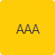

A aplicação correta da paleta de cores traz consistência ao Design System e contribui para garantir uma interface unificada facilmente reconhecível pelos seus usuários. É fundamental que a paleta esteja alinhada aos Princípios do Design System e seja aplicada corretamente na biblioteca de componentes contribuindo para o equilíbrio entre os diversos produtos e sistemas do governo.

---

## Cores Alinhadas aos Princípios

### Experiência Única

A paleta é constituída de 4 conjuntos de cores (**Cores Primárias**, **Cores Secundárias**, **Cores de Aviso** e **Cores de Apoio**), devendo ser aplicada à interface do usuário de acordo com sua finalidade para que identidade visual e a mesma mesma experiência seham mantidas em todos os produtos e sistemas do governo.

> **Exemplo:** Nesse sistema, a cor primária **#1351B4** e suas variantes (no caso do DSGOV as lighten e darken) foram selecionadas como as cores principais para representar a identidade do Governo Federal.

### Eficiência e Clareza

A cor deve indicar o estado e hiearquia dos elementos dispostos em uma interface, facilitando o feedback e comunicação entre a interface e o usuário, ao mesmo tempo que se mantem consistentes ao longo de toda a navegação.

> **Exemplo:** A cor ajuda a indicar quais elementos são interativos, como eles se relacionam com outros elementos. No DS, o azul **#2670E8** foi escolhido como cor de destaque para informar ao usuário o estado de interação ativo.

### Acessibilidade

Um sistema de serviço deve cumprir as diferentes necessidades de acessibilidade. Para tanto, as cores existentes na paleta foram selecionadas para se obter um mínimo de contraste e garantir boa legibilidade nas interfaces digitais.

A [WCAG 2](https://www.w3.org/TR/WCAG20/) (Diretrizes de Acessibilidade para o Conteúdo da Web) descreve que existem vários níveis de conformidade (A, AA ou AAA), de forma que, quanto mais itens são atendidos maior será o nível ou suporte de acessibilidade na interface.

O contraste varia entre 1 a 21 (geralmente descritos 1:1 a 21:1).

O **nível AA** indica que é necessário uma taxa de contraste de pelo menos **4,5:1** para que o texto seja considerado normal e tenha boa legibilidade. Para texto grande a taxa de contraste mínimo deve ser de pelo menos **3:1**.

O **nível AAA** requer uma taxa de contraste de pelo menos **7:1** para texto normal e **4,5:1** para texto grande.

É considerado **texto grande** aquele em que a fonte possui pelo menos 18 pontos (24px, 1,71em, 171% do tamanho padrão da Fonte Base, veja [Tipografia](#) para maiores detalhes) ou 14 pontos em negrito (19px, 1,325em, 132,5%), um texto com tamanho abaixo desses valores (tal como 14pt regular) é considerado **texto normal**.

Elementos gráficos e componentes da interface (como ícones e bordas) seguem as mesmas regras de texto grande.

O Design System do governo trabalha com nível de conformidade **mínima de AA** (dentro da taxa de contraste **4,5:1**), pois acreditamos que ela nos permite uma flexibilidade maior de variações de cores (em relação a conformidade AAA) e atende os critérios mínimos de contraste proposto pela WCAG.

_Observação_: algumas cores foram selecionadas para um uso muito específico, desde modo, elas funcionam no constraste mínimo de 3:1, ou seja, apenas para uso em elementos gráficos (ou texto grande).

> Para testar a acessibilidade das cores foram utilizadas as seguintes ferramentas online https://contrastchecker.com/ e https://webaim.org/resources/contrastchecker/

Neste Design System foi analisada a relação de contraste entre **a cor aplicada aos textos (2 variações que dependendo do brilho do plano de fundo da interface: claro ou escuro) e as cores que compõem a paleta do DS**.

> **Exemplo:** Para o texto em **fundo claro** optou-se pelo uso do cinza **#333333** que possui contraste inferior ao preto, mas suficiente para uma boa leitura na tela. O tom neutro, deixa a composição mais leve, tornando a leitura mais agradável. Para texto em **fundo escuro** optou-se pela cor branca **#FFFFF**.

### Reutilização e Colaboração

Interfaces digitais do governo devem utilizar as cores existentes sempre que possível, mas caso haja necessidade é possível acrescentar um novo tom à paleta de cores do DS. Porém, faz-se necessário, que a cor seja testada do ponto de vista de acessibilidade e passe por uma prévia aprovação da equipe de design do DS.

---

## Cores Primárias

As cores primárias são exibidas com mais frequência nas telas, aparecem nos componentes e títulos do DS e criam uma identidade única para as interfaces. A cor principal #1351B4 é a mais utilizada e suas variantes podem ser utilizadas para compor o layout e distinguir elementos dentro da interface.

São utilizadas nos botões, elementos do cabeçalho, títulos e principais componentes.

| Exemplo                                    | Nome da Cor            | Hexadecimal | Token              | Usos                                                                                                 |
| ------------------------------------------ | ---------------------- | ----------- | ------------------ | ---------------------------------------------------------------------------------------------------- |
|   | Blue Primary Pastel 01 | #DBE8FB     | primary-pastel-01  | ‘Hover’ do Background da Linha da Tabela                                                             |
|   | Blue Primary Pastel 02 | #C5D4EB     | primary-pastel-02  | Linhas (Separadores) da Tabela                                                                       |
|  | Blue Primary Light 25  | #5992ED     | primary-lighten-25 | ‘Hover' do Acordeão sobre fundo escuro                                                               |
|  | Blue Primary Light 15  | #2670E8     | primary-lighten-15 | ‘Hover’ dos Componentes e dos Ícones, Seleção da Linha na Tabela, ‘Focus’ do Input, Ícones dos Cards |
|              | Blue Primary           | #1351B4     | primary            | Botões, Links, Títulos, Ícones                                                                       |
|  | Blue Primary Darken 15 | #0C326F     | primary-darken-15  | Títulos, Menu e Rodapé do Portal                                                                     |
|  | Blue Primary Darken 25 | #071D41     | primary-darken-25  | Cabeçalho, Títulos do Portal                                                                         |

### Acessibilidade

Seguem abaixo as recomendações de cor de texto/elementos gráficos que devem ser seguidas de acordo com cada cor aplicada aos elementos e fundo de tela.

**Cuidado:** Devido ao seu contraste, utilize a cor **Blue Primary Light 25** apenas em contextos de texto grande e elementos gráficos.

| Cor de Fundo                     | Cor de Texto | Texto Normal                                     | Texto Grande                                      | Contraste |
| -------------------------------- | ------------ | ------------------------------------------------ | ------------------------------------------------- | --------- |
| Blue Primary Pastel 01 (#DBE8FB) | #333333      |  |   | 10:1      |
| Blue Primary Pastel 02 (#C5D4EB) | #333333      |   |   | 8,4:1     |
| Blue Primary Light 25 (#5992ED)  | #FFFFFF      | ---                                              |   | 3,1:1     |
| Blue Primary Light 15 (#2670E8)  | #FFFFFF      |  |  | 4,5:1     |
| Blue Primary (#1351B4)           | #FFFFFF      |            |             | 7,3:1     |
| Blue Primary Darken 15 (#0C326F) | #FFFFFF      |  |   | 12,3:1    |
| Blue Primary Darken 25 (#071D41) | #FFFFFF      |  |   | 16,6:1    |

---

## Cores Secundárias

As cores secundárias são utilizadas em situações específicas para complementar as cores primárias. No DSGOV foi escolhida a cor verde para ser utilizada em elementos que merecem um destaque maior no layout (por exemplo os botões de “call to action”).

| Exemplo                                  | Nome da Cor     | Hexadecimal - RGB | Token           | Usos                            |
| ---------------------------------------- | --------------- | ----------------- | --------------- | ------------------------------- |
|  | Green Secundary | #268744           | color-secundary | Botão "Call to Action” e Badges |

Além do verde, foi proposta uma paleta em tons de cinza que é aplicada nos textos e em alguns grafismos que compõem as interfaces digitais (linhas separadoras, contornos, componentes desabilitados).

Indicamos as cores **Gray 7** e **White** para texto (fundo claro e escuro respectivamente), afim de manter um bom contraste entre as demais cores do Design System.

| Exemplo                        | Nome da Cor | Hexadecimal | Token         | Usos                                                      |
| ------------------------------ | ----------- | ----------- | ------------- | --------------------------------------------------------- |
|      | White       | #FFFFFF     | color-white   | Backgrounds e Textos                                      |
|  | Gray 01     | #F8F8F8     | color-gray-01 | Backgrounds                                               |
|  | Gray 02     | #EDEDED     | color-gray-02 |                                                           |
|  | Gray 03     | #CCCCCC     | color-gray-03 | Linhas e Separadores                                      |
|  | Gray 04     | #9E9D9D     | color-gray-04 | Placeholders e Ícones Desabilitados                       |
|  | Gray 05     | #888888     | color-gray-05 | Backgrounds dos Botões Desabilitados, contorno dos Inputs |
|  | Gray 06     | #555555     | color-gray-06 |                                                           |
|  | Gray 07     | #333333     | color-gray-07 | Textos Base, Ícones                                       |
|      | Black       | #000000     | black         |                                                           |

### Acessibilidade

A seguir a relação de contraste entre a cor que deve ser adotada nos textos e as cores secundárias do DSDOV.

**Cuidado:** Devido ao seu contraste, utilize a cor **Gray 05** apenas em contextos de texto grande e elementos gráficos.

| Cor de Fundo              | Cor de Texto | Texto Normal                            | Texto Grande                             | Contraste |
| ------------------------- | ------------ | --------------------------------------- | ---------------------------------------- | --------- |
| Green Secundary (#268744) | #FFFFFF      |  |  | 4,5:1     |
| White (#FFFFFF)           | #333333      |     |      | 12,6:1    |
| Gray 01 (#F8F8F8)         | #333333      |   |    | 11,8:1    |
| Gray 02 (#EDEDED)         | #333333      |   |    | 10,7:1    |
| Gray 03 (#CCCCCC)         | #333333      |    |    | 7,8:1     |
| Gray 04 (#9E9D9D)         | #333333      |    |    | 4,6:1     |
| Gray 05 (#888888)         | #FFFFFF      | ---                                     |     | 3,5:1     |
| Gray 06 (#555555)         | #FFFFFF      |    |    | 7,4:1     |
| Gray 07 (#333333)         | #FFFFFF      |   |    | 12,6:1    |
| Black (#000000)           | #FFFFFF      |     |      | 21:1      |

---

## Cores de Aviso

As cores de aviso foram escolhidas para serem aplicadas em situações que exigem mais atenção do usuário, como ocorre nas mensagens de Feedback e estados correlacionados.

| Exemplo                        | Nome da Cor    | Hexadecimal | Token         | Usos                                       |
| ------------------------------ | -------------- | ----------- | ------------- | ------------------------------------------ |
|  | Yellow Warning | #FFCD07     | color-warning | Mensagens de Aviso                         |
|  | Green Sucess   | #168821     | color-success | Mensagens de Sucesso, Validações Positivas |
|    | Red Danger     | #E60000     | color-danger  | Mensagens de Erro, Validações Negativas    |
|        | Blue Info      | #155BCB     | color-info    | Mensagens Informativa                      |

### Acessibilidade

A seguir a relação de contraste entre a cor do texto a serem utilizados sobre as cores de aviso.

| Cor de Fundo             | Cor de Texto | Texto Normal                           | Texto Grande                           | Contraste |
| ------------------------ | ------------ | -------------------------------------- | -------------------------------------- | --------- |
| Yellow Warning (#FFCD07) | #333333      |  |  | 8,4:1     |
| Green Sucess (#168821)   | #FFFFFF      |   |  | 4,5:1     |
| Red Danger (#E60000)     | #FFFFFF      |    |   | 4,8:1     |
| Blue Info (#155BCB)      | #FFFFFF      |      |     | 6,1:1     |

---

## Cores de Apoio

As cores de apoio podem ser aplicadas quando houver necessidade de variação de tons em alguns elementos da tela, como por exemplo: retirar um aspecto monocromático da interface ou marcar textos resultantes de uma busca.

Utilize as cores de apoio somente em elementos gráficos e textos grandes.

| Exemplo                      | Nome da Cor | Hexadecimal | Token        | Usos |
| ---------------------------- | ----------- | ----------- | ------------ | ---- |
|      | Teal        | #36A191     | color-teal   | -    |
|  | Yellow      | #F2E317     | color-yellow | -    |
|  | Orange      | #DB4800     | color-orange | -    |
|    | Brown       | #A26739     | color-brown  | -    |

### Acessibilidade

A seguir a relação de contraste entre a cor do texto a ser utilizado sobre as cores de apoio.

**Cuidado:** Devido ao seu contraste, utilize as cores **Teal** e **Orange** apenas em contextos de texto grande e elementos gráficos.

| Cor de Fundo     | Cor de Texto | Texto Normal                          | Texto Grande                                | Contraste |
| ---------------- | ------------ | ------------------------------------- | ------------------------------------------- | --------- |
| Teal (#36A191)   | #FFFFFF      | ---                                   |           | 3,1:1     |
| Yellow (#F2E317) | #333333      |  |        | 9,4:1     |
| Orange (#DB4800) | #FFFFFF      | ---                                   |         | 4,2:1     |
| Brown (#A26739)  | #FFFFFF      |    |  | 4,6:1     |
