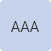
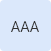
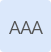
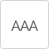
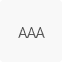
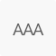
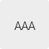

[artefato fonte de design]: # 'cores_6.0.1.xd'

A aplicação correta da paleta de cores traz consistência ao Design System e contribui para garantir uma interface unificada facilmente reconhecível pelos seus usuários.É fundamental que a paleta esteja alinhada aos Princípios do Design System e seja aplicada corretamente na biblioteca de componentes contribuindo para o equilíbrio entre os diversos produtos e sistemas do governo.

---

## Cores Alinhadas aos Princípios

### Experiência Única

A paleta é constituída de 5 conjuntos de cores (**Cores Primárias**, **Cores Secundárias**, **Cores de Destaque**, **Cores de Aviso** e **Cores de Apoio**), devendo ser aplicada à interface do usuário de acordo com sua finalidade para que identidade visual e a mesma mesma experiência sejam mantidas em todos os produtos e sistemas do governo.

> **Exemplo:** Nesse sistema, a cor primária **#1351B4** e suas variantes foram selecionadas como as cores principais para representar a identidade do Governo Federal.

### Eficiência e Clareza

A cor deve indicar o estado e hierarquia dos elementos dispostos em uma interface, facilitando o feedback e comunicação entre a interface e o usuário, ao mesmo tempo que se mantêm consistentes ao longo de toda a navegação.

> **Exemplo:** A cor ajuda a indicar quais elementos são interativos, como eles se relacionam com outros elementos. No DS, o azul **#1351B4** foi escolhido como cor de destaque para informar ao usuário o estado de interação.

### Acessibilidade

Um sistema de serviço deve cumprir as diferentes necessidades de acessibilidade. Para tanto, as cores existentes na paleta foram selecionadas para se obter um mínimo de contraste e garantir boa legibilidade nas interfaces digitais.

A [WCAG 2](https://www.w3.org/TR/WCAG20/) (Diretrizes de Acessibilidade para o Conteúdo da Web) descreve que existem vários níveis de conformidade (A, AA ou AAA), de forma que, quanto mais itens são atendidos maior será o nível ou suporte de acessibilidade na interface.

O contraste varia entre 1 a 21 (geralmente descritos 1:1 a 21:1).

O **nível AA** indica que é necessário uma taxa de contraste de pelo menos **4, 5:1** para que o texto seja considerado normal e tenha boa legibilidade. Para texto grande a taxa de contraste mínimo deve ser de pelo menos **3:1**.

O **nível AAA** requer uma taxa de contraste de pelo menos **7:1** para texto normal e **4, 5:1** para texto grande.

É considerado **texto grande** aquele em que a fonte possui pelo menos 18 pontos (24px, 1, 71em, 171% do tamanho padrão da Fonte Base, veja [Tipografia](/ds/fundamentos-visuais/tipografia) para maiores detalhes) ou 14 pontos em negrito (19px, 1, 325em, 132, 5%), um texto com tamanho abaixo desses valores (tal como 14pt regular) é considerado **texto normal**.

Elementos gráficos e componentes da interface (como ícones e bordas) seguem as mesmas regras de texto grande.

O Design System do governo trabalha com nível de conformidade **mínima de AA** (dentro da taxa de contraste **4, 5:1**), pois acreditamos que ela nos permite uma flexibilidade maior de variações de cores (em relação a conformidade AAA) e atende os critérios mínimos de contraste proposto pela WCAG.

_Observação_: algumas cores foram selecionadas para um uso muito específico, deste modo, elas funcionam no contraste mínimo de 3:1, ou seja, apenas para uso em elementos gráficos (ou texto grande).

> Para testar a acessibilidade das cores foram utilizadas as seguintes ferramentas online https://contrastchecker.com/ e https://webaim.org/resources/contrastchecker/

Neste Design System foi analisada a relação de contraste entre **a cor aplicada aos textos (2 variações que dependendo do brilho do plano de fundo da interface: claro ou escuro) e as cores que compõem a paleta do DS**.

> **Exemplo:** Para o texto em **fundo claro** optou-se pelo uso do cinza **#333333** que possui contraste inferior ao preto, mas suficiente para uma boa leitura na tela. O tom neutro, deixa a composição mais leve, tornando a leitura mais agradável. Para texto em **fundo escuro** optou-se pela cor branca **#FFFFF**.

### Reutilização e Colaboração

Interfaces digitais do governo devem utilizar as cores existentes sempre que possível, mas caso haja necessidade é possível acrescentar um novo tom à paleta de cores do DS. Porém, faz-se necessário, que a cor seja testada do ponto de vista de acessibilidade e passe por uma prévia aprovação da equipe de design do DS.

---

## Cores Primárias

As cores primárias são usadas como padrão de elementos interativos. Tenha cuidado quando utilizar a cor primária e suas variantes em elementos que não possua nenhum tipo de interação.

As variantes pastel são as cores com alta luminosidade e com pouco saturação, enquanto as demais trabalham com saturações próximas, mas com brilho gradativo, indo do mais claro para o mais escuro, tendo como base a cor **Primary Default**.

A cor **Primary Default** é usada como padrão de hiperlinks.

Utilize a documentação encontrada no fundamento [Estado](/ds/fundamentos-visuais/estados), para ajudar a aplicar a paleta de cor em diferentes níveis de interação.

| Exemplo                                               | Categoria da Cor   | Hexadecimal | Token                      |
| ----------------------------------------------------- | ------------------ | ----------- | -------------------------- |
| 

   | Primary Pastel 02  | #DBE8FB     | --color-primary-pastel-02  |
| 

   | Primary Pastel 01  | #C5D4EB     | --color-primary-pastel-01  |
| 

 | Primary Lighten 02 | #5992ED     | --color-primary-lighten-02 |
| 

 | Primary Lighten 01 | #2670E8     | --color-primary-lighten-01 |
| 

               | Primary Default    | #1351B4     | --color-primary-default    |
| 

   | Primary Darken 01  | #0C326F     | --color-primary-darken-01  |
| 

   | Primary Darken 02  | #071D41     | --color-primary-darken-02  |

### Acessibilidade

Seguem abaixo as recomendações de cor de texto/elementos gráficos que devem ser seguidas de acordo com cada cor aplicada aos elementos e fundo de tela.

**Cuidado:** Devido ao seu contraste, utilize a cor **Primary Light 02** apenas em contextos de texto grande e elementos gráficos.

| Cor de Fundo                 | Cor de Texto | Texto Normal                                      | Texto Grande                                       | Contraste |
| ---------------------------- | ------------ | ------------------------------------------------- | -------------------------------------------------- | --------- |
| Primary Pastel 02 (#DBE8FB)  | #333333      | 

 | 

  | 10:1      |
| Primary Pastel 01 (#C5D4EB)  | #333333      | 

  | 

  | 8, 4:1     |
| Primary Lighten 02 (#5992ED) | #FFFFFF      | ---                                               | 

  | 3, 1:1     |
| Primary Lighten 01 (#2670E8) | #FFFFFF      | 

 | 

 | 4, 5:1     |
| Primary Default (#1351B4)    | #FFFFFF      | 

           | 

            | 7, 3:1     |
| Primary Darken 01 (#0C326F)  | #FFFFFF      | 

 | 

  | 12, 3:1    |
| Primary Darken 02 (#071D41)  | #FFFFFF      | 

 | 

  | 16, 6:1    |

---

## Cores Secundárias

As cores secundárias são utilizadas em textos, em fundos das superfícies dos componentes (backgrounds), em separadores de áreas ou de elementos (bordas).

Indicamos as cores **Secondary 08** e **Secondary 01** para texto (fundo claro e escuro respectivamente), a fim de manter um bom contraste entre as demais cores do Design System.

As cores secundárias trabalham com o brilho da cor, indo do mais claro **Secondary 01** até o mais escuro **Secondary 09**.

| Exemplo                              | Categoria da Cor | Hexadecimal | Token                |
| ------------------------------------ | ---------------- | ----------- | -------------------- |
| 

   | Secondary 01     | #FFFFFF     | --color-secondary-01 |
| 

 | Secondary 02     | #F8F8F8     | --color-secondary-02 |
| 

 | Secondary 03     | #EDEDED     | --color-secondary-03 |
| 

 | Secondary 04     | #CCCCCC     | --color-secondary-04 |
| 

 | Secondary 05     | #9E9D9D     | --color-secondary-05 |
| 

 | Secondary 06     | #888888     | --color-secondary-06 |
| 

 | Secondary 07     | #555555     | --color-secondary-07 |
| 

 | Secondary 08     | #333333     | --color-secondary-08 |
| 

   | Secondary 09     | #000000     | --color-secondary-09 |

### Acessibilidade

A seguir a relação de contraste entre a cor que deve ser adotada nos textos e as cores secundárias do DSDOV.

**Cuidado:** Devido ao seu contraste, utilize a cor **Secondary 06** apenas em contextos de texto grande e elementos gráficos.

| Cor de Fundo           | Cor de Texto | Texto Normal                            | Texto Grande                            | Contraste |
| ---------------------- | ------------ | --------------------------------------- | --------------------------------------- | --------- |
| Secondary 01 (#FFFFFF) | #333333      | 

   | 

   | 12, 6:1    |
| Secondary 02 (#F8F8F8) | #333333      | 

 | 

 | 11, 8:1    |
| Secondary 03 (#EDEDED) | #333333      | 

 | 

 | 10, 7:1    |
| Secondary 04 (#CCCCCC) | #333333      | 

  | 

 | 7, 8:1     |
| Secondary 05 (#9E9D9D) | #333333      | 

  | 

 | 4, 6:1     |
| Secondary 06 (#888888) | #FFFFFF      | ---                                     | 

  | 3, 5:1     |
| Secondary 07 (#555555) | #FFFFFF      | 

  | 

 | 7, 4:1     |
| Secondary 08 (#333333) | #FFFFFF      | 

 | 

 | 12, 6:1    |
| Secondary 09 (#000000) | #FFFFFF      | 

   | 

   | 21:1      |

---

## Cor de Destaque

A cor de destaque é utilizada para impor alta ênfase em um determinado elemento da interface (como nos botões de “call to action”).

No DSGOV ela só pode ser utilizada em um único elemento ou componente por tela. Podendo ou não ser interativo.

| Exemplo                             | Categoria da Cor | Hexadecimal - RGB | Token             |
| ----------------------------------- | ---------------- | ----------------- | ----------------- |
| 

 | Highlight        | #268744           | --color-highlight |

### Acessibilidade

A seguir a relação de contraste entre a cor que deve ser adotada nos textos utilizando a cor Destaque do DSDOV.

| Cor de Fundo        | Cor de Texto | Texto Normal                             | Texto Grande                              | Contraste |
| ------------------- | ------------ | ---------------------------------------- | ----------------------------------------- | --------- |
| Highlight (#268744) | #FFFFFF      | 

 | 

 | 4, 5:1     |

---

## Cores de Aviso

As cores de aviso foram escolhidas para serem aplicadas em situações que exigem mais atenção do usuário, como ocorre nas mensagens de Feedback e estados correlacionados.

| Exemplo                         | Categoria da Cor | Hexadecimal | Token                 | Usos                                       |
| ------------------------------- | ---------------- | ----------- | --------------------- | ------------------------------------------ |
| 

 | Warning          | #FFCD07     | --color-alarm-warning | Mensagens de Aviso                         |
| 

 | Success          | #168821     | --color-alarm-success | Mensagens de Sucesso, Validações Positivas |
| 

   | Danger           | #E60000     | --color-alarm-danger  | Mensagens de Erro, Validações Negativas    |
| 

       | Info             | #155BCB     | --color-alarm-info    | Mensagens Informativa                      |

### Acessibilidade

A seguir a relação de contraste entre a cor do texto a serem utilizados sobre as cores de aviso.

| Cor de Fundo      | Cor de Texto | Texto Normal                            | Texto Grande                            | Contraste |
| ----------------- | ------------ | --------------------------------------- | --------------------------------------- | --------- |
| Warning (#FFCD07) | #333333      | 

 | 

 | 8, 4:1     |
| Success (#168821) | #FFFFFF      | 

  | 

 | 4, 5:1     |
| Danger (#E60000)  | #FFFFFF      | 

   | 

  | 4, 8:1     |
| Info (#155BCB)    | #FFFFFF      | 

     | 

    | 6, 1:1     |

---

## Cores de Apoio

As cores de apoio podem ser aplicadas quando houver a necessidade de variação de tons em alguns elementos da tela, como por exemplo: retirar um aspecto monocromático da interface ou marcar textos resultantes de uma busca.

Utilize as cores de apoio somente em elementos gráficos e textos grandes.

| Exemplo                           | Categoria da Cor | Hexadecimal | Token              |
| --------------------------------- | ---------------- | ----------- | ------------------ |
| 

   | Support 01       | #36A191     | --color-support-01 |
| 

 | Support 02       | #F2E317     | --color-support-02 |
| 

 | Support 03       | #DB4800     | --color-support-03 |
| 

  | Support 04       | #A26739     | --color-support-04 |

### Acessibilidade

A seguir a relação de contraste entre a cor do texto a ser utilizado sobre as cores de apoio.

**Cuidado:** Devido ao seu contraste, utilize as cores **Support 01** e **Support 03** apenas em contextos de texto grande e elementos gráficos.

| Cor de Fundo         | Cor de Texto | Texto Normal                           | Texto Grande                           | Contraste |
| -------------------- | ------------ | -------------------------------------- | -------------------------------------- | --------- |
| Support 01 (#36A191) | #FFFFFF      | ---                                    | 

    | 3, 1:1     |
| Support 02 (#F2E317) | #333333      | 

 | 

 | 9, 4:1     |
| Support 03 (#DB4800) | #FFFFFF      | ---                                    | 

  | 4, 2:1     |
| Support 04 (#A26739) | #FFFFFF      | 

   | 

  | 4, 6:1     |

