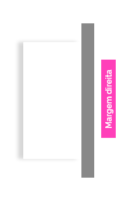
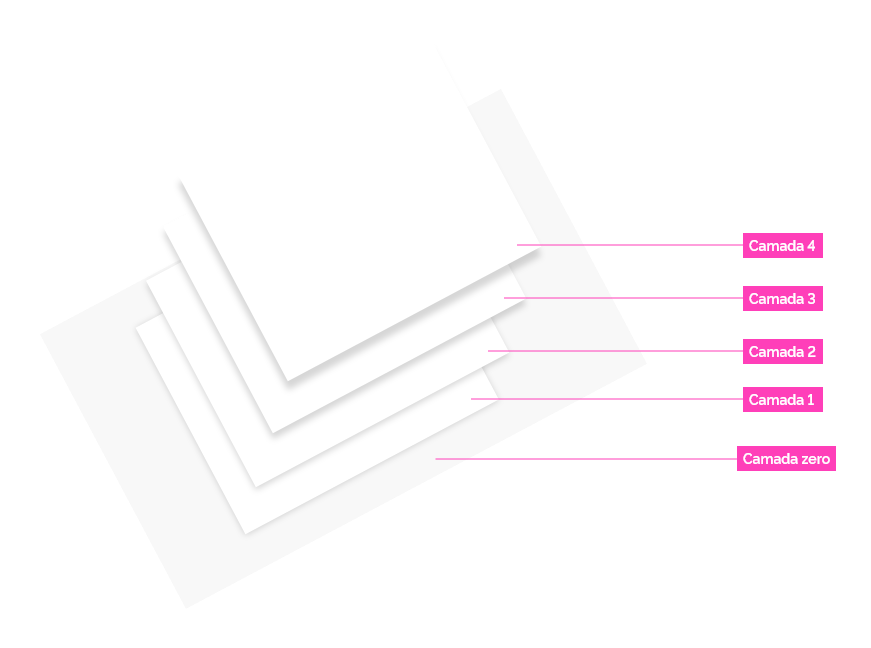
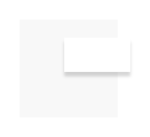
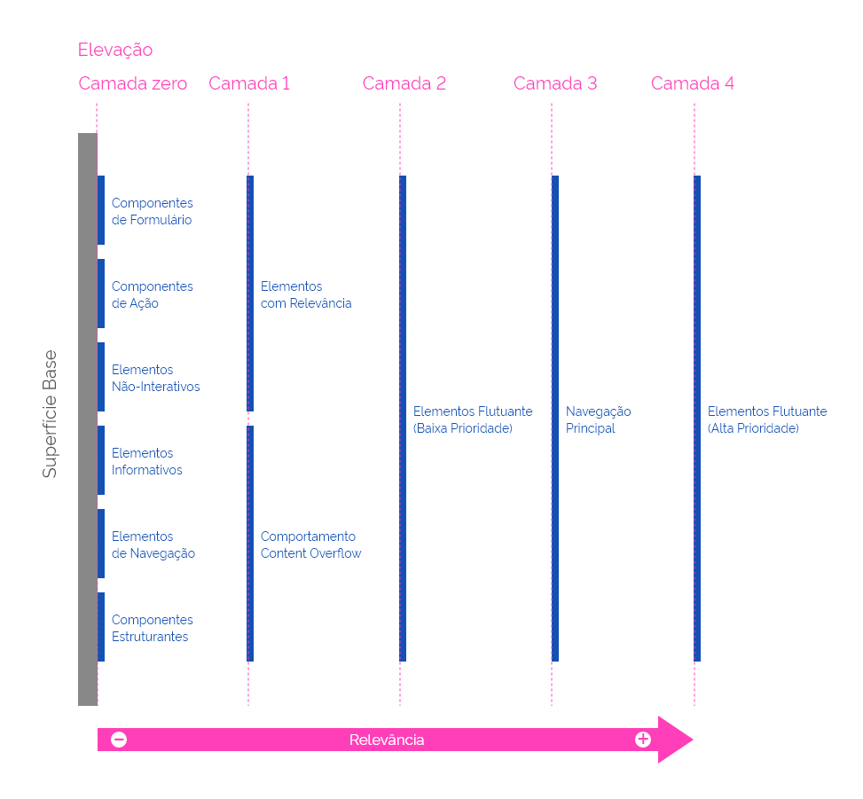
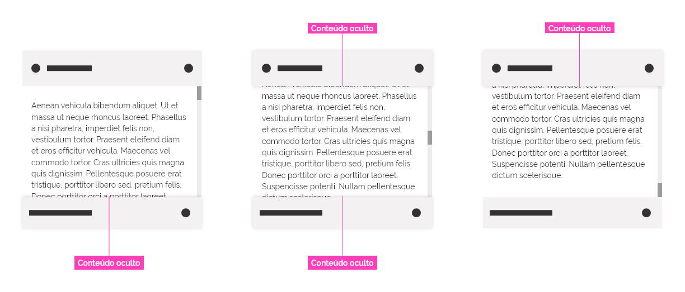

[version]: # (1.0.4)

Elevação é um aspecto importante na organização do _layout_ pois permite que o usuário entenda a relação hierárquica entre diferentes elementos na tela.

De forma geral, a ilusão de elevação é algo que funciona melhor quando passa despercebida e buscamos  fazer exatamente isso, com o uso sutil de diferentes intensidades de sombras  que se destinam a complementar a sensação de hierarquia entre os elementos do _layout_.

---

## Princípios

### Experiência Única

- É a função exercida pelo componente ou elemento que irá definir a camada onde ele deve se localizar. A sombra também é definida pela camada, isto é, pela elevação em que se encontra em relação a uma camada de referência..

### Eficiência e Clareza

- O efeito de elevação deve fazer com que os elementos pareçam empilhados uns sobre os outros mas que não possam passar entre si.

- O elemento com maior relevância ou destaque deve se encontrar na elevação mais alta, como por exemplo, uma caixa de diálogo que aparece temporariamente sobre os demais elementos da tela.

- Não utilize apenas como elemento puramente decorativo sem a intenção de colocá-lo em destaque.

- A elevação de uma camada não é adicionada ao conteúdo (imagine as camadas sem espessura).

### Acessibilidade

- Em leitores de tela a elevação deve estar implícita, isto é, o leitor deve priorizar a leitura dos elementos que se encontram em camadas mais altas.

---

## Sombra

A elevação é representada no Design System GOV.BR por meio de sombras projetadas com diferentes intensidades de acordo com a elevação em que o elemento se encontra. O uso de sombras auxilia na percepção da altura do elemento em relação a uma determinada superfície.

*Exemplos de sombras utlizadas no Design System GOV.BR.*

### Atributos

#### 1. _Inner Shadow_ (Sombra Interna)

Refere-se ao valor da sombra interna podendo ser: `inset`,`none`

| Inner Shadow |  Value  |
| :----------: | :-----: |
|   Interna    | `inset` |
|   Externa    | `none`  |

#### 2. _Offset_ (Projeção)

Refere-se ao deslocamento da posição da sombra tanto no eixo X como no eixo Y.

Por ser um elemento de _feedback_ visual que representa a elevação do elemento é importante que a sombra esteja visível. Por tanto controle a projeção da sombra do elemento, ou seja, o atributo _Offset_.

**Por padrao o valor é zero no eixo X e positivo no eixo Y.** Porém em casos em que o elemento se encontra nas margens da tela a direção da sombra poderá ser alterada.

| Offset (px) |      Offset Token       |
| :---------: | :---------------------: |
|     -9      | `--surface-offset-xl-n` |
|     -6      | `--surface-offset-lg-n` |
|     -3      | `--surface-offset-md-n` |
|     -1      | `--surface-offset-sm-n` |
|      0      | `--surface-offset-none` |
|      1      |  `--surface-offset-sm`  |
|      3      |  `--surface-offset-md`  |
|      6      |  `--surface-offset-lg`  |
|      9      |  `--surface-offset-xl`  |

Acompanhe os exemplos a seguir:

*Exemplo da sombra com o eixo Y positivo (sombra inferior).*

*Exemplo da sombra com o eixo Y negativo (sombra superior).*

*Exemplo da sombra com o eixo X positivo (sombra à direita).*

*Exemplo da sombra com o eixo X negativo (sombra à esquerda).*

#### 3. _Blur_ (Suavidade)

Define o nível de suavidade da sombra.

| Blur (px) |      Blur Token       |
| :-------: | :-------------------: |
|     0     | `--surface-blur-none` |
|     1     |  `--surface-blur-sm`  |
|     3     |  `--surface-blur-md`  |
|     6     |  `--surface-blur-lg`  |
|     9     |  `--surface-blur-xl`  |

#### 4. _Color_ (Cor)

Pode assumir qualquer cor prevista na [paleta de cores](/fundamentos-visuais/cores) do Design System GOV.BR.

#### 5. _Color Opacity_ (Opacidade da Cor)

Valor da opacidade da cor utilizada.

Veja os valores possíveis nos atributos de opacidade no [Fundamento de Superfície](/fundamentos-visuais/superficie).

### _Tokens_ e exemplos do uso de sombras

No Design System GOV.BR sombras são utilizadas de forma simplificada. Dessa forma, foram criadas _tokens_ de sombras prontas para o uso.

Visite nossa [página de utilitários](/utilities-css/elevacao) para visualizar todas as possibilidades possíveis de uso de sombras e _tokens_.

---

## Camadas

Camadas são planos "imaginários" e sem espessura que servem de suporte para o apoio dos componentes criando elevações distintas.

A elevação é a distância implícita acima da camada zero. O efeito da elevação em uma camada é definido pela intensidade da sombra que ela projeta.

Cada camada recebe o nome de **zero, 1, 2, 3 e 4** e quanto maior o número, mais distante a camada se encontra da camada zero e consequentemente uma sombra mais intensa é projetada na camada imediatamente abaixo.

*Exemplo de empilhamento de camadas com as sombras projetadas.*

Por exemplo, imagine um elemento que se encontra na camada 4. Ele está localizado mais próximo da vista do usuário que um elemento na camada 3, e assim por diante. Esse empilhamento de camadas cria uma hierarquia espacial entre os componentes e que, de forma sutil, permite que o usuário consiga perceber quais elementos têm maior relevância na tela.

*Exemplo de empilhamento de camadas.*

**Atenção:** itens que se encontram em uma mesma camada não podem ocupar o mesmo espaço na tela.

O atributo que determina a intensidade da sombra é o `offset`. Sabe-se que os outros atributos também interferem no _feedback_ visual da sombra (como o `blur`) porém, a fim de simplificar a utilização, ficou decidido que **por padrão** os demais atributos permancem com valores fixos e somente o `offset` varia conforme a camada em que o elemento se encontra.

### Tabela de valores padrão de sombra

| Inner Shadow | Offset * |        Blur         |    Color     |     Color Opacity      |
| :----------: | :------: | :-----------------: | :----------: | :--------------------: |
|    `none`    | variável | `--surface-blur-lg` | `--pure-100` | `--surface-opacity-xs` |
_* O valor depende da camada em que o elemento se encontra. Veja adiante mais detalhes._

### Camada zero

Todos os _layouts_ têm uma camada base, sobre a qual todas as demais ficarão apoiadas. Chamamos de camada zero e é sempre a camada de referência para todas as outras.

É nesta camada que geralmente se encontra a maior parte do conteúdo, como:

- **Componentes de formulário:** _input_, _checkbox_, _radio_, _textarea_, _switch_, _upload_, etc.;
- **Componentes de ação:** buttons, _links_, _sign-in_, _tag_ interativa, etc.;
- **Elementos não-interativos:** texto, ícone, ilustração, _divider_, _tag_ não interativa, etc.;
- **Elementos informativos:** _table_, _breadcrumb_, _list_, _pagination_, message, _loading_ etc.;
- **Elementos de navegação:** tabs, _wizard_, etc.;
- **Componentes estruturantes:**  _footer_, menu contextual, etc.

Os componentes que se encontram nesta camada **não projetam sombras**.

*Exemplo de objeto na camada zero.*

#### Valores de _offset_ e _token_ da camada zero

| Offset (px) |      Offset Token       |
| :---------: | :---------------------: |
|      0      | `--surface-offset-none` |

| Camada |     Layer Token     |
| :----: | :-----------------: |
|  zero  | `--z-index-layer-0` |

### Camada 1

A camada 1e se encontra um nível acima da camada zero. Nessa camada podemos encontrar elementos que por padrão possuem **maior relevância** que os da camada zero.

São os casos dos:

- _Header_;
- Menu fixo;
- _Card_;
- _Magic button_.

**Atenção:** o comportamento **_content overflow_** deve se encontrar nesta camada. Veja detalhes mais adiante.

Os componentes que se se encontram nesta camada projetam uma sombra suave que axiliam na sua relevância.

*Exemplo de objeto na camada 1.*

#### Valores de _offset_ e _token_ da camada 1

| Offset (px) |      Offset Token       |
| :---------: | :---------------------: |
|     -1      | `--surface-offset-sm-n` |
|      1      |  `--surface-offset-sm`  |

| Camada |     Layer Token     |
| :----: | :-----------------: |
|   1    | `--z-index-layer-1` |

### Camada 2

A camada 2 é reservada para **elementos flutuantes de baixa prioridade**, isto é, são partes de componentes que podem ser visíveis por meio de uma ação do usuário.

São os casos dos:

- _DateTimePicker_, _notification_, _select_, etc.

Os componentes que se se encontram nesta camada projetam uma sombra mais pronunciada.

*Exemplo de objeto na camada 2.*

#### Valores de _offset_ e _token_ da camada 2

| Offset (px) |      Offset Token       |
| :---------: | :---------------------: |
|     -3      | `--surface-offset-md-n` |
|      3      |  `--surface-offset-md`  |

| Camada |     Layer Token     |
| :----: | :-----------------: |
|   2    | `--z-index-layer-2` |

### Camada 3

A camada 3 é exclusiva para componentes de **navegação principal quando possuir comportamento flutuante**.

São os casos dos:

- Menu flutuante;
- _Sticky header_;
- _Sticky footer_, etc.

Os componentes que se se encontram nesta camada projetam uma sombra ainda mais pronunciada.

*Exemplo de objeto na camada 3.*

#### Valores de _offset_ e _token_ da camada 3

| Offset (px) |      Offset Token       |
| :---------: | :---------------------: |
|     -6      | `--surface-offset-lg-n` |
|      6      |  `--surface-offset-lg`  |

| Camada |     Layer Token     |
| :----: | :-----------------: |
|   3    | `--z-index-layer-3` |

### Camada 4

A camada 4 é reservada para os **elementos flutuantes de alta prioridade**, isto é, elementos que trazem conteúdo crítico ou urgente para o usuário ou para o sistema.

São os casos dos:

- _Loading_ (quando houver superfície), _tooltip_, modal, _cookieBar_, etc.;

Os componentes que se se encontram nesta camada projetam a sombra com a maior intensidade possível.

*Exemplo de objeto na camada 4.*

#### Valores de _offset_ e _token_ da camada 4

| Offset (px) |      Offset Token       |
| :---------: | :---------------------: |
|     -9      | `--surface-offset-xl-n` |
|      9      |  `--surface-offset-xl`  |

| Camada |     Layer Token     |
| :----: | :-----------------: |
|   4    | `--z-index-layer-4` |

A seguir, a tabela de camadas resume visualmente o conceito de camadas utilizado no Design System GOV.BR:

*Tabela de hierarquia de camadas.*

---

## Comportamentos

### 1- _Content Overflow_

Uma das maneiras de indicar ao usuário que há mais informações para serem visualizadas em um espaço limitado é por meio de rolagem. Neste caso, os elementos do componente que limitam este espaço devem subir para a camada 1 nos momentos em que ocultam o conteúdo.

Vejo o exemplo a seguir:

*Exemplo do comportamento _content overflow_ com o conteúdo rolando sob a estrutura superior e inferior.*
