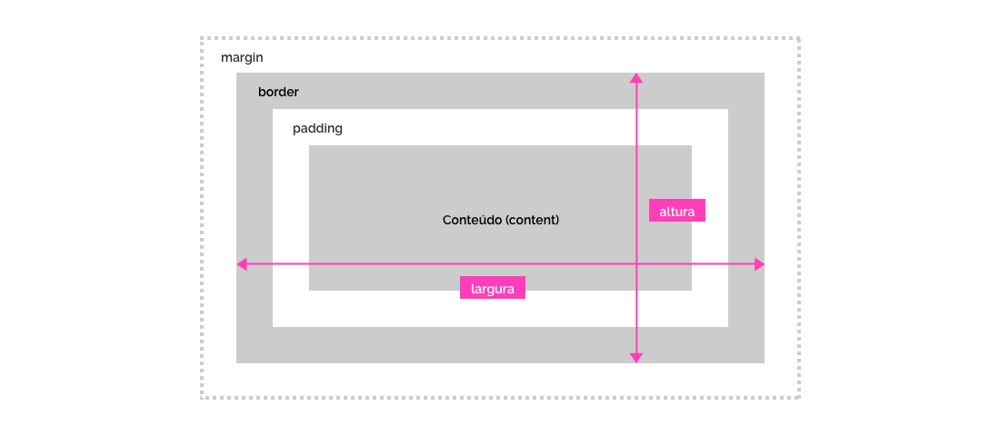

[version]: # '1.0.0'

Espaçamento é a distância entre um elemento a outro representado por alguma unidade métrica. O espaçamento é um fundamento do design visual que frequentemente cria uma lacuna entre os designers e os desenvolvedores ao projetar uma interface. Para evitar essa situação, o DS Gov cria e detalha termos em um sistema flexível, possibilitando layouts funcionais e consistentes.

---

## Princípios

### Experiência Única

Existem 2 escalas de espaçamento no DS GOV que devem ser respeitadas. Utilizando-se dessas escalas é possível criar layouts flexíveis e ao mesmo tempo manter a consistência visual entre diferentes serviços e produtos dentro do DS GOV.

### Eficiência e Clareza

Todo elemento em uma interface pode possuir 2 tipos de espaçamento: interno (_padding_) e externo (_margin_). Detalhe cada um desses espaços para que o elemento se comporte corretamente dentro de uma grid.

Os métodos de espaços usados no elemento devem ser claros.

### Acessibilidade

Utilizar espaços entre os elementos é a melhor forma de proporcionar uma boa legibilidade e organização do conteúdo. No design existe um termo chamado de espaço em branco que ajudam neste contexto.

Os espaços em branco (_white space_ ou _negative space_) são recursos visuais que ajuda a tornar um layout mais agradável. Criam hierarquia nas informações (dando foco no que for mais importante) e criam relacionamento entre os elementos (aplicando distância entre os não semelhantes e a proximidade dos semelhantes).

Os espaços em branco também são importantes para leitura, pois criam áreas de respiro no layout, isto é, espaços onde o olhar do leitor pode descansar, e por fim manter o fluxo de leitura.

### Reutilização e Colaboração

Interfaces digitais do governo devem utilizar as escalas de espaçamentos existentes, além de todas as informações contidas neste documento sempre que possível. Havendo, entretanto, a necessidade de acrescentar ou editar o documento atual, é necessário validar a nova proposta pela equipe de design do DS GOV.

---

## Tipos de espaçamento

Quando um objeto é renderizado/exibido em uma tela, o navegador ou o aplicativo que está renderizando-o, interpreta todos eles como uma caixa retangular. Essa caixa é chamada de Box Model.

A anatomia desta caixa é feita pelas seguintes propriedades: conteudo, padding, border e margin.

_Propriedades básicas do Box-model_

Apesar de nem todos os elementos respeitarem essas propriedades (pois possuem comportamentos variados), entender seu funcionamento é importante para determinar as dimensões, o espaçamento e a interação do objeto de um modo geral.

No DS GOV, o comportamento das dimensões de um objeto é determinada pela regra: `box-sizing: border-box`. Ou seja, as propriedades de largura (width) e de altura (height) incluem o tamanho do padding e do border, mas não incluem a margin.

_Comportamento das dimensões do Box-Model utilizado no DS GOV_

Observando somente as propriedades de espaçamento, podemos então categorizá-los dentro do DS Gov em **Interno** e **Externo**.

_Tipos de Espaçamento no DS GOV: Interno e Externo_

### Espaçamento Interno

É frequentemente usado para criar espaços de respiro, facilitando a legibilidade de uma informação, além da indentação de textos e qualquer elemento contido em outro.

A propriedade `padding` define a área de espaçamento interno nos quatro lados do elemento. Podendo também ser descrito de forma separada: `padding-top` (cima), `padding-right` (direita), `padding-bottom` (baixo), e `padding-left` (esquerda).

_Exemplo do Espaçamento Interno em um componente_

### Espaçamento Externo

Utilizado para criar os **espaços em branco**, criando hierarquia entre os elementos de uma tela e agrupando elementos relacionados.

Espaçamento externo são utilizados para criar as **Áreas de Segurança** ou **Área de Proteção**. Área de segurança é basicamente um _**espaço em branco**_ voltado para um componente específico, criado para garantir que as funcionalidade e características hierárquicas descritas na diretriz, sejam executadas sem falhas e sem interferências de outros elementos.

A propriedade `margin` define a área de espaçamento externo nos quatro lados do elemento. Podendo também ser descrito de forma separada: `margin-top` (cima), `margin-right` (direita), `margin-bottom` (baixo), e `margin-left` (esquerda).

_Exemplo do Espaçamento Externo em um componente_

### Sangria

Da mesma forma como acontece na Grid, dentro dos elementos também podem acontecer a sangria: quando um elemento invade os **espaçamento interno** de outros (como um separador dentro de um card, por exemplo).

Por padrão, os espaços devem ser respeitados, a não ser que seja detalhado o contrário dentro da documentação do componente.

Ao criar um componente, especifique se existe um comportamento "sangrar" (para os espaços internos de outros componente, por exemplo) e verifique também se o componente pai permite esse tipo de comportamento.

_Elementos "sangrando" dentro de um componente_

### Espaçamento VS Borda (Ferramentas de Design)

Como visto no Box Model, o border (borda) é uma propriedade que também ocupa espaço. Infelizmente, a maioria das ferramentas de design desconsideram essa propriedade quando medem distância entre elementos. Fato que, ao ser desenvolvido para web, o layout acaba com comportamentos inesperados.

_Ferramenta desconsiderando a borda para o espaçamento_

Para representar a regra do `box-sizing: border-box` o designer pode configurar sua ferramenta para utilizar traçado interno (border inline). Porém, a borda ainda não contará como espaço nas ferramentas.

_Configurando comportamento da borda nas ferramentas de design_

O designer deve entender esse comportamento e a limitação da sua ferramenta para prever problemas relacionados a espaçamento dentro da criação da sua interface.

---

## Métodos de Espaçamento

Os métodos de espaçamento são um conjunto de regras sobre como posicionar elementos em um template ou em um componente.

Existem 3 tipos de métodos: **Dimensão**, **Alinhamento** e **Escala**. Enquanto as duas primeiras influenciam indiretamente, a última influencia diretamente nos tipos de espaçamento.

Dificilmente é encontrado um único método isolado no elemento. O mais comum é seu uso de forma colaborativa, em conjunto, mesclando diversos métodos em um único elemento, componente ou template.

### Dimensão

As dimensões referem-se à largura e altura dos elementos. Os componentes descrevem a sua altura ou largura (seja por valores absolutos ou relativos), ou as vezes apenas estão atrelados as colunas de uma grid.

Neste método, o espaçamento interno do elemento pode variar fazendo com que métodos fixos (como de escala) não façam muito sentido.

Ao especificar as dimensões de um elemento, utilize as boas práticas abaixo:

-   Evite fixar valores absolutos nas dimensões dos componentes quando ele for constituído por vários elementos internos. Prefira adicionar regras aos elementos filhos para controlar as dimensões do pai.
-   Quando fixar valores absolutos nas dimensões pode ser importante detalhar a largura e altura máxima/mínima para evitar comportamentos indesejados na interface.
-   Se especificar valores absolutos utilize o incremento **Escala Layout** como base.
-   Caso o elemento utilize a grid como referência na dimensão, especifique quantas colunas da grid ele utiliza. Não esqueça de definir essa especificação em cada breakpoint.
-   Nos textos, trabalhe o conceito de entrelinhamento para controlar melhor os espaços que será ocupado dentro da interface. Maiores detalhes veja <a href="#" >Tipografia</a>.

_Objetos com dimensões fixas._

### Alinhamento

Alinhamento é o posicionamento de elementos (conteúdo) dentro de um componente. Este método trabalha a referência de um elemento pai a fim de alinhar os filhos.

São 2 tipos de alinhamento, cada um com 3 propriedades possíveis e quem, em conjunto, geram 9 pontos distintos dentro de uma áreas especifica que podem ser utilizadas para o alinhamento dos objeto.

_Pontos de alinhamento dentro de um objeto_

_Exemplo de Alinhamento ao centro_

#### Alinhamento Vertical

| Spacing Vertical Token      | Propriedade |
| --------------------------- | ----------- |
| `--spacing-vertical-top`    | Top         |
| `--spacing-vertical-center` | Center      |
| `--spacing-vertical-bottom` | Bottom      |

#### Alinhamento horizontal

| Spacing Horizontal Token      | Propriedade |
| ----------------------------- | ----------- |
| `--spacing-horizontal-left`   | Left        |
| `--spacing-horizontal-center` | Center      |
| `--spacing-horizontal-right`  | Right       |

Por padrão, as os alinhamentos são `--spacing-vertical-top` e `--spacing-horizontal-left`.

### Escala

A escala de espaçamento refere-se aos tipos de espaçamento (interno e externo) existentes nos elementos de um interface. Ela fornece valores mais absolutos que os outros métodos.

_Exemplo de Escala_

É um método medido em incrementos de 8px ou 4px, criando dois tipos de escala: o de **Layout** e de **Ajuste**.

**Importante**: por padrão, os espaçamentos de qualquer elemento do DS Gov é de 0px. Ou seja, não utiliza nenhum tipo de escala.

| Spacing Scale Token       | Value     |
| ------------------------- | --------- |
| `--spacing-scale-default` | 0px (0em) |

#### Layout

Escala base para os componentes e templates. Possui o incremento base de 8px.

É utilizada para posicionar e hierarquizar componentes em uma interface, criar áreas de respiro e de proteção, entre outros. Ela é escala mais utilizada pela sua flexibilidade, pois permite o uso em **qualquer tipo de elemento**, além de criar posicionamentos mais perceptíveis.

_Escala Layout_

| Spacing Scale Token    | Value       |
| ---------------------- | ----------- |
| `--spacing-scale-base` | 8px (1em)   |
| `--spacing-scale-2x`   | 16px (2em)  |
| `--spacing-scale-3x`   | 24px (3em)  |
| `--spacing-scale-4x`   | 32px (4em)  |
| `--spacing-scale-5x`   | 40px (5em)  |
| `--spacing-scale-6x`   | 48px (6em)  |
| `--spacing-scale-7x`   | 56px (7em)  |
| `--spacing-scale-8x`   | 64px (8em)  |
| `--spacing-scale-9x`   | 72px (9em)  |
| `--spacing-scale-10x`  | 80px (10em) |

#### Ajuste

Escala utilizada para realizar pequenos ajustes de espaçamento em elementos de tipografia e de iconografia. Por possuir incremento de 4px, ela é totalmente compatível com a escala layout.

Utilize a escala Ajuste quando necessitar de espaçamentos finos de um texto/ícone onde uma densidade alta possa fazer sentido na hierarquia dos elementos (como o espaço entre um rótulo e uma entrada de texto).

**Atenção**: apenas textos e ícones podem utilizar a escala Ajuste.

_Escala Ajuste_

| Spacing Scale Token     | Value        |
| ----------------------- | ------------ |
| `--spacing-scale-half`  | 4px (.5em)   |
| `--spacing-scale-baseh` | 12px (1.5em) |
| `--spacing-scale-2xh`   | 20px (2.5em) |
| `--spacing-scale-3xh`   | 28px (3.5em) |
| `--spacing-scale-4xh`   | 36px (4.5em) |
| `--spacing-scale-5xh`   | 44px (5.5em) |
