[version]: # (3.0.5)

Estados são representações visuais para *feedbacks* interativos ou informacionais relacionados aos elementos na interface. Devem ser consistentes, estabelecendo confiança entre interface e usuário.

Utilize os estados para comunicar visualmente:

-   O tipo de interação que pode ser realizada;

-   Uma resposta baseada em uma ação realizado pelo usuário;

-   Uma categoria de aviso (erro, sucesso, alerta ou informativa).

---

## Princípios

### Experiência única

Os Estados devem ser consistentes nos componentes e elementos exibidos para aumentar a usabilidade e ser um padrão reconhecível para o usuário. Caso uma interação produza um *feedback* inconsistente o usuário pode ficar confuso comprometendo a integridade e experiência proposta.

Quando os estilos definidos neste documento não forem suficientes, faça ajustes utilizando como base outros fundamentos encontrados no *Design System*.

*Observação*: cada estado terá pelo menos uma imagem de exemplo. Essa imagem é apenas um modelo de aplicação do estado descrito, servindo apenas como guia. O Estado deve ser aplicado conforme a necessidade e dentro das recomendações descritas neste documento.

### Eficiência e clareza

Os estilos dos Estados podem ser sutis, porém devem transmitir com clareza sua mensagem. Sua utilização deve ser funcional, e não apenas decorativa. Utilizar-se de transições elaboradas, que criam distrações e ruídos visuais, podem tornar a interface desagradável de se usar.

Na maioria dos estilos definidos, outras características foram adicionadas para otimizar a eficiência do estado, não dependendo apenas da cor como parâmetro único de *feedback*.

A herança de um estado deve ser respeitada. Quando vários estados ocorrem ao mesmo tempo, todos os estilos de estado devem ser exibidos, tendo prioridade os estilos herdados por interação direta do usuário.

> *Por exemplo:* Em um item de Menu os estilos do estado *Hover* podem prevalecer sobre os estilos de um estado Ativo, já que o *hover* é um interação direta do usuário com o elemento.

### Acessibilidade

Por tratar-se de representações visuais, os estados devem seguir os princípios de acessibilidade encontrados em [Fundamento Cores](/ds/fundamentos-visuais/cores). O estado *Desabilitado* é uma exceção devido à sua função dentro da interface.

Dependendo do fundo aplicado, o estado do componente deve ser revisto para atender a todos os princípios estabelecidos dos estados. Caso as especificações contidas no estado forem insuficientes para promover um bom contraste entre fundo e texto/ícone, inverta as cores do elemento. Se mesmo assim não houver um contraste satisfatório, utilize as informações localizadas do Fundamento Cores como guia para atender suas necessidades.

Em alguns casos pode ser necessário aumentar as dimensões do fundo  para melhorar a legibilidade de um texto ou a compreensão de um ícone quando um estado é aplicado. Quando isso acontecer, tome cuidado para não sobrepor outros elementos: um aumento de 4px ou 8px por exemplo, pode ser suficiente para resolver o problema.

Usuários interagem com a interface de diversas maneiras. Ao projetar um componente, considere o uso de diferentes dispositivos de entrada tais como:

-   *Mouse*

-   Tela sensível ao toque

-   teclado

-   Voz

-   Controle de vídeo game

-   Leitores de Tela (como sintetizadores de voz, *Display* Braille)

### Reutilização e colaboração

Os estados definidos devem ser utilizados sempre que possível. Caso necessário, é possível acrescentar um novo estado ou regra ao *Design System*, devendo a nova proposta atender todos os princípios estabelecidos nos estados, além de passar por prévia aprovação da equipe de *design* do DS.

---

## Entendendo os estados

Como os Estados são respostas visuais, utilizamos os parâmetros descritos em cada fundamento do *Design System* para promover essa alteração gráfica para o usuário. Portanto, é necessário ter entendimento de como funciona cada fundamento (principalmente de Tipografia, Cores e Superfície) para compreender a forma correta de aplicar os estados.

Segue algumas definições importantes aplicadas nos estados no *Design System* do Governo:

### Texto vs objeto

-   *Texto*: conjunto de caracteres. É o texto propriamente dito. É comum que as definições de um texto seja também aplicadas ao ícone, desta forma usaremos o termo *Texto/Ícone*.

> Ex: Um texto interativo seria um *hiperlink*.

-   *Objeto*: qualquer elemento que não é compreendido como um texto. Geralmente é um *container* (superfície) que possui outros elementos dentro. Os elementos contidos no objeto, se existir, podem sofrer também alterações visuais para manter a consistência do estado e de acessibilidade.

> Um objeto interativo pode ser um botão (*button*).

### Fundo vs primeiro plano

-   *Fundo* (*background*): área que envolve um texto, ou a superfície de um objeto.

-   *Primeiro Plano* (*foreground*): texto ou todos os elementos que estão contidos na superfície do objeto que sofreu o Estado (textos, ícones, outros componentes...)

O entendimento entre o que é o Fundo e o Primeiro Plano varia de acordo com a referência, ou seja, *qual elemento está sendo aplicado o estado*.

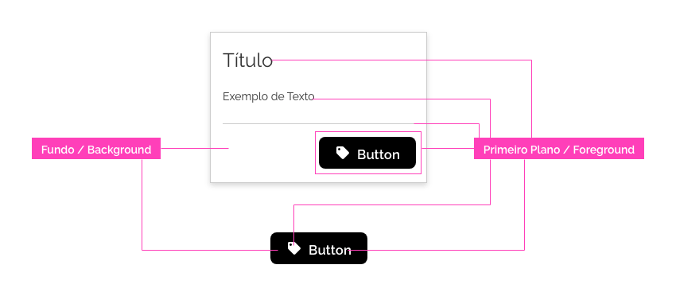
*Para um card o botão pode ser o primeiro Plano. Mas se a referência for o próprio botão podemos ter uma outra visão...*

### Fundo claro vs fundo escuro

A aplicação de um elemento sobre fundo claro ou escuro pode ser utilizada independente do tema escolhido. Alguns Estados precisam de cuidado no contraste, pois variam de acordo com a cor de fundo utilizada.

Uma regra simples que pode ser utilizada para determinar se um fundo é claro ou escuro consiste em visualizar qual a cor de texto prevista para aquela determinada cor:

-   *Fundo Claro*: Se a cor do texto prevista for preta (ou variações escuras), então o fundo é claro.

-   *Fundo Escuro*: Se a cor de texto previsto for branca (ou variações claras), então o fundo é escuro.

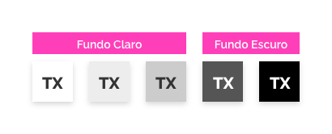
*Nos três primeiros exemplos o texto é escuro, portanto, para gerar contraste é usado o fundo claro. Nos dois últimos exemplos acontece o inverso.*

**OBS**: veja o Fundamento Cores para saber o contraste adequado para cada cor.

### *Overlay*

Alguns estados utilizam o conceito de *Overlay*. Overlay é uma aplicação de camada semi transparente sobre um elemento. Os detalhes estão no [Fundamento Superfície](/ds/fundamentos-visuais/superficie).

Dependendo da cor do elemento, a opacidade do Overlay deve ser revista para que o destaque seja notado pelo usuário: o valor da opacidade é inversamente proporcional ao brilho da superfície do elemento (cor de fundo), ou seja, quanto mais claro a cor de fundo, menor será o valor da opacidade necessária para que o usuário perceba o estado. Desta forma, podem existir diferenças nos valores de opacidade entre um fundo claro e escuro.

### Herança

Nos Estados, herança é a capacidade de herdar as características visuais (e às vezes até comportamentais) de um outro estado.

Por padrão, a herança deve ser mantida entre os Estados. Caso exista conflito de estilos visuais entre eles, o Estado realizado por último e com a interação direta pelo usuário terá prioridade.

---

## Tipos de Estado

Segue a lista dos principais Estados encontrados no *Design System*. O detalhamento de cada Estado será descrito adiante.

Existem 2 grupos de estados:

### 1. Interação

São grupos de Estados voltados a algum tipo de interação por parte do usuário. Alguns deles podem estar aplicados diretamente na interface, mas podem ser alterados de acordo com a interação do usuário seja por *mouse*, toque, voz....

-   *Interativo*: comunica que um componente ou elemento é interativo.

-   *Desabilitado*: comunica que um componente ou elemento está temporariamente indisponível para interação.

-   *Hover*: comunica que o cursor está sobre um componente ou elemento interativo.

-   *Pressionado*: comunica que um componente ou elemento interativo está sendo pressionado via teclado, por um clique ou toque.

-   *Foco*: comunica quando o usuário destaca um componente ou elemento interativo, utilizando-se de um método de entrada como teclado, *mouse*, toque ou voz.

-   *Ativo*: comunica qual elemento está ativo dentro de um conjunto de escolhas, iniciado ou não pelo usuário.

-   *Selecionado*: comunica uma escolha do usuário.

-   *Arrastando*: comunica quando um usuário move um componente ou elemento.

-   *Arrastar*: comunica que um componente ou elemento pode ser arrastado.

-   *DropZone*: comunica a área propícia onde um componente ou elemento pode ser movido no Arrastando.

-   *Dropzone* Ativo*: comunica a área onde um componente ou elemento com estado Arrastando será movido.

-   *Visitado*: comunica que um texto interativo (*hiperlink*) foi acessado pelo usuário.

-   *Ligado*: comunica a opção "ligado" na alternância entre o estado Desligado.

-   *Desligado*: comunica a opção "desligado" na alternância entre o estado Ligado.

### 2. Aviso

São estados caracterizados por uma cor (e suas variações) e um ícone a fim de fornecer uma experiência universal para os usuários quando for necessário transmitir alguma informação importante dentro da interface.

-   *Erro*: Informa aos usuários sobre um erro ou falha crítica.

-   *Alerta*: Informa aos usuários sobre ações indesejáveis ​​ou da possibilidade de gerar resultados inesperados.

-   *Sucesso*: Confirma se uma tarefa foi concluída conforme o esperado.

-   *Informativo*: Fornece informações adicionais aos usuários que podem não estar vinculados à sua ação ou tarefa atual.

### Observações

-   Podem existir Estados, não listados aqui, específicos em um componente. Neste caso, devem ser detalhados na sua respectiva documentação.

-   O "Estado Padrão" se trata da ausência de um estado ou de algum *feedback*. Por não existir nenhuma regra especial, não existe um detalhamento sobre este "Estado".

-   A escolha das cores dos estados obedece a algumas recomendações e boas práticas pré-estabelecidas. Para maiores informações consultar a documentação sobre a criação de Temas.

---

## Interativo

Para o usuário, deve ser claro quais objetos são interativos ou não. Essa interação será dada pelo usuário por um clique/toque ou em alguns casos, por algum outro dispositivo de entrada.

Após a interação, será executada alguma ação que pode ser determinada pelo elemento que recebeu este estado, seja um texto ou um objeto.

### *Hiperlinks*

Textos Interativos são chamados de *hiperlinks*, ou apenas *links*. A ideia do *hiperlink* é fazer ligação/referência direta a um determinado conteúdo.

Evite estado Interativo em frases longas, prefira o uso em palavras chaves.

### Referência externa

Quando a ação interativa for relacionada a visitar um determinado conteúdo fora do domínio da aplicação, adicione um ícone para representar esse comportamento próximo ao elemento com estado Interativo. O ícone recomendado é representado por um "*container* e uma seta diagonal": <i class="fas fa-external-link-alt" aria-hidden="true"></i>

### Objetos

Quando criar um objeto interativo, tenha em mente se vale a pena aplicar a cor sobre o fundo ou primeiro plano. O importante é que, para o usuário, esteja claro o estado Interativo. Tenha cuidado com contraste entre o fundo e o primeiro plano, visite sempre o [Fundamento Cores](/ds/fundamentos-visuais/cores) para saber o melhor contraste possível.

### *Underline* vs legibilidade

O uso do estilo *underline* (sublinhado) nos textos pode atrapalhar a legibilidade em algumas situações. Evite o uso quando o texto for aplicado em objetos (como *List* ou outros componentes) ou em textos longos.

### Especificação para Estado Interativo

A cor é utilizada como a principal característica para exibir o estado de Interação (evite o uso desta cor, e suas variações, em outros elementos para não confundir o usuário). Por motivos de legibilidade, a cor aplicada em fundo escuro é diferente. Essa cor pode ser aplicada tanto nos textos como em objetos.

Para que *hiperlinks* sejam destacados utilize *underline*. Esse recurso pode ser dispensado nos casos em que a legibilidade fique comprometida.

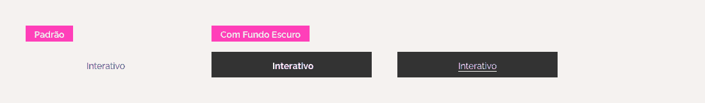
*Exemplo do estado interativo sendo aplicado em um texto e um objeto, tanto no fundo claro como no escuro.*

| Element                                       | Property | Token/Value            |
| --------------------------------------------- | -------- | ---------------------- |
| background/foreground (Sobre um fundo Claro)  | color    | `--blue-warm-vivid-70` |
| background/foreground (Sobre um fundo Escuro) | color    | `--blue-warm-20`       |
| text                                          | style    | `underline`            |

---

## Desabilitado

O estado desabilitado comunica que um componente ou elemento está temporariamente indisponível para interação.

Elementos desabilitados não precisam ser rígidos sobre as conformidade de acessibilidade no quesito contraste visual, e características visuais que destaquem o elemento devem ser retiradas ou amenizadas, como é o caso das sombras por exemplo.

Elementos desabilitados não sofrem herança com qualquer outro estado (a não ser o Interativo, veja em especificação).

### Evitar Estado Desabilitado

Caso o elemento não possa ser "habilitado" por alguma ação do usuário, a recomendação é retirá-lo da interface, ou seja, não exibi-lo.
> *Exemplo*: Em um *site* de compras, tenho um determinado produto em falta. Neste caso, retire o botão comprar (quando se referir ao produto) ao invés de mantê-lo desativado.

Alguns outros componentes e elementos, por causa do seu comportamento, é preferível não exibi-los na interface:

-   Componentes de Navegação (Menu, *Tabs*, etc.)

-   Modal

-   *Tooltip*

-   *Magic Button*

### Especificação para Estado Desabilitado

O estado Desabilitado deve ter baixa ênfase ou ser amenizado dentro de uma interface. Ele é exibido com um valor específico de opacidade, podendo manter a herança com o estado interativo, ou seja, o visual do Estado Interativo. O cursor do *mouse* deve ser alterado para o símbolo de não permitido: "círculo com traço diagonal".

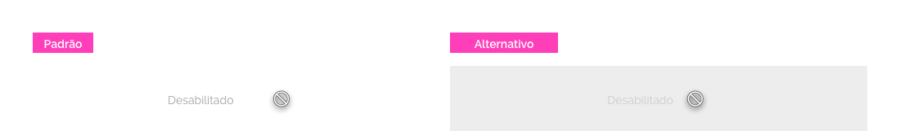
*Exemplo do estado desabilitado sendo aplicado em um texto e um objeto, tanto no fundo claro como no escuro.*

| Element               | Property | Token/Value             |
| --------------------- | -------- | ----------------------- |
| background/foreground | opacity  | `--surface-opacity-md`  |
| cursor                | cursor   | `not-allowed`           |
| background/foreground | shadow   | `--surface-shadow-none` |

---

## *Hover*

O Estado *hover* acontece quando o usuário mantém o cursor do *mouse* sobre um componente ou elemento interativo. Em alguns casos raros, ele pode ser utilizado para gerar controle de leitura em elementos listáveis, tais como uma lista ou linhas de uma tabela.

### Cuidados para Estado *Hover*

-   Só pode existir um elemento com *hover* por vez na tela.

-   Se por um evento de *hover* executar um *dropdown*, o estilo do *hover* pode se manter no elemento até que o comportamento *dropdown* seja retirado.

-   Elementos desabilitados não podem receber *hover* .

-   O *feedback* visual deve ser feito no objeto que está em *hover*.

### Especificação para Estado *Hover*

É importante a possibilidade de herança com outros estados mesmo com *hover*. Desta forma, o recurso de *Overlay* é utilizado como *feedback*.

A cor do elemento *Overlay* será sempre a cor do Primeiro Plano do elemento *hover*. O valor da opacidade deve variar de acordo com Fundo (Claro ou Escuro) para gerar percepção (contraste) suficiente do Estado. Além disso, nos elementos Interativos, o cursor do *mouse* deve ser alterado para a "mão fechada com indicador esticado".

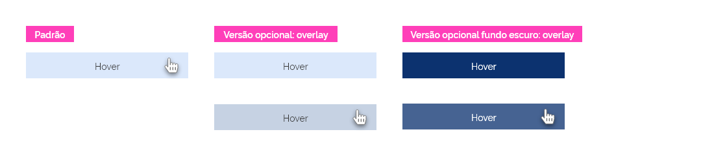
*Exemplo do estado hover sendo aplicado em um texto e um objeto, tanto no fundo claro como no escuro.*

| Element                            | Property | Token/Value            |
| ---------------------------------- | -------- | ---------------------- |
| background                         | color    | `Primeiro Plano`       |
| background (Sobre um fundo Claro)  | opacity  | `--surface-opacity-xs` |
| background (Sobre um fundo Escuro) | opacity  | `--surface-opacity-sm` |
| cursor                             | cursor   | `pointer`              |

---

## Pressionado

Quando um elemento interativo recebe um toque iniciado pelo usuário, seja ela por cursor, toque, teclado ou método de entrada de voz, recebe o estado de pressionado.

### Cuidados para Estado Pressionado

-   Só pode existir um elemento com pressionado por vez na tela.

-   Se por um evento de pressionado executar um *dropdown*, o estilo do Pressionado pode se manter no elemento até que o comportamento *dropdown* seja retirado.

-   Elementos desabilitados não podem receber Pressionado .

-   O *feedback* visual deve ser feito no objeto que está em estado Pressionado.

-   Após o estado Pressionado, o elemento pode também receber o estado Foco (veja  detalhes no estado Foco).

### Especificação para Estado Pressionado

É importante manter heranças de outros Estados mesmo com Pressionado. Desta forma, o recurso de *Overlay* é utilizado como *feedback*.

A cor do elemento *Overlay* será sempre a cor do Primeiro Plano do elemento Pressionado. O valor da opacidade deve variar de acordo com Fundo (Claro ou Escuro) para que gera percepção (contraste) suficiente do Estado. Além disso, o cursor do *mouse* deve ser alterado para a "mão fechada com indicador esticado".

Características visuais referentes à elevação do componente na tela, como sombra por exemplo, devem ser retiradas ou amenizadas.

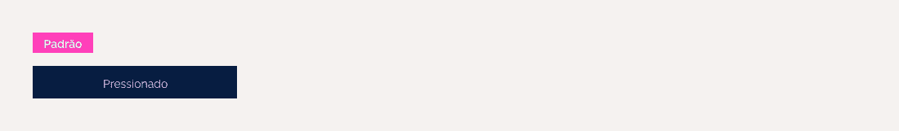
*Exemplo do estado pressionado sendo aplicado em um texto e um objeto, tanto no fundo claro como no escuro.*

| Element                            | Property | Token/Value             |
| ---------------------------------- | -------- | ----------------------- |
| background                         | color    | `Primeiro Plano`        |
| background (Sobre um fundo Claro)  | opacity  | `--surface-opacity-md`  |
| background (Sobre um fundo Escuro) | opacity  | `--surface-opacity-lg`  |
| cursor                             | cursor   | `pointer`               |
| background/foreground              | shadow   | `--surface-shadow-none` |

---

## Foco

O estado foco surge quando um usuário utiliza-se de um teclado ou algum método de entrada de voz para destacar um componente interativo. Por esse motivo, ele deve ter alta ênfase sobre demais elementos da interface.

Em alguns casos, o foco pode ser redirecionado pela própria interface, como por exemplo, focar automaticamente no campo de busca ao entrar em uma página de pesquisa.

### Foco Tênue

Alguns elementos, geralmente quando existe entrada de dados (como um *input* por exemplo), recebem o estado de Foco após ser clicado (ou "tocado"). Neste caso, o *feedback* do foco *não precisa ter uma alta ênfase*, pois poderá atrapalhar o reconhecimento de outros estados e/ou chamar mais atenção do que deveria.

Como regra geral, utilize este estilo sempre que:

-   Um elemento receber foco de forma *indireta*, ou seja, por reação a algum outro Estado ou comportamento.

-   Quando o "foco padrão" tiver uma ênfase muito maior do que deveria, *interferindo negativamente* na experiência do usuário.

### Cuidados para Foco

-   Só pode existir um elemento com foco por vez na tela.

-   Só pode existir 1 tipo de Foco por elemento.

-   Elementos desabilitados não podem receber foco.

-   Por padrão, o foco "normal" deve ser aplicado. O foco tênue só será utilizado quando especificado na diretriz.

-   Por padrão, a ação de "clicar/tocar" em um elemento não deve gerar foco visual. Entretanto, o foco por outras vias (como teclado ou entrada de voz) ainda deve existir. O Foco via "clique/toque" só será utilizado quando especificado na diretriz do elemento.

### Especificação para Foco

A principal propriedade (visual) que demonstra que um elemento está em foco é uma borda (ou contorno). Essa borda deve ser criada em volta do elemento e deve ter um espaçamento de segurança (para que a borda não se confunda com qualquer outra propriedade do elemento "focado", ou com a herança de outros estados).

Por motivos de legibilidade, a cor aplicada na borda em fundo escuro é diferente. Para maiores informações consultar o [Fundamento Cores](/ds/fundamentos-visuais/cores).

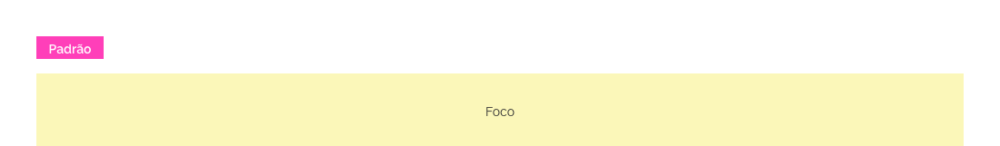
*Exemplo do estado foco sendo aplicado em um texto e um objeto, tanto no fundo claro como no escuro.*

Para *foco tênue* a borda deve possuir menos ênfase e não há necessidade de um espaçamento de segurança.

| Element                        | Property | Token/Value       |
| ------------------------------ | -------- | ----------------- |
| border (Sobre um fundo Claro)  | color    | `--gold-vivid-40` |
| border (Sobre um fundo Escuro) | color    | `--gold-vivid-20` |

#### Especificação para Estado Foco

| Element | Property | Token/Value            |
| ------- | -------- | ---------------------- |
| border  | width    | `--surface-width-lg`   |
| border  | style    | `dashed`               |
| spacing | padding  | `--spacing-scale-half` |

#### Especificação para Estado Foco Tênue

| Element | Property | Token/Value          |
| ------- | -------- | -------------------- |
| border  | width    | `--surface-width-md` |
| border  | style    | `solid`              |

---

## Ativo

O estado ativo indica qual item, *de um conjunto de opções*, está sendo visualizado no momento, sendo iniciado por padrão ou por uma escolha do usuário utilizando-se dos seguintes métodos de entrada: toque, cursor, teclado ou entrada de voz.

### Cuidados para Estado Ativo

-   Dentro de um único conjunto de opções, apenas um estado Ativo pode estar presente de cada vez.

-   Elementos desabilitados não podem receber Ativo.

-   Não utilize em componentes que possam existir vários itens Ativos ao mesmo tempo, como em listagens com expansão.

### Estado ativo vs selecionado

Se a própria definição dos estado não for clara para diferenciar um estado do outro, podemos resumir o embate com o seguinte comportamento:

-   *Ativo*: a ação geralmente é executada imediatamente após a escolha (exibir um conteúdo, mudar o tipo de alinhamento de texto...). Apenas um item pode ser ativado por vez.

-   *Selecionado*: a ação é executada posteriormente e, geralmente, com auxílio de uma outra ação ou componente (selecionar os itens e depois acionar um botão deletar...). Posso ter a possibilidade de escolher um ou mais itens.

### Especificação para Estado Ativo

O estado deve ter uma alta ênfase entre os demais elementos do seu conjunto mas uma média ênfase entre os outros elementos em uma interface.

O Fundamento cor é utilizado como a principal característica para exibir o estado de Ativo. São duas cores que devem ser utilizadas para gerar o máximo de contraste possível entre elas, trabalhando entre o Fundo e o Primeiro Plano.

Para distinguir melhor o Estado, a borda do elemento pode ser trabalhada para não depender somente da cor para gerar o *feedback* do estado Ativo.

*Observação*: nem todas as bordas do elemento precisam ser estilizadas, na maioria das situações, apenas 1 das bordas será o suficiente!

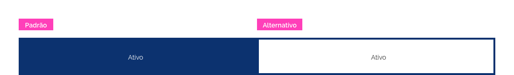
*Exemplos do estado ativo sendo aplicado em um texto e um objeto, tanto no fundo claro como no escuro.*

| Element                      | Property | Token/Value            |
| ---------------------------- | -------- | ---------------------- |
| background/foreground/border | color    | `--blue-warm-vivid-80` |
| background/foreground/border | color    | `--pure-0`             |
| border                       | width    | `--surface-width-lg`   |
| border                       | style    | `solid`                |

---

## Selecionado

Um estado selecionado indica a seleção de opções pelo usuário usando um dos seguintes métodos de entrada: toque, cursor, teclado ou voz.

### Estado selecionado vs ativo

Se a própria definição dos estado não for clara para diferenciar um estado do outro, podemos resumir o embate com o seguinte comportamento:

-   *Ativo*: a ação geralmente é executada imediatamente após a escolha (exibir um conteúdo, mudar o tipo de alinhamento de texto...). Apenas um item pode ser ativado por vez.

-   *Selecionado*: a ação é executada posteriormente e, geralmente, com auxílio de uma outra ação ou componente (selecionar os itens e depois acionar um botão deletar...). Posso ter a possibilidade de escolher um ou mais itens.

### Evitar estado selecionado

O estado Selecionado não pode ser aplicado nos seguintes componentes:

-   Componentes de Navegação (Menu, Abas...)

-   Modal

-   *Tooltip*

-   *Button*

-   *Message*

-   *Divider*

### Especificação para Estado Selecionado

O estado selecionado deve ser facilmente identificável.

Cor de fundo e um elemento gráfico devem ser utilizados para representar o estado. O elemento gráfico pode ser um ícone que represente seleção/escolha, ou os componentes *checkbox* ou *radio*.

*Exemplo do estado selecionado sendo aplicado em um texto e um objeto, tanto no fundo claro como no escuro.*

| Element               | Property | Token/Value            |
| --------------------- | -------- | ---------------------- |
| background/foreground | color    | `--blue-warm-vivid-50` |
| icon                  | class    | `fa-check`             |

---

## Arrastando

O estado arrastando ocorre quando um usuário move um elemento ou componente, seja via cursor, toque, teclado ou método de entrada de voz.

### Cuidados para Estado Arrastando

-   Só pode existir um elemento com Arrastando por vez na tela.

-   Quando vários elementos precisarem ser arrastados, deve existir uma solução que agrupe (visualmente) todos os elementos em uma única solução.

-   Elementos desabilitados não podem receber Arrastando.

-   Arrastando não sofre herança do estado Pressionado.

### Estado arrastando vs arrastar

É importante que o usuário entenda quais elementos da tela podem ser arrastados. Portanto, enquanto o *Arrastar* é o *feedback* que determina quais os elementos que podem ser arrastados (antes da ação), o estado *Arrastando* é o *feedback* da ação do usuário sobre o objeto em questão (durante a ação).

### Especificação para Estado Arrastando

O *feedback* do objeto "agarrado" deve ser claro, mostrando a diferença entre outros objetos semelhantes na tela. Como se moverá "acima" de outros itens, uma sombra e um contorno deve ser utilizado para garantir a mudança do Estado tanto em um fundo claro como no escuro; a angulação e a opacidade do objeto também deve ser alterada para gerar um efeito "fantasma".

A cor utilizada (tanto no contorno como na sombra) deve ser a mesma utilizada no Estado Interativo.

O cursor do mouse deve ser alterado para a "mão fechada".

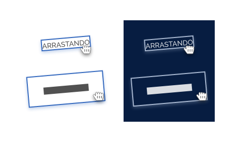
*Exemplo do estado arrastando sendo aplicado em um texto e um objeto, tanto no fundo claro como no escuro.*

| Element               | Property        | Token/Value                |
| --------------------- | --------------- | -------------------------- |
| border                | color           | `Cor do Estado Interativo` |
| border                | width           | `--surface-width-md`       |
| border                | style           | `solid`                    |
| background            | shadow-offset-x | `--surface-offset-none`    |
| background            | shadow-offset-y | `--surface-offset-md`      |
| background            | shadow-blur     | `--surface-blur-lg`        |
| background            | shadow-color    | `Cor do Estado Interativo` |
| background            | shadow-opacity  | `--surface-opacity-sm`     |
| background/foreground | opacity         | `--surface-opacity-xl`     |
| background/foreground | rotate          | `-5°`                      |
| cursor                | cursor          | `grabbing`                 |

---

## Arrastar

Um estado arrastar indica quando um elemento pode ser arrastado, se movimentando na interface.

### Cuidados para Estado Arrastar

-   O *feedback* Arrastar é somente para objetos que possam ser movimentados (com o evento de "agarrar"), não incluindo, por exemplo, elementos redimensionáveis (neste caso, outras características de respostas devem ser estudadas).

-   Elementos desabilitados não podem receber Arrastar (veja Especificação maiores detalhes).

### Estado arrastar vs arrastando

É importante que o usuário entenda quais elementos da tela podem ser arrastados. Portanto, enquanto o *Arrastar* é o *feedback* que determina quais os elementos que podem ser arrastados (antes da ação), o estado *Arrastando* é o *feedback* da ação do usuário sobre o objeto em questão (durante a ação).

### Especificação para Estado Arrastar

Podemos utilizar ícone e o cursor para trazer o *feedback* necessário, mesmo que não exista características tão universais para esse propósito (a falta de consistência na própria internet torna difícil para os usuários reconhecerem o significado).

No *Design System* escolhemos o ícone de  "6 círculos" e o cursor do *mouse* "mão totalmente aberta" como elementos que simbolizam este estado Arrastar.

Prefira o posicionamento do ícone à esquerda e/ou no topo do elemento. O cursor estilizado deve ser exibido somente quando o mesmo estiver posicionado sobre o elemento. Em elementos desabilitados o cursor não sofre mudança.

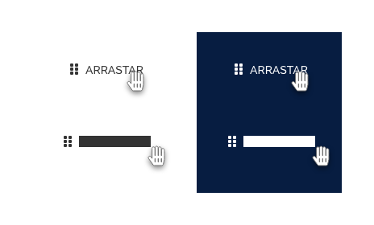
*Exemplo do estado arrastar sendo aplicado em um texto e um objeto, tanto no fundo claro como no escuro.*

| Element | Property | Token/Value     |
| ------- | -------- | --------------- |
| icon    | class    | `grip-vertical` |
| cursor  | cursor   | `grab`          |

---

## *Dropzone*

O estado *Dropzone* (ou Área/Zona de Soltura) indica quando uma área está viável para receber um elemento após ser movido ou arrastado.

### Cuidados para *Dropzone*

-   A área/zona de "soltura" do elemento pode ser maior, *mas não menor*, do que a área visível/exibida na tela. Utilize o estado *Dropzone* Ativo (veja adiante) para gerar uma resposta clara para o usuário.

-   O Estado pode ser persistente, ou seja, sempre está visível enquanto o comportamento de mover/arrastar estiver presente.

### Especificação para *Dropzone*

É importante que outros estados ainda possam ser comunicáveis mesmo com *dropzone*. Desta forma, o recurso de borda com uma cor específica do estado Interativo é o suficiente para o *feedback*.

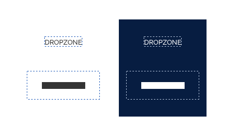
*Exemplo do estado dropzone sendo aplicado em um texto e um objeto, tanto no fundo claro como no escuro.*

| Element | Property | Token/Value                |
| ------- | -------- | -------------------------- |
| border  | color    | `Cor do Estado Interativo` |
| border  | width    | `--surface-width-sm`       |
| border  | style    | `dashed`                   |

---

## *Dropzone* ativo

O estado *Dropzone* Ativo (ou Área/Zona de Soltura Ativa) indica a área/zona que receberá o elemento após ser movido ou arrastado.

### Cuidados para *Dropzone* Ativo

-   Só pode existir uma área com *dropzone* ativo por vez na tela.

-   Elementos desabilitados não podem receber *dropzone* ativo.

### Estado *dropzone* ativo vs *dropzone*

Enquanto o *dropzone* informa as opções disponíveis, o *dropzone* ativo informa a área/zona que, efetivamente, receberá o elemento após ser movido.

### Estado *dropzone* ativo e arrastando

Sempre que estiver Arrastando um objeto sobre uma *dropzone*, o estado *Dropzone* Ativo deve ser imediatamente exibido!

O cursor do mouse ou o toque do usuário é a referência para entender essa sobreposição de objetos e não o elemento com estado Arrastando. Caso a área do Dropzone seja muito pequena, ela poderá ser *ampliada* para receber essa entrada do usuário de forma mais precisa.

Essa área ampliada não é visível para o usuário, mas assim que a entrada do usuário fizer contato com ela, o estado *Dropzone* Ativo deve ser exibido!

#### Especificação para *Dropzone* Ativo e Arrastando

No *dropzone* ativo deve manter as heranças do estado *dropzone*. Desta forma, o recurso de overlay é adicionado como *feedback*.

A cor do elemento overlay será sempre a cor do estado Interativo. O valor da opacidade será fixo.

O cursor do mouse deve ser alterado, adicionando um ícone de "adição" ao cursor.

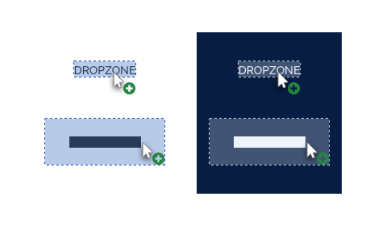
*Exemplo do estado dropzone ativo sendo aplicado em um texto e um objeto, tanto no fundo claro como no escuro.*

| Element    | Property | Token/Value                |
| ---------- | -------- | -------------------------- |
| background | color    | `Cor do Estado Interativo` |
| background | opacity  | `--surface-opacity-sm`     |
| cursor     | cursor   | `copy`                     |

---

## Visitado

O estado acontece quando o conteúdo acessado, referente ao *hiperlink*, já foi visitado/visualizado pelo usuário. Ele serve para ajudar os usuários a distinguir a diferença entre *hiperlinks* que visualizados e os não visualizados.

### Cuidados para Estado Visitado

-   Utilize o estado com cuidado, pois essa informação pode violar a privacidade do usuário e revelar informações de identificação pessoal em  situações sensíveis.

-   Só utilize dentro de contexto de *hiperlinks*.

### Especificação para Visitado

Além de herdar características básicas de *hiperlinks*, é necessário o uso de uma cor diferenciada para realizar o *feedback* de forma eficiente.

Por motivos de legibilidade, a cor em fundos Escuros deve ser alterada.

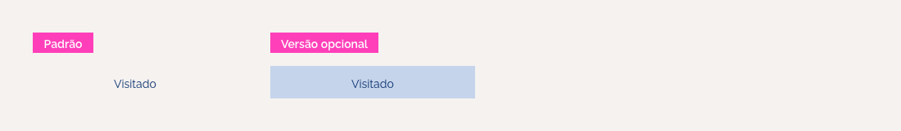
*Exemplo do estado visitado sendo aplicado em um texto, tanto no fundo claro como no escuro.*

| Element                      | Property | Token/Value            |
| ---------------------------- | -------- | ---------------------- |
| Text (Sobre um fundo Claro)  | color    | `--blue-warm-vivid-80` |
| Text (Sobre um fundo Escuro) | color    | `--gray-20`            |

---

## Ligado e Desligado

Apesar de serem Estados diferentes, o estado ligado e desligado estão unidos na função: comunicam uma alternância entre duas opções: Ligado ou Desligado. Um componente se alterna entre um estado ligado ou desligado conforme a interação do usuário utilizando os seguintes métodos de entrada: toque, cursor, teclado ou voz.

### Especificação para Ligado e Desligado

O Fundamento cor é utilizado como a principal característica para exibir o estado Ligado e o Desligado. A cor entre os estados deve possuir um contraste alto, deixando claro a diferença entre eles.

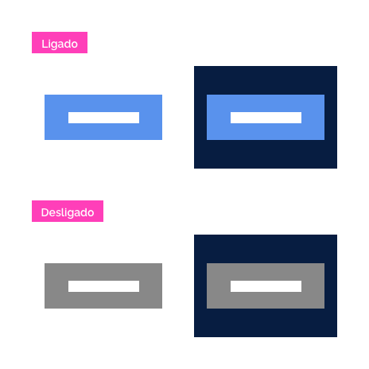
*Exemplo dos estados ligado e desligado sendo aplicado em um texto e um objeto, tanto no fundo claro como no escuro.*

| Element                           | Property | Token/Value            |
| --------------------------------- | -------- | ---------------------- |
| background/foreground (Ligado)    | color    | `--blue-warm-vivid-40` |
| background/foreground (Desligado) | color    | `--gray-40`            |

---

## Erro

O estado informa sobre um erro ou falha crítica existente na interface ou por alguma ação realizada pelo usuário.

Importante que o estado persista até que seja resolvido o erro.

### Especificação para Estado Erro

A cor *vermelha* e ícone de "X" é o *feedback* utilizado neste estado.

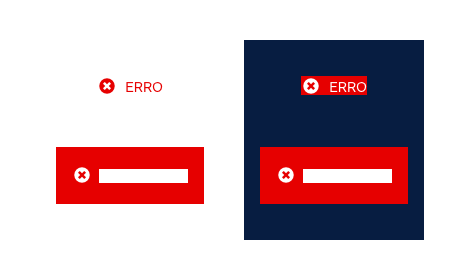
*Exemplo do estado erro sendo aplicado em um texto e um objeto, tanto no fundo claro como no escuro.*

| Element               | Property | Token/Value      |
| --------------------- | -------- | ---------------- |
| background/foreground | color    | `--red-vivid-50` |
| icon                  | class    | `times-circle`   |

---

## Alerta

O estado informa aos usuários sobre ações indesejáveis ​​ou da possibilidade de gerar resultados inesperados.

Pode persistir até que o usuário ignore a notificação.

### Especificação para Estado Alerta

A cor *amarela* e ícone de "exclamação" é o *feedback* utilizado neste estado.

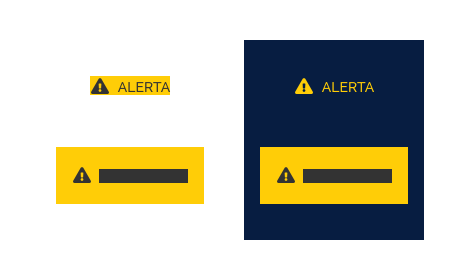
*Exemplo do estado alerta sendo aplicado em um texto e um objeto, tanto no fundo claro como no escuro.*

| Element               | Property | Token/Value            |
| --------------------- | -------- | ---------------------- |
| background/foreground | color    | `--yellow-vivid-20`    |
| icon                  | class    | `exclamation-triangle` |

---

## Sucesso

O estado informa ao usuário se uma tarefa foi concluída conforme o esperado.

Pode persistir de uma maneira não intrusiva, mas normalmente, não requer ações adicionais. Pode ser dispensado automaticamente.

### Especificação para Estado Sucesso

A cor *verde* e ícone de "check" é o feedback utilizado neste estado.

*Exemplo do estado sucesso sendo aplicado em um texto e um objeto, tanto no fundo claro como no escuro.*

| Element               | Property | Token/Value             |
| --------------------- | -------- | ----------------------- |
| background/foreground | color    | `--green-cool-vivid-50` |
| icon                  | class    | `check-circle`          |

---

## Informativo

O estado fornece informações adicionais aos usuários que podem não estar vinculados à sua ação ou a uma tarefa atual.

Pode persistir, dependendo do conteúdo, mas não requer ações adicionais. Pode ser dispensado automaticamente.

O estado informativo pode ser confundido com algum elemento de ajuda (que pode ser representado pela iconografia de uma "interrogação"). De fato, um pode substituir o outro. O importante é manter a consistência visual e sempre que possível, preferir utilizar o estado informativo, com a iconografia e a cor padrão.

### Especificação para Estado Informativo

A cor *azul* e ícone de "letra i" é o feedback utilizado neste estado.

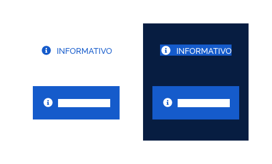
*Exemplo do estado informativo sendo aplicado em um texto e um objeto, tanto no fundo claro como no escuro.*

| Element               | Property | Token/Value            |
| --------------------- | -------- | ---------------------- |
| background/foreground | color    | `--blue-warm-vivid-60` |
| icon                  | class    | `info-circle`          |
