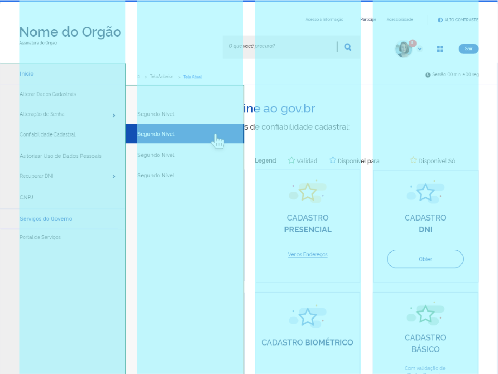
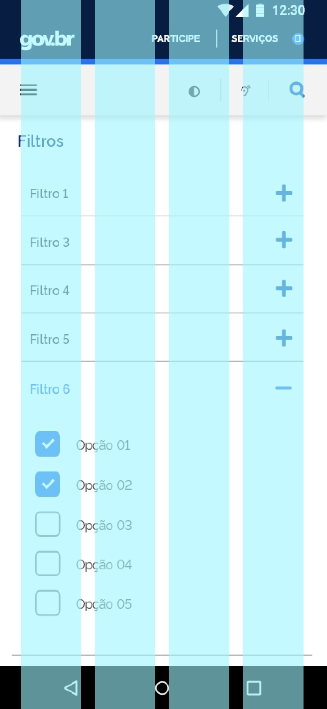
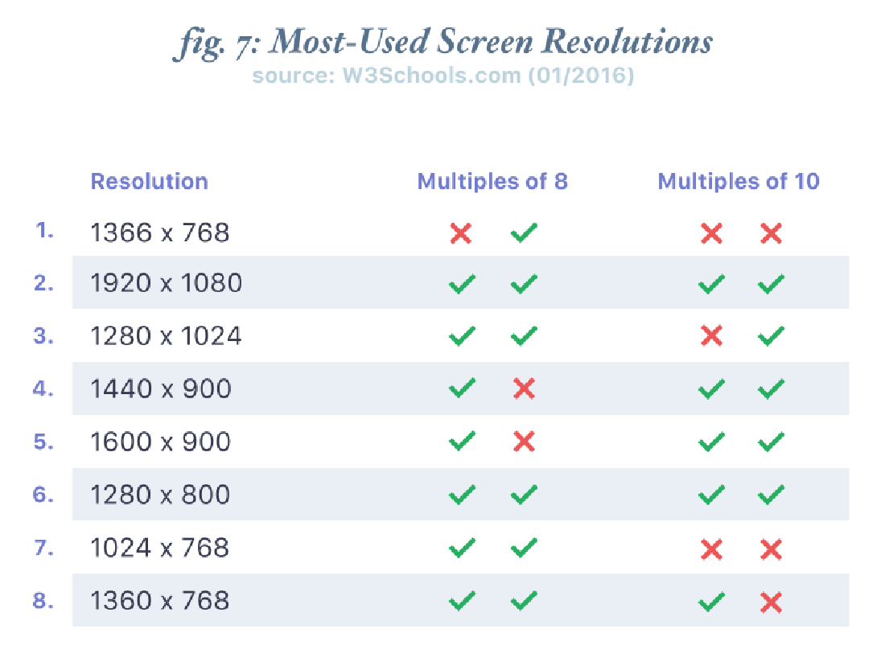

### Experiência Única

O sistema de Grid de 12 colunas possui uma boa flexibilidade para projetos de layouts, pois permite uma diagramação de páginas e telas com colunas múltiplas de 12, além de se adequar aos principais Frameworks CSS, facilitando a escolha na teconologia a ser utilizada. Em Tablets e Smartphones o número de colunas é reduzido ao máximo de 8 e 4 respectivamente, devido à limitação de espaço.

### Eficiência e Clareza

Seguindo o princípio de espaçamentos e dimensões múltiplos de 8, é possível
preservar as proporções em resoluções de telas diferenciadas, visto que a maioria tem suas dimensões divisíveis por 8. Esta característica de Design Multi-Plataforma fornece ao usuário uma sensação de consistência e clareza no projeto de design em diferentes dispositivos.

### Acessibilidade

As interfaces devem ser adequadas a diferentes tipos de dispositivos, tendo em vista esse aspecto, o sistema de grid fornece alguns breakpoints - pontos de quebra onde o layout será ajustado para atender diferentes resoluções, sendo assim possível desenvolver interfaces adaptáveis a diversos formatos e tamanhos de telas.

### Reutilização e Colaboração

Porventura, poderá haver alguma adaptação específica no sistema de grids, break-points e padrões de proporção, para atender alguma necessidade em projetos de interface. Sendo assim, faz-se necessário, que essas evoluções/adaptações sejam testadas e passem por uma prévia aprovação da equipe de design do DS.

O sistema de grid para o Design System do Governo Federal se adequa a 4 breakpoints de referência, abrangendo resoluções para Mobile, Tablet, Desktop e resoluções superiores. São elas:

- X-Small: até 576px - **SmartPhone Portrait**
- Small: a partir de 576px - **SmartPhone Landscape e Tablet Portrait**
- Medium: a partir de 992px - **Tablet Landscape**
- Large: a partir de 1280px - **Desktop**
- X-Large a partir de 1600px - **Big Desktop / TV**

---

## Desktop

As **12 colunas** serão divididas em **1152 pixels** de largura com espaçamentos de **24 pixels** entre elas. Esse sistema permite a organização do conteúdo em diversas formatações de coluna e facilita a reorganização dele nos grids das versões tablet e mobile.

A margem externa ao conteúdo será sempre variável se adequando às dimensões
da tela. Abaixo seguem alguns exemplos:

##### Desktop - 1280 x 800

- **12** Colunas
- **24px** de Medianiz
- **1152px** de container
- **M** - margem externa variável

##### Desktop - 1366 x 768

- **12** Colunas
- **24px** de Medianiz
- **1152px** de container
- **M** - margem externa variável

##### Desktop - 1440 x 900

- **12** Colunas
- **24px** de Medianiz
- **1152px** de container
- **M** - margem externa variável

Para resoluções maiores que **1440px** também utiliza-se o padrão de **12 colunas** com medianiz de **32px** e largura máxima de **1440px**. Nestas resoluções o conteúdo cresce de forma proporcional tanto na horizontal como na vertical.

##### Desktop - 1600 x 900

- **12** Colunas
- **32px** de Medianiz
- **1440px** de container
- **M** - margem externa variável

##### Desktop - 1920 x 1080

- **12** Colunas
- **32px** de Medianiz
- **1440px** de container
- **M** - margem externa variável

---

## Tablets

Nos dispositivos tablets, o conteúdo pode ser reorganizado em até **8 colunas** se adequando às variações retrato e paisagem. O espaçamento entre as colunas será de **24px** e a margem externa ao conteúdo de **40px**.

##### Tablet Android - 8 colunas- 768 x 1024 Portrait

- **8** Colunas
- **24px** de Medianiz
- **40px** de margem externa

##### Tablet Android - 8 colunas - 768 x 1024 Landscape

- **8** Colunas
- **24px** de Medianiz
- **40px** de margem externa

##### Tablet Android - 4 colunas - 768 x 1024 Portrait

- **4** Colunas
- **24px** de Medianiz
- **40px** de margem externa

##### Tablet Android - 4 colunas - 768 x 1024 Landscape

- **4** Colunas
- **24px** de Medianiz
- **40px** de margem externa

##### Tablet Android - 3 colunas - 768 x 1024 Portrait

- **3** Colunas
- **24px** de Medianiz
- **40px** de margem externa

##### Tablet Android - 3 colunas - 768 x 1024 Landscape

- **3** Colunas
- **24px** de Medianiz
- **40px** de margem externa

##### Tablet Android - 2 colunas - 768 x 1024 Portrait

- **2** Colunas
- **24px** de Medianiz
- **40px** de margem externa

##### Tablet Android - 2 colunas - 768 x 1024 Landscape

- **2** Colunas
- **24px** de Medianiz
- **40px** de margem externa

---

## Smartphones

Conteúdo pode ser reorganizado em até **4 colunas** e respeitando a margem de **24px** nas laterais e medianiz de **16px**.

##### iPhone X/XS - 4 colunas

- **4** Colunas
- **16px** de Medianiz
- **24px** de margem externa

##### iPhone 5/SE - 4 colunas

- **4** Colunas
- **16px** de Medianiz
- **24px** de margem externa

##### iPhone X/XS - 3 colunas

- **3** Colunas
- **16px** de Medianiz
- **24px** de margem externa

##### iPhone 5/SE - 3 colunas

- **3** Colunas
- **16px** de Medianiz
- **24px** de margem externa

##### iPhone X/XS - 2 colunas

- **2** Colunas
- **16px** de Medianiz
- **24px** de margem externa

##### iPhone 5/SE - 2 colunas

- **2** Colunas
- **16px** de Medianiz
- **24px** de margem externa

Para responsividade em sites e portais o ideal é que se use uma diagramação com **1 coluna** apenas, visto que o conteúdo textual e o enquadramento das fotos funciona melhor quando há uma redução na largura de Desktop para Smartphones.

##### iPhone X/XS - 1 coluna

- **1** Coluna
- **24px** de margem externa

##### iPhone 5/SE - 1 coluna

- **1** Coluna
- **24px** de margem externa

---

## Grade de 8 Pontos

Sempre que possível, use **múltiplos de 8** para definir dimensões e margem de elementos em bloco e em linha. Os elementos são posicionados dentro da grid e mantêm distâncias relativas um com os outros.

A Grade de 8 Pontos é mais adequada a um **Design Multi-Plataforma**, visto que os tamanhos de telas mais populares são divisíveis por 8 em pelo menos um eixo e, geralmente em ambos os eixos. Isto facilita a preservação das proporções em dispositivos com tamanhos de telas diversos.

