[version]: # (1.3.0)

_Grid_ (ou malha) é uma estrutura geométrica constituída por eixos desenvolvida para auxiliar o alinhamento de elementos gráficos e textuais em  uma composição visual.

Utilize a _grid_ para auxiliar no desenvolvimento de _layouts_ organizados e estruturados.

### Experiência Única

O sistema de _grid_ de 12 colunas possui uma boa flexibilidade para projetos de _layouts_, pois permite uma diagramação de páginas e telas com colunas múltiplas de 12, além de se adequar aos principais _Frameworks_ CSS, facilitando a escolha na tecnologia a ser utilizada. Em _Tablets_ e _Smartphones_ o número de colunas é reduzido ao máximo de 8 e 4 respectivamente, devido à limitação de espaço.

### Eficiência e Clareza

Seguindo o princípio de espaçamentos e dimensões múltiplas de 8, é possível preservar as proporções em resoluções de telas diferenciadas, visto que a maioria tem suas dimensões divisíveis por 8. Essa característica de _Design_ Multi-Plataforma fornece ao usuário uma sensação de consistência e clareza no projeto de design em diferentes dispositivos.

### Acessibilidade

As interfaces devem ser adequadas a diferentes tipos de dispositivos. Tendo em vista esse aspecto, o sistema de _grid_ fornece alguns _breakpoints_ - pontos de quebra onde o _layout_ será ajustado para atender diferentes resoluções, sendo assim possível desenvolver interfaces adaptáveis a diversos formatos e tamanhos de telas.

### Reutilização e Colaboração

Porventura, poderá haver alguma adaptação específica no sistema de _grids_, _breakpoints_ e padrões de proporção, para atender alguma necessidade em projetos de interface. Sendo assim, faz-se necessário que essas evoluções/adaptações sejam testadas e passem por uma prévia aprovação da equipe de _design_ do GOVBR-DS.

---  

## _Breakpoints_

O sistema de _grid_ para o _Design System_ do Governo Federal se adequa a 5 _breakpoints_ de referência, abrangendo resoluções para _mobile_, _tablet_, _desktop_  e resoluções superiores. São elas:

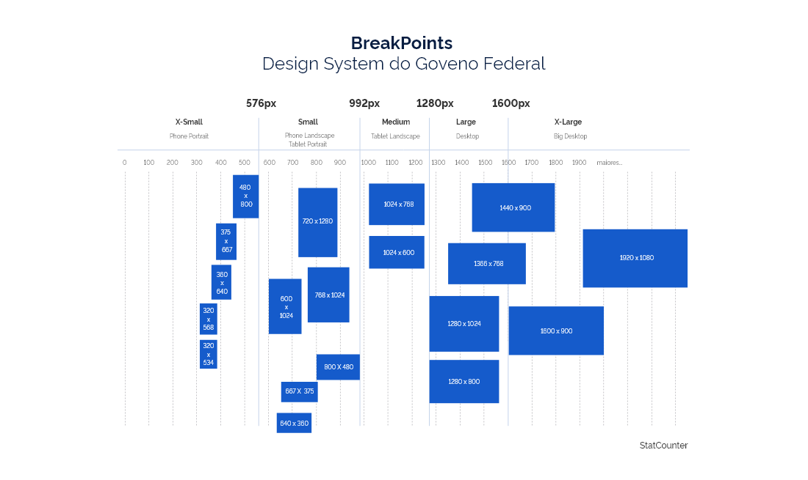
*Visão geral dos _breakpoints_ e resoluções.*

| _Device_                                   | _Breakpoint Range_ (px) | _Breakpoint_ (px) |
| ------------------------------------------ | ----------------------- | ----------------- |
| _Smartphone Portrait_                      | 0 - 575                 | 0                 |
| _Smartphone Landscape_ / _Tablet Portrait_ | 576 - 991               | 576               |
| _Tablet Landscape_                         | 992 - 1279              | 992               |
| _Desktop_                                  | 1280 - 1599             | 1280              |
| TV                                         | 1600 - *                | 1600              |

---

## Comportamentos

### 1-  Largura

Existem dois tipos de largura para as _grids_: **Fixa** e **Fluida**.

#### Largura Fixa

As colunas e as medianizes possuem largura fixa. Porém a largura das **margens são variadas** de acordo com a resolução da tela, ou seja, o conteúdo se mantém centralizado da tela em uma largura máxima (`max-width`) fixa.

**Atenção:** mesmo com os valores da margem variando, existe um valor mínimo que deve ser respeitado. Essa margem mínima funciona como uma área de segurança para que o conteúdo não fique totalmente "colado" no limite do dispositivo ou do navegador.

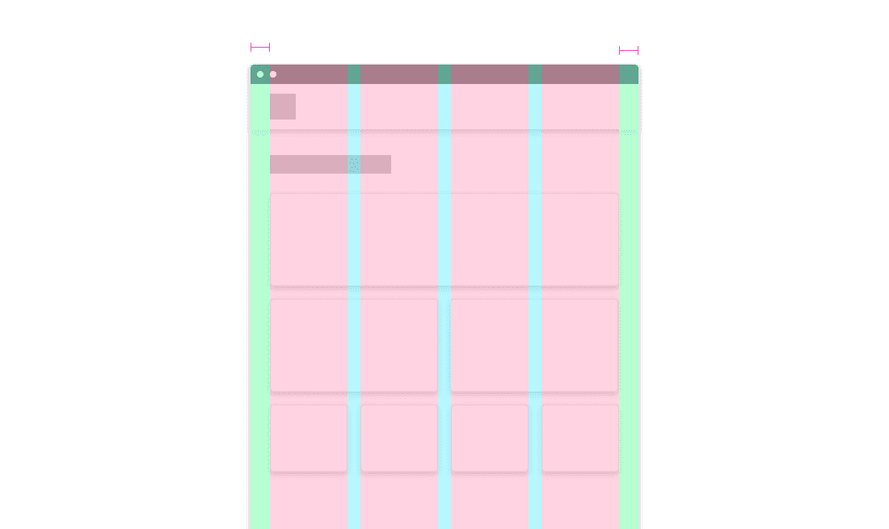
*_Grid_ Fixa - Exemplo 1.*

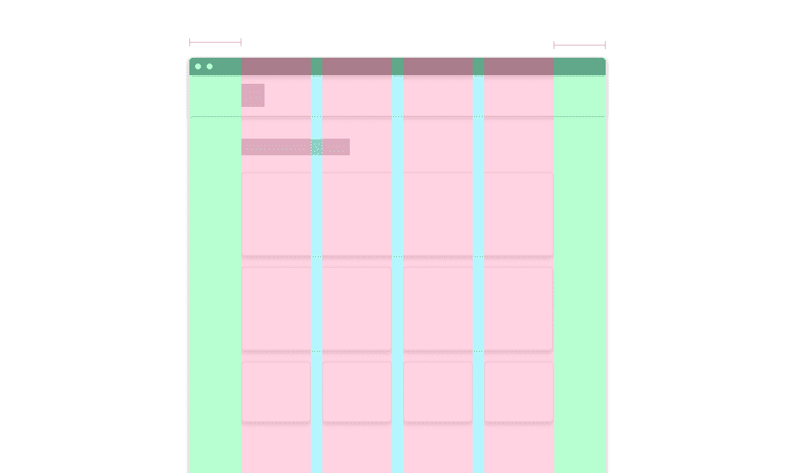
*_Grid_ Fixa - Exemplo 2.*

#### Largura Fluida

Tanto as margens como as medianizes possuem largura fixa, porém a largura das **colunas variam**, dimensionando também o conteúdo. Neste caso, a _grid_ ocupa todo o espaço disponível da tela (`max-width` de 100%).

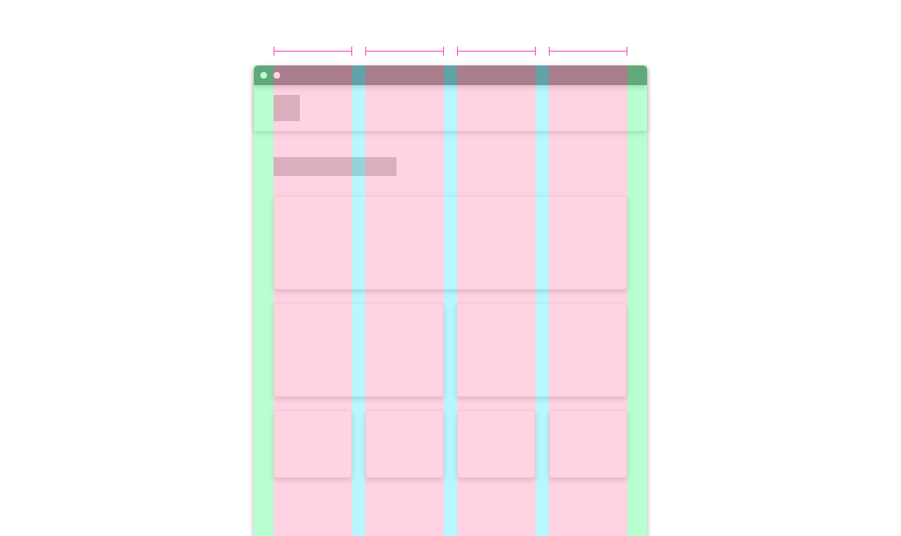
*_Grid_ Fluida - Exemplo 1.*

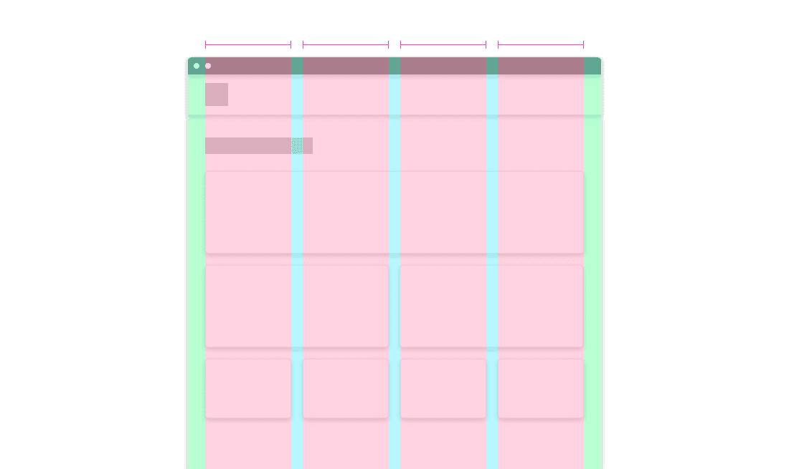
*_Grid_ Fluida - Exemplo 2.*

#### _Max-Width_

`Max-width` mede a distância entre o início da primeira coluna da _grid_ até o final da última coluna. Em outras palavras, é o tamanho da largura da _grid_ sem os elementos de margem.

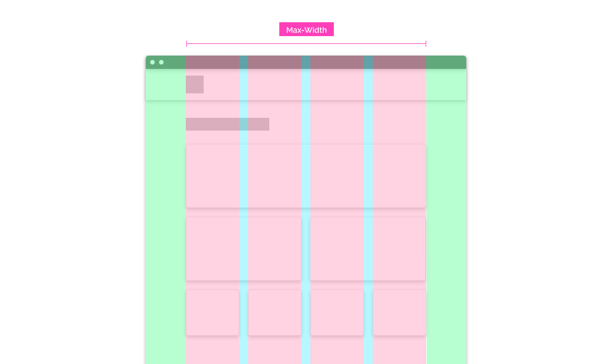
*_Max-width_ é o local onde está localizado todo o conteúdo principal da interface.*

### 2 - Sangria na _Grid_ (_Bleed_)

As margens são o espaço de segurança entre o conteúdo e as bordas direita e esquerda de uma tela. Por padrão, os elementos dentro da _grid_ nunca devem ultrapassar as margens. Porém, alguns componentes podem ter elementos que quebram essa regra e ocupam o espaço da margem, é o que chamamos de sangria na _grid_.

Quando a sangria na _grid_ acontece, a largura do _box/contêiner_ do elemento deve ocupar todo o espaço da margem enquanto o conteúdo informativo permanece dentro das colunas.

**Atenção:** somente elementos com funções visuais podem utilizar a sangria (como um contêiner/_background_, por exemplo). **Os conteúdos informativos devem respeitar as margens da _grid_**.

**Observação:** objetos podem "sangrar" invadindo espaços de outros elementos. Neste caso, veja as regras em _Fundamento > Espaçamento_. As regras de sangria de _grid_ só funcionam em _grids_ e em elementos que estão inseridos nela. Elementos flutuantes, por exemplo, não utilizam a _grid_.

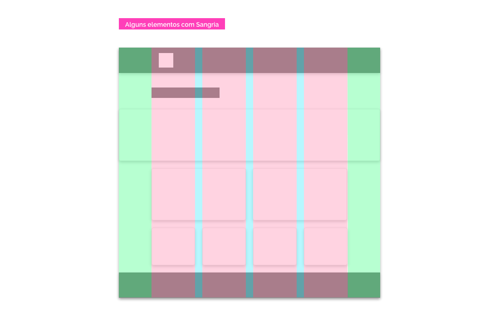
*Exemplo de _grid_ contendo elementos com sangria.*

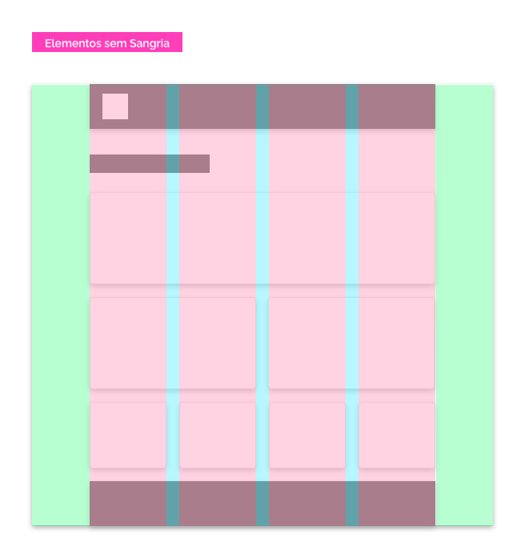
*Exemplo de _grid_ sem elementos com sangria.*

---

## Tipos de _Grid_

Existem 3 tipos de _grid_:

- **4 Colunas**;
- **8 Colunas**;
- **12 Colunas**.

Cada uma delas deve ser utilizada em um determinado _breakpoint_.

Pode-se utilizar **qualquer** comportamento de largura em qualquer tipo de _grid_. Porém, um pode ser mais recomendado que outro dependendo da _grid_.

### _Grid_ de 4 colunas

O conteúdo deve ser reorganizado em **4 colunas** respeitando a margem de **8px** nas laterais e medianiz de **16px**.

Recomenda-se o uso do comportamento de _grid_ fluida. Evite o uso do comportamento fixo para esta _grid_.

| _Property_   | _Value_               |
| ------------ | --------------------- |
| _max-width_* | até 559px             |
| _gutter_     | 16px                  |
| _columns_    | 4                     |
| _margin_**   | 8px                   |
| _breakpoint_ | _Smartphone Portrait_ |

_* para comportamento fluido o valor sempre será 100%._

_** margem mínima no comportamento fixo._

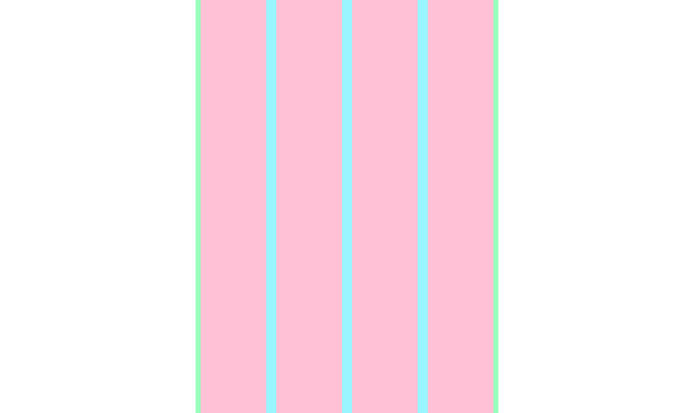
*Exemplo de _grid_ de 4 colunas.*

---

### _Grid_ de 8 colunas

O conteúdo é organizado em **8 colunas** se adequando às variações retrato e paisagem. O espaçamento entre as colunas será de **24px** e a margem externa ao conteúdo de **40px**.

Essa _grid_ pode ser utilizada em dois _breakpoints_ distintos. Um voltado para _smartphone landscape_ e _tablet portrait_, e outro voltado somente para _tablet landscape_. Desta forma gera maior flexibilidade de uso variando apenas comportamentos de responsividade e de largura em cada resolução.

Recomenda-se o uso do comportamento de _grid_ fluido. Utilize o comportamento fixo com cautela (geralmente em _tablet landscape_).

| _Property_   | _Value_                                                                                            |
| ------------ | -------------------------------------------------------------------------------------------------- |
| _max-width_* | de 496px até 911px (_tablet_ e _smartphone landscape_) ou de 912px até 1199px (_tablet landscape_) |
| _gutter_     | 24px                                                                                               |
| _columns_    | 8                                                                                                  |
| _margin_**   | 40px                                                                                               |
| _breakpoint_ | _Smartphone Landscape / Tablet Portrait_ ou _Tablet Landscape_                                     |

_* para comportamento fluido o valor sempre será 100%._

_** margem mínima no comportamento fixo._

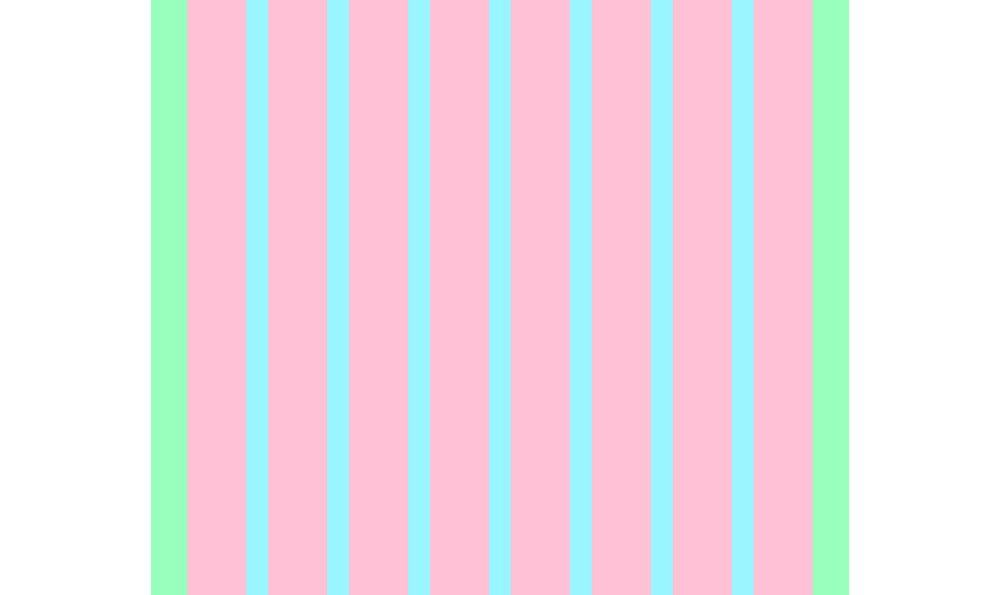
*Exemplo de _grid_ de 8 colunas.*

---

### Grid de 12 Colunas

Utilizam **12 colunas** com espaçamentos de **24 pixels** ou **40 pixels** entre elas (dependendo do _breakpoint_). Esse sistema permite a organização do conteúdo bastante diversificado.

Quando utilizada a _grid_ fixa, a margem externa ao conteúdo é variável (com tamanho mínimo de **40 pixels**) se adequando às dimensões da tela.

Essa _grid_ pode ser utilizada em dois _breakpoints_ distintos. Um voltado para _desktop_ e outro para TV. Por causa da grande diferença de espaço útil disponível a configuração da _grid_ e os comportamentos recomendados são distintos para cada _breakpoint_.

#### _Desktop_

O espaçamento das colunas é de **24 pixels**.

A recomendação do uso de _grid_ fluida ou fixa é variável pois depende do tipo de conteúdo utilizado:

- **_Grid_ fluida**: é recomendada para sistemas ou situações em que é preciso aproveitar a maior parte do espaço útil da tela do dispositivo.
- **_Grid_ fixa**: recomenda-se para portais ou conteúdos informativos (como _sites_ de notícia) em que o conteúdo não deve sofrer muita distorção, mantendo a leitura consistente.

| _Property_   | _Value_              |
| ------------ | -------------------- |
| _max-width_* | de 1200px até 1519px |
| _gutter_     | 24px                 |
| _columns_    | 12                   |
| _margin_**   | 40px                 |
| _breakpoint_ | _Desktop_            |

_* para comportamento fluido o valor sempre será 100%._

_** margem mínima no comportamento fixo._

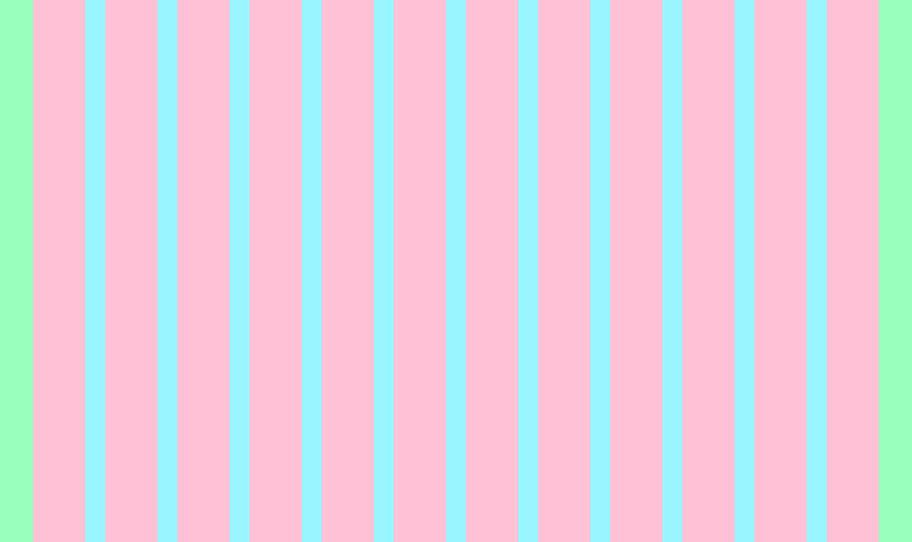
*Exemplo de _grid_ de 12 colunas para _desktop_.*

#### TV

O espaçamento das colunas é de **40 pixels**.

Recomenda-se o uso da _grid_ fixa. Por possuir uma área útil extensa pode causar problemas de legibilidade (nos textos) ou problemas de hierarquia da informação.

Utilize o comportamento fluido com cautela.

| _Property_   | _Value_            |
| ------------ | ------------------ |
| _max-width_* | a partir de 1520px |
| _gutter_     | 40px               |
| _columns_    | 12                 |
| _margin_**   | 40px               |
| _breakpoint_ | _TV_               |

_* para comportamento fluido o valor sempre será 100%._

_** margem mínima no comportamento fixo._

*Exemplo de _grid_ de 12 colunas para TV.*

---

## Responsividade

Responsividade é a forma como se estrutura a interface em diferentes resoluções de tela. O DSGov define diferentes _grids_ e _breakpoints_ para facilitar a aplicação deste conceito de forma prática. Porém, posicionar os elementos dentro de um _grid_ não significa que o seu _layout_ esteja responsivo. Entender como os elementos interagem com a _grid_ responsiva é uma etapa muito importante para promover uma experiência adequada ao usuário em diferentes dispositivos ou situações.

Pontos importantes quando tratamos de responsividade:

1. **_Breakpoint_ Vs Dispositivo**: apesar de ser uma correlação, o uso de uma determinada resolução não significa que o usuário esteja com o dispositivo X ou Y. Eventualmente pode ter sido alterado o espaço útil do navegador em um _desktop_ ou apenas o modo paisagem/retrato em um _tablet_ (girando o dispositivo). A interface deve funcionar independentemente do dispositivo; principalmente os elementos interativos (seja por toque ou clique).
1. **Navegação**: a navegação deve ser revista em cada _breakpoint_ utilizado. Baixas resoluções muitas vezes requerem uma área de interação ou textos maiores. Componentes voltados à navegação devem ser sempre validados.
1. **Clique Vs Toque**: em resoluções mais baixas o uso de interação por toque é mais comum e o contrário também é verdade. Trabalhe melhor essa questão quando adaptar o _layout_ a diferentes _grids_. Utilize o ponto forte de cada interação, como uso de "gestos" para criar interfaces voltadas ao toque, por exemplo. Não esqueça que focar em um modo de interação não significa esquecer o outro.
1. **Testar**: a melhor maneira de garantir uma boa experiência é testando a interface na maior quantidade possível de cenários diferentes. Realize uma bateria de testes considerando todos os cenários levantados anteriormente. Valide sua interface a cada _breakpoint_.

### Entendendo uma _grid_ responsiva

Antes de entender os elementos dentro da _grid_, é importante definir o tipo de comportamento utilizado na sua largura: _grid_ fixa ou _grid_ fluida?

Em uma _grid_ fixa é mais simples de trabalhar, pois os elementos não sofrem alteraçóes com a resolução da tela. A única preocupação será com os _breakpoints_.

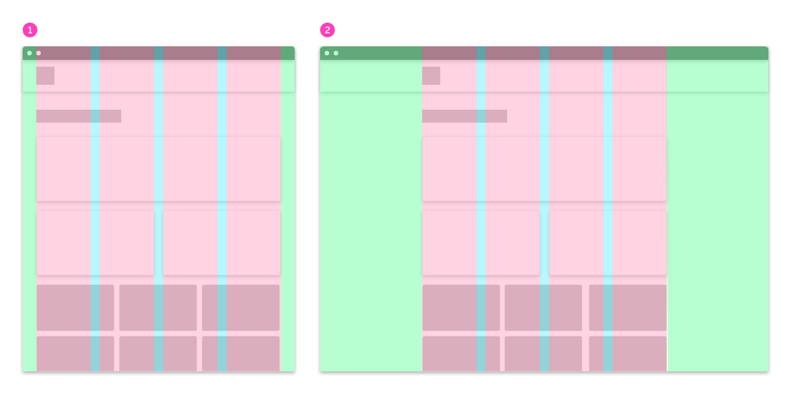
*Não há alteração nos elementos dos exemplos 1 e 2 na mudança de resolução de uma _grid_ fixa.*

A _grid_ fluida é mais complexa, pois, além dos _breakpoints_, deve-se entender como os elementos interagem com as colunas da _grid_ (se é **adaptativo** ou **estável**).

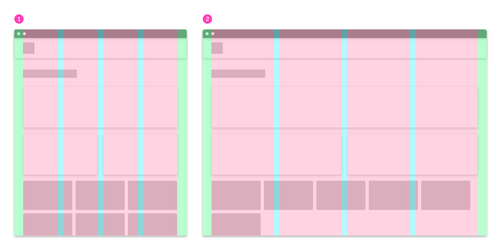
*Na _grid_ fluida os elementos tiveram seu posicionamento e dimensões alterados com a mudança de resolução.*

**Observação:** na _grid_ fixa ainda existe o conceito adaptativo e estável porém, como a largura das suas colunas são fixas, o controle é muito mais simples.

#### Elemento Adaptativo e Estável

Assim como a _grid_, as dimensões dos elementos seguem um comportamento bem parecido.

**Largura adaptativa (ou fluida)**: a largura do elemento está atrelada às colunas da _grid_. Ou seja, se a coluna mudar de tamanho, os elementos também terão a dimensão alterada.

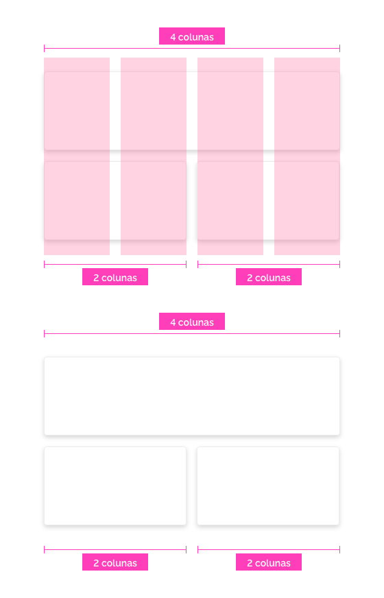
*Alguns elementos estão atrelados a 4 colunas da _grid_ e outras a 2 colunas.*

**Largura estável (ou fixa):** o elemento está apenas alinhado a _grid_. Independentemente do tamanho da coluna, ele não terá sua dimensão alterada. Porém, pode ser que o elemento não consiga se manter na mesma linha e precise "quebrar a linha" (passado para a linha subsequente. Podendo empilhar e empurrar os demais conteúdos abaixo dele).

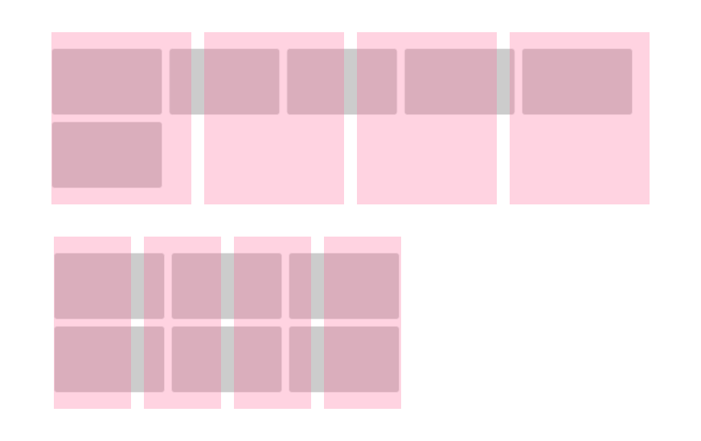
*No exemplo, os elementos estão apenas alinhados (à esquerda) dentro de uma área de 4 colunas. Caso haja mudança na resolução a largura dos elementos não sofrerá nenhuma alteração.*

As informações acima foram focadas na largura por ser um elemento que pode ser influenciado diretamente pela _grid_ responsiva do GOVBR-DS. Porém, tanto a largura quanto a altura podem ser influenciadas também pelos elementos internos de um componente (utilizando-se dos mesmos conceitos).

Por isso, sempre que criar um componente, tente responder a seguinte pergunta: "Ela interage com a _grid_ responsiva e/ou com seus elementos internos ou ela é totalmente fixa?"

É importante entender como funcionam todas as dimensões do componente, tanto a largura como a altura, para repassar ao desenvolvedor.

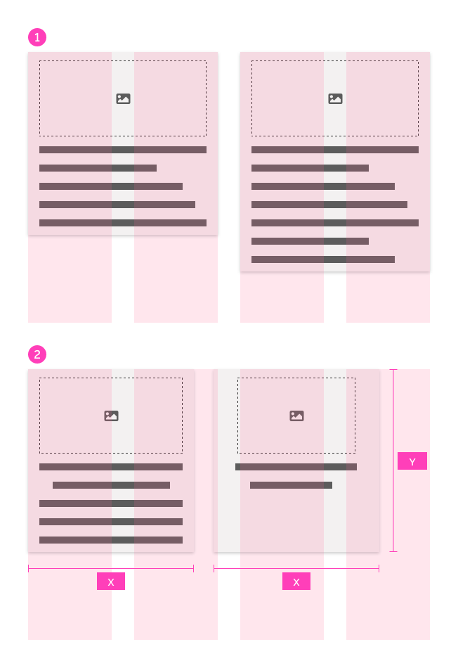
*Um _card_ pode ter altura adaptativa ao conteúdo interno, mas a largura é adaptativa a _grid_ (exemplo 1). É possível também criar um _card_ com dimensões totalmente estáveis (exemplo 2) que não variam nem com conteúdo interno e nem com a _grid_ (independentemente se ela for fluida ou fixa).*

Pode-se haver componentes que possuem comportamentos distintos dependendo da _grid_ utilizada.

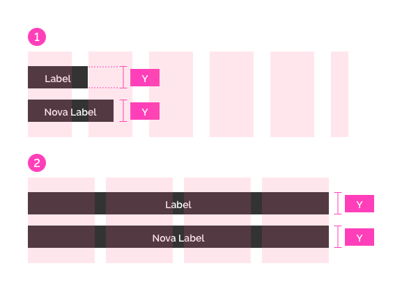
*Um botão pode ter altura estável e a largura adaptativa ao conteúdo interno em uma _grid_ de 12 colunas (exemplo 1). Porém em uma grid de 4 colunas ele passa a ter sua largura adaptativa a _grid_ (exemplo 2).*

Tenha em mente que, em uma mesma interface, pode existir grupos de elementos estáveis e grupos de elementos adaptativos.

*Interface com elementos adaptativos e estáveis.*

### Objetos Temporários

Objetos temporários são elementos ou regiões que surgem temporariamente. Podem ser ocultados ou visualizados ao interagir com um item da interface. Podem ser categorizados em **flutuantes** ou **persistentes**.

**Observação**: é importante que o elemento temporário esteja localizado próxima da área de conteúdo (`Max-width`) ou no limite do tamanho mínimo da margem da _grid_ principalmente quando utilizadas _grids_ fixas que podem possuir margens muito extensas.

#### Flutuantes

Não influenciam ou são influenciados diretamente pela _grid_ (independente do comportamento, não sofrem alteração). Porém, para cada tipo de _grid_ é importante rever como o elemento flutuante será apresentado na interface.

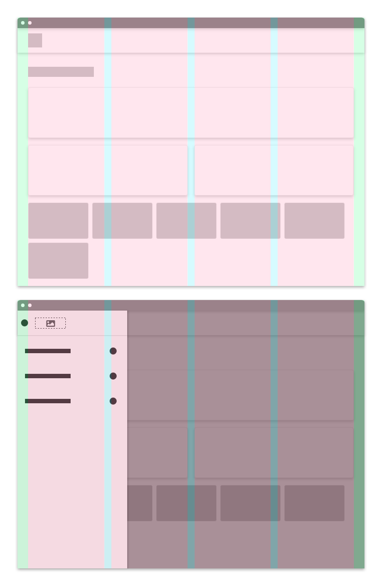
*Quando visível, o menu de navegação flutuante não afeta a _grid_ e nem os conteúdos da interface.*

#### Persistentes

São regiões que "empurram" ou "puxam" o conteúdo e/ou a _grid_ quando aparecem ou desaparecem respectivamente.

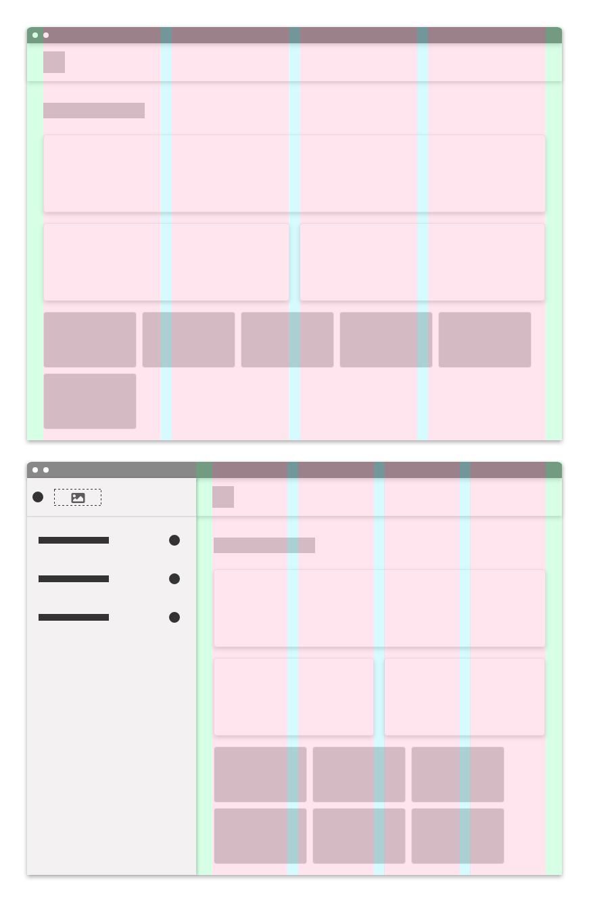
*Quando visível, o menu de navegação persistente comprime a _grid_ (e seu conteúdo).*
