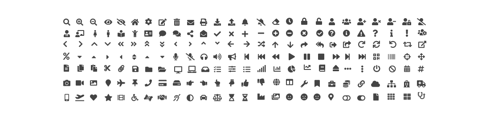
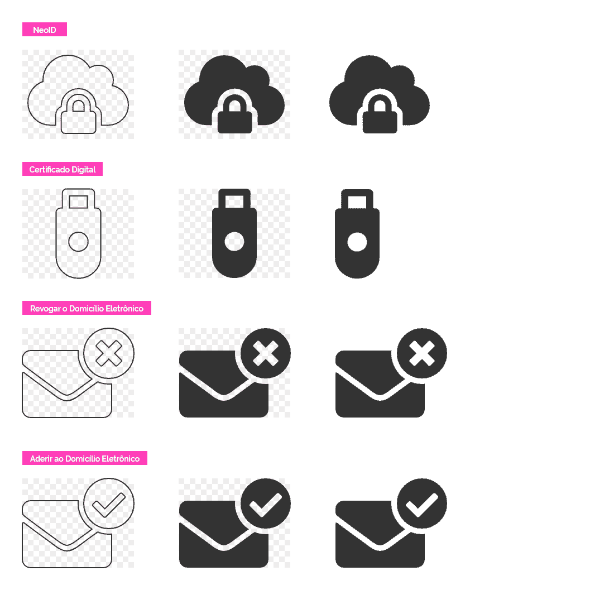

[version]: # (6.3.0)

Os ícones são representações gráficas que podem simbolizar uma ação, comunicar ao usuário possibilidades de mudança de estados entre os elementos de uma interface ou apenas ser uma representação gráfica de uma ação ou informação textual. No caso do _Design System_, foi escolhida a coleção de ícones **"_Font Awesome_"** (versão 5.10.2) por possuir uma boa variedade de ícones com _layout_ simples, sintético e amigável.

---

## Princípios

### Experiência Única

Além da diversidade, foi considerado que o _Font Awesome_ traria uma padronização visual dos ícones bastante importante no processo de reconhecimento e memorização pelos usuários. Optou-se pelo uso dos **estilos solid** (_style prefix_: `fas`) e a **brand** (_style prefix_: `fab`). Então as características gráficas, como preenchimento, peso visual devem ser preservadas no momento de construção de novos ícones.

Espera-se por tanto, que o padrão gráfico dos ícones por ser utilizado em vários sistemas do governo, passe a exercer um papel importante no reconhecimento dos usuários, no que diz respeito a interfaces governamentais.

Sendo assim, é imprescindível que o designer e o desenvolvedor priorizem a utilização dos ícones, como demonstrado na **Tabela de Orientações de Uso**. É fundamental atribuir os significados recomendados na tabela, evitando duplo sentido e facilitando o reconhecimento e memorização por parte do usuário.

### Eficiência e Clareza

Os ícones do _Font Awesome_ possuem um desenho sintético, porém de fácil compreensão, e devem exercer o papel de auxiliar o usuário na execução de uma ação ou na representação de um serviço.  É fundamental que a escolha do ícone para representar uma ideia, ação, ou serviço considere a experiência do usuário e esteja sempre alinhada ao contexto cultural do Brasil, para que seja de fácil reconhecimento público.

Para uma melhor legibilidade é recomendado que quando possível um _label_ ou _hint_ apareça ao lado do ícone reforçando a ideia a que foi atribuído.

Quando utilizado como um elemento de ação (seja um hiperlink, um botão ou qualquer outro elemento interativo) é importante que o ícone represente a ação a ser executada.

### Acessibilidade

Os ícones podem transmitir todos os tipos de informações significativas, por isso é importante que eles alcancem a maior quantidade possível de pessoas. Para que isso aconteça, o _Font Awesome_ categoriza seus ícones em dois tipos: **decorativos** e **semânticos**.

A [acessibilidade](https://fontawesome.com/how-to-use/on-the-web/other-topics/accessibility) para _webfonts_ exige um pouco mais de trabalho, pois o método _Webfont_ com CSS não pode adicionar atributos ou elementos ao seu HTML.

Ao usar ícones em sua interface do usuário, existem técnicas manuais e formas de ajudar a tecnologia assistencial a ignorar ou entender melhor o _Font Awesome_.

#### 1 | Ícones Decorativos

São usados apenas para reforço visual ou de _branding_. Se forem removidos da página, os usuários ainda entenderiam e poderiam utilizar a página.

Se os ícones são puramente decorativos é necessário adicionar manualmente um atributo `aria-hidden` a cada um deles para que sejam acessíveis.

``` html
<i class="fas fa-camera-retro" aria-hidden></i>
```

##### SVG com JavaScript

``` html
<i class="fas fa-camera-retro"></i>
```

A acessibilidade do _Font Awesome_ adiciona automaticamente `aria-hidden=true` e `role=“img”` aos seus atributos SVG _in-line_, para que seus ícones estejam adequadamente acessíveis.

``` html
<svg class="svg-inline--fa fa-camera-retro fa-w-16" aria-hidden="true" data-fa-i2svg="" data-prefix="fas" data-icon="camera-retro" role="img" xmlns="http://www.w3.org/2000/svg" viewBox="0 0 512 512">
  <path fill="currentColor" d="M48 32C21.5 32 0 53.5 0 80v352c0 26.5 21.5 48 48 48h416c26.5 0 48-21.5 48-48V80c0-26.5-21.5-48-48-48H48zm0 32h106c3.3 0 6 2.7 6 6v20c0 3.3-2.7 6-6 6H38c-3.3 0-6-2.7-6-6V80c0-8.8 7.2-16 16-16zm426 96H38c-3.3 0-6-2.7-6-6v-36c0-3.3 2.7-6 6-6h138l30.2-45.3c1.1-1.7 3-2.7 5-2.7H464c8.8 0 16 7.2 16 16v74c0 3.3-2.7 6-6 6zM256 424c-66.2 0-120-53.8-120-120s53.8-120 120-120 120 53.8 120 120-53.8 120-120 120zm0-208c-48.5 0-88 39.5-88 88s39.5 88 88 88 88-39.5 88-88-39.5-88-88-88zm-48 104c-8.8 0-16-7.2-16-16 0-35.3 28.7-64 64-64 8.8 0 16 7.2 16 16s-7.2 16-16 16c-17.6 0-32 14.4-32 32 0 8.8-7.2 16-16 16z"></path>
</svg>
```

#### 2 | Ícones Semânticos

São aqueles usados para transmitir um significado, ao invés de apenas servir de decoração. Isso inclui ícones sem texto ao lado deles usando como controle interativo (botões, elementos de formulário, _toggles_…).

Se os ícones tiverem significado semântico, é preciso adicionar manualmente algumas coisas para que ele seja acessado apropriadamente:

- Atributo `aria-hidden`.
- Forneça uma alternativa de texto dentro de um elemento `<span>` (ou similar). Inclua também o CSS apropriado
para ocultar visualmente o elemento, mantendo-o acessível a tecnologias assistivas.
- Atributo `title` no ícone para fornecer uma dica de ferramenta para usuários com visão e que utilizam o mouse.

``` html
<i aria-hidden class="fas fa-car" title="Time to destination by car"></i>
<span class="sr-only">Time to destination by car:</span>
<span>4 minutes</span>
```

No caso de elementos interativos focalizáveis, existem várias opções para incluir um texto ou rótulo alternativo ao elemento, sem a necessidade de qualquer ocultação visual `<span>` ou semelhante.

Como, por exemplo, adicionando o atributo `aria-label` com uma descrição de texto ao próprio elemento interativo será suficiente para fornecer um nome alternativo acessível.

Se você precisar fornecer uma dica visual (_tooltip_) em um _mouseover/focus_, recomendamos usar o atributo `title` ou uma solução de _tooltip_ personalizado.

``` html
<a href="path/to/shopping/cart" aria-label="View 3 items in your shopping cart">
  <i aria-hidden class="fas fa-shopping-cart"></i>
</a>
```

``` html
<a aria-label="Skip to main navigation" href="#navigation-main">
  <i aria-hidden class="fas fa-bars"></i>
</a>
```

``` html
<a aria-label="Delete" class="btn btn-danger" href="path/to/settings">
  <i aria-hidden class="fas fa-trash" title="Delete this item?"></i>
</a>
```

##### SVG com JavaScript

Obter a acessibilidade correta pode ser difícil, por isso, o _Font Awesome_ simplifica o processo com o recurso de acessibilidade automática. Usando um pouco de JS, adicionando elementos e atributos no HTML de suporte para que os ícones fiquem acessíveis ao público mais amplo possível.

Se o ícone possuir significado semântico, coloque um atributo `title=“meaning”`.  A acessibilidade automática cuida do resto, adicionando o seguinte:

- Função ARIA adequada ( `role=“img”` )
- Tag `title` com um atributo `id` adequado
- Atributo `aria-labelledby`e conecte-o a uma tag `title`

``` html
<i title="Magic is included!" class="fas fa-magic"></i>
```

``` html
<svg title="Magic is included!" class="svg-inline--fa fa-magic fa-w-16" aria-labelledby="svg-inline--fa-title-1" data-fa-i2svg="" data-prefix="fas" data-icon="magic" role="img" xmlns="http://www.w3.org/2000/svg" viewBox="0 0 512 512">
  <title id="svg-inline--fa-title-1">Magic is included!</title>
  <path fill="currentColor" d="M101.1 505L7 410.9c-9.4-9.4-9.4-24.6 0-33.9L377 7c9.4-9.4 24.6-9.4 33.9 0l94.1 94.1c9.4 9.4 9.4 24.6 0 33.9L135 505c-9.3 9.3-24.5 9.3-33.9 0zM304 159.2l48.8 48.8 89.9-89.9-48.8-48.8-89.9 89.9zM138.9 39.3l-11.7 23.8-26.2 3.8c-4.7.7-6.6 6.5-3.2 9.8l19 18.5-4.5 26.1c-.8 4.7 4.1 8.3 8.3 6.1L144 115l23.4 12.3c4.2 2.2 9.1-1.4 8.3-6.1l-4.5-26.1 19-18.5c3.4-3.3 1.5-9.1-3.2-9.8L160.8 63l-11.7-23.8c-2-4.1-8.1-4.1-10.2.1zm97.7-20.7l-7.8 15.8-17.5 2.6c-3.1.5-4.4 4.3-2.1 6.5l12.6 12.3-3 17.4c-.5 3.1 2.8 5.5 5.6 4L240 69l15.6 8.2c2.8 1.5 6.1-.9 5.6-4l-3-17.4 12.6-12.3c2.3-2.2 1-6.1-2.1-6.5l-17.5-2.5-7.8-15.8c-1.4-3-5.4-3-6.8-.1zm-192 0l-7.8 15.8L19.3 37c-3.1.5-4.4 4.3-2.1 6.5l12.6 12.3-3 17.4c-.5 3.1 2.8 5.5 5.6 4L48 69l15.6 8.2c2.8 1.5 6.1-.9 5.6-4l-3-17.4 12.6-12.3c2.3-2.2 1-6.1-2.1-6.5l-17.5-2.5-7.8-15.8c-1.4-3-5.4-3-6.8-.1zm416 223.5l-7.8 15.8-17.5 2.5c-3.1.5-4.4 4.3-2.1 6.5l12.6 12.3-3 17.4c-.5 3.1 2.8 5.5 5.6 4l15.6-8.2 15.6 8.2c2.8 1.5 6.1-.9 5.6-4l-3-17.4 12.6-12.3c2.3-2.2 1-6.1-2.1-6.5l-17.5-2.5-7.8-15.8c-1.4-2.8-5.4-2.8-6.8 0z"></path>
</svg>
```

### Reutilização e Colaboração

Interfaces digitais do governo devem ser reutilizáveis devido à diversidade de serviços disponíveis, sendo assim, o uso do _Font Awesome_ facilita esse reuso, por ser mais fácil de implementar. Caso haja necessidade podem ser incluídos novos ícones, porém é necessário consultar a tabela de orientações de uso, para verificar se a funcionalidade já foi atribuída a algum ícone. É interessante que haja um trabalho em conjunto de criação e validação entre a equipe que vai propor novos ícones e a equipe de _design_ para que sejam preservadas as características do padrão gráfico do _Design System_.

---

## Font Awesome

[Font Awesome](https://fontawesome.com/) É um conjunto de ferramentas de fontes e ícones com base em CSS e LESS. Foi criado por Dave Gandy para uso com o Twitter Bootstrap e mais tarde foi incorporado no BootstrapCDN.

A versão 5.10.2 possui uma grande variedade de ícones. Foram expostos aqui, apenas alguns, para que seja constatado sua variedade. Caso haja alguma funcionalidade, que não seja facilmente representada pelos que foram aqui apresentados, deve-se primeiro procurar uma opção dentro dos demais disponíveis na família de ícones e caso não haja, pode-se desenhar um novo, desde que, seja mantido o padrão visual já definido e passe posteriormente pela validação da equipe de _Design_.

No final deste documento, foi incluído as **orientações de uso** de alguns dos ícones e essa tabela deve ser seguida para que haja consistência entre os sistemas do governo.

Atualmente no DS Gov são utilizados 2 estilos disponíveis: **Solid** e a **Brand**.

### Estilo _Solid_

Estilo padrão. Pode ser utilizado em todas as situações que necessitam do uso de ícones.


_Alguns ícones da Font Awesome Solid_

### Estilo _Brand_

Estilo muito parecido ao Solid, porém, são limitados, pois, são voltados para representações das marcas atuais no mercado, inclusive das redes-sociais.


_Alguns ícones da Font Awesome Brand_

Caso não encontre o ícone adequado nesta biblioteca (ou nos estilos mencionados acima), utilize as instruções descritas em **Ícones Personalizados**.

---

## Ícones Personalizados

Em algumas situações, a família _Font Awesome_ pode não suprir todas as necessidades de uma interface. Nestas situações, pode-se criar ícones para representar as ações específicas de uma aplicação. Essa criação poderá ser feita tanto por técnicas de transformação (utilizando os próprios ícones da família) tal como o [Layering](https://fontawesome.com/v5.9.0/how-to-use/on-the-web/styling/layering); como na criação do zero de algum novo ícone. Independente da forma utilizada, deve-se seguir todas as características visuais de construção já padronizadas do _Font Awesome Solid_.

Veja alguns ícones criados abaixo utilizando alguns desses modos:


_Exemplo de ícones personalizados_

## Anatomia e Comportamento

### Grid do Font Awesome

Os ícones do _Font Awesome_ foram determinados em uma grid de 20x16px. Então, caso haja necessidade de criar ícones, deve-se seguir a mesma grid para que sejam conservadas as proporções e características estéticas dos mesmos.


_Grid utilizado para criação de ícones personalizados baseados no Font Awesome_

### Tamanho Padrão no _Design System_

O tamanho base para os ícones possui o valor de corpo **16px**. Seguindo os seguintes _design tokens_ e escala na propriedade `font-size`:

| Token Icon Size  | Value         |
| ---------------- | ------------- |
| --icon-size-base | 16px (1em)    |
| --icon-size-xs   | .5em (8px)    |
| --icon-size-sm   | .75em (12px)  |
| --icon-size-lg   | 1.25em (20px) |
| --icon-size-2x   | 2em (32px)    |
| --icon-size-3x   | 3em (48px)    |
| --icon-size-4x   | 4em (64px)    |
| --icon-size-5x   | 5em (80px)    |
| --icon-size-6x   | 6em (96px)    |
| --icon-size-7x   | 7em (112px)   |
| --icon-size-8x   | 8em (128px)   |
| --icon-size-9x   | 9em (144px)   |
| --icon-size-10x  | 10em (160px)  |

Utilizando os _Design Tokens_ nas classes pré-definidas das escalas do Font Awesome, temos as seguintes aplicações:

| Class  | Token Icon Size  |
| ------ | ---------------- |
| fas    | --icon-size-base |
| fa-xs  | --icon-size-xs   |
| fa-sm  | --icon-size-sm   |
| fa-lg  | --icon-size-lg   |
| fa-2x  | --icon-size-2x   |
| fa-3x  | --icon-size-3x   |
| fa-4x  | --icon-size-4x   |
| fa-5x  | --icon-size-5x   |
| fa-6x  | --icon-size-6x   |
| fa-7x  | --icon-size-7x   |
| fa-8x  | --icon-size-8x   |
| fa-9x  | --icon-size-9x   |
| fa-10x | --icon-size-10x  |

### Área Mínima de Interação

Os ícones interativos devem possuir uma área mínima de interação (mesmo nos casos onde o tamanho do ícone seja menor que da área mínima) de modo a facilitar a interação do ícone por parte do usuário.
A área mínima de interação serve também como espaço útil do ícone para contagem de espaçamento entre um elemento e outro. Existem 2 tipos de área mínima de interação: **Área de Clique** e **Área de Toque**.

#### Área de Clique

Utilizada em interfaces não tácteis, como, por exemplo, dispositivos que utilizam o mouse. Essa área, deve ser de no mínimo 24x24px.


_Especificação de área mínima para cliques_

#### Área de Toque

A área de toque dos ícones determina que além da área ocupada pelo ícone há um espaço "invisível", que pode ser facilmente acessado pelo usuário, através do toque na tela.

A área de toque deve ser de 48x48px, garantindo que a experiência do usuário seja satisfatória no momento de acessar as funcionalidades através dos ícones, em dispositivos móveis ou artefatos digitais.


_Especificação de área mínima para toques_

---

## Orientação de Uso

As principais funcionalidades dos sistemas do governo foram mapeadas e atribuídas a cada uma delas um símbolo representativo - os ícones da versão sólida do _FontAwesome_. É fundamental que os desenvolvedores e _designers_ utilizem os ícones abaixo com mesma ação que lhe foi atribuída, isso garante que cada sistema acessado pelo cidadão utilize a mesma linguagem e significado, tornando mais rápida a experiência e o reconhecimento do público ao acessar as funcionalidades dos diversos sistemas .

**Observação:** Lembre-se que quando utilizado para representar uma ação, o ícone deve corresponder a ação que será executada ao interagir com o elemento. Quando utilizado junto com um elemento não interativo, ele pode representar outras situações, como por exemplo algum tipo de estado.

| Ícone                                       | Ação                                    |  Classe (_Font Awesome_)  |
| ------------------------------------------- | --------------------------------------- | :-----------------------: |
| <i class="fas fa-search"></i>               | Pesquisar                               |        `fa-search`        |
| <i class="fas fa-eye"></i>                  | Visualizar                              |         `fa-eye`          |
| <i class="fas fa-eye-slash"></i>            | Não Visualizar                          |      `fa-eye-slash`       |
| <i class="fas fa-home"></i>                 | Ir para Tela Inicial                    |         `fa-home`         |
| <i class="fas fa-cog"></i>                  | Acessar Configurações                   |         `fa-cog`          |
| <i class="fas fa-edit"></i>                 | Editar                                  |         `fa-edit`         |
| <i class="fas fa-trash-alt"></i>            | Excluir                                 |      `fa-trash-alt`       |
| <i class="fas fa-envelope"></i>             | Acessar Mensagem                        |       `fa-envelope`       |
| <i class="fas fa-envelope-open"></i>        | Acessar Mensagem Lida                   |    `fa-envelope-open`     |
| <i class="fas fa-download"></i>             | Baixar Arquivo/Download                 |       `fa-download`       |
| <i class="fas fa-upload"></i>               | Subir Arquivo/Upload                    |        `fa-upload`        |
| <i class="fas fa-bell"></i>                 | Acessar Alertar/Notificações            |         `fa-bell`         |
| <i class="fas fa-bell-slash"></i>           | Desabilitar Notificações                |      `fa-bell-slash`      |
| <i class="fas fa-eraser"></i>               | Limpar                                  |        `fa-eraser`        |
| <i class="fas fa-clock"></i>                | Marcar Hora                             |        `fa-clock`         |
| <i class="fas fa-lock"></i>                 | Bloquear                                |         `fa-lock`         |
| <i class="fas fa-unlock"></i>               | Desbloquear                             |        `fa-unlock`        |
| <i class="fas fa-user"></i>                 | Acessar Login                           |         `fa-user`         |
| <i class="fas fa-check"></i>                | Confirmar                               |        `fa-check`         |
| <i class="fas fa-times"></i>                | Fechar                                  |        `fa-times`         |
| <i class="fas fa-plus"></i>                 | Adicionar                               |         `fa-plus`         |
| <i class="fas fa-minus"></i>                | Subtrair                                |        `fa-minus`         |
| <i class="fas fa-check-circle"></i>         | Mensagem Sucesso                        |     `fa-check-circle`     |
| <i class="fas fa-info-circle"></i>          | Mensagem Informativa                    |     `fa-info-circle`      |
| <i class="fas fa-exclamation-triangle"></i> | Mensagem Alerta                         | `fa-exclamation-triangle` |
| <i class="fas fa-times-circle"></i>         | Mensagem Erro                           |     `fa-times-circle`     |
| <i class="fas fa-question"></i>             | Ajuda                                   |       `fa-question`       |
| <i class="fas fa-chevron-left"></i>         | Voltar                                  |     `fa-chevron-left`     |
| <i class="fas fa-chevron-right"></i>        | Avançar                                 |    `fa-chevron-right`     |
| <i class="fas fa-chevron-up"></i>           | Retrair                                 |      `fa-chevron-up`      |
| <i class="fas fa-chevron-down"></i>         | Expandir                                |     `fa-chevron-down`     |
| <i class="fas fa-sync"></i>                 | Atualizar                               |         `fa-sync`         |
| <i class="fas fa-paperclip"></i>            | Anexar                                  |      `fa-paperclip`       |
| <i class="fas fa-bars"></i>                 | Acessar Menu Principal                  |         `fa-bars`         |
| <i class="fas fa-ellipsis-v"></i>           | Acessar Opções                          |      `fa-ellipsis-v`      |
| <i class="fas fa-volume-up"></i>            | Áudio Ativado                           |      `fa-volume-up`       |
| <i class="fas fa-volume-mute"></i>          | Áudio Desativado/Mudo                   |     `fa-volume-mute`      |
| <i class="fas fa-deaf"></i>                 | Acessibilidade Ativar Libras            |         `fa-deaf`         |
| <i class="fas fa-adjust"></i>               | Acessibilidade Ativar Contraste         |        `fa-adjust`        |
| <i class="fas fa-toggle-off"></i>           | Desativar/Desabilitar                   |      `fa-toggle-off`      |
| <i class="fas fa-toggle-on"></i>            | Ativar/Habilitar                        |      `fa-toggle-on`       |
| <i class="fas fa-th-large"></i>             | Densidade Baixa                         |       `fa-th-large`       |
| <i class="fas fa-th"></i>                   | Densidade Alta                          |          `fa-th`          |
| <i class="fas fa-calendar-alt"></i>         | Selecionar Data                         |     `fa-calendar-alt`     |
| <i class="fas fa-print"></i>                | Imprimir                                |        `fa-print`         |
| <i class="fas fa-sliders-h"></i>            | Filtrar                                 |      `fa-sliders-h`       |
| <i class="fas fa-sort-down"></i>            | Ordenado Decrescente                    |      `fa-sort-down`       |
| <i class="fas fa-sort-up"></i>              | Ordenado Crescente                      |       `fa-sort-up`        |
| <i class="fas fa-sort"></i>                 | Ordenado Padrão                         |         `fa-sort`         |
| <i class="fas fa-image"></i>                | Incluir Imagem                          |        `fa-image`         |
| <i class="fas fa-copy"></i>                 | Copiar                                  |         `fa-copy`         |
| <i class="fas fa-cut"></i>                  | Cortar                                  |         `fa-cut`          |
| <i class="fas fa-folder"></i>               | Acessar Diretório                       |        `fa-folder`        |
| <i class="fas fa-folder-open"></i>          | Diretório Aberto/Acessado/Atual         |     `fa-folder-open`      |
| <i class="fas fa-share-square"></i>         | Exportar/Compartilhar Arquivo/Documento |     `fa-share-square`     |
| <i class="fas fa-share"></i>                | Enviar                                  |        `fa-share`         |
| <i class="fas fa-clipboard-list"></i>       | Fiscalizar                              |    `fa-clipboard-list`    |
| <i class="fas fa-caret-down"></i>           | Abrir Dropdown                          |      `fa-caret-down`      |
| <i class="fas fa-caret-up"></i>             | Fechar Dropdown                         |       `fa-caret-up`       |
| <i class="fas fa-caret-right"></i>          | Abrir Dropdown Horizontal               |     `fa-caret-right`      |
| <i class="fas fa-caret-left"></i>           | Fechar Dropdown Horizontal              |      `fa-caret-left`      |
