Ilustração é uma imagem que comunica um estado de forma mais amigável. As ilustrações ajudam a transmitir ideias simples ou complexas de maneira objetiva. Eles devem ser significativas e refletir o contexto e o estado emocional do usuário.

Ilustração é uma poderosa ferramenta visual e emocional. Portanto, use-a com moderação e identifique cuidadosamente as situações certas para ela. Se uma ilustração for usada apenas como elemento decorativo, pode perder seu poder comunicativo e distrair as pessoas.

*Conte histórias e engaje seus usuários utilizando o recurso de ilustração.*

As ilustrações podem:

-   tornar ideias complexas mais acessíveis

-   representar a identidade de governo - personalidade, voz e plataforma - de forma eficiente e clara

-   ajudar a contar histórias e a transmitir ideias com atenção - evite o uso meramente decorativo.

---

## Anatomia

A Ilustração é constituída por:

| ID  | Nome                  |                            Referência                             | Uso         |
| --- | --------------------- | :---------------------------------------------------------------: | ----------- |
| 1   | Elementos de fundo    |                                ---                                | Obrigatório |
| 2   | Luz e sombra          |                                ---                                | Obrigatório |
| 3   | Personagem            |                                ---                                | Opcional    |
| 4   | *Spot* ou objetos     |                                ---                                | Obrigatório |
| 5   | Cor                   | [Fundamento Cor](https://www.gov.br/ds/fundamentos-visuais/cores) | Opcional    |
| 6   | Linha de Contorno     |                                ---                                | Opcional    |
| 7   | Textura               |                                ---                                | Opcional    |
| 8   | Padrões ou *Patterns* |                                ---                                | Opcional    |

*Elementos que compõem uma ilustração.*

---

## Detalhamento dos Itens

### 1. Elementos de fundo (Obrigatório)

Nossos elementos secundários são simplificados e geométricos. Os elementos de fundo são dimensionados em proporção à ilustração. Eles servem para dar ênfase aos elementos principais, ou funcionam como agregadores da composição, unindo e integrando elementos.

*Use apenas cores que realcem os elementos principais da composição.*

**Atenção:** tenha o cuidado de não poluir a ilustração com o uso exagerado de elementos de fundo. Isso pode prejudicar o entendimento da mensagem a ser transmitida pelo elemento principal.

### 2. Luz e sombra (Obrigatório)

Para criar um conjunto de ilustrações fácil de personalizar e manter, usamos apenas camadas em preto e branco para fazer Luz e sombra. Essas camadas são definidas em *Soft Light* ou equivalente (opção de modo de mesclagem, utilizados em diversos *softwares* de edição gráfica) e "brincamos" com a opacidade seguindo uma regra de incremento de 10%.

*Aplicação suave e harmônica de luz e sombra, utilizando apenas branco e preto.*

Este método permite alterar rapidamente todo o tom da cor de uma ilustração, alterando apenas a camada de cor de fundo. Essa abordagem é escalonável e amigável.

### 3. Personagem (Opcional)

Cada ilustração de personagem tem personalidade própria e é representada através de recursos físicos, trajes e acessórios.

*Estes são exemplos de nossos personagens. Não é o conjunto completo.*

Nossos usuários, são exclusivamente diferentes. É importante para nós representá-los, celebrando eles e sua história. Para isso, adicionamos cores à nossa paleta de cores especificamente para abordar a gama de diversidade em tons de pele e cores de cabelo. Criamos personagens, incluindo gênero, etnia e ocupação.

#### A diversidade é fundamental

Ao criar um personagem, deve-se ter em mente a pluralidade racial e cultural presente no Brasil. Raça e etnia são usados ​​para categorizar certas seções da população. Em termos básicos, a raça descreve os traços físicos e a etnia se refere à identificação cultural. A raça também pode ser identificada como algo que você herda, enquanto a etnia é algo que você aprende.

##### Raça

A raça geralmente está associada à biologia e ligada a características físicas, como textura do cabelo ou cor da pele, e cobre uma gama relativamente estreita de opções. No entanto, pessoas de pele / textura de cabelo semelhantes podem ser definidas como raças diferentes, e as definições no Brasil mudaram com o tempo. Na atual classificação do IBGE, a respeito do quesito "cor e raça", encontram-se as seguintes categorias:

-   Brancos

-   Pardos

-   Pretos

-   Amarelos

-   Indígenas

Mesmo que alguém se considere de uma determinada raça, ela pode se identificar mais com sua etnia individual, em oposição à raça. Isso pode se aplicar a qualquer membro de qualquer raça.

##### Etnia

Etnia é um termo mais amplo do que raça. O termo é usado para categorizar grupos de pessoas de acordo com sua expressão cultural e identificação. Pontos comuns como origem racial, nacional, tribal, religiosa, linguística ou cultural podem ser usados ​​para descrever a etnia de alguém.
Embora alguém possa dizer que sua raça é "preta", sua etnia pode ser italiana, ou alguém pode dizer que sua raça é "branca" e sua etnia ser irlandesa.
Esses conceitos auxiliam e norteiam a criação de personagens, sempre observando o público alvo que seu produto deseja atingir.

**Atenção:** procure sempre que possível diversificar o uso de raças e etnias, pois o povo brasileiro é conhecido e identificado pela pluralidade racial e étnica, mas tenha cuidado para evitar esteriótipos.

### 4. *Spot* ou Objetos (Obrigatório)

Uma ilustração *Spot* (ou objeto) é uma pequena ilustração (geralmente de um único objeto) que se destaca por si só. Por esse motivo, muitas vezes pode ser confundido ou referido como um “ícone”, mas as ilustrações pontuais são mais ilustrativas ou detalhadas do que simples ícones de símbolo. Por exemplo, um animal ou pessoa pode ser uma ilustração pontual se for um objeto simples, em vez de uma ilustração completa do personagem.
Por serem frequentemente usados no produto como um estado vazio ou em uma composição com outras ilustrações pontuais, eles são pequenos e simples. Eles geralmente não incluem qualquer pessoa, mas ocasionalmente incluem alguns elementos complementares, dependendo do *design*.

*Mesmo uma pequena composição pode contar uma história.*

### 5. Cor (Opcional)

Existem muitas maneiras diferentes de combinar amostras da paleta de cores, dependendo do estilo e da intenção de sua ilustração. Abaixo estão algumas abordagens comuns a serem consideradas.

#### Monocromática

As ilustrações monocromáticas têm uma qualidade simples e direta e são compostas por matizes e tons de um único matiz. Esta técnica tem uma aparência lógica, sistemática e projetada. Dentro deste esquema, podem ser aplicadas técnicas de uniformidade ou tonalidade

*Paleta de cores monocromática.*

#### Análoga

Cores análogas trazem uma qualidade harmoniosa usando matizes vizinhos da paleta. Esta técnica adiciona profundidade sutil, movimento e fidelidade a uma ilustração. Dois a três matizes funcionam melhor para esta técnica. Cores adicionais provavelmente adicionarão complexidade desnecessária e devem ser evitadas.

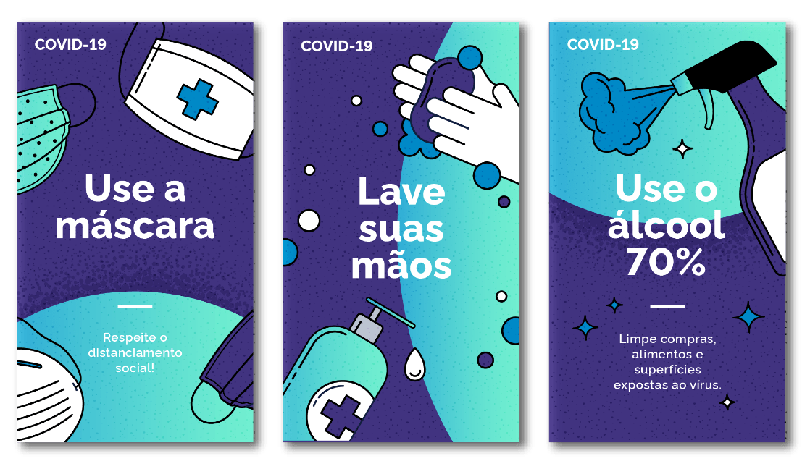
*Paleta de cores análogas.*

#### Complementar

A natureza oposta das cores complementares cria vibração e tensão, o que pode ser bastante eficaz quando você deseja chamar a atenção para um elemento. Grandes campos de cores complementares podem ser bastante chocantes, então é melhor usá-los como detalhes pontuais que trazem a quantidade certa de contraste e vida para uma ilustração.

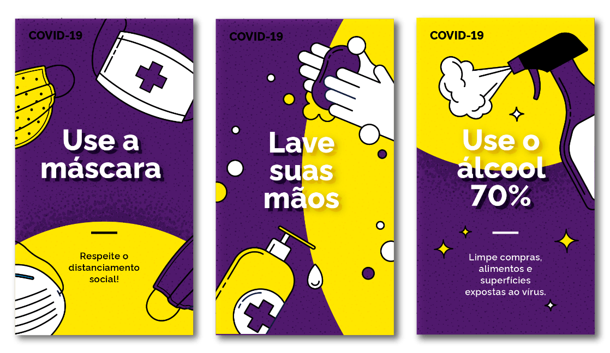
*Paleta de cores complementares.*

#### Elementos interativos

Tenha cuidado ao usar a cor dos elementos interativos em uma ilustração para que não haja competição entre as informações.

*Escolha cores que mantenham uma delimitação clara em torno dos pontos focais. Não use abundância de cores de elementos interativos, isso pode obscurecer elementos importantes do layout.*

#### Cores adicionais

Em alguns casos, cores adicionais serão necessárias para obter uma ilustração mais realista. Em geral, os tons vermelho e amarelo são reservados para cores de alerta da IU, mas podem ser usados, se necessário. As cores adicionais devem ser limitadas a casos de uso específicos, como tons de pele.

*Exemplos de tons de pele, existem outras opções.*

#### O limite de 5 cores

Para manter as ilustrações simples, leves e dinâmicas, use no máximo 5 cores principais por ilustração. Isso significa que as únicas outras cores permitidas seriam para sombreamento. Para manter as paletas mínimas e simples, todas as cores devem ser aplicadas com uma regra 60/30/10. Esta regra de *design* de interiores é uma técnica de decoração atemporal que pode ajudá-lo a montar um esquema de cores facilmente. A proporção 60% + 30% + 10% visa dar equilíbrio a composição. Esta fórmula funciona porque cria uma sensação de equilíbrio e permite que o olho se mova confortavelmente de um ponto focal para o próximo. Também é incrivelmente simples de usar.

-   **Cor Dominante:** Escolha uma cor para a maior parte da ilustração, ou seja, um grande campo de cores, uma peça de roupa proeminente ou elemento.

-   **Cor secundária:** Escolha 1 cor que esteja em harmonia com a primeira.

-   **Cor de destaque:** Escolha de 1-3 cores que complementem as tonalidades dominante e secundária.

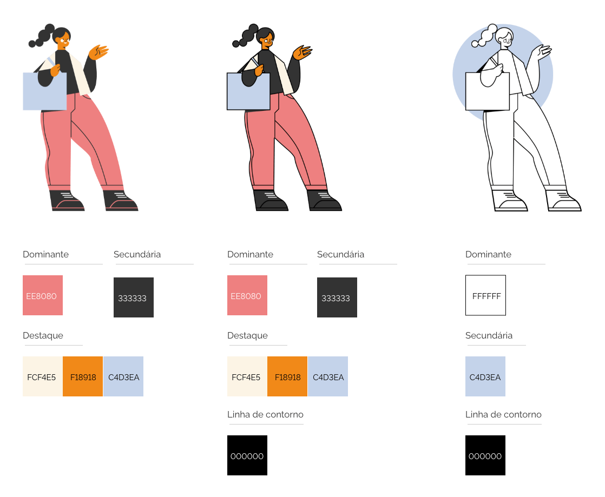
*60% é a cor dominante, 30% é a cor secundária e 10% é a cor de destaque.*

#### Gradientes

Gradiente corresponde a uma variação gradativa de cor ou iluminação. Tem origem na palavra latina *gradus*, que corresponde a grau, e entre seus vários significados corresponde à intensidade de uma coisa.

Um gradiente de cores é a passagem sutil de um tom escuro para um tom mais claro. Ou também pode ser a passagem de uma cor para a outra. Gradientes trazem mais dinamismo e realismo às ilustrações. Mas como tentamos manter a ilustração bem simples, optamos por utilizá-los quando precisamos acrescentar realismo seguindo o estilo de Alta Fidelidade.

No *Design System* o uso de gradientes em ilustrações visa realçar a transição de luz e sombra e podem ser construídos de duas formas:

-   escolha um tom claro e outro escuro de um mesmo matiz da paleta de cores.

-   escolha cores análogas para fazer a transição de uma cor para a outra.

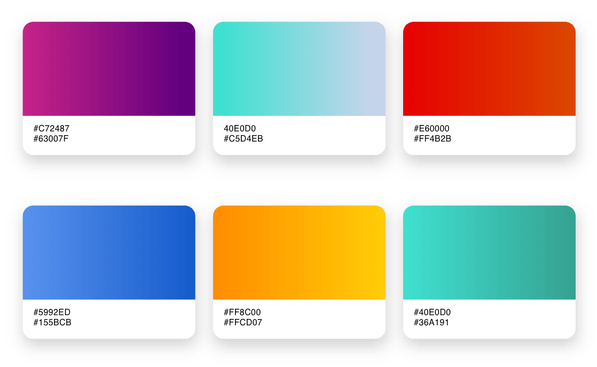
*Esses são apenas alguns exemplos de uso de gradiente.*

### 6. Linha de Contorno  (Opcional)

Linha é o elemento visual que mostra direcionamentos, delimita e insinua formas, cria texturas e carrega em si a ideia de movimento. Independente de onde seja utilizada, a linha é o instrumento fundamental da pré-visualização, ou seja, ela é o meio de apresentar em forma palpável, concreta, aquilo que só existe na imaginação.

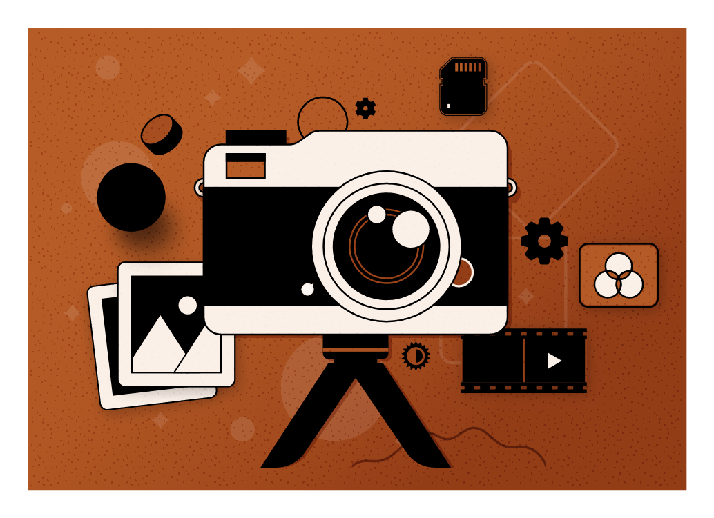
*O uso de linha de contorno não se restringe a composições em preto e branco, e funciona como complemento em composições coloridas.*

No *Design System* utilizamos a *linha de contorno:* obtidas quando envolvem uma área qualquer criando um objeto visual. Essas são suas configurações:

-   *Stroke:* Básico, 2pt ou 1pt size, Round Corn, Round Join

-   *Cor:* #000000

### 7. Textura (Opcional)

A textura é um recurso amplamente utilizado na comunicação visual como simulação de materiais diversos. É um espaço preenchido com o intuito de gerar interesse e distinção visual sem definir nenhuma imagem específica. Podem ser geométricas e orgânicas.

**Mas qual é a sua função na composição?**

-   Ela é mais usada como um elemento secundário para reforçar uma ideia, do que como um elemento básico para comunicar um conceito.

-   É um elemento visual que, com frequência, serve de substituto para as qualidades de outro sentido, o tato.

-   A textura deve funcionar como uma experiência sensível e enriquecedora.

Existem duas formas de aplicar texturas em suas composições no *Design System*: áreas granuladas e padrões

#### Áreas granuladas

##### Efeito Granulado em áreas contínuas

A textura granulada em áreas maiores da composição adiciona uma textura interessante à ilustração vetorial, especialmente se usada conjuntamente ao Gradiente.

Como usar o efeito Granulação no Adobe *Illustrator*:
Selecione a forma, pressione *Command*/ *Control*+ C para copiar e, em seguida, pressione *Command*/ *Control* + F para colar na frente. Em seguida, vá para o menu Efeito> Textura> Granulado.

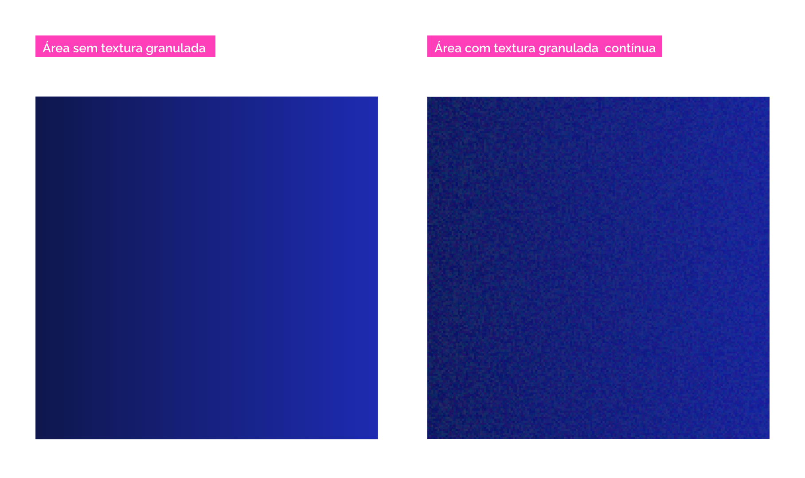
*Em áreas contínuas, a textura granulada confere um efeito óptico interessante.*

##### Efeito Granulado em áreas localizadas

Nessa técnica você tem mais controle da área onde a textura granulada será aplicada. Isso evidencia luz e sombra, conferindo profundidade à composição.

Como criar o efeito Granulado em áreas localizadas no Adobe *Illustrator*:
Usando a ferramenta Pincel (*Brush*), faça alguns movimentos na área que deseja estilizar e veja o resultado. Nesse caso, o efeito de pincel evidenciará luz e sombra na composição, sendo assim, utilize o efeito  com a cor branca (para iluminar uma área) ou preta (para escurecer) e aplique o efeito de Luz Suave/ *Soft Light* para atingir o tom adequado.

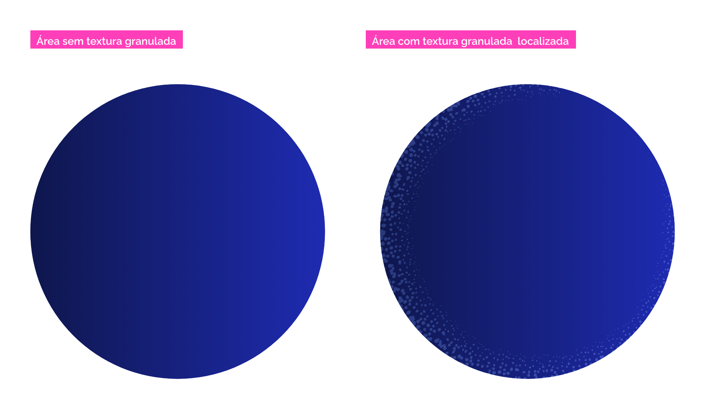
*Em áreas localizadas realçamos o volume dos objetos destacando luz e sombra.*

Utilize diversos exemplos de ilustrações e pincéis para enriquecer seu layout  e facilitar a construção das texturas [Downloads/Ilustrações](/ds/downloads/assets).

Veja o [tutorial (youtube)](https://www.youtube.com/watch?v=xwNInJssbPU) para entender melhor o uso dessa técnica.

### 8. Padrões ou *Patterns* (Opcional)

O que são padrões? Pensamos em um padrão como sendo: "qualquer arranjo repetido regularmente, especialmente um desenho feito de linhas, formas ou cores repetidas em uma superfície". Do ponto de vista do *design*, um padrão é composto por vários ladrilhos de arte repetidos, que se sobrepõem para criar uma composição perfeita. Eles adicionam textura e interesse à composição.

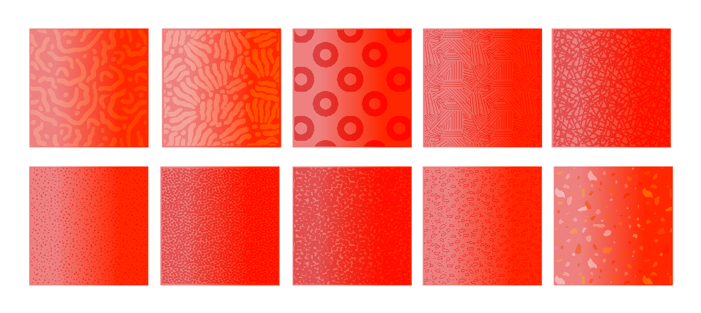
*Exemplos de padronagens recomendadas, não são o conjunto completo.*

O próprio software Adobe *Illustrator* vem com alguns padrões interessantes, que podem ser facilmente encontrados:

-   abrindo o painel Amostras/ *Swatches* > Bibliotecas de Amostras/ *Swatches Libraries*.

-   Um novo menu suspenso aparecerá, na parte inferior do qual você encontrará uma categoria chamada Padrões/ *Patterns*, que por sua vez é dividida em três subcategorias. Nós utilizaremos a opção *Gráficos Básicos/ Basic Graphics.*

-   Assim que você escolher essa subcategoria, uma nova janela da biblioteca de amostras aparecerá, oferecendo uma visualização de todos os *designs* de padrão disponíveis.

-   Para usar qualquer um dos padrões, primeiro Selecione a forma, pressione *Command/ Ctrl* + C para copiar e, em seguida, pressione *Command/ Ctrl* + F para colar na frente. Em seguida, selecione o *design* do padrão desejado clicando nele, que irá adicioná-lo imediatamente ao seu preenchimento .

-   Uma vez que todos esses padrões usam a cor preta, você pode aplicar o efeito Luz suave/ *Soft Light* e ter uma padronagem em um tom mais escuro do que a cor de fundo, mas o uso desse efeito não é obrigatório nesse caso. Caso você esteja ilustrando apenas com preto e branco desconsidere este último passo.

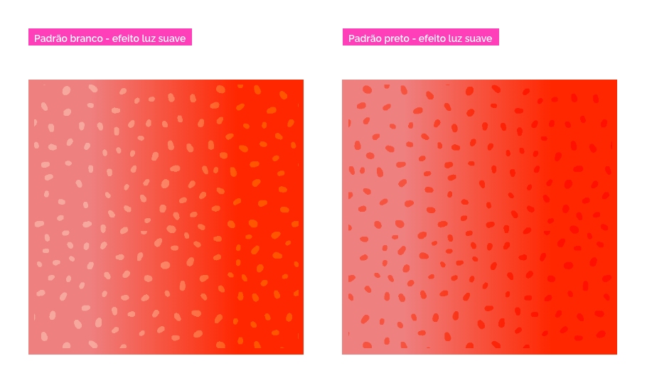
*Diferença entre o efeito de luz suave aplicado em padronagem branca e preta.*

---

## Cenários para Uso de Ilustração

Use a ilustração para incentivar os usuários que estão frustrados, perdidos ou se algo deu errado. Aqui temos alguns exemplos nos quais as ilustrações podem ser usadas.

### 1. Empty Space

Os *empty spaces* ou estados vazios são usados ​​quando um elemento não tem conteúdo para exibir ao usuário. Essa é uma oportunidade de envolver e encantar os usuários. O estado vazio deve informar aos usuários para que serve e por que o estão vendo. Também informam aos usuários o que eles podem fazer a seguir. As ilustrações devem mostrar dados ou estado do sistema (vazio, por exemplo), mas não mensagens de validação de entrada do usuário.

Os estados vazios têm muitas causas, como:

-   Não há dados que o usuário possa ver.

-   Um recurso ainda não foi configurado.

-   Ocorreu um erro.

-   Área vazia da tela intencionalmente deixada em branco.

-   Sem dados / informações / resultado de busca vazio

-   Sem histórico / *feeds*

*Ilustrações Spot aplicadas em Empty Spaces*

Use estados vazios para:

-   Evitar que o aplicativo pareça sem vida e vazio.

-   Ajudar os usuários a integrar um aplicativo e / ou motivá-los a interagir com o aplicativo.

-   Avisar o usuário quando os dados estiverem indisponíveis (devido a um erro do sistema ou outro motivo).

### 2. Onboarding

Use a ilustração para apresentar e explicar um produto ou recurso. Isso pode ser especialmente útil para recursos novos, mal utilizados ou negligenciados. Durante o *onboarding*, as ilustrações são usadas para apresentar ao usuário os recursos do produto.

*Utilize o recurso de Ilustração para encantar e engajar seu usuário ao apresentar seu produto.*

### 3. Com o Corpo da Mensagem

As ilustrações podem incluir o texto do corpo da mensagem abaixo do título para comunicar melhor o estado do componente. No entanto, as ilustrações não podem ter corpo de mensagem sem texto de título.

#### Informativo

Cenários comuns:

-   Configuração necessária

-   Manutenção

*Reforce a informação com ilustrações.*

#### Erro

Cenários comuns:

-   Sem acesso a uma página;

-   Sem conexão;

-   Página não disponível;

-   Passo a passo não disponível.

*Suavize situações de erro com ilustrações lúdicas.*

### 4. Call to action

*Call to Action* é uma chamada para ação, muito comum em sites, emails e anúncios, indicando ao usuário o que deve ser feito. Geralmente, um *Call to Action* (CTA) é um link ou um botão, com uma cor de destaque,mas também pode ser um *banner* com uma imagem ou ilustração,  e como a própria tradução já diz, a *Call To Action* é o momento em que você convida o seu usuário a tomar alguma decisão.

Há várias ações que desejamos que sejam realizadas, tais como fazer um cadastro para receber *newsletter*, preencher um formulário, fazer um *download*, etc.

Ao usar uma uma *Call to action*, utilize a seguinte estrutura: Ilustração representando a ação esperada, um título e a frase de destaque.

*Convide seu usuário a tomar decisão com ilustrações objetivas e claras.*

---

## Estilos de Ilustração

Saber a intenção de sua ilustração ajuda a criar a estrutura para atingir seu objetivo. Existem diferentes tipos de ilustrações usadas para diversos fins, em diferentes escalas e complexidades.

Existem muitas maneiras de comunicar ideias com ilustrações. Algumas são mais literais, outras mais abstratas, algumas menos detalhadas, enquanto outras requerem mais fidelidade para capturar e transmitir os detalhes. Qualquer que seja a estratégia, as ilustrações do *Design System* foram desenvolvidas com essa diversidade em mente para que você possa determinar qual abordagem melhor representa os conceitos ou a natureza do assunto.

Essas abordagens apenas norteiam a criação e o uso de ilustrações no *Design System*. Você pode usar diferentes abordagens num mesmo produto, desde que exista consistência no uso da paleta de cores, gradientes, valores de luz e sombra e traço.

### 1. Estilo Abstrato ou Literal

Expressar conceitos de maneiras abstratas cria interesse e composições emocionantes, enquanto execuções literais podem comunicar conceitos complicados de forma mais clara. Ambas as técnicas são vitais para a comunicação com ilustrações.

*A abstração é mais conceitual e provocativa.*

*As expressões literais são mais explicativas e utilitárias.*

### 2. Estilo Micro ou Macro

É possível trabalhar a exibição de sistemas em micro e macro escalas. Essa capacidade de comunicação em ambas as escalas nos permite comunicar os conceitos difíceis de ver ou expansivos.

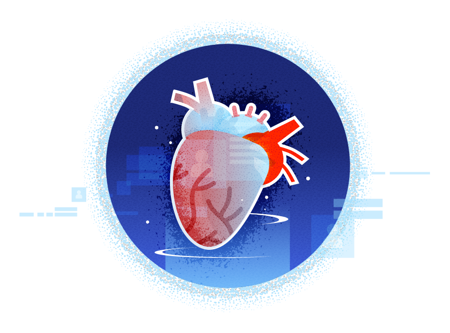
*Micro visualizações ampliam o assunto*

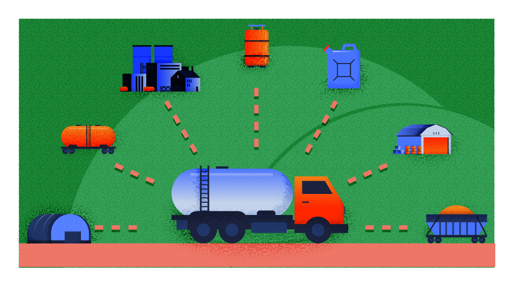
*As visualizações macro representam de forma mais generalizada.*

### 3. Estilo de Baixa ou Alta Fidelidade

Algumas ilustrações se beneficiam por serem simples e diretas, enquanto outras requerem mais fidelidade para capturar mais detalhes ou oferecer um efeito dramático. A iluminação é sempre uma ideia a considerar com técnicas de cores e detalhes, como gradientes, que podem ajudar a comunicar com mais nitidez.

*A cor sólida é mais simples e direta.*
*Gradientes, padronagens, texturas e tons adicionam profundidade e drama.*

---

## Tipos de Ilustração

Segmentamos nossas ilustrações em  quatro tipos: modelos, organismos, moléculas e ícones.

### 1. Modelos

Os modelos são usados ​​para contar histórias complexas e adaptam sua complexidade ao tamanho de suas ilustrações. Eles geralmente contêm mais de três personagens.

*Modelos são ilustrações com muitos detalhes e elementos, utilize-os em áreas maiores.*

### 2. Organismos

Os organismos podem ser vistos como elementos dos modelos de ilustração e, com isso, transferem conceitos mais simples.

*Organismos compõem modelos.*

### 3. Moléculas

As moléculas são pequenas e simples e ajudam o usuário a entender a ideia de um conteúdo como parágrafos curtos.

*Moléculas são pequenas e simples, são versáteis e se encaixam em várias proporções.*

### 4. Ícones

Os ícones diferem das ilustrações em estilo e função. As ilustrações transmitem uma história e explicam várias ideias ao mesmo tempo. Em vez disso, os ícones têm um propósito mais funcional: eles representam o conteúdo em vez de complementá-lo. Pense nas ilustrações como parágrafos e nos ícones como marcadores. Os ícones são muito simples e têm uma única cor em quase todos os casos.

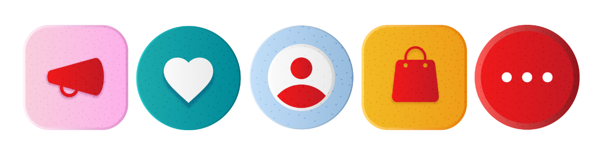
*Você pode utilizar ícones em sua ilustração, ou até mesmo criar uma pequena composição com um ícone decorado.*

Mas para o uso em interfaces no *Design System*, foi escolhida a coleção de ícones *“Font Awesome”* por possuírem uma boa variedade de ícones com um *layout* simples, sintético e amigável.

*Exemplos de ícones da Font Awesome. Eles não representam o conjunto completo dos ícones.*

Você pode encontrar mais informações sobre como usar e desenhar ícones para produtos digitais em nossa seção de iconografia.

---

## Quando Usar Ilustrações ou Imagens

As ilustrações funcionam melhor quando o assunto do conteúdo é fantástico ou de natureza abstrata. Representações que precisem ser realistas funcionam melhor por meio de imagens.

### Quando Usar Ilustrações

**Representações grandiosas**. Sempre que houver necessidade de retratar algo além da vida real use uma ilustração. Elas podem ser fluidas, abstratas e abertas à imaginação.

**Contexto visual**. As ilustrações podem ajudá-lo a compreender melhor o contexto geral de uma história.

**Representação de dados**. Se você precisa retratar um processo, diagrama, fluxograma ou qualquer outra representação gráfica de dados, isso requer uma ilustração.

**Personifique sua marca**. As ilustrações dão a você a liberdade de criar um personagem que anda e fala da maneira que você quiser para que possa criar a percepção desejada de sua marca na mente de seus usuários.

### Quando Usar Imagens

**Autenticidade e atenção para os detalhes**. As imagens são mais autênticas. É por isso que as imagens são preferidas sempre que produtos como telefones celulares, carros e laptops são exibidos.

**Tempo e agilidade**. Uma imagem adequada pode permitir que você crie uma peça de *design* em meia hora, enquanto pode demorar muito mais se a mesma precisar ser ilustrada.

**Construção de confiança**. As imagens permitem que você use um rosto conhecido no conteúdo. Isso informa instantaneamente ao leitor que a pessoa na imagem apoia / endossa o conteúdo.

**Crie uma experiência visual**. A fotografia permite que você crie uma "experiência visual" que pode transportar o espectador para um lugar particular ou induzir uma sensação de nostalgia com efeitos.

---

## Guia para construção de ilustrações

Se você deseja começar a construir ou editar ilustrações em seu projeto, por favor, siga esse passo-a-passo e tenha em mente as seguintes orientações.

### 1. Definindo elementos de Anatomia

Defina quais elementos da anatomia  melhor representam a identidade do seu produto:

-   **Elementos de fundo (Obrigatório):** harmonize os elementos de fundo com a composição. Eles não devem competir com os elementos principais.

-   **Luz e sombra (Obrigatório):** defina a origem da luz em sua composição e lembre-se de usar o branco e o preto, aplicando o efeito de Luz suave em incrementos de 10% para atingir os tons de luz e sombra.

-   **Personagem (Opcional):** existe a necessidade de utilizar um personagem, ou apenas objetos serão suficientes para representar sua ideia? Lembre-se, a diversidade étnica e cultural é fundamental.

-   **Spot ou objetos (Obrigatório):** a ilustração sempre conta uma história, e os objetos ajudam a representar sua narrativa. Seja como como ponto focal da composição ou apenas como elementos de cenário, eles sempre estão presentes.

-   **Cor (Opcional):** Existe alguma cor predominante no *layout* aplicado? Tente definir a paleta de cores para todas as ilustrações do produto. Será preto e branco? Monocromático ou trabalhará com a margem de 5 cores mais o preto e branco? Utilizará cores chapadas ou trabalhará com gradientes? Evite utilizar como cor predominante nas composições a cor de elementos interativos do tema de IU escolhido.

-   **Linha de contorno (Opcional):** Delimite áreas, crie formas e texturas e reforce a ideia de movimento em suas composições com a Linha de contorno. Ela é ótima principalmente em composições em preto e branco, além de serem bons complementos em composições com cores chapadas.

-   **Textura (Opcional):** Enriqueça e simule a experiência sensível de elementos físicos em sua composição: Escolha entre a aplicação de textura em grandes áreas ou aplique em áreas específicas.

-   **Padrões ou Patterns (Opcional):** Pretende explorar o uso de padronagens? Prefira as simples e geométricas. Elas acrescentam personalidade à composição sem chamar muita atenção.

### 2. Identificando o cenário

Verifique em qual cenário a ilustração se encaixa. Caso não se encaixe em nenhum deles, a ilustração pode não ser a melhor solução.

### 3. Definição de Estilo

Verifique qual estilo é mais adequado para comunicar a sua ideia e contar a história para os seus usuários.  Avalie o conceito, escala e fidelidade para escolher o estilo.

### 4. Tipos e complexidade

Escolha o Tipo da ilustração, de acordo com a complexidade da ideia a ser representada e o formato/área/espaço disponível para a composição.

### 5. Variantes de tamanho

Os detalhes são bons, desde que não criem ruído. É por isso que a maioria das ilustrações existem em 2 tamanhos: pequeno e grande. Em coerência com nossos Princípios de *Design*, simplificamos as ilustrações para uso abaixo de 160px. Uma vez que tamanhos menores permitem menos detalhes, eles devem ser reduzidos ao essencial.

-   **Variante grande:** Se o espaço disponível tiver mais de 160 pixels de largura, use esta variação.

-   **Variante pequena:** Se o espaço disponível tiver menos de 160 pixels, use uma ilustração pequena.

-   **Ícones:** Se a área disponível tiver menos de 80 pixels de largura, use ícones em vez de ilustrações.

### 6. Formato SVG

Por que usar esse formato? A edição é mais rápida. O redimensionamento é mais fácil (sem pixelização). A cor é mais flexível. Os tamanhos dos arquivos geralmente são menores. Além disso, *designers* sem habilidades de desenho à mão podem adicionar recursos novos e consistentes mais facilmente à medida que o sistema evolui.

---

## Comportamento

### Responsividade

Ao criar uma ilustração, tenha em mente que ela deverá adaptar-se às diferentes proporções de diferentes dispositivos. Por exemplo, a capa de um portal pode ter uma proporção mais horizontal ao ser visualizada em um monitor ou até mesmo em um *tablet*, mas pode precisar ser ajustada para uma proporção mais quadrada ou até mesmo vertical ao ser acessada por um celular.

No *Design System* existem 4 tipos de grid: *Smartphone Portrait, Tablet / Smartphone Landscape, Desktop e TV*, então é interessante planejar as ilustrações tendo em mente esses grids. No exemplo abaixo, as ilustrações A e B são aplicadas na grid de 12 colunas e mudam de forma responsiva. Já na grid de 8 e 4 colunas as ilustrações C e D ficam responsivas entre elas, porém são uma variante resumida e com menos detalhes da primeira ilustração.

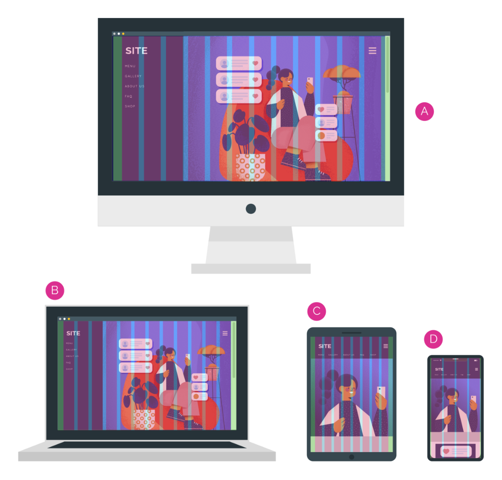
*Ilustração planejada para diferentes resoluções.*

---

## Acessibilidade

Todas as experiências devem ser acessíveis a todos, independentemente de habilidades ou deficiências. Se uma ilustração transmitir informações não inteiramente capturadas no texto que o acompanha, os conceitos principais devem atender aos padrões de acessibilidade `3: 1 AA`.
Esteja sempre consciente ao escolher as cores para dar a cada usuário a mesma experiência, independentemente da habilidade.

Cada tag SVG requer um atributo `aria-hidden = "true"`.
Ao adicionar `aria-hidden = "true"` a um elemento remove esse elemento e todos os seus filhos da árvore de acessibilidade. Isso pode melhorar a experiência dos usuários de tecnologia assistiva, ocultando conteúdo puramente decorativo, como ícones ou imagens.

---

## Referências

-   [Lightning design system](https://www.lightningdesignsystem.com/components/illustration/)

-   [Polaris design system](https://polaris.shopify.com/design/illustrations#navigation)

-   [IBM design system](https://www.ibm.com/design/language/illustration/overview/)

-   [Atlassian design system](https://atlassian.design/foundations/illustrations/)

-   [Quickbooks design system](https://designsystem.quickbooks.com/bolt/lifestyle-illustrations/)

-   [Foyer design system](https://www.design.foyer.lu/illustration.html)

-   [Firefox design system](https://design.firefox.com/photon/visuals/illustration.html)
