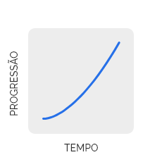
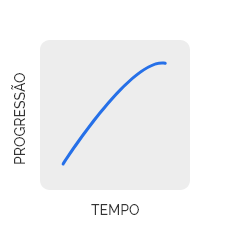
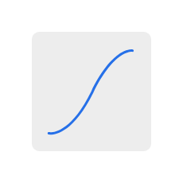
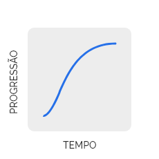
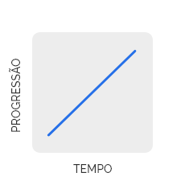

[version]: # (1.0.1)

Movimento é qualquer macro ou micro animação que altera os atributos visuais de um objeto na tela durante um tempo determinado podendo ocorrer de forma automática, por meio de uma interação ou pelo controle do usuário.

<video controls width="320" height="240" controls type="video/mp4">
<source src="videos/slide.mp4" type="video/mp4">
</video>

*Exemplo de movimento.*

Utilize movimentos para:

-   Tornar o *layout* mais expressivo;

-   Ajudar o usuário a avançar em questões complexas;

-   Reforçar *feedbacks* em micro interações que, de outra forma, poderia passar despercebido.

---

## Princípios

### Experiência Única

Muitos componentes do Design System já trazem incorporados algum tipo de micro animações que devem ser consideradas. No entanto, para as macro animações de interações entre componentes ou entre telas o *design* deve planejar conforme sua necessidade, seguindo as orientações e sugestões deste documento.

Tenha sempre em mente o conceito de experiência única do usuário e utilize os parâmetros *efeito*, *easing* e *duração* de forma consistente ao longo de todo o projeto.

> **Exemplo:** é bastante popular nos meios digitais a utilização do recurso de  movimento no componente *loading* para transmitir a ideia de que algo está acontecendo no servidor e o usuário deve aguardar o desfecho do processo.

### Eficiência e Clareza

Os movimentos devem transparecer eficiência e clareza e buscar refletir características reais com fluidez e dinamismo trazendo familiaridade ao processo. Deve-se buscar equilíbrio entre o expressivo e o natural e evitar, sempre que possível, a criação de movimentos que causem distrações desnecessárias.

Os movimentos devem ser informativos destacando as relações entre os elementos, a disponibilidade da ação e os resultados da ação.

> **Exemplo:** a transição gradativa de uma cor para informar o estado *hover*.

### Reutilização e Colaboração

Os movimentos foram pensados para oferecer uma variedade de atributos que permitam a criação de diversas animações e possibilidades de uso. Prefira as opções disponibilizadas nesse documento, porém, caso haja necessidade, novos atributos podem ser sugeridos para uma maior personalização do movimento.

### Acessibilidade

Esteja atento aos seguintes pilares:

-   **Compreensível:** qualquer usuário pode entender;
-   **Robusto:** pode ser utilizável em qualquer plataforma ou tecnologia assistiva;
-   **Operável:** qualquer usuário pode utilizar;
-   **Perceptível:** qualquer usuário pode perceber.

As pessoas de um modo geral experimentam a Internet de várias maneiras e formas. Elas vêm o design visual em uma tela e usam periféricos ou telas sensíveis ao toque para agir com um sistema sem terem maiores dificuldade no uso, ou seja, para elas os sistemas da *web* são perceptíveis, compreensíveis, operáveis e robustos naturalmente. Entretanto, para as pessoas que possuem limitações físicas, biológicas ou intelectuais, como por exemplo cegos ou com problemas de visão, audição/fala, neuro típicas, que têm distúrbios vestibulares ou dificuldades de compreensão espacial entre outras naturezas restritivas, precisam de recursos de tecnologias assistivas para interagir com um sistema *web* e também que os sites acessados possuam recursos de acessibilidade.
Onde a maioria das pessoas acha fácil utilizar um ambiente *web*, para essas pessoas com limitações, pode ser muito desafiador ou mesmo impossível fazer uso da internet se os *sites* visitados não atenderem as recomendações mundiais de acessibilidade da [WCAG](https://www.w3.org/WAI/standards-guidelines/wcag/) [(W3C)](https://www.w3.org/).
*Motion design* não é um recurso decorativo, ao contrário, é um recurso técnico poderoso que favorece positivamente a experiência do usuário. Portanto cada vez mais é utilizado no design de soluções para info produtos da *web*. No entanto, o *motion design* por adicionar uma camada de complexidade à solução, traz impactos na acessibilidade que necessitam ser observados e tratados durante a sua concepção e elaboração.

Esteja atento a algumas dicas:

-   Disponibilize o controle do usuário sobre o uso das animações com opção explícita para ativar ou desativar a funcionalidade.

  **Motivação principal:** pessoas com distúrbios vestibulares (deficiência no controle do equilíbrio e movimentos oculares) ao experimentarem certos movimentos podem desencadear um desagradável desconforto, náuseas e desorientações em vários graus ao fixarem o olhar na movimentação de objetos na tela.  

-   Forneça controle de "pausa" para qualquer movimento em tela que inicie automaticamente e seja reproduzido por mais de cinco segundos, como por exemplo conteúdos dinâmicos com atualizações automáticas e carrosséis ou micro interações com elementos piscando por mais de três segundos.

  **Motivação principal:** exibição de áreas da tela piscando acima do limite descrito pode causar risco de ataques convulsivos em pessoas epiléticas ou com comorbidades semelhantes.

-   Não utilize as animações como única fonte de informação devendo-se utilizar paralelamente outro canal de informação como o uso de sons e vibrações.

  **Motivação principal:** pessoas cegas ou com problemas visuais não podem identificar informações visuais naturalmente.

-   Movimentos que surgem na tela de maneira abrupta podem causar confusão e sobrecarga cognitiva em um usuário.

  **Motivação principal:** pessoas com deficit de atenção (TDAH), neuro típicas ou com limitações intelectuais podem não perceber ou se esforçar muito para descobrir o que ocorreu na tela se o movimento se comportar de  maneira drástica ou rápida demais não sendo perceptível ou compreensível para eles.

-   Forneça alternativas para as transições de estados da interface. Considere, sempre que possível, o uso de interação de movimentos simplificados ou reduzidos para celulares de *tablets*. Certifique-se de que haja sempre uma maneira de comunicar mensagens semelhantes estaticamente sem grandes impactos e acessíveis.

-   Opte, sempre que possível, pelas definições dos componentes nativos pois estes permitem aproveitar os recursos de acessibilidade previamente integrados.

-   Disponibilize, quando for o caso,  controles da animação ou opção ativar/desativar.

---

## Propriedades

Para criar um movimento devemos considerar três propriedades:

-   Transição;
-   *Easing*;
-   Tempo.

**Atenção:** o objetivo da animação normalmente ditará o tipo de animação ou transição. Além disso, lembre-se da frequência com que os usuários encontrarão a animação: quanto mais frequente, mais sutil e mais curta você desejará que ela seja.

### 1. Transição

Está disponível uma lista de transições que podem ser combinadas entre si para criarem diferentes tipos de efeitos.

Tenha cautela na escolha das transições que utilizará no movimento. Evite misturar vários tipos de transições. Quanto mais sutil e natural, melhor.

#### a) *Opacity* (transparência)

Trabalha com valores referentes ao atributo do item "opacidade" do fundamento superfície. Tem por finalidade alterar a transparência de um objeto em um determinado tempo.

<video controls width="320" height="240" controls type="video/mp4">
<source src="videos/opacity.mp4" type="video/mp4">
</video>

*Exemplo da transição opacity.*

##### *Fade In*

Trata-se de uma transição particular de opacidade em que um objeto parece surgir gradativamente na tela.

**Sugestão de uso**: quando elementos precisam "entrar" na tela após uma ação do usuário.

<video controls width="320" height="240" controls type="video/mp4">
<source src="videos/fadein.mp4" type="video/mp4">
</video>

*Exemplo da  transição fade in.*

##### *Fade Out*

Ao contrário da transição *fade in* o efeito *fade out* sugere que um objeto desaparece gradativamente da tela.

**Sugestão de uso**: quando elementos precisam "sair" da tela após uma ação do usuário.

<video controls width="320" height="240" controls type="video/mp4">
<source src="videos/fadeout.mp4" type="video/mp4">
</video>

*Exemplo da transição fade out.*

Para mais informações consulte o documento [Fundamentos > Superfície](/ds/fundamentos-visuais/cores).

#### b) *Color* (cor)

Faz a transição entre duas cores.

**Sugestão de uso**: pode-se utilizar a transição entre cores para chamar a atenção do usuário para uma mudança de estado ou ser substituído por algo novo.

<video controls width="320" height="240" controls type="video/mp4">
<source src="videos/color.mp4" type="video/mp4">
</video>

*Exemplo da transição color.*

Para mais informações consulte o documento [Fundamentos > Cores](/ds/fundamentos-visuais/cores) para mais detalhes.

#### c) *Scale* (dimensão)

Trabalha a variação da escala de um objeto criando transições entre as dimensões inicial e final.

**Sugestão de uso**: é comum usar esta transição para realçar a relevância de um elemento na tela.

<video controls width="320" height="240" controls type="video/mp4">
<source src="videos/scale.mp4" type="video/mp4">
</video>

*Exemplo do efeito scale.*

Para mais informação consulte o documento [Fundamentos > Superfície](/ds/fundamentos-visuais/superficie).

##### *Fill* (preenchimento)

Efeito que preenche uma área previamente definida.
Trata-se de uma combinação do efeito *scale* e *fade in*.

**Sugestão de uso**: é usado para transições entre os elementos que não têm um relacionamento forte entre si.

<video controls width="320" height="240" controls type="video/mp4">
<source src="videos/fill.mp4" type="video/mp4">
</video>

*Exemplo da transição fill.*

#### d) *Slide* (Posição)

Transição que visa o deslocamento de um objeto de um ponto a outro variando os valores dos eixos X e Y em relação ao seu posicionamento original na tela. É possível deslizar para cima, para baixo, para a direita e para a esquerda.
Este posicionamento utiliza como referência o ponto de ancoragem que normalmente é utilizado para referenciar suas coordenadas.

**Sugestão de uso**: é usado para transições entre elementos que possuem um relacionamento espacial ou de navegação.

<video controls width="320" height="240" controls type="video/mp4">
<source src="videos/slide.mp4" type="video/mp4">
</video>

*Exemplo da transição slide deslocando um objeto de baixo para cima e em seguida, da esquerda para a direita.*

#### e) *Elevation* (elevação)

Refere-se às mudanças aplicadas a valores no eixo Z. Por padrão, reflete na intensidade (*blur*) da sombra projetada.

**Sugestão de uso**: as transições do eixo Z indicam movimento um nível para cima ou para baixo na hierarquia das camadas de elevação.

<video controls width="320" height="240" controls type="video/mp4">
<source src="videos/shadow.mp4" type="video/mp4">
</video>

*Exemplo da transição elevation.*

Os parâmetros relacionados a esta transição estão descritos no documento [Fundamentos > Elevação](/ds/fundamentos-visuais/elevação).

#### f) *Rotate* (rotação)

Este parâmetro altera a posição de um objeto a partir da mudança da sua angulação, tomando como referência o seu ponto de ancoragem que é geralmente utilizado para referenciar o grau de rotação de um objeto.

A ancoragem pode ser um ponto específico ou um dos seguintes eixos: X, Y ou Z.

Seus valores podem variar de 0º a 360º.

<video controls width="320" height="240" controls type="video/mp4">
<source src="videos/rotate*x.mp4" type="video/mp4">
</video>

*Exemplo da transição rotate no eixo X, muito utilizado para simular o efeito de levantar uma página.*

<video controls width="320" height="240" controls type="video/mp4">
<source src="videos/rotate*y.mp4" type="video/mp4">
</video>

*Exemplo da transição rotate no eixo Y, muito utilizada para simular o efeito de virar página.*

No eixo Z, por padrão o ponto de ancoragem encontra-se no centro do objeto, mas é possível deslocá-lo de posição, caso seja necessário.

<video controls width="320" height="240" controls type="video/mp4">
<source src="videos/rotate*z1.mp4" type="video/mp4">
</video>

*Exemplo da transição rotate no eixo Z com o ponto de ancoragem no centro, muito utilizado para simular o efeito de girar um objeto.*

<video controls width="320" height="240" controls type="video/mp4">
<source src="videos/rotate*z2.mp4" type="video/mp4">
</video>

*Exemplo da transição rotate no eixo Z com o ponto de ancoragem no canto inferior direito do objeto.*

<video controls width="320" height="240" controls type="video/mp4">
<source src="videos/corner.mp4" type="video/mp4">
</video>

*Exemplo da transição rounded corner.*

Para mais informações consulte o documento [Fundamentos > Superfície](/ds/fundamentos-visuais/superficie).

#### g) *Corner* (arredondamento)

Transição utilizada para alterar o grau de arredondamento dos cantos das bordas de um objeto, alterando-o entre cantos retos e arredondados.

<video controls width="320" height="240" controls type="video/mp4">
<source src="videos/corner.mp4" type="video/mp4">
</video>

*Exemplo da transição rounded corner.*

Para mais informações consulte o documento [Fundamento Superfície](/ds/fundamentos-visuais/superficie).

#### h) *Form* (transformação)

Transição que altera a forma de um objeto transmutando-o de uma forma inicial a uma forma final.

**Sugestão de uso**: quando for necessário transformar um elemento em outro reforçando a relação entre eles.

<video controls width="320" height="240" controls type="video/mp4">
<source src="videos/form.mp4" type="video/mp4">
</video>

*Exemplo da transição form.*

Para maiores informações sobre forma consulte o documento [Fundamentos > Superfície](/ds/fundamentos-visuais/superficie).

### 2. *Easing*

*Easing* é o atributo que define a aceleração e a desaceleração do movimento de um objeto ao longo do tempo. Os valores do *easing* determinam o quanto natural ou artificial o movimento parecerá.

#### a) *Ease-In*

As animações ease-in começam de forma lenta e terminam rapidamente.
Esse tipo de movimento é como uma pedra pesada caindo, onde começa lentamente e atinge o chão rapidamente.

*Imagem exemplificando o desenho da trajetória de deslocamento em ease-in.*

**Atenção:** de um ponto de vista da interação, os *ease-ins* podem parecer um pouco incomuns por causa de seu término súbito. Coisas que se movem no mundo real tendem a desacelerar em vez de simplesmente parar repentinamente. *Ease-ins* também têm o efeito prejudicial de parecerem lentos no início, o que também afeta negativamente a percepção de resposta do *site* ou aplicativo.

| Easing  |     Easing Token      |
| :-----: | :-------------------: |
| Ease-In | `--animation-ease-in` |

#### b) *Ease-Out*

Os movimentos em *ease-out* começam mais rapidamente e terminam de forma lenta.
Esse tipo de movimento é como uma bola chutada que vai lentamente buscando o repouso.

*Imagem exemplificando o desenho da trajetória de deslocamento em ease-out,*

**Atenção:** o *ease-out* é geralmente melhor para o trabalho na interface do usuário, pois o início rápido dá uma sensação de capacidade de resposta à sua animação, permitindo uma desaceleração natural no final.

|  Easing  |      Easing Token      |
| :------: | :--------------------: |
| Ease-Out | `--animation-ease-out` |

#### c) *Ease-In-Out*

Inicia com movimento acelerado, atinge o movimento normal e termina com movimento desacelerado.
Esse tipo de movimento é semelhante a um carro acelerando e desacelerando e, se usado com consciência, podem proporcionar um efeito mais dramático do que apenas o *ease-out*.

*Imagem exemplificando o desenho da trajetória de deslocamento em ease-in-out.*

**Atenção:** evite criar animações longa demais devido à lentidão do início do *ease-in* na animação. O intervalo de 0,30-0,50 segundos é geralmente adequado, mas o valor exato depende muito do seu projeto específico. Desta forma, início lento, meio rápido e término lento resultarão em maior contraste da animação, o que pode ser bastante satisfatório para o usuário.

|   Easing    |       Easing Token        |
| :---------: | :-----------------------: |
| Ease-In-Out | `--animation-ease-in-out` |

#### d) *Ease*

É semelhante ao *ease-in-out*, exceto que começa um pouco mais rápido do que termina.

*Imagem exemplificando o desenho da trajetória de deslocamento em ease*

| Easing |    Easing Token    |
| :----: | :----------------: |
|  Ease  | `--animation-ease` |

#### e) Linear

O movimento linear não possui *easing*, isto é, o movimento é linear e sem aceleração.

*Imagem exemplificando o desenho da trajetória de deslocamento no formato linear*.

O movimento totalmente linear parece estranho e não natural para os usuários. Um objeto que se move pela tela na mesma velocidade o tempo todo parece menos natural do que um que aumenta ou diminui sutilmente com o tempo. Essa impressão tem muito a ver com a forma como os objetos se movem no mundo físico, onde muitas vezes não vemos coisas se movendo a uma velocidade perfeitamente estável - eles tendem a acelerar e desacelerar quando começam e, respectivamente, param de se mover.

| Easing |       Easing Token        |
| :----: | :-----------------------: |
| Linear | `--animation-ease-linear` |

<video controls width="320" height="240" controls type="video/mp4">
<source src="videos/easing.mp4" type="video/mp4">
</video>

*Comparação dos easings em uma animação.*

**Atenção:** observe que o *easing* é um dos aspectos mais desafiadores para se comunicar com a equipe de desenvolvimento, já que cada plataforma tem diferentes maneiras de especificar uma curva de *easing* (por exemplo, o formato cúbico-Bezier é usado em CSS, iOS e Android. Adobe After Effects usa valores de porcentagem de entrada e saída).

#### Valores e *tokens* de *easing* (cúbico-Bezier)

| *Easing*      | CSS                               | Easing Token              |
| ------------- | --------------------------------- | ------------------------- |
| *Ease*        | cubic-bezier (0.25, 0.1, 0.25, 1) | `--animation-ease`        |
| *Ease-In*     | cubic-bezier 0.42, 0, 1, 1)       | `--animation-ease-in`     |
| *Ease-Out*    | cubic-bezier (0, 0, 0.58, 1)      | `--animation-ease-out`    |
| *Ease-In-Out* | cubic-bezier (0.42, 0, 0.58, 1)   | `--animation-ease-in-out` |
| Linear        | cubic-bezier (0,0,1,1)            | `--animation-ease-linear` |

É possível customizar o *easing* com valores diferentes dos da tabela acima se for apropriado para o seu projeto.

Você pode visualizar e comparar cada um dos *easings* em: <https://cubic-bezier.com/#.17,.67,.83,.67>

### 3. Duração

Duração é o parâmetro que considera o tempo que o movimento ocorre. Ao decidir a duração de um movimento considere os parâmetros *easing* e a *área de animação* para que o resultado fique o mais natural possível.

#### Área de Animação

É a área da tela onde ocorrem os movimentos e podem ser entendidos como micro, média e macro animações.

-   **Micro animação:** trata-se da animação sutil e menos perceptível pelo usuário, porém muito poderoso para transmitir *feedbacks* em elementos de entrada de dados, estados, etc.

-   **Média animação:** trata-se de animações com valores intermediários entre a micro e a macro animação e funciona melhor em elementos expansíveis e de média extensão.

-   **Macro animação:** trata-se de animações mais perceptíveis e que geralmente envolvem maior atenção do usuário e deve ser utilizado de forma bastante cautelosa em elementos de grande extensão e importância no sistema.

Sugerimos a escala de tempo como referência para auxiliar a criação de micro e macro animações no Design System:

#### Escala de Tempo

| Tempo (s)   | Tipo         | Área           |
| ----------- | ------------ | -------------- |
| 0,10 - 0,29 | Muito rápido | Micro animação |
| 0,30 - 0,49 | Rápido       | Micro animação |
| 0,50 - 0,79 | Moderado     | Média animação |
| 0,80 - 0,99 | Lento        | Macro animação |
| 1 - *       | Muito lento  | Macro animação |

<video controls width="320" height="240" controls type="video/mp4">
<source src="videos/time.mp4" type="video/mp4">
</video>

*Comparação dos tempos em uma animação.*

A duração de uma animação é extremamente importante para a usabilidade - muito rápida, é difícil de ver ou estonteante; muito lenta, torna-se intrusiva e parece um atraso para o usuário.

Em geral, a duração da maioria das animações deve ser do tipo *muito rápido* ou *rápido*, dependendo da complexidade e da distância percorrida pelo elemento. Como regra geral, procure o menor tempo que uma animação pode levar sem parecer chocante.

Animações de *feedback* simples, como mostrar *checkbox* ou um *switch*, deve ter aproximadamente 0,10 segundos de duração total. Essa duração parece imediata para o usuário e cria a ilusão de manipulação física do objeto.
0,10 segundos está na extremidade inferior do movimento perceptível, onde quase parece um salto instantâneo de um lugar para outro, mas é o suficiente para tornar o *feedback* perceptível.
Abaixo desse valor, o olho humano é incapaz de perceber movimento.

Quando a animação envolve mudanças substanciais de tela, como quando uma janela modal é exibida, um movimento do tipo *rápido* pode ser apropriado. Quanto mais um elemento precisa se mover, mais importante é que ele o faça de maneira suave e não chocante (especialmente para pessoas que são sensíveis ao movimento, como usuários com epilepsia ou distúrbios vestibulares).

Com *0,50 segundos*, as animações começam parecer entediantes para os usuários - elas se tornam pesadas e irritantes. Na maioria dos casos, uma duração *muito rápida* ou *rápida* é apropriada, com *0,40 segundos* sendo uma animação já começando a entrar no tipo moderado e inconveniente para a maioria dos casos, sendo usado apenas para grandes movimentos em telas grandes.

Experimente os valores, pois pequenas mudanças, como passar de 0,25 a 0,30 segundos, podem trazer resultados muito diferentes.

Observe que os objetos animados que aparecem ou entram na tela geralmente precisam de uma duração sutilmente mais longa do que os objetos que desaparecem ou saem da tela: uma janela *pop-up* pode levar 0,30 segundos para aparecer, mas apenas 0,20 ou 0,25 segundos para desaparecer.
(Lembre-se, no entanto, de que as janelas *pop-up* são problemáticas em muitos casos e não recomendamos o uso excessivo delas.)

**Atenção:** utilize as informações deste manual como referência e tenha bom senso na decisão da duração que a animação apresentará na tela.

#### *Tokens* de duração

| Tempo (s) | Tipo         | Duration Token         |
| --------- | ------------ | ---------------------- |
| 0,10      | Muito rápido | `--duration-very-fast` |
| 0,30      | Rápido       | `--duration-fast`      |
| 0,50      | Moderado     | `--duration-moderate`  |
| 0,80      | Lento        | `--duration-slow`      |
| 1         | Muito lento  | `--duration-very-slow` |

---

## Melhores Práticas

-   Garanta a resposta do servidor para que o movimento desejado seja o suficiente, evitando sobrecarga de páginas longas com irritantes períodos de carregamento.

-   Considere os diferentes dispositivos e resoluções de tela onde os movimentos serão apresentados, assim como as condições físicas em que o usuário acessarão o produto.

-   Não permita que as animações incorporadas no *layout* chamem mais atenção que o conteúdo e tampouco sejam motivos para distrações. A animação funciona bem para direcionar a visão do usuário para um ponto relevante, portanto não utilize muitas animações ao mesmo tempo em uma tela, mesmo que de forma sutil.

-   A definição do movimento deve corresponder às características da identidade visual planejada para o usuário.

-   As animações funcionam melhor quando parecem fluidas e naturais e não devem incomodar a experiência do usuário. Também não devem ser irrelevantes ou sem função específica. Um movimento só deve ser utilizado se servir para aumentar a compreensão do usuário.

-   Animações sutis em ícones, ilustrações e logotipos de produtos podem adicionar personalidade e diversão à experiência do usuário.

-   Como sempre é recomendado em UX, considere o contexto e teste sempre com o usuário. O que para você pode parecer um movimento sutil e natural no contexto do usuário pode ser um fator de incômodo ou distração.
