[version]: # (1.0.6)

Superfície é qualquer forma indivisível que pode conter um ou mais elementos.

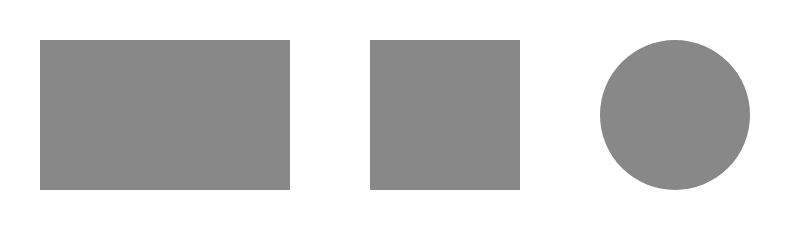
*Exemplos de superfícies.*

Todos os componentes desse _Design System_ utilizam superfícies como base para a criação dos componentes.

**Atenção:** algumas vezes podemos nos referir à superfície com os termos genéricos _**background**_ ou **contêiner**.

---

## Princípios

### Experiência Única

A superfície pode oferecer uma infinidade de características combinando os seus atributos de forma a proporcionar uma vasta variedade de tipos de superfícies, mas deve manter consistência dentro de um produto ou tema.

> **Exemplo:** Se assumir que em determinado produto ou tema a superfície deva possuir bordas arredondadas, mantenha a consistência em todos os componentes que utilizem a mesma superfície. Crie e siga padrões.

### Eficiência e Clareza

Ao utilizar superfícies na criação de componentes lembre sempre que o objetivo é conter, agrupar e organizar elementos na tela, aumentando a eficiência na compreensão da informação pelo usuário. Não exagere na quantidade de elementos dentro das superfícies utilizando somente o necessário. Quanto mais enxuto for o componente, mais facilidade o usuário terá para compreendê-lo. Crie hierarquias visuais e semânticas utilizando os atributos disponíveis.

### Acessibilidade

Superfícies podem assumir qualquer cor da paleta cromática do _Design System_ mas atenção para o contraste das cores escolhidas. Siga sempre as orientações de boas práticas deste manual.

> **Exemplo:** A cor padrão para a superfície é branca por ser neutra e proporcionar um bom contraste com a cor padrão utilizada em textos. Porém, é critério do designer escolher a cor que melhor atenda às necessidades criativas e de usabilidade.

### Reutilização e Colaboração

As superfícies foram pensadas para oferecer uma variedade de atributos que permitam a criação de diversas formas e possibilidades de uso. Prefira as opções disponibilizadas nesse documento, porém, caso haja necessidade, novos atributos podem ser sugeridos para uma maior personalização da superfície.

----

## Propriedades

Propriedade da superfície são algumas características variáveis que podem ser manipuladas para criar superfícies personalizadas. São elas: cor, borda, canto, sombra e transparência. A seguir são detalhados cada um deles:

### Cores

A superfície dos elementos pode apresentar qualquer cor prevista na paleta de cores do _Design System_.

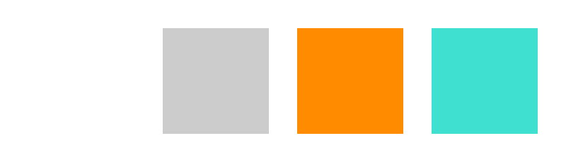
*Exemplos de algumas cores possíveis para superfícies.*

**Atenção:** lembre sempre de verificar o contraste entre as cores utilizadas na superfície e nos elementos contidos na superfície.

### Bordas

As bordas definem os limites de uma superfície e podem funcionar como espécie de separadores entre a superfície e o _background_. Apresentam diferentes tipos e espessuras. É possível também uma superfície não apresentar bordas visíveis.

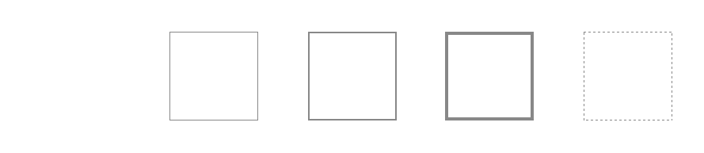
*Diferentes tipo e espessuras de bordas.*

Use bordas quando necessitar um maior contraste com a cor do fundo, principalmente nos casos em que os componentes são brancos ou com cores claras e precisam se destacar.

**Cuidado:** o excesso de bordas pode ocasionar um ruído visual e dificuldade de legibilidade.

 **Atenção:** nos _softwares_ gráficos as bordas devem estar configurada conforme a imagem a seguir:

1. Traçado interno;
2. Arremate projetado;
3. Junção de mitra.

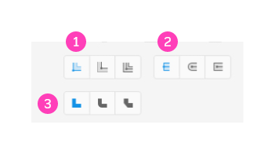
*Exemplo para a configuração de bordas no Adobe XD.*

#### Atributos

##### 1. _Style_

Define o tipo/estilo de borda. Pode ser: `solid` ou `dashed`.

##### 2. Width

Refere-se à espessura do traço. Temos os seguintes tokens:

|px|Width Token|
|:--:|:--:|
|0|`--surface-width-none`|
|1|`--surface-width-sm`|
|2|`--surface-width-md`|
|4|`--surface-width-lg`|

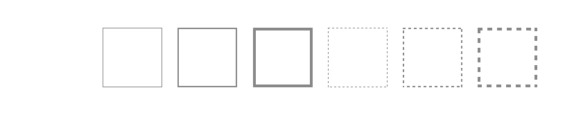
 *Variação das bordas possíveis para uma superfície previstas no DS.*

##### 3. _Color_

Pode assumir qualquer cor prevista na **paleta de cores** do _Design System_.

##### 4. _Side_

Define os lados da superfície que a borda será aplicada. Pode ser: `top`, `right`, `bottom`, `left`, `all`.

#### Tipos de Bordas

|Surface Border Token|Style|Width|Color|
|:--:|:--:|--|--|
|`--surface-border-solid-none`|solid|`--surface-width-none`|`--gray-40`|
|`--surface-border-solid-sm`|solid|`--surface-width-sm`|`--gray-40`|
|`--surface-border-solid-md`|solid|`--surface-width-md`|`--gray-40`|
|`--surface-border-solid-lg`|solid|`--surface-width-lg`|`--gray-40`|
|`--surface-border-dashed-none`|dashed|`--surface-width-none`|`--gray-40`|
|`--surface-border-dashed-sm`|dashed|`--surface-width-sm`|`--gray-40`|
|`--surface-border-dashed-md`|dashed|`--surface-width-md`|`--gray-40`|
|`--surface-border-dashed-lg`|dashed|`--surface-width-lg`|`--gray-40`|

### Cantos

As superfícies podem apresentar variações no arredondamento dos cantos das bordas. Podem apresentar desde cantos retos (quadrados) até totalmente arredondados. Esse atributo possibilita a criação de novas formas.

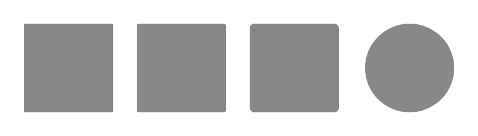
*Exemplos de arredondamento dos cantos a partir de uma superfície quadrada.*

Use as variações de arredondamento dos cantos para criar novas formas. Geralmente, quanto mais arredondados forem os cantos, mais orgânica é a forma. Use cantos retos para formas que necessitam transmitir solidez e seriedade e formas arredondadas para transmitir ideia de modernidade e informalidade.

#### Atributos

##### 1. _Rounder_

Refere-se ao arredondamento das bordas. Temos os seguintes _tokens_:

|px|Rounder Token|
|:--:|:--:|
|0|`--surface-rounder-none`|
|4|`--surface-rounder-sm`|
|8|`--surface-rounder-md`|
|16|`--surface-rounder-lg`|
|altura/2|`--surface-rounder-pill`|

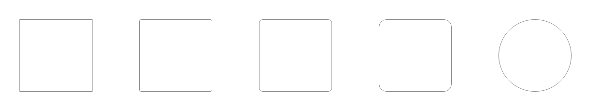
*Variação dos arredondamentos de cantos possíveis para uma superfície neste DS.*

Pode-se construir superfícies com formas totalmente redondas utilizando a fórmula para os cantos _pill_ **R=A/2**, onde:

**R = arredondamento dos cantos;**
**A = altura da superfície.**

Na figura acima, a superfície circular tem uma altura de 150px, logo o arredondamento é de 75px. Assim, partindo de uma forma quadrada se consegue chegar a uma forma circular.

Esse recurso é muito utilizado para a criação de botões estilo _pill_ (pílula) e _tags_.

1. Botão _Pill_ (R=24px, A=48px);

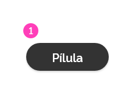
*Exemplos de superfícies no formato pílula (_pill_).*

##### 2. _Side_

Define os lados da superfície que a borda será aplicada podendo ser: `top/right`, `bottom/right`, `bottom/left`, `bottom/right`, `all`.

### Opacidade

Opacidade é a propriedade do objeto de reter luz. Quanto mais transparente for a superfície, mais luz passa através dela e mais nitidez é perceptível nos elementos situados atrás. A superfície pode apresentar diferentes níveis de opacidade. Isso é relevante quando é necessário transparecer uma quantidade de informação do elemento que se encontra imediatamente atrás.

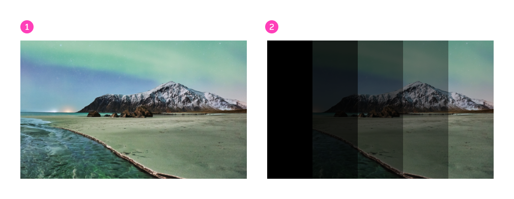
*A imagem 1 mostra uma foto comum. A imagem 2 mostra a mesma foto sobreposta por superfícies com diferentes níveis de opacidade.*

Opacidades podem ainda ser utilizadas para sobrepor imagens ou cores e desta forma conseguir novas tonalidades. Chamamos esse comportamento de **_overlay_**. Mais adiante esse comportamento será melhor detalhado.

#### Atributos

##### 1. _Opacity_

Define a transparência de uma superfície e é definido por valores entre 0 a 1. Temos os seguintes tokens:

|Value|Opacity Token|
|:--:|:--:|
|0|`--surface-opacity-none`|
|1|`--surface-opacity-default`|
|0.16|`--surface-opacity-xs`|
|0.30|`--surface-opacity-sm`|
|0.45|`--surface-opacity-md`|
|0.65|`--surface-opacity-lg`|
|0.85|`--surface-opacity-xl`|

### Elevação

As superfícies estão localizadas em camadas imaginárias e assim projetam diferentes intensidades de sombra no plano de fundo (camada zero) ou em outra superfície situada em camada imediatamente atrás. Portanto a sombra está relacionada com a elevação da camada em que a superfície se encontra.

Este assunto é tratado de forma mais detalhado em documento específico: Fundamentos>Elevação

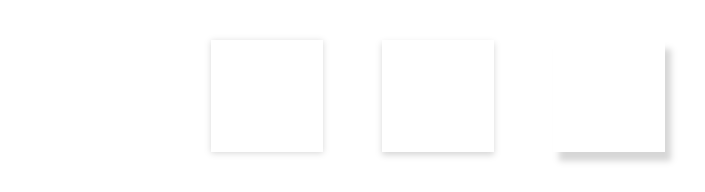
*Exemplos de sombras projetadas pelas superfícies definindo distintos níveis de elevação.*

---

## Comportamento

### Deslocável

As superfícies podem ser arrastadas para outra posição dentro da tela. Esse é um comportamento do estado **arrastado** e é melhor definido no documento de Fundamentos>Estados.

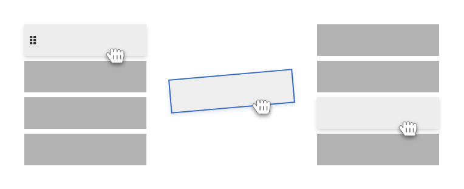
*A imagem ilustra as etapas da alteração da posição da superfície escura em uma sequência de superfícies.*

### Dimensionável

As superfícies são estruturas rígidas porém redimensionáveis no plano bidimensional. Alguns componentes podem ter superfícies flexíveis em relação ao conteúdo, isto é, crescem conforme a quantidade de conteúdo em seu interior. Já outros, possuem dimensões fixas e disponibilizam barra de rolagem para dar acesso ao conteúdo que extrapola as dimensões fixas.

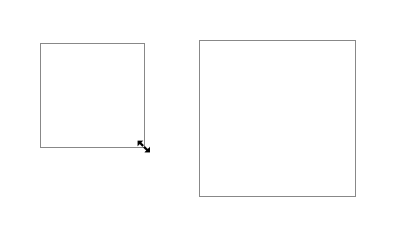
*A imagem ilustra uma superfície sendo redimensionada pelo usuário.*

### _Overlay_

Um _overlay_ (sobreposição) é uma superfície semitransparente sobre um elemento específico ou sobre uma área da tela. _Overlays_ podem ajudar a redirecionar a atenção do usuário, inibir a interação sobre outras áreas/elementos ou retornar feedback visuais para o usuário.

Apesar de infinidade de aplicações, ela se destaca em dois usos:

#### 1. Foco

Usado para alterar o foco hierárquico de um elemento (ou uma área) sobre outros, onde um determinado conteúdo precisa de uma grande relevância sobre os demais. Este uso é conhecido em outros lugares como _scrim_.

É comum que esse tipo de uso permita inibir as interações de elementos sob a superfície _overlay_.

*_Overlay_ sendo utilizado para focar um elemento modal.*

*_Overlay_ sendo utilizado para focar uma área específica da tela.*

|Surface overlay Token|Color|Color Opacity|
|:--:|--|--|
|`--surface-overlay-scrim`|`--pure-100`|`--surface-opacity-md`|

#### 2. Legibilidade

Usado quando um texto precisa ser aplicado sobre uma superfície e o contraste entre fundo/texto não é suficiente para gerar um contraste acessível;

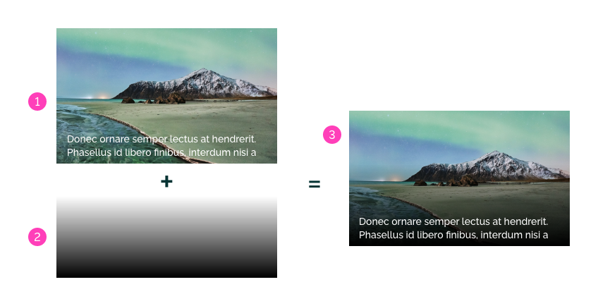
*1. Imagem com texto (sem _overlay_): pouco contraste para leitura;
2. Camada _overlay_ com degradê;
3. Imagem com texto (com _overlay_): maior contraste para leitura.*

|Surface overlay Token|Gradient|Angle|Color|Color Opacity|Hint|Color|Color Opacity|Hint|
|:--:|--|--|--|--|--|--|--|--|
|`--surface-overlay-text`|`linear-gradient`|`180deg`|`--pure-0`|`--surface-opacity-none`|`0%`|`--pure-100`|`--surface-opacity-default`|`100%`|

#### Cuidados ao utilizar um _overlay_

A versatilidade de uso de uma superfície _overlay_ é muito grande.

Podemos utilizar todas as propriedades listadas na superfície em conjunto com outros comportamentos para gerar aplicações muito mais ricas, como por exemplo, personalizar a forma da superfície _overlay_ (com a propriedade canto) em conjunto com recursos de animação (_motion_) gerando interações mais dinâmicas para o usuário.

Porém, o uso do _overlay_ deve ser claro e dentro do seu propósito descrito no GOVBR-DS, pois o uso indiscriminado pode interferir nas diretrizes.

**Evite** a criação de novos matizes de cores: quando utilizada a superfície _overlay_ "colorida" sobre uma superfície de cor distinta. Essa mistura de cores pode gerar distorções na identidade visual. **Prefira** o uso desse tipo de _overlay_ em situações muito específicas (como feedback de interações executadas pelos usuários), ou em casos mais gerais, tente interferir somente no brilho e/ou na saturação dos elementos.

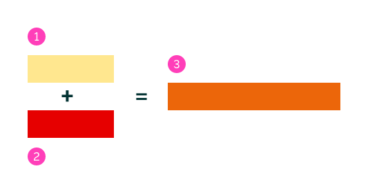
*1. Superfície _overlay_ "colorida" com opacidade 45%;
2. Superfície com outra cor distinta;
3. Nova tonalidade de cor gerada pela sobreposição das duas superfícies.*
