[version]: # (7.2.3)

Para a apresentação dos elementos textuais do *Design System* do Governo Federal, somente uma família de fonte é utilizada: a *Rawline*. Sua escolha foi feita devido à diversidade de pesos da fonte que facilita o uso e a criação de hierarquias entre os textos, bem como a compreensão dos elementos da tela.

A utilização da *Rawline* tem como objetivo facilitar o reconhecimento, pelos cidadãos, dos produtos do Governo Federal, juntamente com o padrão de cores e elementos gráficos definidos no *Design System*.

A *Rawline* está disponível em <https://www.cdnfonts.com/rawline.font>

---

## Princípios

### Experiência Única

A variedade de estilos da *Rawline* torna desnecessária a utilização de outra família tipográfica. Sendo assim, junto com os demais elementos do *Design System* a tipografia cria um reconhecimento mais rápido pelo usuário, na identificação dos produtos do governo.

Para segurança, recomendamos o uso de *fallback* (caso a fonte não seja carregada por algum motivo) a fonte `"Raleway"` e, de forma mais genéricas, as fontes sem serifas: `sans-serif`.

### Eficiência e Clareza

A diversidade de pesos da *Rawline* facilita a definição de níveis de hierarquias entre os elementos da tela. Isso torna a leitura mais agradável, e também fica mais claro para o usuário o papel que esses elementos ocupam na tela.

As escalas tipográficas foram definidas para manter a harmonia e coesão dentro do texto. Dessa forma, nenhuma fonte deve estar fora da escala definida no DS: *Minor Third*. Veja *Escala tipográfica* para maiores detalhes.

A **Tabela de Estilo Padrão** foi criada para manter a mesma experiência do usuário na maioria dos dispositivos. Caso seja necessário alterar algum valor, deve-se seguir a escala tipográfica. Além disso, os demais itens da tabela de estilo devem ser revistos mantendo a escala proporcional, ou seja, aumentando ou diminuindo conforme a necessidade.

### Acessibilidade

As interfaces devem cumprir as diferentes necessidades de acessibilidade. Sendo assim, o tamanho da tipografia e as cores foram aplicadas prevendo-se um nível mínimo de adequação à legibilidade.

Sempre que possível, utilize a tabela de estilo e as cores padrão para texto para manter o conteúdo legível/acessível ao usuário.

Veja [Cores](/fundamentos-visuais/cores/) para maiores detalhes sobre aplicação de cores nos textos.

A semântica deve ser levada em consideração ao se criar as marcações do texto dentro do HTML para que os dispositivos de leitores de tela consigam distinguir os diferentes elementos do texto.

#### Reutilização e Colaboração

Interfaces digitais do governo devem utilizar a família de fonte definida sempre que possível. Havendo, entretanto, a necessidade de acrescentar ou editar a família tipográfica atual, é necessário validar a nova proposta segundo os princípios e pela equipe de *design* do DS.

---

## Estilos da Fonte Rawline

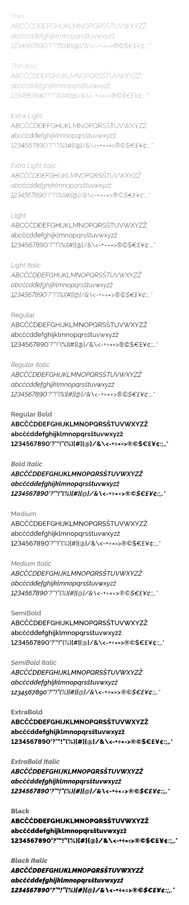
*Estilos da fonte Rawline.*

| Family  | Token              |
| ------- | ------------------ |
| Rawline | --font-family-base |

### Peso da fonte (Font-Weight)

Utilize os valores abaixo para representar os diferentes estilos da fonte *Rawline* em uma interface *web*.

| Font-Weight | Estilo      | Token                       |
| ----------- | ----------- | --------------------------- |
| 100         | Thin        | `--font-weight-thin`        |
| 200         | Extra-Light | `--font-weight-extra-light` |
| 300         | Light       | `--font-weight-light`       |
| 400         | Regular     | `--font-weight-regular`     |
| 500         | Medium      | `--font-weight-medium`      |
| 600         | Semi-Bold   | `--font-weight-semi-bold`   |
| 700         | Bold        | `--font-weight-bold`        |
| 800         | Extra-bold  | `--font-weight-extra-bold`  |
| 900         | Black       | `--font-weight-black`       |

---

## Fonte Base

Em um documento com uma definição de 72 dpi (ou 72 ppi ) dentro de um software gráfico (como *Photoshop*), *pontos = pixels*, mas isso não é verdade em um navegador (veja "Tabela de conversão PX, PT, EM e %"). Para uma boa comunicação, sempre indique os tamanhos em *pixels* para os desenvolvedores da Web que devem converter para *em* ou *rem*.

Atualmente, uma prática recomendada é permitir que um dispositivo (como navegador *web*) tome as decisões baseadas no tamanho da fonte base. O padrão é que em uma janela com visualização de 96 dpi tenha a fonte base padrão de 16px, mas dificilmente essa regra se aplique em todos os casos (como um *smart watch*).

No *Design System* do Governo Federal optamos pela fonte base de 14 pixel por considerarmos que esse tamanho seja aplicável na maioria dos dispositivos e situações, porém essa escolha não é definitiva.

Definir um tamanho de uma fonte base (juntamente com a referência do uso de unidades "em" ou "rem") facilitará a hierarquia entre os textos, otimizando o efeito cascata (veja escala tipográfica).

---

## Escala Tipográfica

O estabelecimento de uma escala tipográfica é uma forma de determinar tamanhos tipográficos. A escala é importante porque estabelece a hierarquia e melhora a legibilidade criando harmonia e coesão entre os textos.

Existem muitas escalas diferentes, mas dentro do *Design System* do Governo Federal foi escolhida a escala *Minor Third* (1,2) já que permitem números que possuem contraste necessário para enriquecer e flexibilizar a hierarquia de uma interface.

O tamanho *fonte base* é de 14px (1em) e peso da fonte normal (400). A unidade *em* é uma medida relativa que permite que o usuário altere o tamanho de exibição do texto na interface. Com exceção da fonte base, utilize a unidade *em* para todos os outros valores da escala. Assim, caso o valor do tamanho base padrão seja alterado, toda a interface se adapta ao novo valor.

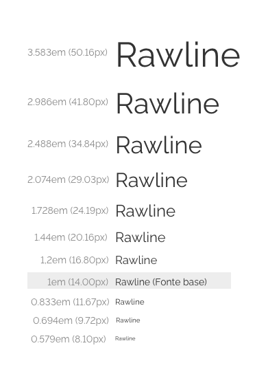

| em    | px    | Token                       |
| ----- | ----- | --------------------------- |
| 3.583 | 50.16 | `--font-size-scale-up-07`   |
| 2.986 | 41.8  | `--font-size-scale-up-06`   |
| 2.488 | 34.84 | `--font-size-scale-up-05`   |
| 2.074 | 29.03 | `--font-size-scale-up-04`   |
| 1.728 | 24.19 | `--font-size-scale-up-03`   |
| 1.44  | 20.16 | `--font-size-scale-up-02`   |
| 1.2   | 16.8  | `--font-size-scale-up-01`   |
| 1     | 14    | `--font-size-scale-base`    |
| 0.833 | 11.67 | `--font-size-scale-down-01` |
| 0.694 | 9.72  | `--font-size-scale-down-02` |
| 0.579 | 8.10  | `--font-size-scale-down-03` |

**Dica:** utilize alguma calculadora [*Type Scale*](https://type-scale.com/) (como o site [*Modular Scale*](https://www.modularscale.com)) para calcular os tamanhos dentro da escala.

Caso o tamanho não atenda sua interface, utilize um valor diferente para a fonte base, porém, a escala deve se manter a mesma (ou seja, com a mesma proporção entre os estilos).

> **Cuidado**: manter um valor de fonte base muito alto ou muito pequeno, pode atrapalhar na legibilidade do conteúdo. Utilize um valor base diferente do recomendado somente em casos que justifique seu uso.

### Ampliando a Escala Tipográfica

Caso haja necessidade, os valores da escala tipográfica podem ser ampliados, além dos valores demonstrados na tabela acima, crescendo ou reduzindo na mesma proporção *Minor Third (1,2)*. Por exemplo:

-   Crescendo: `41,80px`, `50,16px`, `60,19px`, `72,23px`, ...
-   Reduzindo: `8.10px`, `6,75px`, `5,62px`, `4.68px`, ...

Quando reduzir ou ampliar a escala tipográfica, fique atento às questões de legibilidade.

---

## *Line-height* (entrelinha)

Para utilizar corretamente o valor do entrelinhamento é preciso trabalhar com valores em porcentagem ou relativos (como *rem* ou *em*), pois o valor vai depender do tamanho da fonte que ele está sendo aplicado. Por padrão, utilize entrelinha de 1.45 para valores até a fonte base, após isso, utilize o valor de 1,15.

**OBS:** para trabalhar com softwares que trabalham com unidades em pixel (como Adobe XD), multiplique o valor do tamanho da fonte pelo valor da entrelinha da tabela.  *Exemplo:* No H1 a line-height é 1.15 do valor de 41.8px (size), logo o valor da final será 48,07px.*

| Line-Height (em) | Token                      |
| ---------------- | -------------------------- |
| 1.15             | `--font-lineheight-low`    |
| 1.45             | `--font-lineheight-medium` |
| 1.85             | `--font-lineheight-high`   |

---

## Tabelas de Estilos

Utilize a tabela de estilo para determinar o visual de cada estilo de tipografia utilizada. Todos os estilos são [elementos nativos do HTML](https://www.w3schools.com/tags/default.asp).

Lembre-se, o valor *line-height* (entrelinhamento) não se refere ao fonte base, e sim ao valor final da escala do próprio elemento textual. *Exemplo:* No H1 a line-height 1.15, ou seja, 115% do valor de 2,986em (`--font-size-scale-up-06`).*

**Atenção:** As informações apresentadas nas tabelas para *Grid de 4 Colunas* exibem apenas as propriedades que diferem do padrão 12 e 8 colunas.

### H1

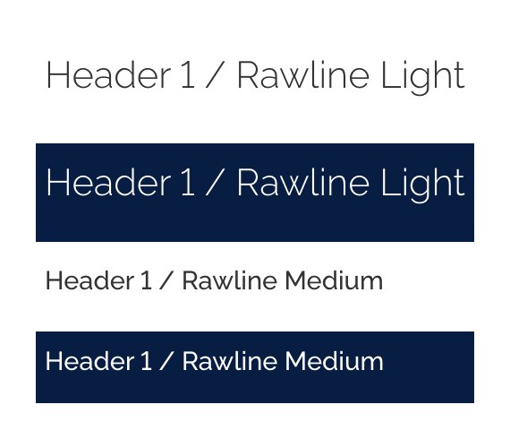
*Exemplo do Estilo H1 com fundo claro e escuro e na Grid de 4 colunas.*

| Propriedade   | Token / Valor             |
| ------------- | ------------------------- |
| Size          | `--font-size-scale-up-06` |
| Weight        | `--font-weight-light`     |
| Line-height   | `--font-line-height-low`  |
| Color         | `--gray-80`               |
| Color (dark)  | `--pure-0`                |
| Margin-bottom | `--spacing-scale-4x`      |

#### H1 para *Grid* de 4 colunas

| Propriedade   | Token / Valor             |
| ------------- | ------------------------- |
| Size          | `--font-size-scale-up-04` |
| Weight        | `--font-weight-medium`    |
| Margin-bottom | `--spacing-scale-2xh`     |

### H2

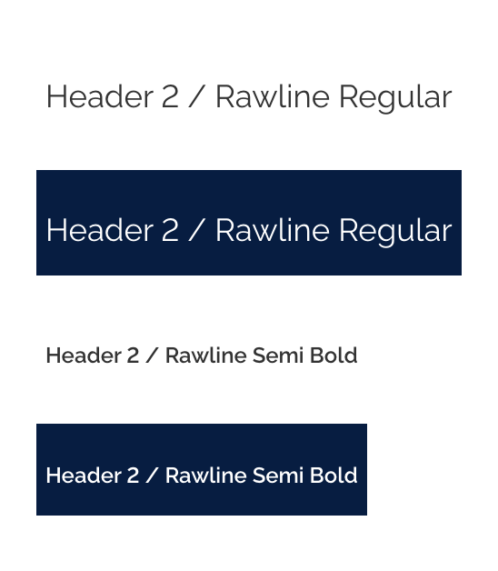
*Exemplo do Estilo H2 com fundo claro e escuro e na Grid de 4 colunas.*

| Propriedade   | Token / Valor             |
| ------------- | ------------------------- |
| Size          | `--font-size-scale-up-05` |
| Weight        | `--font-weight-regular`   |
| Line-height   | `--font-line-height-low`  |
| Color         | `--gray-80`               |
| Color (dark)  | `--pure-0`                |
| Margin-bottom | `--spacing-scale-2xh`     |
| Margin-top    | `--spacing-scale-3xh`     |

#### H2 para *Grid* de 4 colunas

| Propriedade | Token / Valor             |
| ----------- | ------------------------- |
| Size        | `--font-size-scale-up-03` |
| Weight      | `--font-weight-semi-bold` |

### H3

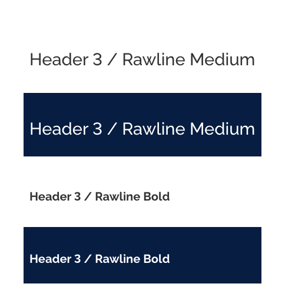
*Exemplo do Estilo H3 com fundo claro e escuro e na Grid de 4 colunas.*

| Propriedade   | Token / Valor             |
| ------------- | ------------------------- |
| Size          | `--font-size-scale-up-04` |
| Weight        | `--font-weight-medium`    |
| Line-height   | `--font-line-height-low`  |
| Color         | `--gray-80`               |
| Color (dark)  | `--pure-0`                |
| Margin-bottom | `--spacing-scale-2xh`     |
| Margin-top    | `--spacing-scale-3xh`     |

#### H3 para *Grid* de 4 colunas

| Propriedade | Token / Valor             |
| ----------- | ------------------------- |
| Size        | `--font-size-scale-up-02` |
| Weight      | `--font-weight-bold`      |

### H4

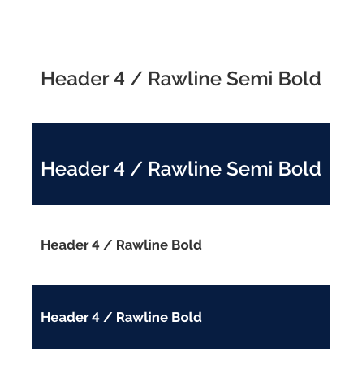
*Exemplo do Estilo H4 com fundo claro e escuro e na Grid de 4 colunas.*

| Propriedade   | Token / Valor             |
| ------------- | ------------------------- |
| Size          | `--font-size-scale-up-03` |
| Weight        | `--font-weight-semi-bold` |
| Line-height   | `--font-line-height-low`  |
| Color         | `--gray-80`               |
| Color (dark)  | `--pure-0`                |
| Margin-bottom | `--spacing-scale-2xh`     |
| Margin-top    | `--spacing-scale-3xh`     |

#### H4 para *Grid* de 4 colunas

| Propriedade | Token / Valor             |
| ----------- | ------------------------- |
| Size        | `--font-size-scale-up-01` |
| Weight      | `--font-weight-bold`      |
| Margin-top  | `--spacing-scale-2x`      |

### H5

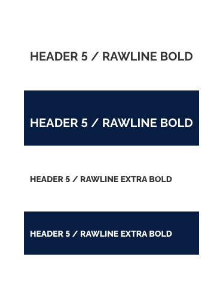
*Exemplo do Estilo H5 com fundo claro e escuro e na Grid de 4 colunas.*

| Propriedade    | Token / Valor             |
| -------------- | ------------------------- |
| Size           | `--font-size-scale-up-02` |
| Weight         | `--font-weight-bold`      |
| Line-height    | `--font-line-height-low`  |
| Color          | `--gray-80`               |
| Color (dark)   | `--pure-0`                |
| Margin-bottom  | `--spacing-scale-2x`      |
| Margin-top     | `--spacing-scale-3xh`     |
| Text-transform | `uppercase`               |

#### H5 para *Grid* de 4 colunas

| Propriedade | Token / Valor              |
| ----------- | -------------------------- |
| Size        | `--font-size-scale-base`   |
| Weight      | `--font-weight-extra-bold` |
| Margin-top  | `--spacing-scale-2x`       |

### H6

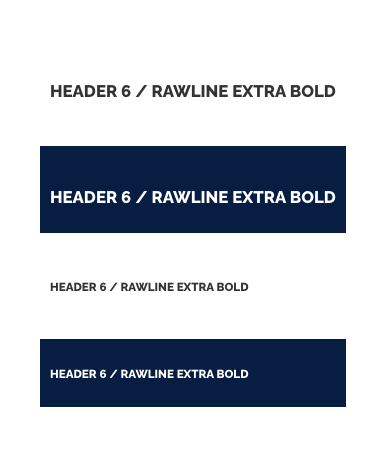
*Exemplo do Estilo H6 com fundo claro e escuro e na Grid de 4 colunas.*

| Propriedade    | Token / Valor              |
| -------------- | -------------------------- |
| Size           | `--font-size-scale-up-01`  |
| Weight         | `--font-weight-extra-bold` |
| Line-height    | `--font-line-height-low`   |
| Color          | `--gray-80`                |
| Color (dark)   | `--pure-0`                 |
| Margin-bottom  | `--spacing-scale-2x`       |
| Margin-top     | `--spacing-scale-3xh`      |
| Text-transform | `uppercase`                |

#### H6 para *Grid* de 4 colunas

| Propriedade | Token / Valor               |
| ----------- | --------------------------- |
| Size        | `--font-size-scale-down-01` |
| Margin-top  | `--spacing-scale-2x`        |

### P

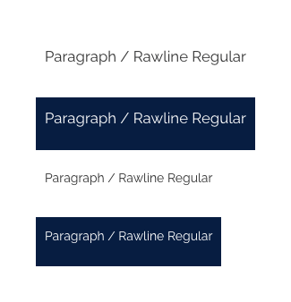
*Exemplo do Estilo Parágrafo com fundo claro e escuro e na Grid de 4 colunas.*

| Propriedade   | Token / Valor               |
| ------------- | --------------------------- |
| Size          | `--font-size-scale-up-01`   |
| Weight        | `--font-weight-regular`     |
| Line-height   | `--font-line-height-medium` |
| Color         | `--gray-80`                 |
| Color (dark)  | `--pure-0`                  |
| Margin-bottom | `--spacing-scale-2x`        |

#### P para *Grid* de 4 colunas

| Propriedade | Token / Valor            |
| ----------- | ------------------------ |
| Size        | `--font-size-scale-base` |

### Label

*Exemplo do Estilo Label com fundo claro e escuro.*

| Propriedade   | Token / Valor               |
| ------------- | --------------------------- |
| Size          | `--font-size-scale-base`    |
| Weight        | `--font-weight-semi-bold`   |
| Line-height   | `--font-line-height-medium` |
| Color         | `--gray-80`                 |
| Color (dark)  | `--pure-0`                  |
| Margin-bottom | `--spacing-scale-half`      |

### Input

*Exemplo do Estilo Input com fundo claro e escuro.*

| Propriedade   | Token / Valor             |
| ------------- | ------------------------- |
| Size          | `--font-size-scale-up-01` |
| Weight        | `--font-weight-medium`    |
| Line-height   | `--font-line-height-low`  |
| Color         | `--gray-80`               |
| Color (dark)  | `--pure-0`                |
| Margin-bottom | `--spacing-scale-half`    |

### Placeholder

*Exemplo do Estilo Placeholder com fundo claro e escuro.*

| Propriedade   | Token / Valor               |
| ------------- | --------------------------- |
| Size          | `--font-size-scale-base`    |
| Weight        | `--font-weight-regular`     |
| Line-height   | `--font-line-height-medium` |
| Font-style    | `italic`                    |
| Color         | `--gray-80`                 |
| Color (dark)  | `--pure-0`                  |
| Margin-bottom | `--spacing-scale-half`      |
| Margin-top    | `--spacing-scale-half`      |

### Legend

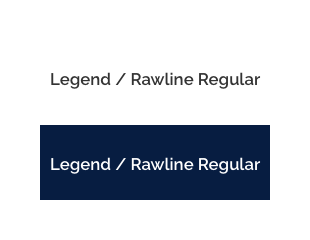
*Exemplo do Estilo Legend com fundo claro e escuro.*

| Propriedade   | Token / Valor             |
| ------------- | ------------------------- |
| Size          | `--font-size-scale-up-01` |
| Weight        | `--font-weight-semi-bold` |
| Line-height   | `--font-line-height-low`  |
| Color         | `--gray-80`               |
| Color (dark)  | `--pure-0`                |
| Margin-bottom | `--spacing-scale-2x`      |
| Margin-top    | `--spacing-scale-2x`      |

### Mark

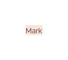
*Exemplo do Estilo Mark.*

| Propriedade | Token / Valor         |
| ----------- | --------------------- |
| Color       | `--gray-80`           |
| Background  | `--red-warm-vivid-10` |

### Code

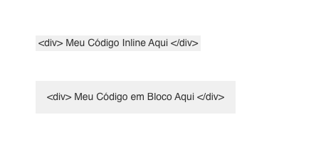
*Exemplo do Estilo Code no formato Inline e Bloco.*

| Propriedade      | Token / Valor                                |
| ---------------- | -------------------------------------------- |
| Font-family      | `monospace` (Utilize uma fonte monoespaçada) |
| Size             | `--font-size-scale-base`                     |
| Weight           | `--font-weight-medium`                       |
| Line-height      | `--font-line-height-low`                     |
| Color            | `--gray-80`                                  |
| Background       | `--gray-5`                                   |
| Padding (Inline) | `--spacing-scale-half`                       |
| Padding (Bloco)  | `--spacing-scale-2x`                         |

**OBS:** O valor estipulado em *SIZE* é considerado *padrão* nos elementos de `Legend` `mark` e `code`. O valor padrão é recomendado sempre que utilizar o estilo, porém, ele pode ser alterado caso queira aplicar algum tipo de *hierarquia*.
> **Exemplo:** Ter vários `Fieldset`+`Legend` aninhados (ordenadas) criando uma estrutura hierárquica em um formulário, pode ser interessante utilizar um SIZE (dentro da escala) diferenciado para cada `Legend`....

---

## Unidades de Espaçamento entre caracteres (*Letter Spacing*)

Em alguns softwares (como da Adobe), o espaçamento de um bloco de texto (*tracking*) e o ajuste de espaço entre caracteres adjacentes (*Kerning*) são medidos em 1/1.000em, uma unidade de medida que é relativa ao tamanho atual da face de tipos. Em uma fonte de 6 pontos, 1em é igual a 6 pontos; em uma fonte de 10 pontos, 1em é igual a 10 pontos. Ou seja, são estritamente proporcionais ao tamanho da face de tipos utilizado.

Para calcular o valor do espaçamento entre os caracteres utilize o seguinte fórmula:

> *LetterSpacing*(px) = tamanho da fonte(pt ou px) *tracking* da Adobe / 1000.

---

## Tabela de conversão PX, PT, EM e %

A tabela a seguir, tem como referência resolução de 96dpi com fonte base equivalente a 14px.
Onde 1 pixel = 0,75 pontos e 1 ponto = 1,33333 pixel.

| Ponto    | Pixel | Em       | Porcentagem |
| -------- | ----- | -------- | ----------- |
| 6 pt     | 8 px  | 0.57 em  | 57 %        |
| 6,75 pt  | 9 px  | 0.64 em  | 64 %        |
| 7,5 pt   | 10 px | 0.71 em  | 71 %        |
| 8,25 pt  | 11 px | 0.785 em | 78,5 %      |
| 9 pt     | 12 px | 0.85 em  | 85 %        |
| 9,75 pt  | 13 px | 0.92 em  | 92 %        |
| 10,5 pt  | 14 px | 1 em     | 100 %       |
| 11,25 pt | 15 px | 1,07 em  | 107 %       |
| 12 pt    | 16 px | 1,14 em  | 114 %       |
| 12,75 pt | 17 px | 1,21 em  | 121 %       |
| 13,5 pt  | 18 px | 1,28 em  | 128 %       |
| 14,25 pt | 19 px | 1,35 em  | 135 %       |
| 15 pt    | 20 px | 1,42 em  | 142 %       |
| 15,75 pt | 21 px | 1,5 em   | 150 %       |
| 16,5 pt  | 22 px | 1,57 em  | 157 %       |
| 17,25 pt | 23 px | 1,64 em  | 164 %       |
| 18 pt    | 24 px | 1,71 em  | 171 %       |
| 18,75 pt | 25 px | 1,785 em | 178,5 %     |
| 19,5 pt  | 26 px | 1,85 em  | 185 %       |
| 20,25 pt | 27 px | 1,92 em  | 192 %       |
| 21 pt    | 28 px | 2 em     | 200 %       |
| 21,75 pt | 29 px | 2,07 em  | 207 %       |
| 22,5 pt  | 30 px | 2,14 em  | 214 %       |
| 23,25 pt | 31 px | 2.21 em  | 221 %       |
| 24 pt    | 32 px | 2,28 em  | 228 %       |
| 24,75 pt | 33 px | 2,35 em  | 235 %       |
| 25,5 pt  | 34 px | 2,42 em  | 242 %       |
| 26,25 pt | 35 px | 2,5 em   | 250 %       |
