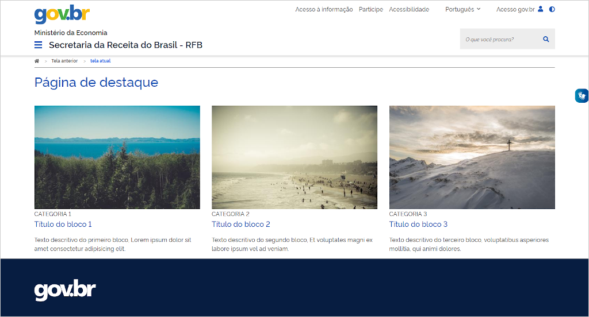
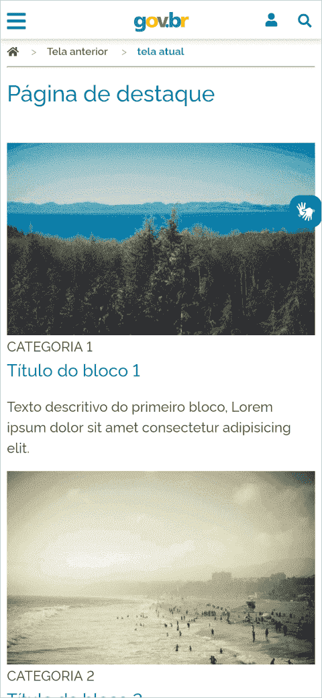

Os templates foram criados para facilitar o uso dos componentes. Dê uma olhada na lista de templates para ver se já existe algum que atenda a sua necessidade.

Caso nenhum deles atenda a sua necessidade, você poderá uma criar o seu próprio usando como base os templates básicos de [site](../../templates/site) ou [sistema](../../templates/system).

## Criando uma tela de conteúdo simples

No exemplo a seguir usaremos o template padrão de sites, mas também serve para sistemas.

> Recomendamos o uso do editor de texto **Visual Studio Code** (<https://code.visualstudio.com>), mas você poderá usar qualquer outro de sua preferência.

1. Acesse o template padrão de sites no menu principal: **templates -> Sites e portais -> Template padrão**
1. Copie o código do template no editor de texto
1. Devido o longo conteúdo do template, faça uma busca pelo texto `<!-- Conteúdo principal -->`

Vamos modificar o título da página e inserir textos e imagens para criar uma tela simples. Usaremos a Grid para organizar o conteúdo ficar adaptável em dispositivos móveis. Veja mais informações sobre a Grid em [Fundamentos Visuais --> Sistema de Grid](ds/fundamentos-visuais/grid).

```html
...
<!-- Conteúdo principal -->
<main id="content" class="page-content">
    <div class="container">
        <h1>Página de destaque</h1>
        <div class="row">
            <div class="col-tablet">
                
                <span>Técnologia</span>
                <h2 class="h4">Título do bloco 1</h2>
                <p>
                    Texto descritivo do primeiro bloco, Lorem ipsum dolor sit
                    amet consectetur adipisicing elit.
                </p>
            </div>
            <div class="col-tablet">
                
                <span>Técnologia</span>
                <h2 class="h4">Título do bloco 2</h2>
                <p>
                    Texto descritivo do segundo bloco, Et voluptates magni ex
                    labore ipsum vel ad veniam.
                </p>
            </div>
            <div class="col-tablet">
                
                <span>Técnologia</span>
                <h2 class="h4">Título do bloco 3</h2>
                <p>
                    Texto descritivo do terceiro bloco, voluptatibus asperiores
                    mollitia, qui animi dolores.
                </p>
            </div>
        </div>
    </div>
</main>
...
```

A imagem a seguir ilustra o conteúdo criado em desktop.



Agora veja como ficou para celulares:


