[version]: # (1.0.0)

O recurso de ajuda é uma maneira de fornecer respostas às dúvidas ou anseios dos usuários, visando esclarecer os meios pelos quais estes poderão concluir suas tarefas, ou acessar algum conteúdo. Já o recurso de comunicação possibilita o envio de _Feedback_ do usuário, como dúvidas, caso o usuário não encontre a informação desejada no conteúdo de ajuda, além de ter a possibilidade de enviar sugestões, comentários ou relatar _bugs_.

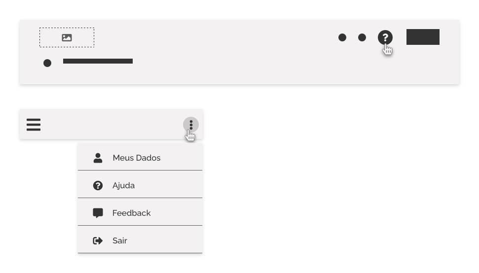
*Exemplo de Ajuda e Envio de Feedback do Usuário*

Quando usar ajuda e comunicação para o usuário:

- Sempre utilize o recurso de ajuda. Além de ser uma heurística fundamental a ser seguida no quesito de usabilidade, nunca se sabe quando o usuário precisará dela;
- Para usuários novatos, experientes ou especialistas, se possível ofereça ajuda direcionada a cada tipo de usuário em seus diferentes níveis de experiência;
- Para colher informações relevantes a respeito da usabilidade de seu produto e implementar futuras melhorias nele.

---

## Ajuda

### Iconografia

Dentro do imaginário coletivo dos usuários de sistemas, aplicativos, e sítios web, já existe uma forte referência iconográfica que representa um contexto de ajuda, a representação iconográfica do símbolo de interrogação, por exemplo: `question` ou `question-circle`. É importante seguir esta referência dentro do contexto Design System, desta forma pode-se deixar bem claro aos usuários o acesso à ajuda apenas com o uso de ícone, sem necessidade de textos explicativos adicionais. Evite utilizar outras simbologias que trazem dúvidas ao usuário com relação a informação semântica.

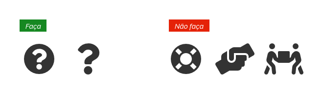
*Utilize o `question` ou `question-circle` como iconografia padrão de ajuda*

**Importante!** Em situações de ajuda contextual pode-se usar o ícone de informação `info` ou `info-circle` como uma alternativa, pois além ser uma prática bastante comum neste tipo de situação, faz parte o padrão estabelecido na documentação de [Formulários](/ds/padroes/formulario).

 
*Utilize `info` ou `info-circle` como padrão alternativo para ícone de ajuda contextual*

### Tipos de Ajuda

#### Global

Ajuda global compreende todo conteúdo de ajuda disponível para o usuário em um sistema. Em suma, é o manual de instruções de uso de seu produto. Tem o objetivo de auxiliar o usuário em todos os aspectos e deve oferecer desde instruções básicas até as mais avançadas, abordando todas as questões de uso do produto. Abaixo seguem algumas formas de como estruturar este conteúdo:

- **Disponibilize uma seção de ajuda:** O conteúdo deve ser estruturado em uma tela ou seção do sistema. Deve ficar claro para o usuário onde encontrar o conteúdo de ajuda. Certifique-se de que o acesso ao conteúdo de ajuda esteja presente em todas as telas de forma visível e fácil de achar;

- **Organize o conteúdo:** Organize o conteúdo de ajuda em tópicos, categorias e assuntos recorrentes. Se possível, utilize um menu próprio para o conteúdo de ajuda ou uma busca com autocomplete nesta seção;

- **Apresente informações relevantes:** Exiba apenas informações que sejam realmente importantes dentro do contexto tratado no tópico de ajuda. Evite dar detalhes que fogem ao assunto;

- **Simplifique a leitura:** Utilize uma linguagem simples e objetiva, evitando o uso de termos técnicos e mantendo a explicação mais curta possível;

- **Formate o conteúdo:** Formatar o texto torna a leitura mais agradável. Separe os blocos de informações com títulos de destaque e sempre que possível e necessário, utilize listas, tabelas, rótulos em negrito, espaçamentos entre parágrafos etc;

- **Utilize imagens:** O uso de imagens facilita a compreensão do usuário durante a leitura;

- **Utilize Audiovisual:** O conteúdo pode ser oferecido de forma textual ou audiovisual. O objetivo principal é tornar o entendimento mais didático e de fácil compreensão pelo usuário;

- **Chatbot:** Se possível, ofereça o recurso de _chatbot_ para auxiliar o usuário na busca pela informação;

#### Contextual

A ajuda contextual é uma forma de apresentar ao usuário um fragmento do conteúdo de ajuda relacionado ao conteúdo, elementos ou telas com os quais o usuário está interagindo. É bastante útil, pois evita que o usuário perca tempo procurando um tópico de ajuda específico dentro do conteúdo de ajuda global.

##### Como Usar

 1. **Utilize um acionador _Dropdown_ ou _Collapse_:** Recomenda-se seguir o padrão [_Dropdown_](/ds/padroes/dropdown) ou [_Collapse_](/ds/padroes/collapse) para exibir ou ocultar o conteúdo de ajuda contextual;

*Exibindo o conteúdo de ajuda contextual com padrão Dropdown*

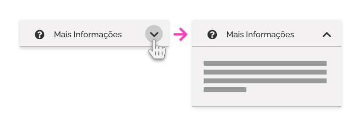
*Exibindo o conteúdo de ajuda contextual com padrão Collapse*

 2. **Posicionamento:** Posicione o ícone padrão de ajuda próximo ao elemento referência da ajuda.

 
*Posicionamento da Ajuda Contextual - Próximo ao elemento de referência da ajuda contextual*

 3. **Escrita:** Apresente um texto curto, direto e contextual a respeito da ajuda solicitada;

*Exemplo de texto objetivo em ajuda contextual*

##### Uso de Dropdown com Modais e _Tooltips_

Os componentes _Modal_ e _Tooltip_ são os mais adequados para exibição do conteúdo de ajuda contextual, pois são elementos flutuantes na interface e facilitam a apresentação ou ocultação deste. Dependendo do formato ou riqueza de detalhes apresentado na ajuda contextual, pode-se optar pelo uso do _Tooltip_ ou _Modal_. Veja as diferenças a seguir:

##### Dropdown com Modais

Quando a necessidade exigir um conteúdo de ajuda contextual mais elaborado, contendo texto com formatação, imagens, vídeos etc, faz-se necessário usar o componente _Modal_, pois este permite maior espaço, além de oferecer rolagem interna.

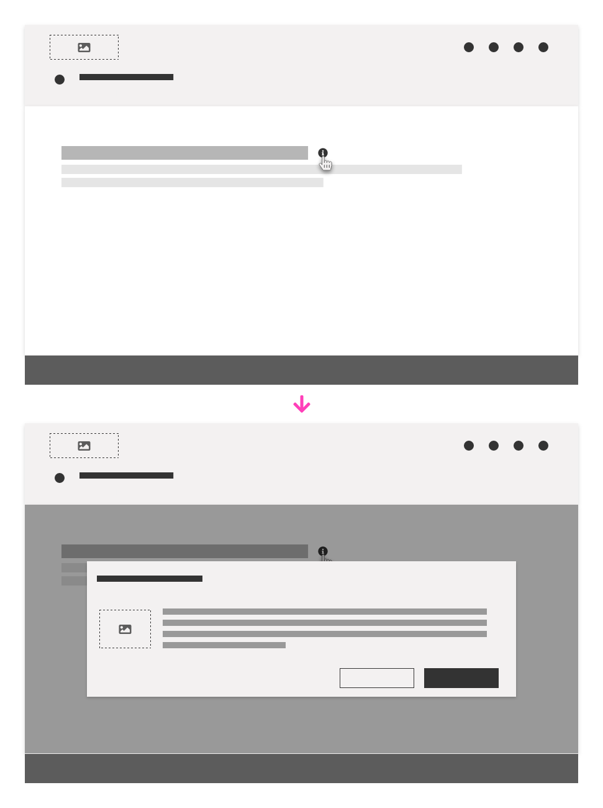
*Utilize Modais quando houver necessidade de um conteúdo de ajuda contextual maior ou mais rico em recursos*

##### Dropdown com _Tooltips_

Para situações que exijam um conteúdo textual simples, com número de caracteres reduzidos, é recomendado o uso de _Tooltips_. Neste caso, evite utilizar um texto muito grande ou uso de imagens. É muito usado para oferecer pequenas dicas ao usuário ou auxiliar no preenchimento de campos de formulário.

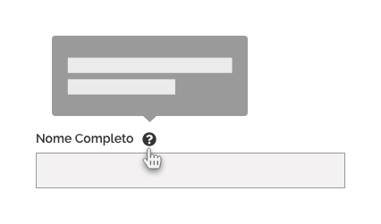
*Dê preferência ao uso de tooltips e uma informação mais enxuta*

##### Acessando mais detalhes

Caso seja necessário fazer uma referência à algum conteúdo relacionado ou um detalhamento maior da ajuda, pode-se usar um _hiperlink_ de acesso ao conteúdo de ajuda global. Este deve estar localizado dentro do _Tooltip_ ou _Modal_ ao final do conteúdo de ajuda contextual.

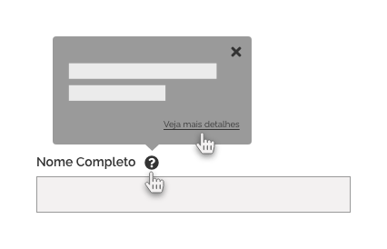
*Quando necessário, utilize Hiperlink de acesso a mais detalhes*

#### Ajuda Não Solicitada

Este recurso é bastante útil quando o usuário interage com o sistema pela primeira vez ou quando o sistema traz alguma novidade decorrente de novas atualizações. Geralmente é exibido em forma de passo a passo, utilizando recursos textuais ou apontando detalhes na interface onde estão presentes as novidades. O [Padrão Onboarding](/ds/padroes/onboarding/) detalha este tipo de situação de forma mais completa.

*Ajuda Não Solicitada seguindo o Padrão de Onboarding*

---

## Comunicação

De forma geral, os recursos de comunicação são a principal forma pela qual o usuário poderá fornecer um _feedback_ do uso do sistema. Este _feedback_ pode ser qualquer tipo de comentário que expresse um sentimento do usuário em relação ao sistema no qual ele interage.

### Iconografia

Com relação à semântica do ícone de envio de _feedback_, pode-se usar a representação de um balão de comentário como padrão, como `comment` ou `comment-alt`, fazendo referência ao ato de se comunicar unilateralmente. Porém, evite o uso do balão duplo, como `comments-alt` ou `comments`, pois rementem a uma ideia de bate-papo, que não é caso aqui.

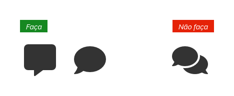
*Utilize `comment` ou `comment-alt` como iconografia padrão para Envio de Feedback*

### Tipos de _Feedback_ do Usuário

 O sentimento ou comentário do usuário pode se enquadrar em um dos determinados tipos abaixo:

 1. **Sugestões de Melhoria:** Este tipo comentário é muito comum vindo de usuários frequentes ou especialistas e trazem um conteúdo de grande utilidade para melhorias e evolução do produto;
 2. **Críticas:** Talvez seja um dos tipos de _feedback_ mais comuns. Podem ser críticas negativas ou construtivas, mas as duas situações trazem importantes insumos para análise e futuras atualizações do produto;
 3. **Elogios:** É um tipo menos comum, porém um bom indicador do nível de satisfação do usuário sobre a qualidade de sua interface ou funcionalidades desenvolvidas;
 4. **Dúvidas de Uso:** Geralmente este tipo de _feedback_ ocorre quando o usuário já tentou de todas as maneiras solucionar sua dúvida dentro do sistema, mas sem sucesso. Pode indicar com clareza o quanto a usabilidade de sua interface pode estar comprometida, ou também pode indicar uma pobreza de detalhes no conteúdo de ajuda de seu produto;
 5. **Relatos de problemas, erros ou bugs:** Este tipo de _feedback_ é bastante útil e necessário dentro do ciclo de vida de um sistema ou aplicativo e fornece insumos para um _backlog_ de atualizações futuras.

### Como Coletar _Feedback_ do Usuário

A coleta de _feedback_ do usuário é de suma importância para análise da qualidade do produto desenvolvido. Pode ser usada para avaliar o lançamento de um novo produto, uma mudança no design da interface, um novo fluxo de navegação ou uma nova funcionalidade. Abaixo seguem algumas formas para coleta dessas informações.

#### _Feedback_ Automático por Opção de Escolha do Usuário _(Feature Toggle)_

Consiste em oferecer ao usuário a possibilidade de alternar entre uma característica nova ou antiga do sistema ou da interface. Desta forma o sistema coleta automaticamente informações a respeito dos usuários optantes, tanto em número como em opção, e fornece insumos para avaliar a preferência do público-alvo no uso desta nova característica.

É bastante útil quando se pretende lançar uma nova funcionalidade, propor um novo redesign do sistema ou propor um novo aspecto de usabilidade.

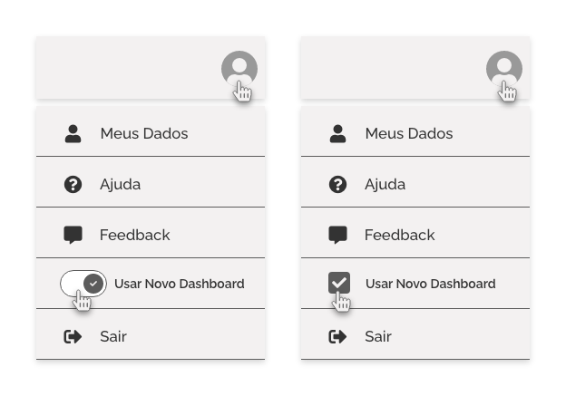
*Por exemplo, pode-se usar o componente Switch ou Checkbox no menu de opções para avaliar o lançamento de um novo dashboard no sistema*

#### Formulários

##### Abertos

Talvez seja a forma mais tradicional de coleta de dados. Consiste em oferecer ao usuário uma caixa de texto onde ele possa preencher e enviar suas dúvidas, sugestões ou críticas. Esta forma de coleta de dados pode ser exibida em uma tela específica, em uma janela ou painel flutuante.

Neste formato é importante que seja oferecido ao usuário um combo de seleção onde ele possa definir o motivo de seu contato. Também é interessante solicitar, de forma opcional, o email deste usuário caso seja possível um contato mais personalizado.

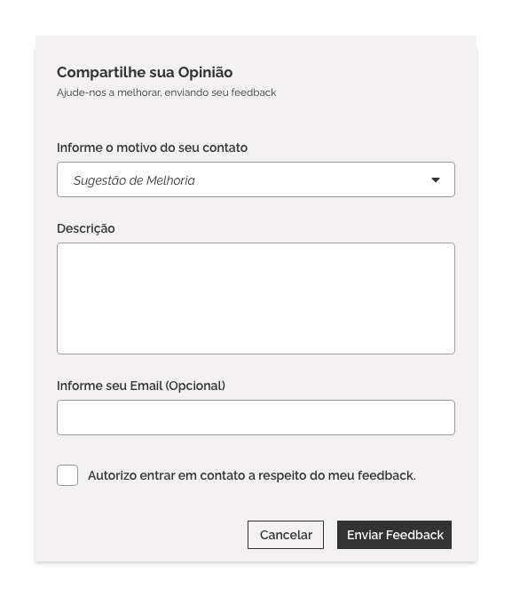
*Exemplo de Caixa de Comentários*

##### Questionários

Consiste em disponibilizar um questionário mais amplo e detalhado, com questões mais específicas a respeito das características do produto. Este formato exige mais tempo dos usuários, sendo portanto mais difícil obter grande adesão destes. Apesar disso, é bastante útil para se obter um _feedback_ mais rico em detalhes.

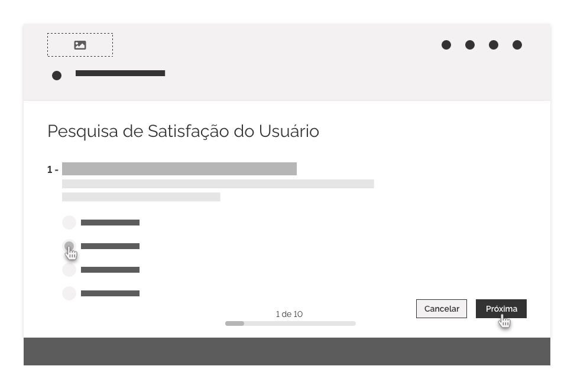
*Exemplo de formulário para pesquisa de satisfação do usuário*

#### Escala de Satisfação _(Rating Scales)_

É uma forma mais rápida ou pontual para se obter o nível de satisfação do usuário com relação à algum aspecto da interface ou características funcionais. Consiste numa escala visual, com indicadores de satisfação que variam em gradações entre "Muito Insatisfeito" e "Muito Satisfeito". Pode ser posicionada juntamente com a nova característica a ser avaliada e utilizada de várias formas, como nos exemplos abaixo.

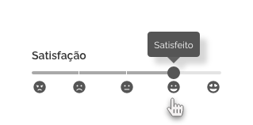
*Exemplo de Escala de Satisfação utilizando componente Slider e indicadores de satisfação*

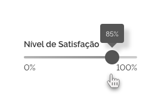
*Exemplo de Escala de Satisfação utilizando componente Slider e indicador em percentual*

*Exemplo de Escala de Satisfação com classificação em estrelas*

---

## Melhores Práticas

### Localização

O acesso ao conteúdo de ajuda deve estar localizado em uma região de fácil visualização na interface e que seja acessível a partir de qualquer tela de sua aplicação. Geralmente os locais mais apropriados para o acesso a este tipo de conteúdo são _Cabeçalhos_, _Rodapés_ ou _Menus_ de navegação.

*Exemplo de Ajuda no Cabeçalho*

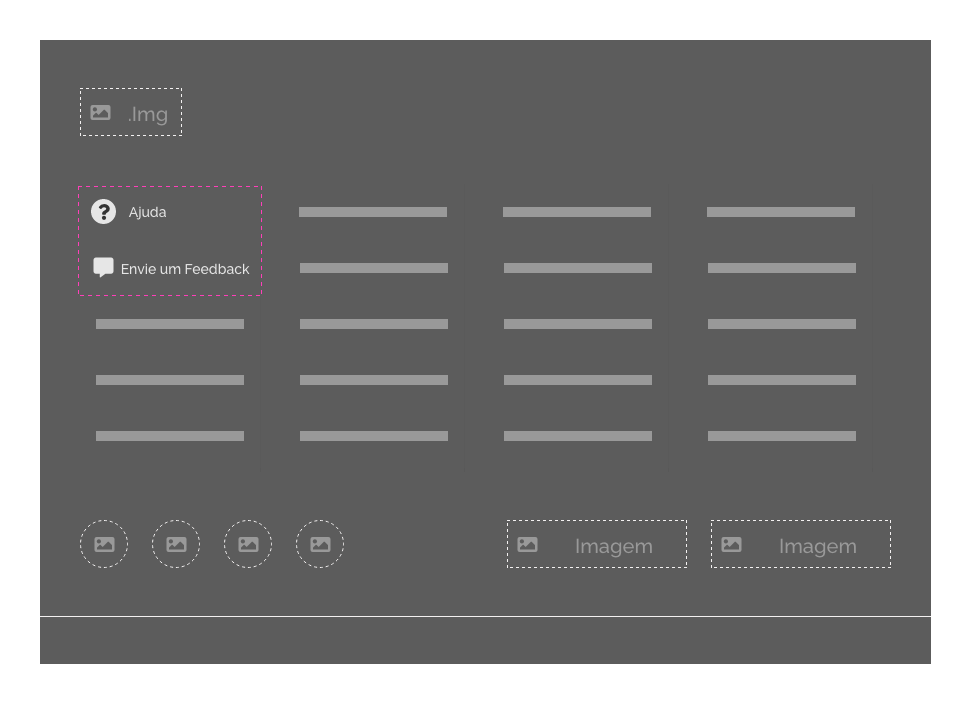
*Exemplo de Ajuda e Envio de Feedback no Rodapé*

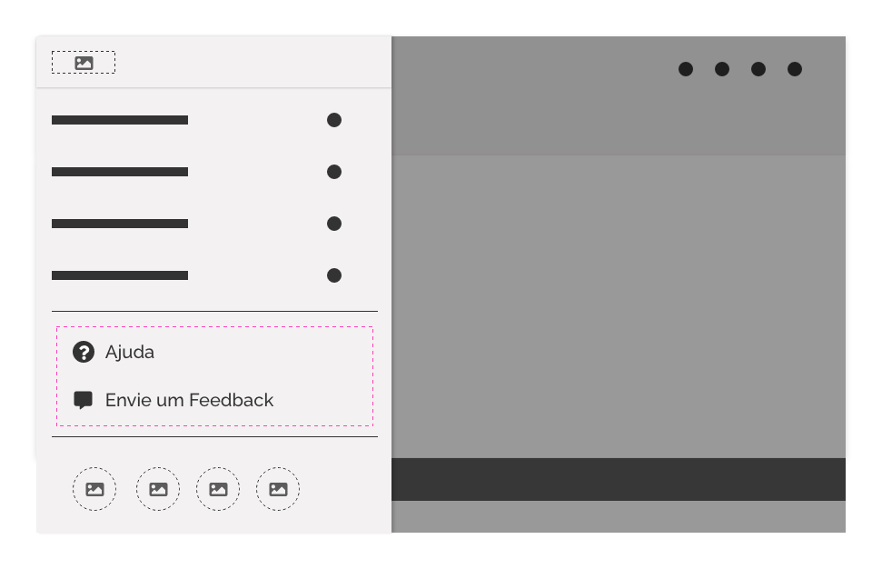
*Exemplo de Ajuda e Envio de Feedback no Menu*

Em aplicações mobile, os recursos de ajuda e envio de _feedback_ poderão ser acessados a partir de um menu flutuante.

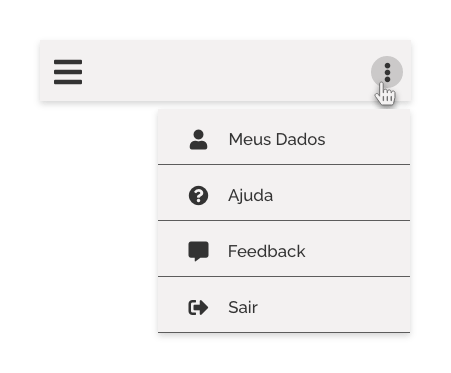
*Exemplo de Ajuda no Menu Flutuante*

### Acesso Imediato

Após acionar o botão de ajuda, é importante que o usuário seja conduzido imediatamente ao conteúdo de ajuda. Evite exibir um conteúdo intermediário, como menus de opções que trazem tópicos não relacionados à ajuda.

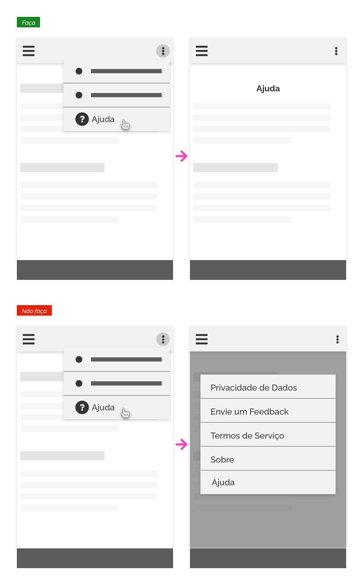
*Acesso Imediato - Conduza o usuário imediatamente ao conteúdo de ajuda*

---

## Referências

- [Help & Feedback - Material Design](https://material.io/archive/guidelines/patterns/help-feedback.html#help-feedback-placement)

- [Contextual Help on Demand User Assistance - Oracle Alta UI Patterns](https://www.oracle.com/webfolder/ux/middleware/alta/patterns/ContextHelponDemand.html)

- [Contextual Help - OpenShift Design](http://openshift.github.io/openshift-origin-design/designs/administrator/future-openshift/contextual-help/)

- [Como coletar feedback e capturar usuários para pesquisas sobre o produto - UX Collective](https://brasil.uxdesign.cc/como-coletar-feedback-e-capturar-usu%C3%A1rios-para-pesquisas-sobre-o-produto-7cfbb7e56c5d)
