[version]: # (1.0.1)

Também conhecido como *Densidade Informacional*, são recursos ou técnicas para otimizar a organização do conteúdo na tela exibindo ou ocultando partes do mesmo conforme a prioridade da informação.

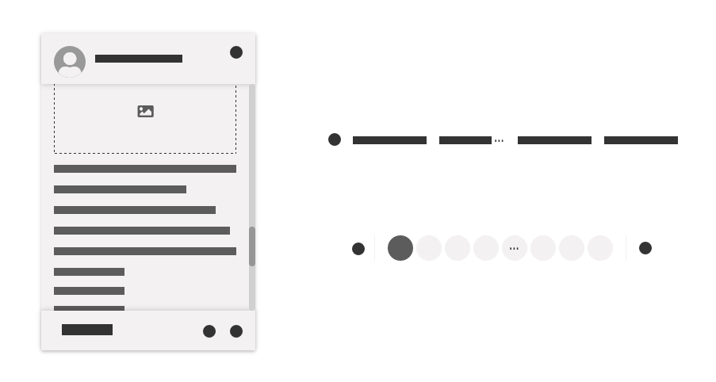
*Exemplos de uso da content overflow.*

*Utilize* técnicas de *content overflow* para:

-   organizar melhor o conteúdo nos espaços determinados pela tela ou pelo componente;

-   acrescentar informações complementares a um conteúdo;

-   ocultar informações menos relevantes;

-   deixar o *layout* mais limpo e fácil de ser assimilado.

*Não utilize* técnicas de *content overflow*:

-   quando for possível simplificar o conteúdo para que caiba no espaço determinado a ele;

-   quando se tratar de conteúdo essencialmente relevante ao usuário;

-   em cabeçalhos de página, títulos, menus, rótulos de botões, mensagens de erro, mensagens de validação ou notificações.

---

## Técnicas para otimizar o *Content Overflow*

Antes de tudo é preciso organizar o *layout* considerando a hierarquia do conteúdo. Disponibilizar na tela todo o conteúdo de uma vez pode acarretar em uma sobrecarga cognitiva e consequentemente dificultar a assimilação ou gerar desinteresse do público. Agrupe conteúdos em blocos considerando a função e a semelhança das informações.

*A imagem acima demonstra o uso da técnica de agrupamento de hyperlinks e ícones com funções semelhantes.*

Todo o conteúdo deve ser cuidadosamente analisado e revisado. É importante ter em mente que o usuário se encontra em uma página para resolver um problema ou necessidade específica. Portanto, ele não espera ser "bombardeado" por conteúdos inúteis ou pouco relevantes.

A primeira tarefa a ser realizada é a hierarquização do conteúdo. Deixe de forma nítida e objetiva as *informações essenciais*. As *informações complementares* funcionam como apoio às informações essenciais e podem estar ocultas ou parcialmente ocultas na tela e disponíveis por meio de recursos acionáveis pelo próprio usuário. Por fim, as *informações adicionais* (e menos importantes) podem estar localizadas fora da tela e indicadas por meio *hyperlinks* e botões.

Apresentamos a seguir algumas técnicas e recursos úteis agrupados de acordo com a hierarquia da informação, a fim de auxiliar a organização do conteúdo dentro dos produtos do Design System de forma prática e eficiente.

### 1. Informações Essenciais

São informações imprescindíveis para o usuário conseguir executar uma tarefa de forma assertiva e devem estar fácil e diretamente visíveis na tela.

Considere as orientações de posicionamento e agrupamento da informação e utilize a rolagem para acessar todo o conteúdo disponível na tela.

#### Rolagem

É a maneira mais básica e usual de tratar grandes quantidades de conteúdo essencial. Pode ser utilizado tanto em conteúdos gerais de uma página quanto em conteúdo específico de certos componentes.

Utilize a *barra de rolagem* para indicar visualmente que o conteúdo se estende por áreas não visíveis na tela.

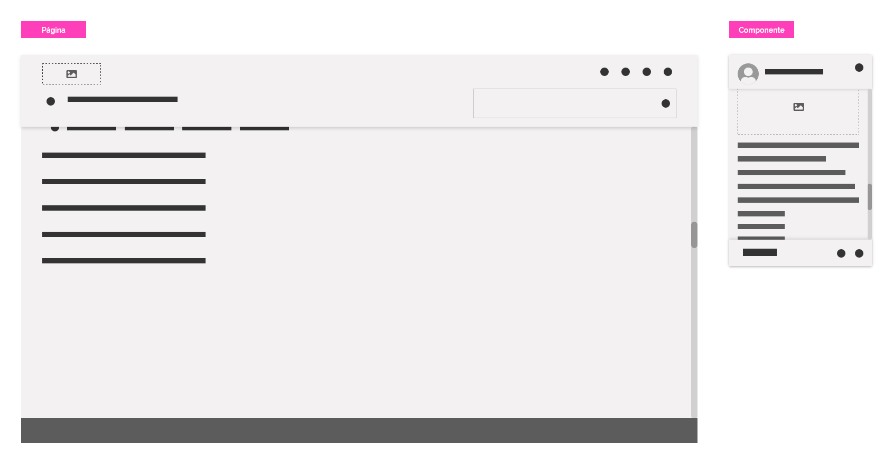
*Exemplo do uso da barra de rolagem na página e no componente card.*

##### Rolagem Automática

Trata-se da rolagem promovida pelos navegadores. Geralmente as pessoas já estão habituadas com esse tipo de funcionalidade e é recomendado não alterar o padrão visual já amplamente conhecido.

##### Rolagem Interna

Alguns componentes podem apresentar uma barra de rolagem interna para melhor organizar o conteúdo. Neste caso, o conteúdo rolante é apenas o interno ao componente e deve rolar sob as margens do mesmo, enquanto a tela continua estática.

Para auxiliar o entendimento do usuário de que há mais informação a ser vista, as margens que ocultam o conteúdo rolante devem elevar a camada em um nível e apresentar a sombra correspondente. Confira o documento do fundamento visual [elevação](https://www.gov.br/ds/fundamentos-visuais/elevacao) para entender melhor o uso de sombras.

Uma boa dica para tornar ainda mais intuitiva a ocorrência do conteúdo rolante é deixá-lo com uma parte visível, insinuando que há mais para ser visto. A imagem abaixo ilustra essa técnica.

*Exemplo das três etapas do conteúdo sendo rolado para cima em um componente.*

**Atenção:** não exagere na quantidade de elementos na tela com rolagem. Muitos elementos com barras de rolagens podem confundir os usuários. É possível utilizar outros métodos juntamente com a rolagem para oferecer um *layout* mais rico.

##### Rolagem Horizontal

Sabemos, por meio de testes, que usuários desaprovam a rolagem horizontal. Esse fato, por si só, já é suficiente para evitá-la, porém existem ainda duas outras boas razões:

-   Na *web*, os usuários esperam a rolagem vertical. Como acontece com todos os elementos-padrão, é melhor atender às expectativas do usuário do que surpreendê-los;

-   Quando as páginas apresentam rolagem vertical e horizontal, os usuários precisam mover sua janela de visualização em duas dimensões, o que torna difícil cobrir todo o espaço. Para pessoas com poucas habilidades de visualização espacial, é especialmente desafiador planejar movimentos ao longo de dois eixos em um plano invisível. Ao contrário, a rolagem unidimensional é uma maneira simples de mover-se pelo conteúdo sem planejamento prévio.

##### Rolagem em Dispositivos Móveis

Nesses dispositivos a rolagem é entendida como gesto de arrasto vertical ou horizontal. Por apresentar menos espaço na tela, é esperado que haja mais rolagens. Porém, nesses casos, prefira a rolagem da tela ao invés de rolagens internas dos elementos.

É importante lembrar que, em um ambiente móvel, onde os elementos rolam infinitamente, o conteúdo acima da dobra, ou seja, antes da rolagem da tela, pode fazer a diferença. Por isso, é recomendado ter pelo menos parte do conteúdo antes da dobra. Isso mostra aos usuários que há um motivo para rolar a tela, fazendo com que permaneça o desejo em continuar querendo ver o que seu produto tem a oferecer.

**Atenção:** em dispositivos móveis, a barra de rolagem geralmente é dispensável, mas preocupe-se em deixar pistas de que há conteúdo adicional.

Outro aspecto interessante a se considerar é a existência de "áreas seguras" no *layout* para que o usuário possa arrastar a tela sem o risco de toques acidentais.

##### Melhores Práticas para Rolagem

Considere as seguintes diretrizes de usabilidade quando utilizar recursos de rolagem:

-   Oculte as barras de rolagem se todo o conteúdo estiver visível. Se as pessoas virem uma barra de rolagem, presumem que há conteúdo adicional e ficarão frustradas se não conseguirem rolar;

-   Use barras de rolagem que se parecem com barras de rolagem. Evite personalizar e descaracterizar as barras de rolagem;

-   Evite a rolagem horizontal nas páginas e sempre que possível, minimize-a nos componentes;

-   Exiba todas as informações importantes acima da dobra da página, isto é, na área visível da tela sem a necessidade de rolagem. Os usuários geralmente decidem se querem ficar ou sair do *site* com base no que podem ver nessa área da tela;

-   Sempre que possível, evite rolagens demasiadamente longas. Em qualquer caso, todas as informações relevantes devem estar visíveis na tela inicial, pois a rolagem pode causar problemas de acessibilidade;

-   Considere também que a rolagem pode ser difícil para usuários com deficiências motoras. Os usuários com baixo nível de alfabetização não podem readquirir facilmente sua posição no conteúdo depois que ele é movido. Usuários idosos costumam ter problemas para chegar ao ponto certo em menus de rolagem e outros itens de rolagem pequenos.

A seguir, confira algumas das principais técnicas para lidar com as informações complementares.

### 2. Informações Complementares

São informações que complementam as informações essenciais e podem acrescentar valor ao entendimento da tarefa. Para muitos usuários podem ser eventualmente necessárias, porém, para outros, podem ser fundamentais para que o entendimento se torne completo. Por não se tratar de informação essencial, pode estar localizada estrategicamente na tela de forma oculta ou parcialmente oculta.

#### 2.1. Conteúdo Oculto

Conteúdo oculto é todo aquele que não está originalmente visível e necessita de uma ação do usuário para ser visualizado.

Oculte conteúdos quando:

-   não existe relevância ou espaço suficiente para deixá-lo visível na tela;

-   se tratar de informação complementar a um conteúdo já disponível na tela.

Dominar a técnica de ocultar conteúdo pode ser uma ótima maneira de organizar a informação de maneira limpa e consistente tornando o conteúdo mais facilmente consumível. É recomendado recorrer a técnicas de *collapse* e *dropdown* para tratar cada caso específico.

Analise os respectivos documentos para mais detalhes sobre esses comportamentos:

-   [*Collapse*](https://www.gov.br/ds/padroes/collapse);

-   [*Dropdown*](https://www.gov.br/ds/padroes/dropdown).

A seguir, analisamos alguns casos mais recorrentes utilizando os comportamentos *collapse* e *dropdown*:

##### A. Expansão

Expandimos e retraímos conteúdo utilizando o comportamento *collapse* quando é necessário ocultar informação na tela e disponibilizá-la de uma só vez quando um elemento for acionado. Quando abertos, eles empurram o conteúdo seguinte o suficiente para preencher a tela com o novo conteúdo disponibilizado. Veja a imagem abaixo:

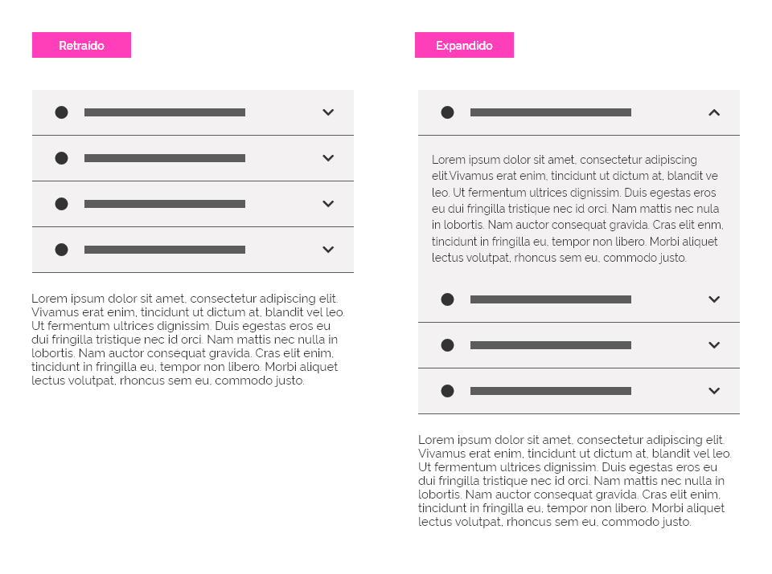
*Comportamento de expansão/retração do conteúdo com uso do padrão collapse. Note que o conteúdo seguinte é empurrado para baixo.*

Esse recurso de *collapse* é bastante utilizado em menus e listas e economiza bastante espaço na tela.

##### B. Informação Complementar

Alguns elementos possuem conteúdo ocultos que podem ser acessados apenas repousando o ponteiro do *mouse* sobre o elemento acionador (*mouse over*) ou em alguns casos, por meio de clique e toque. Essa técnica de *dropdown* é útil para descrever um elemento ou fornecer informações complementares.

*Tooltip* é o componente mais indicado para esses casos. Utilize-o sempre que houver necessidade de:

-   agregar mais detalhes informativos a elementos da interface;

-   alguma informação que, em um primeiro momento, não necessita estar visível para o usuário.

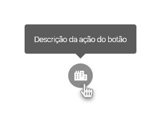
*Apresentação de conteúdo complementar com uso de tooltip.*

**Atenção:** sempre que um elemento não for facilmente compreendido pelo usuário, use *tooltips* para melhor descrevê-lo.

Confira todos os detalhes do componente [*tooltip*](https://www.gov.br/ds/components/tooltip?tab=designer).

Nos casos mais específicos outros elementos podem acomodar as informações complementares.

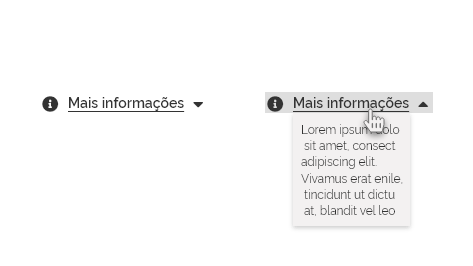
*Exemplo de técnica utilizando um elemento com a informação complementar.*

**Atenção:** considere a utilização de um elemento visual para indicar a existência do comportamento *dropdown*.

##### C. Menu Suspenso

Menus suspensos com caráter contextual devem ser utilizados para conferir opções de *hyperlinks* que não necessitam estar originalmente disponíveis na tela. É uma excelente forma de agrupar ações em comum deixando o *layout* da tela ou do componente mais limpo e organizado.

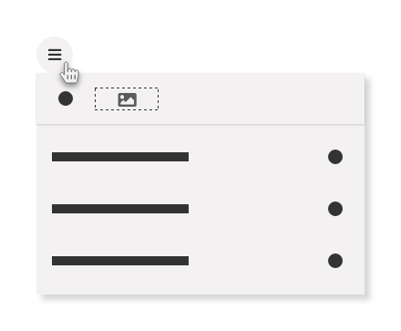
*Exemplo de menu suspenso.*

Pode ser aplicado diretamente na tela ou dentro de componentes, como *tables*, *cards*, avatares, modais etc. e geralmente são acionados por *buttons* ou *hyperlinks*.

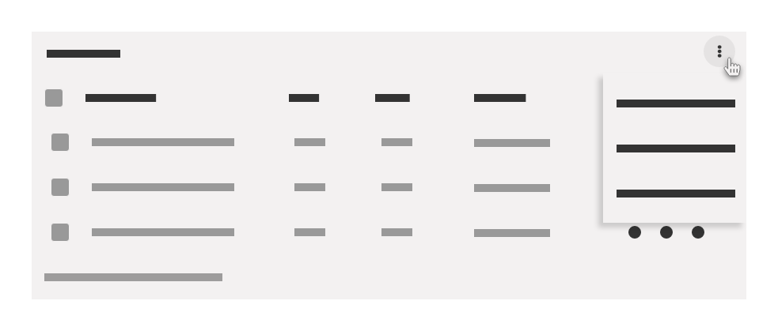
*Tabela com menu suspenso. Esse recurso evita que a tabela fique sobrecarregada com todos os itens visíveis.*

#### 2.2. Conteúdo Parcialmente Oculto

Ao contrário do que foi apresentado anteriormente, o conteúdo parcialmente oculto é caracterizado por apresentar apenas uma parte da informação, possibilitando ao usuário optar em acessar o restante do conteúdo.

Esse recurso é mais comumente utilizado para expandir/recolher uma grande quantidade de informação (geralmente textos). O conteúdo na íntegra pode ser acessado pelo usuário por meio de um elemento acionador que faz com que o conteúdo apresente o comportamento *collapse* e se expanda mostrando o conteúdo em sua totalidade.

##### A. Botão Expansor

O componente *button*, e suas variações, pode funcionar como acionador de conteúdos parcialmente escondidos. Uma das opções mais utilizadas é o  botão “Mostrar Mais”, que pode ser utilizado quando há uma quantidade significativa de conteúdo excedente. Implementar um botão “Mostrar Mais” dá ao usuário a capacidade de ver o conteúdo em partes mais digeríveis, ao invés de tudo de uma vez.

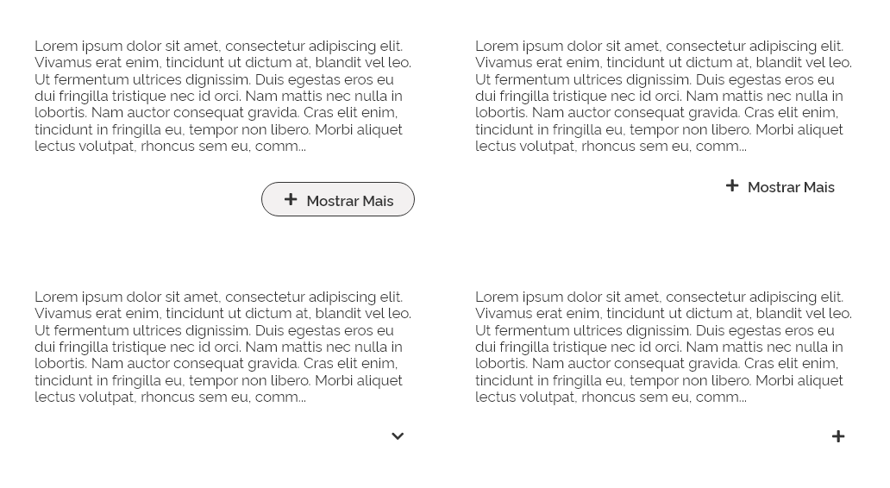
*Variações de botões "Mostrar Mais".*

Um botão “Mostrar mais” é usado no lugar de rolagem, pois são mais proeminentes e acionáveis e ao ser clicado o conteúdo é expandido. Se necessário, um “Mostrar Menos” pode ser utilizado para ocultar novamente o conteúdo.

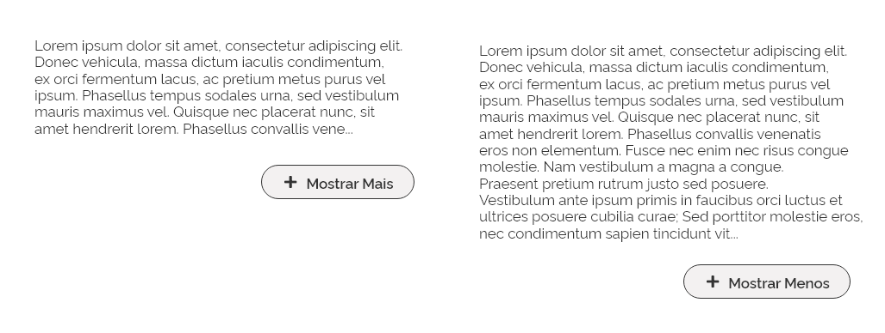
*Comportamento de expansão/retração com uso do componente button.*

“Mostrar Mais” também pode ser apresentado como “Carregar Mais” nos casos em que o desempenho é uma preocupação ou simplesmente por meio de ícone que sugira a ação esperada.

##### B. Truncamento

Truncamento é a técnica de interrupção brusca de um texto, como um parágrafo ou uma frase longa, que exceda o tamanho de uma área determinada na tela. É normalmente utilizado em textos estáticos ou *hyperlinks*. Note que nas imagens do item anterior (botão expansor) o texto foi truncado para transmitir a ideia de que o conteúdo continua.

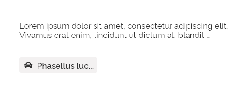
*Exemplos de truncamento de texto em um parágrafo e em um componente.*

O truncamento deve ser utilizado para substituir caracteres em uma palavra e/ou para substituir palavras inteiras e são sinalizados por reticências *(...)*. Quando possível evite deixar um ou dois caracteres, de uma palavra truncada, visíveis.

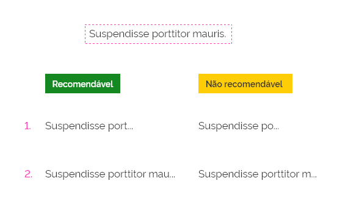
*Em um truncamento, evite deixar menos de três caracteres representando uma palavra.*

**Atenção:** considere caracteres apenas letras e números.

Textos truncados devem disponibilizar uma forma de apresentar a versão completa do texto. Uma boa maneira de se conseguir isso é por meio do componente *tooltip*.

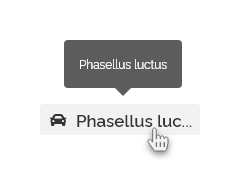
*Utilize o componente tooltip para apresentar ao usuário a versão completa do texto truncado.*

**Atenção:** as exceções são os parágrafos truncados que não necessitam de *tooltip*.

Falaremos mais sobre o uso de *tooltip* mais adiante neste documento.

O truncamento também pode ser aplicado a uma série de elementos que ultrapassem uma determinada área reservada da tela, tais como:

-   *Breadcrumbs*;

-   *Pagination*;

-   *Hyperlink* longo;

-   Parágrafo;

-   Redução de um nome de um item longo (itens de tabelas, por exemplo).

**Atenção:** o truncamento não deve ser utilizado em cabeçalhos de página, títulos, menus, rótulos de botões, mensagens de erro, mensagens de validação ou notificações.

##### Variações de Truncamento

Existem três maneiras de truncar um texto:

-   **Inicial:** usado no início de uma sequência de texto para indicar que o mesmo é continuado;

-   **Intermediário:** usado quando várias *strings* de texto têm inícios e/ou terminações diferentes, mas exatamente os mesmos caracteres do meio. Também pode ser usado para encurtar uma frase quando o final não pode ser truncado por reticências;

-   **Final:** usado no final de uma sequência de caracteres ou parágrafo para indicar que há mais conteúdo para ser visto ou para encurtar uma longa sequência textual.

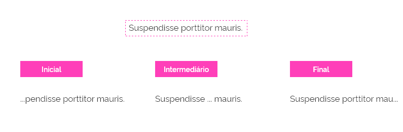
*Variações de truncamento de textos.*

### 3. Informações Adicionais

Informações adicionais são aquelas menos importantes e por isso não necessitam estar presentes na tela de origem. Geralmente estão localizadas em outras páginas, modais ou até mesmo em outros *websites*. A maneira mais comum de acessá-las é por meio de botões ou *hyperlinks*.

#### A. Modal

Se a informação adicional estiver de alguma forma vinculada conteúdo original, mas for extensa o suficiente para ser tratada na mesma tela, prefira o recurso de uma modal, uma janela de tamanho flexível para o desenvolvimento de informações adicionais.

Modais têm a característica de criar um "intervalo" no fluxo de navegação principal, e pode trazer um aviso, uma funcionalidade ou formulário extra. Após consumir esse conteúdo, o usuário pode retornar normalmente ao fluxo principal.  

**Atenção:** tenha em mente que o exagero no uso de modais pode se tornar extremamente inconveniente para a navegação. Considere sempre se o conteúdo da modal tem um vínculo estreito com a ação de origem.

Confira o documento [modal](https://www.gov.br/ds/components/modal?tab=designer) para maiores detalhes deste componente.

#### B. Página Interna

Nos casos em que a informação adicional seja extensa ou não possui vínculos estreitos com o conteúdo original, prefira direcionar o usuário para uma nova página.

**Atenção:** direcionar o usuário para novas páginas interrompe o fluxo original de navegação. Evite nos casos em que essa interrupção seja prejudicial para a realização da tarefa.

#### C. Página Externa

Muitas vezes é interessante oferecer ao usuário conteúdos externos ao seu *website* que, de alguma forma, pode lhe ser útil. Geralmente trata-se de conteúdo de *websites* de referência ou legislações com informações específicas para o público interessado no aprofundamento do tema abordado.

**Atenção:** use esse artifício com extrema cautela. Ao direcionar o usuário para páginas externas corre-se o risco de haver abandono do seu conteúdo, portanto utilize-o somente em casos especiais que tragam valor real para o seu conteúdo.

Sempre que direcionar um usuário para fora do seu *website*, sinalize com o ícone abaixo.

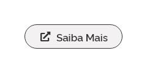
*Deixe claro para o usuário quando o hyperlink direcionar para uma página externa.*

---

## Melhores Práticas

-   **Evite conteúdos extensos:** muito conteúdo não é necessariamente a melhor solução. Essa prática implica em maior tempo de leitura e aprendizado pelo usuário. A informação deve ser absorvida de forma rápida pelo leitor;

-   **Agrupe conteúdos semelhantes:** Organizar as informações na tela agrupando itens semelhantes ajuda o usuário a entender melhor o conteúdo e a encontrar com mais rapidez a informação que está buscando;

-   **Mantenha a consistência:** situações semelhantes de *content overflow* devem possuir o mesmo padrão em todo o produto;

-   **Não exagere:** técnicas de *content overflow* são úteis e devem ser utilizados sempre que possível, porém, não substitui um bom planejamento de conteúdo. Utilize-as somente quando o conteúdo excedente realmente é necessário e acrescenta valor ao usuário;

-   **Combine:** as técnicas e recursos apresentados são intercambiáveis e podem ser utilizados em conjunto para proporcionar a melhor experiência possível para o usuário.
