[version]: # (1.0.0)

Densidade é a especificação dos espaçamentos vazios que compõem a tela ou os componentes de interface, e pode ser ajustada dentro de uma escala de intensidade, de forma a atender diferentes objetivos no projeto de layout ou implementação.

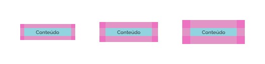
*Exemplo de Uso de Densidades*

Utilize Densidade para:

- otimizar a visualização de grandes quantidades de informação em tela, como grandes listas ou tabelas extensas;
- otimizar a diagramação de elementos em espaços reduzidos, como dispositivos móveis, por exemplo;
- otimizar espaços em componentes que são utilizados dentro de outros componentes, como por exemplo, um botão dentro de uma linha de tabela;
- tornar mais amplos os espaços em tela e reduzir a sobrecarga de informação;
- focalizar a atenção do usuário em elementos ou componentes na tela. Por exemplo, um campo de texto ou botão que precisa de maior destaque;

Não utilize Densidade:

- reduzindo os espaços muito restritos de leitura de informação, de forma a dificultar a legibilidade;
- reduzindo os espaços muito restritos em elementos interativos, de forma a dificultar o acionamento pelo usuário;
- reduzindo espaços em elementos que precisam de destaque em tela;

---

## Tipos de Densidade

Os tipos de densidade são recomendações, presentes em cada componente, que determinam o espaçamento utilizado dentro de uma escala, seja ampliando ou reduzindo estes.

### Densidade Padrão

É a especificação de espaçamento ou dimensão padrão, recomendada para um determinado componente. E a definição deste valor na escala, é concebida com base nas características do componente. Em suma, é a forma esteticamente mais adequada.

*Exemplo Densidade Padrão*

### Densidade Alta

A densidade alta compreende uma redução das dimensões ou espaçamentos dentro da escala de densidade, tendo como ponto de partida a especificação da densidade padrão. Neste tipo, decrementa-se um nível na escala de densidade.

Este tipo é mais adequado para situações onde há a necessidade de otimização de espaços em telas ou elementos.

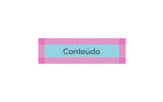
*Exemplo Densidade Alta*

### Densidade Baixa

A densidade baixa compreende um aumento das dimensões ou espaçamentos dentro da escala de densidade, tendo como ponto de partida a especificação da densidade padrão. Neste tipo, incrementa-se um nível na escala de densidade.

Este tipo é mais adequado para tornar os elementos ou diagramação de tela mais amplos e confortáveis, reduzindo a sobrecarga cognitiva. Também é útil para focar a atenção do usuário em determinados elementos.

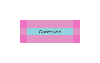
*Exemplo Densidade Baixa*

---

## Como Usar Densidade

A seguir, pode-se observar algumas orientações que podem auxiliar projetistas de interface a entender quando e como utilizar densidades, de forma a melhorar a experiência dos usuários.

### Dimensões e Espaços Internos

Existem duas formas de ajustar a densidade em componentes Design System GOV.BR: 

- através do ajuste nos espaços internos _(padding)_ ao componente;
- através do ajuste nas dimensões _(width e/ou height)_ do componente. 

#### Espaços Internos

Neste modo, o ajuste é feito nos espaços internos ao componente. Referem-se aos espaços entre o conteúdo interno e os limites da superfície do componente e podem ocorrer no topo, base, direita e esquerda. Observe os exemplos abaixo.

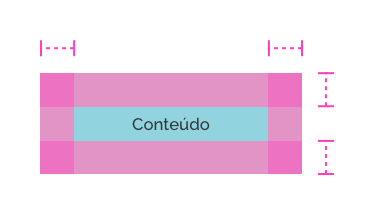
*Exemplo de Ajuste de Densidade nos Espaços Internos*

**Importante!** É importante salientar que os espaços internos podem ser ajustados nas quatro direções (topo, base, direita e esquerda), mas também podem ser ajustados escolhendo-se apenas duas direções opostas, como direita e esquerda apenas ou topo e base apenas.

#### Dimensões

Esta forma consiste em realizar o ajuste nas dimensões do componente, ou seja, largura e altura. Da mesma forma, como nos espaçamentos internos, pode-se realizar o ajuste em ambas as dimensões (largura e altura) ou em apenas uma das dimensões. Observe abaixo.  

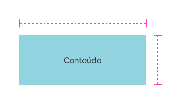
*Exemplo de Ajuste de Densidade nas Dimensões*

### Escala de Densidade

A escala de densidade é uma gradação de valores que varia de `4px` em `4px` e pode crescer ou diminuir sem limites, de acordo com a necessidade. O valor X é a referência padrão para densidade em um determinado componente. Quanto maior o grau da escala, mais baixa é a densidade, e quanto menor o grau da escala, mais alta é a densidade.

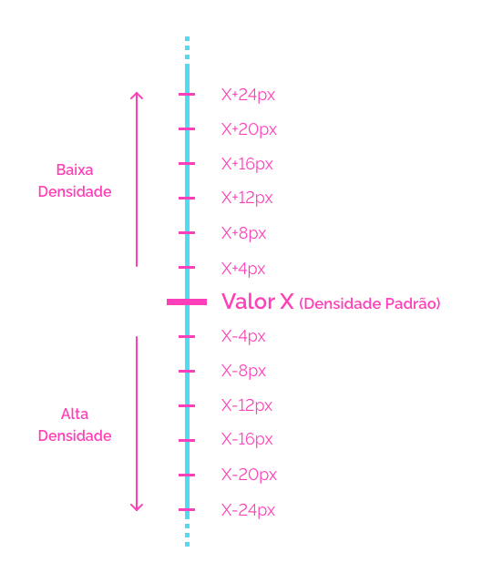
*O Valor X é a referência padrão de densidade. Incrementando de 4 em 4px no valor X, reduz-se a densidade, enquanto que decrementando de 4 em 4px no valor X aumenta-se a densidade.*

#### Como Usar a Escala de Densidade

Como visto anteriormente, cada componente determina sua densidade padrão mais adequada, e a partir desta densidade padrão, são definidos quantos níveis serão incrementados ou decrementados na escala para se aplicar às densidades alta e baixa.

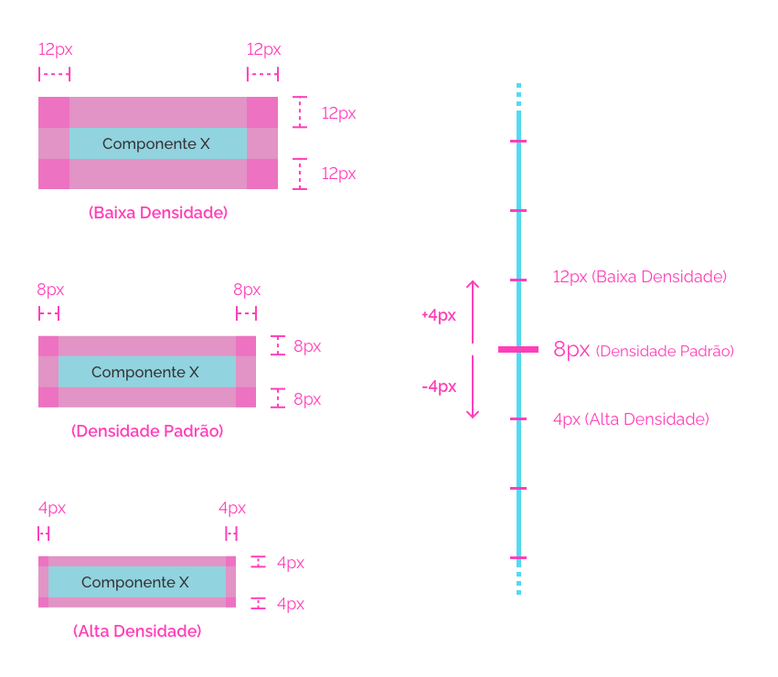
*No componente X foi definido o valor de `8px` para densidade padrão; também foi definido o incremento e decremento de `um nível` na escala de densidade, logo as densidades alta e baixa ficaram com `4px` e `12px` respectivamente;*

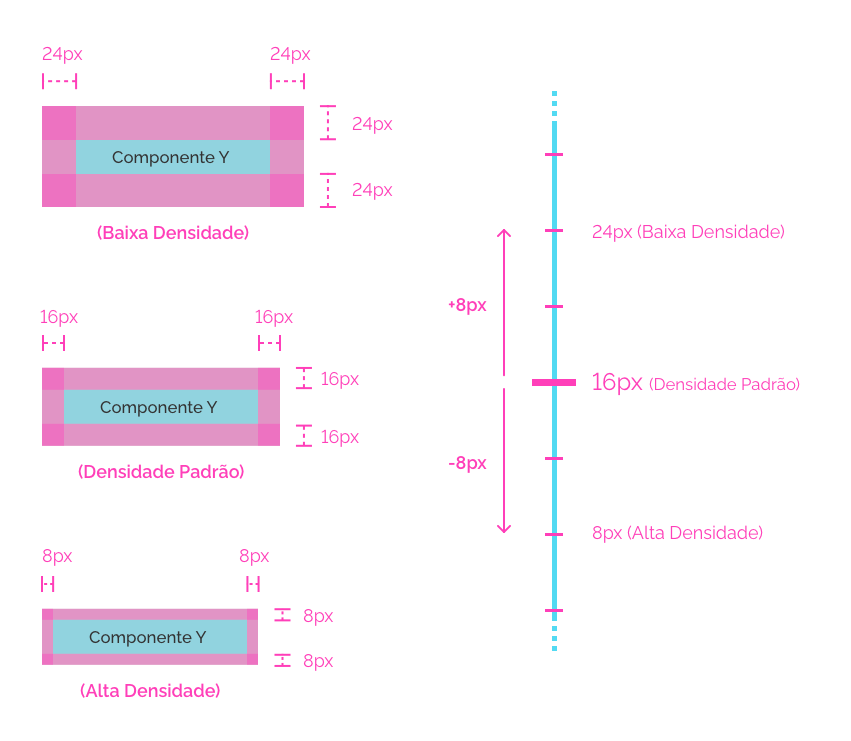
*No componente Y foi definido o valor de `16px` para densidade padrão; também foi definido o incremento e decremento de `dois níveis` na escala de densidade, logo as densidades alta e baixa ficaram com `8px` e `24px` respectivamente;*

#### Outros Tipos de Densidades

Geralmente os três tipos de densidades _(Padrão, Alta e Baixa)_ já atendem a maioria das necessidades no projeto de interface. Porém, além desses valores especificados, é possível definir outras densidades mais altas ou mais baixas, para atender casos extremos. Para isto, deve-se seguir os incrementos ou decrementos especificados na escala de forma a seguir o mesmo padrão e lógica, além de se observar as restrições de uso. 

### Restrições Mínimas

É importante salientar algumas restrições no que diz respeito a áreas mínimas de leitura e ação.

#### Área Mínima de Leitura

Para evitar o desconforto visual, e proporcionar melhor legibilidade, mantenha a densidade mínima de `4px` entre o conteúdo interno ao componente e os limites de superfície deste.  

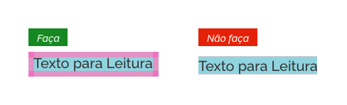
*Área Mínima de Densidade - Forma certa e errada*

#### Área Mínima de Ação

Em elementos interativos, existe uma necessidade de maior área de toque na superfície desses elementos. Portanto, mantenha uma densidade de no mínimo `24px` na superfície de elementos interativos que necessitam de interação através do cursor do _mouse_, e `40px` na superfície de elementos interativos que necessitam de interação através de toque/_touch_. Caso não seja possível manter os elementos nestas dimensões, mantenha a área mínima de ação ultrapassando suas dimensões. Observe abaixo.

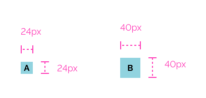
*A - Área Mínima de densidade em superfície para uso com cursor do mouse; B - Área Mínima de densidade em superfície para uso com toque/touch;*

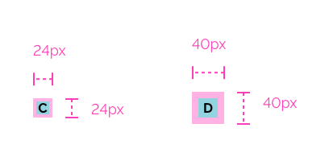
*C - Área de Ação ultrapassando as dimensões da superfície para uso com cursor do mouse; D - Área de Ação ultrapassando as dimensões da superfície para uso com toque/touch;*

---

## Melhores Práticas

- **Dimensões e espaçamentos apenas:** Não altere outras características do componente que não sejam relevantes para o ajuste da densidade;

- **Mantenha a consistência:** Mantenha os alinhamentos e diagramações internas ao componente em seu formato original, ao ajustar a densidade;

- **Mantenha a coerência:** Quando utilizar vários componentes semelhantes, próximos uns aos outros, mantenha o mesmo tipo de densidade neles, sempre que possível;

- **Mantenha o destaque:** Não aumente a densidade em componentes que pedem a atenção o usuário, como alertas ou mensagens que necessitam de destaque;

- **Não dificulte a experiência do usuário:** Evite utilizar densidade alta em elementos que necessitam de uma interação frequente ou de rápida leitura;

---

## Referências

- [Applying Density - Material Design](https://material.io/design/layout/applying-density.html)
