O *Padrão Collapse* compreende um modelo para exibir ou ocultar determinado conteúdo em tela, "empurrando" ou "puxando" os elementos adjacentes na interface.

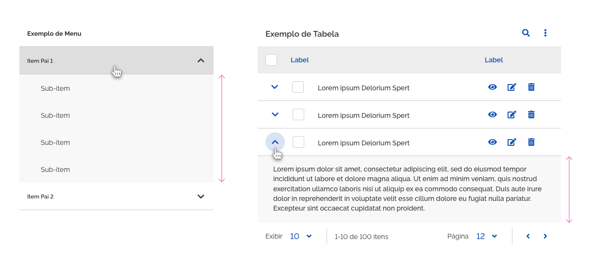
*Exemplos de Collapse*

Utilize o *Padrão Collapse* quando:

-   Houver necessidade de exibir/ocultar informações adicionais a respeito de um determinado tópico em tela;

-   Houver necessidade de economizar ou "enxugar" conteúdo na interface, exibindo apenas o que é relevante em um primeiro momento;

-   Houver necessidade de criar hierarquia de tópicos, estruturas de categorias e subcategorias, níveis e subníveis.

Quando não usar o *Padrão Collapse*:

-   Quando não houver espaço suficiente em tela para exibir um conteúdo expandido.

-   Quando o conteúdo for muito extenso a ponto de ocupar o espaço de uma tela inteira ou quase inteira. Neste caso, recomenda-se abrir este conteúdo em uma nova tela ou janela de visualização.  

-   Quando o conteúdo for muito curto (aproximadamente duas ou três palavras). Neste caso, recomenda-se utilizar o *Componente Tooltip*.

-   Quando o conteúdo exibido/ocultado for um conteúdo de extrema prioridade ou destaque. Neste caso, recomenda-se que conteúdos prioritários permaneçam sempre visíveis na tela.

---

## Anatomia

O *Padrão Collapse* é constituído por:

| ID  | Nome                               |                          Referência                           | Uso         |
| --- | ---------------------------------- | :-----------------------------------------------------------: | ----------- |
| 1   | Acionador de Expansão/Retração     |                              ---                              | Obrigatório |
| 2   | Identificador de Expansão/Retração | [Fundamento Iconografia](/ds/fundamentos-visuais/iconografia) | Obrigatório |
| 3   | Área/Conteúdo Expansível           |                              ---                              | Obrigatório |

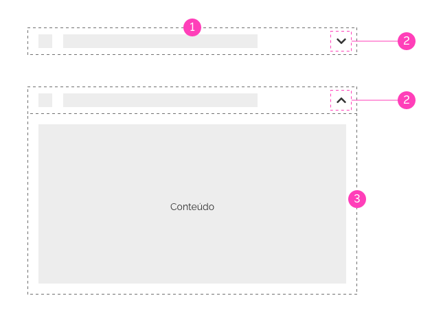
*Anatomia do Padrão Collapse*

---

### Detalhamento dos Itens

#### 1. Acionador de Expansão/Retração (Obrigatório)

O *Acionador de Expansão/Retração* é o elemento interativo responsável por exibir/ocultar a *Área/Conteúdo Expansível*. Este elemento pode ser uma área/superfície, um texto, link, botão, etc. Em resumo, poderá ser qualquer área ou elemento interativo.  Veja os exemplos abaixo:

-   A. Item de uma lista como Acionador;

-   B. Botão circular como Acionador;

-   C. Texto interativo como Acionador;

-   D. Linha de uma tabela como Acionador;

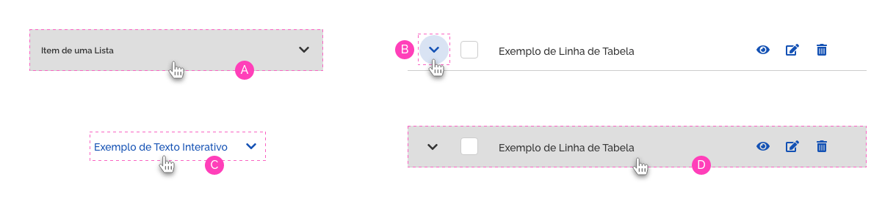
*Exemplos de Acionadores*

#### 2. Identificador de Expansão/Retração (Obrigatório)

O *Identificador de Expansão/Retração* é o elemento iconográfico que representa o estado, expandido ou retraído, da *Área/Conteúdo Expansível*.

##### Iconografia Padrão

Por padrão, deve-se utilizar a iconografia a seguir:

-   A. Chevron-Down;

-   B. Chevron-Up;

-   C. Chevron-Right;

-   D. Chevron-Left;

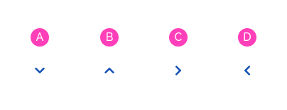
*Iconografia Padrão do Collapse*

**OBS:** As regras de utilização destes ícones estão descritas em *Comportamento > Tamanho e Direção da Área/Conteúdo Expansível > Direção*.

##### Outras Formas de Iconografia

Quando houver a necessidade de uma representação semântica mais forte ou mais coerente com a regra de negócio em cada projeto, pode-se utilizar outras formas de iconografia para representar o estado *Expandido/Retraído*. Desde que esta representação tenha um sentido de compreensão mais claro para o usuário no contexto em que se aplica. Por exemplo:

-   Neste caso, está sendo utilizado o ícone `bars` para identificar a expansão do Menu. Aqui o ícone `bars` possui uma semântica mais forte referente ao conteúdo que será expandido/retraído.

    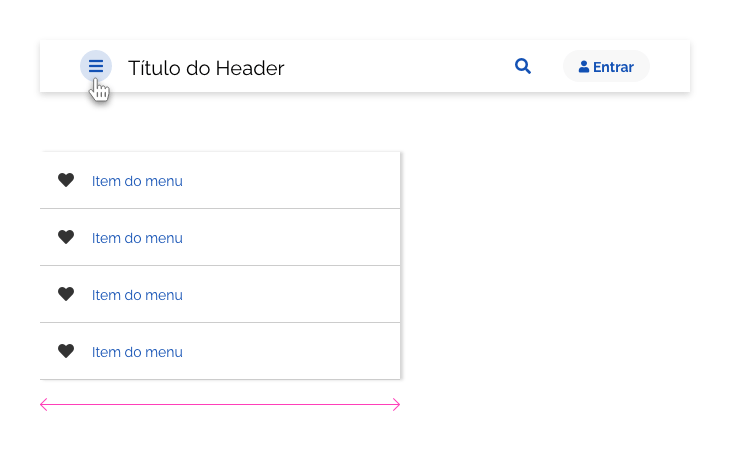
    *Exemplos de outras formas de Iconografia*

-   Aqui pode-se observar um exemplo da utilização do ícone `users`, que possui uma semântica mais forte referente ao conteúdo que será expandido.

    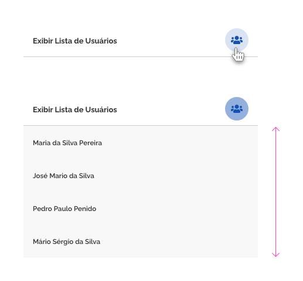
    *Exemplos de outras formas de Iconografia*

**OBS:** Neste caso, recomenda-se utilizar o mesmo ícone para os estados expandido e retraído, fazendo distinção apenas com o estado utilizado no momento do acionamento, ou seja, se o acionamento foi feito através de `mouseover`, o acionador deverá manter o estado `hover`, caso tenha sido acionado pelo `clique`, o acionador deverá manter o estado `pressed`. No exemplo acima, ao expandir a *Área/Conteúdo Expansível*, o acionador manteve o mesmo ícone e o estado `pressed`.

##### Posicionamento

Por padrão, o *Identificador de Expansão/Retração* deverá ser posicionado à direita do conteúdo ao qual faz referência, obedecendo a estrutura de diagramação do componente ao qual está inserido;

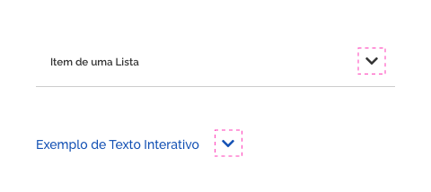
*Posição Padrão do Identificador de Expansão/Retração à direita*

###### Exceções

Em alguns casos excepcionais, o *Identificador de Expansão/Retração* deve se posicionar de outra forma. São situações específicas em cada componente, onde a posição dos ícones/botões de ação já estão determinadas ou quando sua localização à direita é inviável. Veja abaixo alguns exemplos de exceção.

-   1. No caso do *Header*, já existe um local definido para utilização do acionador, à esquerda do título. Nesta situação segue-se o padrão estabelecido no *Header*.

    
    *Identificador de Expansão/Retração posicionado à esquerda no Header*

-   2. No caso do *Button*, também já existe definido um local apropriado para utilização dos ícones, à esquerda do rótulo, ou centralizado no caso do *Button Circular*.

    
    *Exemplo do Identificador de Expansão/Retração no Button*

-   3. A linha da tabela é segmentada por colunas e conteúdos diferenciados. Nesta situação, o *Identificador de Expansão/Retração* torna-se mais evidente no início da linha da tabela. Sua utilização à direita fica comprometida, tendo em vista a possibilidade de outros botões funcionais nesta região.

    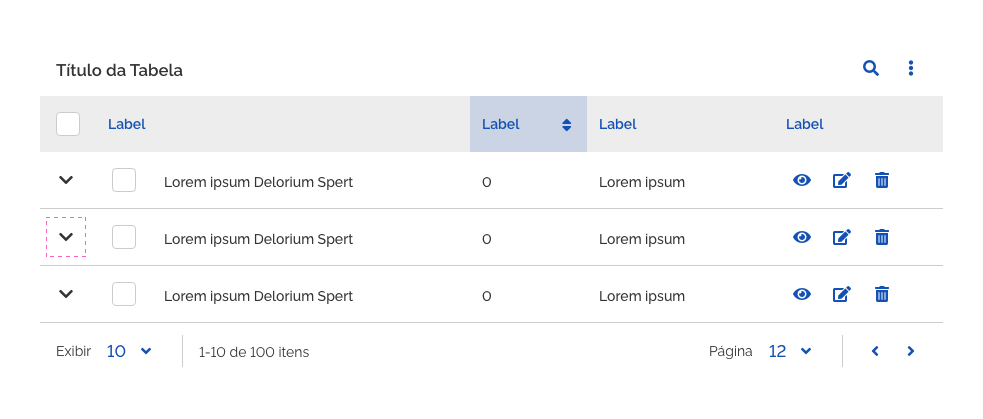
    *Identificador de Expansão/Retração posicionado à esquerda na linha da tabela*

#### 3. Área/Conteúdo Expansível (Obrigatório)

A *Área/Conteúdo Expansível* compreende o elemento que será exibido/ocultado e conterá um conteúdo que representa um adicional referente ao tópico exibido no *Acionador*.

-   A. Tópico de conteúdo exibido no *Acionador*;

-   B. *Área/Conteúdo Expansível* referente ao tópico exibido no *Acionador*.

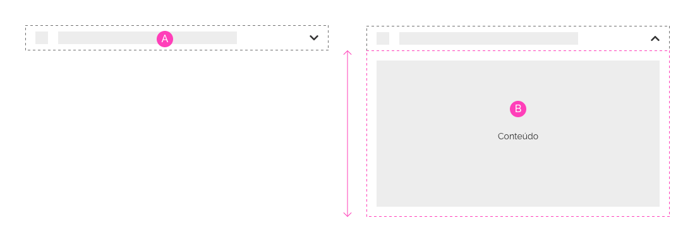
*Área/Conteúdo Expansível*

Recomenda-se que a *Área/Conteúdo Expansível* esteja posicionada próximo ao Acionador, deixando claro ao usuário que esta faz referência direta ao tópico de conteúdo exibido no acionador.

Este elemento poderá conter diversos tipos de conteúdo, como textos, imagens, elementos interativos, até mesmo pequenos blocos de formulários. Veja os exemplos abaixo:

-   A. Área/Conteúdo Expansível com texto;

-   B. Área/Conteúdo Expansível com formulário;

-   C. Área/Conteúdo Expansível com links interativos;

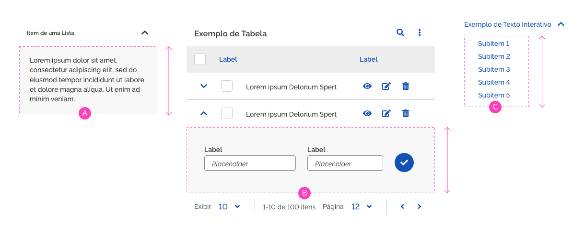
*Exemplos de Área/Conteúdo Expansível*

---

## Comportamentos

### 1. Área de Clique

A área de clique é a superfície onde o usuário irá interagir para realizar a ação de expandir/retrair, e esta deverá funcionar por toda superfície do *Acionador*.

-   A. Por padrão, o *Acionador* deve ser toda área de conteúdo de destaque, como demonstrado na figura, e esta deve conter o ícone identificador de expansão/retração (1).

-   B. O *Acionador* poderá ser utilizado apenas como um botão. Neste caso, a área de conteúdo em destaque não será clicável, e o ícone identificador de expansão/retração estará localizado no próprio botão (2).

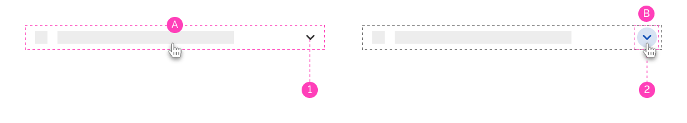
*Área de Clique*

### 2. Tamanho e Direção da Área/Conteúdo Expansível

#### Tamanho

A área/conteúdo expansível poderá ser dimensionada de duas formas:

-   A. Por padrão, a área/conteúdo expansível crescerá de acordo com seu conteúdo interno;

    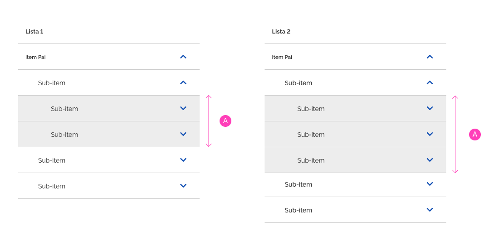
    *Área/Conteúdo Expansível cresce de acordo com o conteúdo*

-   B. Tendo em vista a necessidade de cada projeto, pode-se utilizar uma altura fixa para *Área/Conteúdo Expansível*. Esta altura poderá ser definida livremente, desde que a área do conteúdo interno tenha uma visualização razoável. Para esta situação, deve-se utilizar a Barra de Rolagem;

    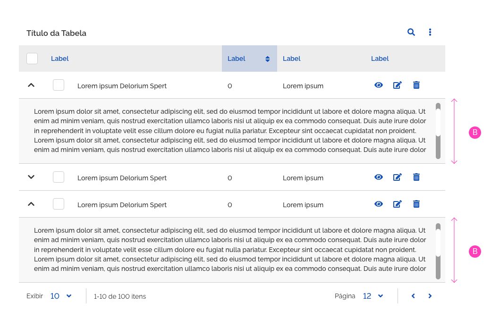
    *Área/Conteúdo Expansível com tamanho fixo e barra de rolagem*

**Atenção:** É importante observar as boas práticas na utilização de barras de rolagem. Deve-se evitar uma rolagem muito extensa dentro de uma área de visualização muito pequena.

#### Direção

A *Área/Conteúdo Expansível* poderá expandir/retrair para qualquer direção (direita, esquerda, superior e inferior), porém recomenda-se utilizar, por padrão, o sentido de leitura: da esquerda para direita ou de cima para baixo.

*A - Expandindo no sentido de leitura de cima para baixo*

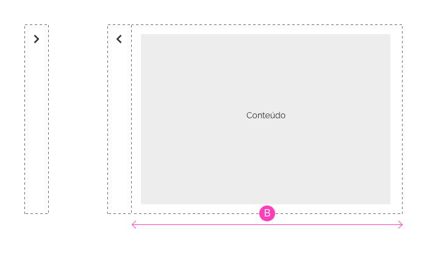
*B - Expandindo no sentido de leitura da esquerda para direita*

O *Identificador de Expansão/Retração* deverá obedecer o seguinte conceito: a seta deverá apontar sempre para a direção na qual o conteúdo será expandido ou retraído.

Ou seja:

-   A. Chevron-Down: utilize para exibir a *Área/Conteúdo Expansível* de cima para baixo;

-   B. Chevron-Up: utilize para ocultar a *Área/Conteúdo Expansível* de baixo para cima;

-   C. Chevron-Right: utilize para exibir a *Área/Conteúdo Expansível* da esquerda para direita;

-   D. Chevron-Left: utilize para ocultar a *Área/Conteúdo Expansível* da direita para esquerda.

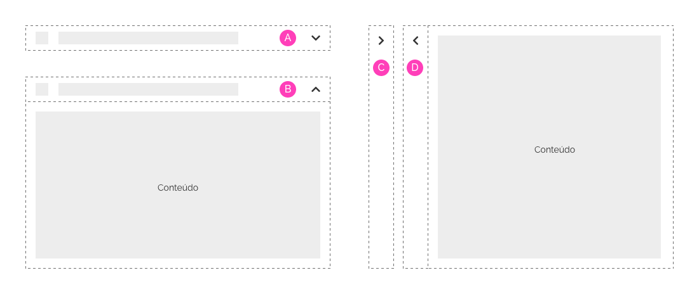
*Utilização da Iconografia - Direção das Setas*

### 3. Expansão/Retração e Conteúdo em Tela

O *Padrão Collapse* deverá funcionar com o posicionamento estático na tela, ou seja, a expansão/retração terá influência sobre os outros elementos na interface. Ao expandir um conteúdo em tela, os elementos adjacentes serão "empurrados" na direção em que o conteúdo foi expandido. Da mesma forma, quando um conteúdo é retraído, os elementos adjacentes são "puxados" de volta ao seu local de origem. Observe abaixo:

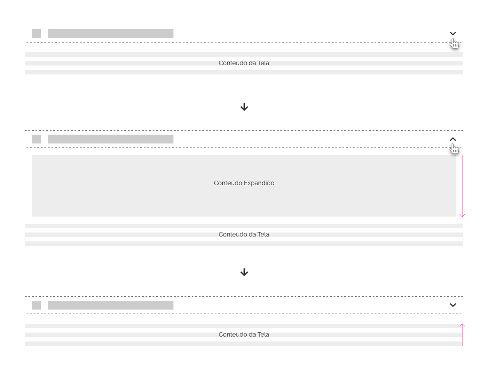
*Área/Conteúdo Expansível* "empurra ou puxa" o conteúdo em tela*

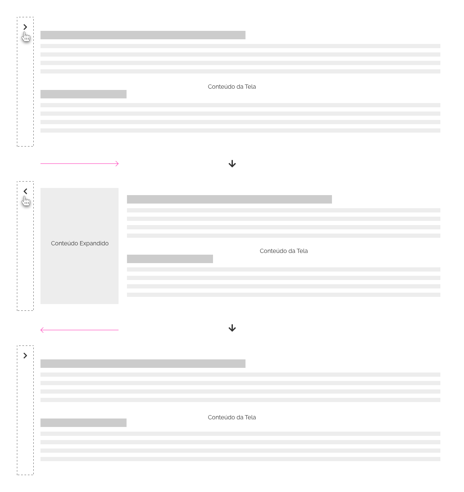
*Área/Conteúdo Expansível* "empurra ou puxa" o conteúdo em tela*

### 4. Estruturas Hierárquicas

O *Padrão Collapse* é muito útil para se construir estruturas hierárquicas, organizando níveis e subníveis ou categorias e subcategorias. Geralmente muito utilizado em *Menus*, *Listas* ou estruturas em árvore. Deve-se porém estar atento às boas práticas neste sentido. Observe abaixo algumas delas:

#### Indentação

Utilize indentação para tornar mais evidentes os blocos de níveis e subníveis.  

-   defina o valor do incremento com base na *Escala de Espaçamento - Layout*. Pode-se utilizar `2x`, `3x` ou `4x` o valor de incremento da escala, ou até mais;

-   quanto maior o valor de incremento escolhido, mais evidente torna-se a indentação;

-   o valor do incremento escolhido deve ser no mínimo, `2x` o valor do incremento da escala, ou seja, no mínimo `16px`. Um valor mais baixo torna a indentação muito sutil e não será útil para o propósito em questão;

-   o valor incrementado terá sempre como referência de início o item pai.

Observe o exemplo abaixo:

A. X = Duas vezes o valor do incremento da *Escala de Espaçamento Layout*;

B. Y = Três vezes o valor do incremento da *Escala de Espaçamento Layout*.

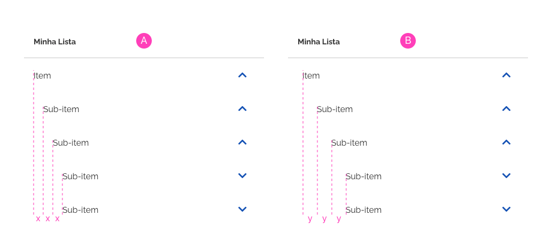
*Indentação em subníveis*

#### Pesos Tipográficos

 Utilize escala de pesos tipográficos *(Font-Weight)* diferenciados nos textos de tópicos em níveis e subníveis:

-   Como a ideia aqui é utilizar apenas variações de `bold`, evite utilizar outros estilos como `itálico`, `sublinhado`, etc.

-   As especificações de pesos podem variar de componente para componente, dependendo das restrições ou regras em cada um deles;

-   O uso deste recurso só é recomendado até dois ou três subníveis, pois além disto, torna-se inviável utilizar uma escala de pesos ao extremo (`Black` à `ExtraLight`), tanto por questões de limitação da escala, quanto por questões de estética;

Observe o exemplo abaixo:

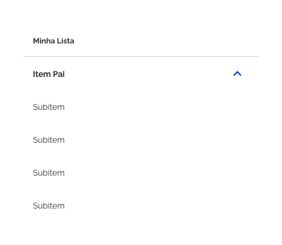
*Peso diferenciado em nível e subnível*

#### Escalas Tipográficas

Também pode-se utilizar a variação da escala de tamanhos tipográficos em níveis e subníveis.
  
-   É importante lembrar que deve-se utilizar este recurso em até dois ou três subníveis. A variação da escala tipográfica em seus extremos se torna inviável tanto por questões de legibilidade quanto por questões de espaço;

-   utilize a lógica crescente ou decrescente de tamanhos, porém mantenha a consistência padronizando esta lógica em seu projeto.

Observe o exemplo a seguir:

A - Lógica decrescente;
B - Lógica crescente.

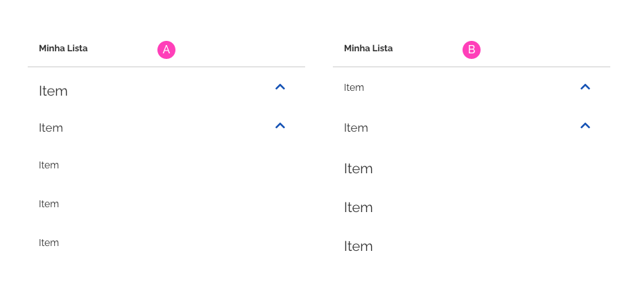
*Escala de Tamanhos Tipográficos em níveis e subníveis*

#### Background

 Outro recurso bem útil é utilizar cores diferenciadas em blocos de níveis e subníveis.

-   deve-se estar atento para utilização das cores dentro do padrão do Design System;

-   utilize gradações de uma única tonalidade. Se optar pelo cinza, use a gradação deste cinza;

-   utilize a lógica de gradação já existente em nosso padrão de cores do Design System, como por exemplo, a gradação de cinzas presente nos *tokens* `.color-secondary-xx`, ou as variações `-darken-xx` e `-lighten-xx`;

-   opte por cores neutras ou "sóbrias". Evite utilizar cores muito "vivas" ou "gritantes", mesmo existentes em nosso padrão de cores;

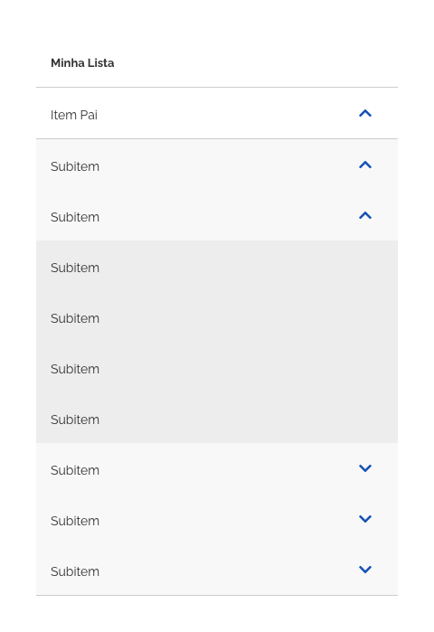
*Exemplo de gradação de cores em níveis e subníveis*

#### Recursos Combinados

Se a utilização de alguns dos recursos apresentados acima não for suficiente para tornar claro os blocos de níveis e subníveis, pode-se usar a combinação de mais de um deles. Fique atento às boas práticas e ao bom senso neste caso.

-   não é recomendado utilizar todos os recursos ao mesmo tempo, opte por dois ou três deles no máximo;

-   mantenha a consistência utilizando a mesma lógica de combinação em estruturas semelhantes;

Veja abaixo um exemplo de combinação:

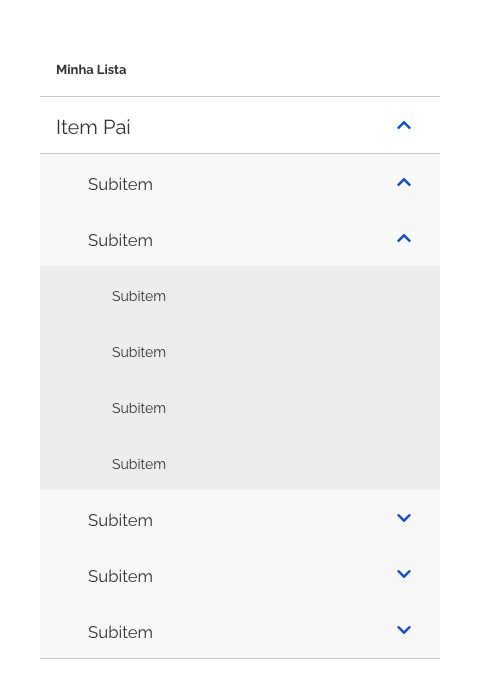
*Exemplo de recursos combinados - Indentação, Cores e Escala Tipográfica*

#### Navegação

-   Evite utilizar estruturas muito extensas, com muitos subníveis dentro de subníveis. Esta prática torna a navegação complexa e confusa ao usuário;

-   Em vez de utilizar estruturas hierárquicas muito extensas, opte por utilizar outras formas de organizar a informação, como link para outra página ou janela.

    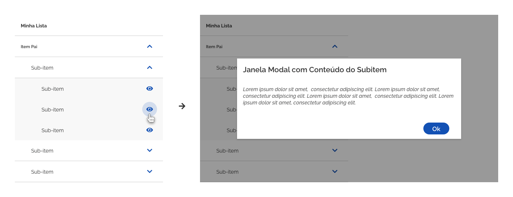
    *Exemplo de link no último subitem para uma janela modal*

-   Em estruturas de árvore, utilize o identificador ao lado esquerdo do texto/rótulo, pois é o local padronizado para este tipo de estrutura. Evite utilizar outros tipos de ícone, pois podem confundir o usuário, além de poluir a estrutura em árvore.

    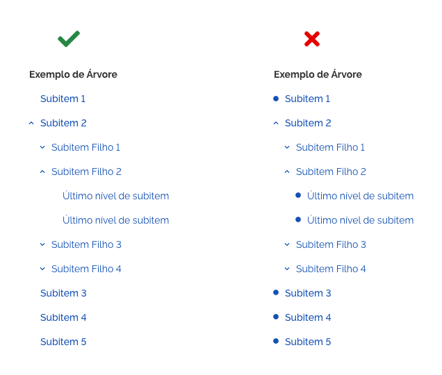
    *Exemplo de Árvore - Como usar os ícones*

### 5. Combinando Múltiplos Elementos *Collapse*

Podem haver situações onde elementos *Collapse* sejam utilizados juntamente com outros em um mesmo componente ou agrupamento, como é o caso do *List*, *Menu*, *Table*, etc. Neste caso, estes elementos podem se comportar de duas formas, a depender da regra de negócio em cada projeto ou da necessidade na usabilidade.

#### Expandindo Apenas um Elemento por vez

Neste caso, apenas um elemento será exibido por vez. Ao expandir cada bloco de informação, os outros blocos que fazem parte do mesmo grupo serão ocultados, exibindo apenas o conteúdo que foi clicado.

Utilize este modelo quando a intenção for focalizar a atenção do usuário para a informação que está sendo exibida;

Veja o exemplo abaixo:

-   A. O usuário expande o elemento desejado;

-   B. Ao clicar em outro elemento, os demais serão ocultados, exibindo apenas o conteúdo do elemento clicado.

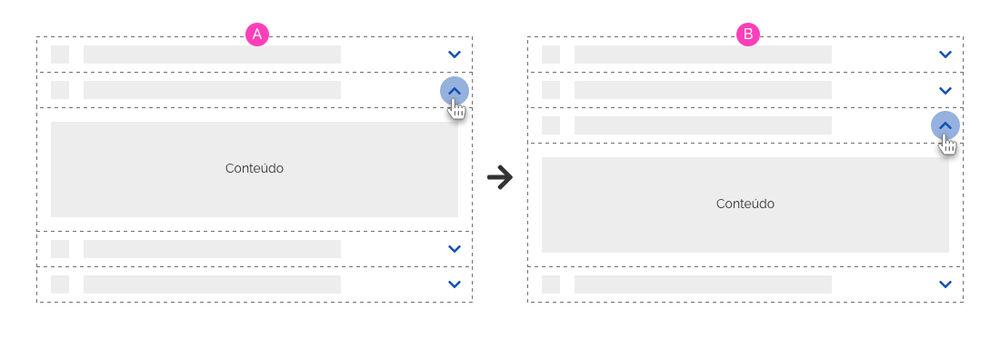
*Expandindo Um Elemento Por Vez*

#### Expandindo Vários Elementos

Neste situação, o usuário poderá expandir vários elementos e fechá-los quando quiser.

Utilize este modelo quando houver necessidade do usuário consultar ou comparar informações presentes em vários blocos expandidos.

Observe o exemplo abaixo:

-   A. O usuário expande o elemento desejado;

-   B. Ao clicar em outro elemento, o conteúdo deste também será exibido, não interferindo nos demais elementos.

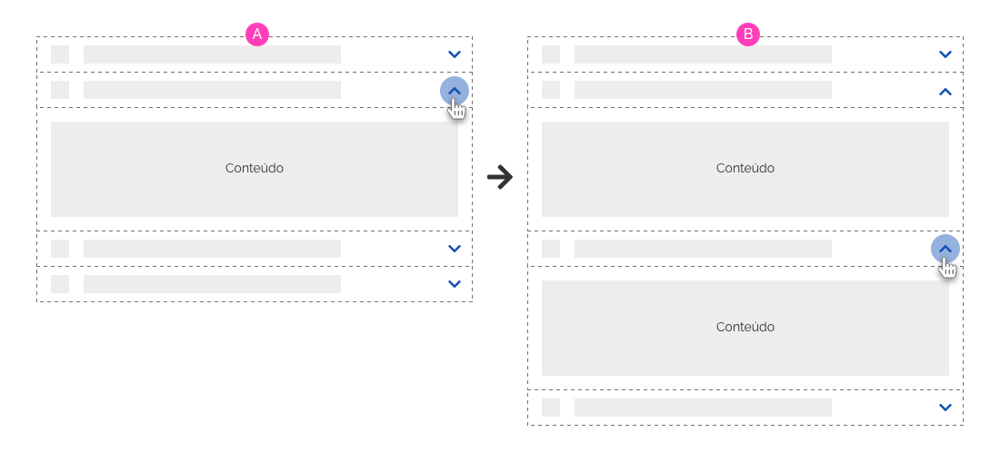
*Expandindo Vários Elementos*

---

## Especificações

### Iconografia

| Name                                | Estado | Ícone                                | Size               | Class (Font Awesome) |
| ----------------------------------- | ------ | ------------------------------------ | ------------------ | -------------------- |
| Ícone Exibir Conteúdo (Vertical)    | --     | <i class="fas fa-chevron-down"></i>  | `--icon-size-base` | `.fa-chevron-down`   |
| Ícone Ocultar Conteúdo (Vertical)   | --     | <i class="fas fa-chevron-up"></i>    | `--icon-size-base` | `.fa-chevron-up`     |
| Ícone Exibir Conteúdo (Horizontal)  | --     | <i class="fas fa-chevron-right"></i> | `--icon-size-base` | `.fa-chevron-right`  |
| Ícone Ocultar Conteúdo (Horizontal) | --     | <i class="fas fa-chevron-left"></i>  | `--icon-size-base` | `.fa-chevron-left`   |
