São situações que ocorrem dentro de uma aplicação nas quais não há dados a serem exibidos para o usuário. Geralmente são visualizados quando um usuário interage pela primeira vez no sistema, quando os dados foram excluídos ou simplesmente esses dados não estão mais disponíveis.

*Empty States* quase sempre são tratados como uma inclusão tardia no projeto de interface, porém esta é uma visão errônea sobre o tema. Quando são projetados de forma cuidadosa desde o início do projeto, oferecem uma experiência de usabilidade clara e amigável ao usuário.

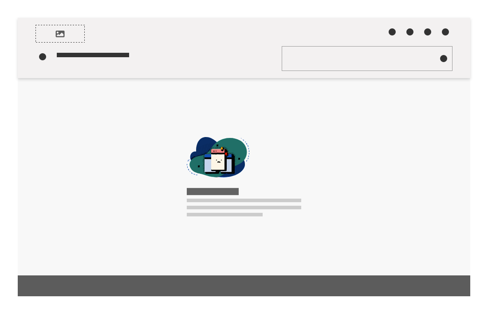
*Exemplo de Empty State*

Utilize *Empty States* para:

-   Informar e orientar o usuário durante uma situação de ausência de dados inesperada dentro do sistema ou aplicativo;

-   Tornar claro para o usuário o que exatamente está ocorrendo e como contornar este problema;

-   Reforçar uma boa impressão sobre seu produto: empty states oferecem uma imagem mais humana e amigável da interface, fortalecendo a empatia e melhorando o aprendizado do usuário.

 ---

## Anatomia

A anatomia do padrão *Empty States* é composta pelos seguintes elementos:

| ID  | Nome                  |                         Referência                          | Uso         |
| --- | --------------------- | :---------------------------------------------------------: | ----------- |
| 1   | Imagem                |                             ---                             | Opcional    |
| 2   | Título                | [Fundamento Tipografia](/ds/fundamentos-visuais/tipografia) | Obrigatório |
| 3   | Corpo da Mensagem     | [Fundamento Tipografia](/ds/fundamentos-visuais/tipografia) | Obrigatório |
| 4   | Elementos Interativos |   [Componente Button](/ds/components/button?tab=designer)   | Opcional    |

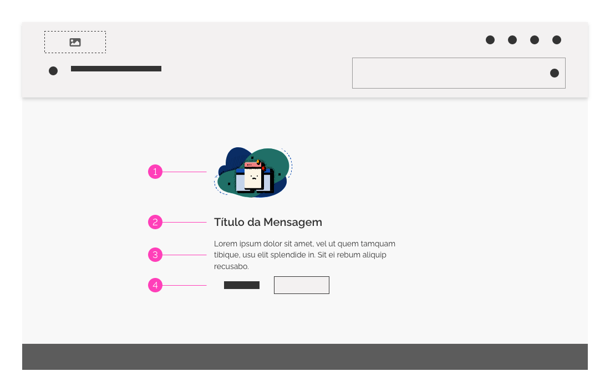
*Anatomia do Empty State*

---

## Detalhamento dos Itens

### 1. Imagem (Opcional)

Pode ser uma foto ou ilustração que represente semanticamente o contexto da situação apresentada em tela. É uma forma de comunicação visual usada para reforçar a empatia e aprendizado pelo usuário no contexto da informação.

### 2. Título (Obrigatório)

É uma declaração curta e objetiva usada para resumir a mensagem. É importante utilizá-lo sempre de forma positiva. Por exemplo, em vez de *"Você não tem dados ativos"*, pode-se usar *"Insira ativos de dados para visualizar"*.

### 3. Corpo da Mensagem (Obrigatório)

É uma breve explanação sobre o contexto. Deve ser descrito de forma clara e direta, sugerindo ao usuário qual ação deve ser tomada para contornar a situação.

### 4. Elementos Interativos (Opcional)

Nesta área utiliza-se elementos interativos, como *Buttons* ou *Hiperlinks*. Estes devem ser usados quando houver a possibilidade de uma tomada de ação imediata pelo usuário. Caso haja a necessidade de mais de uma tomada de ação, utilize o *Button (Ênfase Secundária)* para ação principal e, para uma ação menos prioritária, utilize um *hiperlink*, por exemplo, para visualizar um detalhamento ou consultar alguma documentação. Posicione estes elementos logo abaixo do *Corpo da Mensagem*.

---

## Tipos Comuns de *Empty States* e como Usá-los

 *Empty States* ocorrem por diversos motivos diferenciados e devem ser tratados de forma específica em cada uma destas situações. A seguir pode-se observar alguns tipos de abordagens para *Empty States* e como elas podem atender às necessidades dos usuários em cada situação.

### 1. Ausência de Dados

É o tipo mais básico e comum de *Empty State*. Deve informar ao usuário que tipo de dado estará disponível na tela ou elemento quando os dados forem inseridos. Também deve orientar o usuário a respeito do próximo passo caso o usuário queira preencher o espaço vazio.

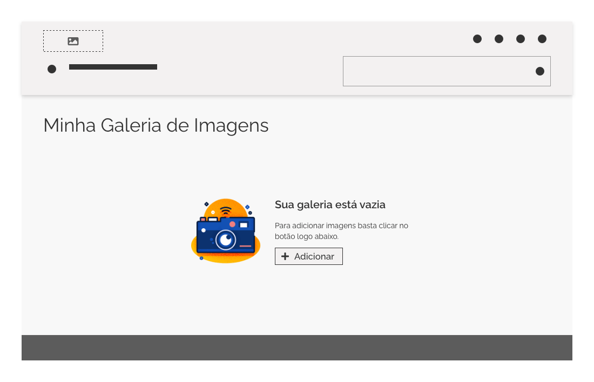
*Exemplo de Ausência de Dados em Galeria de Imagens*

| Como Ocorre                                                                                             | Objetivo                                                                                                                                                                   | Quando Usar                                                                              |
| ------------------------------------------------------------------------------------------------------- | -------------------------------------------------------------------------------------------------------------------------------------------------------------------------- | ---------------------------------------------------------------------------------------- |
| Durante a primeira utilização do sistema pelo usuário, quando ainda não existem dados a serem exibidos. | O usuário deve entender que os dados estarão disponíveis na tela quando forem inseridos por ele ou outrem. A mensagem deve orientar o usuário quanto a inserção dos dados. | Em situações mais simples ou com prioridade secundária onde são requeridos poucos dados. |

### 2. Ausência de Dados por Ação do Usuário

Este tipo é exibido em decorrência de uma interação do usuário no sistema, como uma mensagem informando que não há dados de pesquisa. Ofereça uma informação clara sobre o ocorrido e oriente a respeito das seguintes etapas, como configuração de parâmetros ou filtros de pesquisa para realização de uma nova busca. Opções para "Limpar Filtros" ou "Consultar Documentação" podem ser oferecidas ao usuário.

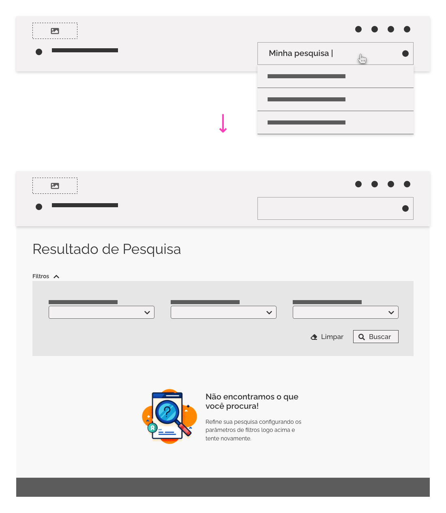
*Ausência de Dados por Ação do Usuário em uma Pesquisa*

Este modelo também é usado em casos onde não seja possível exibir próximas etapas.

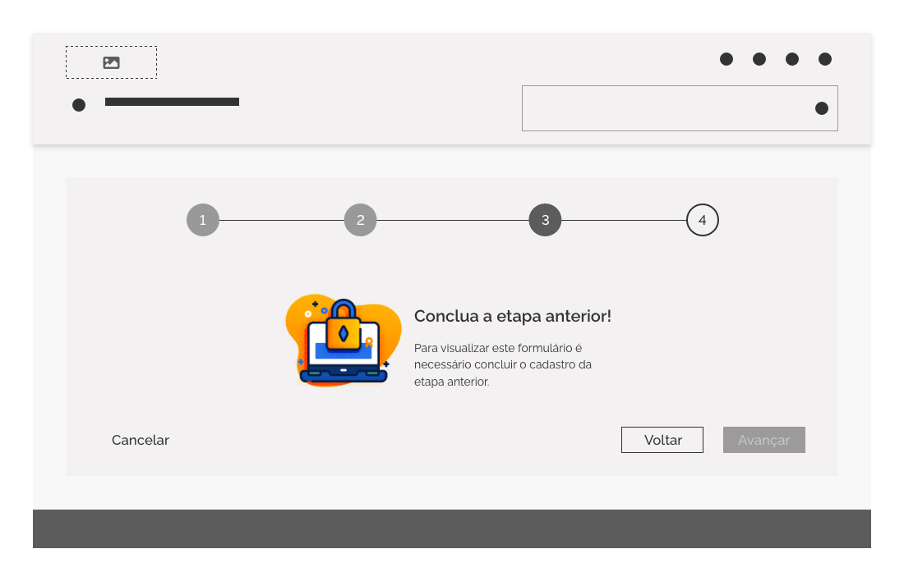
*Ausência de Dados por Ação do Usuário em Próximas Etapas*

| Como Ocorre                                                                                                                                           | Objetivo                                                                                                                                                                            | Quando Usar                                                                            |
| ----------------------------------------------------------------------------------------------------------------------------------------------------- | ----------------------------------------------------------------------------------------------------------------------------------------------------------------------------------- | -------------------------------------------------------------------------------------- |
| Durante um feedback do sistema com base em alguma ação do usuário. Como um resultado de pesquisa vazio ou confirmação na conclusão de algum processo. | O usuário deve entender que poderá configurar os parâmetros ou filtros de pesquisa para visualizar a informação desejada. Ou deve entender que concluiu com sucesso algum processo. | Quando houver a necessidade de fornecer feedback ao usuário com base em sua interação. |

### 3. Gerenciamento de Erros em *Empty States*

Nesta situação os dados não são exibidos por causa da inexistência deles, mas por algum impedimento específico. Este tipo de *Empty State* requer uma comunicação com maior especificidade e detalhamento do problema para que o usuário seja capaz de resolvê-lo.

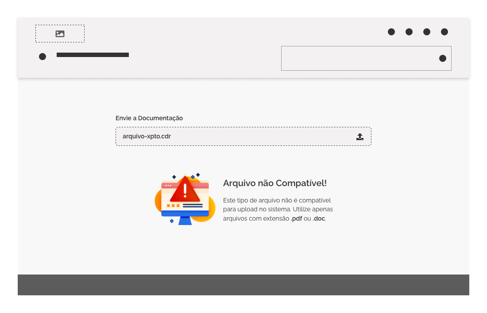
*Gerenciamento de Erros em Empty States - O usuário tenta realizar upload de um arquivo não compatível. A mensagem de Empty State ocorre no local onde deveria aparecer o dado do arquivo enviado.*

| Como Ocorre                                                                                                          | Objetivo                                                                                                                                                 | Quando Usar                                                                                                       |
| -------------------------------------------------------------------------------------------------------------------- | -------------------------------------------------------------------------------------------------------------------------------------------------------- | ----------------------------------------------------------------------------------------------------------------- |
| Em casos de ausência de configuração necessária,  erros no sistema ou problemas relacionados a permissão do usuário. | O usuário deve entender qual tipo de problema ocorreu e caso haja necessidade de tomada de ação corretiva, o usuário deve ser orientado sobre como agir. | Quando algo deu errado durante o fluxo de jornada do usuário ou quando algum tipo de intervenção deve ser tomada. |

Abaixo pode-se observar alguns dos erros mais comuns e como tratá-los:

|      Tipo de Erro       |                Explique a ausência dos dados                 | Explique ao usuário o que fazer                                                        |
| :---------------------: | :----------------------------------------------------------: | -------------------------------------------------------------------------------------- |
|   Problema no Sistema   | *"Problema XPTO está impedindo que os dados sejam exibidos"* | Oriente sobre as etapas necessárias para contornar o problema                          |
|   Ação não suportada    |          *"O arquivo não é compatível para upload"*          | Deixe claro ao usuário quais tipos de arquivos são suportados                          |
|  Problema de Permissão  |   *"O usuário não tem permissão para visualizar os dados"*   | Oriente sobre as etapas necessárias para solicitar o acesso                            |
| Configuração Necessária |   *"Configure os parâmetros XYZ para visualizar os dados"*   | Forneça ao usuário uma explicação pontual sobre como iniciar a configuração necessária |

*As mensagens descritas acima são apenas exemplificativas.*

#### *Empty States* x Templates de Erro

É importante salientar que existem tipos de erros que possuem uma origem além da aplicação, como por exemplo,  erros provenientes do protocolo *HTTP* *(404, 403, 408, 500 ... entre outros)*. Para este tipo de erro deve-se seguir os padrões especificados na documentação [Template de Erro](/ds/templates/erro?tab=designer).

---

## Onde Usar *Empty States*

Para garantir a coerência e boa usabilidade, os *Empty States* devem ser exibidos na mesma localidade onde deveriam ser apresentados os dados contextuais ausentes. Isto pode ocorrer em qualquer espaço de sua interface gráfica, desde uma página inteira, painéis laterais, tabela de dados, cards ou painéis.

Deve-se estar atento para usar a melhor abordagem de layout em cada uma dessas situações. Sendo assim, observe algumas orientações e boas práticas de utilização em espaços amplos ou pequenos.

### 1. Utilizando *Empty States* em Espaços Pequenos

#### Alinhamento em Espaços Pequenos

Por padrão todos os elementos do *Empty State* devem ser alinhados à esquerda dentro do espaço onde são exibidos. Caso o espaço seja bastante pequeno, utilize apenas a  ilustração centralizada, enquanto que o conteúdo textual permanece à esquerda. Desta forma, a imagem centralizada chama a atenção do usuário, evitando confundir a ideia de *Empty State* com o conteúdo real. Observe os exemplos abaixo.

*Exemplos de alinhamento de Empty States em espaços reduzidos. Imagem centralizada ou alinhada à esquerda.*

#### Uso da Ilustração em Espaços Pequenos

##### Tamanho e Proporção

Fique atento à utilização do tamanho de sua imagem. Esta deverá seguir um tamanho proporcional adequado dentro do espaço de exibição do *Empty State*. Porém, não exagere com dimensões muito grandes, a imagem deve ser proporcional tanto ao espaço quanto ao conteúdo textual exibido.

*Exemplo de Tamanho das Ilustrações (Certo e Errado)*

##### Apenas Texto

Se o espaço de exibição do *Empty State* for bastante reduzido, utilize apenas a informação textual. Desta forma evita-se problemas relacionados à legibilidade ou responsividade.

*Exemplo de Empty States em espaços muito reduzidos (Certo e Errado)*

##### Semântica

Também é importante observar a semântica utilizada na imagem. Relacione uma imagem coerente que esteja fortemente relacionada com a mensagem textual.

*Semântica em Ilustrações (Certo e Errado)*

#### Usando Vários *Empty States*

Em algumas situações pode haver a necessidade de se utilizar vários *Empty States* na mesma tela. Geralmente isto ocorre em telas de *Dashboard* ou com bastantes painéis de informação. Quando isto acontecer evite poluir a tela com diversas ilustrações muito coloridas ou excesso de botões de ação primária ou secundária. Em vez disso, use imagens sóbrias com tons discretos ou utilize apenas textos. Também pode-se utilizar botões de ação terciária ou links.

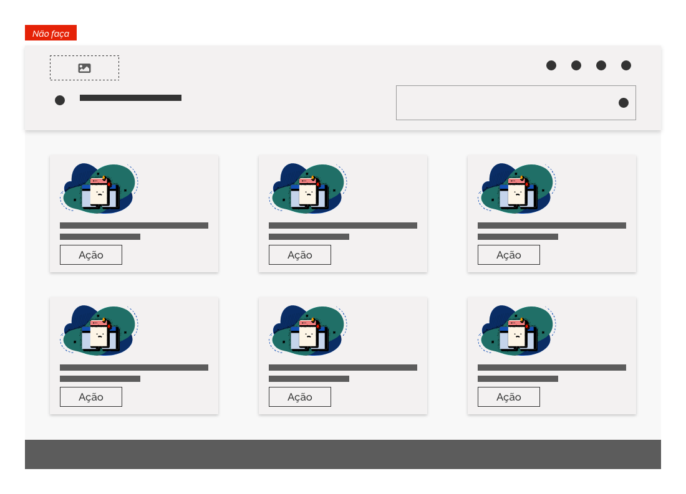
*Utilizando Vários Empty States - Forma Errada*

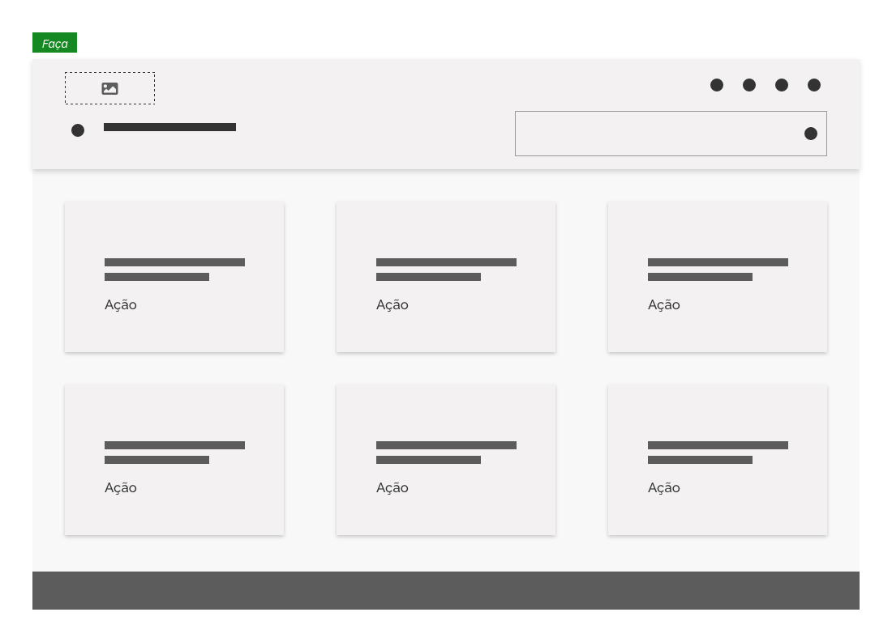
*Utilizando Vários Empty States - Forma Correta*

### 2. Utilizando *Empty States* em Espaços Amplos

#### Alinhamento em Espaços Amplos

Com espaço de exibição maior, a informação de *Empty State* deve chamar a atenção do usuário na tela. Para isto, utilize uma margem lateral maior ou bloco centralizado na horizontal, assim como alinhamento vertical na tela.

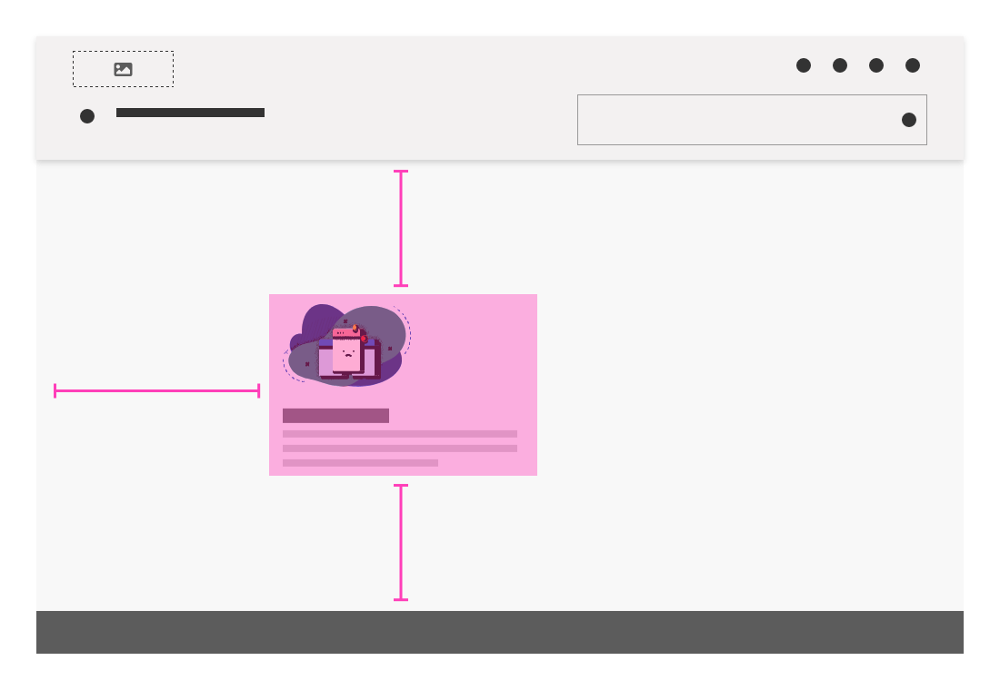
*Alinhamento do Empty State - Margem lateral maior*

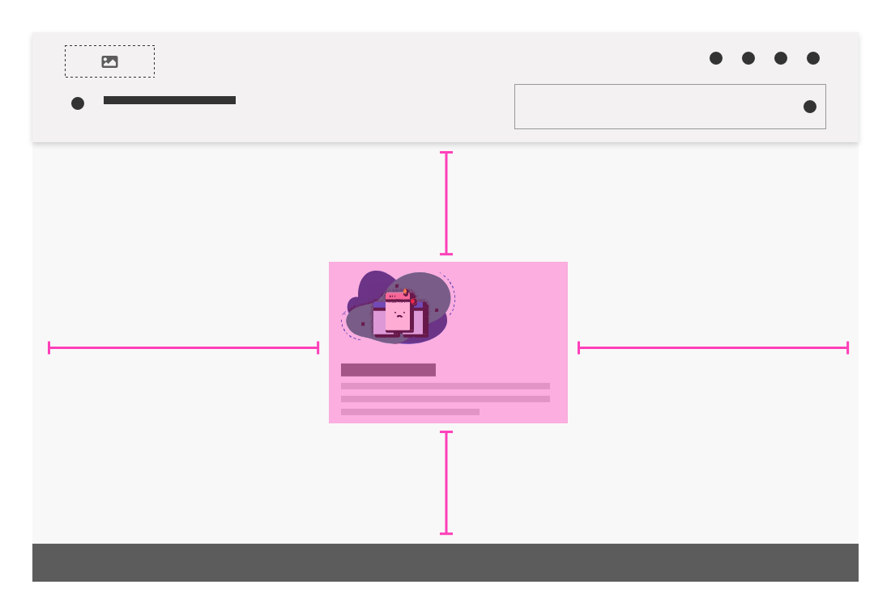
*Alinhamento do Empty State - Bloco Centralizado*

##### Posicionamento e Conteúdo

Use *Empty States* substituindo os elementos que deveriam aparecer. Por exemplo, *Empty States* de uma tabela deve substituir toda sua estrutura, Cabeçalho, Rodapé, Linhas e Colunas. Desta forma evita-se que o usuário perca tempo lendo alguma informação irrelevante.

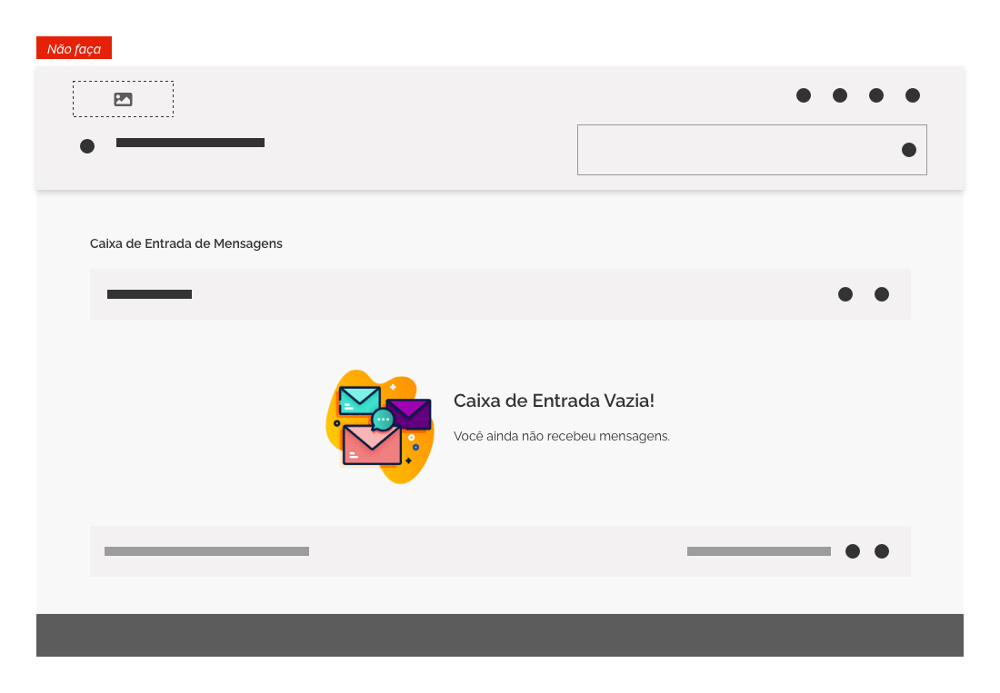
*Exemplo de Empty State em Tabelas - Forma Errada - Exibe conteúdo irrelevante*

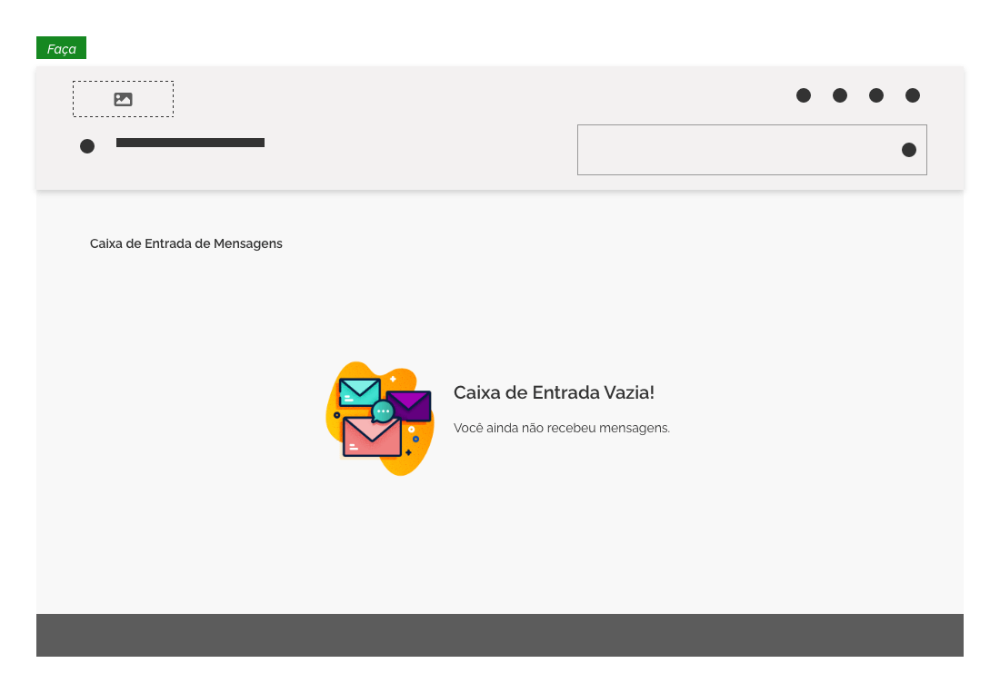
*Exemplo de Empty State em Tabelas - Forma Correta - Oculta conteúdo irrelevante*

#### Uso da Ilustração em Espaços Amplos

Aqui segue-se as mesmas regras e orientações descritas em espaços menores:

-   Utilize imagens relacionadas ao conteúdo;

-   Mantenha a proporção entre ilustração, espaço e conteúdo;

##### Arranjos Diferenciados

Com espaços mais amplos, existe maior flexibilidade para composição de um layout em *Empty States*. Utilize arranjos diferenciados entre imagem e texto da seguinte forma:

-   Para imagens horizontais ou amplas, posicione-as acima do texto;

-   Para imagens verticais é mais adequado mantê-las à esquerda do bloco textual.

*Imagens amplas ou horizontais acima do texto e imagens menores ou verticais à esquerda do texto.*

##### Acessibilidade nas Ilustrações

As ilustrações utilizadas em *Empty States* devem possuir o objetivo meramente decorativo, tendo em vista que podem ser despercebidas por indivíduos com necessidades especiais ou programas leitores de tela. Portanto evite incluir conteúdo visual informativo neste tipo de ilustração. Toda informação importante para o usuário deve estar contida no *Título* e *Corpo da Mensagem*.

A *WCAG* orienta:

-   Utilize a tag `alt=""` (vazia) em imagens decorativas;

-   Evite utilizar a tag `role="presentation"` para imagens decorativas, pois ainda é um atributo pouco reconhecido pelos principais navegadores do mercado;

---

## Melhores Práticas

**1. Orientações Gerais:**

-   **Seja claro e direto:** Mantenha uma relação clara entre a situação que esta ocorrendo e o conteúdo apresentado ao usuário;

-   **Evite conteúdos extensos:** Muito conteúdo não é necessariamente a melhor solução. Essa prática implica em maior tempo de leitura e aprendizado pelo usuário. A informação deve ser absorvida de forma rápida pelo leitor.

-   **Eduque os usuários:** *Empty States* são uma ótima oportunidade para ensinar seus usuários a utilizarem seu produto. Utilize a mensagem para orientar tomadas de decisão do usuário, não apenas para informá-lo sobre o ocorrido;

-   **Mantenha a consistência:** Situações semelhantes em *Empty States* devem possuir o mesmo padrão na ilustração e informação textual;

-   **Agrade o usuário:** Fortaleça um laço de empatia com seu público-alvo e reforce uma boa impressão sobre seu produto, utilizando uma comunicação humana e amigável nas ilustrações e mensagens textuais.

**2. Melhores Práticas em Ausência de Dados:**

-   Utilize este tipo em situações simples ou em recursos menos prioritários, quando a quantidade de informação a ser exibida for pequena;

-   Não use termos técnicos ou desconhecidos pelo usuário;

-   Use poucas palavras para que o usuário entenda e atue de forma rápida;

-   Ofereça opções de soluções ao usuário. Evite deixá-lo num beco sem saída.

-   Caso haja ação a ser tomada pelo usuário, inclua um botão ou link para tal e oriente o usuário sobre o que fazer;

-   Não induza o usuário a resolver vários problemas. Oriente sobre o ponto mais importante a ser resolvido;

-   Seja claro sobre qual tipo de dado será exibido quando a informação for inserida;

-   Seja contextual. Não relacione conteúdos de outras áreas da aplicação;

**3. Melhores Práticas em Gerenciamento de Erros:**

-   Se houver ações corretivas oriente sobre como executá-las e inclua um link ou botão para acioná-las;

-   Use linguajar claro e conciso;

-   Evite linguagem petulante, respeite o usuário;

-   Seja contextual. Evite usar conteúdo relacionados a outras situações;

-   Utilize ilustrações adequadas ao contexto do erro;

-   Ofereça opções de soluções ao usuário;

-   Caso haja várias etapas a seguir, conduza o usuário à etapa inicial.

---

## Referências

-   [Empty States Patterns - Carbon Design System](https://www.carbondesignsystem.com/patterns/empty-states-pattern)

-   [Empty States: Interfaces Cheias de Oportunidades](https://brasil.uxdesign.cc/empty-states-interfaces-cheias-de-oportunidades-a1ed4f6e5a8a)
