[version]: # (2.0.1)

Consiste em um padrão para guiar o usuário durante um tutorial, apresentação ou processo de aprendizado simples.

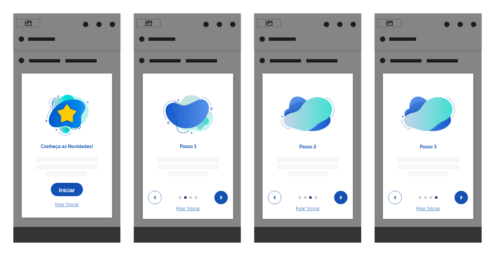
*Exemplo de Onboarding*

Utilize o *Onboarding* quando:

-   precisar demonstrar para usuários novatos, aspectos de uso em interfaces;

-   precisar apresentar novidades ou pequenas atualizações em seu produto;

-   precisar guiar o usuário em pequenos tutoriais;

-   precisar oferecer pequenas demonstrações como tópico de ajuda.

 Não utilize o *Onboarding*:

-   para fins de envio de formulários ou funcionalidades inerentes às regras de negócio do produto;

-   em fluxos muito longos ou complexos. Neste caso, elabore um conteúdo de ajuda mais completo e disponibilize na seção de ajuda;

---

## Tom e Voz

Dependendo do contexto e conteúdo a ser demonstrado, o tom e voz pode variar bastante em sua proposta. Como exemplo, pode-se utilizar o tom e voz:

-   adequado ao ensino;

-   adequado ao marketing ou publicidade;

-   ou técnico

---

## Anatomia

O *Onboarding* é constituído por:

| ID  | Nome                  |                                  Referência                                   | Uso         |
| --- | --------------------- | :---------------------------------------------------------------------------: | ----------- |
| 1   | Componente *Tooltip*  |  [Componente Tooltip](https://www.gov.br/ds/components/tooltip?tab=designer)  | Obrigatório |
| 2   | Componente *Carousel* | [Componente Carousel](https://www.gov.br/ds/components/carousel?tab=designer) | Obrigatório |
| 2   | Superfície *Overlay*  | [Fundamento Superfície](https://www.gov.br/ds/fundamentos-visuais/superficie) | Obrigatório |

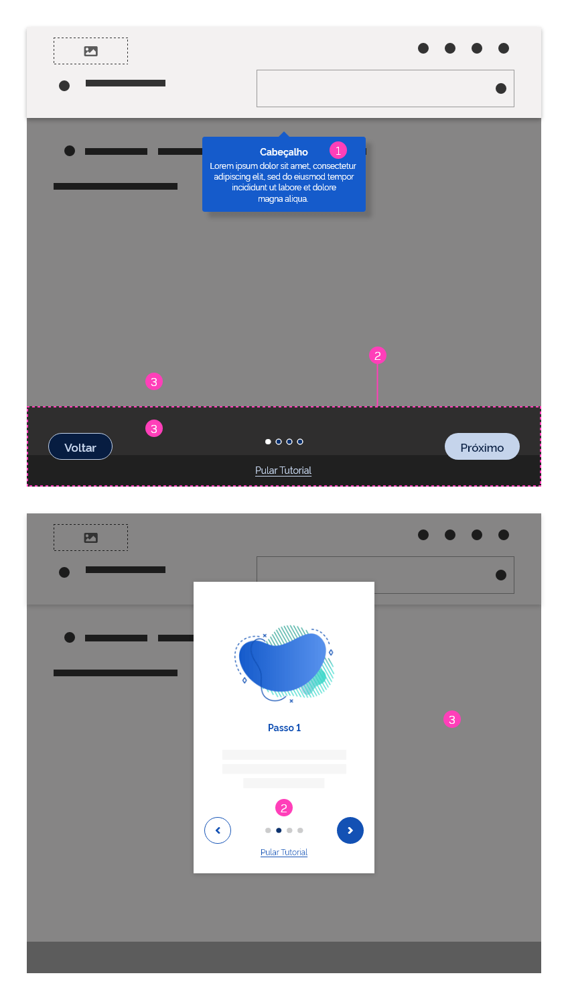
*Anatomia do Onboarding*

---

### Detalhamento dos Itens

#### 1. Componente *Tooltip* (Obrigatório)

O componente *Tooltip* é utilizado especificamente no tipo de *Onboarding* com ênfase na interface. O objetivo dele é exibir informações referentes aos elementos da interface que são apresentados durante o tutorial.

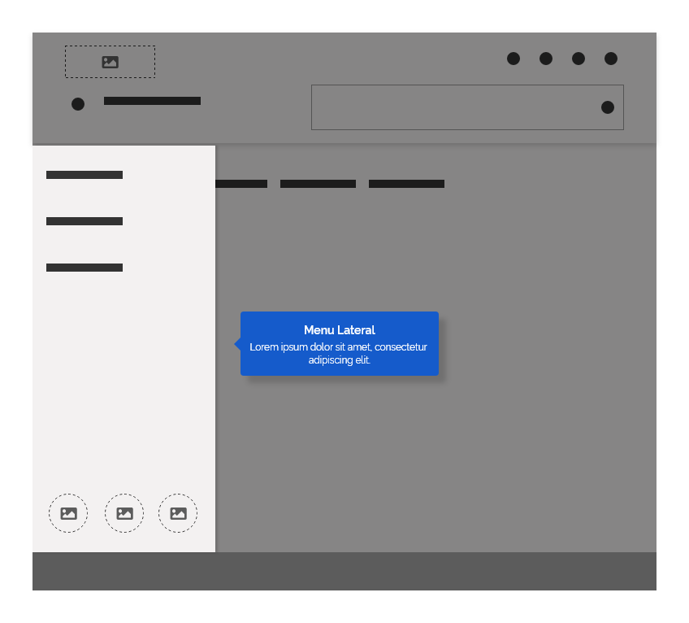
*Utilize o Tooltip para exibir informações em pontos de destaque na interface*

#### 2. Componente *Carousel* (Obrigatório)

O componente *Carousel* servirá como elemento básico para o controle do *Onboarding*. Através dele o usuário poderá avançar ou retroceder na navegação, pular etapas e visualizar a progressão nas etapas. O *Carousel* poderá ser customizado para atender as necessidades no *Onboarding*. Veja abaixo o padrão de customização a partir do modelo tradicional do *Carousel*.

-   **A:** Modelo tradicional do componente *Carousel*;

-   **B:** Customização do *Carousel* para o *Onboarding* com Ênfase Textual;

-   **C:** Customização do *Carousel* para o *Onboarding* com Ênfase na Interface;

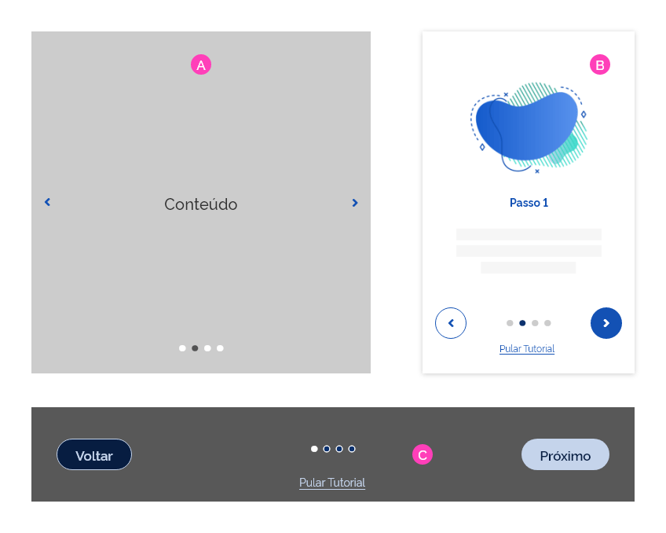
*Exemplos de customização do componente Carousel a partir do modelo tradicional*

##### Controles de Navegação do *Carousel*

-   **Buttons:** Para avançar ou retroceder na navegação utilize o componente *Button* interno ao *Carousel*. Estes podem ser customizados na versão pílula, com ênfase primária para avançar e ênfase secundária para retroceder.

    -   **A:** *Button* tipo pílula com ênfase secundária para retroceder;

    -   **B:** *Button* tipo pílula com ênfase primária para avançar;

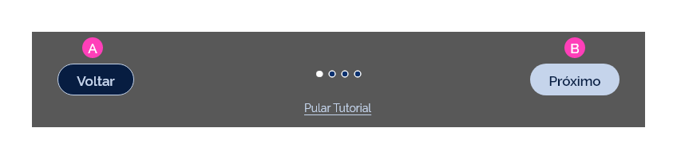
*Buttons como controles de navegação*

Nas telas em *Grids* de 4 colunas ou no tipo de *Onboarding* com ênfase textual, recomenda-se utilizar a versão circular dos *Buttons*, seguindo o mesmo padrão de ênfase primária e secundária.

*Buttons Circulares como controles de navegação - Grid de 4 colunas e Onboarding com ênfase textual*

-   **Hiperlinks**: O *hiperlink* servirá como opção aos usuários que desejam "pular" ou "sair" do *Onboarding*.

    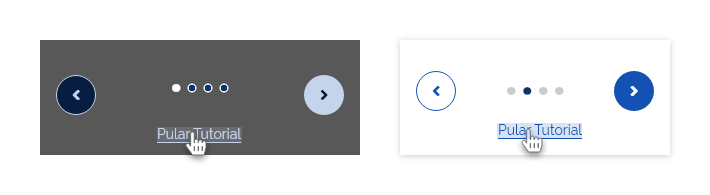
    *Hiperlink usado como atalho ao usuário que deseja pular o tutorial*

-   **Step**: O componente *Step* tem função dupla. Servirá para indicar a progressão ao usuário durante as etapas no *Onboarding* e também como controle para navegar entre as etapas. Ele pode ser usado tanto no tipo simples como no tipo textual.

    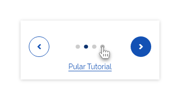
    *Steps - usados para indicar progressão e controle de navegação*

#### 3. Superfície *Overlay* (Obrigatório)

O objetivo da superfície *Overlay* é proporcionar contraste entre os elementos da tela e o conteúdo exibido no *Onboarding*. Desta forma a atenção do usuário será direcionada para o conteúdo de exibição, para os controles de navegação e *Tooltip*. Deve ser utilizada tanto no *Onboarding* de ênfase textual quanto no de ênfase na interface.

É importante observar que a superfície *Overlay*, além de ser utilizada entre o conteúdo do *Onboarding* e a tela ao fundo, também é utilizada como *background* nos controles de navegação do *Carousel*, para proporcionar mais contraste aos elementos interativos. Observe a seguir:

-   **A:** Superfície *Overlay* entre a tela e o conteúdo do *Onboarding*;

-   **B:** Superfície *Overlay* como *background* nos controles de navegação no *Carousel*.

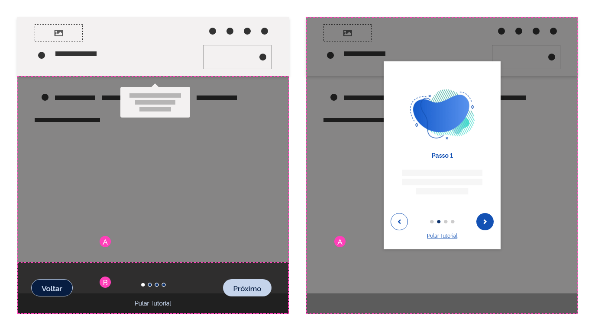
*Uso da Superfície Overlay*

---

## Tipos

### 1. Ênfase na Interface

Este tipo é utilizado quando se quer demonstrar mudanças ou novidades diretamente relacionadas à interface. Neste modelo é necessário destacar os elementos de interface durante as etapas do processo.

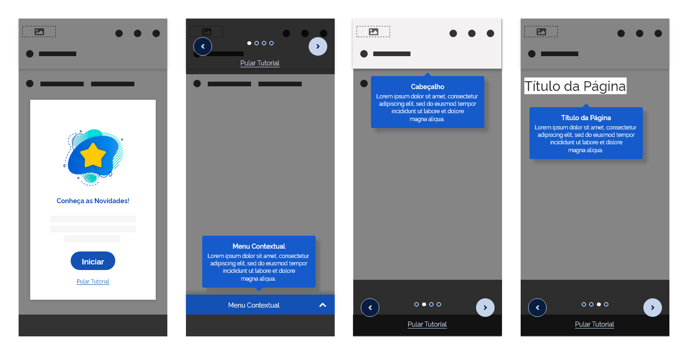
*Tipo - Ênfase na Interface*

### 2. Ênfase Textual

Nesta situação utiliza-se apenas texto, imagem e/ou ilustração. Aqui a ideia é mostrar ao usuário alguma informação relevante, como novidades, atualizações, vantagens, campanhas de marketing, etc.

*Tipo - Ênfase Textual*

---

## Estruturando o *Onboarding*

A seguir pode-se observar um modelo de estrutura básica para construir o *Onboarding*:

### 1. Tela de Boas Vindas

As telas de boas vindas exibem uma introdução do conteúdo oferecido no *Onboarding*. É importante que através dela o usuário tenha clareza daquilo que será demonstrado, assim poderá decidir de forma rápida se quer seguir com o tutorial ou sair dele.

Alguns exemplos de introdução mais frequentes são:

-   Boas vindas com informações para usuários novatos;

-   Boas vindas com informações a respeito de novidades;

 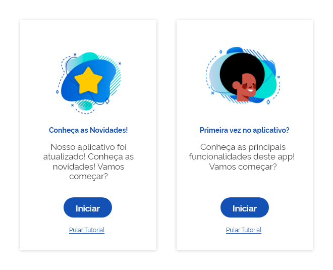
*Exemplo de Boas Vindas para Novidades e Usuários Novatos*

**OBS:** Evite utilizar uma tela de boas vindas apenas como cordialidade, sem qualquer conteúdo adicional, isto atrapalha ou chateia o usuário durante a interação com o aplicativo. Se for o caso, pode-se combinar a mensagem de boas vindas com uma dica para cadastro do novo usuário ou acesso ao *login*, dando utilidade à mensagem.

### 2. Etapas

É muito importante que o tutorial seja formatado num modelo de telas ou passos sequenciais, além de oferecer um número de etapas reduzidas.

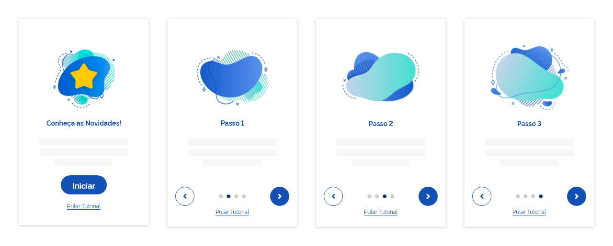
*Exemplo de Etapas Sequenciais Reduzidas*

Este formato oferece algumas vantagens:

-   O modelo de etapas sequenciais é uma forma didática de conduzir o usuário gradativamente até concluir a jornada de apresentação;

-   O número reduzido de etapas incentiva o usuário a não abandonar o *tour*, visto que estatisticamente os usuários tendem a desistir diante de uma quantidade grande de passos;

Outra dica importante é oferecer sempre controles de navegação para o usuário avançar ou retroceder no tutorial. Alguns usuários mais interessados podem querer voltar etapas e revisitar este conteúdo, enquanto que outros mais apressados tendem a pular etapas.  

### 3. Pulando o Tutorial

É de extrema importância que a opção "pular" ou "sair" do tutorial esteja presente durante todo fluxo do *Onboarding*, desde a tela de boas vindas até a conclusão. Nem sempre o usuário está interessado em ingressar no *tour*, seja por vários motivos como:

-   já viu o conteúdo;

-   é um usuário frequente ou experiente;

-   quer acessar outra funcionalidade e está com pressa;

-   ou simplesmente, falta de interesse.

Como padrão, este recurso é apresentado como *hiperlink* e deve posicionar-se num local visível como demonstrado na imagem abaixo.

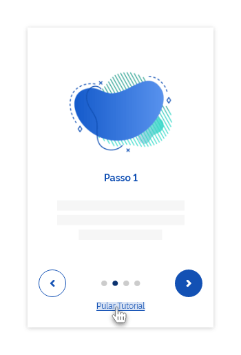
*Exemplo de Hiperlink para Pular Tutorial*

### 4. Desabilitando o Tutorial

Durante a fase de lançamento de novidades num sistema ou aplicativo, é comum exibir tutoriais durante um certo espaço de tempo. Geralmente usuários que já visitaram este tutorial ou já conhecem as novidades apresentadas vão querer "sair" ou "pular" o *tour*. Nesta situação, para que o *Onboarding* não seja um motivo de empecilho ou obstáculo ao usuário frequente, recomenda-se oferecer a opção para desabilitar o tutorial. Desta forma, o usuário que já viu o conteúdo do *Onboarding* poderá marcar num *checkbox* a opção "não quero visualizar este *tour* novamente", e ficar livre do incômodo nas próximas vezes que acessar o sistema.  

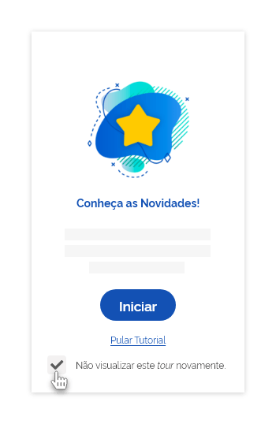
*Exemplo de uso do Componente Checkbox para Desabilitar o Tutorial*

### 5. Indicadores de Progresso

Os indicadores de progresso são formas de mostrar ao usuário as etapas completadas durante o fluxo. Elas também servem como um motivador psicológico, estimulando no usuário o desejo de seguir em frente e concluir a jornada.

No padrão *Onboarding* do Design System, o componente *Step* é utilizado como indicador de progresso, tanto no formato simples como no formato textual.

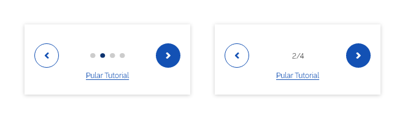
*Exemplo de Indicador de progresso com Step Simples ou Textual*

### 6. Conclusão

Ao finalizar todo fluxo do tutorial, apresente uma tela de conclusão. Utilize um texto finalizando o tutorial e, sempre que possível, apresente os próximos passos ao usuário. Geralmente, um *Button* ou *hiperlink* para a funcionalidade ou recurso demonstrado no tutorial.

*Exemplo de tela de conclusão no Onboarding*

---

## Comportamentos

### 1. Posicionamento dos Controles de Navegação

Os *Controles de Navegação* serão posicionados, de preferência, na base da tela, porém caso haja a necessidade de detalhar algum elemento na base da tela, os *Controles de Navegação* poderão ser posicionados ou no centro-vertical da tela ou no topo da tela, conforme o modelo a seguir.

Aqui temos um exemplo do posicionamento padrão, na base da tela.

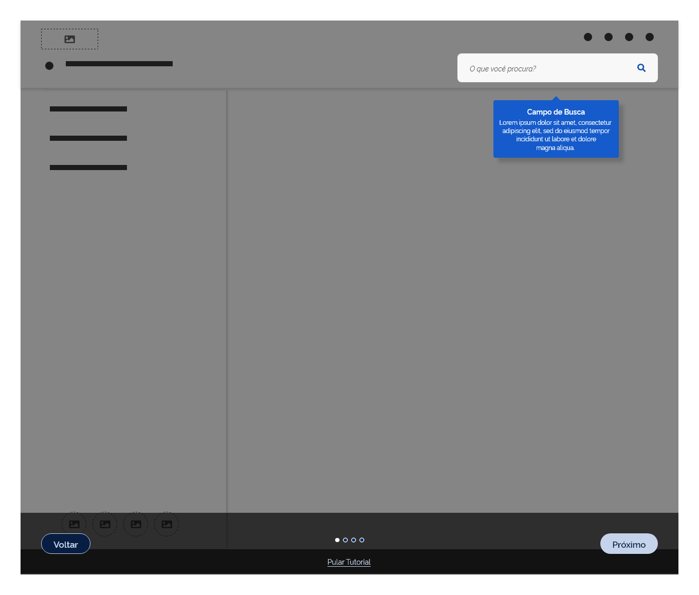
*Posicionamento Padrão - Na Base da tela*

1. Posição padrão na base da tela

2. Posição opcional no centro-vertical da tela

3. Posição opcional no topo da tela

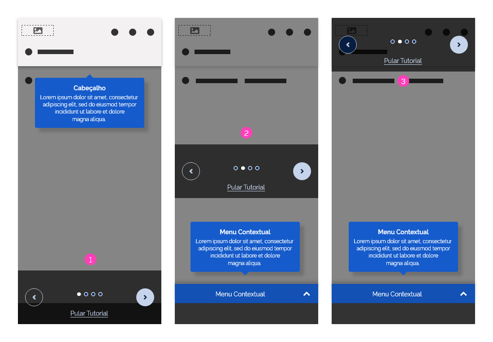
*Posicionamento Opcional - No centro-vertical ou no topo da tela*

### 2. Posicionamento do *Tooltip*

Tendo em vista a característica do *Tooltip* de acompanhar os elementos a serem mostrados na tela, este poderá ser posicionado próximo ao elemento ao qual está sendo detalhado. Sua posição é aleatória na tela.

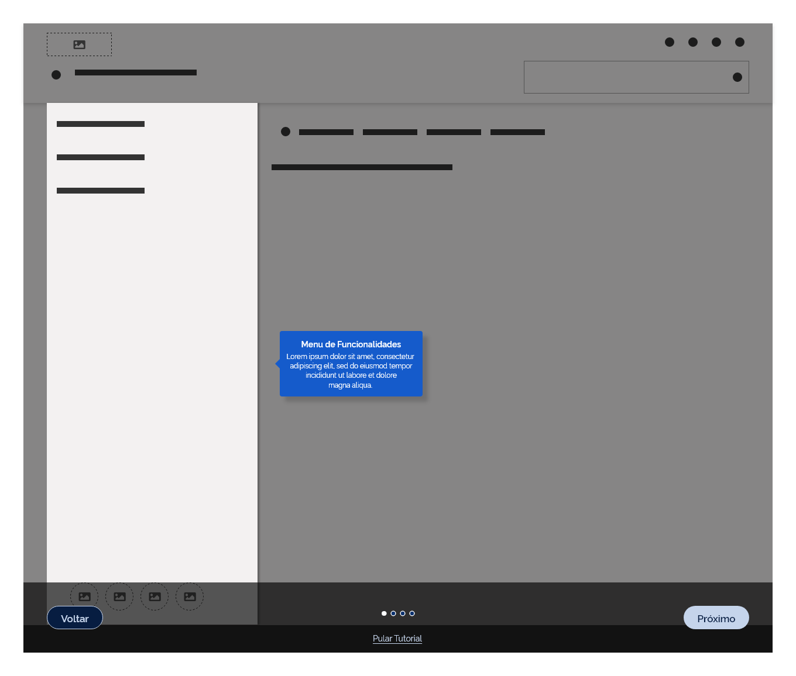
*Posicionamento Aleatório do Tooltip exibindo o Menu em destaque*

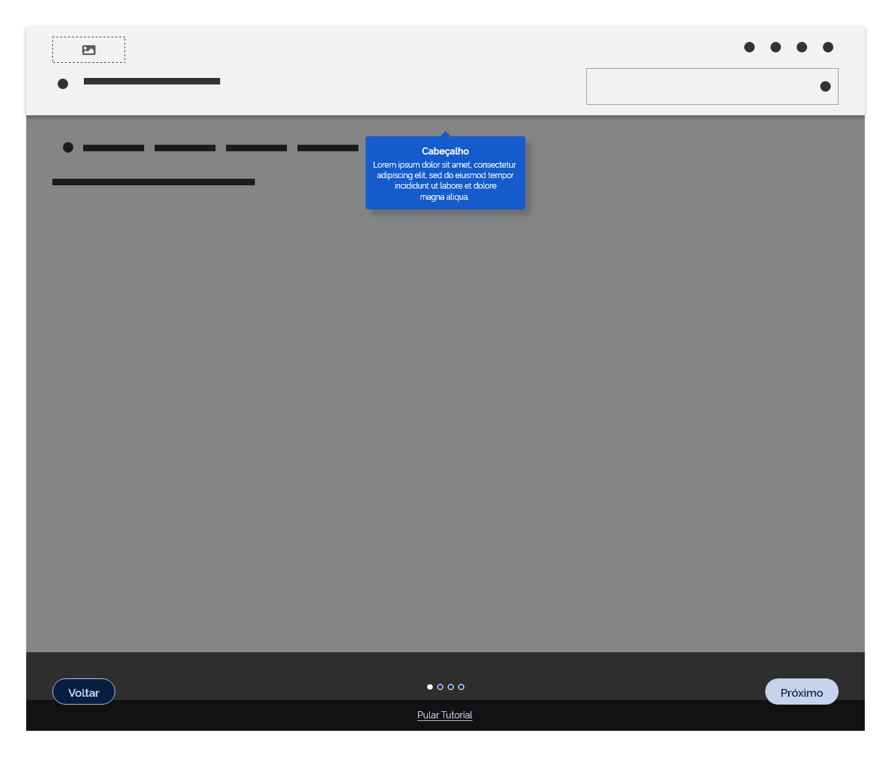
*Posicionamento Aleatório do Tooltip exibindo o Header em destaque*

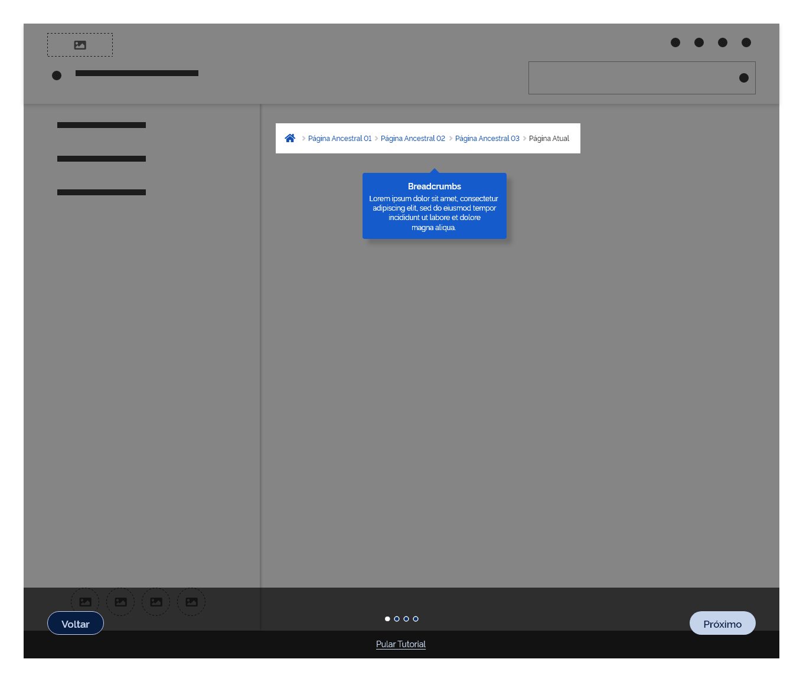
*Posicionamento Aleatório do Tooltip exibindo o Breadcrumbs em destaque*

---

## Melhores Práticas

-   **Priorize a Ação Principal:** Ao oferecer recurso de *Onboarding*, priorize demonstrar a ação ou funcionalidade principal de seu produto ou a que proporcionará maior engajamento dos usuários;

-   **Dê Dicas de Ferramentas Atalhos ou Funcionalidades:**  Um dos objetivos do uso de *Onboarding* é também demonstrar pequenas dicas, ferramentas úteis, funcionalidades prioritárias ou mais frequentemente usadas;

-   **Incentive o Usuário:** Sua interface deve incentivar a interação do usuário. Quando apresentar um *tour* através de *Onboarding*, sempre que possível, ofereça opções ou exemplos de interação para estimular a ação do usuário;

-   **Seja Breve:** É importante que o tutorial demonstrado pelo *Onboarding* tenha um formato simplificado e bem objetivo, com um número reduzido de etapas. Geralmente os usuários não tem paciência em percorrer tutoriais muito extensos;

-   **Ofereça Acesso a mais Informações:** Tendo em vista o formato resumido apresentado pelo *Onboarding*, durante o *tour*, é importante oferecer ao usuário um acesso a mais detalhes de informações, caso se trate de um conteúdo mais complexo. Neste caso, inclua um *hiperlink* de acesso para uma seção específica ou conteúdo de ajuda.

---

## Especificações

| Name                                                                  | Property  | Value/Token            |
| --------------------------------------------------------------------- | --------- | ---------------------- |
| Superfície *Overlay* (*Scrim*)                                        | `opacity` | `--surface-opacity-md` |
| Superfície *Overlay* (*Scrim*) - Controles de Navegação do *Carousel* | `opacity` | `--surface-opacity-lg` |

---

## Referências

-   [Onboarding - Material Design](https://material.io/design/communication/onboarding.html)

-   [A Guide to Effective User Onboarding Best Practices](https://www.toptal.com/designers/ux/user-onboarding-best-practices)
