[version]: # (1.0.1)

O padrão _Dropdown_ ocorre quando uma superfície flutuante surge sobre a tela, de forma temporária, a partir de um elemento acionador. Esta superfície pode conter informações adicionais com características voltadas para coleta de dados, seleção de opções ou apenas texto informativo.

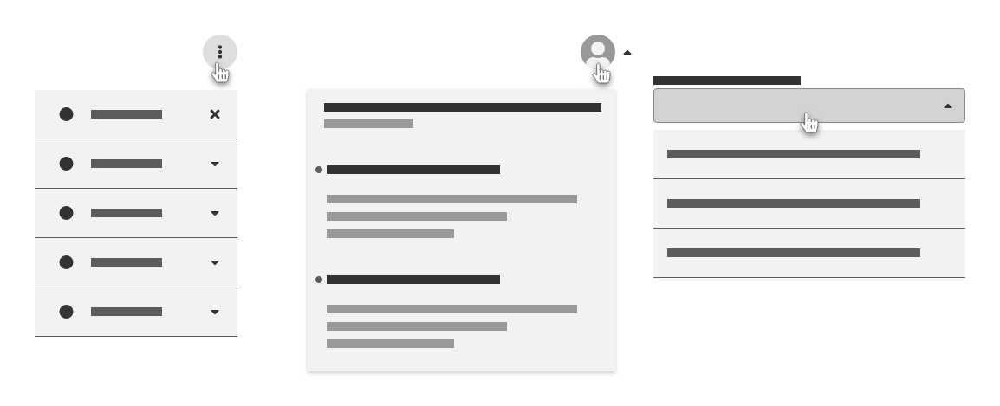
*Exemplos de Dropdown - Menu Suspenso, Painel de Notificação e Campo de Seleção*

Utilize o padrão _Dropdown_ quando:

- existir a necessidade de apresentar informações extras de forma temporária, sem a necessidade de navegar para uma nova tela ou ocupar espaço útil dentro da interface;
- houver a necessidade de exibir itens de seleção ou múltipla escolha ao usuário de forma contextual e temporária;

Não utilize o padrão _Dropdown_:

- quando uma lista suspensa possuir apenas duas opções de escolha. Nesse caso, recomenda-se usar botões de opção, _switches_ ou outro componente que permita o usuário selecionar sua opção diretamente na interface;

- para exibir informações excessivamente complexas. Neste caso, utilize _hiperlinks_ para outras páginas;

- aninhando muitos elementos _Dropdown_ em cascata. Mantenha os elementos flutuantes organizados da forma mais simples possível, dentro do possível.

---

## Anatomia

1. Acionador
2. Identificador de Estado
3. Superfície Flutuante

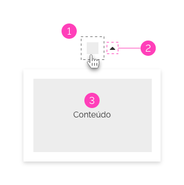
*Anatomia do Dropdown*

### Detalhamento dos Elementos

#### 1 - Acionador

O _Acionador_ poderá ser qualquer elemento interativo no qual o usuário irá executar a ação de exibir ou ocultar a _Superfície Flutuante_.

Geralmente o _Acionador_ é utilizado como _Button_, porém é possível usar outros elementos como acionadores. Por exemplo, superfícies, _hiperlinks_ ou componentes. Veja os exemplos abaixo:

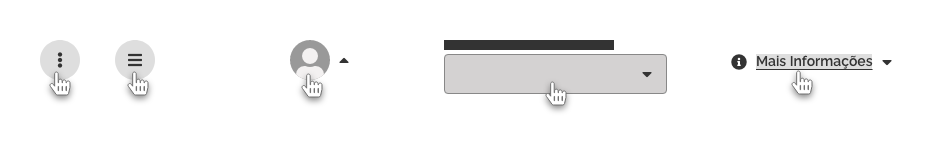
*Exemplo de Acionadores - Botões, Componente Avatar, Select e Texto Interativo como Acionador*

#### 2 - Identificador de Estado

O _Identificador de Estado_ é um elemento iconográfico que representa o estado visível/oculto da _Superfície Flutuante_. Também serve para identificar se determinado elemento possui o padrão _Dropdown_.

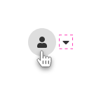
*Exemplo de Identificador de Estado*

- O _Identificador de Estado_ é representado pelos ícones:
  - A. `caret-down`;
  - B. `caret-up`;
  - C. `caret-right`;
  - D. `caret-left`.

*Ícones do Identificador de Estado*

**OBS:** Consulte detalhes do comportamento do _Identificador de Estado_ em _Comportamentos > Uso do Identificador de Estado_.

#### 3 - Superfície Flutuante

A _Superfície Flutuante_ é o elemento que será exibido ou ocultado na interface através do _Acionador_. Esta deve aparecer flutuando sobre o conteúdo da interface, com ênfase e contraste. Veja mais detalhes em _Comportamento > Ênfase_.

- A. Superfície Flutuante;
- B. Conteúdo da Tela.

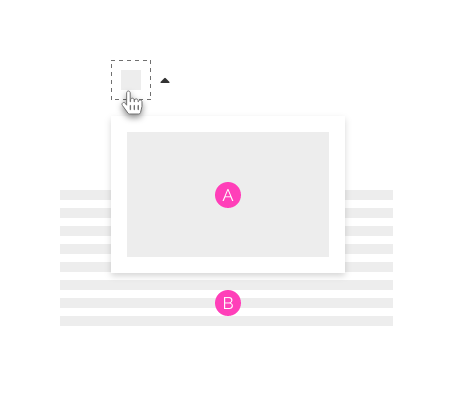
*Superfície Flutuante*

Observe alguns exemplos de _Superfície Flutuante_ utilizada em alguns _Componentes_:

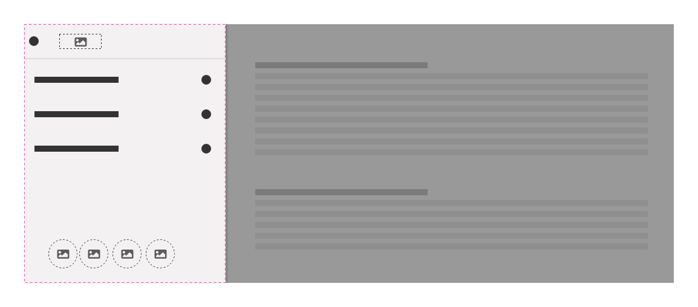
*Exemplo de Superfície Flutuante no Menu*

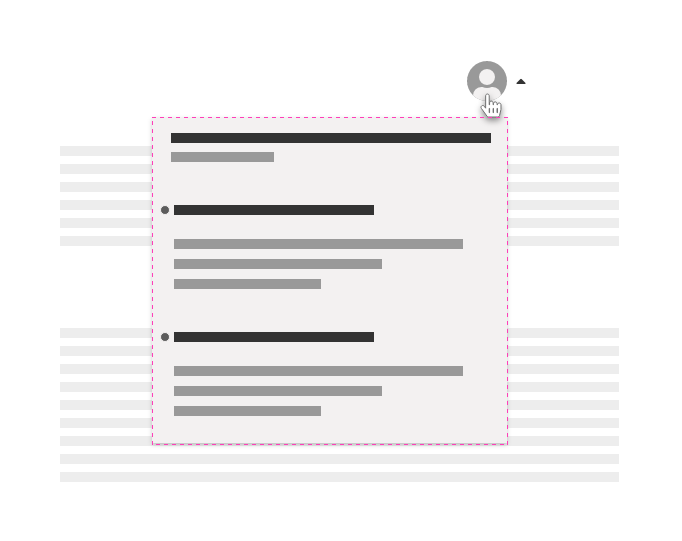
*Exemplo de Superfície Flutuante no Notification*

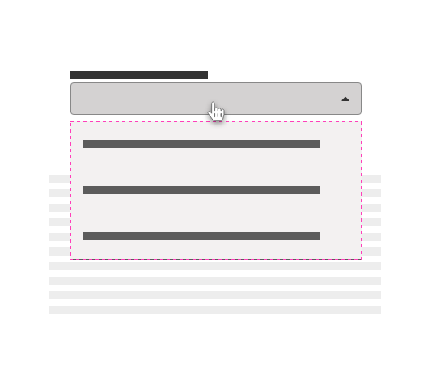
*Exemplo de Superfície Flutuante no Select*

---

## Comportamento

### 1. Ênfase

O elemento _Dropdown_, por se tratar de um elemento flutuante, precisa se destacar do restante do _layout_. Para isto, é utilizado o conceito de elevação, que faz uso da sombra em diferentes intensidades de acordo com a elevação em que a _Superfície Flutuante_ se encontra.

Para elementos flutuantes, como _Dropdown_, usa-se o padrão de _Elevação_ na _Camada 2_, como demonstrado na figura abaixo.

*Exemplo de Sombras em Diferentes Intensidades e Dropdown na Camada 2 de Elevação*

**OBS:** Consulte mais detalhes em _Fundamentos > Elevação_.

Apesar de se utilizar a sombra como um elemento obrigatório para destaque da _Superfície Flutuante_, nem sempre seu uso é suficiente para agregar contraste entre a superfície e a tela. Para proporcionar mais ênfase e contraste, é possível utilizar algumas características opcionais provenientes do conceito de _Superfície_, como _Borda_, _Cor_ ou _Overlay_. Veja abaixo:

- **A - Borda**: Outra propriedade opcional da superfície que pode agregar a ideia de elevação;
- **B - Cor**: Também pode-se adicionar a cor para produzir o contraste na superfície;
- **C - Overlay**: Pode-se utilizar outros recursos, caso seja prioritário a atenção do usuário. Como por exemplo, o uso de _Overlay_ em uma camada inferior ao _Dropdown_.

**Importante!** Note que esses elementos opcionais devem ser usados juntamente com a sombra.

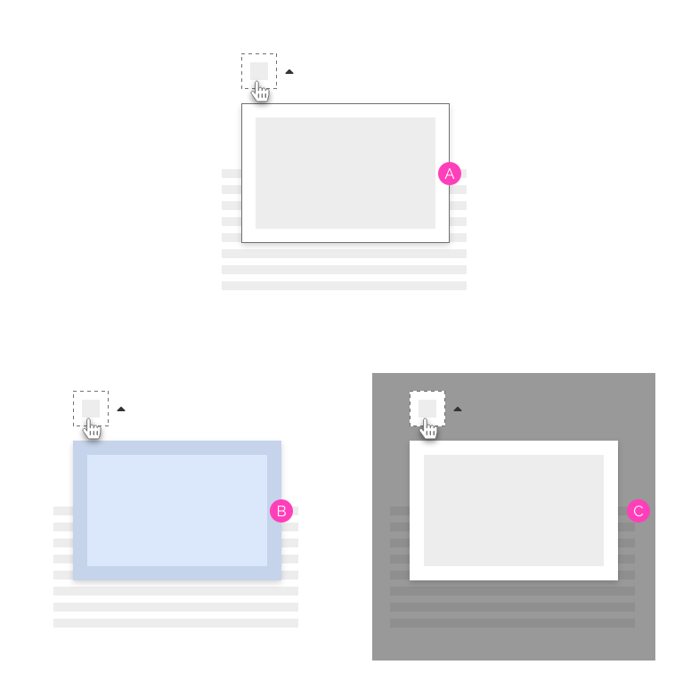
*Exemplos de Ênfase com características opcionais -  Borda, Cor e Overlay*

**Importante!** Quando for utilizado o recurso de _Overlay_ com a finalidade de proporcionar contraste ao elemento _Dropdown_, os elementos interativos abaixo da camada _Overlay_ devem permanecer bloqueados a qualquer tipo de interação pelo usuário, tanto através do mouse como através de navegação por teclado.

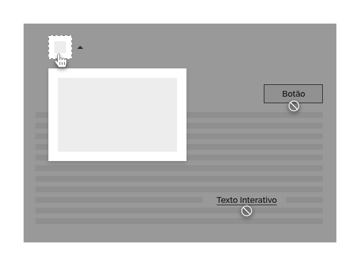
*Exemplo de Overlay - Elementos interativos abaixo da camada Overlay permanecem bloqueados*

**OBS:** Consulte as especificações de sombra em _Especificação > Sombra_.

### 2. Responsividade

Os elementos _Dropdown_ não tem a necessidade de seguir as regras da _Grid_, pois como são elementos flutuantes, não recebem influência desta.

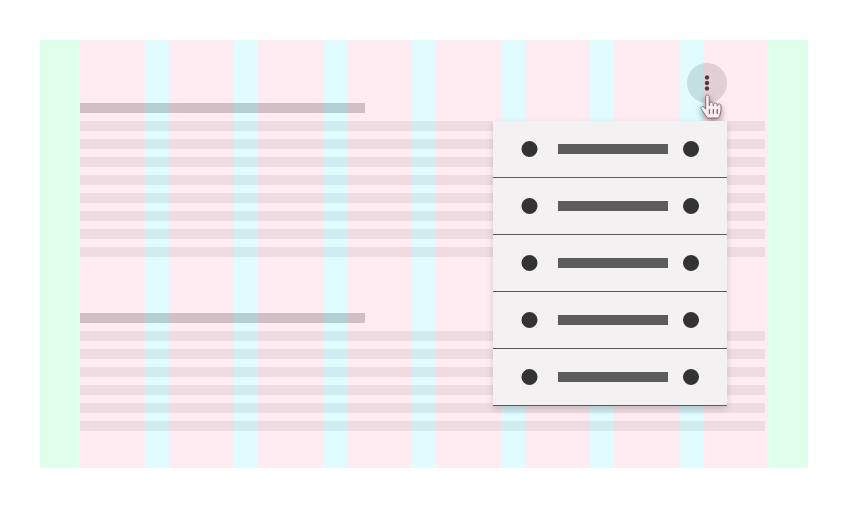
*Exemplo de Lista Dropdown sem interferência da Grid*

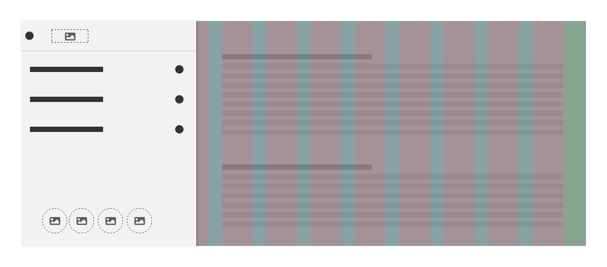
*Exemplo de Menu Dropdown sem interferência da Grid*

#### Grid de 4 Colunas

Porém, é comum que em _Grid_ de 4 colunas, os elementos _Dropdown_ ocupem 100% da largura na tela, se adequando à _Grid_. Observe a seguir.

*Exemplo de Select se adequando à Grid de 4 colunas*

 **Atenção!** Deve-se estar atento aos _Breakpoints_, afim de propor soluções diferenciadas para as dimensões da _Superfície Flutuante_.

### 3. Posicionamento

A _Superfície Flutuante_ deve ser posicionada próxima ao _Acionador_ ou centralizada na tela, no caso de dispositivos móveis. Por padrão, a _Superfície Flutuante_ aparece logo abaixo do _Acionador_. Caso não tenha espaço para exibir o elemento _Dropdown_, este poderá surgir em outras direções (direita, esquerda, acima) opostas ao limite da tela. Observe abaixo.

- A. Por padrão, a _Superfície Flutuante_ abre abaixo do _Acionador_;
- B. A _Superfície Flutuante_ abre abaixo e à direita do _Acionador_ próximo ao limite da tela;
- C. A _Superfície Flutuante_ abre abaixo e à esquerda do _Acionador_ próximo ao limite da tela;
- D. A _Superfície Flutuante_ abre acima do _Acionador_ próximo ao limite da tela;
- E. Limite visível da tela.

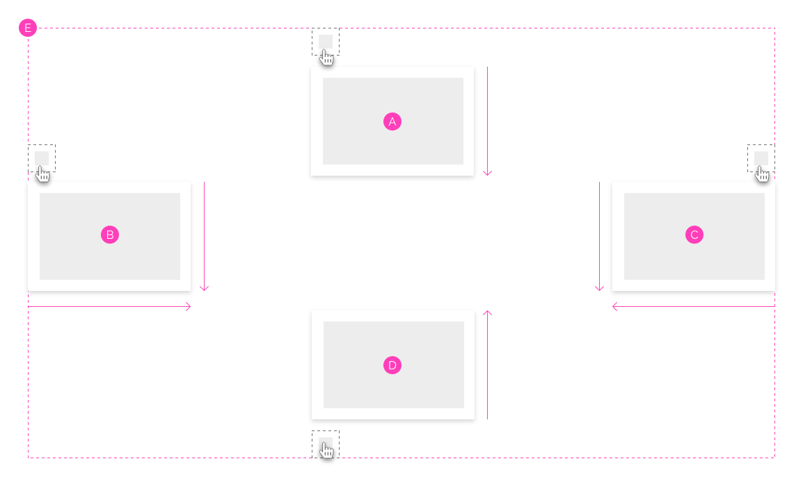
*Limites da Tela e Posição do Dropdown*

**Importante**: o elemento flutuante deve sempre utilizar o espaço útil disponível na tela, não podendo criar espaços extras. Dessa forma, evitamos comportamentos inesperados, como surgimento de uma barra de rolagem por exemplo.

### 4. Uso do Identificador de Estado

O _Identificador de Estado_ é o elemento iconográfico padrão para representar a abertura ou fechamento da _Superfície Flutuante_. Ele deve funcionar com o comportamento `toggle`, alternando a representação do ícone, cada vez que a _Superfície Flutuante_ é exibida ou ocultada.

#### Forma Iconográfica

- Por padrão, a forma iconográfica utilizada é:
  - A. `caret-down` quando a _Superfície Flutuante_ está oculta;
  - B. `caret-up` quando a _Superfície Flutuante_ está visível;

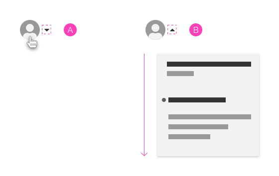
*Comportamento Toggle do Identificador de Estado*

- Em raras situações é possível abrir o elemento _Dropdown_ horizontalmente. Neste caso se utiliza a seguinte iconografia:

- A. `caret-right` quando a _Superfície Flutuante_ está oculta e vai abrir horizontalmente;
- B. `caret-left` quando a _Superfície Flutuante_ está visível e vai fechar horizontalmente.

   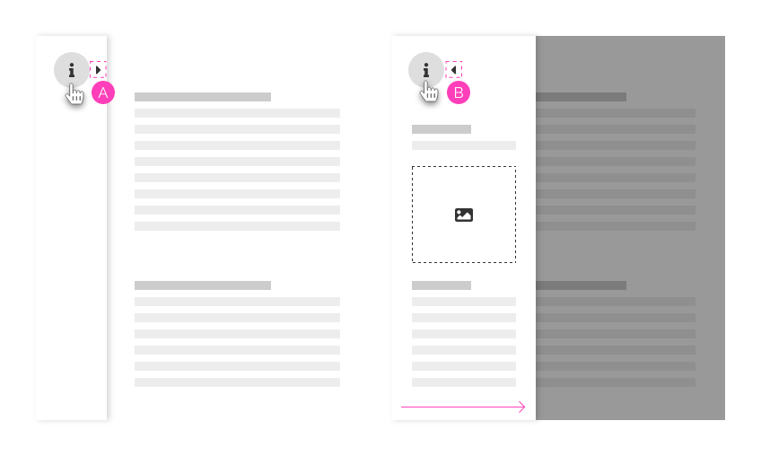
*Exemplo de Painel Retrátil com Identificador de Estado na Horizontal*

#### Posicionamento

- Por padrão, deve-se usar o _Identificador de Estado_ à direita do _Acionador_ e centralizado verticalmente, com o intuito de identificá-lo como elemento _Dropdown_.

*Exemplo de Identificador de Estado*

#### Uso Opcional

Algumas situações desobrigam o uso do _Identificador de Estado_, quando o _Acionador_ já possui uma representação iconográfica ou semântica forte o suficiente para representar o padrão _Dropdown_, deixando claro ao usuário esta ideia.

*Exemplo de Acionadores sem Identificador de Estado - Já representam fortemente o conceito Dropdown*

Mesmo nestas situações, o uso do _Identificador de Estado_ é opcional. Caso haja o desejo de reforçar mais ainda a semântica do _Dropdown_ pode-se utilizar o _Identificador de Estado_.

*Caso haja necessidade, pode-se usar o Identificador de Estado para tornar mais claro o padrão Dropdown*

### 5. Uso do Acionador

É recomendado, sempre que possível, que a área de clique tenha abragência por toda superfície do _Acionador_, incluindo o _Identificador de Estado_.

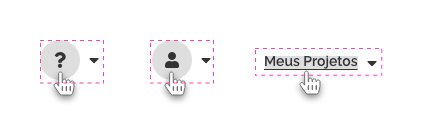
*Área de Clique do Acionador incluindo o Identificador de Estado*

#### Persistência do Estado

Utilize a _Persistência de Estado_ para representar a abertura ou fechamento da _Superfície Flutuante_.

O importante é que fique claro para o usuário que foi ele quem executou a ação. A melhor forma de indicar isso, é utilizar o estado persistente do momento da interação. Por exemplo, se o usuário acionar com `pressed` ou com `hover`, o _Acionador_ deverá manter esses estados enquanto o elemento _Dropdown_ estiver sendo exibido na tela. Veja o exemplo abaixo:

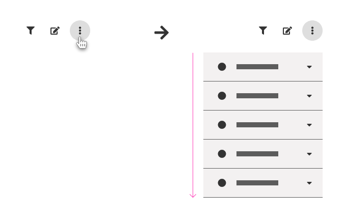
*O usuário utilizou o `hover` para abrir o Dropdown. O Acionador mantém o estado `hover` até o Dropdown fechar*

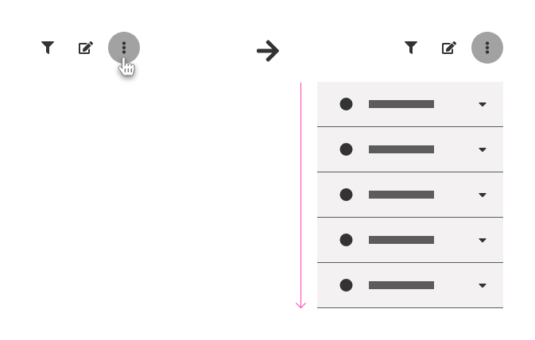
*O usuário utilizou o Clique para abrir o Dropdown. O Acionador mantém o estado `pressed` até o Dropdown fechar*

**OBS:** A _Persistência de Estado_ é um recurso opcional e também pode ser utilizada juntamente com o _Identificador de Estado_.

### 6. Fechamento da Superfície Flutuante

A _Superfície Flutuante_ é um elemento temporário, logo precisa desaparecer da interface, ou seja, precisa ser fechada. Abaixo seguem as formas mais comuns utilizadas para fechamento da _Superfície Flutuante_:

- **Acionador**: o próprio elemento que acionou a _Superfície Flutuante_ pode ser utilizado para fechá-la. Caso tenha sido acionado por clique ou toque, basta clicar ou tocar novamente no _Acionador_ para fechá-la. Se tiver sido acionado por um `hover`, retire o ponteiro do _mouse_ sobre o _Acionador_;

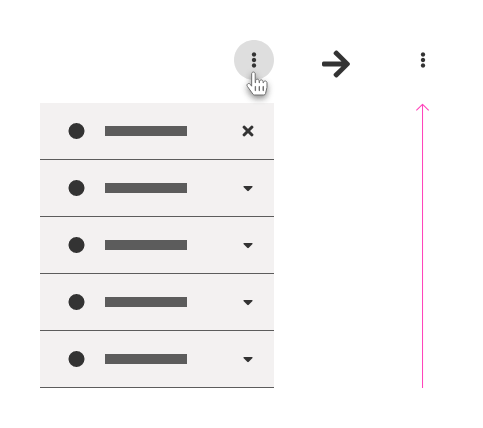
*Fechamento pelo Próprio Acionador*

- **Botão Fechar**: o _Botão Fechar_ com ícone `times` (x) é a forma mais comum utilizada. Recomenda-se posicionar o ícone na parte superior direita da _Superfície Flutuante_;

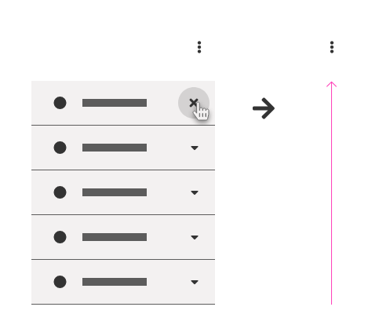
*Fechamento pelo Botão Fechar*

- **Clique fora da superfície**: clicando fora da _Superfície Flutuante_, é outra forma bastante usada para fechar elementos _Dropdown_, independentemente se está ou não sobre um _Overlay_;

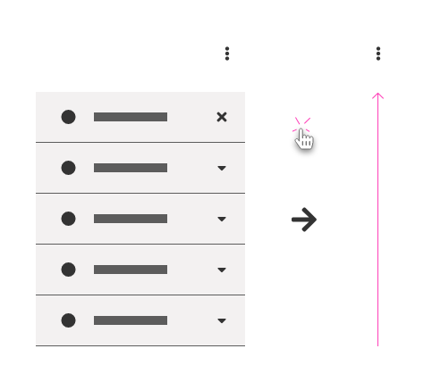
*Fechamento com clique fora da superfície*

- **Concluir objetivo**: após a conclusão do objetivo para o qual foi solicitado o elemento _Dropdown_. Esse objetivo pode ser por uma escolha/seleção, preenchimento de um formulário ou até finalizando o carregamento de algum conteúdo.

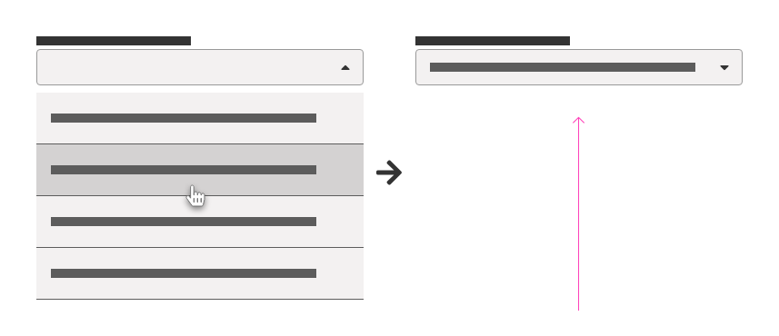
*Fechamento com conclusão de objetivo*

**Importante**: Os comportamentos acima podem ser utilizados separadamente, mas a recomendação é que eles sejam utilizados em conjunto, desde que façam sentido no contexto da interface.

### 7. Conteúdos

- Em algumas situações, o conteúdo exibido na _Superfície Flutuante_ pode ser relativamente grande, como é o caso de alguns painéis de filtros ou painéis retráteis. Neste caso, a recomendação é ter cautela neste tipo de uso. Se o conteúdo for realmente muito extenso a ponto de criar barra de rolagem na área visível da tela, prefira usar hiperlink para uma nova tela;

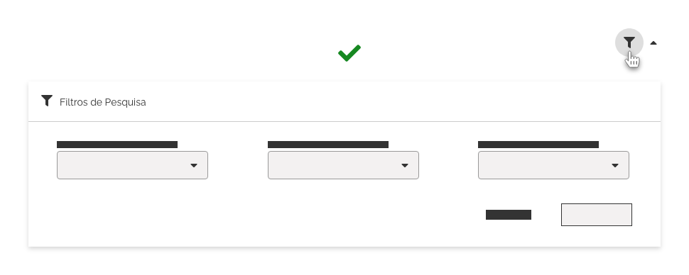
*Exemplo de Conteúdo em Dropdown*

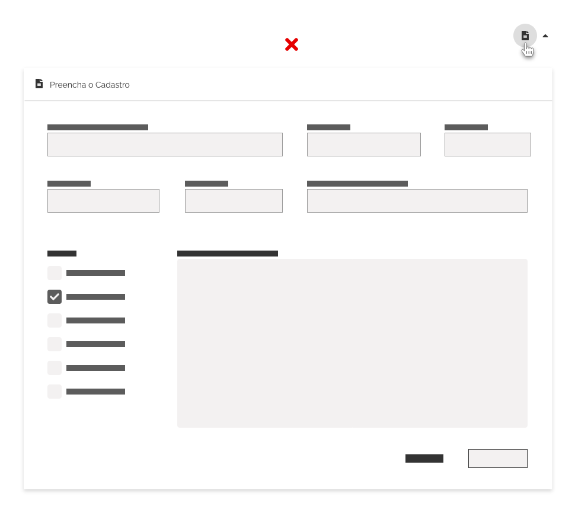
*Exemplo de Conteúdo Muito Extenso em Dropdown - Prefira utilizar hiperlinks para um nova página*

- Recomenda-se utilizar o conteúdo de um _Dropdown_ sempre contido (ou particialmente contido) dentro da _Superfície Flutuante_. Caso contrário, poderá gerar confusão por parte do usuário.

- O conteúdo deve ser apresentado de forma mais simples e sucinta possível. Sem desvio de atenção.

- Pode haver a necessidade de  múltiplos elementos _Dropdown_ aninhados em cascata, porém, utilize com  muita cautela para que o usuário não se perca dentro de diversos níveis. Como padrão, mantenha no máximo 3 níveis de _Dropdown_.

*Exemplo de Boa Prática - Elementos Dropdown aninhados em cascata*

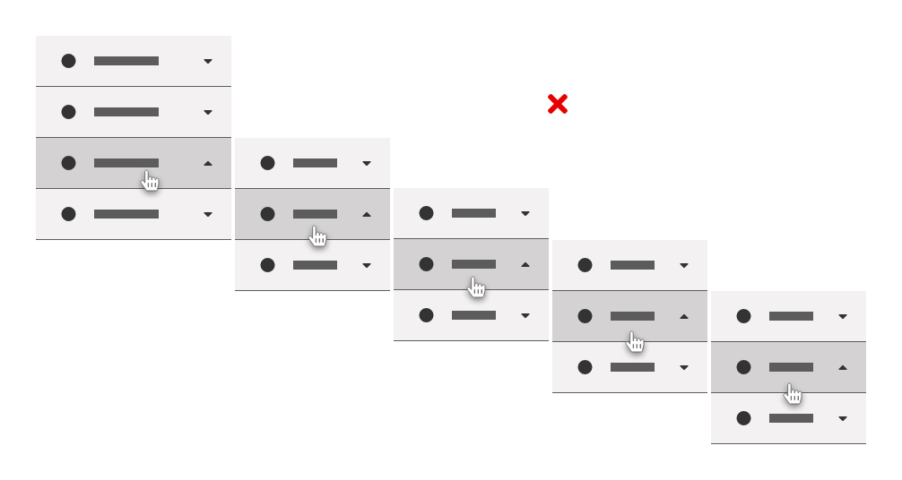
*Exemplo de Mau Uso - Elementos Dropdown aninhados em cascata*

### 8. Acessibilidade

- O padrão _WAI ARIA_ define algumas regras específicas para cada elemento/conteúdo utilizado. O _Dropdown_ do _Design System_ é um comportamento genérico que pode ser aplicado a uma variedade de situações e estruturas. Por esse motivo, não será especificado regras de atributos _ARIA_ necessários (a não ser nos componentes do _Design System_ que utilizam este comportamento). Os autores terão que incluir por contra própria esses atributos mais específicos, dependo do que for utilizado na sua estrutura _Dropdown_;

- No entanto, é importante permitir a navegação entre os elementos interativos em um _Dropdown_ sejam feitos pela tecla `TAB`. Neste caso, utilize o estado `foco` nos elementos durante a navegação;

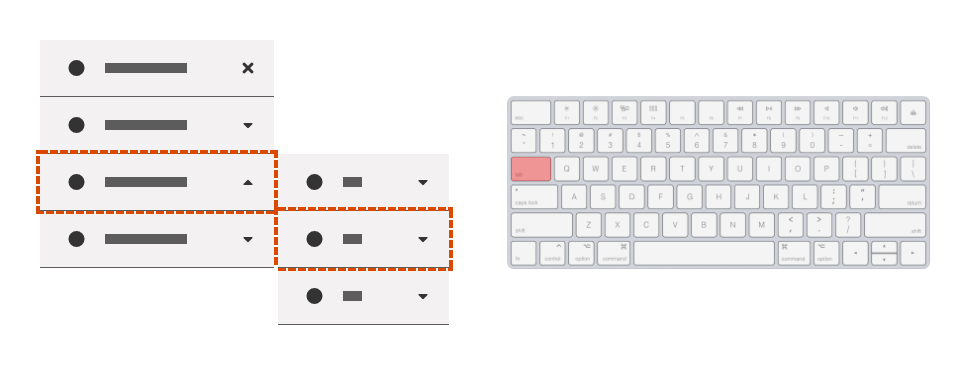
*Exemplo de Uso do Teclado para Navegação em Dropdown - Tecla Tab*

- e em alguns casos, o uso de `Teclas de Navegação` (cima, baixo, direta, esquerda);

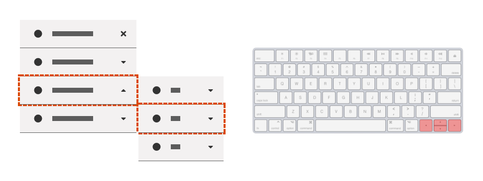
*Exemplo de Uso do Teclado para Navegação em Dropdown - Teclas de Navegação*

- Em caso de navegação a partir do teclado, o fechamento do _Dropdown_ deve ser feito com uso da tecla `ESC`;

  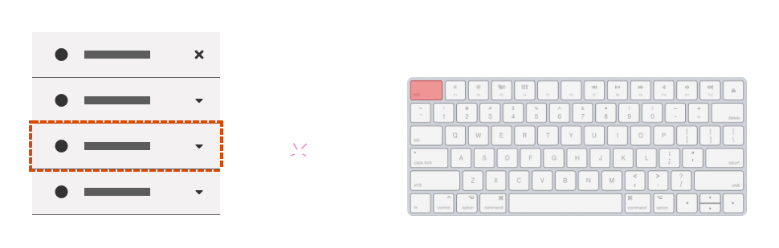
*Exemplo de Uso do Teclado para Navegação em Dropdown - Fechamento com Tecla Esc*

- Em caso de navegação a partir do teclado, o acionamento pode ser feito com a tecla `Enter` ou `Espaço`.

  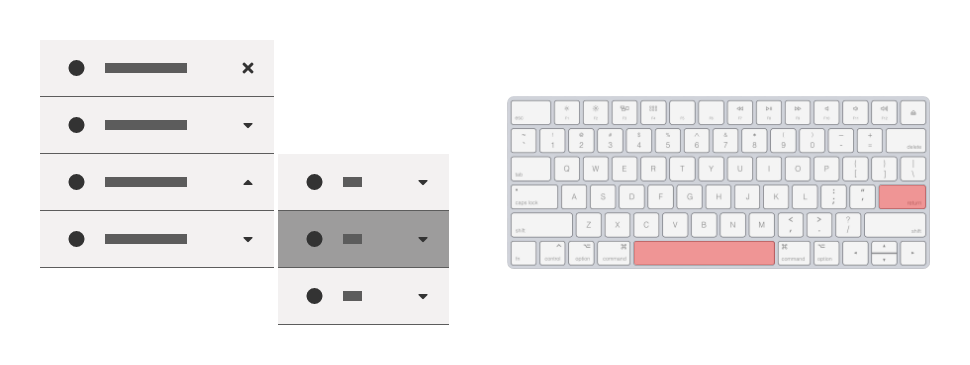
*Exemplo de Uso do Teclado para Navegação em Dropdown - Acionamento com Tecla Enter ou Espaço*

---

## Especificação

### Iconografia

| Name                                     | Estado | Ícone                              | Size               | Class (Font Awesome) |
| ---------------------------------------- | ------ | ---------------------------------- | ------------------ | -------------------- |
| Indicador de Estado (Visível)            | --     | <i class="fas fa-caret-up"></i>    | `--icon-size-base` | `.fa-caret-up`       |
| Indicador de Estado (Oculto)             | --     | <i class="fas fa-caret-down"></i>  | `--icon-size-base` | `.fa-caret-down`     |
| Indicador de Estado (Visível Horizontal) | --     | <i class="fas fa-caret-left"></i>  | `--icon-size-base` | `.fa-caret-left`     |
| Indicador de Estado (Oculto Horizontal)  | --     | <i class="fas fa-caret-right"></i> | `--icon-size-base` | `.fa-caret-right`    |

### Sombra

| Camada | Inner Shadow | Offset * | Blur  |    Color     |     Color Opacity      |
| :----: | :----------: | :------: | :---: | :----------: | :--------------------: |
|   2    |     none     | 3 ou -3  |   6   | `--pure-100` | `--surface-opacity-xs` |
