[version]: # (2.0.4)

Formulário é um grupo de controles de entrada relacionados que permite que os usuários forneçam dados ou configurem opções. Os formulários podem ser simples ou complexos e podem ser apresentados como páginas dedicadas, painéis laterais ou diálogos, dependendo do caso de uso e da situação.

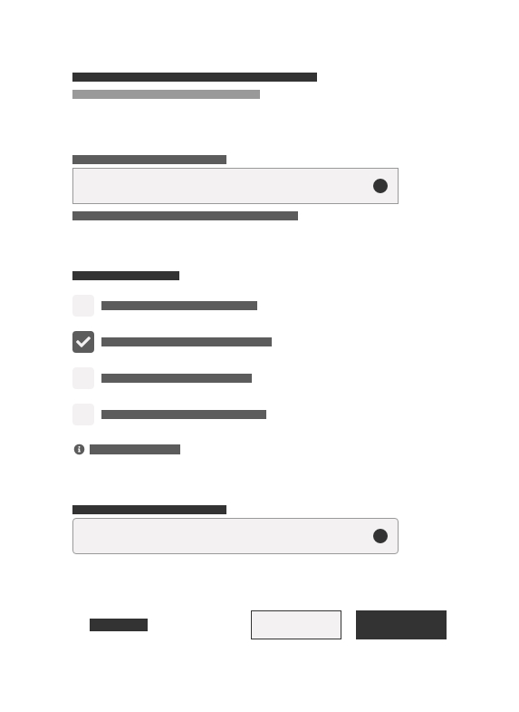
*Exemplo de estrutura de um formulário.*

Usa-se formulários para que usuários:

- façam cadastros;
- inscrevam-se em eventos;
- registrem-se em serviços;
- configurem opções;
- façam pesquisas;
- Compre produtos;
- enviem respostas.

----

## Anatomia

Geralmente os formulários são compostos pelos seguintes elementos:

### 1- Título e Subtítulo

Os títulos e subtítulos do formulário são textos que descrevem o objetivo do formulário e devem ter o maior tamanho de texto entre todos os elementos do formulário.

Se o formulário for o único elemento da página o título do formulário deve ser o próprio título da página. O título também pode ser seguido por um subtítulo que ajuda a descrevê-lo.

Faça com que títulos e subtítulos sejam os mais breves e específicos possíveis. Pode-se adicionar um subtítulo com uma breve descrição se necessário.

Os subtítulos devem complementar a informação do título, descrever o objetivo do formulário e/ou oferecer alguma informação relevante ao usuário. As diretrizes sobre o corpo do texto e peso estão descritas em Fundamentos > Tipografia.

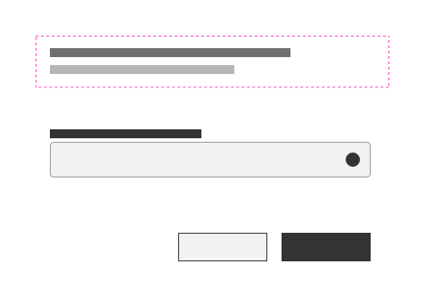
*Utilize títulos e subtítulos com ênfase bem diferenciada dos demais textos do formulário.*

### 2- Componentes de Entrada de Dados

Os componentes de entrada de dados permitem que o usuário faça registros no formulário. Estes componentes são úteis para registrar textos livres ou pré-determinados, imagens, vídeos, áudios ou quaisquer outros tipos de dados necessários.

Entre os componentes de entrada de dados mais usuais estão:

- *Input*;
- *Textarea*;
- *Checkbox*;
- *Radio*;
- *Switch*;
- *Select*;
- *Upload*.

Os componentes de entrada de dados são estruturados por pelos seguintes elementos:

#### Rótulos

São textos breves que acompanham os campos de entrada de dados e especificam o valor do dado que será coletado.

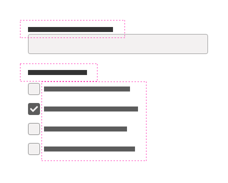
*Exemplo de rótulos.*

Para boas práticas na elaboração dos rótulos:

- Utilize rótulos concisos e que auxiliem os usuários a entender quais informações estão sendo solicitadas.
- Considere apenas a letra inicial da sentença maiúscula.
- Embora possam ser formatados de maneira diferente, todos os componentes de entrada precisam de rótulos.
- Mantenha os rótulos sempre visíveis e precisos. Nunca os substitua por *placeholders* ou elementos que se desloquem pela página.
- Seja sucinto: utilize o mínimo de termos possíveis para transmitir a mensagem de forma clara.
- Mantenha a consistência: se optar pelos dois pontos ":" no final do rótulo mantenha esse padrão em todos os formulários do sistema.
- Posicione os rótulos sempre próximos aos campos que os descrevem. Nos componentes de entrada de texto (*input*, *textarea*, etc.), é recomendável que os rótulos estejam localizados na parte superior do campo.

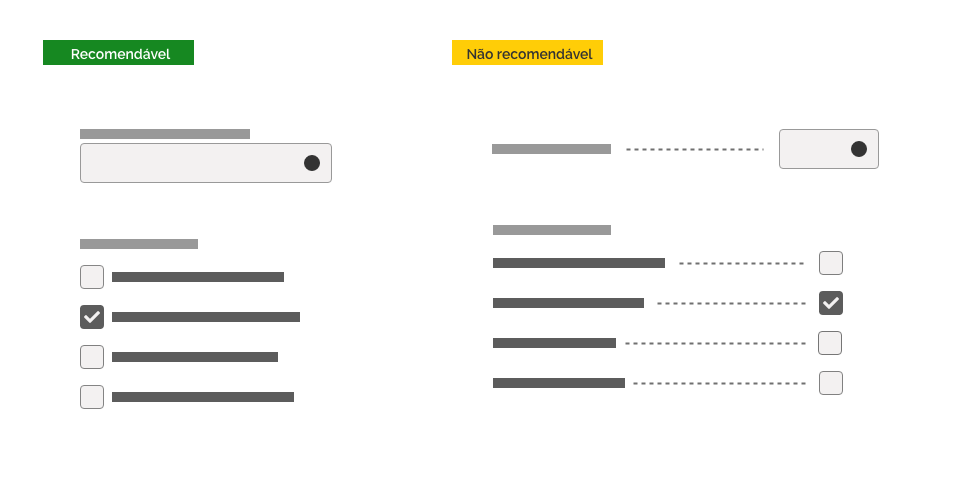
*Evite distanciar os rótulos dos campos.*

##### Campos obrigatórios/opcionais

Prefira criar formulários cujos  os campos de entrada sejam obrigatórios. Utilize o subtítulo do formulário para deixar esta decisão clara para o usuário.

Caso seja necessário oferecer campos opcionais, sinalize-os com um texto entre parênteses ao lado direito do texto de cada rótulo.

*Exemplo de indicação de campo opcional.*

Em certos casos pode ser necessário ressaltar os campos obrigatórios, ao invés dos opcionais. Neste caso, utilize a mesma regra anterior, substituindo o termo "Opcional" por "Obrigatório".

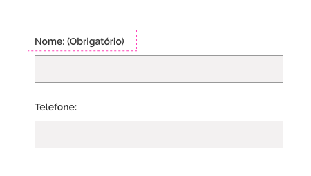
*Exemplo de indicação de campo obrigatório.*

Evite o excesso de campos de entrada opcionais/obrigatórios. Se necessário, considere dedicar um grupo inteiro de campos opcionais/obrigatórios a fim de evitar repetições desnecessárias.

***Atenção:** não utilize as regras acima concomitantemente; isto é, evite sinalizar ao mesmo tempo os campos obrigatórios e opcionais.*

#### Entradas de Dados

As entradas de dados permitem que os usuários insiram textos, arquivos ou um conjunto de opções pré-determinadas.

Siga as recomendações:

- O primeiro campo de entrada obrigatório do formulário deve receber o estado de foco.
- Quando pertinente, utilize o comportamento "*autocomplete*" para auxiliar o preenchimento dos campos de entrada.
- A largura dos campos de entrada não deve ser alterada conforme o tamanho do texto inserido. Caso o texto de entrada seja muito longo, considere técnicas de truncamento.
- Os campos de entrada de texto devem sugerir um tamanho compatível com a entrada esperada. O usuário fica extremamente suscetível a erros quando não consegue ver sua entrada completa.
- Caso um campo só possa ser inserido um tipo de informação, pode ser importante limitar ou utilizar campos voltados ao assunto da entrada. Por exemplo, um campo voltado a entrada de números poderia ficar indisponível qualquer caractere que não seja número, como letras e alguns caracteres especiais.

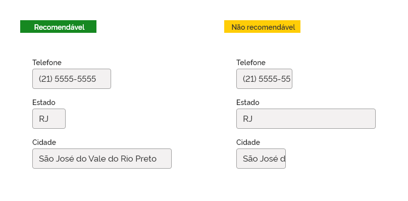
*Campos muito grande ou pequeno em relação a previsão de entrada de dados, podem gerar problemas para o usuário durante o preenchimento.*

##### Senhas

As senhas permitem autenticar usuários em uma determinada interface, muitas vezes concedendo privilégios específicos e permitindo acesso a informações personalizadas.

- Disponibilize componentes de anonimização de senhas. É recomendável utilizar uma alternativa para que o usuário visualize e oculte o conteúdo durante o preenchimento.
- Durante a definição de uma senha, sempre confirme a senha que será cadastrada com um outro campo similar e mostre o usuário que existe um erro entre duas senhas caso exista algum problema durante o processo.
- Oriente o usuário que sua senha ou chave é segura. Adicione um feedback visual e textual com níveis de segurança como **Baixa**, **Média** e **Alta**. Não deixe de dar dicas para criar senha com segurança alta, tais como:
  - Ter pelo menos seis a oito caracteres;
  - Incluir números, letras maiúsculas e minúsculas e caracteres especiais;
  - Não conter seu nome de usuário, nome real ou da empresa, ou uma palavra completa;
  - Ser bastante diferente das senhas anteriores;
- Sempre forneça a opção de alterar ou recuperar a senha. Essas opções devem estar visíveis e de fácil acesso para o usuário.
- Caso o usuário tenha mais de uma opção para se autenticar em uma interface (certificado digital, senha...), agrupe as opções de forma simples e compreensível para o usuário.

*Preenchimento de senhas com opção de visualizar o conteúdo.*

##### Edição

Há situações em que dados de entrada já enviados para o servidor precisam ser editados ou retificados. Nestes casos, informe claramente essa funcionalidade para o usuário.

- Insira um elemento identificador (ícone, texto, etc.) próximo à informação editável que deixe claro que a informação pode ser editada.
- O acionador é o elemento interativo que executa a ação editável. Pode ser o próprio identificador ou outro elemento adicional.
- Forneça possibilidades para cancelar e salvar as alterações.

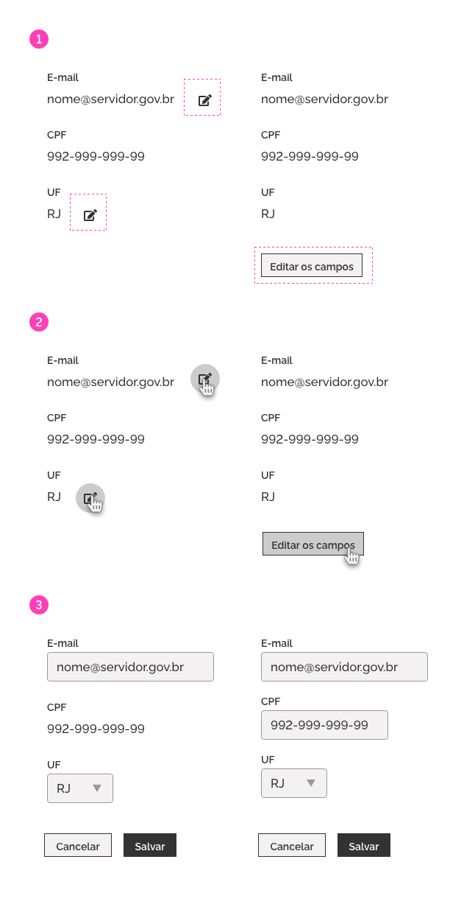
*1- Caso alguns campos possam ser editáveis, é importante informar quais podem ser editáveis, caso todos sejam editáveis não é necessário indicar. 2- Pode-se utilizar o próprio indicador para acionar a edição de forma individual, ou ter um acionador "global". 3- Quando estiver no modo edição, é sempre importante dar a opção de salvar ou cancelar a edição.*

**Atenção:** o acionador deve ser compatível com a informação a ser editada; isto é, *select* para casos de dados pré-determinados, *input*, para casos de textos livres e assim por diante.

Caso tenha muitos dados para serem editados (ou com possibilidade de edição), talvez seja melhor apresentar o conteúdo por um fluxo de etapas (como um componente *wizard*) ou agrupados por abas (como um componente *Tab*). Veja melhores práticas de agrupar campos na área de Layout e Estrutura.

#### Orientações de Preenchimento

Insira elementos auxiliares que facilitem o usuário a preencher corretamente os campos de entrada de dados, como:

1. *Placeholder*;
1. Máscara;
1. Texto auxiliar;
1. Ícone Ajuda;
1. Mensagem contextual.

*Exemplo de placeholder, texto auxiliar, ícone de ajuda e mensagem contextual como elementos auxiliares/suporte ao usuário.*

Os elementos auxiliares podem ser muito úteis para fornecer explicações adicionais aos campos de entrada de dados que o usuário não tenha familiaridade.

**Atenção:** explique claramente quaisquer requisitos de entrada ou formatação. Se um campo de entrada de dados exigir um formato ou tipo específico de entrada, indique as instruções exatas. O mesmo se aplica às regras de sintaxe, como pontuação ou espaçamento para números de telefone ou cartões de crédito.

##### 1- *Placeholder*

*Placeholders* fornecem dicas e exemplos sobre o dado correto a ser inserido. Geralmente é grafado em itálico.

Prefira utilizar exemplos genéricos como *placeholder*.

Considere utilizar *placeholders* quando o usuário não estiver familiarizado com a informação solicitada ou a formatação do texto for um fator crítico de validação, por exemplo, DD-MM-AAAA para formato de datas.

*Exemplos de Placeholders.*

**Atenção:**  não utilize *Placeholders* no lugar de rótulos.

##### 2- Máscara

Sempre que o dado de entrada requerido possuir um padrão de escrita, recomenda-se utilizar máscaras de formatação. Geralmente estes tipos de dados, são números, códigos, protocolos ou textos com tamanho padronizado e podem vir acompanhados de caracteres específicos, como pontos, parêntesis ou caracteres especiais.
Sendo assim, a utilização de máscaras auxilia o usuário na digitação e padronização do texto de entrada.

Fique atento para as seguintes dicas:

- É recomendado que a máscara funcione dinamicamente no momento da digitação e também ao "colar" o texto no campo *input*.

- Não divida o *input* em campos separados, isso aumenta o custo de interação do usuário, além de causar problemas para usuários internacionais, visto que utilizam padrões diferenciados. Por exemplo, o formato do telefone nos EUA é bem diferente do brasileiro: +1 (xxx) xxx-xx-xx.

- Em caso de internacionalização, forneça o seletor de código do país. O seletor deverá utilizar o padrão *dropdown* e oferecer ao usuário a possibilidade de escolher o código de cada país, além de permitir a implementação do padrão de máscaras de cada localidade específica.

- A máscara deverá oferecer espaçamentos e separadores específicos para cada trecho do número, código ou protocolo digitado. Esta prática oferece ao usuário uma melhor visualização do texto, além de prevenir possíveis erros de digitação.

##### 3- Texto Auxiliar

Utilize texto auxiliar com a finalidade de prevenir erros.

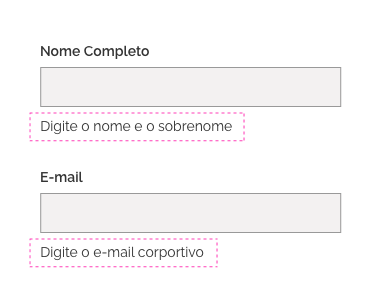
*Exemplo de texto auxiliar.*

**Atenção:** textos auxiliares devem ser compactos e objetivos.

##### 4- Ícone Ajuda

Utilize o ícone Ajuda somente para os casos que a informação complementar não precisa estar visível em um primeiro momento.
Costuma ser utilizado para esclarecer questões legais ou para justificar a coleta de determinados dados.

Para acionar esse componente deve ser utilizado um botão de ênfase terciária com um ícone ou texto indicando sua finalidade, posicionado na mesma linha á direita a uma unidade de espaçamento mínimo do rótulo do campo a ser preenchido.

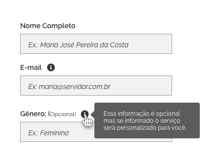
*Exemplo do uso do ícone de ajuda.*

**Atenção:** não use este recurso para obter informações vitais para a conclusão da tarefa, instruções ou outras informações diretamente acionáveis, como requisitos de campo. Os usuários não devem precisar desse tipo de ajuda para concluir sua tarefa.

##### 5- Mensagem Contextual

Utilize mensagens contextuais para informar erros que usuário possa cometer no preenchimento do formulário ou para chamar a atenção do usuário em relação ao dado inserido.

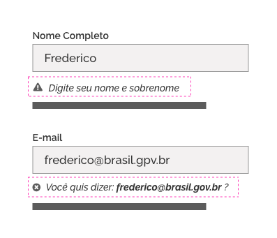
*Exemplo de uso da mensagem contextual.*

Consulte o documento do componente *[Message]( <https://www.gov.br/ds/ds/components>)* para mais detalhes.

### 3- Botões

Botões permitem que o usuário execute algum tipo de ação sobre o formulário.

> No DSgov existe o componente [*Button*](https://www.gov.br/ds/components/button) que pode ser utilizado na maioria das ações dos formulários, e o [*Magic Button*](https://www.gov.br/ds/components/magicbutton) que pode ser usado para fortalecer o início ou encerramento de fluxos relevante de um formulário.

Os Botões devem estar posicionados preferencialmente abaixo e à direita do formulário ao qual se referem e devem respeitar as diretrizes de alinhamento e espaçamento previstas para o componente *button*.

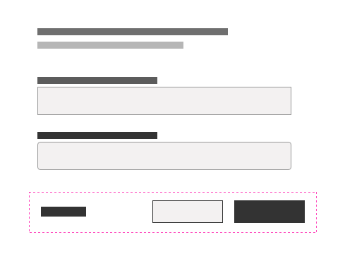
*Exemplo de hierarquia dos buttons.*

Formulários podem exigir botões com até três ênfases:

1. Use **ênfase primária** para ações mais importante do formulário como, por exemplo, "Incluir Registro" ou "Enviar Formulário".
1. Use **ênfase secundária** para ações secundárias como "Cancelar" ou "Salvar Rascunho".
1. Use **ênfase terciária** para ações menos importantes, como "Exibir Informações Adicionais" ou "Documentos Acessórios".
  
Quando utilizar mais de um botão, o elemento com ênfase primária deve estar necessariamente posicionado à direita dos botões de ênfase secundária e estes sempre mais à direita dos botões de ênfase terciária. Estes podem alinhados à esquerda do formulário.

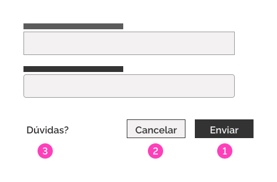
*Ordem da hierarquia das ênfases: primária **(1)**, secundária **(2)** e terciária **(3)**.*

Quando a disposição da tela permitir que os botões sejam posicionados apenas verticalmente, o botão de ênfase primária deve estar posicionado mais abaixo.  

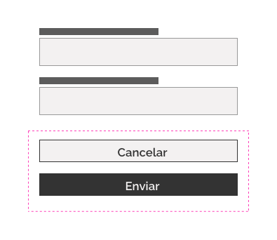
*Ordem dos buttons em uma distribuição vertical.*

**Atenção:** evite botões do tipo "Redefinir" e "Limpar Formulário".

Consulte o documento do [componente *button*](<https://www.gov.br/ds/ds/components/button>) para mais detalhes sobre o seu uso.
  
----

## *Layout* e Estrutura

Formulários podem ser tão simples, como um formulário de *login* com dois campos de entrada (*login* e senha) ou extremamente complexos com enorme quantidade de diferentes tipos de campos de entradas. Para estes casos é recomendável agrupar os campos por afinidades. Essa prática facilita a organização das informações na tela e auxilia cognitivamente o usuário a preencher o conteúdo diminuindo a ocorrência de erros.

### Considere a Semântica

Ao se projetar um formulário, considere a ordem lógica e previsível do preenchimento dos campos de entrada. Por exemplo, pergunte primeiro o nome e depois o sobrenome. Considere ainda priorizar a ordem de preenchimento dos campos de entrada mais importantes e frequentes.

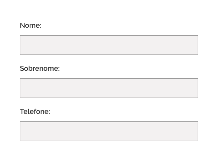
*Ordem lógica para o usuário*

Tenha em mente que há diversas formas de agrupar os campos de um formulário (explicadas a seguir). Encontre a melhor forma e, se possível, valide com o usuário por meio de testes de usabilidade.

### 1- *Grid* (Colunas e Linhas)

Prefira diagramar os campos de entrada do formulário em uma única coluna, exceto os campos complementares. Campos complementares são todos aqueles que complementam a informação do campo anterior (ex.: Data de início/Data de término ou Estado/Cidade).

Formulários são melhores preenchidos em campos dispostos na vertical (uma coluna). Há casos, porém, em que é necessária uma grande quantidade de campos gerando formulários bastante complexos havendo a necessidade de dispor campos lado a lado. Para cada caso, analise a melhor diagramação dos campos pensando sempre na experiência do usuário.

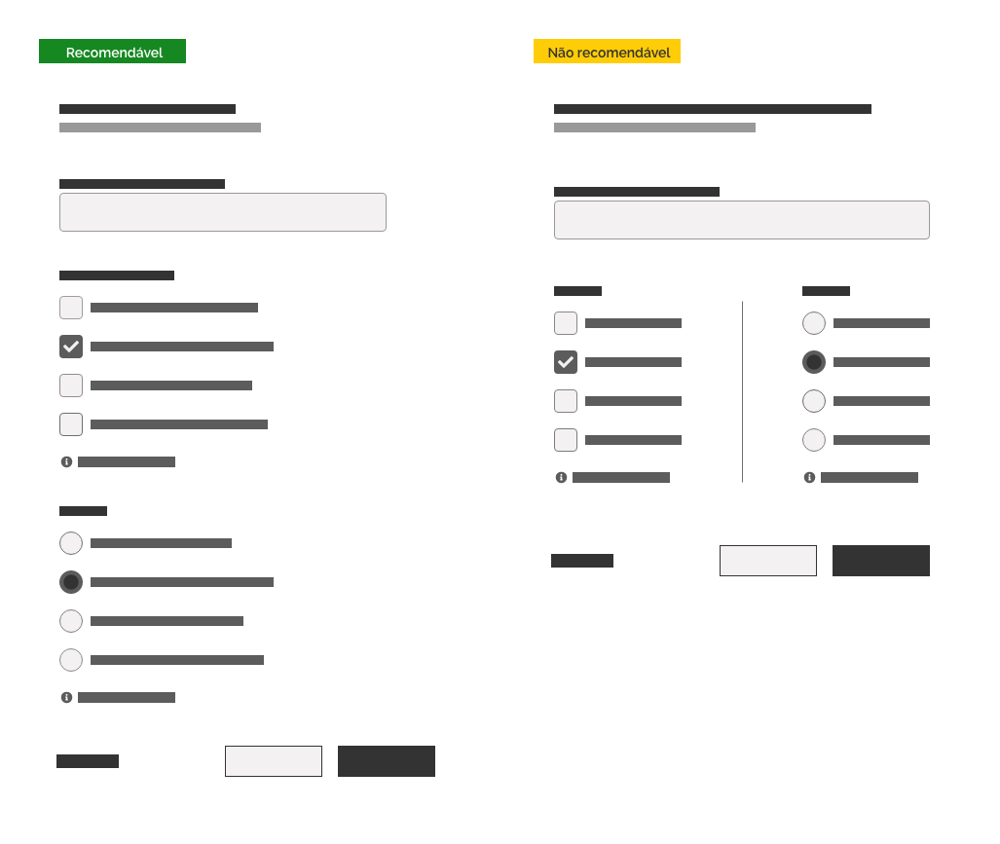
*Exemplo de uso se colunas dentro do formulário. Para formulários curtos é preferível dispor os campos em uma única coluna. Formulários mais complexos podem exigir um estudo mais detalhado na distribuição dos campos.*

**Atenção:** nos formulários ou nos agrupamentos de campos de entrada em que é possível dispor todos os campos de entrada em uma única linha, é importante manter a consistência entre as larguras dos campos e as larguras das colunas.

Considere que os campos do formulário podem sofrer alterações de acordo com a resolução ou mesmo com a orientação do dispositivo utilizado (celulares, por exemplo). Teste se a lógica de preenchimento faz sentido em todas as resoluções e orientações dos dispositivos previstos.

### 2- *Fieldset* e *Legend*

Para auxiliar o usuário a entender a diagramação de formulários complexos é possível agrupar os elementos com características comuns (com uso de `Fieldset`) e nomeá-los com o uso de `legend`.

***Fieldsets*** servem para agrupar elementos de formulários, muito parecido com o `Label`, porém, ele necessita de um elemento textual (não obrigatório) para representá-lo como rótulo: o `legend`.

***Legends*** funcionam como títulos de agrupamentos e antecipam o tipo de informação que o usuário poderá encontrar naquele grupo de campos de entrada. Seu tamanho deve ter menos ênfase do que o título do formulário e deve manter a consistência sem variação no tamanho do corpo de texto em todo o formulário, a menos que tenha conceitos de hierarquia envolvidos (veja "4- Indentação e Subagrupamentos").

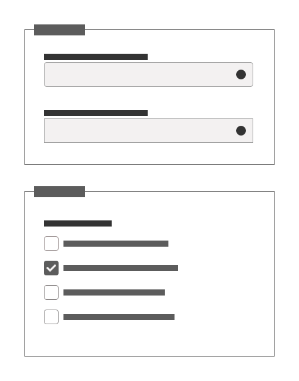
*Agrupamentos com fieldset melhoram a acessibilidade.*

Os agrupamentos podem ser apresentados na forma contraída (padrão *collapse*). Neste caso, mantenha a área da *legend* como ativador conforme a diretriz do padrão *collapse*.

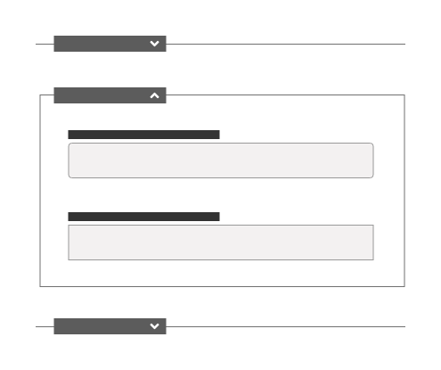
*Agrupamentos apresentados em*collapse*com uso de fieldset e legend.*

**Importante**: dentro do DSGov, o `Fieldset` é usado somente como um elemento semântico dentro de um formulário, não tendo nenhum tipo de estilização visual (delimitação de uma borda visual). Portanto, deve-se utilizar o `legend` para aumentar sua acessibilidade. Nas imagens acima, o uso de bordas no `fieldset` é feito apenas por questões didáticas.

#### Estilização do *Fieldset*

| Property      |            Value/Token |
| ------------- | ---------------------: |
| border        | `--surface-width-none` |
| margin-bottom |   `--spacing-scale-5x` |

### 3- Indentação e Subagrupamentos

Subagrupamentos são agrupamentos dentro de agrupamentos. Para tornar mais clara e hierarquizada a informação utilize indentação evidente para os subagrupamentos.

Utilize a escala de *layout* definida no fundamento [Espaçamento](https://www.gov.br/ds/fundamentos-visuais/espacamento) para indentar os subagrupamentos. Utilize um valor que fique claro este comportamento tendo como referência o agrupamento que o contêm.

**Atenção:** tenha cautela na utilização de subagrupamentos.  Recomenda-se apenas **um nível** de subagrupamento por agrupamento.

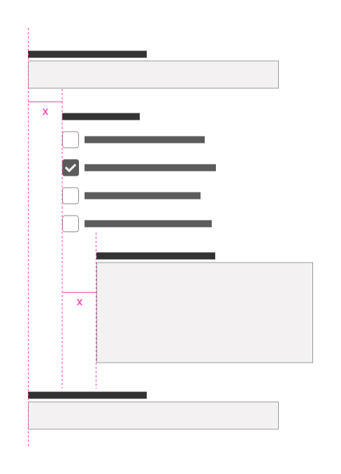
*Indentação dentro de um formulário.*

### 4- Outras Formas de Agrupamento

Há inúmeras maneiras de agrupar e organizar os elementos do formulário. A seguir, listamos as mais recorrentes:

#### Por Espaçamento

Elementos de formulário podem ser agrupados por aproximação. Utilize valores de espaçamento maiores para diagramar os agrupamentos. Com essa técnica, os espaços entre os agrupamentos criam a ilusão de "blocos" de informações facilitando a interpretação do conteúdo.

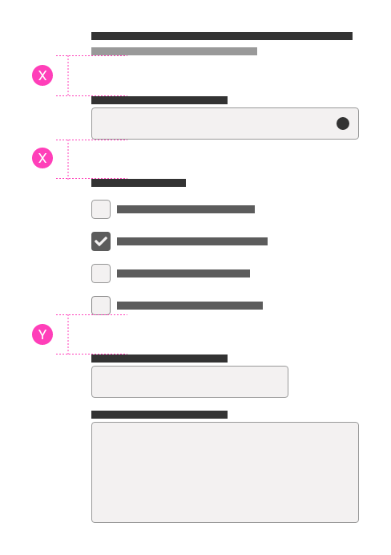
*Utilize espaçamento necessário para caracterizar a separação entre os agrupamentos. No exemplo foram criados 3 tipos de agrupamento com o uso de espaçamentos consistentes.*

##### Separando entradas, ações e grupos

Os espaços em branco também são importantes para leitura, pois criam espaços onde o olhar do leitor pode descansar, e por fim manter o fluxo de leitura.

Como regra geral, é recomendado que se utilize:

- um espaço maior entre os agrupamentos assim como um maior afastamento entre a última entrada e os *buttons*.
- um espaçamento intermediário entre o título e a primeira entrada;
- um espaçamento menor entre os campos de entrada de dados, texto ou opções.

Esses espaçamentos devem ser constantes para uma mesma função, em toda a tela e em todo o produto. (Veja mais no fundamento [Espaçamento](https://www.gov.br/ds/ds/fundamentos-visuais/espacamento).)

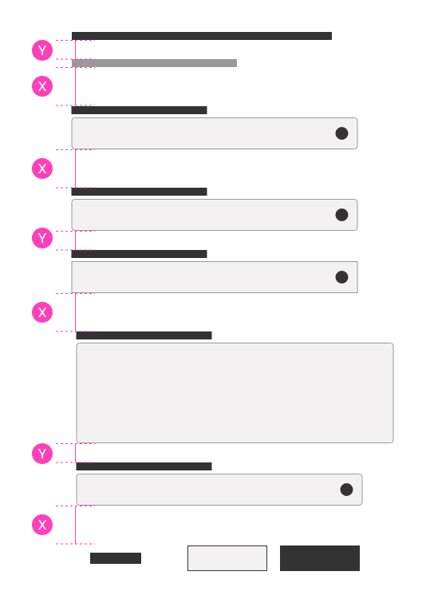
*Exemplo de espaçamentos entre as áreas do formulário.*

Consulte o documento  [Fundamentos Visuais > Espaçamento](https://www.gov.br/ds/fundamentos-visuais/espacamento) para conferir os espaçamentos possíveis.

#### Por *Divider*

Pode-se utilizar o componente *divider* para criar agrupamentos de elementos de formulário nos casos em que há falta de espaço na tela.

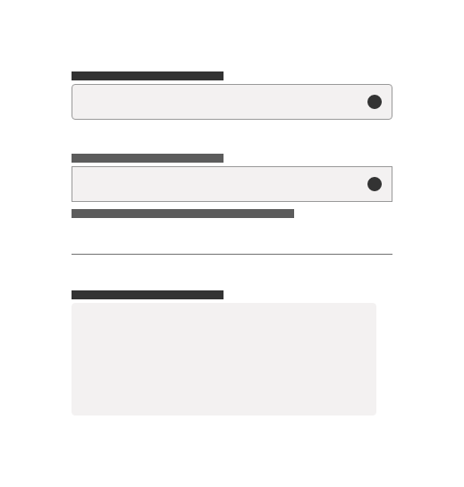
*Grupos de elementos separados por um divider.*

#### Por Cor

Outra possibilidade para se criar agrupamentos é por meio do uso do recurso de cor. Crie uma superfície com uma cor diferenciada de *background* para agrupar elementos. Considere sempre questões de legibilidade ao escolher a cor para o fundo.

**Atenção:** o recurso de agrupamentos por cores pode funcionar também para dar destaque a um agrupamento específico.

Para mais informações, consulte o documento [Fundamentos Visuais > Cores](https://www.gov.br/ds/fundamentos-visuais/cores)

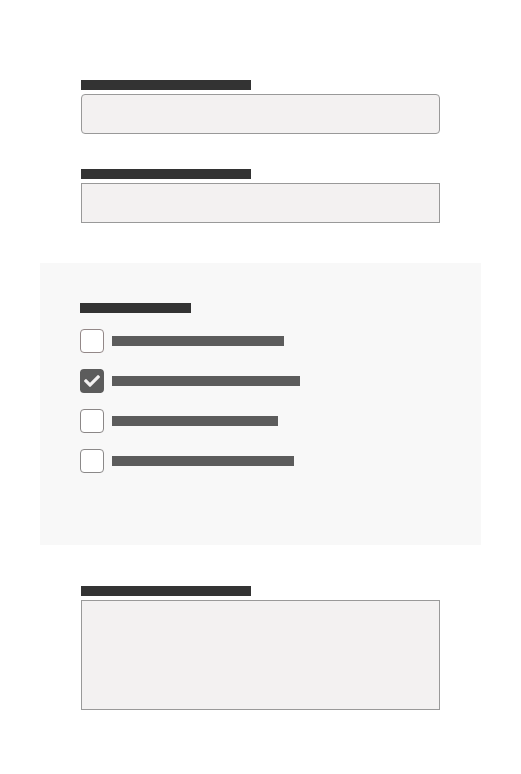
*Agrupando elementos com uma superfície com cor diferente.*

#### Outros Componentes

Formulários muito longos e complexos podem ser mais bem compreendidos pelo usuário com a utilização de componentes que auxiliam na organização de conteúdo na tela, como *tab*, *wizard* e outros.

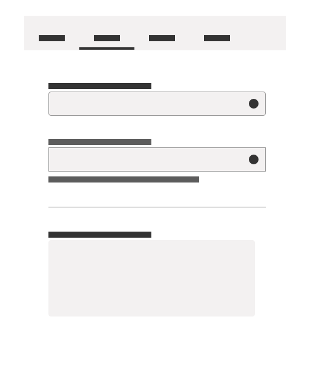
*Exemplo do uso de tabs para organizar conteúdos de formulário em abas.*

### Recomendação Geral

Tenha em mente que todas as recomendações descritas acima são baseadas em boas práticas comumente aceitas e validadas com usuários em diversas pesquisas. Porém, é impossível prever todas as possibilidades e cada caso possui suas próprias peculiaridades. Portanto, o mais importante é sempre buscar soluções pensando no que é o melhor para seus usuários e confirmar suas hipóteses por meio de testes. **Sinta-se livre para buscar novas alternativas.**

----

## Lei Geral de Proteção de Dados

Respeite a Lei Geral de Proteção de Dados e outros regulamentos de privacidade, solicitando o mínimo de informações absolutamente necessárias.

- Todo dado, para ser coletado pelo formulário, precisa ter uma finalidade clara. Isso significa que a coleta precisa ter um propósito conhecido e informado, e não subentendido ou meramente genérico para armazenamento e uso futuro.
- Exiba sempre explicações sobre o motivo da coleta dos dados, principalmente dados pessoais e sensíveis.
- Nos campos de entrada opcionais deixe claro qual o benefício que será oferecido para quem preenchê-los.
- Organize ou agrupe o conteúdo e sua apresentação para facilitar a compreensão do usuário de acordo com seu perfil.
- Exiba os campos de opção de consentimento sem marcação prévia.
- Sempre que possível dê a opção ao usuário de optar como seus dados serão utilizados.
- Ofereça explicações de como o usuário pode retirar seu consentimento, quando for o caso.
- Disponibilize recursos de anonimização de senhas e dados pessoais sensíveis.

*Exemplo de utilização de Ajuda, Mensagens e  Placeholders para adequação do formulário à LGPD.*

### Dados Sigilosos e Dados Anonimizados

Para exibição de campos de formulários em que os dados foram anonimizados, principalmente em adequação à LGPD, utilize uma mensagem do sistema (como o componente *message*) informando que o dado foi anonimizado. Pode-se ainda acrescentar um ícone ou ilustração para reforçar esta condição.

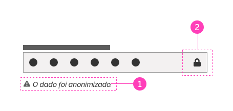
*Exemplo de Input anonimizado utilizando um identificador **(2)** e o componente message **(1)**.*

Caso o componente não esteja preparado para gerar um *feedback* relacionado ao tema, pode-se utilizar uma ilustração que faça a referência à anonimização em conjunto com a mensagem do sistema.

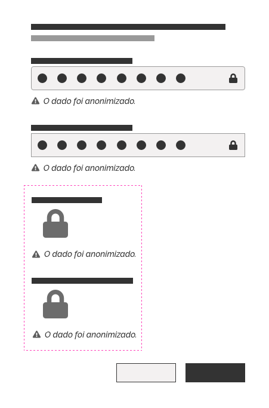
*Após do rótulo do campo, pode-se utilizar uma ilustração além de uma mensagem textual para representar os dados anonimizados.*

### Boas Práticas de LGPD em Políticas de Privacidade

- Use termos simples e de fácil entendimento a um número maior de usuários.

- Evite termos técnicos e “juridiquês”.

- Ofereça opções de consentimento de forma granular para que o usuário possa decidir de forma individual quais dados e de que forma ele poderá ser armazenado, divulgado ou compartilhado. É recomendável a utilização dos componentes *checkbox*, *switch* ou equivalente posicionados imediatamente junto ao texto do questionamento sobre o consentimento.

- Apresente o conteúdo de forma visual. Divida o conteúdo por assunto, tornando-o mais compreensível e escaneável para facilitar a assimilação do conteúdo.

----

## Melhores Práticas

- Todos os campos de entrada dos formulários devem obedecer às regras de acessibilidade da [WCAG](https://guia-wcag.com/).
- Verifique se os usuários conseguem inserir os dados em resoluções de tela menores.
- Garanta que usuários que utilizam o teclado ou outras formas de tecnologia assistiva consigam navegar pelos campos de entrada de dados do formulário corretamente.
- Esteja atento aos gerenciadores de senhas e aos recursos do *browser* que preenchem dados para os usuários.
- Procure elaborar formulários curtos e objetivos. Elimine campos desnecessários, evite solicitar informações que podem ser adquiridas de outra maneira, coletadas posteriormente ou simplesmente omitidas. Se preciso exiba progressivamente informações adicionais.

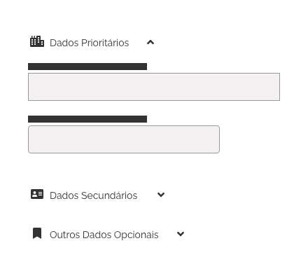
*Exemplo de organização do conteúdo utilizando agrupamentos e iconografia.*

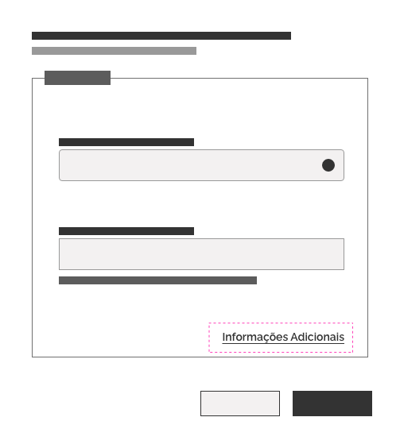
*Exemplo de uso de Informações Adicionais.*

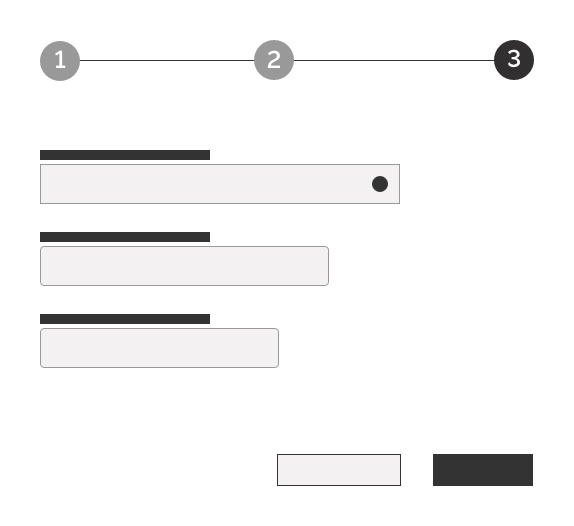
*Exemplo de formulário com exibição progressiva.*

- As recomendações desta diretriz devem funcionar para todos os dispositivos nos quais os formulários serão disponibilizados (*desktop*, *mobile*, etc.).

- Permita que os usuários decidam a forma que preferem navegar entre os campos de entrada, seja por meio do teclado, seja por meio do *mouse* e que eles possam alternar no momento que desejarem.

- Informe qualquer situação em que o usuário tenha que aguardar o sistema processar um comando, realizar verificações ou carregar dados. Utilize os componentes *loading* ou mesmo o componente *message* para informar a situação geral do sistema.

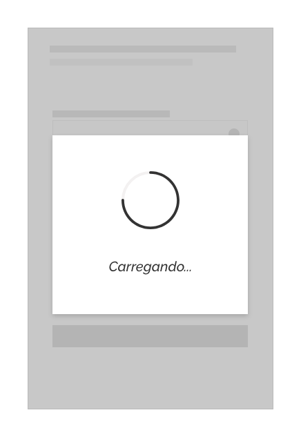
*Exemplo do Componente Loading*

----

## Referências

Caso deseje se aprofundar mais no assunto, consulte os *sites* abaixo que foram utilizados como referência para a criação desse documento.

- Website Forms Usability: [Top 10 Recommendations, By Kathryn Whitenton from Nielsen Norman Group on May 1, 2016](https://www.nngroup.com/articles/web-form-design/) - online em 29 de julho de 2020.
- Web Accessibility Tutorials Guidance on how to create websites that meet WCAG - [Forms Concepts, Eric Eggert e Shadi Abou-Zahra on 27 July 2019 (first published September 2014)](https://www.w3.org/WAI/tutorials/forms/) - online em 29 de julho de 2020.
- [UX Center](https://serprogovbr.sharepoint.com/sites/UXCenter)
