[version]: # (1.0.1)

Os gráficos são representações visuais de dados e informações numéricas que servem para facilitar sua visualização, bem como para torná-los mais claros e informativos.

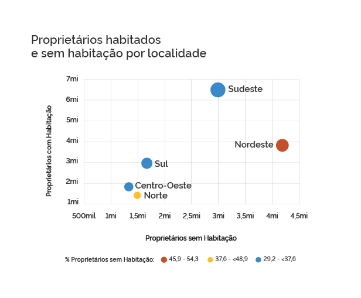
 *Exemplo de gráfico*

Utilize gráfico para demonstrar padrões, tendências ou comparar informações qualitativas e quantitativas em um determinado espaço de tempo.

---

## Anatomia

Geralmente os gráficos são compostos pelas seguintes áreas:

1. Área de Cabeçalho (opcional);
    1.1. Título;
    1.2. Subtítulo (opcional);
2. Área Principal;
    2.1. Dados Gráficos;
3. Área de Rodapé (opcional);
    3.1. Descrição (opcional);
    3.2. Fonte (opcional).

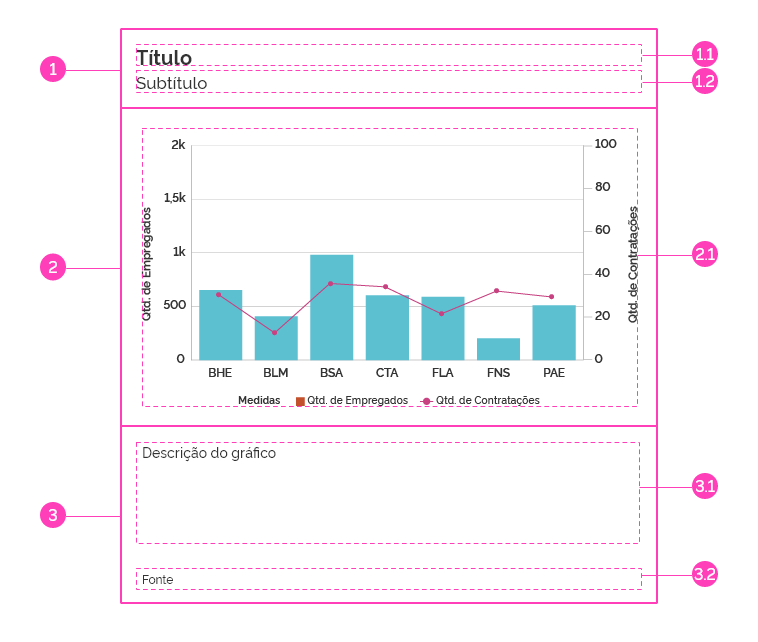
*Anatomia do gráfico.*

## Detalhamento dos itens

### Áreas

Podemos dividir a superfície do gráfico em três áreas distintas. Estas áreas podem ser, de acordo com a necessidade, intercambiáveis, ou seja, a ordem das áreas poderão ser modificadas. Sendo:

### 1- Área cabeçalho (Opcional)

Área definida para exibição do título, subtítulos.

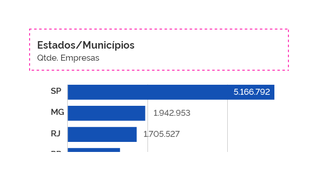
*Exemplo do uso da área cabeçalho.*

#### 1.1- Título

Presente na maioria dos gráficos, o título tem o objetivo de orientar e ajudar o usuário a interpretar o gráfico.

#### 1.2. Subtítulo (opcional)

Informação opcional que tem por finalidade complementar as informações apresentadas no título.

### 2- Área principal

Área definida para apresentação dos dados gráficos, todos os tipos de gráficos poderão ser apresentados nessa área. Busque mais informações na seção "Tipos de Gráficos".

#### 2.1- Dados gráficos

Refere-se ao gráfico em si. A definição do tipo de gráfico, sua dimensão e uso de legendas, dependerá dos direcionamentos de cada projeto e da percepção do *designer*. É aconselhável a realização de testes de legibilidade e usabilidade com alguns usuários, para validar o nível de leitura, diagramação e ergonomia informacional dos dados. Tanto para gráficos estáticos quanto para gráficos dinâmicos, onde as informações são constantemente atualizadas.

Caso haja necessidade, o gráfico poderá fazer uso de elementos, ações e recursos de navegação que o auxilie na apresentação das informações, tais como: [tootip](/ds/components/modal?tab=desenvolvedor), [barra de rolagem](/ds/components/modal?tab=desenvolvedor), seletores, links, filtros de dados, além de ações para expandir, aproximar ou afastar sua visualização, etc.

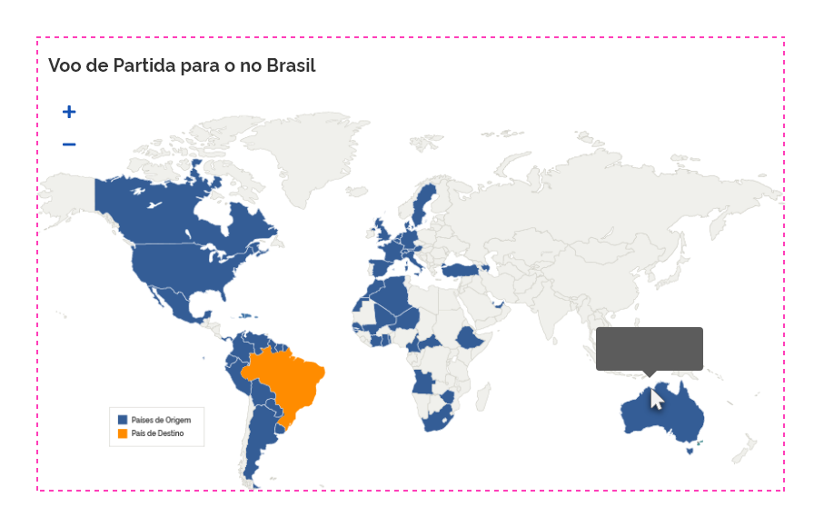
*Exemplo do uso do tooltip em um gráfico do tipo Mapa Geográfico na área principal.*

Outros recursos igualmente importante e que poderão ser utilizados em gráficos dinâmicos, são os valores definidos no [fundamento movimento](/ds/fundamentos-visuais/movimento), tais como: transições, *easing* e a duração.

Não existe uma forma única de apresentá-los, geralmente os gráficos podem ser apresentados através dos dados com a utilização de eixos (x,y), legendas, linhas de grade, títulos dos eixos, etc. Sua apresentação e organização dependerá da necessidade ou da limitação da ferramenta utilizada para sua criação e exibição.

### 3- Área de rodapé (opcional)

A área de rodapé se destina a conter informações textuais sobre o gráfico, tais como: a descrição do gráfico e a fonte que originou seus dados.

#### 3.1- Descrição (opcional)

Visa apresentar um texto descritivo detalhando as informações apesentadas no gráfico, buscando facilitar, desta forma, o entendimento dos dados apresentados para pessoas que possuem algum tipo de décifit de atenção ou que possua alguma dificuldade em interpretar com facilidade as informações apresentadas. Maiores informações na área de Acessibilidade em "Uso de Descrições".

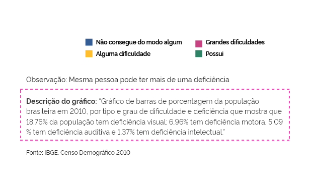
*Exemplo do uso da descrição do gráfico.*

#### 3.2- Fonte (opcional)

É a descrição textual da origem da informação apesentada no gráfico, ou seja, de onde as informações foram retiradas. Mesmo sendo de uso opcional, o ideal é que, sempre que possível, a fonte esteja na Área de Rodapé, próximo ao gráfico que o ilustra, fornecendo informações sobre onde ele foi originalmente publicado.

O ideal, sempre que possível, é obter a permissão do autor(a) dos dados para reproduzi-los.

Caso não seja possível, algumas ações de boas práticas deverão ser tomadas, tais como:

- Apresentar data, ano, número da tabela;
- Informar a editora ou local de publicação;
- Descrever os direitos autorais do titular da informação;
- Utilizar *link* direto para endereço eletrônico (site), onde o usuário poderá ter acesso aos dados originais ou a informações complementares.

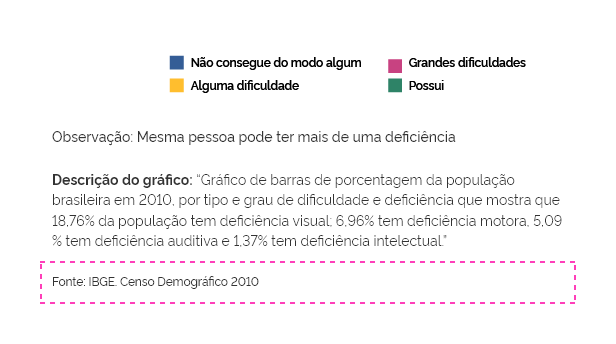
*Exemplo do uso da fonte de um gráfico.*

---

## Tipos de gráficos

É importante entender as motivações ou os "porquês" para fazer a melhor escolha do tipo de gráfico que será utilizado, evitando confusões e problemas na interpretação dos dados, por isso é preciso saber qual tipo de gráfico é mais indicado em cada situação específica. Segue abaixo a descrição de alguns dos principais tipos de gráficos.

### Gráficos de colunas e barras

Costumam ser utilizados para comparar quantidades, apresentando variações que mostram a intensidade de determinado fenômeno, em comparação com um período de tempo, por exemplo.

#### Gráfico de colunas

Nos gráficos de colunas, são utilizados retângulos paralelos e verticais com larguras iguais, porém,o comprimento é diretamente proporcional à frequência dos elementos apresentados. As colunas devem ser igualmente espaçadas. Este tipo de gráfico faz uma comparação prática entre as frequências dos elementos.

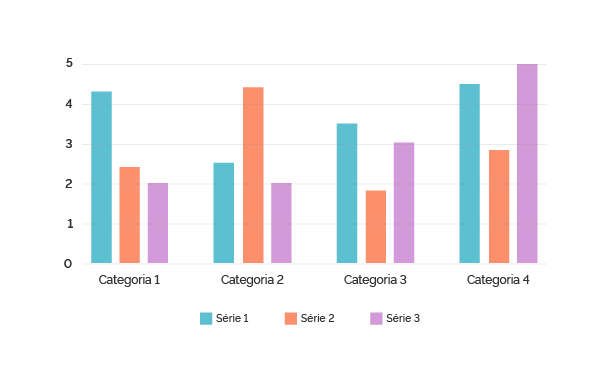
*Exemplo de Gráfico de Colunas.*

#### Gráfico em barras

É similar ao gráfico de colunas, mas com os valores dos dados dispostos na posição horizontal, enquanto as informações comparativas aparecem na vertical. Os gráficos de barra são perfeitos para criar um *ranking* comparativo, como uma lista dos cinco melhores, por exemplo. Ele é recomendado quando é preciso trabalhar com rótulos de dados muito longos, ou quando os eixos utilizados estão relacionados ao tempo empregado em determinada situação.

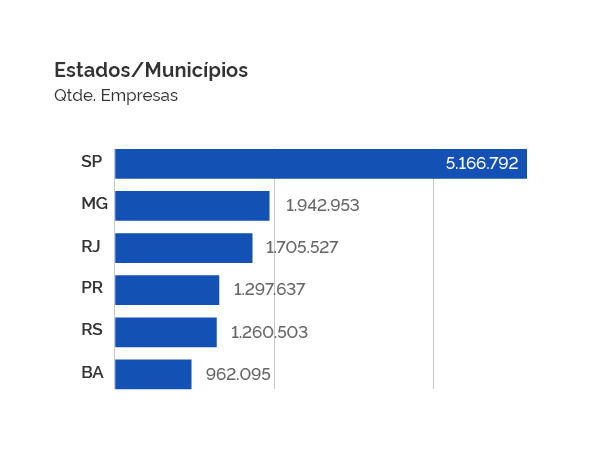
*Exemplo de Gráfico em Barras.*

#### Quando usar

- São especialmente eficazes quando você tem dados que podem ser divididos pelos elementos de uma Dimensão (ex: elementos da Dimensão UF: AC, Al, CE…) bem como destacar diferenças, mostrar tendências, *outliers* e revelar rapidamente os altos e baixos históricos;
- Também é utilizado quando for preciso exibir a soma ou quantidade agrupada por uma Dimensão de modo a identificar os maiores e os menores valores;
- O gráfico de barras horizontais, por exemplo, são recomendados para dados em que o texto da dimensão seja longo, evitando assim que o texto do eixo fique ilegível devido ao tamanho;
- Caso tenha dados positivos e negativos a comparar a utilização deste tipo de gráfico destaca tendências e elementos atípicos.

#### Quando não usar

- Caso a variação entre os valores dos dados seja pequena, pois a altura/comprimento do gráfico de barras irá variar pouco e não haverá destaque significativo da diferença entre os dados.

#### Boas práticas

- Mostrar, se possível, o valor de cada coluna ou barra;
- Sempre que possível, ordenar as colunas ou barras em ordem crescente ou descrente para adicionar uma dimensão extra de informação facilmente identificável pelo usuário;
- O espaçamento entre as colunas ou barras do gráfico deve ser pelo menos metade do tamanho da barra, isso aumenta a legibilidade;
- Sempre nomear os eixos para que o usuário seja contextualizado;
- Evitar usar muitas cores "efeito arco-íris". Usar uma única cor ou alguns tons da mesma cor é uma prática muito melhor. Você pode destacar uma barra em particular se essa for a mensagem que você deseja transmitir;

### Gráfico de pizza e rosca

Também conhecidos como Gráfico Torta ou de Setores, este modelo servem para mostrar um número estático e como as categorias representam parte de um todo. Ele deve representar seus valores em percentuais e a soma de todas as categorias, precisa ser igual a 100%.

#### Gráfico de pizza

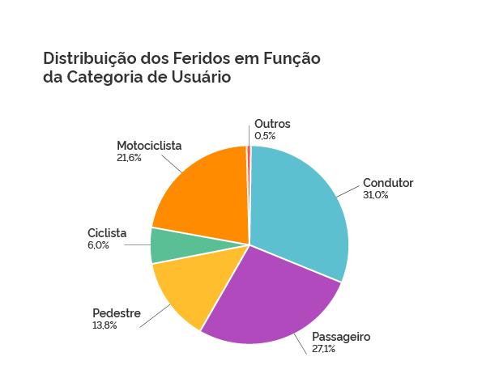
*Exemplo de Gráfico em Pizza.*

#### Gráfico de rosca

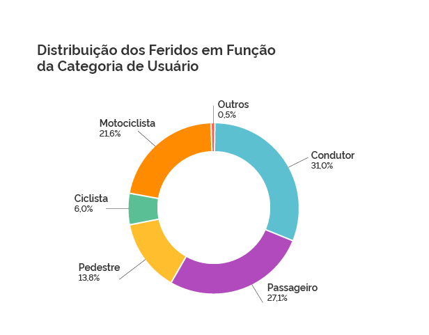
*Exemplo de Gráfico de Rosca.*

#### Quando usar

- Um conjunto de dados gráficos de pizza são eficientes para categorizar e comparar um conjunto de dados;
- Os gráficos de pizza não podem exibir zeros e podem ser confusos ao trabalhar com valores negativos;
- Use sete ou menos categorias, pois fica cada vez mais fácil perceber o tamanho relativo de cada segmento, ao trabalhar com mais de sete categorias fica mais difícil e não é de forma alguma indicado.

#### Quando não usar

- Sempre que possível evite usar este tipo de gráfico, pois o mesmo não é muito  representativo;
- Se temos um gráfico de pizza com pequenas diferenças entre as fatias, não conseguimos percebê-las muito bem. Desta forma, simplesmente, a informação não será captada. Se usarmos um gráfico de barras ou colunas para a mesma informação, seremos capazes de perceber as menores variações entre os valores;
- Se os dados forem ordinais ou sequenciais este gráfico não deve ser usado, por exemplo, uma pesquisa em que temos: concordo totalmente, concordo parcialmente, discordo parcialmente e discordo totalmente, representado em um gráfico empilhado mostra diretamente as faixas;
- Se os dados forem de séries temporais o gráfico de pizza/rosca não mostrará a evolução da série e pode induzir a *insights* errados;
- Não use vários gráficos de pizza/rosca para comparações, a informação se dificulta a interpretação do usuário, por exemplo, a comparação entre quatro empresas quanto ao percentual de funcionários por gênero, um gráfico de barras ou uma variação do mesmo é mais indicado.

#### Boas práticas

- Um motivo para não usar este tipo de gráfico é porque nossos olhos têm mais dificuldade de identificar ângulos e de comparar áreas;
- Outro motivo para não usar este tipo de gráfico é porque quando, por exemplo, você tem muitas categorias, as que têm valores abaixo de 5% ficam literalmente escondidas;
- Quando você tem muitas categorias, você precisa de cores para salientar essas diferenças, entretanto é difícil escolher cores de forma eficiente por conta do posicionamento das categorias no gráfico.  Um fato importante: 8% da população masculina é daltônica ou sofre de algum tipo de dificuldade em perceber cores. Você vai arriscar usar um gráfico que depende tanto assim de cores?;
- Perceber rapidamente a diferença entre valores próximos (ex.: 38% vs 33%) é bem complicado num gráfico de pizza. Faça um teste: remova os *labels* de um gráfico de pizza e tente adivinhar o percentual. E fica pior quando você quer comparar dados de muitas categorias em momentos diferentes;
- Se tiver que usá-lo use, pelo menos, o gráfico de rosca; o espaço em branco dentro dele pode ser usado para exibir mais informações.

### Gráfico em linhas e áreas

#### Gráfico de linhas

Os gráficos de linhas têm a função de revelar tendências e progressos ao longo do tempo. Você deve usá-los quando estiver traçando um conjunto de dados contínuos.Este tipo de gráfico, em geral, funciona muito bem,mesmo quando você estiver trabalhando com muitas categorias diferentes de dados.

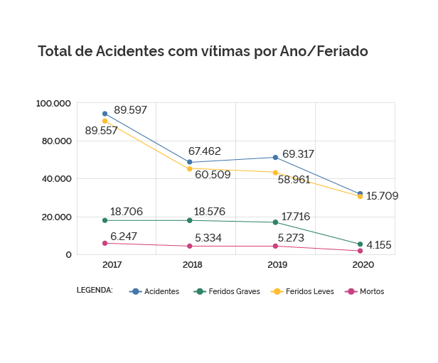
*Exemplo de Gráfico em Linhas.*

#### Gráfico de áreas

Também chamado de Gráfico de Segmento, serve para apresentar valores (numéricos) em determinado espaço-tempo. Mostra as evoluções e diminuições de determinado fenômeno.

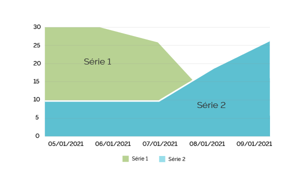
*Exemplo de Gráfico de Áreas.*

#### Quando usar

- Este deve ser utilizado quando as análises forem QUANTITATIVAS, exemplo: Faturamento anual; custo médio mensal; despesas trimestrais, etc.;
- Na comparação de dados desde que os eixos sigam as mesmas escalas.

#### Quando não usar

- Caso tenha mais de um atributo e mais de uma métrica ele ficará muito confuso;
- Quando seus dados não possuem um intervalo ou período contínuo.

#### Boas práticas

- Ideal para análise ao longo do tempo;
- Evite usar mais de 3 a 4 linhas por gráfico, pois isso torna o gráfico mais confuso e mais difícil de ler.

### Histograma

A diferença do histograma para o gráfico de colunas está no fato do primeiro não apresentar espaço entre as barras verticais.
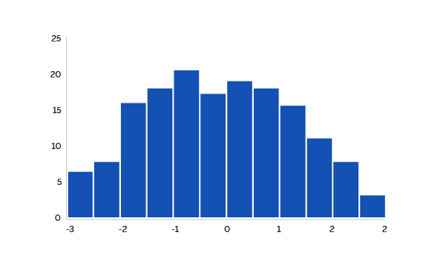
*Exemplo de Gráfico em Histograma.*

**Obs.:** Exitem diferentes modelos de gráficos do tipo histograma. São eles: simétricos, assimétricos, desempenho, dois picos, achatado e pico Isolado.

#### Quando usar

- Verificar o número de produto não-conforme;
- Determinar a dispersão dos valores de medidas em peças;
- Em processos que necessitam ações corretivas;
- Para encontrar e mostrar através de gráfico o número de unidade por cada categoria;
- Para mostrar a simetria de um conjunto de dados;
- Para mostrar qual o valor mais comum em um conjunto;
- Para verificar a existência de um ou mais picos no conjunto de valores;
- Verificar a existência de tendências de alguns valores estarem presentes ou ausentes;
- Para resumir uma variedade de dados graficamente (população muito grande).

#### Quando não usar

- Fica ilegível quando se necessita a comparação de muitas sequências em simultâneo;
- Quanto maior o tamanho de (n) maior o custo de amostragem e teste;
- Para um grupo de informações é necessário a confecção de vários gráficos de modo a conseguir uma melhor compreensão dos dados contidos no histograma;
- Quando é necessário relacionar o tempo com os dados, por exemplo, não sei se todos os dias bons aconteceram na mesma época ou se eles estão dispersos aleatoriamente no processo;
- Quando há dois picos de alta frequência, sugerimos a separação em dois histogramas.

#### Boas práticas

- Para uma amostra confiável e significativa tenha pelo menos de 50 a 100 dados;
- Determine o número de classes, não há uma quantidade certa, porém é preciso um meio-termo, ou seja, não deve ser muito pequeno, para não descaracterizar o histograma, e nem muito grande, para espalhar muito os dados;
- Procure utilizar uma única cor no histograma, más, caso necessite de algum destaque, utilize entre duas a três cores;

### Gráfico de dispersão e bolhas

São gráficos que analisam a relação entre duas ou mais variáveis. Pode ser empregado para identificar onde estão as causas dos problemas ou para avaliar ações que estão dando certo para um determinado negócio.

#### Gráfico de dispersão

O diagrama de dispersão é conhecido como uma das principais ferramentas da qualidade que podem ser utilizadas em uma empresa.

Trata-se de uma representação gráfica que analisa a relação entre duas variáveis quantitativas — uma de causa e uma de efeito. Quando você tem uma hipótese do que causou algo, mas ainda deseja comprová-la por meio de uma análise mais aprofundada.

Esse tipo de diagrama traz números simultâneos das duas variáveis, deixando visível se o que acontece em uma variável causou interferência na outra. Ao estudar a correlação, você tem uma variável dependente Y (efeito), que se relaciona a variáveis independentes X (causas). Permitindo verificar se essas variáveis estão posicionadas em uma relação de causa e efeito.

O modelo hipotético seria, portanto, **y = f (x)**.

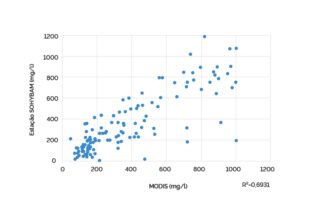
*Exemplo de gráfico de dispersão.*

Os Diagramas de Dispersão são classificados quanto a relação entre as variáveis, se é negativa, positiva ou nula, e quanto à intensidade da relação entre elas, que pode ser fraca, forte ou perfeita. Dessa forma, você pode se perguntar: o que acontece com determinada variável quando a outra se altera?

- **Positiva:** quando os pontos se unem em uma linha crescente. Isso quer dizer que, assim que uma variável aumenta, a outra também cresce;
- **Negativa:** quando os pontos se unem em uma linha decrescente. O que significa que, à medida que uma variável aumenta, a outra diminui;
- **Nula:** quando os pontos estão bem dispersos e, portanto, indica que não há correlação aparente entre as duas variáveis;
- **Forte** quanto menor for a dispersão dos pontos, maior será a correlação entre os dados. Com isso, podemos identificar como forte quando os dados estão bem próximos, altamente concentrados;
- **Fraca** quanto maior for a dispersão dos pontos, menor será o grau de correlação entre os dados, ou seja, eles quase não possuem uma correlação;
- **Perfeita** quando não há uma grande dispersão entre os pontos, a correlação será total entre os dados, independente da tendência, seja ela positiva ou negativa.

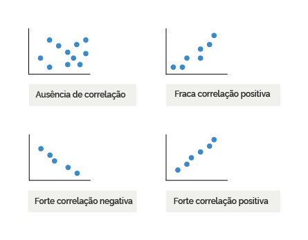
*Exemplo de diagramas de dispersão.*

#### Gráfico de bolhas

É uma representação visual de objetos de dados em três dimensões de dados numéricos (os dados do eixo X, os dados do eixo Y e os dados representados pelo tamanho da bolha). Esse tipo de gráfico é frequentemente usado nos negócios para comparar e visualizar os relacionamentos, por exemplo, entre projetos ou alternativas de investimento em várias dimensões, como custo, valor e risco.

Há uma ligação forte entre os gráficos de dispersão e bolha, mas apesar das diversas similaridades o detalhe que torna o gráfico de bolha ímpar é a utilização de uma terceira variável. Enquanto no de dispersão temos as tradicionais relações entre as variáveis x e y, no gráfico de bolha temos a variável z que representa o **tamanho ou área da bolha**. Na imagem a seguir temos um exemplo característico deste tipo de gráfico.


*Exemplo de uso do gráfico de bolhas.*

#### Quando usá-los

- Para visualizar uma variável com outra e o que acontece se uma alterar;
- Para verificar se as duas variáveis estão relacionadas, ou se há uma possível relação de causa e efeito;
- Para visualizar a intensidade do relacionamento entre as duas variáveis, e comparar a relação entre os dois efeitos;
- Para mostrar as relações entre dois valores numéricos;
- Para plotar dois grupos de números como uma série de coordenadas X e Y;
- Para usar em vez de um gráfico de linhas quando desejar alterar a escala do eixo horizontal;
- Para transformar o eixo horizontal em uma escala logarítmica;
- Para exibir os dados da planilha que incluem pares ou conjuntos de valores agrupados;
- Para mostrar padrões em grandes conjuntos de dados, por exemplo, mostrando exceções, clusters e tendências lineares ou não lineares;
- Para comparar grandes números de pontos de dados sem preocupação com o tempo. Quanto mais dados você incluir em um gráfico de dispersão, melhores serão as comparações que você poderá fazer;
- Utilize o gráfico de bolhas para comparar e mostrar os relacionamentos entre círculos categorizados, usando posicionamento e proporções.

#### Quando não usá-los

- Quando só existir uma variável ou mais de uma dimensão.
- Quando as variáveis não afetam uma a outra.

#### Boas práticas

- Os gráficos de bolhas permitem comparar mais dados, mas o número de categorias que você pode “mapear” é limitado. Muitas bolhas em um gráfico podem parecer caóticas. Lembre-se, menos é mais. Mostrar apenas as categorias que são importantes;
- Bolhas demais podem dificultar a leitura do gráfico, portanto, os gráficos de bolhas têm uma capacidade de tamanho de dados limitada. Isso pode ser um pouco remediado pela interatividade: clicar ou passar o mouse sobre bolhas para exibir informações ocultas, tendo a opção de reorganizar ou filtrar categorias agrupadas;
- Torne o gráfico mais legível mantendo as bolhas transparentes para tornar visíveis as bolhas "ocultas" e ajudar a detectar o centro de cada círculo;
- Os tamanhos dos círculos precisam ser desenhados com base na área do círculo, não em seu raio ou diâmetro. Não só o tamanho dos círculos mudará exponencialmente, mas isso levará a interpretações erradas pelo sistema visual humano;
- Sempre que possível, não utilize cores diversas, mas sim variações de um mesmo tom ou uma faixa de degradê, por exemplo de vermelho a azul, desta forma você conseguirá destacar os extremos e as variações serão pertinentes a esses extremos;

### Outros tipos de gráficos

Além dos gráficos apresentados, existem uma grande variedade de gráficos, todas com características e aplicações próprias. Alguns gráficos podem representar visualmente com eficiência as informações apresentadas, facilitando a interpretação e visualização dos dados. Caso a escolha não tenha sido apropriado, o gráfico pode agir de forma completamente oposta ao desejado. Por isso é muito importante conhecer os principais tipos e suas características de uso. Para mais informações, estamos disponibilizando o arquivo detalhado para download: [Design System para Painéis Analíticos v1.0.0](https://serprodrive.serpro.gov.br/s/AnEwBrA8TwdnGdH) | Formato PDF - 5,17 MB

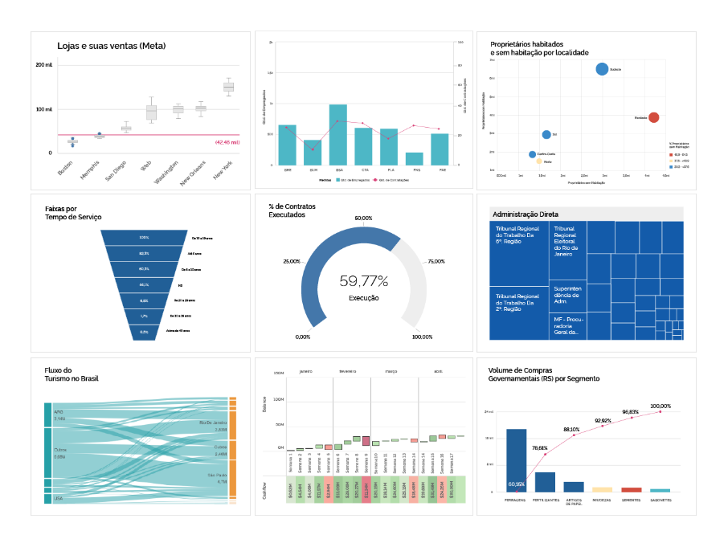
*Exemplo de outros tipos de gráficos.*

## Como escolher um gráfico?

Escolher um gráfico, mesmo entendendo os tipos existentes, pode ser uma tarefa bastante complicada. Entender o seu problema pode ser a chave para a escolha de um gráfico adequado. Neste ponto, alguns fatores devem ser levantados, tais como:

- Qual informação deseja transmitir através do gráfico?
- Quantas variáveis, itens ou categorias seu gráfico irá mostrar?;
- Quem é o público que vai ler os seus gráficos?.

Com estes dados em mente ficará mais fácil chegar no gráfico ideal para o seu projeto.

O fluxograma abaixo simplifica todos estes passos:

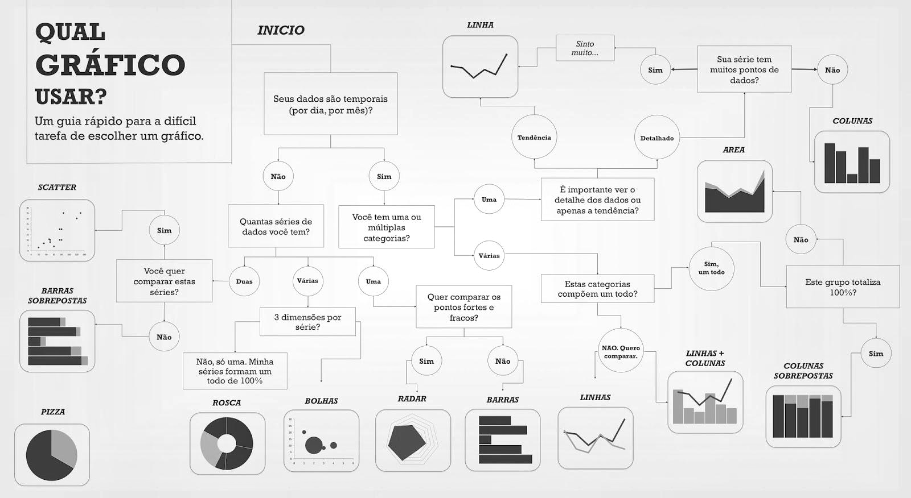
*Fluxograma para auxiliar na escolha do gráfico.*

Faça sua escolha considerando o seu objetivo, ou seja, o que você pretende mostrar, mas também, o entendimento de quem vai ler o gráfico. Afinal, não basta que a informação esteja disponível, ela precisa ser entendida para ser útil. Lembre-se também que muitas informações (variáveis, itens ou categorias) podem enriquecer o gráfico, mas também podem fazer você pecar pelo excesso de informação. Gráficos poluídos dificultam a leitura e compreensão da informação.

### Quais tecnologias poderão ser utilizadas e como utilizá-las?

Existem diversas opções disponíveis no mercado, desde as mais simples e manuais até softwares online que, automaticamente geram alguns gráficos para você, porém, o Design System não limita quais tipos de ferramentas deverão ser utilizadas. O Design System, através desta documentação, busca oferecer diretrizes e regras de boas práticas de uso para que os gráficos sejam consistentes e possam ajudar os usuários no entendimento dos dados propostos.

---

## Acessibilidade

Sua interface deve permitir que todos os usuários possam ter acesso e compreender informações exibidas, independente se possuem ou não alguma limitação. Para gráficos, infográficos ou mapas essa premissa também é verdade.

Experiências equivalentes para todo o seu público deve ser considerada. É preciso fornecer recursos de acesso e compreensão para todos os usuários, em todos os seus dispositivos.

Em geral, não se deve confiar em apenas uma única maneira de transmitir uma ideia. É necessário adicionar representações redundantes para as informações visuais que são consideradas mais relevantes.

Vejamos alguns exemplos de uso para reflexão:

- Caso esteja usando cores para destacar informações, pense em como você pode transmitir as mesmas distinções para pessoas que, apesar de serem videntes, não conseguem fazer a identificação adequada de cores (daltonismo);
- Apresentando tabelas de dados como alternativa para apresentação de gráficos? Pense em como as pessoas com baixa visão, e também como as pessoas totalmente videntes, se beneficiam mais de visualizações nítidas e com um bom contraste;
- Usando animação? Considere as pessoas com epilepsia, neurotípicas, TDAH ou deficiências cognitivas e disponibilize para eles a opção de controle da animação;
- Utilizando em sua apresentação metáforas e símbolos? Considere como as pessoas com deficiências cognitivas interpretarão as suas informações;
- Usando sons? Como sonorização dos dados gráficos, aspectos de textos falados, pense nas pessoas com deficiência auditiva.

Como dito antes, não confie em um único canal de informação para disponibilizar as mensagens visuais mais importantes, a verdadeira acessibilidade significa contar a sua história de dados para todos.

### Recomendações para apresentação de dados visuais

Criar gráficos acessíveis pode ser um trabalho subjetivo, que pode depender de muitos fatores: como a análise dos dados apresentados ou até do tipo de gráfico (ver Tipo de Gráficos). Porém, alguns cuidados gerais podem ser levados em consideração para elevar o acesso dos gráficos aos usuários.

#### 1- Uso de descrições

Inclua textos com descrições eficazes para apresentar os gráficos, infográficos e mapas.

Pessoas com deficiência visual (não videntes), fazem uso de leitores de tela (softwares que leem os textos presentes na tela), portanto se houver algo na tela que não seja texto, ficará oculto para este aplicativo. As imagens precisam de descrições de texto, também chamada de "**texto alternativo**".

Imagens mais complexas como gráficos, infográficos ou mapas precisam de descrições de texto eficazes (**descrições longas**), tanto para ser utilizado através de um leitor de tela, facilitando a compreensão dos dados pelo usuário com necessidades especiais, quanto para pessoas, que possuam dificuldades cognitivas ou de interpretação dos gráficos.

Com as descrições longas, adicione informações descrevendo o **tipo de gráfico**, **tipo de dado** e o **propósito do gráfico**.

- **Tipo de gráfico:** É útil para que pessoas com visão limitada saibam qual o tipo de gráfico está sendo usado. Isso dá contexto para que se entenda o restante do visual;
Exemplo: Gráfico de Linha
- **Tipo de dado:** Qual tipo de dado é apresentado no gráfico? As legendas dos eixos x e y podem ajudar você a descrever isso;
Exemplo: Número de carros vendidos por mês no último ano.
- **Propósito do gráfico:** Pense por que você está incluindo esse elemento visual. O que ele mostra de significativo.
Exemplo: Os meses de verão apresentam mais vendas de carros

Segue abaixo, exemplo de como utilizar uma descrição longa para garantir que um gráfico seja ainda mais acessível:
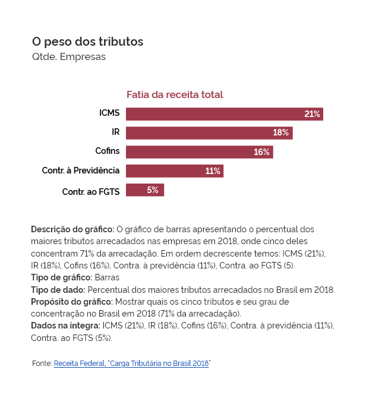
*Exemplo de gráfico com o uso da descrição longa.*

Como no exemplo acima, pode se utilizar um hiperlink para a base de dados original, de modo que qualquer usuário possa acessar os dados em seu programa de preferência (Excel, OpenOffice Calc, etc). Essa alternativa permite que pessoas possam clicar em um link para observar melhor os dados e se aprofundar neles. Essa condição provê transparência sobre o seu recurso e permite às pessoas explorar os dados.

Quando utilizar links, mantenha se atendo a associar o link de forma semântica a imagem. No HTML5 os elementos `figure` e `figcaption` podem ser usados ​​para agrupar imagens e vincular semanticamente. Adicionar `role="group"` à imagem mantém a compatibilidade com navegadores da web que não oferecem suporte à semântica nativa do elemento `figure`.

##### A- Texto alternativo em gráficos

Por padrão, o texto alternativo é inseridos pelo atributo `alt` do código html, permitindo sua transcrição por leitores de telas, transmitindo de forma oral as informações contidas no gráfico, garantido desta forma, que as informações se torne acessíveis.

``` html

```

Recomendações para o uso de textos alternativos em gráficos, infográficos, tabelas e mapas:

- Adicione textos alternativos focando na informação significativa na imagem;
- Inclua um texto sucinto e consistente descrevendo o **tipo de gráfico** e o **tipo de dado**;
- Muitos leitores de tela cortam textos alternativos em 125 caracteres, então mantenha seu texto alternativo o mais enxuto quando for possível.

##### B- Descrições longas em gráficos

As descrições longas podem ser utilizadas em conjunto com o texto alternativo. Uma descrição longa em gráfico, infográfico, tabela e mapa apresenta as seguintes vantagens:

- Compreensão adequada de cada elemento visual por pessoas cegas ou com baixa visão que fazem uso de leitores de tela;
- Ajuda pessoas com deficiência intelectual, neurotípicos ou pessoas não deficientes que não estão acostumadas a interpretar gráficos, tabelas, infográficos  ou mapas.

O World Wide Web Consortium (W3C), oferece orientações em como descrever textos longos para imagens complexas contendo exemplos para linguagem HTML 5 ([Web Accessibility Tutorials - Complex Images](https://www.w3.org/WAI/tutorials/images/complex/#long-descriptions)).

Em resumo, o texto descritivo pode ser inseridos pelo atributo `longdesc` ou `aria-describedby`.

``` html

<div id="chart-longdesc">
  O gráfico de barras representa o percentual dos maiores tributos arrecadados nas empresas em 2018, onde cinco deles concentram 71% da arrecadação. Em ordem decrescente temos: ICMS (21%), IR (18%), Cofins (16%), Contra. à previdência (11%), Contra. ao FGTS (5).
</div>
```

#### 2- Uso de rótulo por legendas diretas

Rotule os dados diretamente com legendas diretas ao invés de utilizá-las de forma separada. Desta forma, conseguimos perceber as informações independentemente das cores, além de ser uma maneira de reduzir a carga cognitiva sobre os usuários.

Isso é especialmente útil para usuários daltônicos ou deficientes visuais que podem ter dificuldade em combinar as cores do gráfico com as da legenda. Também diminui o trabalho de varredura para frente e para trás, tentando combinar a legenda com os dados, para os usuários videntes.

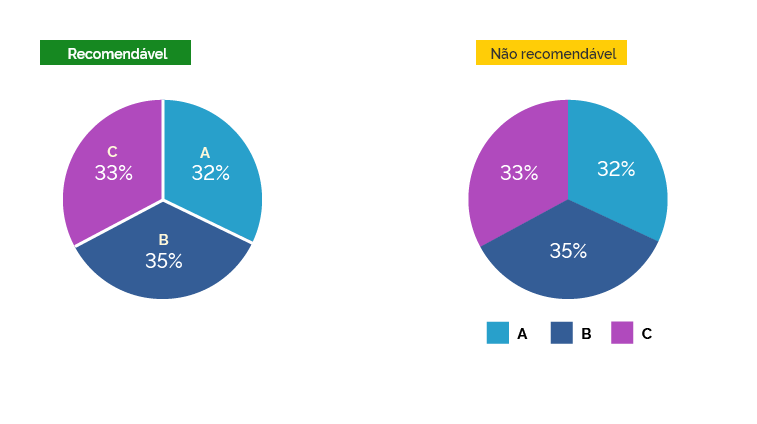
*À esquerda, um gráfico de pizza com três séries representadas com cores parecidas e legendas à parte. Á direita, um gráfico de pizza com três séries representadas com cores parecidas e legendas.*

#### 3- Uso de cores

Esteja atento ao uso da cores e contrastes. Não dependa apenas da cor para conectar os dados ao seu significado, considerar as pessoas com daltonismo e garanta que exista um contraste de cor adequado, pois nem todo mundo enxerga as cores da mesma maneira, e é preciso levar isso em conta na hora de criar a sua solução para visualizações de dados, como gráficos, tabelas, infográficos e mapas.

O principal motivo  para isso é que existem diferentes tipos de daltonismo (dificuldade na identificação e distinção de cores):

- **Protanopia:** Dificuldade de visualizar o espectro "vermelho";
- **Deuteranopia:** Dificuldade de visualizar o espectro "verde";
- **Tritanopia:** Dificuldade de visualizar o espectro "azul".

As cores também podem variar de acordo com o modo de acesso a informação visual: como um leitor digital de livros em preto e branco(como um e-Book), uma tela de computador com configuração de cor alterada, ou mesmo uma impressão em preto e branco ou de má qualidade.

Por isso, é importante buscar estratégias que facilitem o entendimento de nossas visualizações de dados, independentemente das cores escolhidas para serem utilizadas na solução de visualização.

##### Cuidados ao escolher as cores

É importante deixar claro que a cor não é imprescindível. Não devemos confiar unicamente na cor para passar alguma informação importante. Utilize ícones, texto e até mesmo textura para deixar uma informação clara, veja o tópico "5- Uso de Elementos Visuais" para maiores informações.

Para deixarmos a visualização da apresentação dos dados visuais mais acessível, utilize as paletas de cores encontradas no nosso [Fundamento Visual Cores](/ds/fundamentos-visuais/cores) e observe as seguintes orientações:

###### 3.1- Garanta um bom contraste entre cores e elementos

Leve em consideração o tamanho dos elementos, fontes e o contexto de seu uso. É importante escolher as cores que tenham contraste suficiente para atender o máximo possível de pessoas, sejam elas deficientes ou não.

Podemos dizer que um contraste entre os elementos de 4,5:1 pode resolver a maioria dos situações, Porém, quando tratamos de assuntos relacionados a problemas visuais (como o daltonismo), seria interessante trabalhar com contraste a partir de 10:1.

Em geral, *devemos evitar combinações* entre:

1- Vermelho e Verde;
2- Verde e Marrom;
3- Verde e Azul;
4- Verde e Cinza;
5- Verde e Preto;
6- Azul e Cinza;
7- Azul e Roxo.

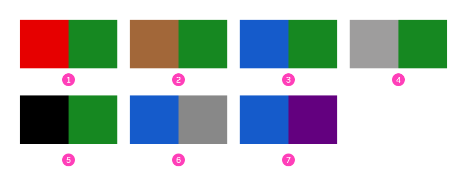
*Exemplo de combinações de cor que devem ser evitadas.*

###### 3.2- Evite o uso excessivo de cores

Utilize poucas famílias de cores para criar sua paleta.

A maior parte dos erros na elaboração dos gráficos diz respeito ao uso das cores em excesso.
Esse erro traz uma atmosfera de desorganização e "confusão visual". Tudo o que for excessivo sai do escopo da visão centralizada e atrapalha a interpretação da informação por parte do usuário. As cores certas podem ajudar a chamar a atenção do leitor e a fazer um argumento mais forte.

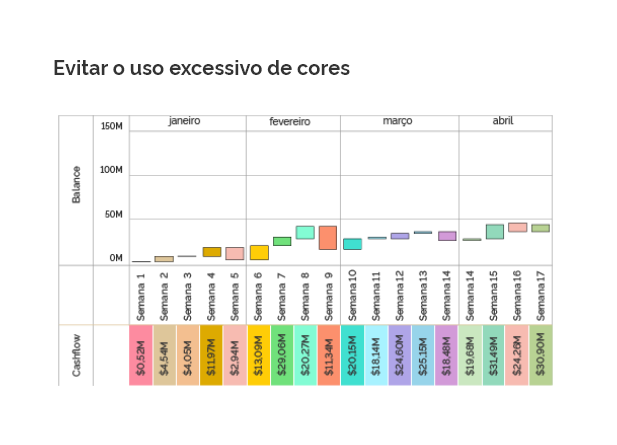
*Exemplo de uso excessivo de cores em um gráfico*

###### 3.3- Escolha as cores que se assemelham ao seu significado

Sempre que possível, opte por utilizar cores que sejam facilmente associados, psicologicamente, aos tópicos abordados no gráfico, como por exemplo: Barras azuis representando os oceanos e rios e verdes para representar as florestas e marrom para terra, respectivamente. A exploração dessas associações pode tornar seus gráficos mais eficientes.
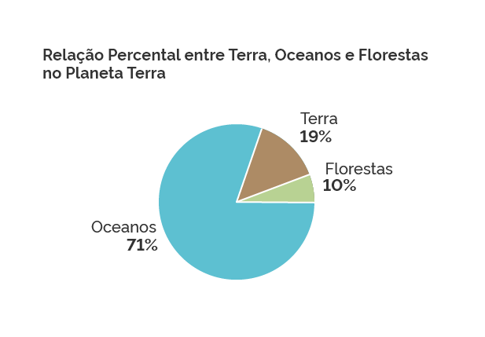
*Exemplo do uso de cores em gráficos associando-os com as cores do mundo real*

**Obs.:** Para facilitar na escolha dos tons que serão utilizados, sugerimos uma pesquisa prévia sobre o tema "Psicologia das Cores".

###### 3.4- Cuidado ao usar cores vibrantes

Evite misturar dois tons quentes e predominantes na aparência geral de um painel de gráficos. É importante equilibrar cores de tons quentes com cores em tons frios. Por exemplo, se você estiver criando um gráfico de pizza, use cores diferentes nas seções próximas.

Caso opte por uma cor quente, use-a para dar destaques a elementos que reforçarão as informações importantes de cada gráfico.

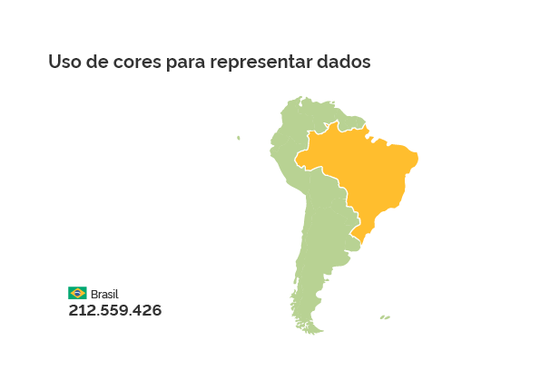
*Exemplo de uso de cor vibrante para ressaltar uma informação importante*

###### 3.5- Cuidados ao usar cores monocromáticas

Utilizar uma grande quantidade de variação para uma mesma cor, pode acarretar alguns problemas, tais como:

- Dificuldade em hierarquizar os dados;
- Dificuldade em encontrar um bom contraste, tornando as opções de escolha muito limitada.

Esses problemas tendem a se agravar conforme o número de dados apresentados forem aumentando.

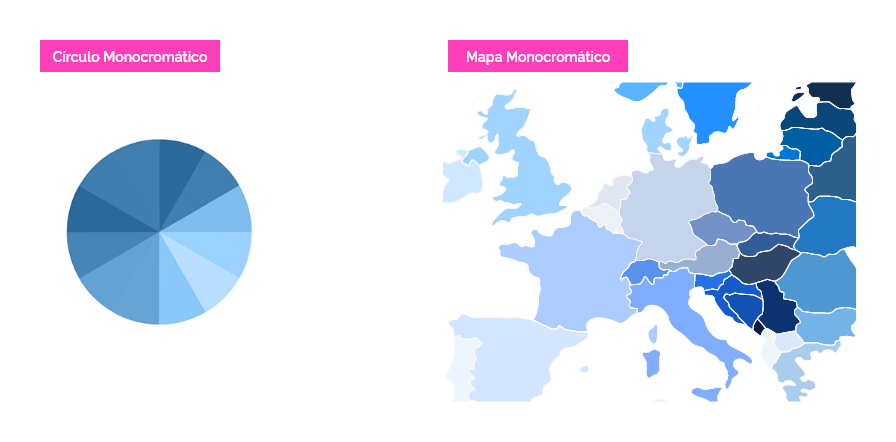
*Imagem de um círculo e mapa com cores monocromáticas*

**Obs.:**  Utilize esse modo de cor com cautela, pois, mesmo quando utilizado em conjunto com famílias de cores alternativas ou de famílias de cores com matizes próximas, pode acarretar os mesmos tipos de problema.

###### 3.6- Não tenha medo de testar

As cores podem ter diversos impactos na apresentação, o que você vai perceber é que muitas vezes vai estar confortável com uma paleta de cores e depois não a quer mais. Mude, veja o que cabe melhor para seu estilo de apresentação e dados.

Para auxiliar na escolha, varie entre as famílias de cores disponíveis no Design System. Estude sobre a utilização de aplicação de esquemas de cor, utilizando-se do círculo cromático, tais como:

- Cores Complementares;
- Cores Análogas;
- Cores Tríades;
- Cores Complementares Divididas;
- Cores Compostas em Tétrades;
- etc.

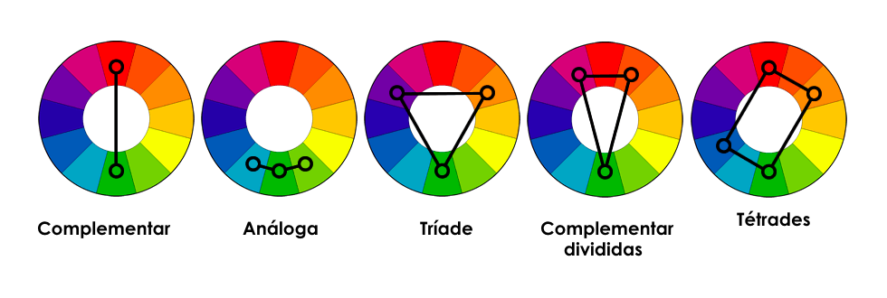
*Imagem de círculos cromáticos com 5 esquemas de cores diferentes.*

Essas técnicas fazem uso do círculo cromático através de esquemas de cores pré-definidas. Desta forma será possível utilizar as cores para enfatizar algumas descobertas e começar a criar narrativas. Recomendamos seu uso na definição das melhores combinações de cor, obtendo um melhor rendimento visual.

A boa aplicação desses esquemas, tende a ajudar o usuário na escolha das cores de forma consciente. É importante conhecê-los, suas vantagens e desvantagens de uso para uma correta aplicação.

O Design System disponibiliza uma extensa gama de cores para a utilização em todos os seus gráficos. Estes deverão ser utilizados sempre for que possível. Todas as cores estão disponíveis para uso no [Fundamento Cor](/ds/fundamentos-visuais/cores).

#### 4- Uso de elementos visuais

##### Símbolos em tabelas

As tabelas são usadas para mostrar informações detalhadas. Se usamos apenas cores, as informações podem se perder. Quando usamos símbolos em tabelas, conseguimos perceber as informações independentemente das cores.

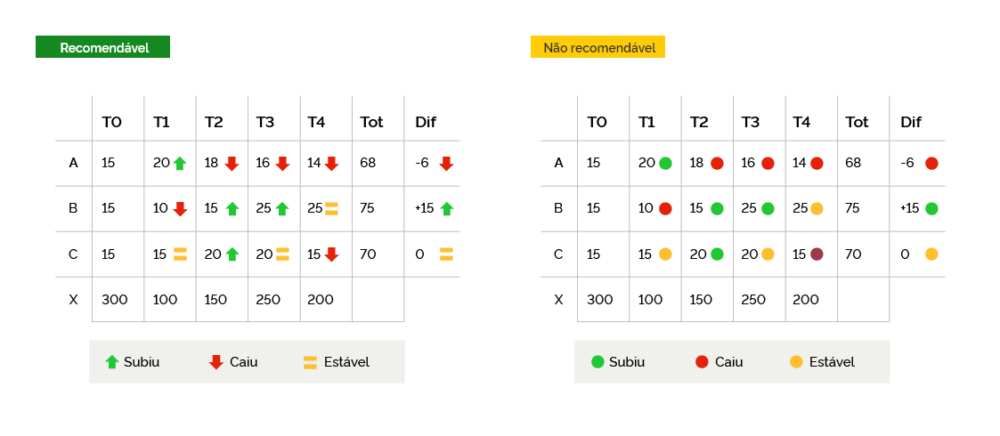
*Á esquerda,  uma tabela com símbolos em tons de verde, vermelho e amarelo que sinalizam se os valores subiram (seta para cima), caíram (seta para baixo) ou se mantiveram estáveis (sinal de igual). Á direita, uma tabela com círculos em tons de verde, vermelho e amarelo que sinalizam se os valores subiram, caíram ou se mantiveram estáveis.*

##### Padrões e texturas

Um alternativa às cores pode ser o uso de texturas e padrões, como listras de diferentes posições.

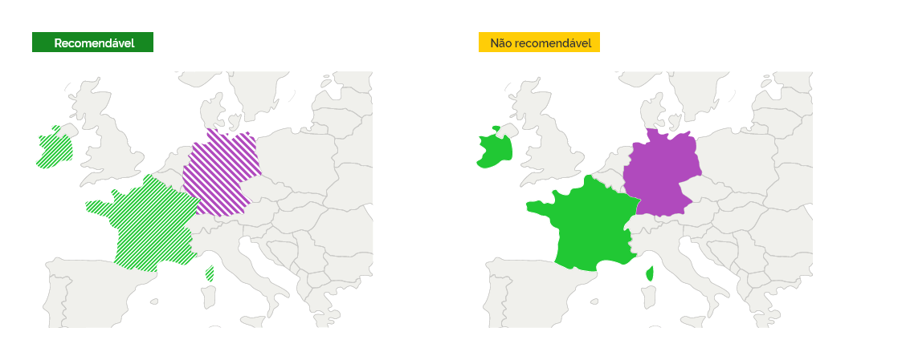
*À esquerda, um mapa da Europa com regiões destacadas em tons de verde e vermelho, cada uma com padrão de listras em direções opostas. À direita, um mapa da Europa com regiões destacadas em tons de verde e vermelho.*

##### Espaço em branco

Mesmo com legendas diretas, nem sempre é possível perceber a diferença entre as séries de um gráfico. Podemos incluir espaços em branco entre as séries para facilitar a distinção.

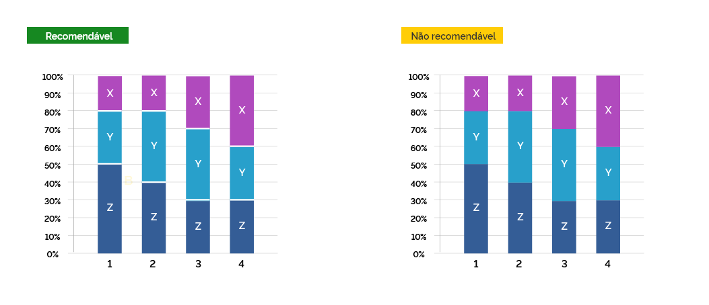
*À esquerda, um gráfico de colunas que mostra o percentual de três séries com cores parecidas, separadas por um contorno branco. À direita, um gráfico de colunas que mostra o percentual de três séries (X,Y,Z) com cores parecidas.*

##### Varie os traços e use formas (gráficos de linha)

Usamos gráficos de linha para mostrar a variação de séries ao longo do tempo. Se distinguimos as séries apenas por cor, as informações podem se perder. Podemos variar os traços e usar formas para facilitar a distinção.

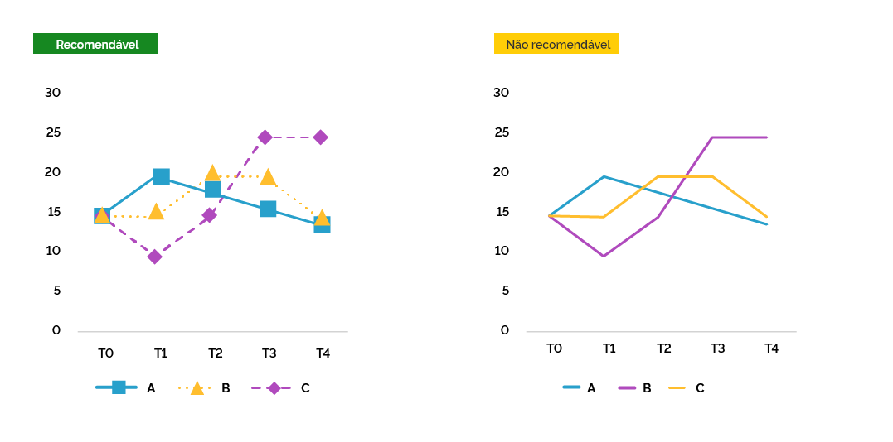
*Á esquerda um gráfico de linhas com três séries representadas por cores parecidas; cada série tem um padrão de traço e formas nos pontos (quadrado, losango, triângulo). Á direita um gráfico de linhas com três séries representadas por cores parecidas e legendas à parte.*

##### Formas (gráficos de dispersão)

Gráficos de dispersão são usados para mostrar a relação entre variáveis. Se distinguimos as séries apenas por cor, as informações podem se perder.
Podemos usar formas para facilitar a distinção.

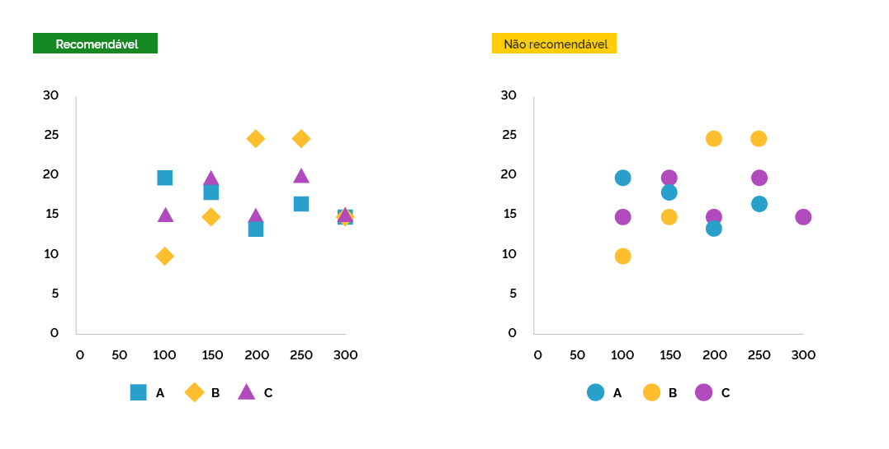
*Á esquerda, um gráfico de dispersão com três séries representadas por cores parecidas e formas diferentes (quadrado, losango, triângulo). Á direita, um gráfico de dispersão com três séries representadas por cores parecidas e círculos idênticos.*

#### 5- Use um simulador de condições visualização por tipo de deficiência para testes

Para garantir que seus gráficos não estejam apresentando problemas de acessibilidade visual, sempre que possível, que simulem as opte por realizar testes com ferramentas que simulem as condições de visualização por tipo de deficiência para corrigi-los.

Existem várias ferramentas para realização dessa tarefa, no entanto, sugerimos o uso da extensão **NoCoffee** no navegador Google Chrome. Basta escolher o tipo de condição visual  que você quer observar para que as páginas web apresentem as condição  de visualização escolhida. Ele simula condições de baixa visão, catarata, máculas, daltonismos entre outras deficiências visuais.

As recomendações aqui descritas não esgotam todas os detalhes para o desenvolvimentos de visualização de dados com Acessibilidade por meio de gráficos, tabelas, Infográficos ou Mapas  no entanto permite aos Designs e Desenvolvedores, quando devidamente observadas, tornar as suas soluções de apresentação visual de dados minimamente Acessíveis.

**Observação:** Atualmente existem soluções no mercado que torna a visualização de dados em condições completas de Acessibilidade, permitindo a exploração de gráficos através de navegação por teclado, uso natural com leitores de tela, visualização para pessoas com visão subnormal, comandos de visualização por voz, exportação tátil, sonificação, acessibilidade cognitiva, entre outras funcionalidades.

---

## Organizando gráficos

O componente *card* poderá ser utilizado para organizar a apresentação de todos os tipos de gráficos, auxiliando sua consistência e organização em tela. Esta forma de exibição poderá ser utilizado em todos os tipos de interface, mantendo ao máximo a consistência visual definida para o Design System.

Alguns comportamentos adicionais podem ser utilizados diretamente no *card*, deixando-o muito mais consistente e flexível a novas funcionalidades, tais como:

- O título e subtítulo do card poderão ser utilizados como título e subtítulo do gráfico, respectivamente;
- Adição de algum acionador para expansão e retração do *card* e conteúdo;
- inclusão de componentes para filtragem de dados, comandos que façam a função de ampliar e reduzir os detalhes das informações do gráfico;
- Uso de legenda para apresentação das fontes de dados e em alguns casos, visando facilitar a acessibilidade e o entendimento das informações. No exemplo abaixo, destacamos a retirada da "Área de Ações" e a adição da informação da fonte dos dados em forma de legenda.

Como descrito em acessibilidade, uma boa prática é fazer uso do texto descritivo, podendo ser adicionado ao *card* para facilitar o entendimento do gráfico e dos dados apresentados para pessoas que possuem alguma forma de déficit de atenção ou alguma dificuldade em interpretar com facilidade as informações apresentadas.

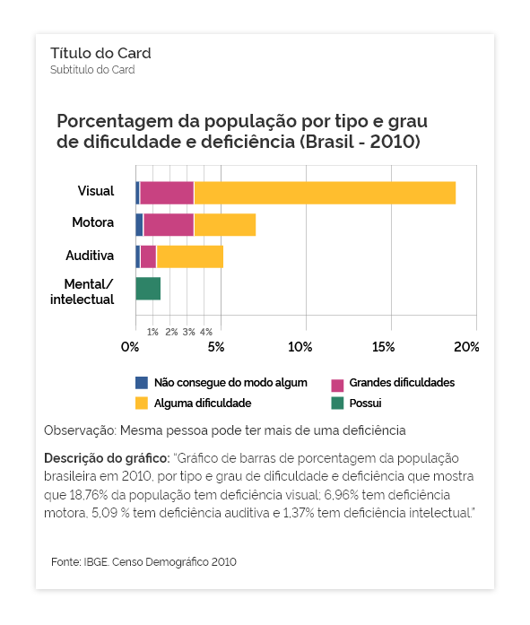
*Exemplo do uso de gráfico no componente card.*

---

## Painel de gráficos ou *dashboard*

Um painel de gráficos (*dashboard*) é uma área destinada a centralizar vários tipos de gráficos, permitindo uma comunicação clara dos principais objetivos e métricas apresentadas.

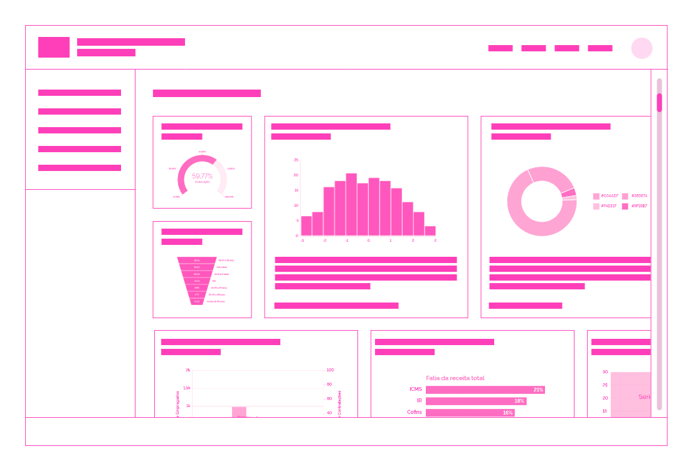
*Wireframe exemplificando um painel de gráficos*

Os painéis precisam ser consistentes, organizados e deverão apresentar as informações pelo seu grau de importância. Segue abaixo algumas dicas importantes para atingir este objetivo:

### Como projetar um painel de gráfico agradável

#### 1- Tenha objetivos claros

A primeira etapa corresponde em definir claramente as motivações para a apresentação dos seus gráficos. Tais como:

- Qual o seu objetivo?
- Público-alvo?
- Qual será o seu diferencial?

Com essas informações, será mais fácil projetar um painel de gráficos organizados e assertivos.

#### 2- Inclua apenas o que for essencial

Todas os métricas apresentadas deverão estar relacionadas ao propósito principal do painel. Se os gráficos exibirem informações desnecessárias, ou seja, não apresentarem apenas o que for útil e essencial, sua compreensão será prejudicada, deixando os dados relevantes mais difíceis de encontrar, não importando como estes estarão organizados.

Ao adicionar qualquer métrica em seu painel, certificar-se de que:

- O propósito esteja bem definido;
- Seja de fácil entendimento;
- Tenha atualizações constantes;
- Haja variedade de informações para que o usuário consiga detectar tendências com facilidade.

**Obs.:** Caso seja indispensável organizar um conteúdo extenso, provavelmente será necessário a criação de mais de um painel.

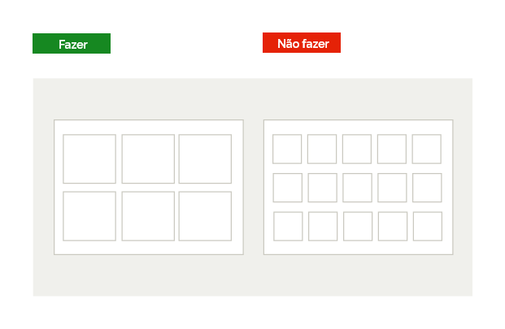
*Exemplo de uma melhor organização de um dashboard*

#### 3- Crie hierarquia através de tamanho e posicionamento

Use o tamanho e a posição para enfatizar as informações importantes, ajudando a criar padrões e fluxo visual, reduzindo ao máximo a atenção do usuário sobre as métricas que precisarão ser examinados com menos frequência.

Em termos de posicionamento, o canto superior esquerdo do seu painel é o melhor local, pois é onde seus olhos são naturalmente atraídos primeiro.  Não tenha medo do espaço vazio. É melhor sair uma lacuna do que fazer algo maior apenas para preenchê-la.

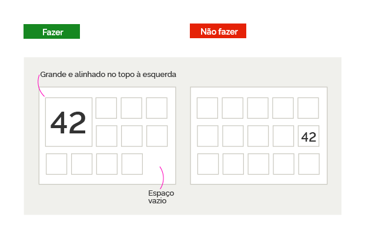
*Exemplo hierarquia por tamanho e  posicionamento em um dashboard.*

#### 4- Dê contexto aos seus números

Sempre que possível, incluía dados complementares dando contexto ao valor apresentado, mostrando como a métrica é acompanhada por um período mais longo. Tais como:

- Inclua a mesma métrica apresentada no dia anterior;
- Adicionar um gráfico de linha ou de coluna mostrando como a métrica é acompanhada por um período mais longo;
- Incluir uma meta e seu progresso atual;
- Adicionar avisos para quando uma métrica estiver acima ou abaixo de um determinado limite para facilitar a localização de problemas.

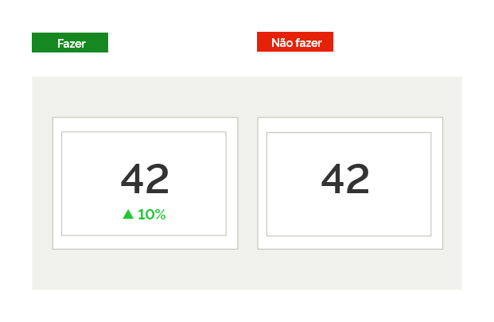
*Exemplo contexto numérico em um painel de dashboard*

#### 5- Agrupe as métricas que estejam relacionadas

Posicionar as informações em seu painel de forma logica é essencial. Agrupar por proximidade de métricas relacionando uns com os outros, torna-os mais fáceis de encontrar, além de deixar o design do seu painel mais atraente.

Existem muitas maneiras diferentes de agrupar, por exemplo: por métrica, produto, marca, campanha, região, equipe ou até mesmo tempo período. Você pode precisar experimentar com quais é o mais apropriado para seu *dashboard*. Atribuir um título aos grupos torna-os mais fáceis de identificar.

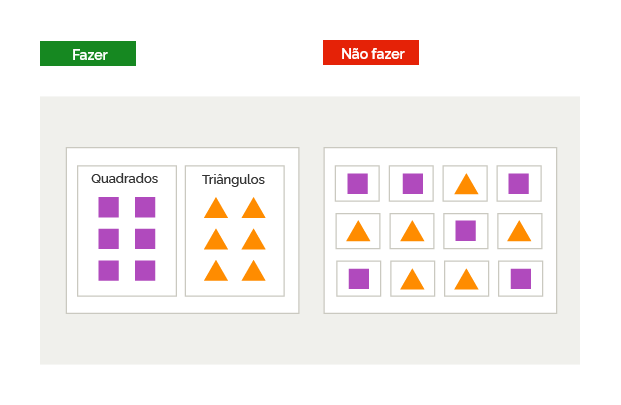
*Exemplo agrupamento de elementos em um dashboard.*

#### 6- Seja consistente

Com muitos painéis, você descobrirá que poderá existir elementos em repetição, por exemplo, você pode estar mostrando o mesmo conjunto de métricas para várias coisas. Seu painel será muito mais fácil de ler se você usar as mesmas visualizações e layouts entre os grupos. Ele também parecerá muito mais agradável, portanto, evite a tentação de usar gráficos diferentes em painés que fazem as mesmas coisas.

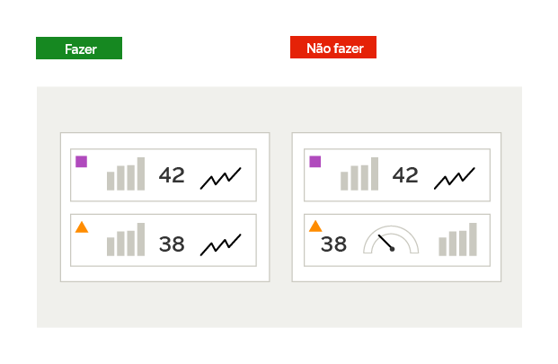
*Exemplo layout consistente em um dashboard.*

#### 7- Utilize rótulos claros e diretos

Utilize rótulos claros e auto explicativos. Ao mesmo tempo, você deve tentar mantê-los o mais curto possível para evitar bagunçar seus painéis e atrapalhar os dados apresentados.

A utilização de abreviações também podem ser úteis, contanto que seu público possa entendê-los. Por exemplo:

- “7d” ao invés de "7 dias";
- Símbolos como "%" podem substituir a palavra "porcentagem" por extenso;
- Utilizar uma definição mais curta para uma métrica se as pessoas já estiverem familiarizadas com ela.

#### 8- Faça aproximação numérica

Opte por fazer simplificações númericas, utilizando 3 (três) casas decimais ou aproximando seu valor excedente para o centavo mais próximo. Valores muito extensos criam distrações ao usuário, além disso, incluir muitos detalhes desnecessários podem transformar um pequeno detalhe em um grande problema.
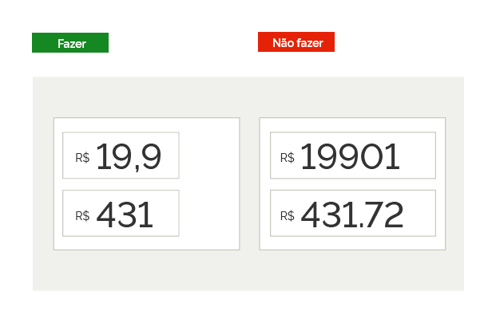
*Exemplo arredondamento de números em um dashboard.*

#### 9- Evolua seus painéis

Depois de criar seu painel, não o abandone. Obtenha feedback da sua equipe e dos usuários sempre que possível, tentando entender:

- O que eles procuram com mais frequência ou consideram mais útil e por quê?;
- O que eles nunca olham ou consideram menos útil, e por quê?;
- Se há algo faltando que eles considerem útil?.

---

## Outros comportamentos

### 1- Ação de expandir painel de gráfico (opcional)

Este recurso tem por finalidade ampliar todas as dimensões do gráfico (Area de Cabeçalho, Área Principal e Área de Rodapé), expandindo sua composição e facilitando sua visualização e entendimento geral dos dados. Este comportamento poderá ser utilizado em: links, botões, ícones, etc. Em alguns casos, a utilização desta funcionalidade será indispensável em situações onde haja uma quantidade excessiva de informação em alguns tipos de gráficos.

Ao acionar essa funcionalidade, automaticamente as informações contidas no gráfico serão expandidas e exibidas de forma ampla em tela. Para facilitar esse comportamento, deve-se recorrer a componentes que o auxiliem nessa tarefa, tais como: *card*, modal, pop-ups, uma nova página, etc.

Devem aparecer, de preferência, alinhados no centro da tela, apresentando o mesmo gráfico, porém em um tamanho maior e com uma melhor legibilidade.

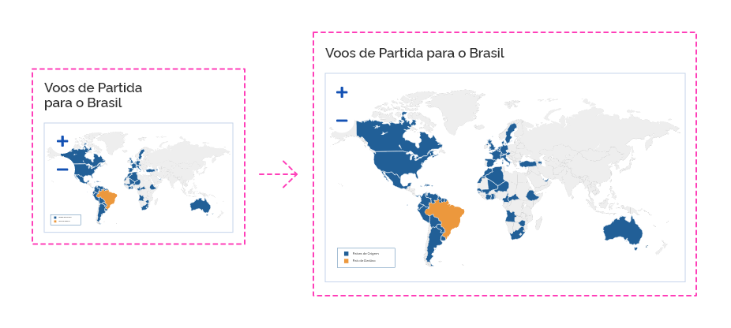
*Exemplo do uso da funcionalidade da expansão de um card.*

### 2- Ação de ampliar e reduzir visualização interna (opcional)

Esta funcionalidade visa ajudar o usuário, ampliando a visualização interna do conteúdo da Área Principal, permitindo que o usuário tenha uma visão mais detalhada das informações, sem alterar suas dimensões externas (altura e largura).

Este recurso, também conhecido como *zoom* é muito utilizado, por exemplo, na utilização de gráficos do tipo "mapa geográfico", onde as informações visuais tendem a ser densas e pequenas.

Entre os vários tipos de componentes que podem ser utilizados para esse objetivo, podemos, por exemplo, associar esta funcionalidade à botões, links, ícones, etc., com a funcionalidade de aproximação ou afastamento na busca de uma melhor visualização das informações.

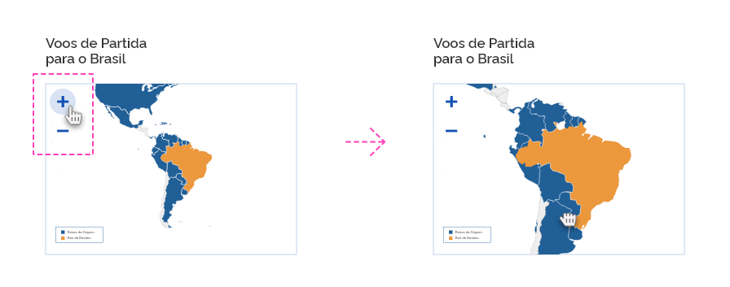
*Gráfico do Card sendo ampliado.*

### 3- Filtragem de dados (opcional)

É importante que, em alguns tipos de gráficos, se permita a filtragem das informações, permitindo que o usuário tenha total controle da apresentação dos dados através de um filtro ativo que facilite sua navegação e seu retorno ao estado anterior conforme seu interesse imediato.

Esta funcionalidade, normalmente, está diretamente relacionado ao tipo de gráfico e informação que se possa segmentar e navegar.

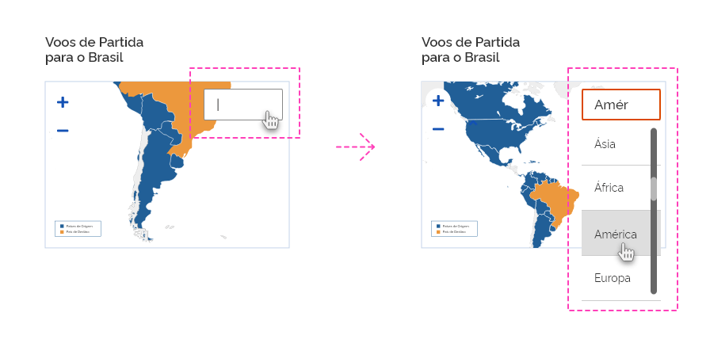
*Exemplo de filtragem de dados através de um componente select.*

### 4- Uso do *loading* para gráficos dinâmicos

Caso utilize gráficos dinâmicos, onde as informações são atualizadas em tempo real, sempre que os dados dos gráficos demorarem para atualizar, opte pelo uso do componente *loading* como  resposta temporária de *feedback* do sistema, evitando que o usuário fique em dúvidas quanto a atualização da informação.

Para maiores informações acesse: [componente *loading*](/ds/components/loading?tab=desenvolvedor)

---

## Referências

### Gráficos

- [geckoboard-dashboard-design-guide.pdf](https://serprodrive.serpro.gov.br/s/7DNtygdJcAzASST) | Formato PDF - 1,7 MB
- [Radiant-Advisors_GoodData_DataVisualizationCompetencyCenter.pdf](https://serprodrive.serpro.gov.br/s/ADccP4T8pCfmznt) | Formato PDF - 1,43 MB
- [The Ultimate Guide: Data Visualization vs. Storytelling with Data](https://blog.presentation-company.com/data-visualization-vs.-data-storytelling-whats-the-difference)
- [Color palettes and accessibility features for data visualization](https://medium.com/carbondesign/color-palettes-and-accessibility-features-for-data-visualization-7869f4874fca)
- [Accessible Color Use and Color Contrast](https://accessibility.oit.ncsu.edu/accessible-color-and-color-contrast/)
- [Tipos de gráficos: um guia simples para ajudar você a escolher o formato ideal](http://blog.coletum.com/tipos-de-graficos/)
- [Como aplicar a Teoria das Cores e os 6 Esquemas de Cores](https://temporalcerebral.com.br/como-aplicar-a-harmonia-das-cores-no-design-grafico/)
- [Use cores personalizadas no gráfico para refletir sua marca e dar vida aos dados da sua pesquisa](https://pt.surveymonkey.com/curiosity/use-cores-personalizadas-no-grafico-para-refletir-sua-marca-e-dar-vida-aos-dados-da-sua-pesquisa/)
- [Como as cores facilitam o entendimento de um gráfico](https://amplix.net/como-as-cores-facilitam-o-entendimento-de-um-grafico/)
- [Combinar e escolher cores para o Design Gráfico: Dicas](https://www.elaborata.com.br/blog/2018/06/07/combinar-e-escolher-cores-para-o-design-grafico-dicas/)
- [5 passos para criar um Diagrama de Dispersão assertivo](https://pt.venngage.com/blog/diagrama-de-dispersao/)
- [Crie um gráfico de bolha](https://infogram.com/pt/criar/grafico-de-bolhas)

### Acessibilidade

- [Transtorno do Espectro Autista (TEA) e uso de cores e textos](http://talitapagani.com/gaia/g1-recomendacao-1/)
- [Acessibilidade de visualização de dados: onde estamos agora e o que vem ?](https://medium.com/nightingale/data-visualization-accessibility-where-are-we-now-and-whats-next-b2c9eeac4e8b)
- [Recomendações e padrões para acessibilidade de SVG](https://www.w3.org/wiki/SVG_Accessibility)
- [Como seus leitores daltônicos e deficientes visuais veem suas cores - Parte1](https://blog.datawrapper.de/colorblindness-part1/)
- [Como seus leitores daltônicos e deficientes visuais veem suas cores - Parte2](https://blog.datawrapper.de/colorblindness-part2/)
- [Como seus leitores daltônicos e deficientes visuais veem suas cores - Parte3](https://blog.datawrapper.de/colorblindness-part3/)
- [Data visualization for color accessibility](https://uxdesign.cc/data-visualization-for-color-accessibility-8a30ce25d90b)
- [Charts & Accessibility](https://accessibility.psu.edu/images/charts/)
- [Como escrever textos alternativos de gráficos](https://medium.com/nightingale/como-escrever-textos-alternativos-de-gr%C3%A1ficos-7a5ead229822)
- [Acessibilidade: o impacto das cores](https://brasil.uxdesign.cc/acessibilidade-o-impacto-das-cores-bfc0d60420db)
- [Dez dicas para deixar sua visualização de dados mais acessível](https://medium.com/datavizbr/dez-dicas-para-deixar-sua-visualiza%C3%A7%C3%A3o-de-dados-mais-acess%C3%ADvel-bf884895812d)
- [Highcharts for Accessibility](https://www.highcharts.com/blog/accessibility/)
